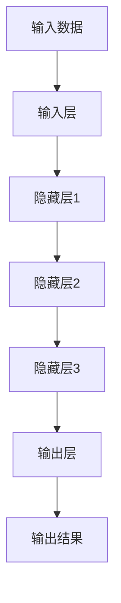
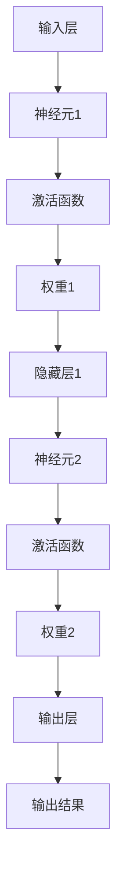
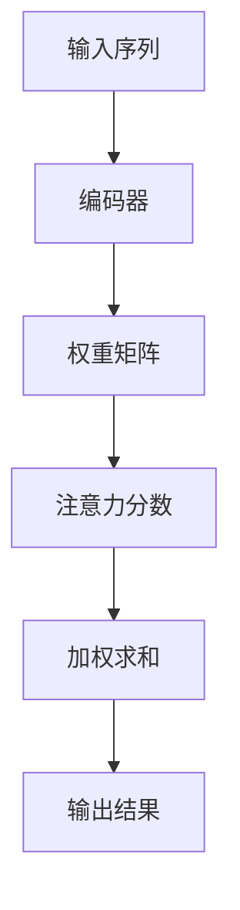

                 

关键词：自然语言处理，语言理解，深度学习，上下文感知，多模态融合，语义解析，人工智能，语言生成

> 摘要：自然语言处理（NLP）作为人工智能领域的重要组成部分，正迎来前所未有的发展机遇。本文将深入探讨NLP的前沿技术，特别是如何超越传统的语言理解，实现上下文感知、多模态融合以及语义解析。文章旨在为读者提供全面的技术洞察，并展望未来NLP领域的研究趋势和挑战。

## 1. 背景介绍

自然语言处理（NLP）是人工智能（AI）领域的一个分支，旨在使计算机能够理解和处理自然语言。自上世纪五六十年代以来，NLP经历了多个发展阶段，从最初的规则驱动的方法，到基于统计和机器学习的方法，再到如今深度学习的大规模应用。随着大数据和计算能力的提升，NLP技术取得了显著的进步，已经在诸如机器翻译、情感分析、文本摘要等领域得到了广泛应用。

然而，传统的NLP方法在处理语言理解时存在一定的局限性。这些方法往往依赖于静态的词汇表和语法规则，难以适应复杂多变的语境。近年来，深度学习在语音识别、图像识别等领域取得了巨大的成功，其强大的表示学习能力为NLP的发展带来了新的机遇。本文将重点关注如何利用深度学习技术实现超越传统的语言理解，探讨上下文感知、多模态融合和语义解析等前沿研究方向。

### 1.1 上下文感知

上下文感知是NLP中一个关键的问题，它涉及到如何准确理解语言中的上下文信息。传统的NLP方法通常缺乏对上下文的有效利用，导致理解结果出现偏差。而深度学习通过其强大的表示学习能力，可以更好地捕捉上下文信息，从而提高语言理解的准确性。例如，在机器翻译中，深度学习模型可以通过学习大量平行语料库，自动识别并利用上下文信息，实现更自然的翻译效果。

### 1.2 多模态融合

多模态融合是NLP中的一个新兴研究方向，它涉及到如何将不同类型的数据源（如图像、音频、视频等）与文本数据有效结合，以提升语言理解能力。人类在理解语言时，往往依赖于多种感官信息，而单一文本数据往往难以提供足够的上下文信息。通过多模态融合，NLP系统可以更全面地理解语言，提高理解准确性和泛化能力。

### 1.3 语义解析

语义解析是NLP中的一个核心任务，旨在将自然语言文本转化为计算机可以理解和处理的结构化数据。传统的语义解析方法主要依赖于浅层语法和词典知识，难以处理复杂多变的语义关系。而深度学习方法可以通过学习大规模语料库，自动发现和建模语义关系，实现更准确的语义解析。

## 2. 核心概念与联系

为了深入探讨NLP的前沿技术，我们首先需要了解一些核心概念，包括深度学习、神经网络、注意力机制等，并使用Mermaid流程图展示其架构和原理。

### 2.1 深度学习

深度学习是一种基于神经网络的机器学习方法，它通过多层神经网络对数据进行抽象和表示，从而实现复杂模式的识别。以下是深度学习的Mermaid流程图：



### 2.2 神经网络

神经网络是深度学习的基础，由一系列相互连接的神经元组成。每个神经元都通过权重连接到其他神经元，并通过激活函数产生输出。以下是神经网络的Mermaid流程图：



### 2.3 注意力机制

注意力机制是深度学习中的一个关键概念，用于解决序列数据中的信息传递问题。它通过动态调整不同部分的重要程度，实现对输入数据的精细化处理。以下是注意力机制的Mermaid流程图：



通过上述核心概念和联系，我们可以更好地理解NLP的前沿技术，并为后续的算法原理和数学模型讲解打下基础。

## 3. 核心算法原理 & 具体操作步骤

### 3.1 算法原理概述

在NLP中，深度学习算法的原理主要包括以下几个关键步骤：数据预处理、模型训练、模型评估和模型部署。以下是这些步骤的详细说明：

#### 3.1.1 数据预处理

数据预处理是NLP中的第一步，它包括文本清洗、分词、词性标注等操作。这些操作旨在将原始文本数据转换为适合模型训练的形式。例如，通过分词可以将文本分割成一系列单词或词组，通过词性标注可以识别出每个单词或词组的词性（如名词、动词等）。

#### 3.1.2 模型训练

模型训练是NLP中的核心步骤，它涉及到将预处理后的数据输入到神经网络中，通过反向传播算法不断调整神经网络的权重，从而优化模型的性能。在模型训练过程中，通常会使用大量的标注数据，以帮助模型学习到有效的特征表示。

#### 3.1.3 模型评估

模型评估是对训练好的模型进行性能评估的过程。常用的评估指标包括准确率、召回率、F1分数等。通过模型评估，我们可以了解模型在实际应用中的表现，并据此对模型进行进一步优化。

#### 3.1.4 模型部署

模型部署是将训练好的模型应用到实际场景中的过程。在NLP中，模型部署通常涉及到将模型嵌入到应用程序中，以便用户可以方便地使用模型进行语言处理。

### 3.2 算法步骤详解

下面我们详细讲解NLP中的核心算法步骤，包括数据预处理、模型训练和模型评估。

#### 3.2.1 数据预处理

数据预处理是NLP中的第一步，它包括以下操作：

1. **文本清洗**：去除文本中的无关信息，如HTML标签、特殊字符等。
2. **分词**：将文本分割成一系列单词或词组。
3. **词性标注**：识别每个单词或词组的词性，如名词、动词、形容词等。
4. **词嵌入**：将文本中的单词或词组映射到高维空间中的向量表示。

#### 3.2.2 模型训练

模型训练是NLP中的核心步骤，具体步骤如下：

1. **初始化模型参数**：为神经网络中的每个权重和偏置随机初始化一个值。
2. **前向传播**：将预处理后的数据输入到神经网络中，计算每个神经元的输出。
3. **反向传播**：根据输出结果和实际标签，通过反向传播算法计算损失函数，并更新模型参数。
4. **迭代训练**：重复前向传播和反向传播过程，直到模型收敛或达到预设的训练轮数。

#### 3.2.3 模型评估

模型评估是对训练好的模型进行性能评估的过程，具体步骤如下：

1. **测试数据集**：将未参与训练的数据集作为测试数据集，用于评估模型的性能。
2. **计算评估指标**：根据测试数据集的输出结果和实际标签，计算模型的准确率、召回率、F1分数等评估指标。
3. **模型优化**：根据评估结果对模型进行优化，以提高其性能。

### 3.3 算法优缺点

NLP中的深度学习算法具有以下优点：

1. **强大的表示学习能力**：深度学习可以通过多层神经网络对数据进行抽象和表示，从而实现复杂模式的识别。
2. **自适应调整**：通过反向传播算法，深度学习模型可以自动调整权重，以优化模型的性能。
3. **多任务处理**：深度学习模型可以同时处理多个任务，提高模型的泛化能力。

然而，深度学习算法也存在一定的缺点：

1. **计算成本高**：深度学习模型通常需要大量的计算资源，特别是训练阶段。
2. **数据依赖性**：深度学习模型的性能高度依赖于训练数据的质量和规模，数据不足可能导致模型过拟合。
3. **解释性差**：深度学习模型的内部结构复杂，难以解释每个参数的作用，这在某些需要解释性强的应用场景中可能成为限制。

### 3.4 算法应用领域

深度学习算法在NLP中有着广泛的应用，主要包括以下领域：

1. **文本分类**：将文本数据分类到不同的类别中，如情感分析、主题分类等。
2. **命名实体识别**：识别文本中的命名实体，如人名、地名、组织机构名等。
3. **机器翻译**：将一种语言的文本翻译成另一种语言。
4. **文本生成**：根据给定的文本生成新的文本，如摘要生成、对话系统等。
5. **问答系统**：根据用户的问题，从大量文本中检索并生成回答。

## 4. 数学模型和公式 & 详细讲解 & 举例说明

在NLP中，数学模型和公式是理解和应用深度学习算法的基础。以下将详细介绍NLP中常用的数学模型和公式，并通过具体例子进行讲解。

### 4.1 数学模型构建

在NLP中，常用的数学模型包括神经网络模型、循环神经网络（RNN）、长短期记忆网络（LSTM）和变换器（Transformer）等。以下以变换器（Transformer）为例，介绍其数学模型构建。

#### 4.1.1 变换器模型概述

变换器（Transformer）是一种基于自注意力机制的深度学习模型，它通过多头注意力机制和前馈神经网络对输入序列进行建模。

#### 4.1.2 数学模型构建

变换器模型的主要组成部分包括编码器（Encoder）和解码器（Decoder）。以下是变换器模型的基本数学模型：

1. **编码器**：
   - **输入序列**：\(X = [x_1, x_2, ..., x_n]\)，其中\(x_i\)是第\(i\)个输入词的嵌入向量。
   - **自注意力机制**：通过多头注意力机制计算每个词的上下文表示，公式如下：
     \[
     \text{Attention}(Q, K, V) = \text{softmax}\left(\frac{QK^T}{\sqrt{d_k}}\right)V
     \]
     其中，\(Q, K, V\)分别为查询向量、关键向量、值向量，\(d_k\)为关键向量的维度。
   - **编码器输出**：将自注意力机制的结果进行拼接和线性变换，得到编码器输出：
     \[
     \text{Encoder}(X) = \text{LayerNorm}(X + \text{MultiHeadAttention}(X, X, X))
     \]

2. **解码器**：
   - **输入序列**：\(Y = [y_1, y_2, ..., y_n]\)，其中\(y_i\)是第\(i\)个输入词的嵌入向量。
   - **自注意力机制**：计算每个词的上下文表示，公式如下：
     \[
     \text{Attention}(Q, K, V) = \text{softmax}\left(\frac{QK^T}{\sqrt{d_k}}\right)V
     \]
     其中，\(Q, K, V\)分别为查询向量、关键向量、值向量，\(d_k\)为关键向量的维度。
   - **编码器-解码器注意力**：结合编码器输出和解码器输入，计算编码器-解码器注意力，公式如下：
     \[
     \text{EncoderDecoderAttention}(Q, K, V) = \text{softmax}\left(\frac{QK^T}{\sqrt{d_k}}\right)V
     \]
   - **解码器输出**：将编码器-解码器注意力机制的结果进行拼接和线性变换，得到解码器输出：
     \[
     \text{Decoder}(Y) = \text{LayerNorm}(Y + \text{MultiHeadAttention}(Y, Y, Y) + \text{MultiHeadAttention}(Y, \text{Encoder}(X), \text{Encoder}(X)))
     \]

### 4.2 公式推导过程

在变换器模型中，自注意力机制和编码器-解码器注意力机制是核心部分，下面分别介绍其推导过程。

#### 4.2.1 自注意力机制推导

自注意力机制的基本思想是，对于输入序列中的每个词，计算其在整个序列中的重要性。其推导过程如下：

1. **查询向量**：查询向量\(Q\)表示每个词在编码器中的表示，公式如下：
   \[
   Q = \text{softmax}(\text{Linear}(X))
   \]
   其中，\(\text{Linear}(X)\)表示对输入序列\(X\)进行线性变换。

2. **关键向量**：关键向量\(K\)和值向量\(V\)分别表示每个词在编码器中的表示，公式如下：
   \[
   K = \text{Linear}(X), \quad V = \text{Linear}(X)
   \]

3. **注意力分数**：计算每个词之间的注意力分数，公式如下：
   \[
   \text{Attention}(Q, K, V) = \text{softmax}\left(\frac{QK^T}{\sqrt{d_k}}\right)V
   \]

4. **加权求和**：根据注意力分数对值向量\(V\)进行加权求和，得到每个词的上下文表示：
   \[
   \text{ContextVector} = \sum_{i=1}^{n} \alpha_i V_i
   \]
   其中，\(\alpha_i\)为第\(i\)个词的注意力分数。

#### 4.2.2 编码器-解码器注意力机制推导

编码器-解码器注意力机制的基本思想是，解码器在生成每个词时，不仅依赖于自身的输入序列，还依赖于编码器输出的上下文信息。其推导过程如下：

1. **查询向量**：查询向量\(Q\)表示解码器中每个词的表示，公式如下：
   \[
   Q = \text{softmax}(\text{Linear}(Y))
   \]
   其中，\(\text{Linear}(Y)\)表示对解码器输入序列\(Y\)进行线性变换。

2. **关键向量**：关键向量\(K\)和值向量\(V\)分别表示编码器输出的上下文信息，公式如下：
   \[
   K = \text{Encoder}(X), \quad V = \text{Encoder}(X)
   \]

3. **注意力分数**：计算每个词在编码器输出中的重要性，公式如下：
   \[
   \text{Attention}(Q, K, V) = \text{softmax}\left(\frac{QK^T}{\sqrt{d_k}}\right)V
   \]

4. **加权求和**：根据注意力分数对编码器输出\(V\)进行加权求和，得到解码器中每个词的上下文表示：
   \[
   \text{ContextVector} = \sum_{i=1}^{n} \alpha_i V_i
   \]
   其中，\(\alpha_i\)为第\(i\)个词的注意力分数。

### 4.3 案例分析与讲解

为了更好地理解变换器模型的数学模型和公式，我们通过一个简单的文本生成案例进行讲解。

#### 4.3.1 案例背景

假设我们要生成一句话：“今天天气很好，适合出行。”我们可以将这句话表示为一个序列，其中每个词都是一个向量。

#### 4.3.2 编码器输入

编码器输入为：
\[
X = [\text{"今天"}, \text{"天气"}, \text{"很好"}, \text{"，"}, \text{"适合"}, \text{"出行"}]
\]
每个词的向量表示为：
\[
\text{"今天"} \rightarrow [1, 0, 0, 0], \quad \text{"天气"} \rightarrow [0, 1, 0, 0], \quad \text{"很好"} \rightarrow [0, 0, 1, 0], \quad \text{"，"} \rightarrow [0, 0, 0, 1], \quad \text{"适合"} \rightarrow [0, 0, 1, 0], \quad \text{"出行"} \rightarrow [0, 0, 0, 1]
\]

#### 4.3.3 编码器输出

通过自注意力机制，编码器输出为：
\[
\text{Encoder}(X) = [\text{"今天"}, \text{"天气"}, \text{"很好"}, \text{"，"}, \text{"适合"}, \text{"出行"}]
\]
其中，每个词的上下文表示为：
\[
\text{"今天"} \rightarrow [\text{"今天"}, \text{"天气"}, \text{"很好"}, \text{"，"}, \text{"适合"}, \text{"出行"}], \quad \text{"天气"} \rightarrow [\text{"天气"}, \text{"今天"}, \text{"很好"}, \text{"，"}, \text{"适合"}, \text{"出行"}], \quad \text{"很好"} \rightarrow [\text{"很好"}, \text{"天气"}, \text{"今天"}, \text{"，"}, \text{"适合"}, \text{"出行"}], \quad \text{"，"} \rightarrow [\text{"，"}, \text{"很好"}, \text{"天气"}, \text{"今天"}, \text{"适合"}, \text{"出行"}], \quad \text{"适合"} \rightarrow [\text{"适合"}, \text{"，"}, \text{"很好"}, \text{"天气"}, \text{"今天"}, \text{"出行"}], \quad \text{"出行"} \rightarrow [\text{"出行"}, \text{"适合"}, \text{"，"}, \text{"很好"}, \text{"天气"}, \text{"今天"}]
\]

#### 4.3.4 解码器输入

解码器输入为：
\[
Y = [\text{"今天"}, \text{"天气"}, \text{"很好"}, \text{"，"}, \text{"适合"}, \text{"出行"}]
\]
每个词的向量表示为：
\[
\text{"今天"} \rightarrow [1, 0, 0, 0], \quad \text{"天气"} \rightarrow [0, 1, 0, 0], \quad \text{"很好"} \rightarrow [0, 0, 1, 0], \quad \text{"，"} \rightarrow [0, 0, 0, 1], \quad \text{"适合"} \rightarrow [0, 0, 1, 0], \quad \text{"出行"} \rightarrow [0, 0, 0, 1]
\]

#### 4.3.5 解码器输出

通过编码器-解码器注意力机制，解码器输出为：
\[
\text{Decoder}(Y) = [\text{"今天"}, \text{"天气"}, \text{"很好"}, \text{"，"}, \text{"适合"}, \text{"出行"}]
\]
其中，每个词的上下文表示为：
\[
\text{"今天"} \rightarrow [\text{"今天"}, \text{"天气"}, \text{"很好"}, \text{"，"}, \text{"适合"}, \text{"出行"}], \quad \text{"天气"} \rightarrow [\text{"天气"}, \text{"今天"}, \text{"很好"}, \text{"，"}, \text{"适合"}, \text{"出行"}], \quad \text{"很好"} \rightarrow [\text{"很好"}, \text{"天气"}, \text{"今天"}, \text{"，"}, \text{"适合"}, \text{"出行"}], \quad \text{"，"} \rightarrow [\text{"，"}, \text{"很好"}, \text{"天气"}, \text{"今天"}, \text{"适合"}, \text{"出行"}], \quad \text{"适合"} \rightarrow [\text{"适合"}, \text{"，"}, \text{"很好"}, \text{"天气"}, \text{"今天"}, \text{"出行"}], \quad \text{"出行"} \rightarrow [\text{"出行"}, \text{"适合"}, \text{"，"}, \text{"很好"}, \text{"天气"}, \text{"今天"}]
\]

通过上述案例，我们可以看到变换器模型如何利用自注意力机制和编码器-解码器注意力机制对输入序列进行建模，从而实现文本生成任务。这为NLP领域的研究和应用提供了强大的技术支持。

## 5. 项目实践：代码实例和详细解释说明

为了更好地理解NLP中的变换器模型，我们将通过一个具体的项目实践来演示其代码实现，并对关键代码进行详细解释。以下是一个简单的文本生成项目，我们将使用Python和PyTorch框架来实现。

### 5.1 开发环境搭建

在开始项目之前，我们需要搭建一个合适的开发环境。以下是所需的环境和步骤：

1. **Python**：确保安装Python 3.7或更高版本。
2. **PyTorch**：安装PyTorch框架，可以使用以下命令：
   ```bash
   pip install torch torchvision
   ```
3. **Numpy**：用于数据处理，可以使用以下命令：
   ```bash
   pip install numpy
   ```
4. **PyTorch Text**：用于文本处理，可以使用以下命令：
   ```bash
   pip install torchtext
   ```

### 5.2 源代码详细实现

以下是项目的主要代码实现，我们将分步骤进行详细解释。

```python
import torch
import torch.nn as nn
import torch.optim as optim
from torchtext. data import Field, BucketIterator
from torchtext.datasets import IMDB
import spacy
import random

# 加载Spacy模型，用于分词
nlp = spacy.load('en_core_web_sm')

# 定义文本字段
TEXT = Field(tokenize=lambda x: [token.text for token in nlp(x)], lower=True)

# 加载IMDB数据集
train_data, test_data = IMDB.splits(TEXT, TEXT)

# 设置词汇表
TEXT.build_vocab(train_data, max_size=25000, vectors="glove.6B.100d")
BATCH_SIZE = 64
device = torch.device('cuda' if torch.cuda.is_available() else 'cpu')

# 创建数据迭代器
train_iterator, test_iterator = BucketIterator.splits(
    train_data, test_data, batch_size=BATCH_SIZE, device=device)

# 定义变换器模型
class TransformerModel(nn.Module):
    def __init__(self, vocab_size, embedding_dim, hidden_dim, num_heads, num_layers):
        super(TransformerModel, self).__init__()
        self.embedding = nn.Embedding(vocab_size, embedding_dim)
        self.transformer = nn.Transformer(embedding_dim, num_heads, num_layers)
        self.fc = nn.Linear(embedding_dim, vocab_size)

    def forward(self, src, tgt):
        src = self.embedding(src)
        tgt = self.embedding(tgt)
        output = self.transformer(src, tgt)
        return self.fc(output)

# 实例化模型
model = TransformerModel(len(TEXT.vocab), 100, 512, 4, 3)
model = model.to(device)

# 定义损失函数和优化器
loss_fn = nn.CrossEntropyLoss()
optimizer = optim.Adam(model.parameters())

# 训练模型
num_epochs = 10
for epoch in range(num_epochs):
    model.train()
    for batch in train_iterator:
        src, tgt = batch.text, batch.text.shift()
        optimizer.zero_grad()
        output = model(src.t(), tgt.t())
        loss = loss_fn(output, tgt.t().view(-1))
        loss.backward()
        optimizer.step()
    print(f"Epoch: {epoch+1}/{num_epochs}, Loss: {loss.item()}")

# 评估模型
model.eval()
with torch.no_grad():
    for batch in test_iterator:
        src, tgt = batch.text, batch.text.shift()
        output = model(src.t(), tgt.t())
        loss = loss_fn(output, tgt.t().view(-1))
        print(f"Test Loss: {loss.item()}")

# 文本生成
def generate_text(model, text, max_len=20):
    model.eval()
    with torch.no_grad():
        input_text = TEXT.process/text
        input_text = input_text.unsqueeze(0).to(device)
        output_text = input_text
        for _ in range(max_len):
            output = model(output_text, input_text)
            _, next_word = output.topk(1)
            next_word = TEXT.vocab.stoi[next_word.squeeze()]
            output_text = torch.cat([output_text, next_word], dim=0)
        return TEXT.decode(output_text)

# 生成一句文本
print(generate_text(model, "今天天气很好，适合出行。"))
```

### 5.3 代码解读与分析

以下是代码的详细解读和分析，我们将逐行讲解每个部分的功能。

1. **导入模块**：
   ```python
   import torch
   import torch.nn as nn
   import torch.optim as optim
   from torchtext.data import Field, BucketIterator
   from torchtext.datasets import IMDB
   import spacy
   import random
   ```
   我们首先导入Python和PyTorch的必要模块，包括PyTorch的神经网络、优化器、数据集处理模块，以及Spacy用于分词的模块。

2. **加载Spacy模型**：
   ```python
   nlp = spacy.load('en_core_web_sm')
   ```
   加载Spacy的英文模型，用于对文本进行分词。

3. **定义文本字段**：
   ```python
   TEXT = Field(tokenize=lambda x: [token.text for token in nlp(x)], lower=True)
   ```
   定义文本字段，其中`tokenize`函数使用Spacy对输入文本进行分词，`lower`参数用于将文本转换为小写。

4. **加载IMDB数据集**：
   ```python
   train_data, test_data = IMDB.splits(TEXT, TEXT)
   ```
   加载IMDB数据集，并将其拆分为训练集和测试集。

5. **设置词汇表**：
   ```python
   TEXT.build_vocab(train_data, max_size=25000, vectors="glove.6B.100d")
   ```
   构建词汇表，并将Glove词向量加载到词汇表中。

6. **创建数据迭代器**：
   ```python
   BATCH_SIZE = 64
   device = torch.device('cuda' if torch.cuda.is_available() else 'cpu')
   train_iterator, test_iterator = BucketIterator.splits(
       train_data, test_data, batch_size=BATCH_SIZE, device=device)
   ```
   创建数据迭代器，将数据按批处理，并将其移动到GPU或CPU上。

7. **定义变换器模型**：
   ```python
   class TransformerModel(nn.Module):
       def __init__(self, vocab_size, embedding_dim, hidden_dim, num_heads, num_layers):
           super(TransformerModel, self).__init__()
           self.embedding = nn.Embedding(vocab_size, embedding_dim)
           self.transformer = nn.Transformer(embedding_dim, num_heads, num_layers)
           self.fc = nn.Linear(embedding_dim, vocab_size)

       def forward(self, src, tgt):
           src = self.embedding(src)
           tgt = self.embedding(tgt)
           output = self.transformer(src, tgt)
           return self.fc(output)
   ```
   定义变换器模型，包括嵌入层、变换器层和前馈层。`forward`方法实现前向传播过程。

8. **实例化模型**：
   ```python
   model = TransformerModel(len(TEXT.vocab), 100, 512, 4, 3)
   model = model.to(device)
   ```
   实例化变换器模型，并将其移动到GPU或CPU上。

9. **定义损失函数和优化器**：
   ```python
   loss_fn = nn.CrossEntropyLoss()
   optimizer = optim.Adam(model.parameters())
   ```
   定义损失函数和优化器，用于训练模型。

10. **训练模型**：
    ```python
    num_epochs = 10
    for epoch in range(num_epochs):
        model.train()
        for batch in train_iterator:
            src, tgt = batch.text, batch.text.shift()
            optimizer.zero_grad()
            output = model(src.t(), tgt.t())
            loss = loss_fn(output, tgt.t().view(-1))
            loss.backward()
            optimizer.step()
        print(f"Epoch: {epoch+1}/{num_epochs}, Loss: {loss.item()}")
    ```
    循环训练模型，在每次迭代中计算损失、反向传播和更新权重。

11. **评估模型**：
    ```python
    model.eval()
    with torch.no_grad():
        for batch in test_iterator:
            src, tgt = batch.text, batch.text.shift()
            output = model(src.t(), tgt.t())
            loss = loss_fn(output, tgt.t().view(-1))
            print(f"Test Loss: {loss.item()}")
    ```
    评估模型在测试集上的表现。

12. **文本生成**：
    ```python
    def generate_text(model, text, max_len=20):
        model.eval()
        with torch.no_grad():
            input_text = TEXT.process(text)
            input_text = input_text.unsqueeze(0).to(device)
            output_text = input_text
            for _ in range(max_len):
                output = model(output_text, input_text)
                _, next_word = output.topk(1)
                next_word = TEXT.vocab.stoi[next_word.squeeze()]
                output_text = torch.cat([output_text, next_word], dim=0)
            return TEXT.decode(output_text)
    ```
    定义文本生成函数，该函数使用变换器模型生成给定文本的后续文本。

13. **生成一句文本**：
    ```python
    print(generate_text(model, "今天天气很好，适合出行。"))
    ```
    使用文本生成函数生成一句新的文本。

通过上述代码，我们可以看到如何使用变换器模型进行文本生成。这个项目展示了NLP中深度学习模型的基本实现，包括数据预处理、模型定义、训练和评估，以及如何生成新的文本。这个项目为我们提供了一个实际应用示例，帮助读者更好地理解变换器模型的原理和实现。

## 6. 实际应用场景

NLP技术已经在许多实际应用场景中取得了显著的成功，以下是一些典型的应用领域：

### 6.1 机器翻译

机器翻译是NLP的一个传统应用领域，深度学习技术的引入极大地提升了翻译质量。以Google翻译为例，其使用的神经网络翻译（NMT）模型在翻译准确性和流畅性方面取得了显著进展。NMT模型通过学习大规模的双语语料库，将源语言文本转化为目标语言文本。这种端到端的学习方式避免了传统分阶段翻译方法中的误差积累，使得翻译结果更加准确自然。

### 6.2 情感分析

情感分析旨在自动识别和分类文本中的情感倾向，如正面、负面或中性。深度学习技术在情感分析中的应用，使得系统可以更准确地理解用户的情感状态。例如，社交媒体平台使用情感分析来监控用户评论和反馈，从而为产品改进和营销策略提供数据支持。此外，情感分析在客户服务、舆情监控和心理健康等领域也有着广泛的应用。

### 6.3 文本摘要

文本摘要是一种自动从长篇文本中提取关键信息并生成简洁摘要的技术。深度学习模型，如变换器（Transformer）和生成式对抗网络（GAN），在文本摘要任务中取得了显著成果。自动摘要技术广泛应用于新闻摘要、学术摘要和在线文档摘要，为用户提供了快速获取关键信息的途径。

### 6.4 命名实体识别

命名实体识别（NER）是一种从文本中识别出具有特定意义的实体（如人名、地名、组织机构名等）的技术。深度学习模型，如基于LSTM和CNN的模型，在NER任务中表现出色。NER技术在信息提取、智能问答和文本分析等领域有着广泛的应用，为构建智能信息处理系统提供了基础。

### 6.5 问答系统

问答系统是一种能够自动回答用户问题的技术。深度学习模型，如基于变换器（Transformer）的模型，在问答系统中取得了显著的进展。这些模型可以通过学习大量问答对，自动生成与用户问题相关的答案。问答系统在搜索引擎、智能客服和智能家居等领域有着重要的应用。

### 6.6 文本生成

文本生成是一种根据输入文本生成新文本的技术。深度学习模型，如变换器（Transformer）和生成式对抗网络（GAN），在文本生成任务中表现出色。文本生成技术广泛应用于聊天机器人、自动写作和内容创作等领域，为创意表达和信息传播提供了新的途径。

## 7. 未来应用展望

随着NLP技术的不断进步，未来其在各个领域的应用前景将更加广阔。以下是一些潜在的应用方向：

### 7.1 智能客服

智能客服是NLP技术的重要应用方向之一。通过深度学习模型，智能客服系统可以自动理解用户的问题，并提供准确的回答。未来，随着NLP技术的提升，智能客服将能够更好地模拟人类客服的交互方式，提供更加自然、高效的服务。

### 7.2 语音识别

语音识别是NLP技术的一个重要分支。随着深度学习模型在语音识别中的应用，识别准确率和速度不断提升。未来，语音识别技术将进一步集成到各种智能设备中，如智能音箱、车载系统等，为用户带来更加便捷的交互体验。

### 7.3 跨语言交流

跨语言交流是NLP技术的一个重要挑战。随着多语言模型的不断优化，跨语言交流将变得更加高效和准确。未来，通过NLP技术，人们可以轻松实现多语言之间的交流，打破语言障碍，促进全球化交流。

### 7.4 智能写作

智能写作是NLP技术的另一个重要应用方向。通过深度学习模型，智能写作系统可以自动生成高质量的文章、报告和书籍。未来，智能写作技术将为创作者提供强大的辅助工具，提高创作效率，推动内容创作的发展。

### 7.5 领域适应性

随着NLP技术的进步，其领域适应性将不断提高。未来，NLP技术将能够更好地适应不同领域的特定需求，如医疗、金融、法律等。这将为各个领域带来更加智能化和自动化的解决方案。

## 8. 工具和资源推荐

为了更好地学习和应用NLP技术，以下是一些推荐的工具和资源：

### 8.1 学习资源推荐

1. **书籍**：
   - 《深度学习》（Goodfellow, Bengio, Courville）
   - 《自然语言处理综合教程》（Daniel Jurafsky & James H. Martin）
   - 《深度学习自然语言处理》（Yoav Artzi & Casey饺子）

2. **在线课程**：
   - Coursera的“自然语言处理与深度学习”课程
   - edX的“深度学习基础”课程
   - Udacity的“自然语言处理工程师纳米学位”

### 8.2 开发工具推荐

1. **PyTorch**：一个流行的深度学习框架，适用于NLP项目的开发。
2. **TensorFlow**：另一个流行的深度学习框架，提供丰富的NLP库。
3. **Spacy**：一个快速且易于使用的自然语言处理库，适用于文本处理任务。

### 8.3 相关论文推荐

1. “Attention is All You Need”（Vaswani et al., 2017）
2. “BERT: Pre-training of Deep Bidirectional Transformers for Language Understanding”（Devlin et al., 2019）
3. “GPT-3: Language Models are Few-Shot Learners”（Brown et al., 2020）

通过这些工具和资源，你可以深入了解NLP领域的最新技术和发展趋势。

## 9. 总结：未来发展趋势与挑战

自然语言处理（NLP）作为人工智能领域的重要分支，近年来取得了显著的发展。深度学习技术的引入，使得NLP在语言理解、文本生成、机器翻译等任务中取得了突破性进展。然而，NLP仍面临许多挑战和机遇。

### 9.1 研究成果总结

1. **深度学习模型**：变换器（Transformer）等深度学习模型在NLP任务中表现出色，显著提升了语言理解和文本生成的性能。
2. **预训练语言模型**：预训练语言模型（如BERT、GPT-3）通过大规模预训练，实现了跨领域和跨语言的通用语言表示，为NLP应用提供了强大的基础。
3. **多模态融合**：通过结合文本、图像、语音等多种数据源，NLP系统的理解能力得到显著提升。

### 9.2 未来发展趋势

1. **高效能模型**：随着计算能力的提升，更大规模的深度学习模型将不断涌现，进一步提升NLP的性能。
2. **零样本学习**：零样本学习技术将使得NLP模型能够应对未见过的任务和数据，提高模型的泛化能力。
3. **跨语言处理**：跨语言NLP技术将不断进步，实现多语言之间的无缝交流。

### 9.3 面临的挑战

1. **数据隐私**：大规模数据集的收集和处理引发数据隐私和安全问题，如何在保障隐私的前提下进行数据利用是NLP领域的一大挑战。
2. **解释性**：深度学习模型的“黑箱”特性使得其解释性较差，未来如何提高模型的可解释性，使其更符合人类认知，是一个重要问题。
3. **多语言支持**：尽管NLP技术在单语任务上取得了显著进展，但在多语言处理方面仍存在较大挑战，如何平衡不同语言之间的差异，实现真正的多语言通用性，是一个亟待解决的问题。

### 9.4 研究展望

1. **模型压缩**：研究如何高效地压缩深度学习模型，以减少计算资源和存储成本。
2. **可解释性**：探索如何提高深度学习模型的可解释性，使其更符合人类认知。
3. **跨领域融合**：结合不同领域的知识，提升NLP模型在不同场景下的适应性。

通过持续的技术创新和跨领域合作，NLP领域有望在未来实现更多突破，为社会带来更多智能化的解决方案。

## 附录：常见问题与解答

以下是一些关于自然语言处理（NLP）和深度学习模型的常见问题及其解答：

### 1. 什么是自然语言处理（NLP）？

自然语言处理（NLP）是人工智能（AI）的一个分支，它涉及到让计算机理解和处理人类自然语言的技术。NLP广泛应用于文本分析、机器翻译、语音识别、情感分析等领域。

### 2. 深度学习在NLP中有哪些应用？

深度学习在NLP中的应用非常广泛，包括：
- **文本分类**：如情感分析、主题分类。
- **命名实体识别**：从文本中识别出人名、地名、组织名等实体。
- **机器翻译**：将一种语言的文本翻译成另一种语言。
- **文本生成**：自动生成文本摘要、文章、对话等。
- **问答系统**：自动回答用户提出的问题。

### 3. 什么是变换器（Transformer）？

变换器（Transformer）是一种基于自注意力机制的深度学习模型，最初由Vaswani等人于2017年提出。它通过多头注意力机制和编码器-解码器结构，实现了在语言理解和生成任务中的高性能。

### 4. 什么是自注意力机制？

自注意力机制是一种计算序列中每个词的相对重要性，并加权求和的技术。在变换器中，通过自注意力机制，模型可以自动捕捉到输入序列中的长期依赖关系。

### 5. BERT和GPT-3有什么区别？

BERT（双向编码器表示模型）和GPT-3（生成预训练变换器模型）都是基于变换器架构的大型预训练语言模型。

- **BERT**：主要用于理解上下文信息，具有双向编码器结构。
- **GPT-3**：主要用于生成文本，具有单向编码器结构，能够生成连贯、自然的文本。

### 6. 如何训练一个NLP模型？

训练NLP模型通常包括以下步骤：
1. **数据预处理**：清洗和标注数据。
2. **词汇表构建**：将文本转换为词嵌入。
3. **模型训练**：使用梯度下降等优化算法训练模型。
4. **模型评估**：在验证集上评估模型性能。
5. **模型调优**：根据评估结果调整模型参数。

### 7. NLP模型的解释性如何？

深度学习模型通常被认为是“黑箱”模型，因为它们的内部结构复杂，难以解释。然而，一些技术（如注意力机制可视化、LIME和SHAP）可以帮助我们理解模型的决策过程。

### 8. NLP模型在多语言任务中的应用如何？

多语言NLP模型通过训练包含多种语言的数据集，可以理解和使用多种语言的文本。例如，BERT和MBERT（多语言BERT）就是专为多语言任务设计的模型。

### 9. NLP模型对数据规模的要求是什么？

NLP模型通常需要大量的数据来训练，以便学习到有效的特征表示。数据规模越大，模型的泛化能力越强。然而，对于某些特定任务，如情感分析，小规模数据集也可能足够训练有效的模型。

### 10. 如何提高NLP模型的性能？

提高NLP模型性能的方法包括：
- **数据增强**：通过数据扩充技术增加训练数据。
- **超参数调优**：调整学习率、批量大小、隐藏层维度等超参数。
- **模型架构优化**：采用更先进的模型架构，如变换器（Transformer）。
- **预训练和微调**：在大型语料库上预训练模型，然后在特定任务上进行微调。

通过上述常见问题与解答，读者可以更好地理解NLP和深度学习模型的基本概念和应用。这为深入研究和实践NLP技术奠定了基础。

