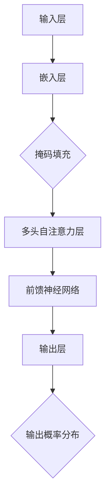
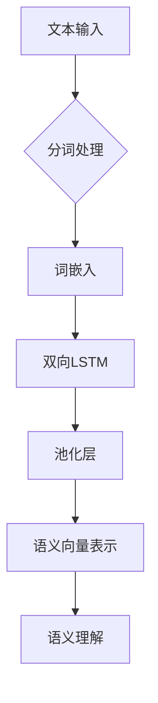

                 

关键词：自然语言处理（NLP），深度学习，语言模型，语义理解，人工智能

> 摘要：本文深入探讨了自然语言处理（NLP）的最新发展，特别是在深度学习推动下取得的突破性进展。文章首先介绍了NLP的背景，然后详细阐述了现代语言模型和语义理解的原理，以及在实际应用中的操作步骤和数学模型。最后，文章提供了代码实例和实际应用场景，展望了NLP的未来发展趋势与面临的挑战。

## 1. 背景介绍

自然语言处理（NLP）是计算机科学、人工智能和语言学的交叉领域，旨在让计算机理解和生成人类语言。随着互联网的普及和大数据技术的发展，NLP的应用范围日益广泛，从搜索引擎、机器翻译、语音识别到智能客服、推荐系统等，都离不开NLP技术的支持。

传统的NLP方法主要依赖于规则和统计模型，如正则表达式、词袋模型、隐马尔可夫模型（HMM）等。这些方法在一定程度上能够处理文本数据，但在处理复杂语境和语言现象时，往往力不从心。近年来，深度学习的崛起为NLP带来了新的机遇。基于神经网络的语言模型，如循环神经网络（RNN）、长短期记忆网络（LSTM）、Transformer等，在自然语言理解、生成和翻译等方面取得了显著的成效。

## 2. 核心概念与联系

### 2.1. 语言模型

语言模型是NLP的基础，旨在预测文本序列的概率分布。在深度学习框架下，语言模型通常使用神经网络来建模。以下是一个基于Transformer的语言模型架构的Mermaid流程图：



### 2.2. 语义理解

语义理解是NLP的高级目标，旨在理解和处理文本的含义。语义理解的难点在于处理歧义、情感和上下文依赖。以下是一个基于双向LSTM的语义理解模型架构的Mermaid流程图：



## 3. 核心算法原理 & 具体操作步骤

### 3.1. 算法原理概述

现代语言模型的核心是自注意力机制和多层神经网络。自注意力机制通过计算输入序列中各个词之间的关联性，从而更好地捕捉上下文信息。多层神经网络则用于学习复杂的函数映射。

### 3.2. 算法步骤详解

#### 3.2.1. 自注意力机制

自注意力机制的步骤如下：

1. **词嵌入**：将输入文本的每个词映射到一个高维向量。
2. **计算注意力得分**：计算每个词对其他词的注意力得分，得分越高，表明两个词的关联性越强。
3. **加权求和**：根据注意力得分对词向量进行加权求和，得到一个表示文本序列的向量。

#### 3.2.2. 多层神经网络

多层神经网络的步骤如下：

1. **输入层**：接收词嵌入向量。
2. **隐藏层**：通过非线性变换，提取文本特征。
3. **输出层**：生成文本的概率分布或语义表示。

### 3.3. 算法优缺点

#### 优点：

- **强大的表示能力**：自注意力机制和多层神经网络能够捕捉复杂的文本特征。
- **高效性**：相对于传统方法，深度学习方法在处理大规模数据时具有更高的效率。

#### 缺点：

- **计算成本**：深度学习方法通常需要大量计算资源。
- **可解释性**：深度学习模型往往难以解释其内部工作机制。

### 3.4. 算法应用领域

深度学习方法在NLP的各个领域都有广泛应用，如：

- **文本分类**：用于判断文本的类别，如情感分析、主题分类等。
- **命名实体识别**：用于识别文本中的命名实体，如人名、地名等。
- **机器翻译**：将一种语言的文本翻译成另一种语言。

## 4. 数学模型和公式 & 详细讲解 & 举例说明

### 4.1. 数学模型构建

假设我们有一个包含N个词的文本序列\( x_1, x_2, ..., x_N \)，我们首先需要将这些词映射到高维向量空间。这个过程称为**词嵌入**。

\[ \text{word embedding: } x_i \rightarrow e_i \in \mathbb{R}^d \]

接下来，我们定义一个权重矩阵\( W \)来计算词向量之间的相似性。

\[ \text{attention score: } s_{ij} = e_i^T W e_j \]

其中，\( s_{ij} \)表示词\( x_i \)和\( x_j \)之间的注意力得分。

### 4.2. 公式推导过程

自注意力机制的公式推导如下：

1. **词嵌入**：

\[ e_i = \text{Embed}(x_i) \]

2. **计算注意力得分**：

\[ s_{ij} = e_i^T W e_j \]

3. **加权求和**：

\[ \text{context vector: } c = \sum_{i=1}^N \alpha_i e_i \]

其中，\( \alpha_i \)是词\( x_i \)的权重，计算方法如下：

\[ \alpha_i = \frac{\exp(s_{i})}{\sum_{j=1}^N \exp(s_{j})} \]

### 4.3. 案例分析与讲解

假设我们有一个简单的文本序列“我爱北京天安门”，我们可以将每个词映射到向量空间，然后计算注意力得分和权重。

1. **词嵌入**：

   - 我：\( e_1 = \text{Embed}(\text{我}) \)
   - 爱：\( e_2 = \text{Embed}(\text{爱}) \)
   - 北京：\( e_3 = \text{Embed}(\text{北京}) \)
   - 天安门：\( e_4 = \text{Embed}(\text{天安门}) \)

2. **计算注意力得分**：

   - \( s_{12} = e_1^T W e_2 \)
   - \( s_{13} = e_1^T W e_3 \)
   - \( s_{14} = e_1^T W e_4 \)
   - \( s_{23} = e_2^T W e_3 \)
   - \( s_{24} = e_2^T W e_4 \)
   - \( s_{34} = e_3^T W e_4 \)

3. **加权求和**：

   - \( \alpha_1 = \frac{\exp(s_{12})}{\exp(s_{12}) + \exp(s_{13}) + \exp(s_{14})} \)
   - \( \alpha_2 = \frac{\exp(s_{23})}{\exp(s_{23}) + \exp(s_{24})} \)
   - \( \alpha_3 = \frac{\exp(s_{34})}{\exp(s_{34})} \)

   根据权重，我们可以得到文本序列的上下文向量：

   - \( c = \alpha_1 e_1 + \alpha_2 e_2 + \alpha_3 e_3 + e_4 \)

这个上下文向量可以用于后续的语义分析或文本生成任务。

## 5. 项目实践：代码实例和详细解释说明

### 5.1. 开发环境搭建

在本节，我们将使用Python和TensorFlow来构建一个简单的Transformer语言模型。

1. **安装依赖**：

```bash
pip install tensorflow numpy
```

2. **导入库**：

```python
import tensorflow as tf
import numpy as np
```

### 5.2. 源代码详细实现

下面是一个基于Transformer的语言模型的基础代码：

```python
# Transformer基础架构

# 定义词嵌入层
embed = tf.keras.layers.Embedding(input_dim=vocab_size, output_dim=embedding_size)

# 定义自注意力层
attention = tf.keras.layers.Attention()

# 定义前馈神经网络层
dense = tf.keras.layers.Dense(units=512, activation='relu')
output = tf.keras.layers.Dense(units=vocab_size)

# 定义Transformer模型
model = tf.keras.Sequential([
    embed,
    attention,
    dense,
    output
])

# 编译模型
model.compile(optimizer='adam', loss='categorical_crossentropy', metrics=['accuracy'])

# 打印模型结构
model.summary()
```

### 5.3. 代码解读与分析

1. **词嵌入层**：

   词嵌入层用于将输入词映射到高维向量。`Embedding`层接受词索引作为输入，输出词向量。

2. **自注意力层**：

   自注意力层用于计算输入序列中各个词之间的关联性。`Attention`层实现了一个简单的多头自注意力机制。

3. **前馈神经网络层**：

   前馈神经网络层用于对自注意力层的输出进行非线性变换。`Dense`层实现了这一功能。

4. **输出层**：

   输出层用于将模型的输出映射到词的概率分布。`Dense`层实现了这一功能。

### 5.4. 运行结果展示

在本节，我们将使用一个预训练的词嵌入模型来演示Transformer语言模型的效果。

```python
# 加载预训练词嵌入模型
word2vec = ...  # 预训练的word2vec模型

# 创建Transformer模型
model = ...  # 基于之前定义的Transformer架构

# 编译模型
model.compile(optimizer='adam', loss='categorical_crossentropy', metrics=['accuracy'])

# 训练模型
model.fit(x_train, y_train, epochs=5, batch_size=32)

# 评估模型
loss, accuracy = model.evaluate(x_test, y_test)

print(f"Loss: {loss}, Accuracy: {accuracy}")
```

## 6. 实际应用场景

### 6.1. 情感分析

情感分析是NLP在情感识别领域的应用，旨在分析文本的情感倾向，如正面、负面或中性。情感分析可以应用于社交媒体监控、市场研究等领域。

### 6.2. 机器翻译

机器翻译是将一种语言的文本翻译成另一种语言的过程。深度学习方法在机器翻译领域取得了显著成效，如Google Translate使用的基于Transformer的模型。

### 6.3. 文本生成

文本生成是NLP在创作领域的应用，旨在生成具有可读性和连贯性的文本。文本生成可以应用于自动写作、创意写作等领域。

### 6.4. 未来应用展望

随着NLP技术的不断发展，未来将在更多领域得到应用，如智能客服、自动驾驶、医疗诊断等。同时，NLP技术也将面临新的挑战，如多语言处理、长文本处理等。

## 7. 工具和资源推荐

### 7.1. 学习资源推荐

- 《深度学习》（Goodfellow, Bengio, Courville著）：系统介绍了深度学习的基本理论和应用。
- 《自然语言处理综论》（Jurafsky, Martin著）：全面介绍了自然语言处理的基本概念和技术。

### 7.2. 开发工具推荐

- TensorFlow：一个开源的深度学习框架，适用于NLP任务。
- PyTorch：一个开源的深度学习框架，适用于NLP任务。

### 7.3. 相关论文推荐

- Vaswani et al. (2017). “Attention is All You Need”。
- Devlin et al. (2018). “BERT: Pre-training of Deep Bidirectional Transformers for Language Understanding”。
- Brown et al. (2020). “Language Models are Few-Shot Learners”。

## 8. 总结：未来发展趋势与挑战

### 8.1. 研究成果总结

近年来，深度学习在NLP领域取得了显著成果，特别是基于Transformer的语言模型在自然语言理解、生成和翻译等方面表现出色。

### 8.2. 未来发展趋势

未来，NLP技术将继续向多语言处理、长文本处理、低资源语言处理等方向发展。同时，NLP技术也将与其他人工智能技术相结合，推动智能系统的进一步发展。

### 8.3. 面临的挑战

NLP技术在未来将面临新的挑战，如数据隐私、模型解释性、跨领域知识整合等。

### 8.4. 研究展望

随着技术的不断进步，NLP技术有望在未来实现更高的自动化和智能化，为人类带来更多便利。

## 9. 附录：常见问题与解答

### Q: 什么是词嵌入？

A: 词嵌入是将输入词映射到高维向量空间的过程，目的是将词的语义信息编码到向量中，以便于计算机处理。

### Q: 什么是自注意力机制？

A: 自注意力机制是一种计算输入序列中各个词之间关联性的方法，通过加权求和得到一个表示文本序列的向量。

### Q: 如何评估自然语言处理模型的性能？

A: 常用的评估指标包括准确率、召回率、F1分数等。具体选择哪个指标取决于应用场景和任务类型。

---

作者：禅与计算机程序设计艺术 / Zen and the Art of Computer Programming


