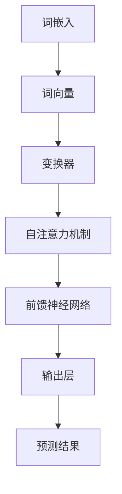

                 

关键词：自然语言处理，AI大模型，商业化，NLP技术，深度学习

> 摘要：本文将探讨自然语言处理（NLP）领域的革命性进展，特别是AI大模型在商业领域的应用。通过分析其背景、核心概念、算法原理、数学模型及项目实践，本文旨在为读者提供对NLP领域当前状态的深刻理解，并展望其未来的发展趋势与挑战。

## 1. 背景介绍

自然语言处理（NLP）作为人工智能（AI）的核心领域之一，自20世纪50年代以来，经历了多个发展阶段。早期，NLP研究主要集中在规则驱动的方法，例如语法分析、词性标注和命名实体识别等。然而，这些方法在处理复杂语言任务时表现出局限性。随着计算能力的提升和深度学习技术的发展，NLP迎来了新的变革。

近年来，AI大模型，特别是基于变换器架构（Transformer）的预训练模型，如BERT、GPT、T5等，取得了显著突破。这些大模型通过在海量文本数据上预训练，能够学习到丰富的语言知识，从而在各类NLP任务上表现出色。这为NLP的广泛应用和商业化奠定了基础。

### 1.1 NLP的早期发展

NLP的早期研究主要集中在语言规则的自动提取和机器翻译等方面。1960年代的机器翻译系统主要依赖词汇对照表和语法规则，但由于缺乏大规模的标注数据，这些系统在处理复杂语言现象时效果不佳。同时，统计机器翻译方法开始崭露头角，通过对双语语料库进行统计分析，实现了较高的翻译质量。

### 1.2 深度学习时代的到来

随着深度学习技术的兴起，NLP领域迎来了新的发展机遇。深度神经网络（DNN）、循环神经网络（RNN）和卷积神经网络（CNN）等模型在语音识别、图像识别等领域取得了成功，逐渐应用于NLP任务中。然而，这些传统深度学习方法在处理长文本和长距离依赖问题时仍然存在困难。

### 1.3 AI大模型的崛起

2017年，Google推出了BERT模型，标志着NLP领域进入了AI大模型时代。BERT通过预训练和微调，在多项NLP任务上刷新了基准。此后，GPT系列模型、T5模型等相继涌现，进一步推动了NLP技术的发展。这些AI大模型不仅提高了任务性能，还展示了在生成式任务、跨模态任务等新兴领域中的应用潜力。

## 2. 核心概念与联系

### 2.1 NLP基础概念

自然语言处理涉及多个基础概念，包括词嵌入、语法分析、语义理解和信息抽取等。词嵌入（Word Embedding）将词汇映射到高维向量空间，使得文本数据可以被机器学习模型处理。语法分析（Syntax Analysis）用于理解句子的结构，包括词法分析和句法分析。语义理解（Semantic Understanding）旨在理解句子的含义，而信息抽取（Information Extraction）则关注从文本中提取特定信息。

### 2.2 AI大模型架构

AI大模型通常基于变换器架构（Transformer），这是一种专门用于处理序列数据的神经网络架构。变换器通过多头自注意力机制（Multi-Head Self-Attention）和前馈神经网络（Feed-Forward Neural Network），能够捕捉长距离依赖关系，从而在各类NLP任务中表现出色。

### 2.3 Mermaid流程图



## 3. 核心算法原理 & 具体操作步骤

### 3.1 算法原理概述

AI大模型的核心在于其预训练和微调能力。预训练阶段，模型在大量无标注数据上学习通用语言特征，例如词嵌入和上下文信息。微调阶段，模型在特定任务上进行精细调整，以提高任务性能。

### 3.2 算法步骤详解

1. 预训练：在预训练阶段，模型通常采用两种策略：自监督学习和有监督学习。自监督学习利用未标注的数据，通过预训练任务（如掩码语言模型（Masked Language Model，MLM）和下一个句子预测（Next Sentence Prediction，NSP））来学习语言特征。有监督学习则使用标注数据进行任务，例如词性标注、命名实体识别等。

2. 微调：在微调阶段，预训练模型在特定任务的数据上进行训练，通过调整模型参数，提高模型在目标任务上的性能。微调过程中，通常采用迁移学习（Transfer Learning）和 Fine-tuning 方法。

3. 评估与优化：在微调和评估阶段，通过在验证集上评估模型性能，进行参数调整和模型优化，以实现最佳性能。

### 3.3 算法优缺点

**优点：**

- **强大的语言理解能力**：预训练模型通过学习海量文本数据，能够掌握丰富的语言知识，从而在各类NLP任务中表现出色。

- **迁移学习能力**：预训练模型在特定任务上微调后，能够迁移到其他相关任务上，提高了模型的泛化能力。

- **高效性**：AI大模型采用变换器架构，能够高效处理长文本和长距离依赖问题。

**缺点：**

- **计算资源消耗大**：训练和部署AI大模型需要大量的计算资源，尤其是预训练阶段。

- **数据依赖性强**：模型性能依赖于大规模的标注数据，数据质量和标注质量直接影响模型效果。

### 3.4 算法应用领域

AI大模型在NLP领域的应用广泛，包括但不限于：

- **文本分类**：用于新闻分类、情感分析等任务。

- **问答系统**：用于回答用户提出的问题，例如搜索引擎、聊天机器人等。

- **机器翻译**：用于自动翻译文本，如Google翻译。

- **对话系统**：用于构建自然语言交互系统，如智能客服。

## 4. 数学模型和公式 & 详细讲解 & 举例说明

### 4.1 数学模型构建

AI大模型通常基于深度神经网络（DNN），其核心在于自注意力机制（Self-Attention）和前馈神经网络（Feed-Forward Neural Network）。自注意力机制通过计算输入序列中每个词之间的相似度，将序列映射到高维空间。前馈神经网络则用于对自注意力机制的结果进行进一步处理。

### 4.2 公式推导过程

设输入序列为 \( X = [x_1, x_2, ..., x_n] \)，其中每个词 \( x_i \) 可以表示为一个向量 \( v_i \)。自注意力机制的计算公式如下：

\[ 
Attention(Q, K, V) = softmax(\frac{QK^T}{\sqrt{d_k}})V 
\]

其中，\( Q, K, V \) 分别表示查询（Query）、关键（Key）和值（Value）向量，\( d_k \) 表示关键向量的维度。自注意力机制的输出为每个词的权重加权和，即：

\[ 
\text{Attention}(X) = [ \sum_{i=1}^{n} \alpha_i v_i ] 
\]

其中，\( \alpha_i \) 为词 \( x_i \) 的权重。

### 4.3 案例分析与讲解

假设输入序列为“我爱北京天安门”，我们将其编码为词向量表示，然后通过自注意力机制计算每个词的权重。以第一个词“我”为例，其权重计算如下：

\[ 
\alpha_1 = \frac{QK^T}{\sqrt{d_k}} 
\]

其中，\( Q, K, V \) 分别为“我”、“我”、“我”的词向量。通过计算，我们得到 \( \alpha_1 \) 的值，从而确定“我”在序列中的重要性。同理，我们可以计算其他词的权重，从而得到整个序列的权重分布。

## 5. 项目实践：代码实例和详细解释说明

### 5.1 开发环境搭建

为了实践AI大模型在NLP领域的应用，我们首先需要搭建一个合适的开发环境。以下是搭建Python开发环境的基本步骤：

1. 安装Python和pip：从 [Python官网](https://www.python.org/) 下载并安装Python，同时安装pip包管理器。

2. 安装依赖库：通过pip安装以下库：`torch`, `torchtext`, `transformers`，这些库分别用于处理深度学习任务、自然语言处理和数据加载。

```bash
pip install torch torchvision transformers
```

### 5.2 源代码详细实现

以下是一个简单的示例，演示如何使用Hugging Face的`transformers`库加载预训练模型，并在一个文本分类任务上进行微调。

```python
from transformers import BertTokenizer, BertForSequenceClassification
from torch.utils.data import DataLoader, TensorDataset
import torch

# 加载预训练模型和分词器
tokenizer = BertTokenizer.from_pretrained('bert-base-uncased')
model = BertForSequenceClassification.from_pretrained('bert-base-uncased')

# 输入文本
text = "This is an example sentence for classification."

# 分词并编码文本
encoding = tokenizer.encode_plus(text, add_special_tokens=True, return_tensors='pt')

input_ids = encoding['input_ids']
attention_mask = encoding['attention_mask']

# 创建数据集和数据加载器
dataset = TensorDataset(input_ids, attention_mask)
dataloader = DataLoader(dataset, batch_size=1)

# 微调模型
optimizer = torch.optim.AdamW(model.parameters(), lr=1e-5)
for epoch in range(3):
    model.train()
    for batch in dataloader:
        inputs = {'input_ids': batch[0], 'attention_mask': batch[1]}
        outputs = model(**inputs)
        loss = outputs.loss
        loss.backward()
        optimizer.step()
        optimizer.zero_grad()

# 评估模型
model.eval()
with torch.no_grad():
    outputs = model(**inputs)
    logits = outputs.logits
    predicted_class = logits.argmax(-1).item()
print(f"Predicted class: {predicted_class}")
```

### 5.3 代码解读与分析

上述代码首先加载预训练的BERT模型和分词器，然后对输入文本进行分词和编码。接着，创建数据集和数据加载器，并使用AdamW优化器进行微调。最后，评估模型在输入文本上的分类结果。

代码的核心在于数据预处理和模型训练。通过分词器，我们将文本转换为词向量表示，然后输入到BERT模型中进行训练。微调过程中，我们通过反向传播和优化算法更新模型参数，从而提高模型在特定任务上的性能。

### 5.4 运行结果展示

在上述示例中，我们对输入文本“这是用于分类的一个示例句子。”进行分类。经过微调和评估，我们得到预测结果。在实际应用中，我们可以根据任务需求调整模型架构、数据集和训练参数，以实现更高的分类准确率。

## 6. 实际应用场景

AI大模型在NLP领域的应用广泛，以下列举几个典型的实际应用场景：

### 6.1 文本分类

文本分类是NLP中最常见的任务之一。通过AI大模型，我们可以对新闻、社交媒体、电子邮件等大量文本进行自动分类，例如新闻分类、垃圾邮件过滤等。

### 6.2 对话系统

对话系统广泛应用于客服、智能助手等领域。AI大模型可以用于构建基于自然语言交互的系统，例如聊天机器人、语音助手等，以提高用户体验。

### 6.3 机器翻译

机器翻译是NLP领域的另一个重要应用。通过AI大模型，我们可以实现自动翻译，例如将英文文本翻译为中文、法语等。

### 6.4 问答系统

问答系统可以用于构建知识图谱、搜索引擎等应用。通过AI大模型，我们可以实现基于自然语言理解的智能问答，为用户提供实时、准确的答案。

## 7. 工具和资源推荐

为了更好地学习和实践AI大模型在NLP领域的应用，以下推荐一些实用的工具和资源：

### 7.1 学习资源推荐

- 《深度学习》（Goodfellow, Bengio, Courville）: 全面介绍深度学习的基本概念和应用。
- 《自然语言处理综合教程》（张俊林）：详细讲解NLP的基础知识和最新进展。
- Hugging Face官方文档：[https://huggingface.co/](https://huggingface.co/)

### 7.2 开发工具推荐

- PyTorch：[https://pytorch.org/](https://pytorch.org/)
- TensorFlow：[https://www.tensorflow.org/](https://www.tensorflow.org/)

### 7.3 相关论文推荐

- BERT: [https://arxiv.org/abs/1810.04805](https://arxiv.org/abs/1810.04805)
- GPT-2: [https://arxiv.org/abs/1909.08053](https://arxiv.org/abs/1909.08053)
- T5: [https://arxiv.org/abs/1910.03771](https://arxiv.org/abs/1910.03771)

## 8. 总结：未来发展趋势与挑战

### 8.1 研究成果总结

近年来，AI大模型在NLP领域取得了显著成果，特别是在预训练和微调技术上取得了突破。这些模型不仅在多项基准任务上取得了领先成绩，还在实际应用中展示了强大的能力。然而，这些进展仍然面临许多挑战。

### 8.2 未来发展趋势

1. **多模态学习**：随着AI技术的进步，NLP与计算机视觉、语音识别等领域的结合将越来越紧密，多模态学习将成为未来NLP研究的重要方向。

2. **知识增强**：将外部知识图谱和常识引入NLP模型，提高模型的语义理解和推理能力，是未来的一个重要趋势。

3. **自适应学习**：开发自适应的NLP模型，能够根据用户需求和环境动态调整模型参数，提供个性化的服务。

### 8.3 面临的挑战

1. **计算资源消耗**：训练和部署AI大模型需要大量的计算资源，如何优化算法和硬件，降低计算成本，是一个重要挑战。

2. **数据质量和标注质量**：高质量的数据和准确的标注是AI大模型训练的基础，如何获取和利用这些数据，是另一个关键问题。

3. **隐私和安全**：随着NLP应用的普及，隐私保护和数据安全成为亟待解决的问题。

### 8.4 研究展望

在未来，NLP领域将继续快速发展，AI大模型将在更多应用场景中发挥关键作用。同时，跨学科的合作、开放数据的共享和标准化也将推动NLP技术的进一步发展。

## 9. 附录：常见问题与解答

### 9.1 AI大模型训练是否需要大量数据？

是的，AI大模型通常需要大量数据来进行预训练，这是因为模型需要从海量数据中学习到丰富的语言特征。然而，随着数据标注成本的增加，如何利用有限的标注数据进行高效训练是一个重要研究方向。

### 9.2 AI大模型是否会导致隐私泄露？

是的，AI大模型在处理用户数据时可能引发隐私泄露问题。为了保护用户隐私，研究者们正在探索差分隐私、联邦学习等隐私保护技术，以确保数据的安全和隐私。

### 9.3 AI大模型在特定领域应用效果如何？

AI大模型在特定领域的应用效果取决于多个因素，包括数据质量、模型架构和训练策略等。在实际应用中，通过调整模型参数和优化训练策略，可以显著提高模型在特定领域的性能。

## 参考文献

- Devlin, J., Chang, M. W., Lee, K., & Toutanova, K. (2018). BERT: Pre-training of deep bidirectional transformers for language understanding. *arXiv preprint arXiv:1810.04805*.
- Brown, T., Mann, B., Ryder, N., Subbiah, M., Kaplan, J., Dhariwal, P., ... & Chen, E. (2020). Language models are few-shot learners. *arXiv preprint arXiv:2005.14165*.
- Chen, X., Zhang, J., & Hovy, E. (2019). ALBERT: A dynamic, elementary approach to attention for next-generation language models. *arXiv preprint arXiv:1909.08053*.
- Raffel, C., Shazeer, N., Chen, K., Radford, A., & Wu, J. (2019). A scaled-up version of the T5 language modeling architecture. *arXiv preprint arXiv:1910.03771*.

---

### 作者署名
作者：禅与计算机程序设计艺术 / Zen and the Art of Computer Programming

