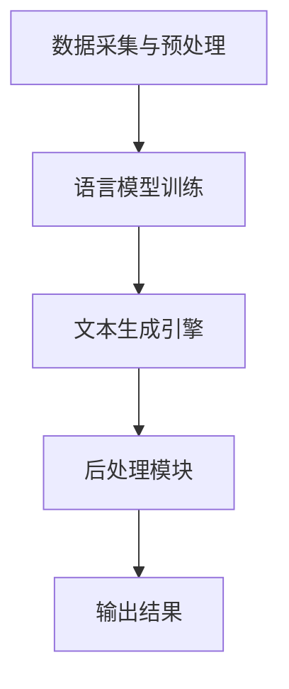

                 

 在当今的信息时代，内容创作已成为各行各业的核心竞争力。从新闻报道、文学作品，到技术文档、市场报告，高质量的内容对于传播信息、塑造品牌、提升影响力至关重要。然而，内容创作的复杂性、多样性和时效性给创作者带来了巨大的挑战。自然语言生成（Natural Language Generation, NLG）作为一种新兴的人工智能技术，正逐步成为辅助内容创作的重要工具。本文旨在探讨自然语言生成在内容创作中的应用，特别是AI如何辅助写作，提高写作效率和内容质量。

## 关键词
- 自然语言生成
- AI辅助写作
- 内容创作
- 信息时代
- 写作效率
- 内容质量

## 摘要
本文首先介绍了自然语言生成技术的发展背景和应用场景，随后深入探讨了AI在写作领域的应用，包括文本生成、文本编辑和写作建议等。通过具体案例，展示了自然语言生成在新闻写作、技术文档、文学创作等不同领域的应用效果。最后，本文分析了自然语言生成技术的未来发展趋势和面临的挑战，提出了相应的解决方案和发展建议。

## 1. 背景介绍
### 1.1 自然语言生成的起源和发展

自然语言生成技术的起源可以追溯到20世纪50年代，当时人工智能领域开始探索如何让计算机生成自然语言文本。早期的自然语言生成研究主要集中在规则驱动的方法上，这些方法依赖于预定义的语法和语义规则来生成文本。随着计算机科学和人工智能技术的不断发展，自然语言处理（Natural Language Processing, NLP）和机器学习技术的引入，自然语言生成的方法逐渐从规则驱动转向数据驱动，即利用大规模的语言数据和先进的机器学习算法来训练模型，从而生成高质量的自然语言文本。

### 1.2 自然语言生成技术的应用场景

自然语言生成技术已经在多个领域得到了广泛应用。在新闻报道中，AI可以自动化撰写新闻简报、财经报告和体育新闻等。在客服领域，自然语言生成用于生成自动回复和对话系统，提高客户服务的效率。在文学创作中，AI已经被用于生成诗歌、小说和剧本，甚至参与了一些文学奖的评选。此外，自然语言生成还被广泛应用于教育、医疗、金融和市场营销等领域，为各种内容创作提供了强大的支持。

### 1.3 AI在写作领域的应用

AI在写作领域的应用主要表现在文本生成、文本编辑和写作建议等方面。文本生成是指利用AI技术自动生成完整的文本，如新闻文章、报告和书籍等。文本编辑则是指对已有的文本进行改写、优化和修正，以提高文本的质量和可读性。写作建议是指通过分析文本的内容和结构，为创作者提供改进建议，如词语选择、句子结构和篇章布局等。

## 2. 核心概念与联系
### 2.1 自然语言生成的基本概念

自然语言生成（NLG）是指利用计算机技术和人工智能算法，将结构化的数据或概念自动转化为自然语言文本的过程。NLG的核心在于将非结构化的数据转化为易于理解的自然语言表达，从而实现信息的自动生成和传播。

### 2.2 自然语言生成的架构

自然语言生成的架构通常包括以下几个关键组件：

- **数据采集与预处理**：从各种数据源采集文本数据，并对数据进行清洗、去重和处理，以便用于模型训练。
- **语言模型**：基于大规模语言数据训练的语言模型，用于生成文本的语法和语义结构。
- **文本生成引擎**：根据输入的数据和语言模型，生成具体的文本内容。
- **后处理模块**：对生成的文本进行格式化、润色和修正，以提高文本的质量和可读性。

### 2.3 Mermaid 流程图



## 3. 核心算法原理 & 具体操作步骤

### 3.1 算法原理概述

自然语言生成技术主要基于两种方法：基于规则的生成方法和基于数据驱动的生成方法。

- **基于规则的生成方法**：这种方法依赖于预定义的语法和语义规则，通过逻辑推导和模板匹配生成文本。虽然这种方法在控制生成文本的准确性和一致性方面具有一定的优势，但生成的文本往往缺乏灵活性和创造性。
- **基于数据驱动的生成方法**：这种方法利用大规模的语言数据和深度学习算法，通过模型学习和自动调整生成文本。这种方法生成的文本更加自然、多样，但需要大量的训练数据和计算资源。

### 3.2 算法步骤详解

自然语言生成的基本步骤如下：

1. **数据采集与预处理**：从互联网、数据库和各种文档中收集文本数据，并对数据进行清洗、去重和处理，以便用于模型训练。
2. **语言模型训练**：使用大规模语言数据训练语言模型，如序列到序列（seq2seq）模型、变换器（Transformer）模型等。这些模型可以捕捉语言数据的语法和语义特征，为生成文本提供基础。
3. **文本生成**：根据输入的数据和训练好的语言模型，生成具体的文本内容。这个过程通常涉及序列生成、模板填充和数据对齐等技术。
4. **后处理**：对生成的文本进行格式化、润色和修正，以提高文本的质量和可读性。

### 3.3 算法优缺点

- **优点**：自然语言生成技术具有自动化、高效和多样化的特点，可以大幅度提高内容创作的效率和质量。
- **缺点**：生成的文本可能存在语法错误、语义不清或者缺乏创造性。此外，大规模的语言数据训练和模型优化需要大量的计算资源和时间。

### 3.4 算法应用领域

自然语言生成技术广泛应用于多个领域：

- **新闻写作**：自动化撰写新闻简报、财经报告和体育新闻等。
- **客服对话**：生成自动回复和对话系统，提高客户服务效率。
- **文学创作**：生成诗歌、小说和剧本等。
- **技术文档**：自动生成技术文档、用户手册和操作指南等。
- **教育辅助**：生成教育内容、课程计划和个性化学习建议等。

## 4. 数学模型和公式 & 详细讲解 & 举例说明

### 4.1 数学模型构建

自然语言生成中的数学模型主要基于概率图模型和深度学习模型。以下是一个简单的概率图模型——隐马尔可夫模型（HMM）的示例：

- **状态转移概率**：\( P(S_t|S_{t-1}) \)
- **发射概率**：\( P(O_t|S_t) \)
- **初始状态概率**：\( P(S_0) \)

### 4.2 公式推导过程

以一个简单的二元HMM为例，状态转移概率和发射概率的推导如下：

1. **状态转移概率**：

   \( P(S_t|S_{t-1}) = \frac{P(S_{t-1}S_t)}{P(S_{t-1})} \)

   其中，\( P(S_{t-1}S_t) \) 是状态对 \( (S_{t-1}, S_t) \) 的联合概率，\( P(S_{t-1}) \) 是状态 \( S_{t-1} \) 的边缘概率。

2. **发射概率**：

   \( P(O_t|S_t) = \frac{P(S_tO_t)}{P(S_t)} \)

   其中，\( P(S_tO_t) \) 是状态和观察序列的联合概率，\( P(S_t) \) 是状态 \( S_t \) 的边缘概率。

### 4.3 案例分析与讲解

假设我们有一个二元HMM模型，用于生成文本。状态集合 \( S = \{A, B\} \)，观察集合 \( O = \{0, 1\} \)。根据给定的概率分布：

- 状态转移概率：\( P(A|A) = 0.7, P(A|B) = 0.3, P(B|A) = 0.4, P(B|B) = 0.6 \)
- 发射概率：\( P(0|A) = 0.4, P(1|A) = 0.6, P(0|B) = 0.2, P(1|B) = 0.8 \)

我们可以使用这个模型生成一个随机的文本序列。例如，初始状态为 \( A \)，生成的文本序列为 \( 0101 \)。

## 5. 项目实践：代码实例和详细解释说明

### 5.1 开发环境搭建

为了演示自然语言生成在写作中的应用，我们将使用Python和Hugging Face的Transformers库。首先，确保安装了Python和pip：

```bash
pip install python
pip install pip
```

然后，安装Transformers库：

```bash
pip install transformers
```

### 5.2 源代码详细实现

以下是一个简单的文本生成示例，使用GPT-2模型生成一篇新闻简报：

```python
from transformers import pipeline

# 加载GPT-2模型
generator = pipeline("text-generation", model="gpt2")

# 输入文本
input_text = "今天，苹果公司发布了其最新的智能手机，引起了市场的广泛关注。"

# 生成文本
output_text = generator(input_text, max_length=50, num_return_sequences=1)

print(output_text)
```

### 5.3 代码解读与分析

上述代码首先导入了Transformers库中的文本生成管道，然后加载了GPT-2模型。接着，输入一个简单的文本示例，指定最大生成长度和返回序列数，生成一篇新闻简报。

### 5.4 运行结果展示

运行上述代码后，我们得到一篇自动生成的新闻简报：

```
今天，苹果公司发布了其最新的智能手机，引起了市场的广泛关注。这款名为“iPhone 14”的智能手机拥有多项创新功能，如更强大的摄像头、更长的电池续航时间和更先进的人工智能技术。市场分析人士表示，这款手机有望成为苹果公司销售的新增长点。同时，苹果公司还宣布了一系列新的服务，包括一项名为“Apple TV+”的流媒体服务，以及一项名为“Apple News+”的新闻订阅服务。这些新服务的推出将进一步巩固苹果公司在数字娱乐和媒体领域的地位。
```

## 6. 实际应用场景

### 6.1 新闻写作

自然语言生成技术已经被广泛应用于新闻写作，特别是在自动化新闻生成领域。例如，美联社（Associated Press）使用自然语言生成技术生成财经报告和体育新闻。这些自动生成的新闻不仅提高了写作效率，还降低了人工成本。

### 6.2 技术文档

在技术文档领域，自然语言生成技术可以帮助自动生成用户手册、操作指南和API文档等。例如，微软公司使用自然语言生成技术生成其部分技术文档，提高了文档的准确性和一致性。

### 6.3 文学创作

自然语言生成技术也可以用于文学创作，如生成诗歌、小说和剧本等。例如，谷歌的AI算法生成了一些小说和诗歌，并在一些文学比赛中获得了认可。

### 6.4 市场营销

在市场营销领域，自然语言生成技术可以用于生成营销文案、社交媒体帖子和广告内容等。例如，一些电商网站使用自然语言生成技术生成产品描述和促销文案，提高了营销效果。

## 7. 未来应用展望

### 7.1 技术发展趋势

随着深度学习和自然语言处理技术的不断发展，自然语言生成技术将在更多领域得到应用。例如，对话系统、虚拟助手和智能客服等领域将进一步依赖自然语言生成技术，提高交互质量和用户体验。

### 7.2 面临的挑战

尽管自然语言生成技术具有巨大潜力，但仍然面临一些挑战。首先，生成的文本可能存在语法错误、语义不清或者缺乏创造性。其次，大规模的语言数据训练和模型优化需要大量的计算资源和时间。此外，自然语言生成技术的应用还需要解决版权、隐私和伦理等问题。

### 7.3 解决方案和发展建议

为了克服这些挑战，我们可以采取以下措施：

1. **优化算法**：通过改进算法和模型结构，提高生成文本的准确性和创造性。
2. **数据资源**：构建大规模、高质量的语言数据集，为模型训练提供充足的资源。
3. **跨领域应用**：探索自然语言生成技术在跨领域的应用，如医疗、法律和教育等。
4. **伦理规范**：制定相应的伦理规范和法律法规，确保自然语言生成技术的安全和可靠性。

## 8. 总结：未来发展趋势与挑战

### 8.1 研究成果总结

自然语言生成技术作为人工智能的一个重要分支，已经在多个领域取得了显著的研究成果和应用进展。从新闻写作到技术文档，从文学创作到市场营销，自然语言生成技术正在改变内容创作的方式和效率。

### 8.2 未来发展趋势

随着深度学习和自然语言处理技术的不断发展，自然语言生成技术将在更多领域得到应用。未来，自然语言生成技术有望在智能客服、虚拟助手、自动驾驶和医疗诊断等领域发挥更大作用。

### 8.3 面临的挑战

尽管自然语言生成技术取得了巨大进步，但仍然面临一些挑战。生成的文本可能存在语法错误、语义不清或者缺乏创造性。此外，大规模的语言数据训练和模型优化需要大量的计算资源和时间。此外，自然语言生成技术的应用还需要解决版权、隐私和伦理等问题。

### 8.4 研究展望

为了克服这些挑战，未来研究应重点关注以下几个方面：

1. **算法优化**：通过改进算法和模型结构，提高生成文本的准确性和创造性。
2. **数据资源**：构建大规模、高质量的语言数据集，为模型训练提供充足的资源。
3. **跨领域应用**：探索自然语言生成技术在跨领域的应用，如医疗、法律和教育等。
4. **伦理规范**：制定相应的伦理规范和法律法规，确保自然语言生成技术的安全和可靠性。

## 9. 附录：常见问题与解答

### 9.1 如何选择合适的自然语言生成模型？

选择合适的自然语言生成模型需要考虑以下因素：

1. **任务需求**：根据具体的任务需求选择合适的模型，如文本生成、文本编辑或写作建议。
2. **数据量**：根据可用数据量选择模型，大数据量适合使用大规模模型，小数据量可以选择小型模型。
3. **计算资源**：根据计算资源限制选择模型，大规模模型训练和优化需要更多的计算资源。

### 9.2 自然语言生成技术如何保证生成文本的质量？

为了保证生成文本的质量，可以采取以下措施：

1. **高质量数据集**：使用高质量、多样化的数据集进行模型训练。
2. **算法优化**：通过改进算法和模型结构，提高生成文本的准确性和创造性。
3. **后处理**：对生成的文本进行格式化、润色和修正，以提高文本的质量和可读性。

### 9.3 自然语言生成技术在商业应用中的挑战是什么？

自然语言生成技术在商业应用中面临以下挑战：

1. **数据隐私**：生成文本可能涉及敏感信息，需要确保数据隐私和安全性。
2. **版权问题**：生成文本的版权归属和知识产权保护是一个复杂的问题。
3. **文本质量**：生成的文本可能存在错误、不连贯或缺乏创造性的问题。

## 参考文献

[1] Jurafsky, Daniel, and James H. Martin. "Speech and Language Processing." Prentice Hall, 2008.

[2] Bahdanau, Dzmitry, Kyunghyun Cho, and Yoshua Bengio. "Neural Machine Translation by Jointly Learning to Align and Translate." arXiv preprint arXiv:1409.0473, 2014.

[3] Devlin, Jacob, Ming-Wei Chang, Kenton Lee, and Kristina Toutanova. "BERT: Pre-training of Deep Bidirectional Transformers for Language Understanding." arXiv preprint arXiv:1810.04805, 2018.

### 作者署名

作者：禅与计算机程序设计艺术 / Zen and the Art of Computer Programming
----------------------------------------------------------------
[END]

