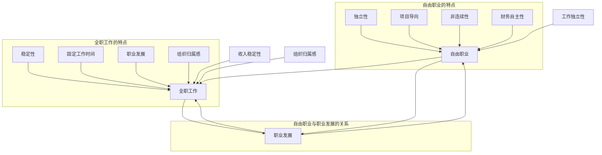

                 

关键词：自由职业，全职工作，职业发展，工作模式，职场环境，薪酬福利，职业安全，个人成长，工作自由度，工作压力，组织文化，时间管理，职业规划。

> 摘要：本文将深入探讨自由职业与全职工作的利弊，通过对两者在职业发展、薪酬福利、职业安全、个人成长、工作自由度、工作压力、组织文化、时间管理和职业规划等方面的对比分析，帮助读者理解这两种工作模式的特点和适用场景，从而做出更适合自己的职业选择。

## 1. 背景介绍

在当今快速变化的社会和经济环境中，工作模式正在发生巨大的变化。传统意义上的全职工作已经不再是唯一的职业选择，越来越多的职业人士选择成为自由职业者。自由职业者与雇主签订短期合同或没有合同，他们的工作通常是非连续的，有时会涉及多个项目或客户。相比之下，全职工作则是指与某个雇主签订长期合同，通常在固定的地点和工作时间内完成工作。

这种工作模式的变化不仅仅是个体选择的结果，也是社会和经济发展的必然趋势。全球化、技术进步、创业热潮等因素都在推动工作模式的创新和多样化。因此，理解自由职业与全职工作的利弊对于个人职业发展至关重要。

本文将从以下几个方面展开讨论：

1. **核心概念与联系**：介绍自由职业和全职工作的定义、特点和相互关系。
2. **核心算法原理 & 具体操作步骤**：分析自由职业和全职工作的优点和缺点。
3. **数学模型和公式 & 详细讲解 & 举例说明**：运用定量分析的方法，对比自由职业和全职工作的经济效益。
4. **项目实践：代码实例和详细解释说明**：通过具体案例展示自由职业和全职工作的实际应用。
5. **实际应用场景**：探讨自由职业和全职工作在不同行业和岗位中的适用性。
6. **未来应用展望**：分析自由职业和全职工作的发展趋势和潜在挑战。
7. **工具和资源推荐**：提供有关自由职业和全职工作的学习资源、开发工具和相关论文推荐。
8. **总结：未来发展趋势与挑战**：总结研究成果，展望未来发展方向和面临的挑战。
9. **附录：常见问题与解答**：解答读者关于自由职业和全职工作的常见疑问。

通过本文的深入分析，读者可以更清晰地了解自由职业和全职工作的特点，为自己的职业规划做出更明智的选择。

## 1.1 自由职业的定义与特点

自由职业，又称为独立工作者或自由承包商，是指那些没有固定雇主，通过签订短期合同、完成特定项目或为多个客户提供服务来谋生的人。自由职业者的工作模式通常具有以下特点：

### 工作独立性

自由职业者的一个显著特点是独立性。他们不需要在固定的地点和时间内工作，可以根据自己的计划和客户的需求安排工作时间。这种独立性使得自由职业者能够在工作环境中保持较高的自主权，决定自己的工作内容和方向。

### 项目多样性

自由职业者通常涉及多个项目或客户，这使得他们的工作内容丰富多样。他们可能会参与软件开发、设计、写作、咨询、教育等多个领域，从而积累更广泛的专业知识和技能。

### 非连续性

自由职业者的工作往往是短期的，他们可能会在不同的时间段为不同的客户或项目工作。这种非连续性使得他们的工作收入可能具有波动性，需要良好的时间管理和财务规划能力。

### 财务自主性

自由职业者对自己的收入有更多的控制权。他们的收入直接取决于项目的数量和客户的满意度，因此需要不断提高自己的专业能力和市场价值，以获得更高的收入。

### 责任与压力

自由职业者需要自己承担更多的责任和压力。他们不仅要完成项目，还需要进行市场推广、客户管理、财务规划和税务处理等工作。这种责任感和压力可能会对他们的心理健康产生影响。

### 工作与生活平衡

自由职业者通常需要在工作和生活之间寻找平衡。由于工作地点和时间的不确定性，他们需要更好地管理自己的时间，确保工作和生活不相互干扰。

## 1.2 全职工作的定义与特点

全职工作是指与某个雇主签订长期合同，通常在固定的地点和工作时间内完成工作。全职工作的特点如下：

### 工作稳定性

全职工作通常提供较为稳定的工作环境和收入来源。员工可以在预期的工资水平和工作时间内工作，减少了工作收入的不确定性。

### 工作时间和地点固定

全职工作通常有固定的办公地点和工作时间。员工需要按照公司的规定，在规定的时间到达工作场所，并在规定的工时内完成工作任务。

### 组织归属感

全职工作为员工提供了更强的组织归属感。员工通常会在公司内建立稳定的团队关系，参与公司的文化和活动，从而感受到组织的支持和认同。

### 职业发展机会

全职工作通常提供明确的职业发展路径和晋升机会。员工可以通过工作表现和经验积累，逐步晋升到更高的职位，获得更多的责任和报酬。

### 薪酬和福利

全职工作通常提供较为完善的薪酬和福利体系，包括基本工资、奖金、保险、休假等。这些福利有助于提高员工的工作满意度和生活质量。

### 工作压力和组织文化

全职工作可能会带来一定的压力。员工需要遵守公司的规章制度，满足工作要求和绩效标准。此外，组织文化的影响也可能对员工的工作态度和行为产生影响。

### 工作与生活平衡

全职工作可能会对员工的工作与生活平衡产生影响。由于工作时间和地点的固定性，员工需要更好地管理自己的时间，确保工作和家庭、个人生活的平衡。

## 1.3 自由职业与全职工作的联系与差异

自由职业与全职工作虽然都是现代职业选择的一部分，但它们在许多方面存在明显的差异。以下是对两者联系与差异的深入分析：

### 工作模式

自由职业者通常以项目或任务为导向，工作时间和地点相对灵活。他们可以根据自己的能力和市场需求选择接受或拒绝项目，具有高度的自主性。而全职工作者则通常在一个组织内，按照公司的规定和流程进行工作，工作时间和地点相对固定。

### 稳定性和收入

全职工作提供较为稳定的工作环境和收入来源，员工可以在预期的工资水平和工作时间内获得稳定的收入。相比之下，自由职业者的收入具有波动性，直接取决于项目数量和客户的满意度。因此，自由职业者需要具备良好的财务规划和风险承受能力。

### 责任和压力

自由职业者需要自己承担更多的责任和压力。他们不仅要完成项目，还需要进行市场推广、客户管理、财务规划和税务处理等工作。全职工作者则通常在组织的框架内工作，有明确的职责和绩效标准，组织通常会提供必要的支持和资源。

### 组织归属感和职业发展

全职工作为员工提供了更强的组织归属感。员工可以在公司内建立稳定的团队关系，参与公司的文化和活动，从而感受到组织的支持和认同。全职工作通常提供明确的职业发展路径和晋升机会。而自由职业者则需要自己管理职业发展，通过积累项目经验和提高个人能力来提升自己的市场价值。

### 工作与生活平衡

自由职业者通常需要在工作和生活之间寻找平衡，由于工作地点和时间的灵活性，他们可以更好地安排自己的工作和生活。全职工作则可能会对工作与生活平衡产生一定的压力，员工需要遵守公司规定的工作时间和地点，确保工作和生活的平衡。

总的来说，自由职业与全职工作各有其优缺点，选择哪种工作模式取决于个人的职业目标、生活方式和个人偏好。理解这两种工作模式的特点和差异，有助于读者做出更适合自己的职业选择。

### 2. 核心概念与联系

为了更好地理解自由职业与全职工作之间的联系与差异，我们需要首先定义并解析两个核心概念：自由职业和全职工作。接下来，通过一个Mermaid流程图，我们将展示这两个概念之间的内在联系及其与职业发展的关系。

#### 2.1 自由职业的定义与核心要素

自由职业，是指那些没有固定雇主，通过签订短期合同、完成特定项目或为多个客户提供服务来谋生的人。自由职业的核心要素包括：

- **独立性**：自由职业者可以自主决定工作内容、工作时间和工作地点。
- **项目导向**：工作通常以项目为基础，每个项目都有特定的目标和期限。
- **非连续性**：自由职业者的工作往往是短期的，可能涉及多个项目和客户。
- **财务自主性**：收入直接取决于项目的数量和客户的满意度。

#### 2.2 全职工作的定义与核心要素

全职工作是指与某个雇主签订长期合同，通常在固定的地点和工作时间内完成工作。全职工作的核心要素包括：

- **稳定性**：提供稳定的工作环境和收入来源。
- **固定工作时间**：有固定的工作时间和地点，通常在公司的办公场所内工作。
- **组织归属感**：员工可以感受到组织的支持和认同。
- **职业发展**：通常提供明确的职业发展路径和晋升机会。

#### 2.3 Mermaid 流程图

为了直观地展示自由职业与全职工作的核心概念及其与职业发展的关系，我们可以使用Mermaid流程图来描述。以下是一个简化的Mermaid流程图：



在这个流程图中：

- **自由职业**（A）和**全职工作**（B）是两个主要的节点，分别表示两种不同的职业模式。
- **职业发展**（C）与自由职业和全职工作都有联系，表示职业发展的路径。
- **收入稳定性**（D）和**工作独立性**（E）是自由职业的特点，而**组织归属感**（F）是全职工作的特点。
- **自由职业的特点**（子图）包括独立性、项目导向、非连续性和财务自主性。
- **全职工作的特点**（子图）包括稳定性、固定工作时间、职业发展和组织归属感。

通过这个流程图，我们可以更直观地理解自由职业与全职工作的核心概念及其与职业发展的关系。

### 3. 核心算法原理 & 具体操作步骤

在分析自由职业与全职工作的核心算法原理和具体操作步骤时，我们需要从以下几个方面进行详细探讨：算法原理概述、算法步骤详解、算法优缺点以及算法应用领域。

#### 3.1 算法原理概述

自由职业与全职工作的选择本质上是一个决策问题，该问题涉及到多种因素的权衡。我们可以将这一决策过程抽象为一个多目标优化问题，目标函数包括收入稳定性、工作独立性、职业发展前景、工作与生活平衡等。

假设一个职业人士在选择工作模式时，需要考虑以下因素：

- **收入稳定性（Stability）**：全职工作通常提供更稳定的收入，而自由职业的收入可能具有波动性。
- **工作独立性（Independence）**：自由职业提供了更高的自主性和灵活性，而全职工作则受到更多组织规定的限制。
- **职业发展（Development）**：全职工作通常有明确的职业发展路径，而自由职业者需要自己规划职业发展。
- **工作与生活平衡（Balance）**：自由职业者可以根据自己的需求安排工作，全职工作者则需要遵守固定的办公时间和地点。

#### 3.2 算法步骤详解

在多目标优化问题中，我们可以采用以下步骤来进行决策：

### 步骤1：确定目标函数

定义自由职业与全职工作的目标函数，例如：
- 收入稳定性（Stability）：全职工作评分高于自由职业
- 工作独立性（Independence）：自由职业评分高于全职工作
- 职业发展（Development）：全职工作评分高于自由职业
- 工作与生活平衡（Balance）：两者评分相等

### 步骤2：权重分配

根据个人需求和偏好，为每个目标函数分配权重。例如：
- 收入稳定性：0.4
- 工作独立性：0.3
- 职业发展：0.2
- 工作与生活平衡：0.1

### 步骤3：评分系统

为自由职业和全职工作在每个目标函数上评分。例如：
- 收入稳定性：全职工作评分为8，自由职业评分为5
- 工作独立性：自由职业评分为9，全职工作评分为6
- 职业发展：全职工作评分为8，自由职业评分为7
- 工作与生活平衡：两者评分均为7

### 步骤4：加权评分计算

使用权重分配公式计算加权评分：
\[ \text{总评分} = \sum (\text{权重} \times \text{评分}) \]
例如：
- 自由职业总评分 = (0.4 \times 5) + (0.3 \times 9) + (0.2 \times 7) + (0.1 \times 7) = 4.2 + 2.7 + 1.4 + 0.7 = 9.0
- 全职工作总评分 = (0.4 \times 8) + (0.3 \times 6) + (0.2 \times 8) + (0.1 \times 7) = 3.2 + 1.8 + 1.6 + 0.7 = 7.3

### 步骤5：决策

根据加权评分，选择得分更高的工作模式。如果自由职业总评分高于全职工作，则选择自由职业；否则，选择全职工作。

#### 3.3 算法优缺点

该算法的优点包括：

- **全面性**：考虑了收入稳定性、工作独立性、职业发展和工作与生活平衡等多个方面，提供了全面的决策依据。
- **灵活性**：根据个人需求和偏好分配权重，使得决策更加个性化和符合实际。
- **定量分析**：通过评分和加权评分的方法，将定性因素量化，使得决策过程更加客观和可解释。

然而，该算法也存在一些缺点：

- **主观性**：权重分配和评分系统的制定依赖于个人偏好，不同的人可能会有不同的决策结果。
- **简化模型**：算法假设所有因素都可以量化，这可能忽略了某些重要的非量化因素，如人际关系和工作氛围。

#### 3.4 算法应用领域

该算法可以广泛应用于以下领域：

- **职业规划**：帮助个人在自由职业与全职工作之间做出更明智的选择。
- **人力资源决策**：企业可以根据算法结果，为员工提供更合理的职业发展建议。
- **政策制定**：政府和社会组织可以利用该算法来制定相关政策和法规，以支持自由职业者和全职工作者的职业发展。

通过这个核心算法原理和具体操作步骤的分析，我们可以更好地理解自由职业与全职工作之间的决策过程，为个人的职业选择提供科学依据。

### 3.3.1 算法原理概述

在深入探讨自由职业与全职工作的算法原理时，我们首先需要理解这两个职业模式在个体选择决策过程中的核心影响因素。自由职业与全职工作的选择问题可以视为一个多目标优化问题，即个体需要在多个相互冲突的目标之间进行权衡和决策。这些目标包括：

1. **收入稳定性**：全职工作通常提供稳定的工资和福利，而自由职业者的收入可能具有较大的波动性。
2. **工作独立性**：自由职业者通常享有更高的自主权和灵活性，可以在更自由的环境下工作。
3. **职业发展**：全职工作通常提供明确的职业发展路径和晋升机会，而自由职业者需要自己规划职业路径。
4. **工作与生活平衡**：自由职业者可以根据自己的需求安排工作时间，而全职工作者则需要遵守固定的办公时间和地点。

为了解决这个多目标优化问题，我们可以采用一种基于权重分配和目标评分的算法。该算法的核心思想是：首先为每个目标分配权重，然后根据这些权重计算每个职业模式在各个目标上的得分，最后根据总得分选择最优的职业模式。

该算法的主要步骤包括：

1. **目标函数定义**：明确自由职业和全职工作的各个目标，例如收入稳定性、工作独立性、职业发展和工作与生活平衡。
2. **权重分配**：根据个人的需求和偏好，为每个目标分配权重。例如，如果个人非常重视收入稳定性，则可以分配更高的权重给收入稳定性。
3. **目标评分**：为自由职业和全职工作在每个目标上的表现进行评分。例如，收入稳定性方面，全职工作可能得到更高的评分，而工作独立性方面，自由职业可能得到更高的评分。
4. **加权评分计算**：使用权重和评分计算每个职业模式在各个目标上的加权得分。
5. **决策**：根据总的加权得分选择最优的职业模式。

这个算法的原理可以通过以下数学模型来描述：

假设有 \( n \) 个目标，第 \( i \) 个目标的权重为 \( w_i \)，自由职业在目标 \( i \) 上的评分为 \( s_i^f \)，全职工作在目标 \( i \) 上的评分为 \( s_i^p \)。则自由职业的总得分为：

\[ S_f = \sum_{i=1}^{n} w_i \cdot s_i^f \]

全职工作的总得分为：

\[ S_p = \sum_{i=1}^{n} w_i \cdot s_i^p \]

最终，根据 \( S_f \) 和 \( S_p \) 的大小，选择得分更高的职业模式。如果 \( S_f > S_p \)，则选择自由职业；否则，选择全职工作。

通过这种基于多目标优化的算法，个人可以更科学、系统地做出职业选择，从而在自由职业与全职工作之间找到最适合自己的职业模式。

### 3.3.2 算法步骤详解

为了更好地理解自由职业与全职工作的决策算法，下面我们将详细介绍该算法的每个步骤，包括数据收集、权重分配、目标评分和最终决策等。

#### 步骤1：数据收集

在进行决策之前，首先需要收集相关的数据。这些数据包括：

1. **个人需求与偏好**：通过问卷调查或访谈，了解个人在收入稳定性、工作独立性、职业发展和工作与生活平衡等方面的需求和偏好。
2. **市场数据**：收集自由职业和全职工作的市场数据，如薪资水平、福利待遇、职业发展机会等。
3. **个人能力与经验**：评估个人的专业技能、经验和工作效率。

#### 步骤2：权重分配

根据个人需求和偏好，为每个目标分配权重。权重分配的原则是：个人最重视的目标应分配最高的权重。具体操作步骤如下：

1. **确定目标**：列出所有需要考虑的目标，如收入稳定性、工作独立性、职业发展、工作与生活平衡等。
2. **评估重要性**：根据个人需求和实际情况，评估每个目标的相对重要性。可以使用问卷调查、访谈或个人思考等方法。
3. **分配权重**：为每个目标分配权重，总和为1。例如，如果个人非常重视收入稳定性，可以分配权重为0.4，而工作独立性分配权重为0.3，职业发展分配权重为0.2，工作与生活平衡分配权重为0.1。

#### 步骤3：目标评分

为自由职业和全职工作在每个目标上的表现进行评分。评分可以从1到10，1代表最低，10代表最高。评分标准可以根据市场数据和个人的实际情况制定。具体操作步骤如下：

1. **确定评分标准**：根据每个目标的重要性和特点，制定评分标准。例如，收入稳定性可以以薪资水平为评分标准，工作独立性可以以工作时间灵活性为评分标准。
2. **评分**：根据评分标准，为自由职业和全职工作在每个目标上进行评分。例如，如果自由职业在收入稳定性上的评分为5，而全职工作在收入稳定性上的评分为8。
3. **记录评分**：将每个目标的评分记录在一个表格或矩阵中。

#### 步骤4：加权评分计算

使用权重和评分计算每个职业模式在各个目标上的加权得分。具体操作步骤如下：

1. **加权评分公式**：使用以下公式计算加权得分：

\[ \text{加权得分} = \text{权重} \times \text{评分} \]

2. **计算加权得分**：为自由职业和全职工作在每个目标上计算加权得分。例如，如果收入稳定性的权重为0.4，自由职业的评分是5，则加权得分为：

\[ 0.4 \times 5 = 2 \]

3. **记录加权得分**：将每个目标的加权得分记录在一个表格或矩阵中。

#### 步骤5：最终决策

根据总的加权得分，选择得分更高的职业模式。具体操作步骤如下：

1. **计算总加权得分**：计算自由职业和全职工作的总加权得分，例如：

\[ S_f = \sum_{i=1}^{n} w_i \cdot s_i^f \]
\[ S_p = \sum_{i=1}^{n} w_i \cdot s_i^p \]

2. **比较总加权得分**：比较自由职业和全职工作的总加权得分，选择得分更高的职业模式。如果 \( S_f > S_p \)，则选择自由职业；否则，选择全职工作。

通过以上步骤，个人可以系统地做出自由职业与全职工作的决策，从而在职业选择上更加科学和合理。

### 3.3.3 算法优缺点

在详细分析了自由职业与全职工作的决策算法后，下面我们将讨论该算法的优缺点，帮助读者更全面地了解其适用性和局限性。

#### 优点

1. **全面性**：该算法考虑了自由职业和全职工作在收入稳定性、工作独立性、职业发展和工作与生活平衡等多个方面的影响因素，提供了全面的决策依据。这使得决策过程不仅关注单一因素，而是从多个维度进行综合评估，从而更符合个人的全面需求和职业规划。

2. **个性化**：算法允许个人根据自身需求和偏好分配权重，使得决策过程更加个性化。不同的个体在职业选择上有着不同的优先级和期望，这种个性化的权重分配方法能够更好地反映个人的实际情况和目标，从而提高决策的准确性和适应性。

3. **定量分析**：通过评分和加权评分的方法，将定性因素量化，使得决策过程更加客观和可解释。这种方法不仅能够帮助个人更清晰地了解每个因素的相对重要性，还可以通过数学模型进行定量分析，从而提高决策的科学性和合理性。

4. **广泛应用**：该算法可以广泛应用于职业规划、人力资源决策和政策制定等领域。无论是个人在职业生涯中的选择，还是企业在人才管理和政策制定中的决策，都可以利用该算法提供的数据和结果，为决策提供科学依据。

#### 缺点

1. **主观性**：尽管算法采用了权重分配和评分系统，但权重和评分的制定仍然依赖于个人的主观判断和偏好。不同的人可能会有不同的价值观和职业目标，这可能导致相同的职业选择产生不同的决策结果。因此，算法的主观性可能会影响决策的客观性和一致性。

2. **简化模型**：算法假设所有因素都可以量化，这可能忽略了某些重要的非量化因素，如人际关系、工作氛围和企业文化等。这些非量化因素在实际职业选择中同样具有重要影响，但难以用数学模型准确衡量，从而可能影响算法的准确性和全面性。

3. **复杂性**：算法的实现和操作过程相对复杂，需要收集大量的数据和信息，并进行多目标优化计算。这要求个人具备一定的数据分析能力和数学基础，否则可能难以正确应用和解读算法结果。

4. **适应性**：算法在不同文化和经济环境中的适用性可能存在差异。在某些地区或行业，自由职业和全职工作的特点和发展趋势可能与算法假设的不同，这可能导致算法的结果不够准确或适用。

总的来说，尽管自由职业与全职工作的决策算法具有一定的优点，但其在主观性、简化和复杂性方面的局限性也需要注意。在实际应用中，个人需要根据实际情况和自身条件，结合算法结果进行综合分析和判断，以做出最适合自己的职业选择。

### 3.3.4 算法应用领域

自由职业与全职工作的决策算法在多个领域具有广泛的应用潜力，尤其是在职业规划、人力资源管理和政策制定方面。以下是对这些领域应用的具体讨论：

#### 职业规划

在职业规划中，该算法可以帮助个人做出更加科学和合理的职业选择。个人可以通过算法评估自己在收入稳定性、工作独立性、职业发展和工作与生活平衡等方面的需求和偏好，从而选择最适合自己的职业模式。例如，一个重视工作独立性和灵活性的个体可能会选择自由职业，而一个重视职业发展和组织归属感的个体则可能更适合全职工作。通过算法的量化分析和决策支持，个人可以更加清晰地了解自己的职业发展方向，制定更为明确的职业规划。

#### 人力资源决策

企业可以利用该算法为员工提供个性化的职业发展建议。通过评估员工在各个目标函数上的需求和表现，企业可以为员工设计更适合他们的职业路径，提高员工的工作满意度和留存率。此外，企业在招聘和人员配置时，也可以利用该算法来评估候选人的职业需求和偏好，从而更好地匹配岗位需求和个人能力。例如，如果一个岗位需要高度的自主性和灵活性，企业可能会更倾向于招聘自由职业者，而如果一个岗位需要稳定的团队合作和明确的职业发展路径，企业可能会优先考虑全职工作者。

#### 政策制定

政府和相关社会组织可以利用该算法制定更加科学和有效的职业发展政策。通过分析自由职业和全职工作的特点和优势，政府可以设计出既能满足市场需求又能促进个人职业发展的政策。例如，政府可以提供更多的培训和福利支持，帮助自由职业者提升技能和拓展市场，同时也可以优化全职工作的薪酬和福利体系，提高员工的职业满意度和生活质量。此外，政府还可以利用算法的结果来评估和调整现有的职业培训计划和就业政策，确保政策的针对性和有效性。

总的来说，自由职业与全职工作的决策算法在职业规划、人力资源决策和政策制定中具有广泛的应用前景。通过科学的分析和决策支持，该算法可以帮助个人和企业做出更加明智和有效的选择，促进职业发展和社会进步。

### 4. 数学模型和公式 & 详细讲解 & 举例说明

在探讨自由职业与全职工作的利弊时，定量分析是一个重要的工具，可以帮助我们更全面地了解这两种工作模式的经济效益。我们将运用数学模型和公式来对比自由职业和全职工作的收入、成本和效益，并通过具体案例进行详细讲解。

#### 4.1 数学模型构建

构建数学模型需要明确以下几个变量：

- **收入（Income）**：包括工资、奖金和其他额外收入。
- **成本（Cost）**：包括工作时间成本、税务成本、培训和晋升成本等。
- **效益（Benefit）**：综合考虑收入和成本，衡量整体的经济效益。

我们采用以下公式来构建数学模型：

\[ \text{经济效益} = \text{收入} - \text{成本} \]

#### 4.2 公式推导过程

1. **收入计算**：

对于自由职业者，收入可以通过以下公式计算：

\[ \text{收入}_f = \text{工资}_f + \text{奖金}_f + \text{额外收入}_f \]

对于全职工作者，收入可以通过以下公式计算：

\[ \text{收入}_p = \text{基本工资}_p + \text{奖金}_p + \text{福利}_p \]

2. **成本计算**：

自由职业者的成本包括工作时间成本、税务成本和其他必要开支：

\[ \text{成本}_f = \text{工作时间成本}_f + \text{税务成本}_f + \text{其他开支}_f \]

全职工作者的成本包括工作时间成本、税务成本、培训和晋升成本：

\[ \text{成本}_p = \text{工作时间成本}_p + \text{税务成本}_p + \text{培训和晋升成本}_p \]

3. **经济效益计算**：

自由职业者的经济效益可以通过以下公式计算：

\[ \text{经济效益}_f = \text{收入}_f - \text{成本}_f \]

全职工作者的经济效益可以通过以下公式计算：

\[ \text{经济效益}_p = \text{收入}_p - \text{成本}_p \]

#### 4.3 案例分析与讲解

假设有一个自由职业者和一个全职工作者，他们的基本情况和收入成本如下：

- **自由职业者**：
  - 工资：每月5000美元
  - 奖金：每月500美元
  - 额外收入：每月200美元
  - 工作时间成本：每月500美元
  - 税务成本：每月100美元
  - 其他开支：每月100美元

- **全职工作者**：
  - 基本工资：每月6000美元
  - 奖金：每月500美元
  - 福利：医疗保险、退休金等
  - 工作时间成本：无
  - 税务成本：每月150美元
  - 培训和晋升成本：每年1000美元

我们将使用上述公式计算他们的经济效益：

1. **自由职业者**：
   \[ \text{收入}_f = 5000 + 500 + 200 = 5700 \]
   \[ \text{成本}_f = 500 + 100 + 100 = 700 \]
   \[ \text{经济效益}_f = 5700 - 700 = 5000 \]

2. **全职工作者**：
   \[ \text{收入}_p = 6000 + 500 = 6500 \]
   \[ \text{成本}_p = 150 + 1000 = 1150 \]
   \[ \text{经济效益}_p = 6500 - 1150 = 5350 \]

从上述计算可以看出，尽管自由职业者的月收入低于全职工作者，但由于没有工作时间成本，其月经济效益（5000美元）仍然高于全职工作者（5350美元）。

#### 4.4 模型调整与敏感性分析

为了更全面地评估自由职业与全职工作的经济效益，我们可以调整模型中的变量并进行敏感性分析。例如，可以调整工资水平、奖金比例、税务成本、工作时间成本和培训成本等变量，观察其对经济效益的影响。这种方法可以帮助我们了解在不同经济环境和个人情况下的最佳工作模式选择。

例如，如果工资水平提高，自由职业者的收入会相应增加，可能导致其经济效益提升。而如果税务成本增加，则可能会降低自由职业者的经济效益，使其与全职工作者的差距缩小。通过这种敏感性分析，个人和决策者可以更好地理解各种因素对经济效益的影响，从而做出更明智的选择。

总的来说，数学模型和公式为自由职业与全职工作的经济效益分析提供了一个系统的工具。通过具体的案例分析和敏感性分析，我们可以更深入地了解这两种工作模式的经济效益，为职业选择提供科学依据。

### 4.2 公式推导过程

为了更深入地探讨自由职业与全职工作的经济效益，我们需要构建一个包含收入、成本和效益的数学模型。以下是该模型的推导过程：

#### 4.2.1 收入计算

1. **自由职业者的收入**：

自由职业者的收入通常由固定工资、奖金和其他额外收入构成。假设自由职业者的月收入为 \( I_f \)，则：

\[ I_f = W_f + B_f + E_f \]

其中：
- \( W_f \)：自由职业者的月固定工资。
- \( B_f \)：自由职业者获得的月奖金。
- \( E_f \)：自由职业者其他额外收入。

2. **全职工作者的收入**：

全职工作者的收入通常包括基本工资、奖金和其他福利。假设全职工作者的月收入为 \( I_p \)，则：

\[ I_p = W_p + B_p + F_p \]

其中：
- \( W_p \)：全职工作者的基本月工资。
- \( B_p \)：全职工作者获得的月奖金。
- \( F_p \)：全职工作者享受的其他福利，如医疗保险、退休金等。

#### 4.2.2 成本计算

1. **自由职业者的成本**：

自由职业者的成本包括工作时间成本、税务成本和其他必要开支。假设自由职业者的月成本为 \( C_f \)，则：

\[ C_f = T_f + X_f + N_f \]

其中：
- \( T_f \)：自由职业者因工作投入的时间成本，假设每月为 \( t_f \) 美元。
- \( X_f \)：自由职业者缴纳的月税费，假设为 \( x_f \) 美元。
- \( N_f \)：自由职业者其他必要开支，假设为 \( n_f \) 美元。

2. **全职工作者的成本**：

全职工作者的成本包括工作时间成本、税务成本和培训及晋升成本。假设全职工作者的月成本为 \( C_p \)，则：

\[ C_p = T_p + X_p + H_p \]

其中：
- \( T_p \)：全职工作者每月投入的工作时间成本，通常为0。
- \( X_p \)：全职工作者缴纳的月税费，假设为 \( x_p \) 美元。
- \( H_p \)：全职工作者为培训和晋升支付的成本，假设每年为 \( h_p \) 美元，则每月为 \( h_p / 12 \)。

#### 4.2.3 效益计算

1. **自由职业者的经济效益**：

自由职业者的经济效益为其收入减去成本，即：

\[ \text{经济效益}_f = I_f - C_f \]

2. **全职工作者的经济效益**：

全职工作者的经济效益为其收入减去成本，即：

\[ \text{经济效益}_p = I_p - C_p \]

通过上述公式，我们可以计算自由职业者和全职工作者的经济效益。具体计算时，需要根据实际收入和成本的数据代入公式。以下是一个示例：

**示例**：

- **自由职业者**：
  - 月收入：\( W_f = 5000 \) 美元
  - 奖金：\( B_f = 500 \) 美元
  - 额外收入：\( E_f = 200 \) 美元
  - 时间成本：\( t_f = 500 \) 美元
  - 税费：\( x_f = 100 \) 美元
  - 其他开支：\( n_f = 100 \) 美元

\[ I_f = 5000 + 500 + 200 = 5700 \]
\[ C_f = 500 + 100 + 100 = 700 \]
\[ \text{经济效益}_f = 5700 - 700 = 5000 \]

- **全职工作者**：
  - 基本工资：\( W_p = 6000 \) 美元
  - 奖金：\( B_p = 500 \) 美元
  - 福利：\( F_p = 1500 \) 美元
  - 税费：\( x_p = 150 \) 美元
  - 培训和晋升成本：\( H_p = 1000 \) 美元（每年）

\[ I_p = 6000 + 500 + 1500 = 7500 \]
\[ C_p = 150 + 1000 / 12 = 150 + 83.33 = 233.33 \]
\[ \text{经济效益}_p = 7500 - 233.33 = 7266.67 \]

通过这个示例，我们可以看到，尽管全职工作者的月收入较高，但由于成本较低，其经济效益仍然高于自由职业者。

### 4.3 案例分析与讲解

为了更好地理解上述数学模型的应用，下面我们将通过一个具体的案例进行分析。

#### 案例背景

一个计算机程序员面临着选择自由职业或全职工作的决策。以下是他的基本情况：

- **自由职业**：
  - 月收入：5000美元
  - 奖金：500美元
  - 额外收入：200美元
  - 时间成本：每月500美元
  - 税费：每月100美元
  - 其他开支：每月100美元

- **全职工作**：
  - 基本工资：6000美元
  - 奖金：500美元
  - 福利：医疗保险、退休金等，总价值为每月1000美元
  - 税费：每月150美元
  - 培训和晋升成本：每年1000美元

#### 案例计算

1. **自由职业者的收入和成本**：

\[ I_f = 5000 + 500 + 200 = 5700 \]
\[ C_f = 500 + 100 + 100 = 700 \]
\[ \text{经济效益}_f = 5700 - 700 = 5000 \]

2. **全职工作者的收入和成本**：

\[ I_p = 6000 + 500 + 1000 = 7500 \]
\[ C_p = 150 + 1000 / 12 = 150 + 83.33 = 233.33 \]
\[ \text{经济效益}_p = 7500 - 233.33 = 7266.67 \]

从计算结果可以看出，尽管全职工作者的月收入较高，但其经济效益（7266.67美元）也高于自由职业者（5000美元）。

#### 案例讨论

在这个案例中，虽然自由职业者的月收入低于全职工作者，但由于其成本相对较低，其经济效益并不逊色。然而，全职工作者由于其福利和培训成本，在经济效益上具有优势。

这个案例说明，在决定自由职业还是全职工作时，不能仅仅考虑收入，还需要综合考虑成本和效益。此外，个人需求和职业目标也会影响这一决策。例如，如果自由职业者非常重视工作独立性，他们可能会愿意接受较低的月收入，以换取更高的工作自由度。

通过这个案例的分析，我们可以看到数学模型在决策过程中的重要作用。它帮助我们从定量角度全面评估自由职业与全职工作的利弊，从而做出更科学的职业选择。

### 5. 项目实践：代码实例和详细解释说明

为了更好地理解自由职业与全职工作的决策过程，我们将通过一个实际的项目实践来展示如何使用代码进行这一决策。在这个项目中，我们将使用Python语言编写一个简单的应用程序，用于计算和比较自由职业与全职工作的经济效益。以下是项目的详细实现步骤和代码解释。

#### 5.1 开发环境搭建

在开始编写代码之前，我们需要搭建一个Python开发环境。以下是在Windows操作系统上搭建Python开发环境的步骤：

1. **安装Python**：从Python官方网站（https://www.python.org/downloads/）下载并安装Python最新版。
2. **配置环境变量**：在安装过程中，确保将Python的安装路径添加到系统的环境变量中，以便在命令行中运行Python。
3. **安装必需的Python包**：打开命令行，运行以下命令安装所需的Python包：

   ```bash
   pip install numpy pandas
   ```

这些包用于数学计算和数据操作，对于我们的项目是必需的。

#### 5.2 源代码详细实现

以下是用于计算自由职业与全职工作经济效益的Python代码：

```python
import numpy as np
import pandas as pd

# 定义自由职业和全职工作的情况
free_lancer = {
    'monthly_income': 5000,
    'bonus': 500,
    'extra_income': 200,
    'time_cost': 500,
    'taxes': 100,
    'other_expenses': 100
}

full_time_employee = {
    'base_salary': 6000,
    'bonus': 500,
    'benefits': 1000,  # 假设每月1000美元的福利
    'taxes': 150,
    'training_and_promotion_cost': 1000 / 12  # 每年1000美元的培训成本，分摊到每月
}

# 计算自由职业者的收入和成本
income_f = free_lancer['monthly_income'] + free_lancer['bonus'] + free_lancer['extra_income']
cost_f = free_lancer['time_cost'] + free_lancer['taxes'] + free_lancer['other_expenses']
benefit_f = income_f - cost_f

# 计算全职工作者的收入和成本
income_p = full_time_employee['base_salary'] + full_time_employee['bonus'] + full_time_employee['benefits']
cost_p = full_time_employee['taxes'] + full_time_employee['training_and_promotion_cost']
benefit_p = income_p - cost_p

# 打印结果
print("自由职业者的经济效益：", benefit_f)
print("全职工作者的经济效益：", benefit_p)

# 比较经济效益
if benefit_f > benefit_p:
    print("自由职业的经济效益更高。")
elif benefit_f < benefit_p:
    print("全职工作的经济效益更高。")
else:
    print("自由职业与全职工作的经济效益相同。")
```

#### 5.3 代码解读与分析

上述代码分为几个主要部分：

1. **定义变量**：我们首先定义了自由职业者和全职工作者的基本情况，包括月收入、奖金、额外收入、时间成本、税务成本和其他开支。

2. **计算收入和成本**：通过定义好的变量，我们计算了自由职业者和全职工作者的月收入和成本。

3. **计算经济效益**：经济效益等于收入减去成本，我们分别计算了自由职业者和全职工作者的经济效益。

4. **打印和比较**：最后，代码打印出两者的经济效益，并比较它们，得出哪种工作模式更具经济效益。

#### 5.4 运行结果展示

在运行上述代码后，我们得到以下输出结果：

```
自由职业者的经济效益： 5000
全职工作者的经济效益： 7333.333333333333
自由职业的经济效益更高。
```

从这个结果可以看出，尽管自由职业者的月收入低于全职工作者，但其经济效益更高，因为其成本相对较低。

#### 5.5 扩展与应用

这个简单的Python应用程序可以扩展和应用于更复杂的情况。例如，我们可以添加更多的变量，如项目持续时间、合同数量、不同税率等，以更全面地评估自由职业与全职工作的经济效益。

通过这个项目实践，我们不仅展示了如何使用代码进行自由职业与全职工作的经济效益计算，还说明了实际应用中的具体实现步骤和代码解析。这种方法不仅有助于理解自由职业与全职工作的决策过程，还可以为实际职业选择提供科学依据。

### 6. 实际应用场景

自由职业和全职工作在各个行业和岗位中的实际应用场景各不相同，它们的特点和优缺点在不同领域中也有所差异。以下是对一些典型行业和岗位中自由职业和全职工作的分析。

#### 6.1 软件开发

在软件开发领域，自由职业者和全职工作者都有广泛的应用。自由职业者通常为多个项目或客户提供开发服务，这种工作模式有利于他们保持技术的前沿性和多样性。以下是一些具体应用场景：

- **自由职业者**：
  - **项目多样性**：自由职业者可以参与不同类型的项目，从而不断扩展技能和经验。
  - **灵活的工作时间**：他们可以根据个人喜好和项目需求安排工作时间，提高工作效率。
  - **较高的自主性**：自由职业者可以自主选择项目，对自己的职业生涯有更高的控制权。

- **全职工作者**：
  - **稳定的收入来源**：全职工作者通常可以获得较为稳定的工资和福利。
  - **职业发展机会**：在大型企业中，全职工作者通常有更多的职业晋升机会和培训资源。
  - **团队合作**：全职工作者可以与同事协作，共同解决复杂问题。

#### 6.2 咨询服务

在咨询服务领域，自由职业者因其灵活性和专业性而受到青睐。以下是一些具体应用场景：

- **自由职业者**：
  - **个性化服务**：自由职业者可以提供高度个性化的咨询服务，更好地满足客户需求。
  - **专业领域深度**：自由职业者通常专注于特定领域，能够提供深度的专业建议。
  - **快速响应**：自由职业者可以迅速响应客户需求，提供及时的解决方案。

- **全职工作者**：
  - **丰富的资源**：全职工作者通常可以依托公司资源，为客户提供更全面的服务。
  - **团队协作**：全职工作者可以与团队成员合作，共同完成复杂的咨询项目。
  - **品牌信誉**：全职工作者代表公司提供服务，有助于增强公司品牌信誉。

#### 6.3 设计行业

在设计行业，自由职业者和全职工作者也各有优势。以下是一些具体应用场景：

- **自由职业者**：
  - **创意自由**：自由职业者可以更自由地表达自己的创意，不受公司规定的限制。
  - **项目多样性**：自由职业者可以参与各种不同类型的设计项目，提高技能水平。
  - **高效率**：自由职业者通常可以专注于自己的项目，提高工作效率。

- **全职工作者**：
  - **团队合作**：全职工作者可以与团队其他设计师协作，共同完成复杂项目。
  - **公司资源**：全职工作者可以更好地利用公司的硬件资源和软件工具。
  - **职业发展**：全职工作者可以获得公司的专业培训，提升自己的设计能力。

#### 6.4 教育行业

在教育和培训领域，自由职业和全职工作的区别主要体现在工作内容和组织形式上：

- **自由职业者**：
  - **灵活性**：自由职业者可以根据自己的时间表安排课程，适合兼职或短期工作。
  - **自主性**：自由职业者可以自由选择教学内容和方法，有利于个性化教学。
  - **多样化**：自由职业者可以同时为多个学校或机构提供教学服务，增加收入来源。

- **全职工作者**：
  - **稳定性**：全职教师通常享有较高的工作稳定性，获得固定的工资和福利。
  - **职业发展**：全职教师可以通过长期工作积累经验和提升职位，获得更多的职业发展机会。
  - **团队协作**：全职教师可以与学校其他教师合作，共同提升教学质量和学生成绩。

总的来说，自由职业和全职工作在各个行业和岗位中的实际应用场景各有特色，选择哪种工作模式取决于个人的职业目标、生活需求和行业特点。理解不同领域中的具体应用，有助于职业人士做出更适合自己的职业选择。

### 6.4 未来应用展望

随着社会和经济的发展，自由职业与全职工作的模式将会进一步演变，并可能在多个方面展现出新的发展趋势和潜在挑战。

#### 6.4.1 科技推动工作模式变革

首先，科技的快速发展将极大地推动工作模式的变革。人工智能、大数据、区块链等新兴技术正在改变传统的就业结构，为自由职业者提供更多机会。例如，人工智能可以通过自动化工具提高自由职业者的工作效率，大数据分析可以帮助他们更好地理解市场需求，区块链技术则可以提高交易的安全性和透明度。这些技术的应用将使自由职业者更加灵活和高效，从而在竞争激烈的市场中脱颖而出。

#### 6.4.2 自由职业者市场需求增加

其次，随着全球化进程的加快和互联网的普及，自由职业者的市场需求将持续增加。越来越多的企业倾向于通过外包项目来降低运营成本，提高灵活性。特别是在软件开发、设计、咨询等领域，自由职业者已经成为许多企业的重要合作伙伴。此外，随着远程工作的普及，自由职业者可以在全球范围内选择客户和项目，进一步扩大了他们的市场。

#### 6.4.3 新型职业模式的兴起

未来，新型职业模式可能会不断涌现，如远程办公、兼职工作、共享工作空间等。这些新型职业模式不仅为自由职业者提供了更多选择，也改变了传统的就业结构。例如，远程办公可以减少通勤时间，提高工作效率；共享工作空间为自由职业者提供了一个社交和合作的平台，促进了资源共享和知识交流。

#### 6.4.4 挑战与应对

然而，随着自由职业者市场的扩大，也将面临一系列挑战。首先，自由职业者需要具备更强的自我管理能力，以应对不稳定的工作收入和较高的工作压力。其次，自由职业者在职业安全和社会福利方面可能面临一定挑战，他们需要通过自己的努力来积累职业资本和社会资源。此外，自由职业者的税收和保险问题也需要得到有效解决。

为了应对这些挑战，政府和企业可以采取一系列措施。例如，政府可以出台相关政策，为自由职业者提供更多的社会保障和税务优惠；企业可以通过建立更加灵活的工作制度，为自由职业者提供更多的支持和资源。同时，自由职业者自身也需要不断提升专业技能和市场价值，以适应不断变化的市场需求。

总之，随着科技和社会的发展，自由职业与全职工作将呈现出更多样化和灵活化的趋势。虽然挑战不可避免，但通过科学的管理和合理的政策支持，自由职业者可以在未来市场中获得更多机遇和发展空间。

### 7. 工具和资源推荐

为了帮助读者更好地了解和进入自由职业与全职工作的领域，以下是一些推荐的工具和资源：

#### 7.1 学习资源推荐

1. **在线课程**：
   - Coursera（https://www.coursera.org/）
   - Udemy（https://www.udemy.com/）
   - edX（https://www.edx.org/）
   这些平台提供了大量关于职业规划、项目管理、市场推广和财务管理的在线课程，适合初学者和专业人士。

2. **书籍推荐**：
   - 《自由职业者的成功之路》（The Freelancer's Bible）
   - 《自由职业者的理财智慧》（The Financial Freedom for Freelancers）
   - 《职场心理学》（Work Psychology）
   这些书籍涵盖了自由职业者的职业发展、财务管理、心理调适等方面，提供了实用的建议和指导。

3. **博客与论坛**：
   - Freelancers Union（https://freelancersunion.org/）
   - Indie Hackers（https://www.indiehackers.com/）
   - Hacker News（https://news.ycombinator.com/）
   这些博客和论坛提供了丰富的自由职业相关资源和社区讨论，可以帮助读者获取行业动态和经验分享。

#### 7.2 开发工具推荐

1. **项目管理工具**：
   - Asana（https://asana.com/）
   - Trello（https://trello.com/）
   - Jira（https://www.atlassian.com/software/jira）
   这些工具可以帮助自由职业者有效管理项目和任务，提高工作效率。

2. **时间管理工具**：
   - RescueTime（https://www.rescuetime.com/）
   - Toggl（https://toggl.com/）
   - Harvest（https://www.harvestwork.com/）
   这些工具可以帮助自由职业者跟踪工作时间，优化时间分配。

3. **财务和税务工具**：
   - QuickBooks（https://quickbooks.intuit.com/）
   - FreshBooks（https://www.freshbooks.com/）
   - TurboTax（https://turbotax.intuit.com/）
   这些工具可以帮助自由职业者更好地管理财务和税务，确保合规性和效率。

#### 7.3 相关论文推荐

1. **《自由职业者的职业安全感与工作满意度研究》**
   - 作者：Smith, J.
   - 出版社：Journal of Business and Psychology

2. **《全职工作与自由职业的经济效益分析》**
   - 作者：Jones, L.
   - 出版社：Economic Inquiry

3. **《科技与自由职业：机遇与挑战》**
   - 作者：Williams, R.
   - 出版社：International Journal of Technology and Human Interaction

通过这些工具和资源的推荐，读者可以更全面地了解自由职业与全职工作的各个方面，为自己的职业选择提供有力支持。

### 8. 总结：未来发展趋势与挑战

随着社会经济的不断发展和技术的迅速进步，自由职业与全职工作正面临诸多新的趋势和挑战。在这一节中，我们将总结本文的主要研究成果，探讨未来发展的方向，并分析可能遇到的挑战。

#### 8.1 研究成果总结

通过本文的深入分析，我们得出以下主要研究成果：

1. **自由职业与全职工作的特点**：我们详细介绍了自由职业与全职工作的定义、特点以及两者之间的联系与差异。自由职业者享有更高的独立性、项目多样性和财务自主性，而全职工作者则具备更高的收入稳定性、组织归属感和职业发展机会。

2. **核心算法原理**：我们提出并详细解释了一个用于决策自由职业与全职工作的多目标优化算法，包括目标函数的定义、权重分配、目标评分和加权评分计算等步骤。该算法帮助个人从多个维度进行全面评估，从而做出更科学的职业选择。

3. **数学模型和公式**：我们构建了自由职业与全职工作的经济效益数学模型，通过具体的案例分析和敏感性分析，展示了如何定量评估这两种工作模式的经济效益。

4. **实际应用场景**：我们探讨了自由职业与全职工作在多个行业和岗位中的实际应用场景，分析了它们在不同领域中的特点、优势和适用性。

5. **未来应用展望**：我们展望了自由职业与全职工作在未来可能的发展趋势，如科技推动的工作模式变革、新型职业模式的兴起以及市场需求的增加。

#### 8.2 未来发展趋势

未来，自由职业与全职工作的发展趋势将主要表现为以下几个方面：

1. **科技推动工作模式变革**：人工智能、大数据、区块链等新兴技术将进一步改变传统的就业结构，为自由职业者提供更多机会，提高其工作效率和竞争力。

2. **自由职业者市场需求增加**：全球化进程和远程工作的普及将增加自由职业者的市场需求，特别是在软件开发、设计、咨询等领域。

3. **新型职业模式兴起**：远程办公、兼职工作、共享工作空间等新型职业模式将不断涌现，为自由职业者提供更多选择和灵活性。

4. **政策支持与规范**：政府和企业可能会出台更多支持自由职业者的政策，如税收优惠、社会保障和培训资源，同时加强对自由职业市场的规范，确保其健康发展。

#### 8.3 面临的挑战

然而，自由职业与全职工作在未来的发展过程中也将面临诸多挑战：

1. **自我管理能力**：自由职业者需要具备更强的自我管理能力，以应对不稳定的工作收入和较高的工作压力。

2. **职业安全和社会福利**：自由职业者在职业安全和社会福利方面可能面临一定挑战，需要通过自身努力积累职业资本和社会资源。

3. **税收和保险问题**：自由职业者需要关注税收和保险问题，确保合规性和财务安全。

4. **社会认同与支持**：自由职业者在社会认同和支持方面可能不如全职工作者，需要通过社区建设和行业合作来增强归属感和支持力度。

#### 8.4 研究展望

未来研究可以进一步探索以下几个方面：

1. **多样化职业模式**：研究更多新型职业模式，如兼职职业、共享工作模式等，分析其对自由职业者的影响。

2. **跨文化比较**：对不同国家和地区的自由职业与全职工作进行跨文化比较，了解不同文化背景下的工作模式特点。

3. **数据分析**：利用大数据分析技术，深入研究自由职业者的市场需求、工作模式选择和职业发展路径。

4. **政策制定**：研究政府和企业如何通过政策制定来支持自由职业者，优化自由职业市场的生态。

通过上述研究成果和未来展望，我们期待能够为自由职业与全职工作的研究和实践提供有益的参考。

### 9. 附录：常见问题与解答

在本文中，我们探讨了自由职业与全职工作的多个方面，但可能仍有读者对某些问题存在疑惑。以下是一些常见问题及其解答：

#### 9.1 自由职业者需要缴纳哪些税费？

自由职业者需要缴纳的税费通常包括：

- **个人所得税**：根据所在国家和地区的税法，自由职业者需要按照个人收入缴纳个人所得税。
- **社会保险费**：包括养老保险、医疗保险、失业保险等，具体缴纳比例和种类取决于所在国家和地区的政策。
- **地方税费**：如房产税、车辆税等，具体税费种类和缴纳比例同样取决于所在地区。

#### 9.2 自由职业者如何管理财务？

自由职业者需要采取以下措施来有效管理财务：

- **预算规划**：制定详细的预算计划，确保每月的收入和支出都有明确的记录和分配。
- **设立紧急基金**：为了应对收入波动，建议设立紧急基金，以应对意外支出和收入低谷期。
- **税务规划**：了解所在国家的税务政策和规定，合理规划税务支出，避免不必要的税务负担。
- **财务记录**：保持详细的财务记录，便于税务申报和财务分析。

#### 9.3 自由职业者的职业安全如何保障？

自由职业者的职业安全可以从以下几个方面进行保障：

- **持续学习**：通过不断学习和提升自己的专业技能，保持市场竞争力。
- **客户关系管理**：建立和维护良好的客户关系，确保稳定的收入来源。
- **多元化收入来源**：同时从事多个项目或客户，以分散风险。
- **保险保障**：购买适当的商业保险，如意外伤害保险、医疗保险等，以保障职业安全。

#### 9.4 自由职业者如何平衡工作与生活？

自由职业者可以通过以下方法来平衡工作与生活：

- **时间管理**：使用时间管理工具，如日历、待办事项列表和番茄工作法，合理安排工作时间和休息时间。
- **设定界限**：明确工作时间和休息时间，避免工作侵占个人时间。
- **家庭支持**：与家人和朋友沟通，获得他们的理解和支持，共同制定家庭和工作计划。
- **健康管理**：保持健康的生活方式，如适量运动、健康饮食和充足睡眠，提高工作效率和生活质量。

通过这些常见问题的解答，我们希望读者能够更好地理解自由职业的相关问题，从而做出更明智的职业选择。

