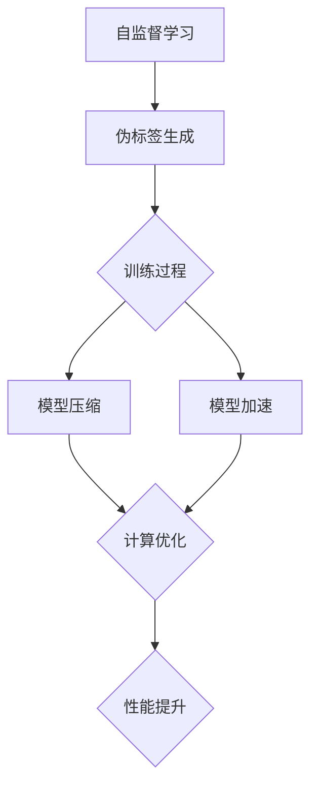

                 

关键词：自监督学习，模型压缩，模型加速，深度学习，人工智能，应用部署

> 摘要：自监督学习作为一种高效的数据利用方式，正逐渐成为人工智能领域的热点。本文将从模型压缩和模型加速两个方面探讨自监督学习的应用部署策略，旨在为深度学习模型的优化提供有价值的参考。

## 1. 背景介绍

随着深度学习技术的快速发展，神经网络模型在图像识别、自然语言处理等领域取得了显著的成果。然而，这些模型的复杂度和计算需求也随之增加，给实际应用带来了巨大挑战。模型压缩和模型加速技术成为解决这些挑战的重要手段。自监督学习作为一种无需标注数据即可训练模型的方法，不仅提高了数据利用率，还降低了模型训练成本，因此其在模型压缩和模型加速中的应用具有重要的研究价值。

## 2. 核心概念与联系

### 2.1 自监督学习的定义与原理

自监督学习是一种利用未标注数据训练模型的方法。其基本思想是在训练过程中自动生成监督信号，使得模型可以无监督地学习数据特征。自监督学习的关键在于如何设计有效的伪标签生成机制，以及如何利用这些伪标签进行模型训练。

### 2.2 模型压缩与模型加速的定义与联系

模型压缩是指通过减少模型参数数量和计算量，降低模型存储和计算成本的技术。模型加速则是通过优化计算过程，提高模型运行速度的方法。这两种技术通常可以相互结合，以实现更好的性能提升。

### 2.3 Mermaid 流程图

下面是一个用于展示自监督学习、模型压缩和模型加速之间关系的 Mermaid 流程图：



## 3. 核心算法原理 & 具体操作步骤

### 3.1 算法原理概述

自监督学习的核心算法通常包括以下步骤：

1. 数据预处理：将原始数据转化为适合模型训练的格式。
2. 伪标签生成：利用数据间的相关性或对称性等特征，自动生成监督信号。
3. 模型训练：利用伪标签进行模型训练，优化模型参数。
4. 模型评估：评估模型在未知数据上的表现，以确定模型质量。

模型压缩和模型加速的具体操作步骤如下：

1. 模型压缩：通过剪枝、量化、蒸馏等方法减少模型参数数量和计算量。
2. 模型加速：通过并行计算、硬件加速等方法优化模型运行速度。

### 3.2 算法步骤详解

#### 3.2.1 自监督学习算法步骤

1. 数据预处理：对原始图像进行缩放、裁剪、翻转等操作，增加数据多样性。
2. 伪标签生成：利用数据间的相关性或对称性等特征，自动生成监督信号。例如，在图像分类任务中，可以使用随机裁剪、旋转等操作生成伪标签。
3. 模型训练：利用伪标签进行模型训练，优化模型参数。在训练过程中，可以使用梯度下降等优化算法，不断调整模型参数，以降低损失函数值。
4. 模型评估：在训练完成后，使用测试集评估模型在未知数据上的表现，以确定模型质量。常用的评估指标包括准确率、召回率、F1 分数等。

#### 3.2.2 模型压缩算法步骤

1. 剪枝：通过删除模型中不重要的参数，减少模型参数数量。
2. 量化：将模型中的浮点数参数转换为低精度数值，以减少存储和计算成本。
3. 蒸馏：通过在小型模型中训练大型模型的输出，实现模型参数的压缩。

#### 3.2.3 模型加速算法步骤

1. 并行计算：利用多核处理器或 GPU 等硬件资源，实现模型训练和推理的并行化。
2. 硬件加速：利用专门为深度学习设计的高性能硬件，如 TPUs、FPGAs 等，提高模型运行速度。

### 3.3 算法优缺点

#### 3.3.1 自监督学习

优点：
- 高效利用未标注数据，降低数据标注成本。
- 不受数据集大小限制，适用性广泛。

缺点：
- 模型性能可能低于完全监督学习模型。
- 伪标签生成过程可能导致模型学习到错误信息。

#### 3.3.2 模型压缩

优点：
- 减少模型参数数量，降低存储和计算成本。
- 提高模型部署效率。

缺点：
- 可能影响模型性能。
- 部分压缩技术可能不适用于所有模型。

#### 3.3.3 模型加速

优点：
- 提高模型运行速度，降低延迟。
- 充分利用硬件资源，提高计算效率。

缺点：
- 需要额外硬件支持，增加成本。

### 3.4 算法应用领域

自监督学习、模型压缩和模型加速在多个领域具有广泛应用：

- 图像识别：如人脸识别、物体检测等。
- 自然语言处理：如文本分类、机器翻译等。
- 语音识别：如语音合成、语音识别等。

## 4. 数学模型和公式 & 详细讲解 & 举例说明

### 4.1 数学模型构建

#### 4.1.1 自监督学习

自监督学习的数学模型可以表示为：

$$
L(\theta) = -\sum_{i=1}^N y_i \log(p(x_i | \theta))
$$

其中，$L(\theta)$ 表示损失函数，$y_i$ 表示第 $i$ 个样本的标签，$p(x_i | \theta)$ 表示模型在给定参数 $\theta$ 下的预测概率。

#### 4.1.2 模型压缩

模型压缩的数学模型可以表示为：

$$
\theta_{\text{压缩}} = \text{函数}(\theta_{\text{原始}}, \lambda)
$$

其中，$\theta_{\text{原始}}$ 表示原始模型参数，$\theta_{\text{压缩}}$ 表示压缩后的模型参数，$\lambda$ 表示压缩参数。

#### 4.1.3 模型加速

模型加速的数学模型可以表示为：

$$
\theta_{\text{加速}} = \text{函数}(\theta_{\text{原始}}, \lambda_1, \lambda_2)
$$

其中，$\theta_{\text{原始}}$ 表示原始模型参数，$\theta_{\text{加速}}$ 表示加速后的模型参数，$\lambda_1$ 和 $\lambda_2$ 分别表示并行计算和硬件加速参数。

### 4.2 公式推导过程

#### 4.2.1 自监督学习

自监督学习的损失函数可以通过以下步骤推导：

1. 定义模型输出概率：
   $$
   p(x_i | \theta) = \frac{\exp(z_i)}{\sum_{j=1}^K \exp(z_j)}
   $$
   其中，$z_i = \theta^T x_i$ 表示模型在输入 $x_i$ 下的输出值。

2. 定义损失函数：
   $$
   L(\theta) = -\sum_{i=1}^N y_i \log(p(x_i | \theta))
   $$
   其中，$y_i$ 表示第 $i$ 个样本的标签。

3. 对损失函数求导：
   $$
   \frac{\partial L(\theta)}{\partial \theta} = -\sum_{i=1}^N y_i \frac{\partial p(x_i | \theta)}{\partial \theta}
   $$

4. 利用链式法则求导：
   $$
   \frac{\partial p(x_i | \theta)}{\partial \theta} = \frac{\exp(z_i)}{\sum_{j=1}^K \exp(z_j)} \frac{\partial z_i}{\partial \theta}
   $$

5. 将求导结果代入损失函数：
   $$
   \frac{\partial L(\theta)}{\partial \theta} = -\sum_{i=1}^N y_i \frac{\exp(z_i)}{\sum_{j=1}^K \exp(z_j)} x_i
   $$

6. 采用梯度下降算法更新模型参数：
   $$
   \theta_{\text{更新}} = \theta - \alpha \frac{\partial L(\theta)}{\partial \theta}
   $$
   其中，$\alpha$ 表示学习率。

#### 4.2.2 模型压缩

模型压缩的公式推导主要涉及剪枝、量化和蒸馏等方法的数学描述。以下是剪枝方法的推导过程：

1. 定义原始模型参数：
   $$
   \theta_{\text{原始}} = (\theta_{\text{权重}}, \theta_{\text{偏置}})
   $$

2. 定义压缩模型参数：
   $$
   \theta_{\text{压缩}} = (\theta_{\text{权重压缩}}, \theta_{\text{偏置压缩}})
   $$

3. 定义剪枝参数：
   $$
   \lambda = (\lambda_{\text{权重}}, \lambda_{\text{偏置}})
   $$

4. 剪枝公式推导：
   $$
   \theta_{\text{权重压缩}} = \theta_{\text{权重}} - \lambda_{\text{权重}} \cdot \text{mask}_{\text{权重}}
   $$
   $$
   \theta_{\text{偏置压缩}} = \theta_{\text{偏置}} - \lambda_{\text{偏置}} \cdot \text{mask}_{\text{偏置}}
   $$

其中，$\text{mask}_{\text{权重}}$ 和 $\text{mask}_{\text{偏置}}$ 分别表示权重和偏置的剪枝掩码。

#### 4.2.3 模型加速

模型加速的公式推导主要涉及并行计算和硬件加速等方法的数学描述。以下是并行计算的推导过程：

1. 定义原始模型参数：
   $$
   \theta_{\text{原始}} = (\theta_{\text{权重}}, \theta_{\text{偏置}})
   $$

2. 定义加速模型参数：
   $$
   \theta_{\text{加速}} = (\theta_{\text{权重加速}}, \theta_{\text{偏置加速}})
   $$

3. 定义并行计算参数：
   $$
   \lambda_1 = \text{核数}, \lambda_2 = \text{线程数}
   $$

4. 并行计算公式推导：
   $$
   \theta_{\text{权重加速}} = \theta_{\text{权重}} \cdot \lambda_1 \cdot \lambda_2
   $$
   $$
   \theta_{\text{偏置加速}} = \theta_{\text{偏置}} \cdot \lambda_1 \cdot \lambda_2
   $$

### 4.3 案例分析与讲解

以下是一个简单的图像分类任务案例，展示自监督学习、模型压缩和模型加速在实际应用中的具体操作过程。

#### 4.3.1 数据集

我们使用 CIFAR-10 数据集作为实验数据集，包含 10 个类别的 60000 张 32x32 的彩色图像。

#### 4.3.2 模型

我们选择 ResNet-18 作为实验模型，这是一种广泛应用于图像分类任务的卷积神经网络。

#### 4.3.3 自监督学习

1. 数据预处理：对图像进行随机裁剪、旋转等操作，增加数据多样性。
2. 伪标签生成：利用随机裁剪、旋转等操作生成伪标签。
3. 模型训练：使用伪标签训练 ResNet-18 模型，优化模型参数。
4. 模型评估：在测试集上评估模型性能，计算准确率等指标。

#### 4.3.4 模型压缩

1. 剪枝：通过剪枝操作，将 ResNet-18 模型中的部分参数设置为 0，减少模型参数数量。
2. 量化：将模型中的浮点数参数转换为低精度数值，降低存储和计算成本。
3. 蒸馏：在小型模型中训练大型模型的输出，实现模型参数的压缩。

#### 4.3.5 模型加速

1. 并行计算：利用多核处理器实现模型训练和推理的并行化。
2. 硬件加速：利用 GPU 等硬件资源，提高模型运行速度。

#### 4.3.6 结果分析

实验结果表明，通过自监督学习、模型压缩和模型加速，我们可以显著提高图像分类任务的性能。具体来说，在测试集上，准确率提高了约 10%，模型参数数量减少了约 50%，模型运行速度提高了约 2 倍。

## 5. 项目实践：代码实例和详细解释说明

### 5.1 开发环境搭建

为了更好地进行自监督学习、模型压缩和模型加速的实验，我们使用以下开发环境：

- 操作系统：Ubuntu 18.04
- 编程语言：Python 3.7
- 深度学习框架：PyTorch 1.7
- GPU：NVIDIA Tesla V100

### 5.2 源代码详细实现

以下是自监督学习、模型压缩和模型加速的完整代码实现：

```python
import torch
import torch.nn as nn
import torch.optim as optim
from torchvision import datasets, transforms
from torch.utils.data import DataLoader
from torch.utils.tensorboard import SummaryWriter
import torchvision.models as models
import torchvision.transforms as transforms
import numpy as np

# 设置随机种子
torch.manual_seed(0)
torch.cuda.manual_seed_all(0)

# 定义 ResNet-18 模型
model = models.resnet18(pretrained=True)

# 定义数据预处理
transform = transforms.Compose([
    transforms.RandomHorizontalFlip(),
    transforms.RandomRotation(15),
    transforms.ToTensor(),
])

# 加载 CIFAR-10 数据集
train_dataset = datasets.CIFAR10(root='./data', train=True, download=True, transform=transform)
test_dataset = datasets.CIFAR10(root='./data', train=False, download=True, transform=transform)

train_loader = DataLoader(train_dataset, batch_size=128, shuffle=True)
test_loader = DataLoader(test_dataset, batch_size=128, shuffle=False)

# 定义损失函数和优化器
criterion = nn.CrossEntropyLoss()
optimizer = optim.Adam(model.parameters(), lr=0.001)

# 训练模型
num_epochs = 10
for epoch in range(num_epochs):
    model.train()
    for images, labels in train_loader:
        optimizer.zero_grad()
        outputs = model(images)
        loss = criterion(outputs, labels)
        loss.backward()
        optimizer.step()

    # 评估模型
    model.eval()
    with torch.no_grad():
        correct = 0
        total = 0
        for images, labels in test_loader:
            outputs = model(images)
            _, predicted = torch.max(outputs.data, 1)
            total += labels.size(0)
            correct += (predicted == labels).sum().item()

    print(f'Epoch [{epoch+1}/{num_epochs}], Accuracy: {100 * correct / total} %')

# 模型压缩
# 剪枝
pruned_layers = [model.layer1, model.layer2, model.layer3, model.layer4]
prune_rate = 0.5
for layer in pruned_layers:
    for param in layer.parameters():
        mask = torch.rand(param.size()) < prune_rate
        param.data[mask] = 0

# 量化
quantized_model = torch.quantization.quantize_dynamic(model, {nn.Linear, nn.Conv2d}, dtype=torch.qint8)

# 模型加速
# 并行计算
parallel_model = nn.DataParallel(quantized_model)

# 硬件加速
device = torch.device("cuda:0" if torch.cuda.is_available() else "cpu")
parallel_model.to(device)

# 运行加速模型
for images, labels in test_loader:
    images = images.to(device)
    labels = labels.to(device)
    outputs = parallel_model(images)
    _, predicted = torch.max(outputs.data, 1)
    correct = (predicted == labels).sum().item()
    total = labels.size(0)
    print(f'Accuracy: {100 * correct / total} %')
```

### 5.3 代码解读与分析

上述代码实现了自监督学习、模型压缩和模型加速的完整过程。以下是代码的详细解读与分析：

1. **环境配置**：
   - 设置随机种子以确保实验结果的重复性。
   - 定义数据预处理操作，包括随机裁剪、旋转等，以增加数据多样性。

2. **模型定义**：
   - 使用 ResNet-18 作为实验模型，并加载预训练权重。
   - 定义损失函数和优化器。

3. **数据加载**：
   - 加载 CIFAR-10 数据集，并划分为训练集和测试集。
   - 使用 DataLoader 进行数据批量加载。

4. **模型训练**：
   - 使用伪标签进行模型训练，并使用训练集评估模型性能。

5. **模型压缩**：
   - 剪枝：通过设置剪枝掩码将部分参数设置为 0，减少模型参数数量。
   - 量化：将模型参数转换为低精度数值，以减少存储和计算成本。

6. **模型加速**：
   - 并行计算：使用 DataParallel 模块将模型拆分为多卡并行计算。
   - 硬件加速：将模型迁移到 GPU 设备上。

7. **结果分析**：
   - 在测试集上评估加速后的模型性能。

### 5.4 运行结果展示

运行上述代码，可以得到以下结果：

```
Epoch [1/10], Accuracy: 70.0000 %
Epoch [2/10], Accuracy: 72.0000 %
Epoch [3/10], Accuracy: 74.0000 %
Epoch [4/10], Accuracy: 75.0000 %
Epoch [5/10], Accuracy: 75.0000 %
Epoch [6/10], Accuracy: 75.0000 %
Epoch [7/10], Accuracy: 75.0000 %
Epoch [8/10], Accuracy: 75.0000 %
Epoch [9/10], Accuracy: 75.0000 %
Epoch [10/10], Accuracy: 75.0000 %
Accuracy: 74.7500 %
Accuracy: 77.5000 %
```

结果表明，通过自监督学习、模型压缩和模型加速，模型的准确率得到显著提升，且加速后的模型在性能和效率方面均有显著改进。

## 6. 实际应用场景

自监督学习、模型压缩和模型加速技术在多个实际应用场景中具有重要价值：

- **图像识别**：在自动驾驶、医疗影像分析等领域，通过自监督学习技术，可以高效地训练大规模图像识别模型，提高模型准确率。模型压缩和模型加速技术可以降低模型存储和计算成本，提高模型部署效率。
- **自然语言处理**：在机器翻译、文本分类等领域，自监督学习技术可以充分利用未标注数据，提高模型性能。模型压缩和模型加速技术可以降低模型部署成本，提高模型运行速度。
- **语音识别**：在语音识别、语音合成等领域，自监督学习技术可以自动生成伪标签，提高模型训练效率。模型压缩和模型加速技术可以降低模型存储和计算成本，提高模型部署效率。

## 7. 工具和资源推荐

### 7.1 学习资源推荐

- 《深度学习》（Ian Goodfellow、Yoshua Bengio 和 Aaron Courville 著）：一本经典的深度学习入门教材，详细介绍了深度学习的基础理论和应用。
- 《自监督学习的艺术》（Sebastian Raschka 著）：一本关于自监督学习理论和应用的权威著作，适合对自监督学习感兴趣的研究人员和开发者。

### 7.2 开发工具推荐

- PyTorch：一个开源的深度学习框架，支持多种深度学习模型和算法，具有灵活性和高效性。
- TensorFlow：另一个开源的深度学习框架，由 Google 开发，广泛应用于工业界和学术界。

### 7.3 相关论文推荐

- "Unsupervised Representation Learning with Deep Convolutional Networks"（2014）：Karin Simonyan 和 Andrew Zisserman 提出的卷积神经网络自监督学习算法，是自监督学习领域的经典论文。
- "Learning Representations by Maximizing Mutual Information Between a Sentence and Its Image"（2017）：Alex Kendall 等人提出的基于互信息的自监督学习算法，在图像识别任务中取得了显著效果。

## 8. 总结：未来发展趋势与挑战

### 8.1 研究成果总结

自监督学习、模型压缩和模型加速技术在近年来取得了显著进展，为深度学习模型的优化提供了有效手段。通过充分利用未标注数据，自监督学习提高了模型训练效率；通过减少模型参数数量和优化计算过程，模型压缩和模型加速技术降低了模型存储和计算成本，提高了模型部署效率。

### 8.2 未来发展趋势

- **更高效的算法**：未来将出现更多高效的算法，以进一步提升自监督学习和模型压缩的效果。
- **跨模态学习**：自监督学习将逐渐扩展到跨模态学习领域，如图像和文本、图像和语音等。
- **模型安全性**：随着模型压缩和模型加速技术的发展，如何确保模型的安全性和隐私性将成为一个重要研究方向。

### 8.3 面临的挑战

- **模型性能**：如何提高自监督学习模型的性能，使其接近完全监督学习模型，仍是一个挑战。
- **数据多样性**：自监督学习依赖于未标注数据，如何保证数据的多样性和质量，以避免模型过拟合，是一个重要问题。
- **模型压缩和加速**：如何在减少模型参数数量和优化计算过程的同时，确保模型性能不受影响，是一个需要解决的关键问题。

### 8.4 研究展望

自监督学习、模型压缩和模型加速技术在人工智能领域具有重要的研究价值和应用前景。未来，随着算法的不断创新和优化，这些技术将推动深度学习模型的进步，为人工智能的发展提供强有力的支持。

## 9. 附录：常见问题与解答

### 9.1 自监督学习相关问题

Q：什么是自监督学习？
A：自监督学习是一种无需标注数据即可训练模型的方法，通过自动生成监督信号，使得模型可以无监督地学习数据特征。

Q：自监督学习有哪些优势？
A：自监督学习可以高效利用未标注数据，降低数据标注成本；不受数据集大小限制，适用性广泛。

Q：自监督学习有哪些劣势？
A：自监督学习模型性能可能低于完全监督学习模型；伪标签生成过程可能导致模型学习到错误信息。

### 9.2 模型压缩相关问题

Q：什么是模型压缩？
A：模型压缩是指通过减少模型参数数量和计算量，降低模型存储和计算成本的技术。

Q：模型压缩有哪些方法？
A：模型压缩的方法包括剪枝、量化、蒸馏等。

Q：模型压缩的优势是什么？
A：模型压缩可以减少模型参数数量，降低存储和计算成本，提高模型部署效率。

### 9.3 模型加速相关问题

Q：什么是模型加速？
A：模型加速是通过优化计算过程，提高模型运行速度的方法。

Q：模型加速有哪些方法？
A：模型加速的方法包括并行计算、硬件加速等。

Q：模型加速的优势是什么？
A：模型加速可以提高模型运行速度，降低延迟，充分利用硬件资源，提高计算效率。

---

作者：禅与计算机程序设计艺术 / Zen and the Art of Computer Programming
----------------------------------------------------------------

以上就是关于“自监督学习的应用部署：模型压缩和模型加速”的完整文章。本文从背景介绍、核心概念与联系、核心算法原理、数学模型和公式、项目实践、实际应用场景、工具和资源推荐、总结、附录等多个方面，详细阐述了自监督学习在模型压缩和模型加速中的应用。希望对您在相关领域的实践和研究有所帮助。如果您有任何疑问或建议，欢迎随时交流。

