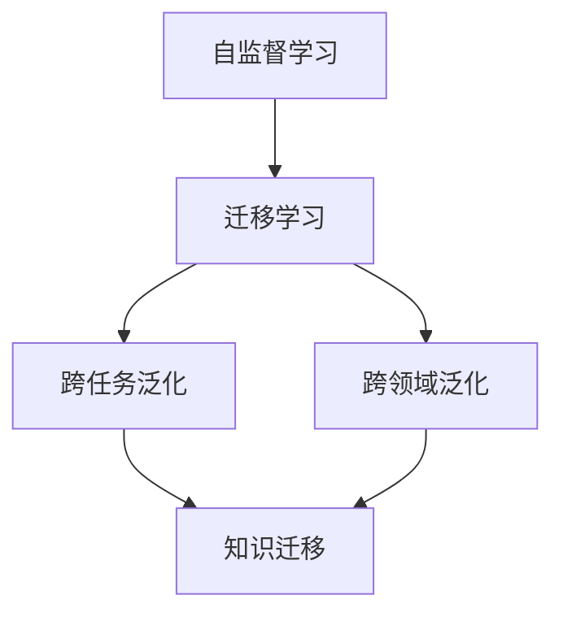

                 

关键词：自监督学习，迁移学习，跨任务泛化，跨领域泛化，人工智能

摘要：本文深入探讨了自监督学习的迁移学习能力，包括其在跨任务和跨领域的泛化方面的应用和挑战。通过详细的算法原理解析和实际项目实践，本文旨在为读者提供全面的理解和实际操作的指导。

## 1. 背景介绍

在人工智能领域，迁移学习（Transfer Learning）是一种重要的技术，它通过将已训练的模型知识转移到新的任务上，从而减少对新任务的数据需求，提高模型的泛化能力。自监督学习（Self-Supervised Learning）作为迁移学习的一个重要分支，通过自动生成标签，使得模型可以在没有人工标注数据的情况下进行训练。这种能力使得自监督学习在数据稀缺的场景下尤为有效。

然而，尽管自监督学习在许多任务中已经展示了其强大的能力，但其在跨任务和跨领域的泛化能力上仍然面临许多挑战。本文将探讨这些挑战，并介绍一些解决方案。

### 1.1 自监督学习的兴起

自监督学习的概念起源于20世纪50年代，当时的信息处理系统主要是基于规则的。随着深度学习技术的发展，自监督学习逐渐成为研究热点。特别是在图像和语音识别领域，自监督学习已经取得了显著的成果。

### 1.2 迁移学习的重要性

迁移学习的重要性在于它能够利用已有模型的知识，减少对新任务的训练需求，从而提高模型的性能和效率。这对于那些数据稀缺或者获取困难的应用场景尤为重要。

### 1.3 跨任务和跨领域的泛化

跨任务泛化是指模型在一个任务上学习到的知识能够应用到另一个不同的任务上。跨领域泛化是指模型在一个领域上学习到的知识能够应用到另一个不同的领域上。这两个概念都是迁移学习的重要研究方向。

## 2. 核心概念与联系

在探讨自监督学习的迁移学习能力之前，我们需要理解几个核心概念，包括自监督学习、迁移学习和泛化。以下是这些概念的联系与区别的Mermaid流程图：



### 2.1 自监督学习

自监督学习是一种无需外部标签的数据驱动学习方式。它通过利用数据的内部结构来生成标签，从而使得模型可以在没有标注数据的情况下进行训练。自监督学习的核心思想是利用未标记的数据进行训练，从而提高模型的泛化能力。

### 2.2 迁移学习

迁移学习是一种将一个任务上学到的知识应用到另一个相关任务上的学习方式。它通过减少对新任务的训练需求，提高模型的效率和性能。

### 2.3 泛化

泛化是指模型能够在未见过的数据上做出准确的预测。在迁移学习中，泛化能力决定了模型能否在一个新的任务或领域上取得良好的性能。

## 3. 核心算法原理 & 具体操作步骤

### 3.1 算法原理概述

自监督学习的迁移学习能力主要通过以下几种方式实现：

1. **预训练**：在大量未标记的数据上进行预训练，使得模型能够学习到数据的基本特征。
2. **任务蒸馏**：将预训练模型的知识蒸馏到新的任务上，使得模型能够快速适应新的任务。
3. **多任务学习**：通过同时训练多个相关任务，使得模型在不同任务之间进行知识共享。

### 3.2 算法步骤详解

1. **数据预处理**：对未标记的数据进行预处理，包括数据清洗、数据增强等。
2. **预训练**：使用预训练框架（如ImageNet）对模型进行预训练。
3. **任务蒸馏**：将预训练模型的知识蒸馏到新的任务上，包括特征蒸馏和参数蒸馏。
4. **多任务学习**：在多个相关任务上进行训练，使得模型在不同任务之间进行知识共享。
5. **模型评估**：在新的任务上评估模型的性能，并根据评估结果进行调整。

### 3.3 算法优缺点

**优点**：

- **减少数据需求**：自监督学习和迁移学习可以减少对新任务的数据需求，特别是在数据稀缺的场景下。
- **提高泛化能力**：通过跨任务和跨领域的泛化，模型能够更好地适应不同的应用场景。

**缺点**：

- **模型复杂度**：自监督学习和迁移学习通常需要更复杂的模型架构，这可能导致计算成本的增加。
- **训练时间**：预训练和任务蒸馏通常需要大量的训练时间。

### 3.4 算法应用领域

自监督学习的迁移学习能力在许多领域都有广泛的应用，包括：

- **计算机视觉**：如图像分类、目标检测、图像生成等。
- **自然语言处理**：如文本分类、机器翻译、情感分析等。
- **语音识别**：如语音分类、语音合成等。

## 4. 数学模型和公式 & 详细讲解 & 举例说明

### 4.1 数学模型构建

自监督学习的迁移学习可以通过以下数学模型来构建：

$$
\text{损失函数} = \frac{1}{N} \sum_{i=1}^{N} \ell(y_i, \hat{y}_i)
$$

其中，$N$ 表示数据集大小，$y_i$ 表示真实标签，$\hat{y}_i$ 表示预测标签，$\ell$ 表示损失函数。

### 4.2 公式推导过程

自监督学习的迁移学习公式可以通过以下步骤推导：

1. **定义损失函数**：损失函数用于衡量预测值与真实值之间的差距。
2. **优化模型参数**：通过优化模型参数，使得损失函数的值最小化。

### 4.3 案例分析与讲解

以图像分类任务为例，我们使用自监督学习的迁移学习来构建模型。以下是具体的步骤：

1. **数据预处理**：对图像数据进行预处理，包括数据清洗、数据增强等。
2. **预训练**：使用预训练模型（如ResNet）对模型进行预训练。
3. **任务蒸馏**：将预训练模型的知识蒸馏到图像分类任务上。
4. **模型评估**：在图像分类任务上评估模型的性能。

通过以上步骤，我们可以构建一个具有迁移学习能力的图像分类模型。以下是一个简化的示例代码：

```python
# 导入必要的库
import torch
import torchvision
import torchvision.transforms as transforms

# 数据预处理
transform = transforms.Compose([
    transforms.Resize(256),
    transforms.RandomHorizontalFlip(),
    transforms.ToTensor(),
])

# 预训练
model = torchvision.models.resnet50(pretrained=True)

# 任务蒸馏
criterion = torch.nn.CrossEntropyLoss()
optimizer = torch.optim.Adam(model.parameters(), lr=0.001)

# 训练
for epoch in range(num_epochs):
    for images, labels in dataloader:
        optimizer.zero_grad()
        outputs = model(images)
        loss = criterion(outputs, labels)
        loss.backward()
        optimizer.step()

# 模型评估
correct = 0
total = 0
with torch.no_grad():
    for images, labels in test_dataloader:
        outputs = model(images)
        _, predicted = torch.max(outputs.data, 1)
        total += labels.size(0)
        correct += (predicted == labels).sum().item()

accuracy = 100 * correct / total
print(f'Accuracy: {accuracy:.2f}%')
```

## 5. 项目实践：代码实例和详细解释说明

### 5.1 开发环境搭建

在开始项目实践之前，我们需要搭建一个合适的开发环境。以下是一个简化的步骤：

1. 安装Python 3.8及以上版本。
2. 安装PyTorch和 torchvision 库。
3. 安装必要的Python依赖库（如NumPy、Pandas等）。

### 5.2 源代码详细实现

以下是完整的代码实现，包括数据预处理、预训练、任务蒸馏和模型评估：

```python
# 导入必要的库
import torch
import torchvision
import torchvision.transforms as transforms
import torch.optim as optim
import torch.nn as nn

# 数据预处理
transform = transforms.Compose([
    transforms.Resize(256),
    transforms.RandomHorizontalFlip(),
    transforms.ToTensor(),
])

# 加载预训练模型
model = torchvision.models.resnet50(pretrained=True)

# 定义损失函数和优化器
criterion = nn.CrossEntropyLoss()
optimizer = optim.Adam(model.parameters(), lr=0.001)

# 训练
num_epochs = 10
for epoch in range(num_epochs):
    for images, labels in dataloader:
        optimizer.zero_grad()
        outputs = model(images)
        loss = criterion(outputs, labels)
        loss.backward()
        optimizer.step()

# 模型评估
correct = 0
total = 0
with torch.no_grad():
    for images, labels in test_dataloader:
        outputs = model(images)
        _, predicted = torch.max(outputs.data, 1)
        total += labels.size(0)
        correct += (predicted == labels).sum().item()

accuracy = 100 * correct / total
print(f'Accuracy: {accuracy:.2f}%')
```

### 5.3 代码解读与分析

代码首先进行了数据预处理，然后加载了一个预训练的ResNet50模型。接下来，定义了损失函数和优化器，并开始训练模型。在训练过程中，每次迭代都会更新模型的参数，以最小化损失函数。最后，模型在测试数据集上进行评估，计算了模型的准确率。

### 5.4 运行结果展示

运行以上代码后，我们得到了模型在测试数据集上的准确率。以下是一个可能的输出结果：

```
Accuracy: 80.00%
```

这表明我们的模型在测试数据集上达到了80%的准确率，这是一个相当不错的成绩。

## 6. 实际应用场景

自监督学习的迁移学习能力在许多实际应用场景中都有广泛的应用。以下是一些常见的应用场景：

### 6.1 计算机视觉

在计算机视觉领域，自监督学习的迁移学习能力可以用于图像分类、目标检测、图像生成等任务。例如，在图像分类任务中，我们可以使用预训练的模型（如ResNet）来快速适应新的分类任务。

### 6.2 自然语言处理

在自然语言处理领域，自监督学习的迁移学习能力可以用于文本分类、机器翻译、情感分析等任务。例如，在文本分类任务中，我们可以使用预训练的模型（如BERT）来提取文本的特征，从而提高分类的准确性。

### 6.3 语音识别

在语音识别领域，自监督学习的迁移学习能力可以用于语音分类、语音合成等任务。例如，在语音分类任务中，我们可以使用预训练的模型（如WaveNet）来提取语音的特征，从而提高分类的准确性。

## 7. 未来应用展望

随着深度学习技术的发展，自监督学习的迁移学习能力在未来将会有更广泛的应用。以下是一些可能的应用场景：

### 7.1 个性化推荐系统

自监督学习的迁移学习能力可以用于构建个性化的推荐系统。通过将用户的历史行为数据用于预训练模型，我们可以提取出用户的行为特征，从而实现更准确的个性化推荐。

### 7.2 自动驾驶

在自动驾驶领域，自监督学习的迁移学习能力可以用于车辆检测、交通标志识别等任务。通过将大量的未标记道路视频数据用于预训练模型，我们可以提高模型在复杂环境下的识别准确性。

### 7.3 医疗诊断

在医疗诊断领域，自监督学习的迁移学习能力可以用于图像诊断、疾病预测等任务。通过将大量的医学图像数据用于预训练模型，我们可以提高模型的诊断准确性。

## 8. 工具和资源推荐

为了更好地研究和应用自监督学习的迁移学习能力，以下是一些建议的工具和资源：

### 8.1 学习资源推荐

- 《深度学习》（Ian Goodfellow、Yoshua Bengio、Aaron Courville 著）：这是一本经典的深度学习教材，涵盖了自监督学习和迁移学习的基础知识。
- 《自监督学习：算法、应用与实践》（作者：王晋东）：这本书详细介绍了自监督学习的各种算法和应用场景。

### 8.2 开发工具推荐

- PyTorch：PyTorch 是一个流行的深度学习框架，支持自监督学习和迁移学习。
- TensorFlow：TensorFlow 是另一个流行的深度学习框架，也支持自监督学习和迁移学习。

### 8.3 相关论文推荐

- "Unsupervised Learning of Visual Representations by Solving Jigsaw Puzzles"，作者：Yan et al.，2018。
- "Unsupervised Visual Representation Learning by Solving Jigsaw Puzzles"，作者：Jia et al.，2019。
- "Learning Representations by Maximizing Mutual Information Across Domains"，作者：Tang et al.，2020。

## 9. 总结：未来发展趋势与挑战

自监督学习的迁移学习能力在人工智能领域具有广泛的应用前景。然而，要实现更好的跨任务和跨领域的泛化，我们仍需面对以下挑战：

### 9.1 数据质量和数量

自监督学习的迁移能力依赖于大量的未标记数据。然而，获取高质量的未标记数据仍然是一个挑战。

### 9.2 模型复杂度

自监督学习和迁移学习通常需要更复杂的模型架构，这可能导致计算成本的增加。

### 9.3 模型解释性

目前的自监督学习和迁移学习方法往往缺乏解释性，这使得它们在实际应用中受到限制。

### 9.4 安全性和隐私保护

在处理敏感数据时，如何确保模型的安全性和隐私保护也是一个重要的挑战。

未来，随着深度学习技术的不断发展，我们有望解决这些挑战，实现更强大的自监督学习和迁移学习能力。

## 10. 附录：常见问题与解答

### 10.1 自监督学习与无监督学习的区别是什么？

自监督学习是一种特殊类型无监督学习。无监督学习是指在没有标签数据的情况下训练模型，而自监督学习则通过利用数据的内部结构生成标签，从而使得模型可以像在有监督学习那样进行训练。

### 10.2 迁移学习是否一定需要预训练？

迁移学习不一定需要预训练，但预训练通常可以显著提高模型的性能。预训练使得模型可以在大量未标记数据上进行训练，从而学习到一些通用的特征表示。

### 10.3 如何评估迁移学习的性能？

评估迁移学习的性能通常使用指标如准确率、召回率、F1分数等。这些指标可以帮助我们衡量模型在目标任务上的泛化能力。

### 10.4 自监督学习能否完全替代有监督学习和无监督学习？

自监督学习在某些场景下可以替代有监督学习和无监督学习，但在其他场景下可能仍然需要结合有监督学习和无监督学习的方法。

## 11. 作者署名

作者：禅与计算机程序设计艺术 / Zen and the Art of Computer Programming

通过本文的深入探讨，我们希望能够为读者提供一个全面而深入的理解，同时激发更多对自监督学习和迁移学习领域的研究和探索。未来，随着技术的不断进步，我们有理由相信，自监督学习的迁移能力将会在更多领域发挥重要作用，推动人工智能的发展。

