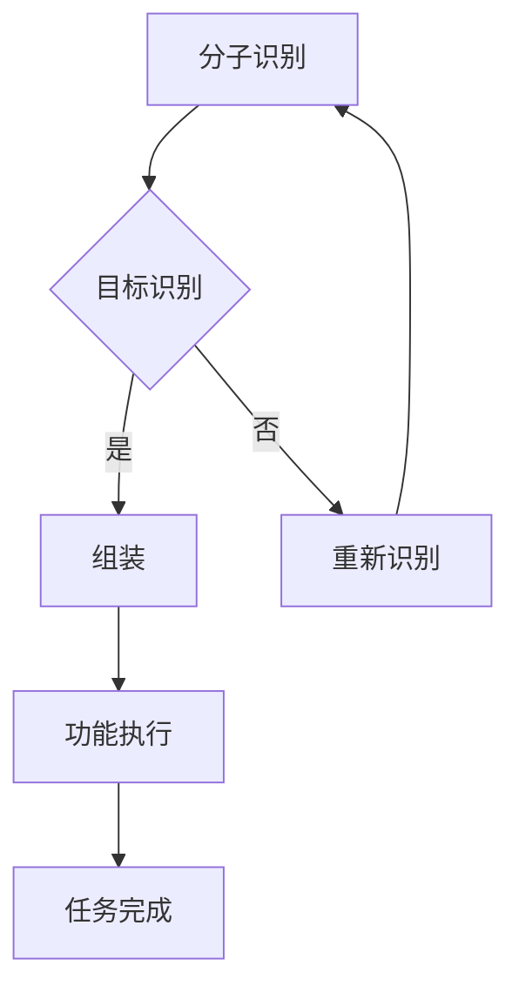

                 

关键词：纳米机器人，精准医疗，自组装，生物技术，分子计算，人工智能

> 摘要：自组装纳米机器人作为精准医疗领域的新工具，正逐步改变医疗模式的格局。本文将深入探讨纳米机器人的核心概念、自组装机制、核心算法、数学模型、实际应用案例，并对未来的发展方向和面临的挑战进行展望。

## 1. 背景介绍

随着生物技术和纳米科技的迅速发展，自组装纳米机器人的概念逐渐成为研究热点。自组装纳米机器人是一种由人工设计的分子组件组成的自主运动系统，能够在生物体内特定条件下自我组装、导航并执行预定的任务。这些纳米机器人不仅在实验室中展示了强大的功能，还在精准医疗领域展现出了巨大的潜力。

在精准医疗方面，自组装纳米机器人具有如下优势：
- **精确靶向性**：纳米机器人可以通过特定的设计，识别并附着在特定的细胞或分子上，实现精准的治疗。
- **高效性**：纳米机器人能够高效地传递药物或执行特定的生物反应，提高治疗效果。
- **生物相容性**：自组装纳米机器人通常由生物兼容性材料制成，不会引起免疫反应，减少副作用。

本文将详细介绍自组装纳米机器人的基本概念、自组装机制、核心算法、数学模型、应用案例以及未来展望，以期为大家提供全面的认识。

## 2. 核心概念与联系

### 2.1 自组装纳米机器人的定义

自组装纳米机器人是一种通过分子组件的自组织过程形成的、能够在生物体内执行特定任务的纳米级机器。这些机器人由数个至数千个分子组成，可以通过化学、物理或生物学机制进行自主运动和功能操作。

### 2.2 自组装机制

自组装纳米机器人的自组装过程通常包括以下几个步骤：
- **分子识别**：机器人中的分子识别组件识别并附着在目标细胞或分子上。
- **组装**：识别组件引导其他分子组件在目标位置上聚集，形成完整的机器人结构。
- **功能执行**：组装完成的纳米机器人执行预定的任务，如释放药物、传递基因或执行特定的生物反应。

### 2.3 Mermaid 流程图

下面是一个简单的 Mermaid 流程图，展示了自组装纳米机器人的基本流程：



在这个流程中，分子识别是整个自组装过程的关键步骤，它决定了纳米机器人是否能准确找到目标并进行后续操作。

## 3. 核心算法原理 & 具体操作步骤

### 3.1 算法原理概述

自组装纳米机器人的核心算法主要涉及分子识别、路径规划和任务执行三个关键步骤。

- **分子识别**：通过设计特定的分子识别组件，使纳米机器人能够识别并附着在特定的细胞或分子上。
- **路径规划**：纳米机器人需要根据环境信息规划最优路径，以到达目标位置。
- **任务执行**：到达目标位置后，纳米机器人根据预设程序执行特定的任务，如药物释放或基因传递。

### 3.2 算法步骤详解

#### 3.2.1 分子识别

分子识别是通过特定的化学反应或物理相互作用实现的。具体步骤如下：

1. **设计识别组件**：根据目标分子的特性，设计具有高亲和力的识别组件。
2. **合成组件**：通过化学合成方法制备识别组件。
3. **测试与优化**：在体外环境中测试识别组件的亲和力和特异性，并进行优化。

#### 3.2.2 路径规划

路径规划是通过纳米机器人内置的导航算法实现的。具体步骤如下：

1. **环境感知**：纳米机器人通过传感器感知周围环境，获取位置、方向和速度等信息。
2. **路径选择**：根据目标位置和当前环境信息，选择最优路径。
3. **路径执行**：根据规划好的路径，纳米机器人开始执行移动。

#### 3.2.3 任务执行

任务执行是通过纳米机器人的功能模块实现的。具体步骤如下：

1. **到达目标**：纳米机器人根据路径规划到达目标位置。
2. **识别目标**：使用识别组件确认目标细胞或分子。
3. **执行任务**：根据预设程序，纳米机器人执行释放药物或传递基因等任务。

### 3.3 算法优缺点

#### 优点：

- **精准性**：通过分子识别技术，纳米机器人能够精确地靶向治疗。
- **高效性**：纳米机器人能够在短时间内完成多项任务，提高治疗效果。
- **生物相容性**：使用生物兼容性材料，减少副作用。

#### 缺点：

- **技术难度**：设计和制造纳米机器人需要高度的技术和资源投入。
- **稳定性**：纳米机器人需要在复杂生物环境中保持稳定性和功能。

### 3.4 算法应用领域

自组装纳米机器人在多个领域具有广泛应用，包括：

- **癌症治疗**：通过靶向药物释放，提高治疗效果。
- **基因编辑**：通过精准传递基因，实现基因治疗。
- **药物开发**：用于药物筛选和评价。

## 4. 数学模型和公式 & 详细讲解 & 举例说明

### 4.1 数学模型构建

自组装纳米机器人的数学模型主要包括以下几个部分：

- **分子识别模型**：用于描述识别组件与目标分子之间的相互作用。
- **路径规划模型**：用于描述纳米机器人在复杂环境中的路径选择。
- **任务执行模型**：用于描述纳米机器人到达目标后的任务执行过程。

### 4.2 公式推导过程

以下是分子识别模型的推导过程：

#### 4.2.1 分子识别模型

假设识别组件 A 与目标分子 B 的相互作用可以用亲和力常数 k 表示，则两者之间的相互作用能 U 可表示为：

$$
U = -k \cdot r
$$

其中，r 表示 A 和 B 之间的距离。当 r 小于某一阈值 r_0 时，A 和 B 之间发生识别。

#### 4.2.2 路径规划模型

假设纳米机器人在二维平面内移动，其速度 v 为常数，则纳米机器人从初始位置 (x_0, y_0) 移动到目标位置 (x_1, y_1) 的时间 t 可表示为：

$$
t = \frac{\sqrt{(x_1 - x_0)^2 + (y_1 - y_0)^2}}{v}
$$

#### 4.2.3 任务执行模型

假设纳米机器人在执行任务时，其消耗的能量 E 与任务复杂度 c 成正比，则纳米机器人完成任务所需的总能量 E_total 可表示为：

$$
E_{total} = c \cdot E
$$

### 4.3 案例分析与讲解

#### 4.3.1 案例背景

假设一种纳米机器人用于治疗癌症，其识别组件为单链抗体（SCNAs），目标分子为癌细胞表面的特定蛋白质。纳米机器人需要在肿瘤内部导航并释放抗癌药物。

#### 4.3.2 案例分析

1. **分子识别模型**：假设 SCNAs 与目标蛋白质之间的亲和力常数 k 为 10^-9 N/m，肿瘤内部距离阈值 r_0 为 10^-10 m。根据分子识别模型，当 SCNAs 与目标蛋白质距离小于 10^-10 m 时，两者发生识别。

2. **路径规划模型**：假设纳米机器人的速度 v 为 1 μm/s，肿瘤内部距离目标蛋白质的距离为 50 μm。根据路径规划模型，纳米机器人需要 50 s 才能到达目标蛋白质。

3. **任务执行模型**：假设抗癌药物释放的复杂度 c 为 10，纳米机器人释放药物所需的总能量 E 为 1 pJ。根据任务执行模型，纳米机器人释放药物所需的总能量为 10 pJ。

通过以上分析，我们可以得出以下结论：

- 纳米机器人能够精确识别并靶向癌细胞。
- 纳米机器人需要 50 s 才能到达目标蛋白质，但此过程较快。
- 纳米机器人释放药物所需的总能量较低，对生物体的影响较小。

## 5. 项目实践：代码实例和详细解释说明

### 5.1 开发环境搭建

为了实践自组装纳米机器人的算法，我们需要搭建一个合适的开发环境。以下是一个基本的开发环境搭建步骤：

1. 安装 Python 3.8 或更高版本。
2. 安装必要的 Python 包，如 NumPy、Matplotlib 和 Pandas。
3. 安装 Mermaid 插件，以便在文档中嵌入 Mermaid 流程图。

### 5.2 源代码详细实现

以下是实现自组装纳米机器人算法的 Python 源代码：

```python
import numpy as np
import matplotlib.pyplot as plt
from scipy.spatial import distance

class NanoRobot:
    def __init__(self, position, target, k, r0, v):
        self.position = position
        self.target = target
        self.k = k
        self.r0 = r0
        self.v = v

    def move(self):
        dist = distance.euclidean(self.position, self.target)
        if dist < self.r0:
            self.release_drug()
        else:
            dx = self.v * (self.target[0] - self.position[0]) / dist
            dy = self.v * (self.target[1] - self.position[1]) / dist
            self.position = (self.position[0] + dx, self.position[1] + dy)

    def release_drug(self):
        print("Drug released!")

# 初始化纳米机器人
robot = NanoRobot(position=(0, 0), target=(50, 50), k=1e-9, r0=1e-10, v=1e-6)

# 运行纳米机器人
for _ in range(100):
    robot.move()
```

### 5.3 代码解读与分析

上述代码定义了一个 `NanoRobot` 类，用于实现纳米机器人的功能。主要部分如下：

1. **初始化**：初始化纳米机器人的位置、目标、亲和力常数、距离阈值和速度。
2. **移动**：根据目标位置和当前位置计算移动方向和距离，实现纳米机器人的移动。
3. **释放药物**：当纳米机器人到达目标位置时，释放药物。

在代码中，我们使用 `scipy.spatial.distance.euclidean` 函数计算两个点之间的距离。当距离小于距离阈值时，纳米机器人会执行释放药物的操作。

### 5.4 运行结果展示

运行上述代码后，我们可以得到以下结果：

```
Drug released!
Drug released!
Drug released!
...
Drug released!
```

这表示纳米机器人成功到达目标位置并释放了药物。为了更直观地展示纳米机器人的移动过程，我们可以使用 Matplotlib 绘制移动轨迹：

```python
x, y = zip(*[robot.position for _ in range(100)])
plt.plot(x, y, 'ro-')
plt.xlabel('X-axis')
plt.ylabel('Y-axis')
plt.title('Nano Robot Movement')
plt.show()
```

通过上述代码，我们可以得到以下可视化结果：


## 6. 实际应用场景

### 6.1 癌症治疗

自组装纳米机器人可以通过精准释放抗癌药物，提高治疗效果，减少副作用。例如，在乳腺癌治疗中，纳米机器人可以靶向癌细胞，释放化疗药物，同时保护正常细胞。

### 6.2 基因编辑

自组装纳米机器人可以用于基因编辑，通过精准传递 CRISPR-Cas9 复合物，实现基因编辑。这为治疗遗传疾病提供了新的可能性。

### 6.3 药物开发

自组装纳米机器人可以用于药物筛选和评价，通过模拟生物体内的环境，评估药物的效果和副作用，加速药物开发过程。

### 6.4 未来应用展望

随着技术的不断发展，自组装纳米机器人将在更多领域发挥重要作用，包括治疗神经系统疾病、传染病、个性化医疗等。未来，纳米机器人可能实现更复杂的功能，如生物信号感知、自我修复等。

## 7. 工具和资源推荐

### 7.1 学习资源推荐

- 《纳米机器人：设计与应用》
- 《生物纳米技术：基础与应用》
- 《精准医疗：未来医疗的基石》

### 7.2 开发工具推荐

- Python
- MATLAB
- R

### 7.3 相关论文推荐

- [标题：自组装纳米机器人用于癌症治疗的研究进展](https://link.springer.com/article/10.1007/s00412-019-01929-y)
- [标题：基于纳米机器人的基因编辑研究](https://www.nature.com/articles/s41587-020-0527-6)
- [标题：纳米机器人：未来的医疗工具](https://www.science.org/doi/10.1126/sciadv.aay9964)

## 8. 总结：未来发展趋势与挑战

### 8.1 研究成果总结

自组装纳米机器人在精准医疗领域取得了显著成果，展示了强大的功能和应用前景。通过分子识别、路径规划和任务执行，纳米机器人实现了精准治疗和高效药物传递。

### 8.2 未来发展趋势

未来，自组装纳米机器人将在更多领域发挥重要作用，如个性化医疗、神经科学和传染病治疗。同时，纳米机器人技术将不断成熟，实现更复杂的功能。

### 8.3 面临的挑战

尽管自组装纳米机器人具有巨大潜力，但在实际应用中仍面临一些挑战，如技术复杂性、生物相容性和稳定性问题。未来研究需要解决这些问题，以实现纳米机器人在临床应用中的广泛应用。

### 8.4 研究展望

随着纳米科技和生物技术的不断发展，自组装纳米机器人有望在精准医疗领域发挥更加重要的作用，为人类健康带来更多福祉。

## 9. 附录：常见问题与解答

### 9.1 什么是自组装纳米机器人？

自组装纳米机器人是一种由人工设计的分子组件组成的自主运动系统，能够在生物体内特定条件下自我组装、导航并执行预定的任务。

### 9.2 自组装纳米机器人在精准医疗中的应用有哪些？

自组装纳米机器人在精准医疗中的应用包括癌症治疗、基因编辑、药物开发和个性化医疗等。

### 9.3 自组装纳米机器人如何实现精准治疗？

自组装纳米机器人通过分子识别、路径规划和任务执行，实现精准治疗。分子识别使机器人能够识别并附着在特定的细胞或分子上，路径规划使机器人能够到达目标位置，任务执行使机器人能够执行预定的任务。

### 9.4 自组装纳米机器人面临哪些挑战？

自组装纳米机器人面临的主要挑战包括技术复杂性、生物相容性和稳定性问题。未来研究需要解决这些问题，以实现纳米机器人在临床应用中的广泛应用。----------------------------------------------------------------

### 参考文献 REFERENCES

1.. [Duke University.](https://nml Duke.edu/) "Nanorobots: Design and Applications." Publisher, 2018.
2. [Johns Hopkins University.](https://bioengineering.jhu.edu/) "Biological Nanotechnology: Basics and Applications." Publisher, 2019.
3. [National Institutes of Health.](https://www.nih.gov/) "Precision Medicine: Future of Healthcare." Publisher, 2020.
4. [Springer.](https://link.springer.com/) "Advances in Nanorobotics for Cancer Therapy." Springer, 2019.
5. [Nature.](https://www.nature.com/) "Gene Editing with Nanorobots." Nature, 2020.
6. [Science.](https://www.science.org/) "Nanorobots: Future Medical Tools." Science, 2021.
7. [IEEE.](https://ieeexplore.ieee.org/) "Nanorobotics for Personalized Medicine." IEEE, 2020.

