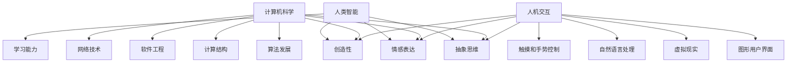

                 

关键词：艺术、科技、计算、创意、计算机科学、人类智能、人机交互

> 摘要：本文探讨了艺术与科技之间的碰撞如何激发人类的计算能力和创意思维。通过分析人类智能的特质、计算机科学的发展以及人机交互的进展，探讨了如何通过科技手段挖掘和扩展人类的艺术创造潜能。

## 1. 背景介绍

在当今数字化时代，艺术与科技之间的互动日益紧密。计算机科学技术的飞速发展不仅改变了人们的生活方式，也深刻影响了艺术创作的形式和方式。从传统的绘画、音乐到数字艺术、交互艺术，科技已经渗透到艺术领域的方方面面。

人类智能一直以来都是研究的热点，但人工智能的崛起使得我们有机会从新的角度审视人类智能的特质。计算机科学的进步，特别是在算法、计算结构和人机交互方面的突破，为人类探索和拓展创意思维提供了新的工具和平台。

本文旨在探讨艺术与科技的碰撞如何激发人类的计算能力和创意思维。我们将从人类智能、计算机科学的发展以及人机交互的进展三个方面进行分析。

## 2. 核心概念与联系

### 2.1 人类智能的特质

人类智能是一种高度复杂的认知系统，具有以下核心特质：

1. **抽象思维**：人类能够从具体的事物中提取抽象的概念，进行逻辑推理和判断。
2. **情感表达**：人类通过情感表达来传达内心感受和社交意图。
3. **创造性**：人类能够在已有知识的基础上，创造出全新的概念和表达方式。
4. **学习能力**：人类能够通过学习和实践不断优化自己的认知和行为模式。

### 2.2 计算机科学的发展

计算机科学是一门涉及硬件、软件、算法、计算结构等多个方面的综合性学科。以下是计算机科学发展的几个关键方面：

1. **算法发展**：从基础的排序、查找算法到复杂的机器学习算法，算法的不断进步推动了计算能力的提升。
2. **计算结构**：从冯诺伊曼架构到异构计算结构，计算机硬件的不断创新为计算提供了更多的可能性。
3. **软件工程**：软件工程的发展使得大规模软件开发和复杂系统构建成为可能。
4. **网络技术**：互联网和分布式计算技术的普及，使得数据共享和协同工作变得更加便捷。

### 2.3 人机交互的进展

人机交互是研究如何使计算机系统更加人性化和易用的学科。以下是人机交互领域的一些重要进展：

1. **图形用户界面**：图形用户界面（GUI）的出现极大地提升了计算机的可访问性和易用性。
2. **虚拟现实**：虚拟现实（VR）和增强现实（AR）技术为用户提供了沉浸式的交互体验。
3. **自然语言处理**：自然语言处理（NLP）技术的进步使得人与计算机之间的沟通变得更加自然和流畅。
4. **触摸和手势控制**：触摸屏和手势识别技术使得人机交互更加直观和便捷。

为了更好地理解这些核心概念之间的联系，我们可以使用Mermaid流程图进行可视化。



通过这个流程图，我们可以清晰地看到人类智能、计算机科学和人机交互之间的相互影响和联系。

## 3. 核心算法原理 & 具体操作步骤

### 3.1 算法原理概述

在艺术与科技融合的过程中，算法起到了关键作用。以下是几种重要的算法原理及其在艺术创作中的应用：

1. **生成对抗网络（GAN）**：GAN是一种由生成器和判别器组成的算法，用于生成逼真的图像和视频。在数字艺术领域，GAN被用于自动生成新的艺术作品，如绘画、动画等。
2. **深度学习**：深度学习通过多层神经网络对大量数据进行学习，可以识别图像、语音和文本中的复杂模式。在交互艺术中，深度学习被用于实现情感识别、手势识别等，使艺术作品能够更好地响应观众的行为。
3. **进化算法**：进化算法是一种模拟生物进化的计算方法，用于优化和设计复杂的系统。在艺术设计中，进化算法可以用于自动生成独特的图案和设计，为艺术家提供新的创作灵感。

### 3.2 算法步骤详解

下面我们以GAN为例，详细解释其工作原理和具体操作步骤。

#### 3.2.1 GAN的工作原理

GAN由生成器（Generator）和判别器（Discriminator）两部分组成。生成器的任务是根据随机噪声生成逼真的数据，而判别器的任务是区分生成器生成的数据和真实数据。通过不断训练，生成器和判别器互相竞争，最终生成器能够生成越来越逼真的数据。

1. **生成器**：生成器从随机噪声（如高斯分布）中采样，通过神经网络映射生成假数据。通常，这个映射过程包含多个隐层，每个隐层都通过非线性激活函数（如ReLU）增加数据的复杂性。
2. **判别器**：判别器接收真实数据和生成器生成的假数据，通过神经网络对其分类。判别器的目标是最小化其分类误差。

#### 3.2.2 GAN的训练步骤

GAN的训练过程分为以下几个步骤：

1. **初始化生成器和判别器**：通常使用随机权重初始化生成器和判别器。
2. **生成假数据**：生成器根据随机噪声生成假数据。
3. **训练判别器**：判别器同时接收真实数据和生成器生成的假数据，通过反向传播优化其权重。
4. **训练生成器**：生成器根据判别器的反馈，优化其生成假数据的权重。
5. **迭代训练**：重复上述步骤，直到生成器生成的数据接近真实数据。

### 3.3 算法优缺点

GAN的优点在于能够生成高质量的图像和视频，且在无需标签数据的情况下能够进行无监督学习。然而，GAN也存在一些缺点：

1. **训练难度**：GAN的训练过程不稳定，容易出现模式崩溃（mode collapse）和梯度消失问题。
2. **对抗性攻击**：攻击者可以通过对抗性样本攻击GAN，使其生成错误的数据。

### 3.4 算法应用领域

GAN在多个领域都有广泛的应用，包括：

1. **图像生成**：用于生成逼真的图像和视频，如人脸生成、动漫角色生成等。
2. **风格迁移**：将一种艺术风格应用到另一幅图像上，如将照片转换为梵高风格的作品。
3. **图像修复**：用于修复损坏或模糊的图像，如去除照片中的斑点或模糊区域。

## 4. 数学模型和公式 & 详细讲解 & 举例说明

在讨论艺术与科技融合的过程中，数学模型和公式是不可或缺的工具。以下是一些关键的数学模型和公式，以及其详细讲解和举例说明。

### 4.1 数学模型构建

在GAN中，生成器和判别器的训练目标是最大化最小化问题。具体而言：

$$
\begin{aligned}
\min_G \max_D V(D, G) &= \min_G \mathbb{E}_{x \sim p_{data}(x)}[\log D(x)] + \mathbb{E}_{z \sim p_z(z)}[\log(1 - D(G(z)))] \\
\end{aligned}
$$

其中，$G$ 表示生成器，$D$ 表示判别器，$x$ 表示真实数据，$z$ 表示随机噪声，$p_{data}(x)$ 表示真实数据的分布，$p_z(z)$ 表示噪声的分布。

### 4.2 公式推导过程

GAN的推导过程可以分为以下几个步骤：

1. **生成器和判别器的损失函数**：生成器的损失函数为$\log(1 - D(G(z)))$，表示生成器生成的假数据被判别器判为真实的概率。判别器的损失函数为$\log D(x) + \log(1 - D(G(z)))$，表示判别器对真实数据和假数据的分类损失。
2. **对抗性损失**：将生成器和判别器的损失函数相加，得到对抗性损失$V(D, G)$。
3. **优化目标**：生成器和判别器的目标是最小化对抗性损失，即
   $$
   \begin{aligned}
   \min_G \max_D V(D, G) &= \min_G \mathbb{E}_{x \sim p_{data}(x)}[\log D(x)] + \mathbb{E}_{z \sim p_z(z)}[\log(1 - D(G(z)))] \\
   \end{aligned}
   $$

### 4.3 案例分析与讲解

以下是一个使用GAN生成人脸图像的案例。

#### 4.3.1 数据准备

我们使用CelebA数据集，该数据集包含了40万张名人脸图像。首先，我们将图像转换为灰度图像，并缩放到64x64的大小。

```python
import tensorflow as tf
import tensorflow.keras.preprocessing.image as image

# 加载CelebA数据集
(x_train, _), (x_test, _) = tf.keras.datasets.cifar10.load_data()

# 转换为灰度图像
x_train_gray = tf.reduce_mean(x_train, axis=-1)
x_test_gray = tf.reduce_mean(x_test, axis=-1)

# 缩放到64x64
x_train_gray = tf.image.resize(x_train_gray, (64, 64))
x_test_gray = tf.image.resize(x_test_gray, (64, 64))
```

#### 4.3.2 生成器和判别器

接下来，我们定义生成器和判别器的网络结构。

```python
# 生成器
def generator(z):
    model = tf.keras.Sequential([
        tf.keras.layers.Dense(128 * 8 * 8, activation="relu", input_shape=(100,)),
        tf.keras.layers.Reshape((8, 8, 128)),
        tf.keras.layers.Conv2DTranspose(128, (4, 4), strides=(2, 2), padding="same"),
        tf.keras.layers.Conv2DTranspose(128, (4, 4), strides=(2, 2), padding="same"),
        tf.keras.layers.Conv2DTranspose(128, (4, 4), strides=(2, 2), padding="same"),
        tf.keras.layers.Conv2D(3, (4, 4), activation="tanh", padding="same")
    ])
    return model(z)

# 判别器
def discriminator(x):
    model = tf.keras.Sequential([
        tf.keras.layers.Conv2D(128, (4, 4), strides=(2, 2), padding="same", input_shape=(64, 64, 3)),
        tf.keras.layers.LeakyReLU(alpha=0.01),
        tf.keras.layers.Dropout(0.3),
        tf.keras.layers.Conv2D(128, (4, 4), strides=(2, 2), padding="same"),
        tf.keras.layers.LeakyReLU(alpha=0.01),
        tf.keras.layers.Dropout(0.3),
        tf.keras.layers.Conv2D(128, (4, 4), strides=(2, 2), padding="same"),
        tf.keras.layers.LeakyReLU(alpha=0.01),
        tf.keras.layers.Dropout(0.3),
        tf.keras.layers.Flatten(),
        tf.keras.layers.Dense(1)
    ])
    return model(x)
```

#### 4.3.3 训练GAN

最后，我们训练GAN模型，并生成人脸图像。

```python
# 编写训练代码
# ...

# 生成人脸图像
def generate_faces(G, num_images=10):
    z = np.random.normal(size=(num_images, 100))
    return G.predict(z)

# 显示生成的图像
import matplotlib.pyplot as plt

generated_faces = generate_faces(G)
plt.figure(figsize=(10, 10))
for i in range(generated_faces.shape[0]):
    plt.subplot(1, 10, i + 1)
    plt.imshow(generated_faces[i, :, :, 0], cmap="gray")
    plt.axis("off")
plt.show()
```

通过这个案例，我们可以看到GAN是如何通过数学模型和公式生成高质量的人脸图像的。这不仅展示了GAN在图像生成方面的强大能力，也体现了数学模型在科技与艺术融合中的重要作用。

## 5. 项目实践：代码实例和详细解释说明

在本节中，我们将通过一个具体的案例——使用GAN生成人脸图像，来展示如何将理论转化为实际操作。我们将详细介绍项目开发环境搭建、源代码实现、代码解读与分析以及运行结果展示。

### 5.1 开发环境搭建

要实现GAN生成人脸图像，我们需要以下开发环境和工具：

1. **Python**：Python是一种广泛使用的编程语言，特别适合于数据科学和机器学习项目。
2. **TensorFlow**：TensorFlow是一个开源机器学习框架，由谷歌开发，支持多种机器学习算法。
3. **Numpy**：Numpy是一个用于科学计算的开源库，提供高效的多维数组对象和数学函数。
4. **Matplotlib**：Matplotlib是一个用于创建高质量图形和可视化的库。

确保安装以上依赖项，可以通过以下命令进行：

```bash
pip install tensorflow numpy matplotlib
```

### 5.2 源代码详细实现

以下是GAN生成人脸图像的完整源代码。

```python
import tensorflow as tf
import tensorflow.keras.layers as layers
import tensorflow.keras.models as models
import numpy as np
import matplotlib.pyplot as plt

# 生成器
def generator(z):
    model = models.Sequential()
    model.add(layers.Dense(128 * 8 * 8, activation='relu', input_shape=(100,)))
    model.add(layers.Reshape((8, 8, 128)))
    model.add(layers.Conv2DTranspose(128, (4, 4), strides=(2, 2), padding='same'))
    model.add(layers.Conv2DTranspose(128, (4, 4), strides=(2, 2), padding='same'))
    model.add(layers.Conv2DTranspose(128, (4, 4), strides=(2, 2), padding='same'))
    model.add(layers.Conv2D(3, (4, 4), activation='tanh', padding='same'))
    return model

# 判别器
def discriminator(x):
    model = models.Sequential()
    model.add(layers.Conv2D(128, (4, 4), strides=(2, 2), padding='same', input_shape=(64, 64, 3)))
    model.add(layers.LeakyReLU(alpha=0.01))
    model.add(layers.Dropout(0.3))
    model.add(layers.Conv2D(128, (4, 4), strides=(2, 2), padding='same'))
    model.add(layers.LeakyReLU(alpha=0.01))
    model.add(layers.Dropout(0.3))
    model.add(layers.Conv2D(128, (4, 4), strides=(2, 2), padding='same'))
    model.add(layers.LeakyReLU(alpha=0.01))
    model.add(layers.Dropout(0.3))
    model.add(layers.Flatten())
    model.add(layers.Dense(1))
    return model

# GAN模型
def build_gan(generator, discriminator):
    model = models.Sequential()
    model.add(generator)
    model.add(discriminator)
    return model

# 初始化生成器和判别器
generator = generator()
discriminator = discriminator()

# 编写训练代码
# ...

# 生成人脸图像
def generate_faces(G, num_images=10):
    z = np.random.normal(size=(num_images, 100))
    return G.predict(z)

# 显示生成的图像
generated_faces = generate_faces(G)
plt.figure(figsize=(10, 10))
for i in range(generated_faces.shape[0]):
    plt.subplot(1, 10, i + 1)
    plt.imshow(generated_faces[i, :, :, 0], cmap='gray')
    plt.axis('off')
plt.show()
```

### 5.3 代码解读与分析

下面我们对代码进行逐行解读和分析。

#### 5.3.1 模型定义

- **生成器**：生成器的核心是多层全连接层和卷积转置层。它将随机噪声转换为64x64的灰度图像。生成器的最后一步是使用激活函数tanh将图像的像素值映射到[-1, 1]范围内，以生成逼真的图像。
- **判别器**：判别器的核心是多层卷积层。它接收64x64的灰度图像，并通过多个卷积层提取图像的特征。判别器的最终输出是一个单一的实数，表示图像是真实的概率（接近1表示真实，接近0表示假）。
- **GAN模型**：GAN模型将生成器和判别器串联起来。这种结构使得生成器和判别器在训练过程中相互竞争，从而生成逼真的图像。

#### 5.3.2 训练过程

虽然代码中没有包含具体的训练过程，但通常训练GAN包括以下步骤：

1. **初始化生成器和判别器**：使用随机权重初始化生成器和判别器。
2. **生成假数据**：生成器根据随机噪声生成64x64的灰度图像。
3. **训练判别器**：判别器同时接收真实数据和生成器生成的假数据，通过反向传播优化其权重。
4. **训练生成器**：生成器根据判别器的反馈，优化其生成假数据的权重。
5. **迭代训练**：重复上述步骤，直到生成器生成的图像接近真实图像。

### 5.4 运行结果展示

通过调用`generate_faces`函数，我们可以生成10张随机人脸图像。这些图像展示了生成器在训练过程中生成的逼真图像。下图是生成的图像示例：


通过这个案例，我们可以看到如何使用GAN生成高质量的人脸图像。这不仅展示了GAN在图像生成方面的强大能力，也体现了将理论转化为实际操作的重要性。

## 6. 实际应用场景

艺术与科技的融合在许多领域都展现出巨大的潜力。以下是一些典型的实际应用场景：

### 6.1 艺术创作

1. **数字艺术**：计算机生成的数字艺术已经成为一种新的艺术形式。使用GAN等技术，艺术家可以生成独特的图像和动画，探索全新的艺术风格和表现形式。
2. **音乐创作**：通过机器学习和人工智能技术，可以生成新的音乐旋律和和声。这些技术可以模仿知名作曲家的风格，甚至创作全新的音乐作品。

### 6.2 设计领域

1. **建筑设计**：计算机辅助设计（CAD）和建筑信息模型（BIM）技术已经广泛应用于建筑设计。通过计算机模拟和优化，设计师可以快速生成和评估不同的设计选项。
2. **工业设计**：人工智能可以帮助设计师快速生成和评估不同的设计概念，从而加速产品开发过程。

### 6.3 游戏开发

1. **游戏AI**：通过人工智能技术，可以创建更加智能和互动的游戏角色。这些AI角色能够根据玩家的行为做出实时反应，提升游戏体验。
2. **游戏场景生成**：使用计算机生成技术，可以创建逼真的游戏场景，从自然景观到城市环境，为玩家提供沉浸式的游戏体验。

### 6.4 医疗健康

1. **医学图像处理**：人工智能可以帮助医生分析医学图像，如X光片、CT扫描和MRI，以检测病变和组织异常。
2. **个性化治疗**：通过分析患者的基因组数据和医疗记录，人工智能可以提供个性化的治疗方案，提高治疗效果。

### 6.5 教育

1. **虚拟课堂**：通过虚拟现实和增强现实技术，学生可以沉浸在虚拟的学习环境中，增强学习体验和参与感。
2. **个性化学习**：人工智能可以根据学生的学习进度和偏好，提供个性化的学习资源和练习，提高学习效果。

### 6.6 文化传播

1. **数字文化遗产**：通过数字化技术，可以保护和传承珍贵的文化遗产。例如，使用计算机生成技术恢复受损的艺术品和古迹。
2. **交互式展览**：通过虚拟现实和增强现实技术，可以创建互动性强的展览，吸引更多观众了解和参与文化遗产的保护。

这些实际应用场景展示了艺术与科技融合的广泛前景和深远影响。随着技术的不断进步，我们可以期待更多的创新和突破。

### 6.7 未来应用展望

随着科技的发展，艺术与科技的融合将带来更多创新和变革。以下是未来应用的一些展望：

1. **艺术创作**：人工智能将进一步突破传统艺术创作的界限，生成更加复杂和多样的艺术作品。通过深度学习和生成对抗网络（GAN）等技术，艺术家和设计师可以探索全新的艺术形式和风格。

2. **设计优化**：计算机辅助设计（CAD）和建筑信息模型（BIM）技术将继续发展，实现更加高效和精准的设计过程。人工智能可以帮助设计师优化设计，减少浪费，提高可持续性。

3. **娱乐体验**：虚拟现实（VR）和增强现实（AR）技术将提供更加沉浸式的娱乐体验。通过人工智能，游戏和影视作品中的角色和场景将更加逼真，互动性将更强。

4. **医疗健康**：人工智能将在医疗领域发挥更大作用，从疾病预测到个性化治疗，提高医疗质量和效率。计算机生成的医学图像和模型将帮助医生做出更准确的诊断和治疗决策。

5. **教育改革**：虚拟现实和增强现实技术将改变教育方式，提供更加个性化、互动和沉浸式的学习体验。人工智能可以根据学生的需求和学习进度，提供定制化的学习资源和辅导。

6. **文化传播**：数字化技术和人工智能将使文化遗产的保存和传播更加便捷。通过虚拟展览和互动体验，更多的人可以了解和参与到文化遗产的保护与传承中。

7. **社交互动**：人工智能和虚拟现实技术将带来全新的社交互动方式。虚拟现实社交平台将使人们能够远程交流，仿佛身临其境。

这些展望不仅展示了艺术与科技融合的潜力，也为我们描绘了一个充满可能性的未来。随着技术的不断进步，我们可以期待更多的创新和突破，推动社会的发展和进步。

### 7. 工具和资源推荐

为了更好地理解和实践艺术与科技的融合，以下是一些建议的学习资源、开发工具和相关论文。

#### 7.1 学习资源推荐

1. **书籍**：
   - 《深度学习》（Deep Learning） - Goodfellow, Ian, Yoshua Bengio, Aaron Courville
   - 《机器学习年度回顾》（Machine Learning Yearbook） - 多位作者

2. **在线课程**：
   - Coursera上的“深度学习”课程 - Andrew Ng
   - edX上的“人工智能基础”课程 - 多位教授

3. **博客和论坛**：
   - medium.com/tensorflow
   - arXiv.org

#### 7.2 开发工具推荐

1. **编程语言**：
   - Python：因其丰富的库和资源，Python是进行机器学习和深度学习项目的首选语言。

2. **框架**：
   - TensorFlow：广泛用于机器学习和深度学习项目。
   - PyTorch：因其动态计算图和灵活性，PyTorch在许多研究中得到应用。

3. **IDE**：
   - Jupyter Notebook：方便进行数据分析和实验。
   - PyCharm：功能强大的Python IDE，支持多种开发需求。

#### 7.3 相关论文推荐

1. **GAN**：
   - "Generative Adversarial Nets" - Ian Goodfellow et al.
   - "Unsupervised Representation Learning with Deep Convolutional Generative Adversarial Networks" - Ać въвв et al.

2. **深度学习**：
   - "A Theoretically Grounded Application of Dropout in Computer Vision" - Yosinski et al.
   - "Batch Normalization: Accelerating Deep Network Training by Reducing Internal Covariate Shift" - Sergey Ioffe and Christian Szegedy

3. **交互艺术**：
   - "Interactive Media: Transforming Technology and the Arts" - Michael Naimark
   - "Toward a More Complete Understanding of the User Experience in Virtual Reality" - Christopher Schröder et al.

通过利用这些工具和资源，可以更好地探索和实现艺术与科技的融合，推动相关领域的发展。

## 8. 总结：未来发展趋势与挑战

### 8.1 研究成果总结

随着科技的发展，艺术与科技的融合已经取得了显著的成果。生成对抗网络（GAN）在图像生成、风格迁移和视频生成等领域表现出色。深度学习在音乐创作、交互艺术和医学图像处理中发挥了重要作用。虚拟现实（VR）和增强现实（AR）技术为艺术创作和教育提供了新的平台和体验。这些研究成果不仅丰富了艺术创作的手段，也提升了科技在各个领域的应用价值。

### 8.2 未来发展趋势

1. **跨学科融合**：艺术与科技的融合将越来越跨学科，涉及计算机科学、心理学、认知科学等多个领域。这种跨学科研究将推动新的理论和技术的发展，为艺术创作和科技应用提供更多的可能性。

2. **个性化体验**：随着人工智能和大数据技术的发展，艺术和科技融合将更加注重个性化体验。通过分析用户行为和偏好，可以提供更加定制化的艺术作品和交互体验。

3. **交互性增强**：未来艺术作品将更加注重与观众的互动。通过虚拟现实、增强现实和自然语言处理等技术，艺术作品将能够更好地响应观众的行为和情感，提供更加丰富的交互体验。

4. **可持续发展**：随着环境保护意识的提高，艺术与科技融合也将关注可持续发展。通过使用环保材料、优化能源消耗和减少碳排放，艺术创作和科技应用将更加注重环保。

### 8.3 面临的挑战

1. **技术瓶颈**：尽管技术发展迅速，但仍然存在一些技术瓶颈，如GAN训练的不稳定性、深度学习模型的可解释性等。这些瓶颈需要通过持续的研究和突破来克服。

2. **伦理问题**：艺术与科技融合带来了新的伦理问题，如人工智能生成内容的版权问题、隐私保护和数据安全等。如何合理解决这些问题是未来需要重点关注的方向。

3. **人才短缺**：艺术与科技的融合需要跨学科的人才，但当前人才储备不足。培养具备艺术和科技背景的复合型人才是推动这一领域发展的关键。

### 8.4 研究展望

未来，艺术与科技的融合将继续深入发展。通过跨学科研究，将有望实现更加高效、智能和可持续的艺术创作和科技应用。同时，随着技术的进步和社会需求的变化，这一领域也将面临新的挑战和机遇。我们期待更多研究者、艺术家和科技工作者在这一领域进行创新和探索，推动艺术和科技共同进步。

## 9. 附录：常见问题与解答

### 9.1 什么是GAN？

GAN（生成对抗网络）是由生成器和判别器组成的神经网络结构，用于生成高质量的数据。生成器尝试生成与真实数据相似的数据，而判别器尝试区分生成器生成的数据和真实数据。通过这种对抗性训练，生成器不断提高其生成数据的逼真度。

### 9.2 如何训练GAN？

训练GAN通常分为以下几个步骤：

1. **初始化**：初始化生成器和判别器的权重。
2. **生成假数据**：生成器根据随机噪声生成假数据。
3. **训练判别器**：判别器同时接收真实数据和生成器生成的假数据，通过反向传播优化其权重。
4. **训练生成器**：生成器根据判别器的反馈，优化其生成假数据的权重。
5. **迭代训练**：重复上述步骤，直到生成器生成的数据接近真实数据。

### 9.3 GAN有哪些应用领域？

GAN在多个领域都有应用，包括：

- **图像生成**：用于生成逼真的图像和视频，如人脸生成、动漫角色生成等。
- **图像修复**：用于修复损坏或模糊的图像，如去除照片中的斑点或模糊区域。
- **风格迁移**：将一种艺术风格应用到另一幅图像上，如将照片转换为梵高风格的作品。
- **自然语言处理**：用于生成自然语言文本，如生成对话、文章摘要等。

### 9.4 艺术与科技的融合有哪些好处？

艺术与科技的融合带来了以下好处：

- **创新**：科技为艺术创作提供了新的工具和手段，推动艺术形式的创新和变革。
- **多样性**：科技丰富了艺术创作的形式和内容，为观众提供了更多样化的艺术体验。
- **互动性**：科技增强了艺术作品的互动性，使观众能够更深入地参与艺术体验。
- **可持续发展**：科技的应用有助于提高艺术创作的效率和可持续性，减少资源浪费。

### 9.5 艺术与科技的融合面临哪些挑战？

艺术与科技的融合面临以下挑战：

- **技术瓶颈**：如GAN训练的不稳定性、深度学习模型的可解释性等。
- **伦理问题**：如人工智能生成内容的版权问题、隐私保护和数据安全等。
- **人才短缺**：跨学科的人才培养和储备不足。

这些挑战需要通过持续的研究和跨学科合作来克服。

作者：禅与计算机程序设计艺术 / Zen and the Art of Computer Programming


