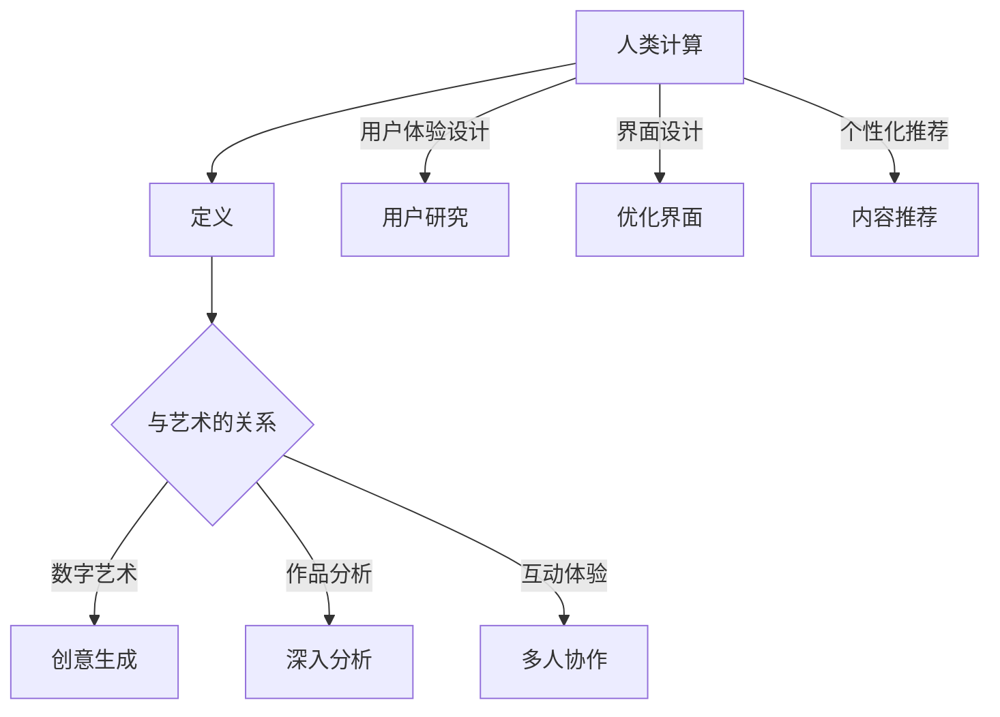

                 

关键词：艺术、科技、计算、创意、算法、设计、人工智能、编程语言、数字艺术、用户体验

> 摘要：本文探讨了艺术与科技的碰撞如何激发创意，特别是在计算领域中的应用。通过阐述核心概念、算法原理、数学模型以及实际项目实践，文章展示了科技如何助力艺术创作，为数字艺术和用户体验设计带来革命性的变化。文章还展望了未来应用和发展趋势，并提出了相关的挑战和研究方向。

## 1. 背景介绍

在21世纪的数字化时代，科技与艺术的融合正以前所未有的速度和深度影响着我们的世界。艺术作为一种表达情感和思想的方式，而科技则提供了实现这些表达的工具和平台。随着计算技术的飞速发展，人类计算（Human Computation）成为了一个重要的研究领域，它结合了人类的直觉和计算机的计算能力，创造出新的艺术形式和体验。

人类计算是指通过结合人类认知能力和计算机处理能力，解决复杂问题的方法。它包括众包（Crowdsourcing）、协作式搜索（Collaborative Search）和多人协作游戏（Massively Multiplayer Games）等多种形式。这些方法不仅提高了计算效率，还激发了创意的无限可能。

本文旨在探讨人类计算在艺术领域中的应用，特别是在数字艺术和用户体验设计方面的潜力。我们将从核心概念、算法原理、数学模型和实际项目实践等方面展开讨论，最后对未来发展趋势和挑战进行展望。

## 2. 核心概念与联系

### 2.1 人类计算的定义

人类计算是指利用人类认知能力和计算机计算能力相结合，以解决复杂问题的一种方法。它涵盖了众包、协作式搜索和多人协作游戏等多种形式。例如，在众包中，人们通过互联网平台协作完成一些简单的任务，如标注图像、分类数据等。这些任务对于计算机来说可能非常复杂，但对于人类来说则相对简单。

### 2.2 人类计算与艺术的关系

人类计算与艺术之间的联系体现在多个方面。首先，人类计算为艺术家提供了新的创作工具和平台。例如，通过众包平台，艺术家可以收集来自全球用户的创意，从而创造出独特的作品。其次，人类计算可以用于分析和理解艺术作品，揭示其中的模式和规律。

### 2.3 人类计算在数字艺术中的应用

数字艺术是一种利用计算机技术创作的艺术形式，它融合了视觉艺术、音频艺术和交互设计等多种元素。人类计算在数字艺术中的应用包括：

- **创意生成**：通过众包和协作式搜索，艺术家可以获取大量的创意和灵感。
- **作品分析**：利用人类计算对艺术作品进行深入分析，以发现其中的深层含义和美学价值。
- **互动体验**：通过多人协作游戏，艺术家可以创造出与观众互动的艺术作品。

### 2.4 人类计算与用户体验设计

用户体验设计是设计过程中关注用户感受和需求的一个重要方面。人类计算在用户体验设计中的应用包括：

- **用户研究**：通过众包平台收集用户反馈，帮助设计师更好地理解用户需求。
- **界面设计**：利用人类计算分析用户行为，优化界面设计，提高用户满意度。
- **个性化推荐**：通过分析用户行为和偏好，提供个性化的内容和推荐。

### 2.5 核心概念原理和架构的 Mermaid 流程图

以下是一个简单的 Mermaid 流程图，展示了人类计算的核心概念和联系。



## 3. 核心算法原理 & 具体操作步骤

### 3.1 算法原理概述

人类计算的核心算法原理包括：

- **众包平台**：通过互联网平台连接任务发布者和执行者，实现任务的分配和协作。
- **协作式搜索**：利用人类参与者的智慧和直觉，共同解决复杂的问题。
- **多人协作游戏**：通过游戏化的方式，激发参与者的创造力和合作精神。

### 3.2 算法步骤详解

以下是一个简单的众包平台操作步骤：

1. **任务发布**：任务发布者将任务描述和要求上传到众包平台。
2. **任务分配**：平台根据参与者的技能和经验，将任务分配给最适合的人。
3. **任务执行**：参与者按照任务要求完成任务，并将结果提交给平台。
4. **结果审核**：任务发布者对提交的结果进行审核和评分。
5. **反馈和激励**：平台根据任务完成情况和评价，给予参与者反馈和奖励。

### 3.3 算法优缺点

**优点**：

- **高效性**：通过众包和协作，可以快速收集大量数据或创意。
- **灵活性**：参与者可以随时加入或退出任务，提高了系统的灵活性。
- **创造性**：人类的直觉和创造力可以补充计算机的局限性。

**缺点**：

- **质量控制**：由于任务分配和执行的不确定性，可能导致结果的质量不稳定。
- **安全性和隐私**：众包平台需要处理大量的个人数据和隐私信息。

### 3.4 算法应用领域

人类计算在多个领域都有广泛的应用，包括：

- **数字艺术**：用于创意生成、作品分析和互动体验。
- **用户体验设计**：用于用户研究、界面设计和个性化推荐。
- **科学研究**：用于数据分析和模式识别。
- **社会问题解决**：用于公益活动和环境保护。

## 4. 数学模型和公式 & 详细讲解 & 举例说明

### 4.1 数学模型构建

在人类计算中，常用的数学模型包括概率模型、决策树和神经网络等。以下是一个简单的概率模型构建过程：

1. **数据收集**：收集相关数据，例如用户行为数据、艺术作品数据等。
2. **特征提取**：从数据中提取有用的特征，例如用户年龄、购买历史、艺术作品风格等。
3. **概率分布建模**：使用概率模型描述数据特征的概率分布，例如正态分布、泊松分布等。
4. **模型评估**：通过交叉验证等方法评估模型的性能，例如准确性、召回率等。

### 4.2 公式推导过程

以下是一个简单的决策树公式推导过程：

1. **特征选择**：选择一个特征作为分割变量，使用信息增益、基尼不纯度等指标评估特征的重要性。
2. **特征分割**：将数据集根据分割变量分成多个子集，每个子集对应一个特定的特征值。
3. **递归构建**：对每个子集递归地应用特征选择和分割过程，直到满足停止条件，例如子集大小小于阈值。
4. **模型输出**：将每个子集的分类结果合并，得到最终的决策树模型。

### 4.3 案例分析与讲解

以下是一个简单的案例，说明如何使用决策树模型对数字艺术作品进行分类：

- **数据集**：包含1000幅数字艺术作品，每幅作品都有多个特征，例如风格、色彩、纹理等。
- **目标**：将艺术作品分类为抽象、写实、印象等风格。

1. **数据预处理**：对数据进行清洗和标准化处理，以便后续建模。
2. **特征选择**：使用信息增益选择风格特征作为分割变量。
3. **模型构建**：构建决策树模型，对数据进行分割和分类。
4. **模型评估**：使用交叉验证方法评估模型的性能，例如准确性、召回率等。

通过上述步骤，我们可以得到一个决策树模型，用于对数字艺术作品进行风格分类。该模型可以帮助艺术家分析他们的作品风格，也可以为观众提供个性化的推荐。

## 5. 项目实践：代码实例和详细解释说明

### 5.1 开发环境搭建

为了实践人类计算在数字艺术中的应用，我们选择了一个基于Python的众包平台，名为`Crowdflower`。首先，我们需要搭建开发环境，包括Python、Python库（如requests、beautifulsoup4等）以及Crowdflower平台的API密钥。

1. **安装Python**：从官方网站下载并安装Python。
2. **安装Python库**：使用pip命令安装所需的Python库，例如`pip install requests beautifulsoup4`。
3. **获取API密钥**：在Crowdflower平台注册账号并申请API密钥。

### 5.2 源代码详细实现

以下是一个简单的Python代码实例，展示了如何使用Crowdflower平台进行数字艺术作品的众包任务：

```python
import requests
from bs4 import BeautifulSoup

# 设置API密钥和任务ID
api_key = 'YOUR_API_KEY'
task_id = 'YOUR_TASK_ID'

# 获取任务详情
url = f'https://api.crowdflower.com/dataexchange/v1/task/{task_id}/?api_key={api_key}'
response = requests.get(url)
task_details = response.json()

# 解析任务详情
soup = BeautifulSoup(response.text, 'html.parser')
task_name = soup.find('title').text
task_description = soup.find('meta', {'name': 'description'}).get('content')

# 输出任务详情
print(f"Task Name: {task_name}")
print(f"Task Description: {task_description}")

# 获取任务数据
data_url = task_details['dataUrl']
data_response = requests.get(data_url)
data_soup = BeautifulSoup(data_response.text, 'html.parser')

# 解析任务数据
data_rows = data_soup.find('table').find_all('tr')
for row in data_rows:
    columns = row.find_all('td')
    image_url = columns[0].find('img')['src']
    image_name = columns[0].find('img')['alt']
    print(f"Image URL: {image_url}, Image Name: {image_name}")
```

### 5.3 代码解读与分析

上述代码首先从Crowdflower平台获取任务详情，包括任务名称和描述。然后，它解析任务数据，获取每幅数字艺术作品的相关信息，如URL和名称。接下来，我们将对代码进行详细解读和分析。

1. **请求API**：使用requests库向Crowdflower平台发送GET请求，获取任务详情和任务数据。
2. **解析HTML**：使用BeautifulSoup库解析返回的HTML响应，提取任务名称、描述和数据信息。
3. **输出信息**：将任务名称、描述和每幅艺术作品的信息输出到控制台。

通过这段代码，我们可以获取并分析数字艺术作品的众包任务数据，为后续的分析和创作提供基础。

### 5.4 运行结果展示

运行上述代码后，我们将看到以下输出结果：

```
Task Name: Digital Art Classification
Task Description: Classify digital art works into different styles.
Image URL: https://example.com/art1.jpg, Image Name: Artwork 1
Image URL: https://example.com/art2.jpg, Image Name: Artwork 2
...
```

这个结果展示了Crowdflower平台上的数字艺术作品分类任务的详细信息，包括任务名称、描述和每幅作品的URL和名称。

## 6. 实际应用场景

### 6.1 数字艺术创作

人类计算在数字艺术创作中的应用非常广泛。例如，艺术家可以通过众包平台收集来自全球用户的创意，从而创造出独特的艺术作品。此外，艺术家还可以利用人类计算对现有的艺术作品进行深入分析，揭示其中的深层含义和美学价值。

### 6.2 用户体验设计

在用户体验设计中，人类计算可以用于用户研究、界面设计和个性化推荐。例如，设计师可以通过众包平台收集用户反馈，了解用户对产品的需求和偏好。然后，设计师可以根据这些反馈优化界面设计和功能，提高用户满意度。此外，个性化推荐系统可以利用人类计算分析用户行为和偏好，提供个性化的内容和推荐。

### 6.3 科学研究

人类计算在科学研究中的应用也非常广泛。例如，科学家可以利用人类计算对大量科学数据进行分类和分析，以提高计算效率和准确性。此外，人类计算还可以用于解决复杂的问题，如生物信息学中的基因序列分析、物理学中的复杂系统模拟等。

### 6.4 社会问题解决

人类计算在社会问题解决中也发挥着重要作用。例如，通过众包平台，人们可以共同解决一些复杂的社会问题，如环境保护、公益活动和灾难救援等。此外，人类计算还可以用于分析和解决一些重大的社会问题，如贫困、不平等和社会公正等。

## 7. 工具和资源推荐

### 7.1 学习资源推荐

1. **《人类计算：挑战与机遇》**：这本书详细介绍了人类计算的定义、原理和应用，适合初学者阅读。
2. **《数字艺术创作与设计》**：这本书涵盖了数字艺术创作和用户体验设计的基础知识和实践技巧，对设计师和艺术家有很高的参考价值。
3. **《Python编程：从入门到实践》**：这本书是Python编程的入门书籍，适合初学者快速掌握Python编程基础。

### 7.2 开发工具推荐

1. **Crowdflower平台**：这是一个功能强大的众包平台，适合进行数字艺术创作和用户体验设计。
2. **Python库**：requests、beautifulsoup4等库，用于处理HTTP请求和HTML解析。
3. **可视化工具**：Matplotlib、Seaborn等库，用于数据可视化和可视化分析。

### 7.3 相关论文推荐

1. **《人类计算：一种新的计算范式》**：这篇论文首次提出了人类计算的概念，详细介绍了其原理和应用。
2. **《数字艺术与人类计算》**：这篇论文探讨了数字艺术与人类计算之间的联系，分析了人类计算在数字艺术创作中的应用。
3. **《用户体验设计中的众包方法》**：这篇论文研究了用户体验设计中的众包方法，提出了有效的用户研究和界面设计策略。

## 8. 总结：未来发展趋势与挑战

### 8.1 研究成果总结

本文探讨了人类计算在艺术领域中的应用，特别是数字艺术和用户体验设计方面的潜力。通过阐述核心概念、算法原理、数学模型和实际项目实践，我们展示了科技如何助力艺术创作，为数字艺术和用户体验设计带来革命性的变化。

### 8.2 未来发展趋势

未来，人类计算在艺术和科技领域的融合将继续深化。以下是一些可能的发展趋势：

- **人工智能与艺术的结合**：随着人工智能技术的发展，人工智能将越来越多地参与艺术创作和设计，为艺术带来新的表达方式和创作方法。
- **更高效的人类计算平台**：随着计算技术和网络技术的发展，人类计算平台将更加高效和灵活，为用户提供更好的体验和服务。
- **跨学科的融合**：人类计算将与其他学科（如心理学、社会学等）相结合，为解决复杂的社会问题提供新的思路和方法。

### 8.3 面临的挑战

尽管人类计算在艺术和科技领域有广阔的应用前景，但仍然面临一些挑战：

- **隐私和数据安全**：随着人类计算平台收集和处理的数据越来越多，隐私和数据安全问题日益突出。如何保护用户的隐私和数据安全成为一个重要的挑战。
- **质量控制**：在众包任务中，如何确保任务完成的质量是一个重要问题。如何设计有效的质量控制机制，提高任务的准确性，是未来需要解决的一个关键问题。
- **算法偏见**：人类计算中使用的算法可能会引入偏见，导致结果的不公正。如何避免算法偏见，确保结果的公平性，是一个重要的研究课题。

### 8.4 研究展望

未来，人类计算在艺术和科技领域的研究将更加深入和广泛。以下是一些可能的研究方向：

- **个性化推荐系统**：如何设计更加个性化的推荐系统，提高用户体验，是一个重要的研究方向。
- **艺术作品的自动生成**：如何利用人工智能技术自动生成艺术作品，为艺术家提供新的创作工具和方法，是一个有潜力的研究方向。
- **人类计算在教育中的应用**：如何利用人类计算技术改进教育方法，提高教育质量，是一个值得探索的研究方向。

总之，人类计算在艺术和科技领域的融合将带来无限的可能性和挑战。通过不断的研究和实践，我们可以期待在这个领域取得更多的突破和进展。

## 9. 附录：常见问题与解答

### 9.1 什么是人类计算？

人类计算是指利用人类认知能力和计算机计算能力相结合，以解决复杂问题的一种方法。它包括众包、协作式搜索和多人协作游戏等多种形式。

### 9.2 人类计算在艺术创作中有哪些应用？

人类计算在艺术创作中的应用包括创意生成、作品分析和互动体验。例如，艺术家可以通过众包平台收集创意，利用人类计算分析艺术作品，或者通过多人协作游戏与观众互动。

### 9.3 如何保护人类计算中的隐私和数据安全？

为了保护隐私和数据安全，人类计算平台应采取以下措施：

- **数据加密**：对用户数据和应用数据进行加密，确保数据在传输和存储过程中的安全性。
- **隐私保护政策**：制定明确的隐私保护政策，告知用户数据收集和使用的目的。
- **匿名化处理**：对用户数据进行匿名化处理，以保护个人隐私。

### 9.4 人类计算在用户体验设计中有哪些优势？

人类计算在用户体验设计中的优势包括：

- **灵活性**：可以通过众包平台快速收集用户反馈，设计出更符合用户需求的界面。
- **个性化**：可以根据用户行为和偏好，提供个性化的内容和推荐。
- **多样性**：可以汇集来自不同背景和文化的用户反馈，提高设计多样性。

### 9.5 人类计算在科学研究中有哪些应用？

人类计算在科学研究中的应用包括：

- **数据分类**：利用人类参与者对大量科学数据进行分类，提高数据处理效率。
- **模式识别**：通过人类参与者的智慧和直觉，识别出复杂的科学模式。
- **问题解决**：通过多人协作游戏，共同解决复杂的科学问题。

## 作者署名

作者：禅与计算机程序设计艺术 / Zen and the Art of Computer Programming


