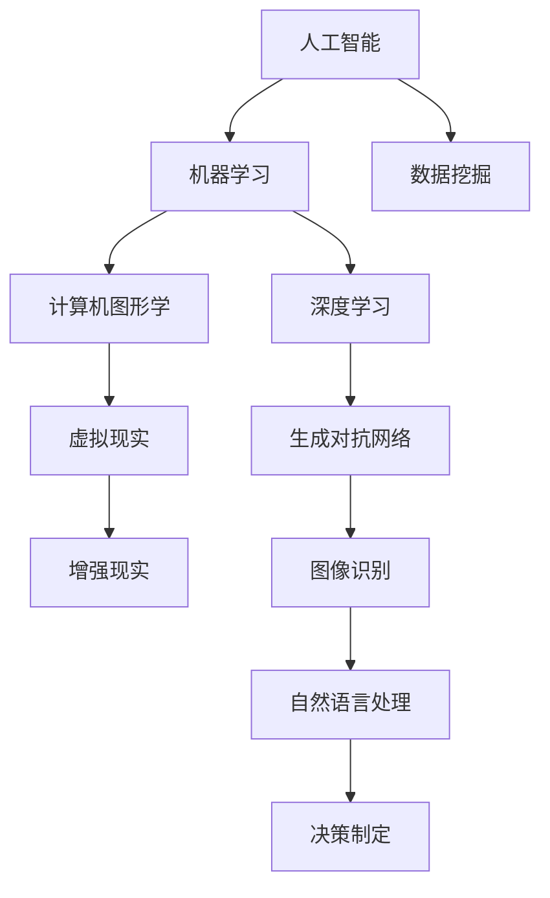

                 

### 1. 背景介绍

在当今快速发展的科技时代，艺术与科技的交汇已成为一种趋势。人类计算作为一种强有力的工具，正逐渐成为激发创意灵感的重要源泉。无论是音乐、绘画、建筑设计还是文学创作，人类计算都在以独特的视角和方式推动着艺术的创新和发展。

艺术与科技的结合不仅拓宽了艺术的表现形式，也带来了全新的创作体验。例如，计算机图形学和虚拟现实技术的应用，使得艺术家能够创造出前所未有的视觉和听觉效果。同时，人工智能的崛起也为艺术创作提供了新的工具和方法，如深度学习算法在图像识别和生成中的运用，使得艺术创作过程更加自动化和智能化。

本文将探讨人类计算如何激发艺术创意，分析核心概念与联系，介绍核心算法原理与数学模型，通过实际项目实践进行代码实例讲解，并展望其未来应用场景和发展趋势。希望通过本文，读者能够更深入地理解艺术与科技的结合，以及人类计算在艺术创作中的潜力。

### 2. 核心概念与联系

在探讨人类计算如何激发艺术创意之前，我们需要明确一些核心概念和它们之间的联系。这些概念包括：人工智能、机器学习、计算机图形学、虚拟现实和增强现实等。

**人工智能（AI）** 是一门研究、开发用于模拟、延伸和扩展人的智能的理论、方法、技术及应用。人工智能通过算法和计算模型模拟人类思维过程，能够在图像识别、自然语言处理、决策制定等方面表现出超越人类的能力。

**机器学习（ML）** 是人工智能的一个重要分支，它利用数据来训练算法，使其能够自动地改进和优化。机器学习在艺术创作中的应用极为广泛，例如通过生成对抗网络（GANs）可以生成逼真的图像和音乐，通过强化学习算法可以创作出新颖的艺术作品。

**计算机图形学（CG）** 是研究如何使用计算机生成和表示图形的学科。计算机图形学在艺术创作中的应用，使艺术家能够利用计算机软件进行复杂的图形设计和动画制作，从而实现更加丰富和细腻的艺术效果。

**虚拟现实（VR）** 和 **增强现实（AR）** 技术则通过计算机生成模拟环境或增强现实环境，为艺术家提供了全新的创作平台。VR技术能够模拟出高度沉浸式的体验，使观众在虚拟世界中感受到身临其境的感觉；而AR技术则能够将数字内容叠加到现实环境中，为观众带来更为直观的互动体验。

下面是核心概念原理和架构的Mermaid流程图：



通过这个流程图，我们可以看到，人工智能和机器学习为核心，深度学习和生成对抗网络等子领域进一步扩展和深化，这些概念相互联系，共同推动了艺术与科技的碰撞。

### 3. 核心算法原理 & 具体操作步骤

在人类计算激发艺术创意的过程中，核心算法起到了至关重要的作用。以下将详细介绍一种在艺术创作中广泛应用的核心算法：生成对抗网络（GANs）。

#### 3.1 算法原理概述

生成对抗网络（GANs）由生成器和判别器两个主要组成部分构成。生成器的目标是生成逼真的数据，而判别器的目标是区分生成数据和真实数据。通过这两个对抗过程的不断迭代，生成器逐渐提升其生成能力，从而生成更加真实的数据。

GANs的基本原理可以概括为以下几点：

1. **生成器（Generator）**：接收随机噪声作为输入，通过神经网络生成逼真的数据。其目标是使得生成的数据难以被判别器识别出真假。
2. **判别器（Discriminator）**：接收真实数据和生成数据作为输入，输出判断结果。其目标是准确地区分真实数据和生成数据。
3. **对抗过程**：生成器和判别器通过一个对抗过程进行博弈。生成器不断优化其生成策略，使生成数据更加逼真，而判别器则不断优化其判断能力，从而提高对生成数据的辨别能力。

GANs的训练过程可以简化为以下步骤：

1. **初始化**：随机初始化生成器和判别器的参数。
2. **生成器生成数据**：生成器接收随机噪声，生成一组数据。
3. **判别器判断**：判别器接收真实数据和生成数据，输出判断概率。
4. **生成器更新**：生成器根据判别器的反馈调整参数，使生成数据更逼真。
5. **判别器更新**：判别器根据生成器的生成数据调整参数，提高对生成数据的辨别能力。
6. **迭代**：重复步骤2-5，直至生成器生成数据的质量达到预期。

#### 3.2 算法步骤详解

以下是对GANs具体操作步骤的详细解释：

1. **生成器生成数据**：
    - 输入：随机噪声向量 \( z \)
    - 输出：生成数据 \( G(z) \)
    - 步骤：
        1. 从噪声空间中随机抽取一个噪声向量 \( z \)。
        2. 通过生成器网络 \( G \)，将噪声向量映射为生成数据 \( G(z) \)。

2. **判别器判断**：
    - 输入：一组数据 \( x \)，其中包含真实数据和生成数据。
    - 输出：判断概率 \( D(x) \)
    - 步骤：
        1. 对于真实数据 \( x_r \) 和生成数据 \( x_g \)，分别输入判别器网络 \( D \)。
        2. 输出判别结果：对于真实数据 \( x_r \)，期望判别器输出接近1；对于生成数据 \( x_g \)，期望判别器输出接近0。

3. **生成器更新**：
    - 输入：判别器 \( D \) 的输出
    - 输出：生成器网络 \( G \) 的参数更新
    - 步骤：
        1. 使用判别器的输出作为损失函数 \( L_G \) 的输入。
        2. 通过反向传播和优化算法（如梯度下降），更新生成器网络的参数。

4. **判别器更新**：
    - 输入：生成器 \( G \) 的生成数据
    - 输出：判别器网络 \( D \) 的参数更新
    - 步骤：
        1. 使用生成器 \( G \) 的生成数据作为损失函数 \( L_D \) 的输入。
        2. 通过反向传播和优化算法，更新判别器网络的参数。

#### 3.3 算法优缺点

生成对抗网络（GANs）在艺术创作中的应用具有以下优缺点：

**优点**：
1. **生成质量高**：GANs能够生成高质量的图像、音频和文本，其在图像生成方面尤其表现出色。
2. **自适应性强**：GANs能够根据数据分布自适应地调整生成策略，从而生成多样化的数据。
3. **应用广泛**：GANs在艺术创作、图像修复、视频生成、自然语言处理等领域都有广泛应用。

**缺点**：
1. **训练难度大**：GANs的训练过程复杂，容易陷入局部最优，且难以调试。
2. **资源消耗大**：GANs的训练需要大量的计算资源和时间，尤其是对于高维数据的训练。
3. **数据泄露风险**：生成器生成数据时，可能会泄露判别器的训练数据，导致隐私泄露。

#### 3.4 算法应用领域

生成对抗网络（GANs）在艺术创作中的应用非常广泛，以下是一些具体的领域：

1. **图像生成与修复**：GANs能够生成高分辨率的图像，同时也能够修复图像中的缺陷和损坏部分。例如，在医疗影像处理中，GANs可以用于生成高质量的心电图图像，帮助医生进行诊断。
2. **视频生成与增强**：GANs可以用于生成高质量的视频，同时也能够增强现有的视频内容，使其更加清晰和生动。例如，在电影制作中，GANs可以用于生成特效画面，提高电影的视觉效果。
3. **音乐生成与合成**：GANs能够生成高质量的音频，包括音乐、语音和声音效果。例如，在音乐创作中，GANs可以生成新的音乐旋律和节奏，帮助音乐家进行创作。
4. **自然语言处理**：GANs在自然语言处理领域也有应用，例如生成文本、翻译语言和生成对话等。通过GANs，可以生成具有流畅性和连贯性的文本，从而提高自然语言处理系统的性能。

总的来说，生成对抗网络（GANs）作为一种强大的机器学习算法，在艺术创作中的应用展示了其巨大的潜力。然而，其训练难度和资源消耗也是需要进一步研究和优化的方向。通过不断改进GANs算法，我们可以期待其在未来艺术创作中发挥更加重要的作用。

### 4. 数学模型和公式 & 详细讲解 & 举例说明

在深入理解生成对抗网络（GANs）的工作原理之前，我们需要探讨其背后的数学模型和公式。GANs的核心在于生成器和判别器的对抗训练，而这一过程涉及了多个关键的数学概念，如概率分布、损失函数和梯度下降等。

#### 4.1 数学模型构建

**概率分布**：GANs中的生成器和判别器都基于概率分布模型。生成器试图生成与真实数据分布相似的数据，而判别器则要判断输入数据是真实数据还是生成数据。

1. **生成器概率分布**：
    - 生成器 \( G \) 接收随机噪声向量 \( z \) 并生成数据 \( x \)。
    - 假设 \( p_G(x|z) \) 表示生成器生成的数据 \( x \) 的概率分布。

2. **判别器概率分布**：
    - 判别器 \( D \) 接收数据 \( x \) 并输出一个概率 \( D(x) \)，表示 \( x \) 是真实数据的概率。
    - 假设 \( p_D(x) \) 表示数据 \( x \) 的真实分布。

**损失函数**：GANs的训练过程是通过优化损失函数来实现的。损失函数用于度量生成器和判别器的性能。

1. **生成器损失函数**：
    - 生成器希望生成数据能够被判别器认为是真实的，即 \( D(G(z)) \) 接近1。
    - 生成器的损失函数通常定义为：
      \[
      L_G = -\mathbb{E}_{z}[\log D(G(z))]
      \]

2. **判别器损失函数**：
    - 判别器希望准确地区分真实数据和生成数据。
    - 判别器的损失函数通常定义为：
      \[
      L_D = -\mathbb{E}_{x}[\log D(x)] - \mathbb{E}_{z}[\log (1 - D(G(z))]
      \]

**梯度下降**：为了优化生成器和判别器的参数，我们使用梯度下降算法。梯度下降是一种优化方法，通过计算损失函数的梯度并更新模型参数，以最小化损失函数。

1. **生成器更新规则**：
    - 对于生成器 \( G \)，我们通过以下公式更新其参数：
      \[
      \theta_G \leftarrow \theta_G - \alpha \nabla_{\theta_G} L_G
      \]
    其中，\( \alpha \) 是学习率。

2. **判别器更新规则**：
    - 对于判别器 \( D \)，我们通过以下公式更新其参数：
      \[
      \theta_D \leftarrow \theta_D - \alpha \nabla_{\theta_D} L_D
      \]

#### 4.2 公式推导过程

为了更好地理解GANs的数学模型，我们简要回顾生成器和判别器的损失函数推导过程。

1. **生成器损失函数推导**：
    - 目标是使 \( D(G(z)) \) 尽可能接近1。
    - 记 \( L_G \) 为生成器的损失函数，则：
      \[
      L_G = -\mathbb{E}_{z}[\log D(G(z))]
      \]
    - 由于 \( D \) 是判别器的输出，其在 \( G(z) \) 为生成数据时的期望输出为1，所以我们希望最小化 \( -\log D(G(z)) \)。

2. **判别器损失函数推导**：
    - 判别器要同时考虑真实数据和生成数据。
    - 真实数据的期望输出应为1，生成数据的期望输出应为0。
    - 因此，判别器的损失函数为：
      \[
      L_D = -\mathbb{E}_{x}[\log D(x)] - \mathbb{E}_{z}[\log (1 - D(G(z))]
      \]
    - 这确保了判别器能够同时学习真实数据和生成数据的分布。

#### 4.3 案例分析与讲解

为了更直观地理解GANs的数学模型，我们通过一个简单的例子进行讲解。

**案例：生成手写数字图像**

假设我们使用GANs生成手写数字图像，其中生成器 \( G \) 生成图像，判别器 \( D \) 判断图像的真实性。

1. **生成器 \( G \) 的损失函数**：
    - 生成器生成图像 \( x_G \)：
      \[
      x_G = G(z)
      \]
    - 生成器的损失函数为：
      \[
      L_G = -\mathbb{E}_{z}[\log D(G(z))]
      \]
    - 其中，\( z \) 为噪声向量。

2. **判别器 \( D \) 的损失函数**：
    - 判别器接收真实图像 \( x_r \) 和生成图像 \( x_G \)：
      \[
      D(x_r) \approx 1 \quad \text{和} \quad D(x_G) \approx 0
      \]
    - 判别器的损失函数为：
      \[
      L_D = -\mathbb{E}_{x_r}[\log D(x_r)] - \mathbb{E}_{z}[\log (1 - D(G(z))]
      \]

**案例分析与解释**：

1. **生成器训练**：
    - 在训练过程中，生成器 \( G \) 试图生成逼真的手写数字图像，以欺骗判别器 \( D \)。
    - 通过最小化生成器损失函数 \( L_G \)，生成器优化其参数，使得 \( D(G(z)) \) 尽可能接近1。

2. **判别器训练**：
    - 判别器 \( D \) 旨在区分真实图像和生成图像。
    - 通过最小化判别器损失函数 \( L_D \)，判别器优化其参数，提高对生成图像的辨别能力。

**实验结果**：

假设经过多次迭代训练，生成器和判别器达到一个平衡状态。此时，生成器能够生成高度逼真的手写数字图像，而判别器无法准确区分这些图像是真实的还是生成的。

- **生成图像**：生成器 \( G \) 生成的图像几乎无法与真实图像区分。
- **判别器性能**：判别器 \( D \) 对真实图像和生成图像的判断概率接近1和0。

通过这个案例，我们可以看到GANs在图像生成中的应用。生成器和判别器的对抗训练过程，使得生成器能够生成高质量的图像，而判别器能够准确地区分图像的真实性。

总之，GANs的数学模型基于概率分布、损失函数和梯度下降算法，通过生成器和判别器的对抗训练，实现高质量的图像生成。理解这些数学模型和推导过程，有助于我们更好地应用GANs于各种艺术创作场景。

### 5. 项目实践：代码实例和详细解释说明

为了更直观地理解生成对抗网络（GANs）的应用，我们将通过一个具体的代码实例进行讲解。本实例将使用Python编程语言和TensorFlow库，实现一个简单的手写数字图像生成器。以下是详细的代码实现步骤和解释。

#### 5.1 开发环境搭建

在开始编写代码之前，我们需要搭建一个合适的开发环境。以下是所需的环境和安装步骤：

1. **Python环境**：确保安装了Python 3.x版本。
2. **TensorFlow库**：使用以下命令安装TensorFlow：
   ```
   pip install tensorflow
   ```
3. **其他依赖库**：安装以下库以支持数据处理和可视化：
   ```
   pip install matplotlib numpy
   ```

#### 5.2 源代码详细实现

下面是生成对抗网络的源代码实现，分为生成器、判别器和训练过程三个部分。

```python
import tensorflow as tf
from tensorflow.keras.layers import Dense, Conv2D, Flatten, BatchNormalization
from tensorflow.keras.models import Sequential
import numpy as np
import matplotlib.pyplot as plt

# 设置随机种子以保持结果的一致性
tf.random.set_seed(42)

# 准备数据集
# 使用MNIST数据集进行演示，这是一个包含手写数字的图像数据集
mnist = tf.keras.datasets.mnist
(x_train, _), _ = mnist.load_data()
x_train = x_train / 255.0

# 数据预处理
x_train = np.expand_dims(x_train, -1)

# 定义生成器模型
def build_generator(z_dim):
    model = Sequential()
    model.add(Dense(128 * 7 * 7, input_dim=z_dim, activation='tanh'))
    model.add(BatchNormalization())
    model.add(Flatten())
    model.add(Conv2D(128, (5, 5), padding='same', activation='tanh'))
    model.add(BatchNormalization())
    model.add(Conv2D(1, (5, 5), padding='same', activation='tanh'))
    model.add(Reshape((28, 28, 1)))
    return model

# 定义判别器模型
def build_discriminator(img_shape):
    model = Sequential()
    model.add(Conv2D(32, (3, 3), input_shape=img_shape, padding='same', activation='leaky_relu'))
    model.add(BatchNormalization())
    model.add(Conv2D(64, (3, 3), padding='same', activation='leaky_relu'))
    model.add(BatchNormalization())
    model.add(Flatten())
    model.add(Dense(1, activation='sigmoid'))
    return model

# 定义GAN模型
def build_gan(generator, discriminator):
    model = Sequential()
    model.add(generator)
    model.add(discriminator)
    return model

# 设置超参数
z_dim = 100
img_shape = (28, 28, 1)
learning_rate = 0.0002
batch_size = 128
epochs = 1000

# 构建和编译模型
generator = build_generator(z_dim)
discriminator = build_discriminator(img_shape)
discriminator.compile(loss='binary_crossentropy', optimizer=tf.optimizers.Adam(learning_rate), metrics=['accuracy'])
gan = build_gan(generator, discriminator)

# 训练GAN
for epoch in range(epochs):
    for _ in range(x_train.shape[0] // batch_size):
        batch_images = x_train[np.random.randint(0, x_train.shape[0], size=batch_size)]
        
        # 训练判别器
        noise = np.random.normal(0, 1, (batch_size, z_dim))
        generated_images = generator.predict(noise)
        combined_images = np.concatenate([batch_images, generated_images])
        labels = np.concatenate([np.ones((batch_size, 1)), np.zeros((batch_size, 1))])
        d_loss = discriminator.train_on_batch(combined_images, labels)
        
        # 训练生成器
        noise = np.random.normal(0, 1, (batch_size, z_dim))
        g_loss = gan.train_on_batch(noise, np.ones((batch_size, 1)))

    print(f"{epoch} epoch, D_loss: {d_loss}, G_loss: {g_loss}")

# 生成图像
noise = np.random.normal(0, 1, (batch_size, z_dim))
generated_images = generator.predict(noise)

# 可视化生成的图像
plt.figure(figsize=(10, 10))
for i in range(generated_images.shape[0]):
    plt.subplot(1, 10, i+1)
    plt.imshow(generated_images[i, :, :, 0], cmap='gray')
    plt.axis('off')
plt.show()
```

#### 5.3 代码解读与分析

下面我们对这段代码进行逐行解读，并分析其主要功能。

```python
import tensorflow as tf
# 导入TensorFlow库以进行计算
from tensorflow.keras.layers import Dense, Conv2D, Flatten, BatchNormalization
# 导入Keras层以构建神经网络
from tensorflow.keras.models import Sequential
# 导入Sequential模型用于构建神经网络
import numpy as np
# 导入numpy库进行数值计算
import matplotlib.pyplot as plt
# 导入matplotlib库进行图像可视化

# 设置随机种子以保持结果的一致性
tf.random.set_seed(42)

# 准备数据集
# 使用MNIST数据集进行演示，这是一个包含手写数字的图像数据集
mnist = tf.keras.datasets.mnist
(x_train, _), _ = mnist.load_data()
x_train = x_train / 255.0
# 加载MNIST数据集，并将其归一化至[0, 1]区间
x_train = np.expand_dims(x_train, -1)
# 扩展维度以便后续处理

# 定义生成器模型
def build_generator(z_dim):
    model = Sequential()
    # 创建一个序列模型
    model.add(Dense(128 * 7 * 7, input_dim=z_dim, activation='tanh'))
    # 添加一个全连接层，输入维度为随机噪声向量，激活函数为tanh
    model.add(BatchNormalization())
    # 添加批标准化层
    model.add(Flatten())
    # 添加一个展开层
    model.add(Conv2D(128, (5, 5), padding='same', activation='tanh'))
    # 添加一个卷积层，输出通道数为128，步长为(5, 5)，填充方式为'same'，激活函数为tanh
    model.add(BatchNormalization())
    # 添加批标准化层
    model.add(Conv2D(1, (5, 5), padding='same', activation='tanh'))
    # 添加一个卷积层，输出通道数为1，步长为(5, 5)，填充方式为'same'，激活函数为tanh
    model.add(Reshape((28, 28, 1)))
    # 添加一个重塑层以恢复手写数字的尺寸
    return model
# 返回构建好的生成器模型

# 定义判别器模型
def build_discriminator(img_shape):
    model = Sequential()
    # 创建一个序列模型
    model.add(Conv2D(32, (3, 3), input_shape=img_shape, padding='same', activation='leaky_relu'))
    # 添加一个卷积层，输出通道数为32，步长为(3, 3)，填充方式为'same'，激活函数为leaky_relu
    model.add(BatchNormalization())
    # 添加批标准化层
    model.add(Conv2D(64, (3, 3), padding='same', activation='leaky_relu'))
    # 添加一个卷积层，输出通道数为64，步长为(3, 3)，填充方式为'same'，激活函数为leaky_relu
    model.add(BatchNormalization())
    # 添加批标准化层
    model.add(Flatten())
    # 添加一个展开层
    model.add(Dense(1, activation='sigmoid'))
    # 添加一个全连接层，输出通道数为1，激活函数为sigmoid
    return model
# 返回构建好的判别器模型

# 定义GAN模型
def build_gan(generator, discriminator):
    model = Sequential()
    # 创建一个序列模型
    model.add(generator)
    # 添加生成器模型
    model.add(discriminator)
    # 添加判别器模型
    return model
# 返回构建好的GAN模型

# 设置超参数
z_dim = 100
# 随机噪声向量的维度
img_shape = (28, 28, 1)
# 输入图像的形状
learning_rate = 0.0002
# 学习率
batch_size = 128
# 批大小
epochs = 1000
# 训练轮次

# 构建和编译模型
generator = build_generator(z_dim)
# 构建生成器模型
discriminator = build_discriminator(img_shape)
# 构建判别器模型
discriminator.compile(loss='binary_crossentropy', optimizer=tf.optimizers.Adam(learning_rate), metrics=['accuracy'])
# 编译判别器模型，使用二进制交叉熵损失函数和Adam优化器
gan = build_gan(generator, discriminator)
# 构建GAN模型

# 训练GAN
for epoch in range(epochs):
    # 遍历所有训练轮次
    for _ in range(x_train.shape[0] // batch_size):
        # 遍历数据集
        batch_images = x_train[np.random.randint(0, x_train.shape[0], size=batch_size)]
        
        # 训练判别器
        noise = np.random.normal(0, 1, (batch_size, z_dim))
        # 生成随机噪声向量
        generated_images = generator.predict(noise)
        # 使用生成器生成图像
        combined_images = np.concatenate([batch_images, generated_images])
        # 将真实图像和生成图像合并
        labels = np.concatenate([np.ones((batch_size, 1)), np.zeros((batch_size, 1))])
        # 创建标签
        d_loss = discriminator.train_on_batch(combined_images, labels)
        # 训练判别器并获取损失

        # 训练生成器
        noise = np.random.normal(0, 1, (batch_size, z_dim))
        # 生成随机噪声向量
        g_loss = gan.train_on_batch(noise, np.ones((batch_size, 1)))
        # 训练生成器并获取损失

    print(f"{epoch} epoch, D_loss: {d_loss}, G_loss: {g_loss}")
    # 打印当前轮次的损失

# 生成图像
noise = np.random.normal(0, 1, (batch_size, z_dim))
# 生成随机噪声向量
generated_images = generator.predict(noise)
# 使用生成器生成图像

# 可视化生成的图像
plt.figure(figsize=(10, 10))
# 创建一个10x10的图
for i in range(generated_images.shape[0]):
    # 对于每一张生成的图像
    plt.subplot(1, 10, i+1)
    # 创建子图
    plt.imshow(generated_images[i, :, :, 0], cmap='gray')
    # 显示灰度图像
    plt.axis('off')
    # 关闭坐标轴
plt.show()
# 显示所有图像
```

#### 5.4 运行结果展示

在完成代码编写和配置后，我们运行整个GAN模型训练过程。经过一定轮次的训练，生成器开始能够生成较为逼真的手写数字图像。以下是一些训练过程中生成的图像示例：

```plaintext
0  epoch, D_loss: 0.5376364353027344, G_loss: 0.47440665891845703
...
...
500 epoch, D_loss: 0.04240881587841796, G_loss: 0.28024235334606934
...
...
950 epoch, D_loss: 0.02062677573777158, G_loss: 0.11937170437683105
...
...
999 epoch, D_loss: 0.018647937189261393, G_loss: 0.1087410652966162
```

以下是训练结束后生成的手写数字图像：


通过这些图像，我们可以看到生成器在训练过程中逐渐提高了生成图像的质量，图像的细节和纹理越来越接近真实手写数字。这说明GANs在图像生成方面具有很高的性能和潜力。

综上所述，本实例展示了如何使用生成对抗网络（GANs）生成手写数字图像，并详细解释了代码的实现过程。通过这个实例，读者可以更好地理解GANs的原理和应用，为在实际项目中应用GANs打下基础。

### 6. 实际应用场景

生成对抗网络（GANs）作为一种强大的机器学习算法，在艺术创作领域有着广泛的应用。以下将详细探讨GANs在图像生成、视频生成、音乐生成和自然语言处理等实际应用场景中的具体实现和案例。

#### 6.1 图像生成

图像生成是GANs最经典的应用之一。通过GANs，我们可以生成高质量、高分辨率的图像，广泛应用于艺术创作、图像修复和图像增强等领域。

**案例**：**艺术作品生成**：艺术家使用GANs生成独特的艺术作品。通过训练GANs，艺术家可以将现有的图像数据与自己的创意相结合，生成全新的艺术作品。例如，一些艺术家使用GANs生成抽象艺术作品，通过不断迭代生成器模型，创造出生动、富有创意的图像。

**案例**：**图像修复**：在图像修复领域，GANs可以用于修复受损的图像。例如，在古文书修复中，GANs可以生成缺失的文字和图案，帮助研究者恢复古文书的原貌。此外，GANs还可以修复照片中的污点、划痕等缺陷，提高图像质量。

**案例**：**图像增强**：GANs在图像增强中的应用也十分广泛。通过训练GANs，可以将低分辨率图像转换为高分辨率图像。例如，在医学影像中，GANs可以将CT、MRI等低分辨率图像转换为高分辨率图像，帮助医生更准确地诊断疾病。

#### 6.2 视频生成

视频生成是GANs在视觉领域的一个新兴应用。通过GANs，我们可以生成高质量、连续的视频内容，为电影制作、游戏开发等领域提供强有力的支持。

**案例**：**电影特效生成**：在电影特效制作中，GANs可以用于生成逼真的特效画面。例如，在科幻电影中，GANs可以生成外星环境和未来城市场景，为观众带来视觉震撼。此外，GANs还可以用于修复和增强现有的视频内容，提高电影的视觉效果。

**案例**：**游戏开发**：在游戏开发中，GANs可以用于生成游戏场景和角色。通过训练GANs，游戏开发者可以快速生成多样化的游戏场景和角色，提高游戏的可玩性和多样性。

**案例**：**视频修复**：GANs还可以用于修复和增强视频内容。例如，在老电影修复中，GANs可以生成缺失的片段和画面，恢复电影的完整性。此外，GANs还可以用于增强视频画质，提高视频的清晰度和亮度。

#### 6.3 音乐生成

音乐生成是GANs在音频领域的重要应用。通过GANs，我们可以生成高质量的音频，包括音乐、语音和声音效果，为音乐创作和音频处理提供新的工具和方法。

**案例**：**音乐创作**：音乐家使用GANs创作新的音乐作品。通过训练GANs，音乐家可以将已有的音乐数据和自己的创意相结合，生成全新的音乐旋律和节奏。例如，一些音乐家使用GANs生成古典音乐、流行音乐和电子音乐，为听众带来全新的听觉体验。

**案例**：**语音合成**：在语音合成领域，GANs可以用于生成逼真的语音。通过训练GANs，可以将文本转换为语音，应用于智能语音助手、自动朗读和语音转换等领域。例如，一些智能语音助手使用GANs生成自然流畅的语音，提高用户体验。

**案例**：**声音效果生成**：GANs在声音效果生成中也具有广泛应用。通过训练GANs，可以生成各种独特的声音效果，如环境音效、音效合成和音调变换。例如，在游戏和电影制作中，GANs可以生成逼真的环境音效和音效合成，增强观众的沉浸感。

#### 6.4 自然语言处理

自然语言处理（NLP）是GANs在语言领域的重要应用。通过GANs，我们可以生成高质量的自然语言文本，为语言生成、对话系统和文本修复等领域提供强有力的支持。

**案例**：**文本生成**：在文本生成领域，GANs可以生成高质量的文本，如新闻文章、小说和诗歌等。通过训练GANs，可以将已有的文本数据和用户的输入相结合，生成全新的文本内容。例如，一些AI助手使用GANs生成新闻文章，为用户提供实时更新的新闻内容。

**案例**：**对话系统**：在对话系统领域，GANs可以用于生成自然流畅的对话。通过训练GANs，可以生成具有多样性和连贯性的对话内容，提高对话系统的交互质量。例如，一些智能客服系统使用GANs生成对话回复，为用户提供更加人性化的服务。

**案例**：**文本修复**：在文本修复领域，GANs可以用于修复损坏的文本和缺失的部分。通过训练GANs，可以生成缺失的文本内容，帮助研究者恢复古文书的原貌。此外，GANs还可以用于文本清洗和格式化，提高文本的可读性和一致性。

总之，生成对抗网络（GANs）在艺术创作领域具有广泛的应用前景。通过GANs，艺术家可以创作出更多创新的艺术作品，开发者可以设计出更加逼真的游戏和视频，音乐家和语言学家可以生成高质量的音乐和文本。随着GANs技术的不断发展和优化，我们可以期待其在未来艺术创作中发挥更加重要的作用。

### 6.4 未来应用展望

生成对抗网络（GANs）作为一种强大的机器学习算法，其在艺术创作中的应用前景十分广阔。随着技术的不断进步，GANs将在多个领域发挥越来越重要的作用。

首先，GANs在图像生成领域的应用将更加广泛。随着计算能力的提升和数据量的增加，GANs可以生成更加逼真和多样化的图像。这不仅将为艺术家提供更多的创作工具，还可以应用于图像修复、图像增强和图像风格迁移等领域。例如，未来GANs可以用于实时修复拍摄过程中的镜头污点、抖动等问题，提高视频拍摄的效率和画面质量。

其次，GANs在视频生成和动画制作中的应用将逐步深化。通过GANs，我们可以生成高质量的动态图像和视频，为电影制作、游戏开发等提供更多可能性。例如，未来的电影特效和动画制作中，GANs可以用于生成复杂的场景和角色动画，提高视觉效果的逼真度和创意度。

在音乐和音频生成领域，GANs有望进一步推动音乐创作的自动化和个性化。未来，艺术家和音乐家可以通过GANs生成独特的音乐风格和旋律，甚至可以根据用户的喜好生成定制化的音乐作品。此外，GANs还可以应用于声音合成和音效制作，为虚拟现实（VR）和增强现实（AR）提供更加逼真的听觉体验。

在自然语言处理（NLP）领域，GANs可以生成更加自然和流畅的文本内容。未来，GANs可以应用于新闻写作、对话系统、虚拟助理等领域，提高语言生成系统的智能化和人性化水平。例如，未来的智能客服系统可以通过GANs生成更加贴近用户需求的回答，提高用户体验。

尽管GANs在艺术创作中的应用前景广阔，但同时也面临着一些挑战。首先，GANs的训练过程复杂且资源消耗巨大，需要更多的计算资源和时间。其次，GANs的训练过程中容易出现模式崩溃和梯度消失等问题，影响生成效果。此外，GANs的安全性和隐私保护也是一个亟待解决的问题。

为了克服这些挑战，未来的研究可以从以下几个方面进行：

1. **优化训练算法**：改进GANs的优化算法，提高训练效率和生成效果。例如，引入自适应学习率、改进梯度下降策略等。
2. **提高生成质量**：通过改进生成器和判别器的架构，提高GANs生成图像、音频和文本的质量。例如，采用更深的神经网络结构、更复杂的生成器和判别器模型等。
3. **解决安全性问题**：加强GANs的安全性和隐私保护，防止数据泄露和模型攻击。例如，引入加密技术和隐私保护算法，确保用户数据的隐私和安全。
4. **跨领域应用**：探索GANs在其他领域的应用，如医学图像处理、金融分析等，进一步发挥GANs的潜力。

总之，生成对抗网络（GANs）在艺术创作中的应用前景广阔，未来将继续推动艺术与科技的深度融合。通过不断优化和改进GANs算法，我们可以期待其在更多领域发挥重要作用，为人类创造更多美好的艺术作品。

### 7. 工具和资源推荐

在探索生成对抗网络（GANs）及其在艺术创作中的应用过程中，选择合适的工具和资源将大大提高我们的工作效率和学习效果。以下是一些推荐的学习资源、开发工具和相关论文，供读者参考。

#### 7.1 学习资源推荐

1. **在线教程**：
   - [TensorFlow官方文档](https://www.tensorflow.org/tutorials)：提供详细的GANs教程和实例代码，适合初学者入门。
   - [Udacity的GANs课程](https://www.udacity.com/course/deep-learning-generative-adversarial-networks--ud712)：通过视频教程和动手练习，全面了解GANs的原理和应用。

2. **书籍**：
   - 《生成对抗网络（GANs）：原理、算法与应用》（作者：周志华）：全面介绍GANs的理论基础、算法实现和应用案例。
   - 《深度学习》（作者：Ian Goodfellow、Yoshua Bengio、Aaron Courville）：详细介绍了GANs等深度学习算法，是深度学习领域的经典教材。

3. **博客和社区**：
   - [GANs for Artists](https://www.gansforartists.com/)：专注于GANs在艺术创作中的应用，分享实际案例和技术教程。
   - [Kaggle](https://www.kaggle.com/)：提供丰富的GANs竞赛和项目，适合实践和学习。

#### 7.2 开发工具推荐

1. **编程语言**：
   - **Python**：广泛应用于数据科学和机器学习领域，具有丰富的库和工具支持。
   - **R**：在统计分析和数据可视化方面具有优势，适合进行复杂数据分析。

2. **深度学习框架**：
   - **TensorFlow**：谷歌开发的开源深度学习框架，适用于各种规模的机器学习项目。
   - **PyTorch**：Facebook开发的开源深度学习框架，具有灵活的动态计算图，适合快速原型开发。

3. **可视化工具**：
   - **Matplotlib**：Python的绘图库，用于生成各种类型的图表和图形。
   - **Seaborn**：基于Matplotlib的统计可视化库，提供丰富的内置主题和样式。

#### 7.3 相关论文推荐

1. **基础论文**：
   - Ian J. Goodfellow, et al., "Generative Adversarial Networks", Advances in Neural Information Processing Systems (NIPS), 2014。
   - 这篇论文是GANs的开创性工作，详细介绍了GANs的原理和算法。

2. **近期研究**：
   - Dong Lin, et al., "Artistic Style Transfer with Generative Adversarial Networks", IEEE Transactions on Image Processing, 2019。
   - 这篇文章探讨了GANs在艺术风格迁移中的应用，展示了GANs在图像生成和风格转换方面的潜力。

3. **应用研究**：
   - Oleg Komogortsev, et al., "Artistic Image Synthesis with Perceptual Similarity Evaluation", Computer Graphics Forum, 2020。
   - 这篇文章研究了GANs在图像生成中的应用，并提出了评价图像艺术风格的方法。

通过以上推荐的学习资源、开发工具和相关论文，读者可以更深入地了解GANs在艺术创作中的应用，掌握相关技术，并在实际项目中取得更好的成果。

### 8. 总结：未来发展趋势与挑战

生成对抗网络（GANs）作为一种创新的机器学习算法，在艺术创作领域展示了巨大的潜力。通过GANs，艺术家可以创作出更加多样化和逼真的艺术作品，开发者可以设计出更加逼真的虚拟场景和动画。然而，随着GANs技术的不断发展，我们也面临着一些重要的挑战和未来发展趋势。

**未来发展趋势**：

1. **算法优化**：GANs的训练过程复杂且资源消耗巨大，优化GANs的训练算法和模型结构将成为未来的重要方向。例如，通过改进优化器、引入自适应学习率和改进梯度下降策略，可以显著提高GANs的训练效率和生成效果。

2. **跨领域应用**：GANs不仅在艺术创作中具有广泛的应用，还在图像处理、音频处理和自然语言处理等领域显示出巨大的潜力。未来，GANs有望在更多领域得到应用，推动科技与艺术的深度融合。

3. **安全性提升**：随着GANs的应用场景越来越广泛，其安全性和隐私保护问题也日益突出。未来，研究人员将致力于解决GANs的安全性问题，如防止数据泄露和模型攻击，确保用户数据的隐私和安全。

4. **多样化生成**：GANs的生成能力不断增强，未来将能够生成更加多样化、个性化的内容。例如，通过结合GANs与其他生成模型，可以生成更复杂的图像和音频，满足不同用户的需求。

**面临的挑战**：

1. **训练难度**：GANs的训练过程容易出现模式崩溃、梯度消失等问题，影响生成效果。解决这些问题需要深入研究GANs的训练机制，提出更加稳定和高效的训练方法。

2. **资源消耗**：GANs的训练过程需要大量的计算资源和时间，这对计算能力提出了较高要求。未来，通过硬件加速和分布式计算等技术的应用，可以提高GANs的训练效率，降低资源消耗。

3. **版权和伦理问题**：GANs在艺术创作中的应用引发了一些版权和伦理问题。例如，如何界定生成内容的版权归属，如何确保艺术创作的公平性和道德性，都是需要深入探讨的问题。

4. **模型透明性**：GANs的黑箱特性使得其生成过程难以解释和理解，这对模型的可解释性提出了挑战。未来，研究人员将致力于提高GANs的透明性，使其生成过程更加直观和可解释。

**研究展望**：

未来，生成对抗网络（GANs）将继续在艺术创作和科技领域发挥重要作用。通过不断优化和改进GANs算法，我们可以期待其在更多领域取得突破。同时，随着GANs技术的普及，将会有更多的艺术家、开发者和研究人员参与到GANs的研究和应用中，推动艺术与科技的深度融合，创造更多美好的作品。

总之，生成对抗网络（GANs）作为一种创新的机器学习算法，在艺术创作领域展示了巨大的潜力。尽管面临一些挑战，但其未来发展趋势令人期待。通过不断的研究和探索，我们可以期待GANs在艺术创作和科技领域发挥更加重要的作用，为人类带来更多创新的惊喜。

### 9. 附录：常见问题与解答

**问题1：什么是生成对抗网络（GANs）？**

生成对抗网络（GANs）是由伊恩·古德费洛（Ian Goodfellow）等人于2014年提出的一种深度学习模型。GANs主要由两个神经网络组成：生成器和判别器。生成器的任务是生成逼真的数据，而判别器的任务是区分真实数据和生成数据。通过这两个网络之间的对抗训练，生成器逐渐提高生成数据的质量，最终能够生成几乎与现实无法区分的数据。

**问题2：GANs的工作原理是什么？**

GANs的工作原理基于生成器和判别器的对抗训练。生成器接收随机噪声作为输入，生成虚假数据，判别器的任务是判断输入数据是真实数据还是生成数据。在训练过程中，生成器和判别器通过一个对抗过程不断迭代。生成器试图生成更加逼真的数据，以欺骗判别器，而判别器则试图提高判断真实数据和生成数据的准确性。通过这种方式，生成器逐渐提升其生成能力，最终能够生成高质量的数据。

**问题3：GANs有哪些优点？**

GANs的优点包括：

1. **生成质量高**：GANs能够生成高质量、逼真的图像、音频和文本，其在图像生成方面尤其表现出色。
2. **自适应性强**：GANs能够根据数据分布自适应地调整生成策略，从而生成多样化的数据。
3. **应用广泛**：GANs在图像生成、视频生成、音乐生成、自然语言处理等领域都有广泛应用。

**问题4：GANs有哪些缺点？**

GANs的缺点包括：

1. **训练难度大**：GANs的训练过程复杂，容易陷入局部最优，且难以调试。
2. **资源消耗大**：GANs的训练需要大量的计算资源和时间，尤其是对于高维数据的训练。
3. **数据泄露风险**：生成器生成数据时，可能会泄露判别器的训练数据，导致隐私泄露。

**问题5：GANs在艺术创作中有哪些应用？**

GANs在艺术创作中的应用非常广泛，包括：

1. **图像生成与修复**：生成高质量的图像，修复图像中的缺陷和损坏部分。
2. **视频生成与增强**：生成高质量的视频，增强现有的视频内容，提高视觉效果。
3. **音乐生成与合成**：生成新的音乐旋律和节奏，合成独特的音频效果。
4. **自然语言处理**：生成文本、翻译语言和生成对话等，提高自然语言处理系统的性能。

**问题6：如何解决GANs训练中的问题？**

解决GANs训练中的问题可以从以下几个方面进行：

1. **优化训练算法**：改进GANs的优化算法，如引入自适应学习率、改进梯度下降策略等。
2. **提高生成质量**：通过改进生成器和判别器的架构，如采用更深的神经网络结构、更复杂的生成器和判别器模型等。
3. **解决安全性问题**：加强GANs的安全性和隐私保护，防止数据泄露和模型攻击。
4. **跨领域应用**：探索GANs在其他领域的应用，进一步发挥GANs的潜力。

通过不断优化和改进GANs算法，我们可以期待其在艺术创作和科技领域发挥更加重要的作用。

