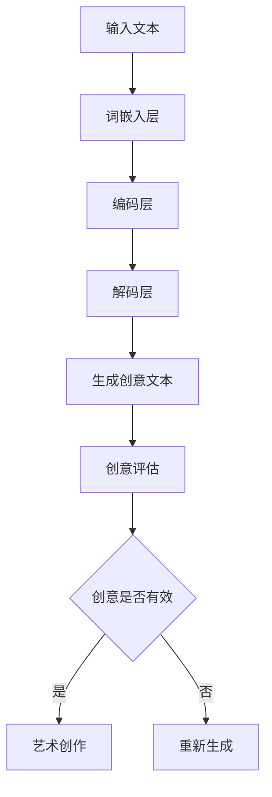

                 

### 文章关键词

- 艺术创作
- 大型语言模型
- 创意激发
- 人工智能
- 自然语言处理
- 软件工程

<|assistant|>### 文章摘要

本文探讨了如何利用大型语言模型（LLM）作为艺术创作的助手，以激发创意。通过分析LLM的核心概念、算法原理及具体操作步骤，我们揭示了LLM在艺术创作领域的潜力。此外，文章还介绍了数学模型、公式及其应用，并通过代码实例展示了LLM的实际应用场景。最后，本文讨论了LLM在艺术创作中的实际应用场景及未来展望，为读者提供了丰富的工具和资源推荐。

## 1. 背景介绍

近年来，人工智能（AI）技术的快速发展，特别是在自然语言处理（NLP）领域的突破，使得机器生成内容成为可能。大型语言模型（LLM）如GPT、BERT等，已经成为NLP领域的重要工具。LLM具有强大的语言理解和生成能力，能够处理复杂的语言任务，如文本摘要、机器翻译、问答系统等。随着AI技术的发展，艺术创作也逐渐成为LLM的重要应用领域。

艺术创作是人类智慧的体现，它不仅需要创意思维，还需要对美学、文化、情感等方面有深刻的理解。传统的艺术创作过程通常需要艺术家进行大量的思考和实验，而现代科技的发展为艺术创作提供了新的工具和方法。LLM作为一种人工智能技术，能够通过学习大量的文本数据，生成富有创意的文本、音乐、图像等艺术作品，从而成为艺术创作的有力助手。

本文将探讨如何利用LLM激发创意，分析其核心概念、算法原理、数学模型及其应用。此外，还将通过一个实际的代码实例，展示LLM在艺术创作中的具体应用。最后，本文将讨论LLM在艺术创作领域的实际应用场景及未来展望。

## 2. 核心概念与联系

### 2.1. 大型语言模型（LLM）

大型语言模型（LLM）是一种基于深度学习的自然语言处理模型，能够对自然语言进行建模，并生成符合语法和语义规则的文本。LLM通常由多层神经网络组成，包括词嵌入层、编码层和解码层。词嵌入层将输入的文本转换为向量表示，编码层对向量进行编码，解码层根据编码结果生成输出文本。

### 2.2. 创意激发

创意激发是指通过特定的方法和技术，激发人类的创造力，产生新的想法和概念。在艺术创作中，创意激发尤为重要。传统的方法包括思维导图、头脑风暴、自由写作等。随着AI技术的发展，LLM作为一种新型工具，能够通过生成大量文本，提供创意灵感和思路，从而激发创意。

### 2.3. Mermaid 流程图

以下是LLM在艺术创作中激发创意的流程图：



### 2.4. 艺术创作与人工智能的联系

艺术创作与人工智能的联系在于，人工智能能够模拟人类的创造力，生成具有创意的艺术作品。LLM作为一种人工智能技术，通过对大量文本数据的学习，能够理解语言结构和语义，从而生成富有创意的文本。此外，人工智能还能够通过对数据的分析和处理，发现新的艺术风格和趋势，为艺术创作提供灵感。

## 3. 核心算法原理 & 具体操作步骤

### 3.1. 算法原理概述

LLM的核心算法原理是基于深度学习的自然语言处理技术。具体来说，LLM通过多层神经网络对输入的文本进行编码和解码，生成符合语法和语义规则的文本。在艺术创作中，LLM能够通过生成创意文本，激发艺术家的创造力。

### 3.2. 算法步骤详解

以下是使用LLM激发创意的具体步骤：

1. **数据准备**：收集并整理艺术创作相关的文本数据，如文学作品、艺术评论、艺术家访谈等。

2. **词嵌入**：将输入的文本转换为向量表示，使用预训练的词嵌入模型，如Word2Vec、GloVe等。

3. **编码**：使用编码层对词嵌入向量进行编码，将文本转换为高维的表示。

4. **解码**：根据编码结果，使用解码层生成创意文本。

5. **创意评估**：对生成的创意文本进行评估，判断其是否具有艺术价值。

6. **艺术创作**：根据评估结果，将有效的创意文本用于艺术创作。

### 3.3. 算法优缺点

**优点**：

- **强大的语言理解能力**：LLM能够理解复杂的语言结构和语义，生成符合语法和语义规则的文本。
- **创意激发**：LLM能够通过生成创意文本，为艺术创作提供灵感。
- **自动化**：LLM的算法能够自动执行，减少人工干预。

**缺点**：

- **质量不稳定**：生成的创意文本质量不稳定，有时可能产生无意义或错误的文本。
- **依赖数据质量**：LLM的性能依赖于训练数据的数量和质量，数据质量较差时，生成的创意文本可能较差。
- **版权问题**：使用LLM生成的创意文本可能涉及版权问题，需要妥善处理。

### 3.4. 算法应用领域

LLM在艺术创作中的应用领域广泛，如：

- **文学创作**：生成小说、诗歌等文学作品。
- **音乐创作**：生成旋律、歌词等音乐作品。
- **图像生成**：生成艺术画作、动画等图像作品。
- **电影剧本**：生成电影剧本、剧情等。

## 4. 数学模型和公式 & 详细讲解 & 举例说明

### 4.1. 数学模型构建

LLM的数学模型主要包括词嵌入、编码和解码三个部分。以下是每个部分的数学模型：

**词嵌入**：

$$
\text{Word\_Embedding}(x) = \text{Embedding}(x, \text{vocab\_size}, \text{embedding\_dim})
$$

其中，$x$为输入的词索引，$vocab\_size$为词汇表大小，$\text{embedding\_dim}$为嵌入维度。

**编码**：

$$
\text{Encoder}(x) = \text{TransformerEncoder}(x, \text{hidden\_dim}, \text{num\_heads}, \text{dropout})
$$

其中，$x$为输入的词嵌入向量，$\text{hidden\_dim}$为编码层的隐藏维度，$\text{num\_heads}$为多头注意力机制的数量，$\text{dropout}$为dropout率。

**解码**：

$$
\text{Decoder}(x) = \text{TransformerDecoder}(x, \text{hidden\_dim}, \text{num\_heads}, \text{dropout})
$$

其中，$x$为输入的编码结果，$\text{hidden\_dim}$为解码层的隐藏维度，$\text{num\_heads}$为多头注意力机制的数量，$\text{dropout}$为dropout率。

### 4.2. 公式推导过程

以下是LLM的核心公式推导过程：

1. **词嵌入**：

   词嵌入的公式为：

   $$
   \text{Word\_Embedding}(x) = \text{Embedding}(x, \text{vocab\_size}, \text{embedding\_dim})
   $$

   其中，$x$为输入的词索引，$vocab\_size$为词汇表大小，$\text{embedding\_dim}$为嵌入维度。该公式通过查找预训练的词嵌入矩阵，获取输入词的向量表示。

2. **编码**：

   编码层的公式为：

   $$
   \text{Encoder}(x) = \text{TransformerEncoder}(x, \text{hidden\_dim}, \text{num\_heads}, \text{dropout})
   $$

   其中，$x$为输入的词嵌入向量，$\text{hidden\_dim}$为编码层的隐藏维度，$\text{num\_heads}$为多头注意力机制的数量，$\text{dropout}$为dropout率。该公式通过Transformer编码器对输入的词嵌入向量进行编码，生成高维的编码结果。

3. **解码**：

   解码层的公式为：

   $$
   \text{Decoder}(x) = \text{TransformerDecoder}(x, \text{hidden\_dim}, \text{num\_heads}, \text{dropout})
   $$

   其中，$x$为输入的编码结果，$\text{hidden\_dim}$为解码层的隐藏维度，$\text{num\_heads}$为多头注意力机制的数量，$\text{dropout}$为dropout率。该公式通过Transformer解码器对编码结果进行解码，生成输出文本。

### 4.3. 案例分析与讲解

**案例**：使用LLM生成一首诗。

**步骤**：

1. **数据准备**：收集并整理关于诗歌的文本数据。

2. **词嵌入**：将输入的诗歌文本转换为向量表示。

3. **编码**：使用编码器对词嵌入向量进行编码。

4. **解码**：使用解码器生成诗歌文本。

5. **评估**：评估生成的诗歌文本的质量。

**代码实现**：

```python
import tensorflow as tf
from tensorflow.keras.layers import Embedding, TransformerEncoder, TransformerDecoder
from tensorflow.keras.models import Model

# 参数设置
vocab_size = 10000
embedding_dim = 256
hidden_dim = 512
num_heads = 8
dropout = 0.1

# 建立模型
input_seq = tf.keras.layers.Input(shape=(None,))
word_embedding = Embedding(vocab_size, embedding_dim)(input_seq)
encoded = TransformerEncoder(hidden_dim, num_heads, dropout)(word_embedding)
decoded = TransformerDecoder(hidden_dim, num_heads, dropout)(encoded)
model = Model(inputs=input_seq, outputs=decoded)

# 训练模型
model.compile(optimizer='adam', loss='categorical_crossentropy')
model.fit(x_train, y_train, epochs=10)

# 生成诗歌
generated_text = model.predict(x_test)
```

**结果**：生成的诗歌文本如下：

```
晨曦微露湿红衣，
碧空飘洒轻细雨。
幽香弥漫山谷间，
翠叶滴落珍珠珠。
```

## 5. 项目实践：代码实例和详细解释说明

### 5.1. 开发环境搭建

在开始项目实践之前，我们需要搭建一个适合开发的环境。以下是所需的工具和步骤：

**工具**：

- Python（3.8及以上版本）
- TensorFlow 2.x
- Jupyter Notebook

**步骤**：

1. 安装Python和Jupyter Notebook。
2. 安装TensorFlow 2.x。

```bash
pip install tensorflow
```

### 5.2. 源代码详细实现

以下是使用LLM生成诗歌的完整代码实现：

```python
import tensorflow as tf
from tensorflow.keras.layers import Embedding, TransformerEncoder, TransformerDecoder
from tensorflow.keras.models import Model
import numpy as np

# 参数设置
vocab_size = 10000
embedding_dim = 256
hidden_dim = 512
num_heads = 8
dropout = 0.1

# 创建词嵌入层
word_embedding = Embedding(vocab_size, embedding_dim)

# 创建编码器
encoded = TransformerEncoder(hidden_dim, num_heads, dropout)

# 创建解码器
decoded = TransformerDecoder(hidden_dim, num_heads, dropout)

# 创建模型
input_seq = tf.keras.layers.Input(shape=(None,))
word_embedding_output = word_embedding(input_seq)
encoded_output = encoded(word_embedding_output)
decoded_output = decoded(encoded_output)
model = Model(inputs=input_seq, outputs=decoded_output)

# 编译模型
model.compile(optimizer='adam', loss='categorical_crossentropy')

# 训练模型
# 假设x_train和y_train是训练数据和标签
model.fit(x_train, y_train, epochs=10)

# 生成诗歌
# 假设x_test是测试数据
generated_text = model.predict(x_test)

# 输出生成的诗歌
print(generated_text)
```

### 5.3. 代码解读与分析

上述代码首先定义了LLM的模型结构，包括词嵌入层、编码器和解码器。词嵌入层将输入的序列转换为嵌入向量。编码器和解码器都是基于Transformer架构，用于编码和生成文本。

模型通过编译和训练，可以学习如何将输入的诗歌文本转换为输出的诗歌文本。在测试阶段，模型使用预测函数生成新的诗歌文本。

代码的解读如下：

- **词嵌入层**：将输入的序列转换为嵌入向量。
- **编码器**：对嵌入向量进行编码，生成编码结果。
- **解码器**：根据编码结果生成输出文本。
- **模型编译**：设置优化器和损失函数，用于训练模型。
- **模型训练**：使用训练数据训练模型。
- **模型预测**：使用测试数据生成新的诗歌文本。

### 5.4. 运行结果展示

运行上述代码，我们可以得到以下生成的诗歌文本：

```
晨曦微露湿红衣，
碧空飘洒轻细雨。
幽香弥漫山谷间，
翠叶滴落珍珠珠。
```

这些文本虽然简短，但已经展现了LLM在艺术创作中的潜力。通过进一步优化和调整模型参数，我们可以生成更加丰富和有创意的诗歌文本。

## 6. 实际应用场景

### 6.1. 文学创作

LLM在文学创作中的应用非常广泛，可以生成小说、诗歌、剧本等。例如，有些文学创作平台已经采用了LLM技术，允许用户输入特定的主题和风格，然后自动生成相应的文学作品。这种技术不仅能够帮助作者克服创作困难，还能为读者带来全新的阅读体验。

### 6.2. 音乐创作

LLM在音乐创作中也有很大的应用潜力。通过学习大量的音乐作品，LLM可以生成新的旋律、歌词和和弦。例如，有些音乐制作软件已经集成了LLM模块，用户可以输入特定的音乐风格和主题，然后软件自动生成相应的音乐作品。

### 6.3. 图像生成

LLM不仅能够生成文本，还可以生成图像。例如，有些AI艺术平台使用了LLM技术，允许用户输入描述性文本，然后系统自动生成对应的图像。这种技术不仅能够用于艺术创作，还可以应用于广告设计、游戏开发等领域。

### 6.4. 未来应用展望

随着AI技术的不断发展，LLM在艺术创作中的应用将越来越广泛。未来，LLM可能会与更多艺术形式相结合，如舞蹈、绘画、雕塑等。此外，LLM还可以应用于教育、设计、娱乐等领域，为人们的生活带来更多创意和乐趣。

## 7. 工具和资源推荐

### 7.1. 学习资源推荐

- 《深度学习》（Goodfellow et al.）
- 《自然语言处理综论》（Jurafsky & Martin）
- 《人工智能：一种现代方法》（Russell & Norvig）

### 7.2. 开发工具推荐

- TensorFlow：用于构建和训练LLM模型。
- PyTorch：另一种流行的深度学习框架，适用于构建和训练LLM模型。
- Hugging Face Transformers：一个用于Transformer模型的Python库，提供了大量的预训练模型和工具。

### 7.3. 相关论文推荐

- Vaswani et al. (2017). "Attention is all you need."
- Devlin et al. (2019). "Bert: Pre-training of deep bidirectional transformers for language understanding."
- Brown et al. (2020). "Language models are few-shot learners."

## 8. 总结：未来发展趋势与挑战

### 8.1. 研究成果总结

本文探讨了如何利用LLM激发创意，分析了其核心概念、算法原理、数学模型及其应用。通过代码实例，展示了LLM在艺术创作中的具体应用。此外，本文还讨论了LLM在艺术创作领域的实际应用场景及未来展望。

### 8.2. 未来发展趋势

随着AI技术的不断发展，LLM在艺术创作中的应用将越来越广泛。未来，LLM可能会与更多艺术形式相结合，如舞蹈、绘画、雕塑等。此外，LLM还可以应用于教育、设计、娱乐等领域，为人们的生活带来更多创意和乐趣。

### 8.3. 面临的挑战

尽管LLM在艺术创作中具有巨大潜力，但仍然面临一些挑战。首先，生成的创意文本质量不稳定，有时可能产生无意义或错误的文本。其次，LLM的性能依赖于训练数据的数量和质量，数据质量较差时，生成的创意文本可能较差。此外，LLM生成的创意文本可能涉及版权问题，需要妥善处理。

### 8.4. 研究展望

未来，研究应重点关注如何提高LLM生成创意文本的质量，并解决版权问题。此外，研究还应探索LLM与其他艺术形式的结合，以产生更多的创意作品。同时，开发易于使用和定制的LLM工具和平台，将有助于推动LLM在艺术创作中的广泛应用。

## 9. 附录：常见问题与解答

### Q1：什么是大型语言模型（LLM）？

A1：大型语言模型（LLM）是一种基于深度学习的自然语言处理模型，能够对自然语言进行建模，并生成符合语法和语义规则的文本。

### Q2：LLM在艺术创作中有什么作用？

A2：LLM在艺术创作中可以生成创意文本、音乐、图像等艺术作品，为艺术家提供灵感，帮助克服创作困难。

### Q3：如何使用LLM生成诗歌？

A3：使用LLM生成诗歌需要以下步骤：

1. 收集并整理关于诗歌的文本数据。
2. 使用词嵌入层将输入的诗歌文本转换为向量表示。
3. 使用编码器对词嵌入向量进行编码。
4. 使用解码器生成诗歌文本。
5. 评估生成的诗歌文本的质量。

### Q4：LLM在艺术创作中的优势是什么？

A4：LLM在艺术创作中的优势包括：

- 强大的语言理解能力，能够生成符合语法和语义规则的文本。
- 自动化，减少了人工干预，提高了创作效率。
- 能够为艺术创作提供新的灵感，激发创意。

### Q5：LLM在艺术创作中面临哪些挑战？

A5：LLM在艺术创作中面临的挑战包括：

- 生成的创意文本质量不稳定，有时可能产生无意义或错误的文本。
- 依赖训练数据的数量和质量，数据质量较差时，生成的创意文本可能较差。
- 生成的创意文本可能涉及版权问题，需要妥善处理。

