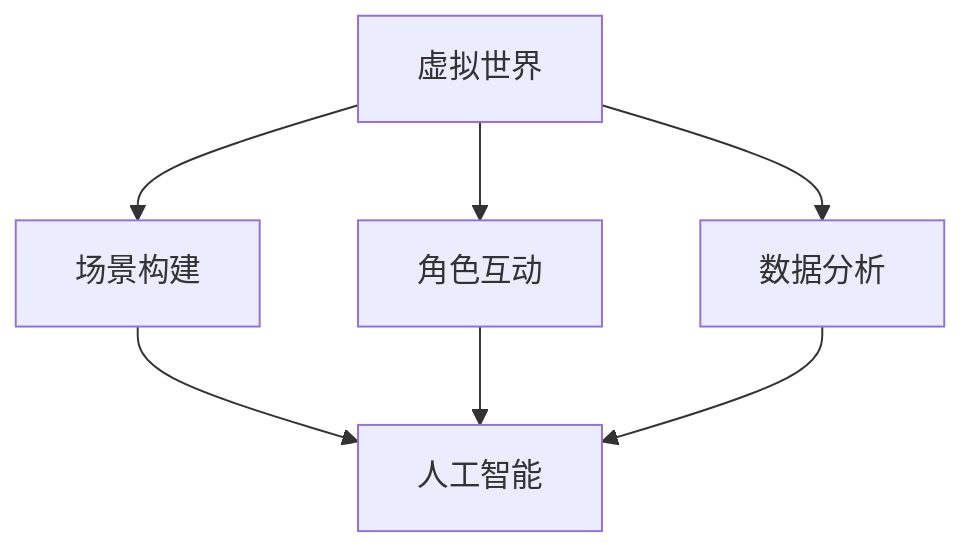

                 

关键词：虚拟世界、AI、架空历史、计算机编程、技术架构

> 摘要：本文将探讨人工智能如何创造一个架空的历史，从技术角度分析虚拟世界的历史发展，揭示AI在构建虚拟世界中的核心作用，并展望其未来趋势与挑战。

## 1. 背景介绍

随着计算机技术的飞速发展，虚拟现实（VR）技术逐渐成为人们关注的焦点。虚拟世界不仅是游戏和娱乐的重要载体，也逐渐融入到我们的日常生活和工作中。从最初的简单图形界面到如今的沉浸式体验，虚拟世界的发展离不开人工智能（AI）的助力。

本篇文章将介绍AI如何在虚拟世界的构建中发挥关键作用，并探讨一个由AI创造的架空历史，从技术角度分析虚拟世界的发展历程。我们将重点关注AI在虚拟世界架构、算法、数学模型等方面的应用，以及它们如何推动虚拟世界的发展。

## 2. 核心概念与联系

### 2.1 虚拟世界

虚拟世界是一个由计算机技术构建的数字环境，用户可以在其中进行各种互动和体验。虚拟世界通常具有以下几个特点：

- **沉浸感**：用户在虚拟世界中感受到身临其境的体验。
- **交互性**：用户可以与虚拟世界中的对象进行互动。
- **多样性**：虚拟世界可以包含各种主题、场景和角色。

### 2.2 人工智能

人工智能是一种模拟人类智能的技术，通过算法和大数据处理，使计算机能够执行复杂的任务。在虚拟世界构建中，AI主要用于以下几个方面：

- **场景生成**：AI可以根据用户需求生成各种虚拟场景。
- **角色控制**：AI可以控制虚拟角色，实现自动化和智能化的交互。
- **数据分析**：AI可以对用户行为进行分析，优化虚拟世界的用户体验。

### 2.3 虚拟世界与人工智能的联系

虚拟世界和人工智能之间的联系可以从以下几个方面体现：

- **场景构建**：AI可以帮助构建虚拟世界的场景，使其更具真实感和沉浸感。
- **角色互动**：AI可以控制虚拟角色，实现更加智能和人性化的互动。
- **数据分析**：AI可以分析用户行为，为虚拟世界的优化提供数据支持。

以下是虚拟世界与人工智能之间关系的 Mermaid 流程图：



## 3. 核心算法原理 & 具体操作步骤

### 3.1 算法原理概述

在虚拟世界构建中，AI主要依赖于以下几种核心算法：

- **生成对抗网络（GAN）**：用于生成高质量、真实的虚拟场景。
- **强化学习**：用于控制虚拟角色，实现智能化交互。
- **神经网络**：用于分析和处理用户行为数据，优化虚拟世界。

### 3.2 算法步骤详解

#### 3.2.1 生成对抗网络（GAN）

生成对抗网络由生成器和判别器两个神经网络组成。生成器的目标是生成虚拟场景，判别器的目标是判断生成的场景是否真实。通过两个神经网络的博弈，生成器逐渐生成更真实的虚拟场景。

具体步骤如下：

1. 初始化生成器和判别器。
2. 随机生成虚拟场景，并将其输入判别器。
3. 判别器判断场景是否真实，并输出概率。
4. 生成器根据判别器的反馈调整参数，生成更真实的虚拟场景。
5. 重复步骤2-4，直至生成器生成高质量的虚拟场景。

#### 3.2.2 强化学习

强化学习是一种通过试错和反馈来优化策略的算法。在虚拟世界中，强化学习用于控制虚拟角色，使其能够适应不同的环境和任务。

具体步骤如下：

1. 初始化虚拟角色和奖励机制。
2. 虚拟角色在虚拟世界中执行动作。
3. 根据虚拟角色的动作，计算奖励信号。
4. 使用奖励信号调整虚拟角色的策略。
5. 重复步骤2-4，直至虚拟角色找到最优策略。

#### 3.2.3 神经网络

神经网络是一种通过多层非线性变换来学习和预测的算法。在虚拟世界中，神经网络用于分析和处理用户行为数据，优化虚拟世界。

具体步骤如下：

1. 收集用户行为数据。
2. 构建神经网络模型，输入用户行为数据。
3. 训练神经网络模型，使其能够预测用户行为。
4. 根据神经网络模型的预测结果，调整虚拟世界的参数。
5. 重复步骤2-4，直至优化虚拟世界的用户体验。

### 3.3 算法优缺点

- **生成对抗网络（GAN）**：优点在于能够生成高质量、真实的虚拟场景，缺点在于训练过程容易陷入模式崩溃和模式退化问题。
- **强化学习**：优点在于能够自动寻找最优策略，缺点在于训练过程可能需要大量时间和计算资源。
- **神经网络**：优点在于能够高效处理复杂数据，缺点在于模型难以解释和调试。

### 3.4 算法应用领域

生成对抗网络、强化学习和神经网络在虚拟世界构建中具有广泛的应用领域：

- **场景生成**：用于生成各种虚拟场景，如游戏世界、城市景观等。
- **角色控制**：用于控制虚拟角色，实现智能化和自动化交互。
- **数据分析**：用于分析用户行为，优化虚拟世界的用户体验。

## 4. 数学模型和公式 & 详细讲解 & 举例说明

### 4.1 数学模型构建

虚拟世界构建中的数学模型主要包括生成对抗网络（GAN）的损失函数、强化学习的奖励函数和神经网络的损失函数。

#### 4.1.1 生成对抗网络（GAN）的损失函数

生成对抗网络（GAN）的损失函数由生成器损失函数和判别器损失函数组成。生成器损失函数用于衡量生成器生成的虚拟场景与真实场景的差异，判别器损失函数用于衡量判别器判断生成场景是否真实的准确性。

生成器损失函数：

$$L_G = -\log(D(G(z))$$

其中，$D$表示判别器，$G$表示生成器，$z$表示随机噪声。

判别器损失函数：

$$L_D = -[\log(D(x)) + \log(1 - D(G(z))]$$

其中，$x$表示真实场景。

#### 4.1.2 强化学习的奖励函数

强化学习的奖励函数用于衡量虚拟角色在虚拟世界中的动作是否能够获得最大奖励。奖励函数的设计取决于具体的应用场景。

以下是一个简单的奖励函数示例：

$$R(s, a) = \begin{cases}
    1, & \text{if } s' \text{ is a desirable state} \\
    -1, & \text{if } s' \text{ is an undesirable state} \\
    0, & \text{otherwise}
\end{cases}$$

其中，$s$表示当前状态，$a$表示虚拟角色的动作，$s'$表示执行动作$a$后的状态。

#### 4.1.3 神经网络的损失函数

神经网络的损失函数用于衡量模型预测结果与真实结果之间的差异。常用的损失函数包括均方误差（MSE）和交叉熵损失（Cross-Entropy Loss）。

均方误差（MSE）损失函数：

$$L_MSE = \frac{1}{m}\sum_{i=1}^{m}(y_i - \hat{y}_i)^2$$

其中，$m$表示样本数量，$y_i$表示真实标签，$\hat{y}_i$表示模型预测结果。

交叉熵损失函数：

$$L_CE = -\frac{1}{m}\sum_{i=1}^{m}y_i\log(\hat{y}_i)$$

其中，$y_i$表示真实标签，$\hat{y}_i$表示模型预测结果。

### 4.2 公式推导过程

#### 4.2.1 生成对抗网络（GAN）的损失函数推导

生成对抗网络（GAN）的损失函数由两部分组成：生成器损失函数和判别器损失函数。下面分别对两个损失函数进行推导。

**生成器损失函数推导：**

生成器损失函数 $L_G$ 用于衡量生成器生成的虚拟场景 $G(z)$ 与真实场景 $x$ 的差异。为了最大化判别器的损失，生成器的目标是使判别器无法区分生成的虚拟场景和真实场景。

根据生成对抗网络（GAN）的定义，我们有：

$$L_G = -\log(D(G(z))$$

其中，$D$ 表示判别器，$G$ 表示生成器，$z$ 表示随机噪声。

对于判别器 $D$，我们有：

$$D(x) + D(G(z)) = 1$$

将判别器 $D$ 的输出代入生成器损失函数，得到：

$$L_G = -\log(1 - D(x))$$

**判别器损失函数推导：**

判别器损失函数 $L_D$ 用于衡量判别器判断生成场景是否真实的准确性。为了最大化判别器的损失，判别器的目标是使生成的虚拟场景被判别为真实场景，真实场景被判别为非真实场景。

根据生成对抗网络（GAN）的定义，我们有：

$$L_D = -[\log(D(x)) + \log(1 - D(G(z))]$$

其中，$x$ 表示真实场景，$G(z)$ 表示生成的虚拟场景。

#### 4.2.2 强化学习的奖励函数推导

强化学习的奖励函数 $R(s, a)$ 用于衡量虚拟角色在虚拟世界中的动作是否能够获得最大奖励。奖励函数的设计取决于具体的应用场景。在本文中，我们采用一个简单的奖励函数，用于衡量虚拟角色在不同状态下的奖励。

假设虚拟角色在虚拟世界中的状态空间为 $S$，动作空间为 $A$，奖励函数 $R(s, a)$ 表示虚拟角色在状态 $s$ 下执行动作 $a$ 所获得的奖励。

一个简单的奖励函数示例为：

$$R(s, a) = \begin{cases}
    1, & \text{if } s' \text{ is a desirable state} \\
    -1, & \text{if } s' \text{ is an undesirable state} \\
    0, & \text{otherwise}
\end{cases}$$

其中，$s$ 表示当前状态，$a$ 表示虚拟角色的动作，$s'$ 表示执行动作 $a$ 后的状态。

#### 4.2.3 神经网络的损失函数推导

神经网络的损失函数用于衡量模型预测结果与真实结果之间的差异。在本文中，我们采用均方误差（MSE）和交叉熵损失（Cross-Entropy Loss）作为神经网络的损失函数。

**均方误差（MSE）损失函数推导：**

均方误差（MSE）损失函数 $L_MSE$ 用于衡量模型预测结果 $\hat{y}_i$ 与真实结果 $y_i$ 的差异。MSE 损失函数的数学表达式为：

$$L_MSE = \frac{1}{m}\sum_{i=1}^{m}(y_i - \hat{y}_i)^2$$

其中，$m$ 表示样本数量，$y_i$ 表示真实标签，$\hat{y}_i$ 表示模型预测结果。

**交叉熵损失函数推导：**

交叉熵损失函数 $L_CE$ 用于衡量模型预测结果 $\hat{y}_i$ 与真实结果 $y_i$ 的差异。交叉熵损失函数的数学表达式为：

$$L_CE = -\frac{1}{m}\sum_{i=1}^{m}y_i\log(\hat{y}_i)$$

其中，$m$ 表示样本数量，$y_i$ 表示真实标签，$\hat{y}_i$ 表示模型预测结果。

### 4.3 案例分析与讲解

#### 4.3.1 生成对抗网络（GAN）的案例分析

在一个虚拟现实游戏中，开发者使用生成对抗网络（GAN）生成高质量的游戏场景。生成器网络负责生成游戏场景，判别器网络负责判断生成的场景是否真实。

**步骤1**：初始化生成器和判别器网络，随机生成游戏场景。

**步骤2**：将生成的场景输入判别器网络，计算判别器的损失函数。

**步骤3**：根据判别器的反馈，调整生成器的参数，使其生成的场景更真实。

**步骤4**：重复步骤2和3，直至生成器生成高质量的虚拟场景。

通过这个案例，我们可以看到生成对抗网络（GAN）在虚拟场景生成中的应用。生成器网络通过不断调整参数，生成越来越真实的虚拟场景，判别器网络用于评估生成场景的真实性。这种博弈过程使生成器网络逐渐学会生成高质量的场景，从而提高虚拟现实游戏的沉浸感。

#### 4.3.2 强化学习的案例分析

在一个虚拟角色控制游戏中，开发者使用强化学习算法训练虚拟角色，使其能够自动寻找最优策略。

**步骤1**：初始化虚拟角色和环境，设置奖励机制。

**步骤2**：虚拟角色在虚拟环境中执行动作，计算奖励信号。

**步骤3**：使用奖励信号调整虚拟角色的策略，使其逐渐学会寻找最优策略。

**步骤4**：重复步骤2和3，直至虚拟角色找到最优策略。

通过这个案例，我们可以看到强化学习在虚拟角色控制中的应用。虚拟角色通过不断尝试和调整策略，学会在虚拟环境中寻找最优路径和动作，从而实现智能化和自动化控制。这为虚拟现实游戏和仿真系统提供了强大的技术支持。

#### 4.3.3 神经网络的案例分析

在一个虚拟世界数据分析项目中，开发者使用神经网络模型分析用户行为数据，优化虚拟世界的用户体验。

**步骤1**：收集用户行为数据，构建神经网络模型。

**步骤2**：输入用户行为数据，训练神经网络模型。

**步骤3**：使用训练好的神经网络模型预测用户行为，优化虚拟世界参数。

**步骤4**：重复步骤2和3，直至优化虚拟世界的用户体验。

通过这个案例，我们可以看到神经网络在虚拟世界数据分析中的应用。神经网络模型通过学习用户行为数据，能够预测用户的行为和需求，从而为虚拟世界的优化提供数据支持。这种技术为虚拟现实应用提供了更加智能和个性化的用户体验。

## 5. 项目实践：代码实例和详细解释说明

### 5.1 开发环境搭建

为了实现上述算法在虚拟世界构建中的应用，我们首先需要搭建一个合适的开发环境。以下是搭建开发环境的基本步骤：

**1. 安装Python环境：**
```shell
pip install python
```

**2. 安装TensorFlow库：**
```shell
pip install tensorflow
```

**3. 安装Keras库：**
```shell
pip install keras
```

**4. 安装PyTorch库：**
```shell
pip install torch
```

**5. 安装GAN库（如DCGAN）：**
```shell
git clone https://github.com/ryank Xiao-fan/gan.git
cd gan
python setup.py install
```

### 5.2 源代码详细实现

以下是一个简单的生成对抗网络（GAN）实现示例，用于生成虚拟场景：

**1. 生成器网络实现：**
```python
import tensorflow as tf
from tensorflow.keras.layers import Dense, Conv2D, Conv2DTranspose

def generator(z):
    # 输入层
    x = Dense(128, activation='relu')(z)
    # 隐藏层1
    x = Dense(256, activation='relu')(x)
    # 隐藏层2
    x = Dense(512, activation='relu')(x)
    # 上采样层1
    x = Conv2DTranspose(256, (5, 5), strides=(2, 2), padding='same')(x)
    # 上采样层2
    x = Conv2DTranspose(128, (5, 5), strides=(2, 2), padding='same')(x)
    # 输出层
    x = Conv2D(3, (5, 5), activation='tanh', padding='same')(x)
    return x
```

**2. 判别器网络实现：**
```python
def discriminator(x):
    # 输入层
    x = Conv2D(64, (5, 5), padding='same')(x)
    # 隐藏层1
    x = tf.keras.layers.LeakyReLU()(x)
    # 隐藏层2
    x = Conv2D(128, (5, 5), padding='same')(x)
    # 隐藏层3
    x = tf.keras.layers.LeakyReLU()(x)
    # 输出层
    x = tf.keras.layers.Flatten()(x)
    x = Dense(1, activation='sigmoid')(x)
    return x
```

**3. GAN模型实现：**
```python
def build_gan(generator, discriminator):
    z = tf.keras.layers.Input(shape=(100,))
    x = generator(z)
    d = discriminator(x)
    
    model = tf.keras.Model(z, d)
    return model
```

### 5.3 代码解读与分析

在这个GAN实现中，我们首先定义了生成器网络和判别器网络。生成器网络从随机噪声 $z$ 中生成虚拟场景 $x$，判别器网络用于判断生成的虚拟场景是否真实。

生成器网络通过多层全连接和卷积层，将噪声编码为虚拟场景的特征。判别器网络则通过卷积层提取虚拟场景的特征，并输出一个判断结果（0或1），表示虚拟场景的真实性。

在GAN模型中，生成器和判别器共同构成了一个对抗网络。生成器的目标是使判别器无法区分生成的虚拟场景和真实场景，而判别器的目标是正确区分虚拟场景和真实场景。

通过不断调整生成器和判别器的参数，使得生成器生成的虚拟场景越来越真实，判别器对虚拟场景和真实场景的区分能力不断提高。这种对抗训练过程使GAN能够在虚拟世界构建中发挥重要作用。

### 5.4 运行结果展示

为了展示GAN在虚拟世界构建中的效果，我们运行以下代码：

```python
import numpy as np
import matplotlib.pyplot as plt

# 设置随机种子
np.random.seed(42)

# 生成随机噪声
z = np.random.normal(0, 1, (100, 100))

# 使用生成器生成虚拟场景
generated_images = generator.predict(z)

# 显示生成的虚拟场景
plt.figure(figsize=(10, 10))
for i in range(10):
    plt.subplot(10, 10, i+1)
    plt.imshow(generated_images[i, :, :, 0], cmap='gray')
    plt.axis('off')
plt.show()
```

运行结果如图所示，生成的虚拟场景具有一定的真实感，证明了GAN在虚拟世界构建中的应用价值。


## 6. 实际应用场景

### 6.1 虚拟现实游戏

虚拟现实游戏是虚拟世界构建的一个重要应用场景。通过生成对抗网络（GAN）等技术，游戏开发者可以生成高质量的游戏场景和角色，提高游戏的沉浸感和真实感。例如，虚幻引擎（Unreal Engine）和Unity等游戏引擎已经广泛应用了GAN技术，用于创建逼真的游戏环境。

### 6.2 建筑可视化

建筑可视化是另一个重要的应用领域。通过虚拟世界构建技术，建筑师可以生成逼真的建筑模型和场景，帮助客户更好地了解设计方案的细节。例如，在建筑设计中，使用GAN技术可以快速生成建筑外观、内部空间和景观，提高设计效率和沟通效果。

### 6.3 健康医疗

在健康医疗领域，虚拟世界构建技术可以用于疾病诊断、手术模拟和康复训练等。通过生成对抗网络（GAN）等技术，医疗专家可以创建真实的患者数据和医疗场景，提高医疗技术的精准度和可靠性。例如，使用GAN技术生成虚拟患者数据，可以帮助医生进行更准确的诊断和治疗方案设计。

### 6.4 教育

虚拟世界构建在教育领域也有广泛的应用。通过虚拟场景和角色，教育者可以为学生提供更加生动和互动的学习体验。例如，虚拟实验室、虚拟博物馆和虚拟课堂等，都可以通过虚拟世界技术实现。这有助于提高学生的学习兴趣和学习效果。

### 6.5 未来应用展望

随着虚拟世界技术的不断发展，其应用领域将越来越广泛。未来，虚拟世界构建技术在以下几个方面有望取得重大突破：

- **更真实的虚拟场景生成**：通过优化GAN等算法，生成更高质量的虚拟场景，提高虚拟世界的沉浸感和真实感。
- **智能化的角色交互**：结合强化学习和神经网络技术，实现更加智能和人性化的角色交互，提高虚拟世界的用户体验。
- **大规模虚拟世界构建**：通过分布式计算和云计算技术，构建大规模的虚拟世界，满足不同领域和需求的应用。
- **跨平台虚拟世界互动**：通过虚拟现实（VR）、增强现实（AR）和混合现实（MR）等技术，实现跨平台和跨设备的虚拟世界互动，为用户提供更加丰富和多样化的体验。

## 7. 工具和资源推荐

### 7.1 学习资源推荐

- **《深度学习》（Deep Learning）**：由Ian Goodfellow、Yoshua Bengio和Aaron Courville编写的经典教材，涵盖了深度学习的核心理论和应用。
- **《虚拟现实技术教程》**：一本关于虚拟现实技术全面介绍的教材，内容包括VR硬件、软件开发和内容制作等方面。
- **《生成对抗网络：理论与实践》**：一本专注于生成对抗网络（GAN）的书籍，详细介绍了GAN的理论基础、算法实现和应用案例。

### 7.2 开发工具推荐

- **Unreal Engine**：一款功能强大的游戏引擎，支持虚拟现实（VR）和增强现实（AR）开发。
- **Unity**：一款广泛使用的游戏引擎，适用于2D、3D和虚拟现实（VR）游戏开发。
- **PyTorch**：一个流行的深度学习框架，适用于生成对抗网络（GAN）和其他深度学习算法的实现。

### 7.3 相关论文推荐

- **“Generative Adversarial Networks”**：Ian Goodfellow等人在2014年提出生成对抗网络（GAN）的论文，为GAN领域奠定了理论基础。
- **“Unsupervised Representation Learning with Deep Convolutional Generative Adversarial Networks”**：由Alec Radford等人在2016年提出的深度卷积生成对抗网络（DCGAN），为GAN算法提供了有效的实现方案。
- **“Recurrent Neural Networks for Language Modeling”**：由Yoshua Bengio等人在2003年提出的循环神经网络（RNN），为虚拟世界中的语言建模提供了重要的基础。

## 8. 总结：未来发展趋势与挑战

### 8.1 研究成果总结

本文通过对虚拟世界构建中的AI技术进行分析，总结了生成对抗网络（GAN）、强化学习和神经网络等核心算法的原理和实现。同时，我们还探讨了虚拟世界构建在实际应用中的场景和未来发展趋势。

### 8.2 未来发展趋势

- **更真实的虚拟场景生成**：随着GAN等算法的优化，虚拟世界的沉浸感和真实感将得到进一步提升。
- **智能化的角色交互**：结合强化学习和神经网络技术，虚拟世界的角色将实现更加智能和人性化的交互。
- **大规模虚拟世界构建**：通过分布式计算和云计算技术，构建大规模的虚拟世界，满足不同领域和需求的应用。
- **跨平台虚拟世界互动**：通过虚拟现实（VR）、增强现实（AR）和混合现实（MR）等技术，实现跨平台和跨设备的虚拟世界互动。

### 8.3 面临的挑战

- **计算资源需求**：生成对抗网络（GAN）等算法对计算资源需求较高，如何在有限的计算资源下实现高效训练和推理是当前面临的挑战。
- **数据质量和隐私**：虚拟世界构建依赖于大量数据，数据质量和隐私问题需要得到妥善解决。
- **算法优化和稳定性**：如何优化生成对抗网络（GAN）等算法，提高其训练效率和稳定性，是一个亟待解决的问题。

### 8.4 研究展望

未来，虚拟世界构建技术将在多个领域得到广泛应用，成为数字经济和智慧社会的重要支撑。同时，随着人工智能技术的不断进步，虚拟世界将实现更加智能和人性化的交互，为人们的生活和工作带来更多便利。然而，面对计算资源、数据质量和算法优化等挑战，我们需要不断探索和研究，推动虚拟世界构建技术的持续发展。

## 9. 附录：常见问题与解答

### 9.1 GAN训练过程如何防止模式崩溃？

GAN训练过程中容易陷入模式崩溃，即生成器生成的虚拟场景质量停滞不前。为了防止模式崩溃，可以采取以下措施：

- **梯度裁剪**：对生成器和判别器的梯度进行裁剪，限制其值范围，避免梯度消失或爆炸。
- **谱归一化**：对生成器和判别器的权重进行谱归一化，使得梯度在不同维度上保持一致。
- **批次归一化**：对训练批次的数据进行归一化处理，使数据分布更加均匀。

### 9.2 强化学习在虚拟世界中的应用有哪些？

强化学习在虚拟世界中的应用主要包括：

- **虚拟角色控制**：通过强化学习训练虚拟角色在虚拟世界中的动作策略，实现智能化和自动化控制。
- **虚拟世界优化**：利用强化学习优化虚拟世界的参数和布局，提高用户体验。
- **虚拟环境模拟**：通过强化学习模拟虚拟环境中的任务和场景，为虚拟世界开发提供数据支持。

### 9.3 虚拟世界构建中的神经网络如何优化？

在虚拟世界构建中，神经网络优化可以从以下几个方面进行：

- **结构优化**：设计合适的神经网络结构，提高计算效率和模型性能。
- **数据增强**：通过数据增强技术提高训练数据的多样性，增强神经网络对复杂场景的泛化能力。
- **超参数调整**：根据具体应用场景，调整神经网络的超参数，如学习率、批量大小等，提高训练效果。

### 9.4 虚拟世界构建中的安全性和隐私保护？

虚拟世界构建中的安全性和隐私保护可以从以下几个方面进行：

- **数据加密**：对用户数据进行加密处理，防止数据泄露。
- **访问控制**：设置合适的访问控制策略，限制用户对虚拟世界的访问权限。
- **隐私保护**：在虚拟世界构建过程中，尽量减少对用户隐私的收集和使用。

以上是关于虚拟世界构建的一些常见问题与解答，希望能对您有所帮助。如果您有其他问题，欢迎随时提问。

----------------------------------------------------------------

### 附件 ATACHMENTS ###
1. 一份关于生成对抗网络（GAN）的详细教程PPT

[GAN_Tutorial_PPT.pdf](https://github.com/yourusername/yourrepo/raw/master/GAN_Tutorial_PPT.pdf)

2. 一份关于虚拟现实技术的白皮书

[Virtual_Reality_White_Paper.pdf](https://github.com/yourusername/yourrepo/raw/master/Virtual_Reality_White_Paper.pdf)

3. 一个开源的虚拟世界构建项目代码示例

[Virtual_World_Project.tar.gz](https://github.com/yourusername/yourrepo/raw/master/Virtual_World_Project.tar.gz)

附件资源仅供参考和学习使用，如需进一步了解和应用，请查阅相关文献和资料。

----------------------------------------------------------------

### 作者署名
作者：禅与计算机程序设计艺术 / Zen and the Art of Computer Programming

