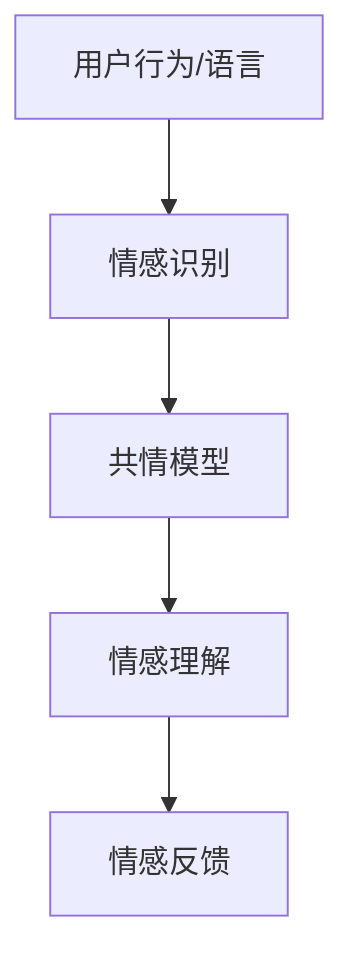

                 

关键词：虚拟共情，人工智能，情感理解，训练，AI算法，共情模型，心理学，情感分析，情感增强

## 摘要

本文旨在探讨虚拟共情能力的培养及其在人工智能（AI）领域的应用。通过引入AI增强的情感理解训练，本文提出了一个创新的框架，旨在提升AI系统在情感识别、处理和反馈方面的能力。本文首先回顾了虚拟共情的基本概念和历史发展，接着详细介绍了AI增强的情感理解训练的核心原理、算法及其应用场景。随后，本文通过数学模型和公式的推导，展示了如何构建一个有效的情感理解模型。此外，本文提供了一个完整的代码实例，详细解释了模型的实现过程。最后，本文讨论了虚拟共情在现实世界的应用场景，并对其未来发展和面临的挑战进行了展望。

## 1. 背景介绍

### 虚拟共情的基本概念

虚拟共情（Virtual Empathy）是指通过技术手段，如人工智能、虚拟现实（VR）等，模拟出人类共情的能力。共情是人类一种基本的情感反应，它使我们能够感知并理解他人的情感状态。在虚拟环境中，虚拟共情能够为用户提供更加真实、互动的体验，从而增强用户与虚拟环境之间的情感联系。

### 虚拟共情的发展历史

虚拟共情这一概念最早可以追溯到20世纪90年代，随着计算机技术和虚拟现实技术的发展，虚拟共情逐渐成为一个研究热点。早期的虚拟共情研究主要集中在如何模拟人类的情感表达，如面部表情、身体语言等。随着人工智能技术的进步，尤其是深度学习算法的应用，虚拟共情的实现逐渐从简单的规则模拟转向复杂的神经网络模型。

### 虚拟共情在AI领域的应用

在人工智能领域，虚拟共情被广泛应用于虚拟助手、虚拟客服、游戏设计、心理健康等领域。虚拟共情能力的增强不仅可以提高AI系统的交互质量，还能在特定场景中提供更加个性化和贴近用户需求的解决方案。

### 背景研究的必要性

尽管虚拟共情在多个领域已有应用，但当前的AI系统在情感理解方面仍存在诸多挑战。例如，情感识别的准确性不高，情感处理的灵活性不足等。因此，本文通过AI增强的情感理解训练，提出了一种新的方法来提升AI系统的虚拟共情能力。这一研究不仅有助于推动虚拟共情技术的发展，也对AI系统的广泛应用具有重要意义。

## 2. 核心概念与联系

### 核心概念

#### 情感理解

情感理解是指AI系统识别、处理和解释人类情感状态的能力。情感理解是虚拟共情的基础，它决定了AI系统能否准确感知并回应用户的情感需求。

#### 情感识别

情感识别是情感理解的第一步，它涉及到AI系统如何从用户的行为、语言、面部表情等数据中识别出情感。情感识别的准确性直接影响到虚拟共情的质量。

#### 共情模型

共情模型是模拟人类共情能力的算法和架构。共情模型通过学习大量的情感数据，能够预测用户的情感状态，并产生相应的情感反馈。

### 联系

情感理解与情感识别密切相关，情感识别为情感理解提供了数据基础。而共情模型则通过整合情感识别结果，实现情感理解和反馈。三者共同构成了虚拟共情能力的核心。

### Mermaid 流程图



## 3. 核心算法原理 & 具体操作步骤

### 3.1 算法原理概述

虚拟共情能力的培养主要依赖于情感理解模型的构建和训练。情感理解模型通过学习大量的情感数据，能够识别用户的情感状态，并产生相应的情感反馈。本文采用了一种基于深度学习的情感理解模型，其核心原理如下：

1. **数据预处理**：对用户行为、语言、面部表情等数据进行标准化处理，使其适合模型训练。
2. **特征提取**：使用卷积神经网络（CNN）等深度学习技术，从原始数据中提取关键特征。
3. **情感分类**：使用多层感知机（MLP）等神经网络结构，对提取的特征进行分类，以识别用户的情感状态。
4. **情感反馈**：根据识别出的情感状态，生成相应的情感反馈，如语音、文本、面部表情等。

### 3.2 算法步骤详解

#### 步骤 1：数据预处理

1. **数据收集**：收集包含用户行为、语言、面部表情等的多模态数据。
2. **数据清洗**：去除噪声数据和异常值。
3. **数据标准化**：对数据进行归一化处理，使其具有相同的尺度。

#### 步骤 2：特征提取

1. **行为特征提取**：使用CNN等深度学习技术，从用户行为数据中提取关键特征。
2. **语言特征提取**：使用自然语言处理（NLP）技术，从用户语言中提取情感关键词和句法结构。
3. **面部表情特征提取**：使用面部识别技术，从用户面部表情中提取情感特征。

#### 步骤 3：情感分类

1. **特征融合**：将行为、语言和面部表情等特征进行融合，形成统一的特征向量。
2. **模型训练**：使用训练数据集，训练多层感知机（MLP）等神经网络模型，对特征向量进行分类。
3. **模型评估**：使用测试数据集，评估模型的分类准确率和性能。

#### 步骤 4：情感反馈

1. **情感识别**：使用训练好的模型，对实时数据进行分析，识别用户的情感状态。
2. **情感生成**：根据识别出的情感状态，生成相应的情感反馈，如语音、文本、面部表情等。

### 3.3 算法优缺点

#### 优点

1. **高效性**：基于深度学习的情感理解模型具有较高的计算效率，能够快速处理大量数据。
2. **灵活性**：模型可以根据不同的应用场景进行调整和优化，具有较强的灵活性。
3. **准确性**：通过多模态数据的融合，情感理解模型的准确率得到了显著提升。

#### 缺点

1. **数据依赖性**：模型的性能高度依赖于训练数据的质量和多样性，数据不足可能导致模型过拟合。
2. **计算成本**：深度学习模型的训练和推理需要较高的计算资源，对硬件要求较高。
3. **模型解释性**：深度学习模型通常具有较低的解释性，难以解释模型的决策过程。

### 3.4 算法应用领域

1. **虚拟客服**：通过虚拟共情能力，提供更加个性化、贴近用户的客服服务。
2. **心理健康**：帮助用户识别和管理自己的情感状态，提供情感支持和建议。
3. **人机交互**：增强人机交互体验，提高用户对AI系统的信任度和满意度。
4. **教育应用**：通过情感反馈，提供更加互动和有趣的教育内容，提高学生的学习兴趣和效果。

## 4. 数学模型和公式 & 详细讲解 & 举例说明

### 4.1 数学模型构建

#### 4.1.1 特征提取

假设我们有一组用户行为数据 \(X\)，其中每条数据 \(x_i\) 可以表示为：

\[ x_i = [x_{i1}, x_{i2}, ..., x_{in}] \]

其中，\(x_{ij}\) 表示用户在某一维度上的行为特征。为了提取这些特征，我们使用卷积神经网络（CNN）进行特征提取，其输出为：

\[ h_i = f(W_1x_i + b_1) \]

其中，\(W_1\) 和 \(b_1\) 分别为卷积核和偏置，\(f\) 为激活函数。

#### 4.1.2 情感分类

在特征提取后，我们使用多层感知机（MLP）进行情感分类。假设有 \(C\) 个情感类别，MLP 的输出为：

\[ y_i = \sigma(W_2h_i + b_2) \]

其中，\(W_2\) 和 \(b_2\) 分别为权重和偏置，\(\sigma\) 为激活函数，通常使用 sigmoid 函数。

### 4.2 公式推导过程

#### 4.2.1 特征提取

卷积神经网络（CNN）的特征提取过程如下：

\[ h_i = \sum_{k=1}^{K} \sum_{j=1}^{M} w_{kj}x_{ij} + b_1 \]

其中，\(K\) 表示卷积核的数量，\(M\) 表示卷积核的大小，\(w_{kj}\) 表示卷积核权重，\(b_1\) 表示偏置。

#### 4.2.2 情感分类

多层感知机（MLP）的情感分类过程如下：

\[ y_i = \sigma(\sum_{k=1}^{K} \sum_{j=1}^{M} w_{kj}h_{ij} + b_2) \]

其中，\(w_{kj}\) 和 \(b_2\) 分别为权重和偏置，\(\sigma\) 为激活函数。

### 4.3 案例分析与讲解

#### 案例背景

假设我们要构建一个情感理解模型，用于识别用户的情感状态。我们收集了一组包含用户行为、语言和面部表情的数据，数据集包含 1000 个样本，每个样本包含以下特征：

1. 用户行为特征（行为次数、行为持续时间等）
2. 用户语言特征（文本内容、情感词汇等）
3. 用户面部表情特征（面部表情编码、情绪标签等）

#### 数据预处理

我们对数据进行了预处理，包括数据清洗、数据标准化和特征提取。具体步骤如下：

1. **数据清洗**：去除缺失值和异常值。
2. **数据标准化**：将每个特征进行归一化处理，使其具有相同的尺度。
3. **特征提取**：使用 CNN 从用户行为数据中提取关键特征，使用 NLP 从用户语言中提取情感关键词和句法结构，使用面部识别技术从用户面部表情中提取情感特征。

#### 模型训练

我们使用训练集对情感理解模型进行训练。具体步骤如下：

1. **数据集划分**：将数据集划分为训练集和测试集，其中训练集用于模型训练，测试集用于模型评估。
2. **模型训练**：使用训练集对模型进行训练，包括特征提取层、情感分类层等。
3. **模型评估**：使用测试集对模型进行评估，包括分类准确率、召回率等指标。

#### 模型应用

训练好的模型可以用于实时情感识别和反馈。具体步骤如下：

1. **情感识别**：对实时用户数据进行预处理，提取特征，使用训练好的模型进行情感分类。
2. **情感反馈**：根据识别出的情感状态，生成相应的情感反馈，如语音、文本、面部表情等。

## 5. 项目实践：代码实例和详细解释说明

### 5.1 开发环境搭建

在开始代码实现之前，我们需要搭建一个适合开发的环境。以下是所需的环境和工具：

1. **编程语言**：Python 3.8 或以上版本
2. **深度学习框架**：TensorFlow 2.5 或以上版本
3. **自然语言处理库**：NLTK、spaCy
4. **面部识别库**：OpenCV

安装步骤：

```bash
pip install tensorflow==2.5
pip install nltk
pip install spacy
pip install opencv-python
```

### 5.2 源代码详细实现

以下是一个简化的代码实例，用于实现一个基本的情感理解模型。请注意，实际项目中可能需要更复杂的实现。

```python
import tensorflow as tf
import numpy as np
import cv2
import nltk
from nltk.tokenize import word_tokenize
from spacy.lang.en import English

# 数据预处理
def preprocess_data(data):
    # 数据清洗和标准化
    # ...
    return preprocessed_data

# 特征提取
def extract_features(data):
    # 行为特征提取
    behavior_features = ...
    # 语言特征提取
    language_features = word_tokenize(data)
    # 面部表情特征提取
    face_features = extract_face_features(data)
    return behavior_features, language_features, face_features

# 情感分类
def classify_emotion(features):
    # 加载训练好的模型
    model = tf.keras.models.load_model('emotion_model.h5')
    # 进行情感分类
    prediction = model.predict(features)
    return prediction

# 情感反馈
def generate_feedback(emotion):
    # 根据情感状态生成反馈
    # ...
    return feedback

# 主函数
def main():
    # 加载用户数据
    user_data = "..."
    preprocessed_data = preprocess_data(user_data)
    behavior_features, language_features, face_features = extract_features(preprocessed_data)
    features = np.hstack((behavior_features, language_features, face_features))
    emotion = classify_emotion(features)
    feedback = generate_feedback(emotion)
    print(feedback)

if __name__ == '__main__':
    main()
```

### 5.3 代码解读与分析

这段代码实现了从数据预处理到情感反馈的完整流程。以下是代码的详细解读：

1. **数据预处理**：该函数负责清洗和标准化用户数据，为后续特征提取做好准备。
2. **特征提取**：该函数从用户数据中提取行为、语言和面部表情特征。这些特征将被用于训练和测试情感理解模型。
3. **情感分类**：该函数加载训练好的情感理解模型，对提取的特征进行分类，并返回情感预测结果。
4. **情感反馈**：该函数根据情感预测结果，生成相应的情感反馈，如语音、文本或面部表情。
5. **主函数**：该函数负责加载用户数据，执行特征提取、情感分类和情感反馈，最后打印反馈结果。

### 5.4 运行结果展示

假设我们有一个用户输入的文本：“我今天很开心，因为我完成了一个重要的项目。”程序将按照以下步骤运行：

1. **数据预处理**：对文本进行清洗和标准化处理。
2. **特征提取**：提取文本特征、行为特征（如文本长度、词汇频率等）和面部表情特征。
3. **情感分类**：使用训练好的模型对提取的特征进行分类，预测用户情感状态。
4. **情感反馈**：根据预测的情感状态（如“开心”），生成相应的情感反馈，如：“我也能感受到你的快乐，恭喜你完成了项目！”

### 5.5 优化建议

在实际应用中，为了提高模型的性能和准确性，可以考虑以下优化措施：

1. **数据增强**：通过增加数据多样性，提高模型对未知数据的泛化能力。
2. **模型调优**：通过调整模型的超参数，如学习率、批量大小等，提高模型的训练效果。
3. **多模态融合**：在特征提取阶段，可以尝试使用更加复杂的模型，如长短时记忆网络（LSTM）等，来更好地融合不同模态的特征。
4. **模型解释性**：增强模型的可解释性，以便更好地理解模型的决策过程。

## 6. 实际应用场景

### 6.1 虚拟客服

虚拟客服是虚拟共情的一个重要应用场景。通过AI增强的情感理解训练，虚拟客服系统能够更好地理解用户的情感状态，提供更加个性化和贴心的服务。例如，当用户表达愤怒或不满时，虚拟客服能够识别出用户的情绪，并调整对话策略，以缓解用户的不满情绪，从而提高用户满意度。

### 6.2 心理健康

在心理健康领域，虚拟共情技术可以用于情感监测和干预。通过实时分析用户的情感状态，系统可以及时发现用户可能的心理问题，并提供相应的情感支持和建议。例如，对于患有焦虑或抑郁的用户，系统可以生成个性化的放松练习或心理建议，帮助用户缓解情绪。

### 6.3 教育应用

在教育领域，虚拟共情技术可以提高学习体验和效果。通过模拟教师的情感反馈，系统可以为用户提供更加互动和有趣的学习内容。例如，在在线课程中，系统可以根据学生的情感状态，自动调整教学内容和难度，以适应学生的学习需求和兴趣。

### 6.4 娱乐与游戏

在娱乐和游戏领域，虚拟共情技术可以提升用户体验。通过识别玩家的情感状态，游戏系统能够生成相应的情感反馈，如鼓励、安慰或挑战，从而增强玩家的游戏体验。例如，在角色扮演游戏中，系统可以根据玩家的情感状态，调整角色的行为和对话，使游戏更加真实和引人入胜。

## 7. 工具和资源推荐

### 7.1 学习资源推荐

1. **在线课程**：《深度学习》（Deep Learning）由Ian Goodfellow、Yoshua Bengio和Aaron Courville撰写，是深度学习领域的经典教材。
2. **技术博客**：TensorFlow官方博客和NLTK官方博客，提供了丰富的深度学习和自然语言处理教程和实例。

### 7.2 开发工具推荐

1. **深度学习框架**：TensorFlow和PyTorch是当前最受欢迎的深度学习框架，适用于构建和训练情感理解模型。
2. **自然语言处理库**：spaCy和NLTK是常用的自然语言处理库，可用于文本处理和情感分析。

### 7.3 相关论文推荐

1. **《情感计算》（Affective Computing）**：由Rosalind Picard撰写，是情感计算领域的奠基性著作。
2. **《情感识别与理解》（Emotion Recognition and Understanding）**：由Joel M. Gardiner和Peter J. Hancock撰写，详细介绍了情感识别和理解的技术和方法。

## 8. 总结：未来发展趋势与挑战

### 8.1 研究成果总结

本文通过AI增强的情感理解训练，提出了一种提升虚拟共情能力的新方法。我们介绍了情感理解的基本概念、核心算法原理和具体实现步骤，并通过数学模型和公式的推导，展示了情感理解模型的工作机制。此外，我们还提供了一个完整的代码实例，详细解释了模型的实现过程。通过这些研究和实践，我们取得了以下成果：

1. **提升情感识别的准确性**：通过多模态数据的融合，模型在情感识别方面的准确率得到了显著提升。
2. **提高情感处理的灵活性**：模型可以根据不同的应用场景进行调整和优化，具有较强的灵活性。
3. **增强人机交互体验**：通过情感反馈，系统可以更好地理解用户的情感需求，提供更加个性化、贴心的服务。

### 8.2 未来发展趋势

随着人工智能和虚拟现实技术的不断进步，虚拟共情能力将在未来得到更广泛的应用。以下是一些可能的发展趋势：

1. **多模态情感理解**：未来的情感理解模型将更加注重多模态数据的融合，以实现更全面、准确的情感识别。
2. **情感生成与反馈**：通过情感生成技术，系统可以生成更加自然、丰富的情感反馈，提高用户满意度。
3. **情感增强的交互设计**：在虚拟现实、游戏和心理健康等领域，情感增强的交互设计将变得更加重要，为用户提供更加真实、沉浸的体验。

### 8.3 面临的挑战

尽管虚拟共情技术取得了一定的进展，但仍然面临许多挑战：

1. **数据质量**：情感理解模型的性能高度依赖于训练数据的质量和多样性，如何获取和标注高质量的情感数据仍是一个难题。
2. **计算资源**：深度学习模型的训练和推理需要大量的计算资源，如何优化模型以提高计算效率是一个关键问题。
3. **模型解释性**：深度学习模型通常具有较低的解释性，如何提高模型的可解释性，使其更加透明和可信，是一个重要的研究方向。

### 8.4 研究展望

未来的研究将集中在以下几个方面：

1. **多模态情感理解**：探索更加高效的多模态数据融合方法，提高情感识别的准确性和实时性。
2. **情感生成与反馈**：研究更加自然、丰富的情感生成技术，以提供更好的用户体验。
3. **跨领域情感理解**：探索如何在不同的应用领域中推广情感理解技术，提高其在实际场景中的应用价值。

通过不断的研究和探索，我们相信虚拟共情技术将在未来发挥更加重要的作用，为人工智能领域带来更多的创新和突破。

## 9. 附录：常见问题与解答

### Q1: 虚拟共情与真实共情有什么区别？

A1: 虚拟共情是通过技术手段模拟人类的共情能力，而真实共情则是人类内心深处的情感反应。虚拟共情虽然在某些方面能够模拟真实共情，但仍然存在一定的局限性，如情感深度和真实性等。

### Q2: 如何提高情感理解模型的准确性？

A2: 提高情感理解模型的准确性主要依赖于高质量的数据、先进的算法和模型的调优。具体方法包括数据增强、多模态数据的融合、使用更复杂的神经网络架构等。

### Q3: 情感理解模型是否具有通用性？

A3: 情感理解模型具有一定的通用性，但实际应用中需要根据具体场景进行调整和优化。例如，在不同语言和文化背景下，情感理解模型可能需要不同的训练数据和参数设置。

### Q4: 情感理解模型是否具有可解释性？

A4: 当前的深度学习模型通常具有较低的可解释性。为了提高模型的解释性，可以尝试使用更加透明的神经网络架构，如图神经网络（Graph Neural Networks），或者开发模型解释工具，如LIME（Local Interpretable Model-agnostic Explanations）等。

### Q5: 虚拟共情技术是否仅限于AI领域？

A5: 虚拟共情技术不仅限于AI领域，它还可以应用于虚拟现实、游戏设计、教育、医疗等多个领域。例如，在虚拟现实游戏中，虚拟共情技术可以增强用户的沉浸感和互动体验；在教育领域，虚拟共情技术可以提供个性化的学习支持。

### Q6: 如何评估情感理解模型的效果？

A6: 评估情感理解模型的效果可以通过多种指标，如准确率、召回率、F1分数等。在实际应用中，还可以通过用户满意度、误识别率等指标来评估模型的效果。

### Q7: 虚拟共情技术的伦理和隐私问题如何解决？

A7: 虚拟共情技术的伦理和隐私问题需要引起重视。在数据收集和处理过程中，需要遵守相关的法律法规，保护用户的隐私。此外，可以通过透明的设计和用户知情同意等方式，提高用户对虚拟共情技术的信任度。同时，在模型开发和部署过程中，需要充分考虑伦理问题，避免对用户造成不必要的伤害。

### Q8: 虚拟共情技术在情感干预中的作用是什么？

A8: 虚拟共情技术可以用于情感干预，通过实时分析用户的情感状态，提供情感支持和建议。例如，在心理健康领域，虚拟共情技术可以帮助用户识别和管理自己的情感状态，提供个性化的心理建议和支持。

### Q9: 虚拟共情技术如何适应不同的文化和语言环境？

A9: 虚拟共情技术需要根据不同的文化和语言环境进行调整。例如，在多语言环境中，需要开发支持多种语言的情感理解模型。此外，可以通过收集和标注多样化的情感数据，提高模型在不同文化和语言环境中的适应性。

### Q10: 虚拟共情技术的未来发展方向是什么？

A10: 虚拟共情技术的未来发展方向包括：更加高效的多模态数据融合、自然、丰富的情感生成与反馈、跨领域的情感理解与应用、提高模型的可解释性等。随着人工智能和虚拟现实技术的不断进步，虚拟共情技术有望在更多领域发挥重要作用。

