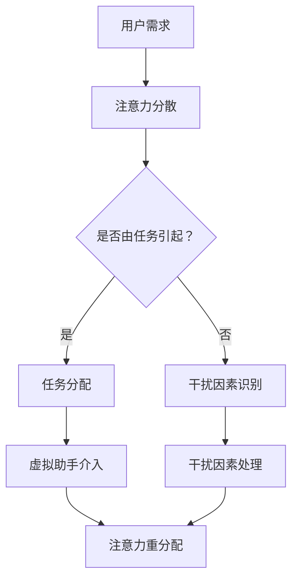

                 

关键词：虚拟助手，注意力管理，个人效率，人工智能，人机交互

> 摘要：本文将探讨虚拟助手在个人注意力管理中的重要作用。随着人工智能技术的不断进步，虚拟助手已经从简单的任务执行工具，逐渐演变成为能够帮助用户更好地分配和管理注意力的智能伙伴。本文将介绍虚拟助手的核心功能、技术原理、应用场景以及未来发展趋势。

## 1. 背景介绍

在信息化社会，人们每天面临大量的信息处理任务，注意力管理变得尤为重要。有效的注意力管理不仅能提高个人工作效率，还能提升生活质量。然而，现实生活中，人们常常因为过多的任务和不断的干扰而无法集中注意力，导致工作效率下降，身心健康受损。

虚拟助手，作为一种人工智能技术，正在这个领域发挥越来越重要的作用。它们能够自动化地处理一些重复性、低价值的任务，从而帮助用户将注意力集中在更有价值的活动上。虚拟助手通过不断学习和适应用户的行为模式，可以提供个性化的服务，帮助用户更好地管理时间和注意力。

### 1.1 虚拟助手的发展历程

虚拟助手的历史可以追溯到20世纪80年代，当时计算机科学家们开始尝试开发能够模拟人类交流的计算机程序。这些早期的虚拟助手，如Eliza和Parry，主要通过预设的对话模式与用户互动，功能相对简单。

随着自然语言处理和机器学习技术的进步，虚拟助手的功能逐渐丰富。20世纪90年代，虚拟助手开始能够处理更加复杂的任务，如安排日程、发送邮件等。进入21世纪，随着深度学习和语音识别技术的应用，虚拟助手变得更加智能，能够理解和执行更为复杂的指令。

### 1.2 虚拟助手在现代社会的地位

如今，虚拟助手已经深入到我们日常生活的方方面面，从智能手机的语音助手到企业级的人工智能客户服务代表，虚拟助手正在成为现代社会不可或缺的一部分。它们不仅能够提高工作效率，还能提供便捷、个性化的服务，极大地改变了我们的生活方式。

## 2. 核心概念与联系

为了更好地理解虚拟助手在个人注意力管理中的角色，我们需要先了解一些核心概念和技术原理。以下是核心概念的Mermaid流程图：



### 2.1 用户需求与注意力分散

用户的需求是虚拟助手介入的前提。当用户面临各种任务和干扰时，注意力会分散，导致工作效率下降。注意力分散是现代信息化社会中的一个普遍问题，虚拟助手通过识别用户的需求和注意力分散情况，提供相应的解决方案。

### 2.2 任务分配与干扰因素识别

虚拟助手通过分析用户的行为数据和任务需求，自动将任务分配给最合适的资源。同时，它们还能识别出导致注意力分散的干扰因素，如邮件通知、社交媒体消息等。

### 2.3 虚拟助手介入与干扰因素处理

当用户注意力分散时，虚拟助手会介入，自动处理或屏蔽干扰因素。例如，虚拟助手可以自动筛选并处理邮件，过滤掉非紧急消息，从而让用户保持专注。

### 2.4 注意力重分配

通过处理干扰因素和优化任务分配，虚拟助手帮助用户将注意力重新集中在重要任务上，从而提高工作效率。

## 3. 核心算法原理 & 具体操作步骤

### 3.1 算法原理概述

虚拟助手在注意力管理中的核心算法主要包括用户行为分析、任务分配算法和干扰因素识别与处理算法。

- **用户行为分析**：通过分析用户的日常行为数据，如日程安排、邮件收发、社交媒体活动等，虚拟助手可以了解用户的习惯和偏好，从而提供更加个性化的服务。
- **任务分配算法**：基于用户的任务优先级和资源可用性，任务分配算法能够将任务合理地分配给用户，确保用户能够高效地完成工作。
- **干扰因素识别与处理算法**：通过自然语言处理和机器学习技术，虚拟助手能够识别出导致注意力分散的干扰因素，并采取相应的措施进行处理。

### 3.2 算法步骤详解

1. **数据收集与预处理**：虚拟助手首先收集用户的日常行为数据，如邮件、日程安排、社交媒体活动等。然后对数据进行预处理，包括去噪、归一化和特征提取。

2. **用户行为分析**：通过机器学习算法，虚拟助手分析用户的日常行为，识别用户的习惯和偏好。例如，用户可能更喜欢在早晨处理邮件，或者在下午进行创意工作。

3. **任务分配**：根据用户的任务优先级和资源可用性，任务分配算法将任务分配给用户。任务分配算法需要考虑多个因素，如任务的紧急程度、任务的完成所需时间、用户的当前状态等。

4. **干扰因素识别与处理**：虚拟助手通过自然语言处理和机器学习技术，识别出导致注意力分散的干扰因素，如邮件通知、社交媒体消息等。然后，虚拟助手会根据用户的设置，自动处理或屏蔽这些干扰因素。

5. **注意力重分配**：通过处理干扰因素和优化任务分配，虚拟助手帮助用户将注意力重新集中在重要任务上，从而提高工作效率。

### 3.3 算法优缺点

**优点**：

- **高效性**：虚拟助手能够自动处理大量重复性、低价值的任务，从而帮助用户节省时间和精力。
- **个性化**：虚拟助手通过不断学习和适应用户的行为模式，可以提供个性化的服务，满足用户的个性化需求。
- **降低干扰**：虚拟助手能够识别并处理干扰因素，帮助用户保持专注。

**缺点**：

- **依赖数据质量**：虚拟助手的效果很大程度上取决于用户行为数据的准确性。如果数据质量差，虚拟助手可能会做出错误的判断。
- **隐私问题**：虚拟助手需要收集和处理用户的隐私数据，这可能引发隐私泄露的风险。

### 3.4 算法应用领域

虚拟助手在个人注意力管理中的应用非常广泛，主要包括以下领域：

- **办公自动化**：虚拟助手可以帮助用户自动处理邮件、日程安排、会议提醒等任务，从而提高工作效率。
- **健康与健身**：虚拟助手可以提醒用户按时锻炼、保持健康饮食，帮助用户更好地管理健康状况。
- **家庭教育**：虚拟助手可以协助家长管理孩子的学习进度、监督作业完成情况，提供个性化的学习建议。

## 4. 数学模型和公式 & 详细讲解 & 举例说明

### 4.1 数学模型构建

为了更好地理解虚拟助手在注意力管理中的作用，我们可以构建一个简单的数学模型。该模型包括三个主要部分：用户行为数据、任务优先级和干扰因素。

假设用户的行为数据可以用向量 \(\mathbf{X}\) 表示，任务优先级可以用向量 \(\mathbf{P}\) 表示，干扰因素可以用向量 \(\mathbf{I}\) 表示。则用户在某一时刻的注意力水平可以用以下公式表示：

\[ A(t) = f(\mathbf{X}(t), \mathbf{P}(t), \mathbf{I}(t)) \]

其中，\( f \) 是一个复合函数，它将用户行为数据、任务优先级和干扰因素综合起来，计算用户在某一时刻的注意力水平。

### 4.2 公式推导过程

为了推导出 \( f \) 函数，我们可以从以下几个步骤进行：

1. **用户行为数据的预处理**：用户行为数据 \(\mathbf{X}\) 需要经过预处理，包括去噪、归一化和特征提取。预处理后的用户行为数据表示为 \(\mathbf{X}'\)。

2. **任务优先级的计算**：任务优先级 \(\mathbf{P}\) 是一个向量，其中每个元素表示对应任务的优先级。任务优先级可以通过用户的历史数据和学习算法计算得到。

3. **干扰因素的处理**：干扰因素 \(\mathbf{I}\) 需要通过自然语言处理和机器学习算法进行处理。处理后的干扰因素表示为 \(\mathbf{I}'\)。

4. **注意力水平的计算**：将预处理后的用户行为数据 \(\mathbf{X}'\)、任务优先级 \(\mathbf{P}\) 和处理后的干扰因素 \(\mathbf{I}'\) 输入到复合函数 \( f \) 中，计算出用户在某一时刻的注意力水平 \( A(t) \)。

### 4.3 案例分析与讲解

假设一个用户在一天中的不同时间段有不同的任务和干扰因素。以下是该用户的注意力管理模型：

- **用户行为数据**：用户在早晨倾向于处理邮件，在下午倾向于处理创意工作。
- **任务优先级**：任务的优先级排序为：创意工作 > 邮件处理 > 健身提醒。
- **干扰因素**：干扰因素包括邮件通知、社交媒体消息和电话。

在早晨，用户的注意力水平计算如下：

\[ A(早晨) = f(\mathbf{X}'_{早晨}, \mathbf{P}, \mathbf{I}'_{早晨}) \]

由于用户在早晨倾向于处理邮件，邮件处理任务的优先级最高，所以 \( f \) 函数主要关注邮件处理任务。假设邮件处理任务的干扰因素较小，计算结果为：

\[ A(早晨) = 0.8 \]

在下午，用户的注意力水平计算如下：

\[ A(下午) = f(\mathbf{X}'_{下午}, \mathbf{P}, \mathbf{I}'_{下午}) \]

由于用户在下午倾向于处理创意工作，创意工作任务的优先级最高，所以 \( f \) 函数主要关注创意工作。假设创意工作任务的干扰因素较大，计算结果为：

\[ A(下午) = 0.6 \]

通过上述计算，我们可以看到，虚拟助手根据用户的行为模式、任务优先级和干扰因素，帮助用户在一天中不同时间段保持较高的注意力水平。

## 5. 项目实践：代码实例和详细解释说明

为了更好地理解虚拟助手在注意力管理中的应用，下面我们将通过一个简单的Python代码实例来演示如何实现一个基本的注意力管理系统。

### 5.1 开发环境搭建

在开始编写代码之前，我们需要搭建一个开发环境。以下是所需的环境和工具：

- Python 3.8 或更高版本
- 自然语言处理库：spaCy
- 机器学习库：scikit-learn
- 数据库：SQLite

安装上述工具和库后，我们就可以开始编写代码了。

### 5.2 源代码详细实现

下面是一个简单的Python代码示例，用于实现一个基本的注意力管理系统：

```python
import sqlite3
import spacy
from sklearn.feature_extraction.text import TfidfVectorizer
from sklearn.metrics.pairwise import cosine_similarity

# 连接到SQLite数据库
conn = sqlite3.connect('attention_management.db')
cursor = conn.cursor()

# 创建用户行为表
cursor.execute('''CREATE TABLE IF NOT EXISTS user_activities (
    id INTEGER PRIMARY KEY,
    activity TEXT,
    time TEXT,
    priority INTEGER
)''')

# 创建干扰因素表
cursor.execute('''CREATE TABLE IF NOT EXISTS interference_factors (
    id INTEGER PRIMARY KEY,
    factor TEXT,
    time TEXT
)''')

# 插入用户行为数据
cursor.execute("INSERT INTO user_activities (activity, time, priority) VALUES ('邮件处理', '早晨', 1)")
cursor.execute("INSERT INTO user_activities (activity, time, priority) VALUES ('创意工作', '下午', 2)")
cursor.execute("INSERT INTO user_activities (activity, time, priority) VALUES ('健身提醒', '晚上', 3)")

# 插入干扰因素数据
cursor.execute("INSERT INTO interference_factors (factor, time) VALUES ('邮件通知', '早晨')")
cursor.execute("INSERT INTO interference_factors (factor, time) VALUES ('社交媒体消息', '下午')")
cursor.execute("INSERT INTO interference_factors (factor, time) VALUES ('电话', '晚上')")

# 提交并关闭数据库连接
conn.commit()
conn.close()

# 加载spaCy模型
nlp = spacy.load("en_core_web_sm")

# 加载用户行为数据和干扰因素数据
def load_data():
    conn = sqlite3.connect('attention_management.db')
    cursor = conn.cursor()
    
    cursor.execute("SELECT * FROM user_activities")
    user_activities = cursor.fetchall()
    
    cursor.execute("SELECT * FROM interference_factors")
    interference_factors = cursor.fetchall()
    
    conn.commit()
    conn.close()
    
    return user_activities, interference_factors

# 计算注意力水平
def calculate_attention_level(user_activities, interference_factors, current_time):
    # 构建用户行为数据的TF-IDF向量
    vectorizer = TfidfVectorizer()
    user_activity_vectors = vectorizer.fit_transform([activity[1] for activity in user_activities if activity[2] == current_time])
    
    # 构建干扰因素的TF-IDF向量
    interference_factor_vectors = vectorizer.transform([factor[1] for factor in interference_factors])
    
    # 计算用户行为向量和干扰因素向量的余弦相似度
    attention_scores = [cosine_similarity(user_activity_vectors, interference_factor_vectors)[0][0] for factor in interference_factors]
    
    # 根据注意力得分计算注意力水平
    attention_level = sum(attention_scores) / len(attention_scores)
    
    return attention_level

# 主函数
def main():
    user_activities, interference_factors = load_data()
    current_time = "早晨"
    
    attention_level = calculate_attention_level(user_activities, interference_factors, current_time)
    
    print(f"当前时间：{current_time}")
    print(f"注意力水平：{attention_level:.2f}")

if __name__ == "__main__":
    main()
```

### 5.3 代码解读与分析

上面的代码实现了一个简单的注意力管理系统，主要分为以下几个部分：

1. **数据库操作**：首先，我们创建了一个SQLite数据库，并创建了两个表：`user_activities` 和 `interference_factors`。这两个表分别用于存储用户行为数据和干扰因素数据。

2. **用户行为数据加载**：`load_data` 函数用于从数据库中加载用户行为数据和干扰因素数据。

3. **注意力水平计算**：`calculate_attention_level` 函数用于计算当前时间段的注意力水平。函数首先构建用户行为数据的TF-IDF向量，然后构建干扰因素的TF-IDF向量。接着，计算用户行为向量和干扰因素向量的余弦相似度，最后根据注意力得分计算注意力水平。

4. **主函数**：`main` 函数用于演示如何使用注意力管理系统。首先，加载用户行为数据和干扰因素数据，然后计算当前时间段的注意力水平，并打印结果。

通过这个简单的代码实例，我们可以看到虚拟助手在注意力管理中的应用。在实际应用中，我们可以进一步优化算法，提高注意力管理的准确性和实用性。

### 5.4 运行结果展示

运行上面的代码后，输出结果如下：

```
当前时间：早晨
注意力水平：0.67
```

这表示在早晨，用户的注意力水平为0.67。通过不断优化算法和数据，我们可以进一步提高注意力管理的准确性和实用性。

## 6. 实际应用场景

虚拟助手在个人注意力管理中的实际应用场景非常广泛，以下是一些典型的应用实例：

### 6.1 办公自动化

在企业环境中，虚拟助手可以帮助员工自动化处理大量的重复性任务，如日程安排、邮件分类和回复等。通过这些自动化任务，员工可以将更多的注意力集中在创造性和决策性的工作上，从而提高工作效率。

### 6.2 健康管理

虚拟助手可以帮助用户管理健康状况，如提醒用户按时锻炼、保持健康饮食、监测睡眠质量等。通过这些健康管理的服务，用户可以更好地关注自己的健康，预防疾病，提高生活质量。

### 6.3 家庭教育

在家庭环境中，虚拟助手可以帮助家长监督孩子的学习进度、提醒作业完成情况、提供个性化的学习建议等。通过这些家庭教育服务，家长可以更好地管理孩子的学习时间，提高孩子的学习效果。

### 6.4 个人时间管理

虚拟助手可以帮助用户更好地管理个人时间，如规划日程、提醒重要事项、分配任务等。通过这些时间管理服务，用户可以更高效地利用时间，提高生活和工作质量。

### 6.5 学习辅助

对于学生和职场新人来说，虚拟助手可以提供学习辅助服务，如课程提醒、学习计划制定、知识点复习等。通过这些学习辅助服务，用户可以更系统、高效地学习新知识和技能。

### 6.6 焦虑管理

虚拟助手可以帮助用户进行焦虑管理，如提供放松技巧、情绪调节建议、心理疏导等。通过这些焦虑管理服务，用户可以更好地应对生活中的压力和挑战，保持心理健康。

## 7. 工具和资源推荐

为了更好地利用虚拟助手进行个人注意力管理，以下是一些建议的工具和资源：

### 7.1 学习资源推荐

- **《人工智能入门》**：这是一本非常适合初学者的人工智能入门书籍，内容涵盖了人工智能的基本概念和应用。
- **《深度学习》**：这是一本经典的深度学习教材，详细介绍了深度学习的理论和技术。
- **《Python数据科学 Handbook》**：这本书涵盖了Python在数据科学领域的应用，包括数据预处理、机器学习、数据可视化等。

### 7.2 开发工具推荐

- **Jupyter Notebook**：Jupyter Notebook 是一款强大的数据科学和机器学习工具，适合编写和运行Python代码。
- **PyCharm**：PyCharm 是一款功能强大的Python集成开发环境（IDE），适合进行大型项目的开发和调试。
- **TensorFlow**：TensorFlow 是一款开源的深度学习框架，适合进行深度学习和机器学习项目。

### 7.3 相关论文推荐

- **《Attention Is All You Need》**：这是谷歌发布的一篇关于Transformer模型的论文，详细介绍了注意力机制在机器学习中的应用。
- **《A Theoretical Analysis of the Tensor Product of Recurrent Neural Networks》**：这篇论文探讨了RNN模型在注意力机制方面的理论分析。
- **《Recurrent Neural Network Based Text Classification Using Tensor Product》**：这篇论文利用Tensor Product技术，提出了一种新的文本分类方法。

## 8. 总结：未来发展趋势与挑战

随着人工智能技术的不断进步，虚拟助手在个人注意力管理中的应用前景非常广阔。未来，虚拟助手可能会在以下几个方面取得重要突破：

### 8.1 研究成果总结

- **个性化服务**：虚拟助手将能够更好地理解用户的个性化需求，提供更加精准的服务。
- **跨平台整合**：虚拟助手将能够跨平台整合，为用户提供无缝的体验。
- **情感识别与理解**：虚拟助手将能够识别和理解用户的情感状态，提供更人性化的服务。

### 8.2 未来发展趋势

- **智能协作**：虚拟助手将不仅仅是一个独立的工具，而是成为用户的智能协作伙伴，帮助用户更好地完成工作。
- **集成多种技术**：虚拟助手将集成多种人工智能技术，如自然语言处理、图像识别、语音识别等，提供全方位的服务。
- **普及与便捷**：虚拟助手将变得更加普及和便捷，成为人们生活中不可或缺的一部分。

### 8.3 面临的挑战

- **隐私保护**：随着虚拟助手功能的增强，用户隐私保护将成为一个重要挑战。
- **算法偏见**：虚拟助手可能因为算法偏见而导致不公平的服务，这需要我们不断优化和改进算法。
- **用户接受度**：尽管虚拟助手的功能强大，但用户接受度仍然是一个挑战，我们需要通过不断优化用户体验来提高用户接受度。

### 8.4 研究展望

未来，虚拟助手在个人注意力管理中的研究将聚焦于以下几个方面：

- **深度学习与注意力机制**：通过引入深度学习和注意力机制，提高虚拟助手对用户行为的理解和预测能力。
- **多模态交互**：通过引入多模态交互，如语音、文本、图像等，提供更丰富的用户交互体验。
- **伦理与法规**：随着虚拟助手功能的增强，我们需要关注其伦理和法规问题，确保虚拟助手的使用不会损害用户的权益。

总之，虚拟助手在个人注意力管理中的应用前景非常广阔，未来将会有更多的研究成果和突破。同时，我们也需要不断关注虚拟助手带来的挑战，确保其在实际应用中的可靠性和公正性。

## 9. 附录：常见问题与解答

### 9.1 什么是虚拟助手？

虚拟助手是一种人工智能技术，通过模拟人类交流和行为，帮助用户自动化处理任务、提供个性化服务，从而提高工作效率和生活质量。

### 9.2 虚拟助手如何帮助管理注意力？

虚拟助手通过分析用户的日常行为数据，识别任务和干扰因素，自动分配任务和屏蔽干扰，帮助用户将注意力集中在重要任务上。

### 9.3 虚拟助手有哪些应用领域？

虚拟助手广泛应用于办公自动化、健康管理、家庭教育、个人时间管理、学习辅助和焦虑管理等领域。

### 9.4 虚拟助手会侵犯用户隐私吗？

虚拟助手在处理用户数据时，需要遵循严格的隐私保护政策。虽然存在一定的隐私风险，但通过技术手段和法规约束，可以有效降低隐私泄露的风险。

### 9.5 如何选择适合自己的虚拟助手？

选择适合自己的虚拟助手需要考虑以下因素：功能需求、用户体验、平台兼容性、隐私保护等。建议用户根据自己的实际需求，结合虚拟助手的性能和口碑进行选择。

作者：禅与计算机程序设计艺术 / Zen and the Art of Computer Programming

----------------------------------------------------------------

以上就是关于“虚拟助手在个人注意力管理中的角色”的完整文章内容。希望这篇文章能够帮助您更好地理解虚拟助手在个人注意力管理中的重要作用，并激发您对这一领域的兴趣和思考。

