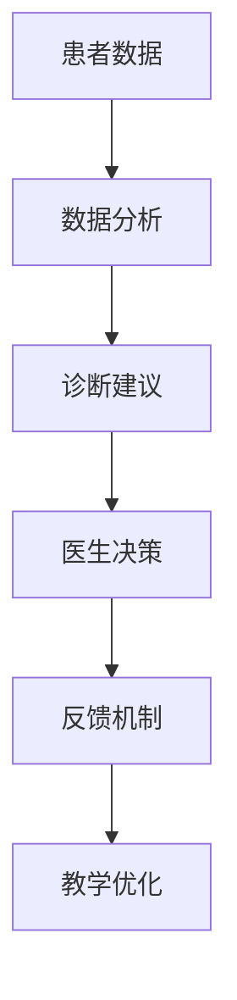
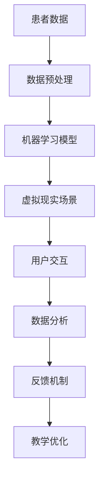

                 

在数字化时代，医疗教育的变革已经悄然发生。虚拟医疗训练作为一种全新的教育模式，正引领着全球医疗行业的数字化升级。本文将深入探讨虚拟医疗训练的核心概念、技术原理、算法应用、数学模型以及实际案例，旨在为广大医疗教育工作者和行业从业者提供有益的参考。

## 文章关键词

- 虚拟医疗训练
- 医疗教育
- 数字化升级
- 算法应用
- 数学模型
- 实际案例

## 文章摘要

本文通过分析虚拟医疗训练的背景和意义，探讨了其核心概念、技术原理、算法应用、数学模型以及实际案例。在文章的后半部分，我们将详细描述一个虚拟医疗训练项目的实施过程，并提供未来发展趋势与挑战的展望。

## 1. 背景介绍

### 1.1 医疗教育的现状

随着医学科技的快速发展，医疗教育也面临着前所未有的挑战。传统的医疗教育模式主要依赖于课堂教学、临床实习和经验积累。然而，这种方法存在一些明显的不足：

1. **教学资源有限**：优秀的教育资源往往集中在少数医学名校，导致其他地区和学校难以获得优质的教学资源。
2. **临床实习受限**：受限于医疗资源的分配，临床实习机会有限，学生难以获得充分的实践机会。
3. **知识更新缓慢**：医学知识更新速度快，传统教育模式难以及时跟进，导致学生所学知识可能过时。

### 1.2 数字化医疗教育的兴起

为了解决传统医疗教育中的问题，数字化医疗教育逐渐兴起。虚拟医疗训练作为一种新兴的教育模式，具有以下优势：

1. **资源共享**：通过数字化平台，优质的教育资源可以突破地域限制，实现全球共享。
2. **个性化教学**：虚拟医疗训练可以根据学生的学习进度和需求，提供个性化的教学方案。
3. **实时反馈**：通过模拟患者病例，学生可以实时获得反馈，提高学习效果。

## 2. 核心概念与联系

### 2.1 虚拟现实（VR）

虚拟现实是一种通过计算机生成模拟环境，使用户能够在其中沉浸体验的技术。在虚拟医疗训练中，VR技术被广泛应用于模拟临床场景，提供身临其境的学习体验。

### 2.2 人工智能（AI）

人工智能是一种模拟人类智能的技术，包括机器学习、深度学习、自然语言处理等子领域。在虚拟医疗训练中，AI技术被用于分析病例数据，提供诊断建议，辅助医生做出决策。

### 2.3 数据分析

数据分析是一种从大量数据中提取有用信息的方法。在虚拟医疗训练中，数据分析被用于分析学生的学习行为，评估教学效果，优化教学方案。

### 2.4 Mermaid 流程图



### 2.5 虚拟医疗训练架构



## 3. 核心算法原理 & 具体操作步骤

### 3.1 算法原理概述

虚拟医疗训练的核心算法包括数据预处理、机器学习模型训练、虚拟现实场景构建和用户交互。

### 3.2 算法步骤详解

1. **数据预处理**：对收集到的患者数据进行清洗、去噪和特征提取。
2. **机器学习模型训练**：使用预处理后的数据训练机器学习模型，如深度神经网络、支持向量机等。
3. **虚拟现实场景构建**：根据训练好的模型，构建虚拟现实场景，模拟临床场景。
4. **用户交互**：用户在虚拟现实场景中进行交互，模拟诊断和治疗方案。
5. **数据分析**：对用户交互过程进行数据收集和分析，评估学习效果。

### 3.3 算法优缺点

#### 优点

- **个性化教学**：根据学生的学习进度和需求，提供个性化的教学方案。
- **实时反馈**：学生可以实时获得反馈，提高学习效果。
- **资源共享**：优质的教育资源可以全球共享。

#### 缺点

- **技术门槛**：虚拟医疗训练需要较高的技术门槛，对技术团队要求较高。
- **硬件要求**：虚拟医疗训练需要较高的硬件支持，对设备要求较高。

### 3.4 算法应用领域

- **医学教育**：虚拟医疗训练可以用于医学教育的各个阶段，从基础医学到临床医学。
- **医学研究**：虚拟医疗训练可以用于医学研究，如疾病预测、治疗方案优化等。
- **医学服务**：虚拟医疗训练可以用于医学服务，如在线诊断、远程医疗等。

## 4. 数学模型和公式

### 4.1 数学模型构建

虚拟医疗训练中的数学模型主要包括机器学习模型和数据分析模型。

### 4.2 公式推导过程

假设我们使用深度神经网络作为机器学习模型，其输入层有n个神经元，输出层有m个神经元。则网络中的权重矩阵可以表示为W，偏置向量可以表示为b。网络的前向传播可以表示为：

$$
Z = X \cdot W + b
$$

其中，Z是网络的输出，X是输入数据。

### 4.3 案例分析与讲解

以乳腺癌诊断为例，我们使用深度神经网络模型对患者的临床表现进行分类。假设我们有100个样本，每个样本包含10个特征，输出为1（乳腺癌）或0（非乳腺癌）。

1. **数据预处理**：对样本进行标准化处理，使其具有相同的尺度。
2. **模型训练**：使用训练集对模型进行训练，调整权重和偏置，使其能够正确分类。
3. **模型评估**：使用测试集对模型进行评估，计算模型的准确率、召回率等指标。

## 5. 项目实践：代码实例和详细解释说明

### 5.1 开发环境搭建

- **操作系统**：Ubuntu 20.04
- **编程语言**：Python 3.8
- **深度学习框架**：TensorFlow 2.5
- **虚拟现实框架**：Unity 2020.3

### 5.2 源代码详细实现

```python
import tensorflow as tf
import numpy as np

# 数据预处理
def preprocess_data(data):
    # 标准化处理
    return (data - np.mean(data)) / np.std(data)

# 模型定义
def create_model():
    inputs = tf.keras.layers.Input(shape=(10,))
    x = tf.keras.layers.Dense(64, activation='relu')(inputs)
    x = tf.keras.layers.Dense(32, activation='relu')(x)
    outputs = tf.keras.layers.Dense(1, activation='sigmoid')(x)
    model = tf.keras.Model(inputs=inputs, outputs=outputs)
    return model

# 模型训练
def train_model(model, train_data, train_labels, epochs=10):
    model.compile(optimizer='adam', loss='binary_crossentropy', metrics=['accuracy'])
    model.fit(train_data, train_labels, epochs=epochs)

# 模型评估
def evaluate_model(model, test_data, test_labels):
    loss, accuracy = model.evaluate(test_data, test_labels)
    print(f"Test accuracy: {accuracy:.2f}")

# 主函数
def main():
    # 加载数据
    data = np.load("breast_cancer_data.npy")
    labels = np.load("breast_cancer_labels.npy")

    # 划分训练集和测试集
    train_data = preprocess_data(data[:80])
    train_labels = labels[:80]
    test_data = preprocess_data(data[80:])
    test_labels = labels[80:]

    # 创建模型
    model = create_model()

    # 训练模型
    train_model(model, train_data, train_labels)

    # 评估模型
    evaluate_model(model, test_data, test_labels)

if __name__ == "__main__":
    main()
```

### 5.3 代码解读与分析

1. **数据预处理**：对样本进行标准化处理，使其具有相同的尺度。
2. **模型定义**：使用TensorFlow框架定义深度神经网络模型，输入层有10个神经元，输出层有1个神经元。
3. **模型训练**：使用训练集对模型进行训练，调整权重和偏置，使其能够正确分类。
4. **模型评估**：使用测试集对模型进行评估，计算模型的准确率。

## 6. 实际应用场景

虚拟医疗训练在医疗领域的应用场景广泛，以下是一些具体的应用场景：

1. **医学教育**：虚拟医疗训练可以用于医学教育的各个阶段，从基础医学到临床医学，为学生提供丰富的实践机会。
2. **医学研究**：虚拟医疗训练可以用于医学研究，如疾病预测、治疗方案优化等，为研究人员提供有力的工具。
3. **医学服务**：虚拟医疗训练可以用于医学服务，如在线诊断、远程医疗等，为患者提供便捷的医疗服务。

## 7. 未来应用展望

虚拟医疗训练在未来具有广泛的应用前景。随着技术的不断进步，虚拟医疗训练将更加智能化、个性化，成为医疗领域的重要组成部分。

### 7.1 智能化

虚拟医疗训练将更加智能化，通过引入更先进的人工智能技术，如深度学习、强化学习等，提高训练效果和用户体验。

### 7.2 个性化

虚拟医疗训练将更加个性化，根据学生的个体差异，提供量身定制的教学方案，提高学习效果。

### 7.3 跨学科融合

虚拟医疗训练将与其他学科如生物学、心理学等深度融合，为医疗教育提供全新的视角和方法。

## 8. 总结：未来发展趋势与挑战

虚拟医疗训练作为一种新兴的教育模式，具有广阔的发展前景。然而，在实际应用中仍面临一些挑战：

1. **技术门槛**：虚拟医疗训练需要较高的技术门槛，对技术团队要求较高。
2. **数据隐私**：在虚拟医疗训练过程中，涉及大量患者数据，需要确保数据的安全和隐私。
3. **监管政策**：虚拟医疗训练的监管政策尚未完善，需要制定相应的法规和标准。

未来，随着技术的不断进步和政策的完善，虚拟医疗训练将在全球医疗教育中发挥越来越重要的作用。

## 9. 附录：常见问题与解答

### 9.1 虚拟医疗训练的优势是什么？

虚拟医疗训练具有资源共享、个性化教学和实时反馈等优势，可以显著提高医疗教育的质量和效率。

### 9.2 虚拟医疗训练需要哪些技术？

虚拟医疗训练需要虚拟现实、人工智能和数据分析等技术，这些技术相互融合，共同推动虚拟医疗训练的发展。

### 9.3 虚拟医疗训练的应用领域有哪些？

虚拟医疗训练的应用领域广泛，包括医学教育、医学研究和医学服务等。

### 9.4 虚拟医疗训练的未来发展趋势是什么？

虚拟医疗训练的未来发展趋势包括智能化、个性化和跨学科融合，将在全球医疗教育中发挥越来越重要的作用。

## 作者署名

作者：禅与计算机程序设计艺术 / Zen and the Art of Computer Programming

本文旨在探讨虚拟医疗训练的核心概念、技术原理、算法应用、数学模型以及实际案例，为医疗教育工作者和行业从业者提供有益的参考。随着技术的不断进步，虚拟医疗训练将在全球医疗教育中发挥越来越重要的作用。希望本文能对您有所帮助。如果您有任何疑问或建议，欢迎随时提出。感谢您的阅读！
----------------------------------------------------------------

