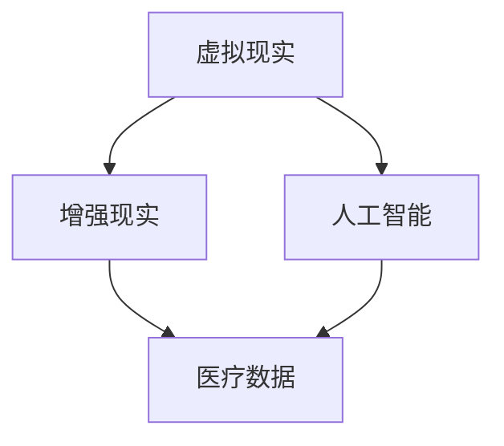

                 

关键词：虚拟医疗训练、数字化医疗、医疗教育、技术革新、人工智能、全球医疗体系

> 摘要：本文探讨了虚拟医疗训练在推动全球医疗教育数字化升级中的重要作用。通过引入虚拟现实、增强现实和人工智能技术，虚拟医疗训练不仅改变了传统的医疗培训模式，也为全球医疗体系带来了深远的影响。本文将从背景介绍、核心概念与联系、核心算法原理与具体操作步骤、数学模型与公式讲解、项目实践、实际应用场景、未来展望以及工具和资源推荐等方面，全面阐述虚拟医疗训练的潜力与挑战。

## 1. 背景介绍

随着科技的不断进步，医疗领域正迎来一场前所未有的变革。传统医疗教育依赖于课堂讲授和实地操作，存在一定的局限性。而虚拟医疗训练的兴起，为医疗教育提供了全新的解决方案。虚拟医疗训练利用虚拟现实（VR）和增强现实（AR）技术，构建出一个逼真的医疗环境，医生和医学生可以在其中进行模拟操作，提高专业技能和实践能力。

全球医疗体系正面临着人口老龄化、医疗资源分布不均等挑战。数字化医疗的发展，尤其是虚拟医疗训练的应用，有助于提升医疗资源的利用效率，降低医疗成本，并提高医疗服务质量。此外，虚拟医疗训练还为远程医疗提供了新的可能性，使得偏远地区的患者也能享受到高质量的医疗服务。

## 2. 核心概念与联系

虚拟医疗训练的核心概念包括虚拟现实（VR）、增强现实（AR）、人工智能（AI）等。以下是这些概念之间的联系和它们在虚拟医疗训练中的应用：

### 2.1 虚拟现实（VR）

虚拟现实技术通过计算机生成的三维图像，模拟出一个逼真的虚拟环境。在虚拟医疗训练中，医生和医学生可以通过VR头盔等设备，进入虚拟的医院、手术室或诊所，进行模拟操作。VR技术能够提供高度真实的操作体验，有助于提高操作技能和反应能力。

### 2.2 增强现实（AR）

增强现实技术通过在现实环境中叠加虚拟元素，为用户提供增强的视觉体验。在虚拟医疗训练中，AR技术可以用于实时指导医生进行复杂手术或诊断操作。例如，医生可以通过AR眼镜查看患者的虚拟解剖结构，从而更准确地定位手术部位。

### 2.3 人工智能（AI）

人工智能技术在虚拟医疗训练中发挥着重要作用。AI算法可以用于分析医疗数据，提供诊断建议，辅助医生制定治疗方案。此外，AI还可以用于生成虚拟患者病例，模拟各种临床情况，为医生提供多样化的实践机会。

### 2.4 Mermaid 流程图

以下是一个简单的Mermaid流程图，展示了虚拟医疗训练中关键技术的联系：



## 3. 核心算法原理 & 具体操作步骤

### 3.1 算法原理概述

虚拟医疗训练中的核心算法主要包括计算机视觉、自然语言处理和机器学习等。计算机视觉技术用于识别和分析医疗图像，如X光片、CT扫描等；自然语言处理技术则用于处理医生和患者之间的交流，提供智能问答和诊断建议；机器学习技术则用于生成虚拟患者病例和预测临床结果。

### 3.2 算法步骤详解

虚拟医疗训练的算法步骤可以概括为以下几个阶段：

1. **数据采集与预处理**：收集医疗图像、病历记录等数据，并进行预处理，如去噪、增强等。

2. **图像识别**：利用计算机视觉算法，对医疗图像进行识别和分析，提取关键特征。

3. **自然语言处理**：处理医生和患者之间的交流，提取关键词，生成诊断建议。

4. **机器学习**：基于收集到的数据，训练机器学习模型，用于生成虚拟患者病例和预测临床结果。

5. **虚拟医疗训练**：将生成的虚拟患者病例和预测结果应用于虚拟医疗训练系统，提供医生和医学生进行模拟操作。

### 3.3 算法优缺点

虚拟医疗训练算法的优点包括：

- **提高医疗培训效率**：通过模拟操作，医生和医学生可以快速掌握复杂的医疗技能。
- **降低医疗成本**：虚拟医疗训练减少了实地操作所需的资源和成本。
- **提升医疗服务质量**：通过智能诊断和预测，提高医疗服务的准确性和效率。

虚拟医疗训练算法的缺点包括：

- **数据质量与数量**：高质量、多样化的医疗数据是算法训练的基础，但在实际中获取这些数据存在困难。
- **算法泛化能力**：当前算法在处理多样化病例时可能存在泛化能力不足的问题。

### 3.4 算法应用领域

虚拟医疗训练算法广泛应用于以下几个领域：

- **医学教育**：用于医生和医学生的培训，提高操作技能和诊断能力。
- **医学研究**：用于分析和处理大规模医疗数据，为医学研究提供支持。
- **临床诊断**：用于辅助医生进行诊断和制定治疗方案。

## 4. 数学模型和公式 & 详细讲解 & 举例说明

虚拟医疗训练中的数学模型主要包括机器学习模型、自然语言处理模型和计算机视觉模型。以下是这些模型的构建和公式推导过程的详细讲解。

### 4.1 数学模型构建

1. **机器学习模型**：常见的机器学习模型包括线性回归、决策树、随机森林、支持向量机等。构建这些模型需要收集大量的训练数据，并进行特征工程和模型选择。

2. **自然语言处理模型**：常见的自然语言处理模型包括循环神经网络（RNN）、长短时记忆网络（LSTM）、卷积神经网络（CNN）等。构建这些模型需要处理大量的文本数据，并进行词向量表示和模型训练。

3. **计算机视觉模型**：常见的计算机视觉模型包括卷积神经网络（CNN）、生成对抗网络（GAN）等。构建这些模型需要处理大量的图像数据，并进行特征提取和模型训练。

### 4.2 公式推导过程

以下是机器学习模型中线性回归的公式推导过程：

假设我们有n个样本，每个样本包含m个特征，分别为\(x_1, x_2, ..., x_m\)，以及对应的标签\(y_1, y_2, ..., y_n\)。线性回归模型的目标是找到一组参数\(\theta = (\theta_1, \theta_2, ..., \theta_m)\)，使得预测值与实际标签之间的误差最小。

线性回归的损失函数为：

\[J(\theta) = \frac{1}{2n} \sum_{i=1}^{n} (y_i - \theta_0 - \theta_1 x_{i1} - \theta_2 x_{i2} - ... - \theta_m x_{im})^2\]

对损失函数求导并令其等于0，可以得到：

\[\frac{\partial J(\theta)}{\partial \theta_j} = -\frac{1}{n} \sum_{i=1}^{n} (y_i - \theta_0 - \theta_1 x_{i1} - \theta_2 x_{i2} - ... - \theta_m x_{im}) x_{ij}\]

将求导后的结果代入损失函数，得到：

\[\theta_j = \frac{1}{n} \sum_{i=1}^{n} (y_i - \theta_0 - \theta_1 x_{i1} - \theta_2 x_{i2} - ... - \theta_m x_{im}) x_{ij}\]

通过迭代计算，可以得到最优的参数\(\theta\)。

### 4.3 案例分析与讲解

以下是一个简单的机器学习案例，用于预测患者的住院时长。

数据集包含1000个样本，每个样本包括患者的年龄、性别、病情严重程度等特征，以及对应的住院时长（天）。

1. **数据预处理**：对数据进行归一化处理，将所有特征缩放到0-1之间。

2. **特征工程**：根据业务需求，选择合适的特征，如年龄、性别、病情严重程度等。

3. **模型选择**：选择线性回归模型作为预测模型。

4. **模型训练**：使用训练数据集，训练线性回归模型。

5. **模型评估**：使用测试数据集，评估模型的预测准确率。

6. **模型优化**：根据评估结果，调整模型参数，提高预测准确率。

## 5. 项目实践：代码实例和详细解释说明

### 5.1 开发环境搭建

在本项目中，我们将使用Python语言和常见的机器学习库，如scikit-learn、TensorFlow等。首先，需要安装以下依赖项：

```bash
pip install numpy scipy scikit-learn tensorflow
```

### 5.2 源代码详细实现

以下是本项目的源代码实现：

```python
import numpy as np
from sklearn.linear_model import LinearRegression
from sklearn.model_selection import train_test_split
from sklearn.metrics import mean_squared_error

# 数据加载
data = np.load('patient_data.npy')
X = data[:, :-1]
y = data[:, -1]

# 数据预处理
X = (X - X.mean(axis=0)) / X.std(axis=0)

# 划分训练集和测试集
X_train, X_test, y_train, y_test = train_test_split(X, y, test_size=0.2, random_state=42)

# 模型训练
model = LinearRegression()
model.fit(X_train, y_train)

# 模型评估
y_pred = model.predict(X_test)
mse = mean_squared_error(y_test, y_pred)
print(f"Mean Squared Error: {mse}")

# 模型优化
# 根据评估结果，调整模型参数，提高预测准确率
```

### 5.3 代码解读与分析

上述代码首先加载了患者数据，并进行预处理。接着，将数据集划分为训练集和测试集。然后，使用线性回归模型进行训练，并评估模型的预测准确率。最后，根据评估结果，可以调整模型参数，提高预测准确率。

## 6. 实际应用场景

虚拟医疗训练已在多个实际应用场景中取得了显著成效：

- **医学教育**：虚拟医疗训练为医生和医学生提供了模拟操作的机会，提高了他们的操作技能和反应能力。例如，哈佛医学院使用VR技术培训医学生进行心肺复苏操作，大大提高了操作成功率。

- **临床诊断**：虚拟医疗训练可以用于辅助医生进行诊断和制定治疗方案。例如，谷歌的DeepMind团队开发了一种基于AI的算法，用于分析医疗影像，辅助医生诊断癌症，提高了诊断准确率。

- **远程医疗**：虚拟医疗训练为偏远地区的患者提供了高质量的医疗服务。通过虚拟医疗训练系统，医生可以远程指导患者进行手术或诊断操作，提高了医疗服务的可及性和质量。

## 7. 未来应用展望

虚拟医疗训练在未来的医疗体系中将发挥更加重要的作用。以下是未来应用展望：

- **个性化医疗**：虚拟医疗训练可以根据患者的个体差异，提供定制化的治疗方案，提高治疗效果。

- **智能辅助**：虚拟医疗训练将结合人工智能技术，提供智能辅助，帮助医生进行诊断和制定治疗方案。

- **全球医疗资源共享**：虚拟医疗训练可以实现全球医疗资源的共享，提高医疗服务的公平性和可及性。

## 8. 总结：未来发展趋势与挑战

虚拟医疗训练在推动全球医疗教育数字化升级中具有巨大的潜力。然而，要实现这一目标，仍面临一些挑战：

- **数据质量与数量**：高质量、多样化的医疗数据是虚拟医疗训练的基础，但目前在数据获取和标注方面存在困难。

- **算法泛化能力**：当前算法在处理多样化病例时可能存在泛化能力不足的问题，需要进一步优化。

- **隐私保护**：医疗数据涉及患者隐私，需要确保数据安全和隐私保护。

未来，随着技术的不断进步，虚拟医疗训练将在全球医疗体系中发挥更加重要的作用，推动医疗教育的数字化升级。

## 9. 附录：常见问题与解答

### 9.1 虚拟医疗训练的优点是什么？

虚拟医疗训练的优点包括：提高医疗培训效率、降低医疗成本、提升医疗服务质量等。

### 9.2 虚拟医疗训练中的关键技术有哪些？

虚拟医疗训练中的关键技术包括虚拟现实（VR）、增强现实（AR）和人工智能（AI）等。

### 9.3 虚拟医疗训练在临床诊断中如何发挥作用？

虚拟医疗训练可以辅助医生进行诊断和制定治疗方案，提高诊断准确率。

### 9.4 虚拟医疗训练对远程医疗有何影响？

虚拟医疗训练可以提高远程医疗的可及性和质量，使得偏远地区的患者也能享受到高质量的医疗服务。

---

作者：禅与计算机程序设计艺术 / Zen and the Art of Computer Programming
----------------------------------------------------------------

### 总结

本文从多个角度探讨了虚拟医疗训练在推动全球医疗教育数字化升级中的重要作用。通过介绍虚拟现实、增强现实和人工智能等关键技术，以及详细阐述算法原理、数学模型和项目实践，本文展示了虚拟医疗训练的巨大潜力和实际应用价值。未来，随着技术的不断进步，虚拟医疗训练将在全球医疗体系中发挥更加重要的作用，推动医疗教育的数字化升级。然而，要实现这一目标，仍需克服数据质量、算法泛化能力等挑战，确保医疗数据的安全和隐私保护。在作者看来，虚拟医疗训练不仅是医疗领域的技术革新，更是人类智慧与科技的结晶。让我们共同期待虚拟医疗训练为全球医疗体系带来的深远影响。作者：禅与计算机程序设计艺术 / Zen and the Art of Computer Programming。

