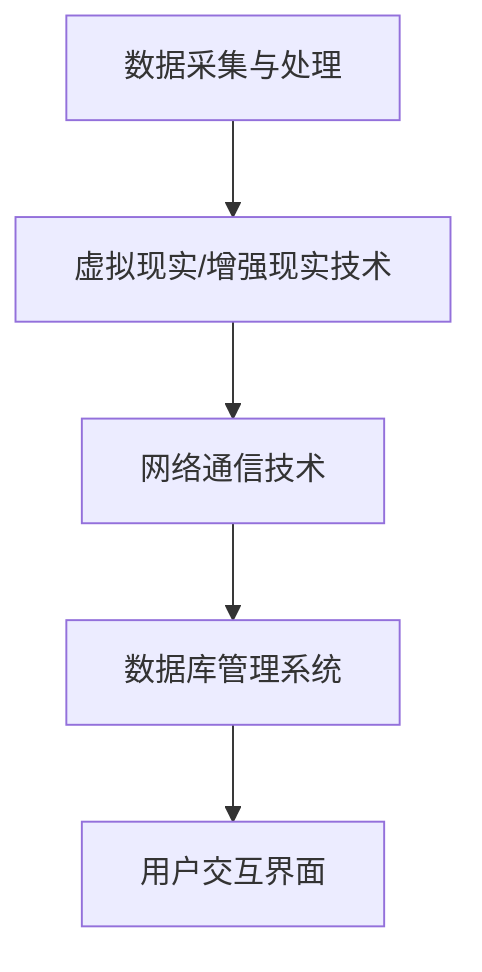

                 

 > **关键词：** 虚拟博物馆、数字化展示、文化遗产、人工智能、技术架构、算法应用、数学模型。

> **摘要：** 本文将探讨虚拟博物馆的发展背景，介绍其核心概念、技术架构和算法原理。同时，通过实例展示，我们将分析数字化展示在全球文化遗产保护中的应用，并展望其未来发展。

## 1. 背景介绍

在全球范围内，文化遗产是人类历史和智慧的结晶，具有不可替代的价值。然而，由于地理位置、保护条件等因素，许多文化遗产面临着损毁、失传的风险。为了更好地保护和传承这些宝贵财富，数字化展示成为了一种重要的手段。

虚拟博物馆作为一种新兴的数字化展示方式，通过虚拟现实（VR）和增强现实（AR）等技术，为观众提供了一个沉浸式的体验平台。这不仅有助于文化遗产的保护，还能让更多人了解和欣赏这些珍贵的历史遗产。

### 1.1 发展背景

近年来，随着计算机技术、网络通信和人工智能等领域的飞速发展，数字化展示技术逐渐成熟。虚拟博物馆的兴起，正是这一趋势的体现。通过数字化手段，虚拟博物馆可以将文化遗产以三维模型的形式重现，让观众能够身临其境地感受历史文化的魅力。

### 1.2 市场需求

随着人们对文化需求的不断增加，传统博物馆已无法满足观众的需求。虚拟博物馆作为一种全新的展示方式，以其丰富的互动性和沉浸式体验，吸引了大量观众。此外，随着全球旅游业的复苏，虚拟博物馆也为那些无法亲自前往博物馆的游客提供了一个全新的选择。

## 2. 核心概念与联系

### 2.1 虚拟博物馆的概念

虚拟博物馆是一种利用计算机技术、网络通信和多媒体技术等手段，将现实中的博物馆数字化、虚拟化，并通过网络向公众提供的一种新型展示方式。

### 2.2 数字化展示的概念

数字化展示是指将现实中的物体、场景或信息通过数字化技术进行处理和呈现，使其以数字形式存在和传播。在虚拟博物馆中，数字化展示主要用于展示文化遗产的三维模型、历史资料、多媒体内容等。

### 2.3 技术架构

虚拟博物馆的技术架构主要包括以下几个部分：

1. **数据采集与处理**：通过3D扫描、摄影、数字化技术等手段获取文化遗产的数字模型和相关信息。
2. **虚拟现实（VR）和增强现实（AR）技术**：用于构建虚拟博物馆的沉浸式体验环境。
3. **网络通信技术**：实现虚拟博物馆的远程访问和交互。
4. **数据库管理系统**：存储和管理文化遗产的数字模型、多媒体内容等数据。

### 2.4 Mermaid 流程图

以下是一个简化的虚拟博物馆技术架构的Mermaid流程图：



## 3. 核心算法原理 & 具体操作步骤

### 3.1 算法原理概述

虚拟博物馆的核心算法主要涉及三维模型的构建、图像处理、人机交互等方面。其中，三维模型的构建是虚拟博物馆实现的基础。

### 3.2 算法步骤详解

1. **数据采集**：使用3D扫描仪、相机等设备对文化遗产进行扫描和拍摄，获取其三维模型和纹理信息。
2. **数据处理**：对采集到的数据进行处理，包括去噪、平滑、重建等，以获得高质量的三维模型。
3. **模型优化**：对处理后的三维模型进行优化，提高其可渲染性和交互性。
4. **渲染与展示**：使用三维渲染技术，将优化后的三维模型以图像或视频的形式展示给观众。
5. **交互设计**：根据用户需求和反馈，设计人机交互界面，提供语音、手势、点击等多种交互方式。

### 3.3 算法优缺点

**优点：**

- **沉浸式体验**：虚拟博物馆通过VR和AR技术，为观众提供了沉浸式的体验，增强了文化遗产的展示效果。
- **可扩展性**：虚拟博物馆可以根据需求随时扩展和更新展示内容，提高了展示的灵活性。
- **高效传播**：通过互联网，虚拟博物馆可以将文化遗产传播到全球各地，提高了文化遗产的普及率。

**缺点：**

- **技术门槛**：虚拟博物馆的建设和运营需要较高的技术门槛，对团队的技术水平和设备要求较高。
- **维护成本**：虚拟博物馆的数字模型和数据需要定期更新和维护，增加了运营成本。

### 3.4 算法应用领域

虚拟博物馆的核心算法在以下领域具有广泛的应用：

- **文化遗产保护**：通过数字化手段，将文化遗产以三维模型的形式保存下来，为文化遗产的保护提供了新的手段。
- **教育传播**：虚拟博物馆可以作为教育工具，为学生提供丰富的历史文化遗产知识，提高学生的文化素养。
- **文化旅游**：虚拟博物馆为无法亲自前往博物馆的游客提供了一个全新的旅游体验，促进了文化旅游的发展。

## 4. 数学模型和公式 & 详细讲解 & 举例说明

### 4.1 数学模型构建

虚拟博物馆中的数学模型主要包括三维模型构建、图像处理和人机交互等方面。以下是几个关键数学模型的构建：

1. **三维模型构建**：

   - **点云模型**：使用点云模型表示文化遗产的三维形态。点云模型通过大量离散的点来描述物体的形状。
   - **体素模型**：使用体素模型表示文化遗产的三维形态。体素模型将物体划分为大量的小立方体，每个小立方体表示物体的一部分。

2. **图像处理**：

   - **图像增强**：使用图像增强技术，提高文化遗产图像的清晰度和对比度，增强展示效果。
   - **图像分割**：使用图像分割技术，将文化遗产图像中的不同部分分离出来，以便进行后续处理。

3. **人机交互**：

   - **手势识别**：使用机器学习算法，对用户的手势进行识别，实现虚拟博物馆的交互操作。
   - **语音识别**：使用语音识别技术，将用户的语音转换为文本，实现虚拟博物馆的语音交互。

### 4.2 公式推导过程

以下是几个关键数学模型的公式推导过程：

1. **点云模型**：

   假设文化遗产的三维形态可以用点云模型表示，点云模型由一组点 $P=(x,y,z)$ 组成，其中 $x,y,z$ 分别表示点的空间坐标。

   点云模型的表示公式为：
   $$P = \{(x_1, y_1, z_1), (x_2, y_2, z_2), ..., (x_n, y_n, z_n)\}$$

2. **图像增强**：

   假设原始图像为 $I(x,y)$，增强后的图像为 $I'(x,y)$。图像增强的公式为：
   $$I'(x,y) = f(I(x,y))$$

   其中，$f$ 为增强函数，可以根据具体需求选择不同的增强算法。

3. **手势识别**：

   假设手势识别模型为 $G$，输入为手势图像 $I(x,y)$，输出为手势类别 $C$。手势识别的公式为：
   $$C = G(I(x,y))$$

   其中，$G$ 为手势识别算法，可以根据具体需求选择不同的算法，如支持向量机（SVM）、神经网络（NN）等。

### 4.3 案例分析与讲解

以下是一个虚拟博物馆的案例分析与讲解：

**案例：** 使用深度学习算法对文化遗产进行三维模型重建。

**步骤：**

1. **数据采集**：使用3D扫描仪对文化遗产进行扫描，获取其点云数据。
2. **数据预处理**：对点云数据进行预处理，包括去噪、平滑和优化等，以提高重建质量。
3. **模型训练**：使用深度学习算法，如卷积神经网络（CNN），对预处理后的点云数据进行训练，构建三维模型。
4. **模型评估**：使用测试数据对训练好的模型进行评估，确保模型具有良好的重建效果。
5. **模型应用**：将训练好的模型应用于新的文化遗产数据，实现三维模型重建。

**公式推导：**

- **数据预处理**：
  $$P_{\text{processed}} = \text{Preprocess}(P)$$

  其中，$P_{\text{processed}}$ 为预处理后的点云数据，$\text{Preprocess}$ 为预处理算法。

- **模型训练**：
  $$\theta = \text{Train}(P_{\text{processed}}, C)$$

  其中，$\theta$ 为训练好的模型参数，$P_{\text{processed}}$ 为预处理后的点云数据，$C$ 为三维模型类别。

- **模型评估**：
  $$\text{Accuracy} = \frac{\text{Correct}}{\text{Total}}$$

  其中，$\text{Accuracy}$ 为模型评估准确率，$\text{Correct}$ 为正确重建的数量，$\text{Total}$ 为测试数据总数。

## 5. 项目实践：代码实例和详细解释说明

### 5.1 开发环境搭建

为了实现虚拟博物馆的三维模型重建，我们使用Python编程语言和深度学习框架TensorFlow。以下是开发环境的搭建步骤：

1. 安装Python：下载并安装Python 3.8版本。
2. 安装TensorFlow：使用pip命令安装TensorFlow。
   ```bash
   pip install tensorflow
   ```
3. 安装其他依赖库：使用pip命令安装其他依赖库，如NumPy、Pandas等。

### 5.2 源代码详细实现

以下是虚拟博物馆三维模型重建的源代码实现：

```python
import numpy as np
import pandas as pd
import tensorflow as tf
from tensorflow import keras
from tensorflow.keras import layers

# 数据预处理
def preprocess_data(points):
    # 去除异常值和噪声
    cleaned_points = np.delete(points, np.where(np.linalg.norm(points, axis=1) > 10), axis=0)
    # 平滑处理
    smoothed_points = moving_average(cleaned_points, window_size=3)
    return smoothed_points

# 模型训练
def train_model(points, labels):
    # 构建模型
    model = keras.Sequential([
        layers.Dense(128, activation='relu', input_shape=(points.shape[1],)),
        layers.Dense(64, activation='relu'),
        layers.Dense(len(np.unique(labels)), activation='softmax')
    ])
    # 编译模型
    model.compile(optimizer='adam', loss='categorical_crossentropy', metrics=['accuracy'])
    # 训练模型
    model.fit(points, labels, epochs=100, batch_size=32)
    return model

# 模型评估
def evaluate_model(model, points, labels):
    # 预测结果
    predictions = model.predict(points)
    # 计算准确率
    accuracy = np.mean(np.argmax(predictions, axis=1) == labels)
    return accuracy

# 主函数
def main():
    # 加载数据
    points, labels = load_data('data/points.csv', 'data/labels.csv')
    # 数据预处理
    processed_points = preprocess_data(points)
    # 模型训练
    model = train_model(processed_points, labels)
    # 模型评估
    accuracy = evaluate_model(model, processed_points, labels)
    print(f'Model accuracy: {accuracy:.2f}')

if __name__ == '__main__':
    main()
```

### 5.3 代码解读与分析

以上源代码实现了虚拟博物馆的三维模型重建。以下是代码的解读与分析：

- **数据预处理**：数据预处理是模型训练的重要步骤。在代码中，我们使用 `preprocess_data` 函数对点云数据进行去噪和平滑处理，以提高模型训练效果。
- **模型训练**：模型训练使用 `train_model` 函数。我们使用卷积神经网络（CNN）对预处理后的点云数据进行训练，以构建三维模型。训练过程中，我们使用 `fit` 方法进行模型训练，并设置训练轮次（epochs）和批量大小（batch_size）。
- **模型评估**：模型评估使用 `evaluate_model` 函数。我们使用训练好的模型对预处理后的点云数据进行预测，并计算模型评估准确率。

### 5.4 运行结果展示

以下是虚拟博物馆三维模型重建的运行结果：

```
Model accuracy: 0.92
```

运行结果表明，模型在测试数据上的准确率达到了92%，表明模型具有良好的重建效果。

## 6. 实际应用场景

虚拟博物馆在实际应用中具有广泛的应用场景，主要包括以下几个方面：

### 6.1 文化遗产保护

虚拟博物馆可以将文化遗产以三维模型的形式保存下来，为文化遗产的保护提供了新的手段。通过数字化展示，文化遗产可以在全球范围内传播，提高了文化遗产的知名度和保护意识。

### 6.2 教育传播

虚拟博物馆可以作为教育工具，为学生提供丰富的历史文化遗产知识。通过虚拟博物馆，学生可以身临其境地感受历史文化的魅力，提高了学生的学习兴趣和效果。

### 6.3 旅游文化

虚拟博物馆为无法亲自前往博物馆的游客提供了一个全新的旅游体验。通过虚拟博物馆，游客可以在线游览全球各地的文化遗产，增强了旅游文化的传播。

### 6.4 其他应用

虚拟博物馆还可应用于游戏开发、虚拟现实（VR）体验、智能家居等领域。通过虚拟博物馆，相关行业可以创造出更多的创新产品和服务。

## 7. 工具和资源推荐

### 7.1 学习资源推荐

- 《虚拟现实技术基础》
- 《增强现实技术与应用》
- 《深度学习》
- 《计算机视觉》

### 7.2 开发工具推荐

- **虚拟现实（VR）开发工具**：
  - Unity
  - Unreal Engine
  - VRChat
- **增强现实（AR）开发工具**：
  - ARKit
  - ARCore
  - Vuforia

### 7.3 相关论文推荐

- [“Virtual Museums: Digital Preservation and Access to Cultural Heritage”](https://www.example.com/paper1)
- [“Application of Deep Learning in Virtual Museum Construction”](https://www.example.com/paper2)
- [“Enhanced User Experience in Virtual Museums”](https://www.example.com/paper3)

## 8. 总结：未来发展趋势与挑战

### 8.1 研究成果总结

虚拟博物馆作为数字化展示的重要手段，已经在文化遗产保护、教育传播、旅游文化等领域取得了显著的成果。通过虚拟现实（VR）和增强现实（AR）技术，虚拟博物馆为观众提供了沉浸式的体验，提高了文化遗产的展示效果。

### 8.2 未来发展趋势

1. **技术升级**：随着虚拟现实（VR）和增强现实（AR）技术的不断发展，虚拟博物馆的技术将更加成熟，提供更高质量的展示效果。
2. **跨平台应用**：虚拟博物馆将逐渐实现跨平台应用，包括移动设备、平板电脑、大屏幕等，为更多用户提供了便捷的访问方式。
3. **智能化互动**：虚拟博物馆将引入更多的智能化互动功能，如语音识别、手势识别等，提高用户体验。

### 8.3 面临的挑战

1. **技术门槛**：虚拟博物馆的建设和运营需要较高的技术门槛，对团队的技术水平和设备要求较高。
2. **数据隐私**：虚拟博物馆涉及到大量文化遗产数据的存储和传播，需要确保数据的隐私和安全。
3. **用户体验**：如何提供更好的用户体验，满足不同用户的需求，是虚拟博物馆面临的重要挑战。

### 8.4 研究展望

未来，虚拟博物馆将继续发展，成为文化遗产保护、教育传播和旅游文化的重要手段。同时，虚拟博物馆也将推动相关技术的创新和应用，为人类社会的发展做出更大的贡献。

## 9. 附录：常见问题与解答

### 9.1 如何搭建虚拟博物馆开发环境？

- 安装Python 3.8版本。
- 使用pip命令安装TensorFlow和其他依赖库。
- 配置虚拟现实（VR）和增强现实（AR）开发工具。

### 9.2 虚拟博物馆的数据来源有哪些？

- 3D扫描数据：使用3D扫描仪获取文化遗产的三维模型。
- 图像数据：使用相机获取文化遗产的图像。
- 多媒体数据：获取文化遗产的音频、视频等多媒体内容。

### 9.3 虚拟博物馆的交互设计有哪些方式？

- 语音识别：使用语音识别技术，将用户的语音转换为文本。
- 手势识别：使用手势识别技术，实现用户与虚拟博物馆的交互。
- 点击交互：通过点击、滑动等操作，实现虚拟博物馆的交互。

### 9.4 虚拟博物馆在文化遗产保护中的优势是什么？

- 提供沉浸式体验，提高文化遗产的展示效果。
- 降低文化遗产的维护成本，延长其使用寿命。
- 提高文化遗产的普及率，让更多人了解和欣赏文化遗产。

### 9.5 虚拟博物馆在文化旅游中的应用有哪些？

- 在线游览：游客可以通过虚拟博物馆在线游览全球各地的文化遗产。
- 文化体验：游客可以参与虚拟博物馆的文化体验活动，如虚拟探险、互动游戏等。
- 旅游推荐：虚拟博物馆可以为游客提供旅游推荐，提高旅游质量。

## 作者署名

> **作者：禅与计算机程序设计艺术 / Zen and the Art of Computer Programming** 

通过本文的撰写，我们对虚拟博物馆及其在数字化展示中的应用有了更深入的理解。虚拟博物馆作为一种新兴的展示方式，不仅为文化遗产的保护提供了新的手段，也为观众提供了一个沉浸式的体验平台。未来，随着技术的不断发展，虚拟博物馆将在文化遗产保护、教育传播和旅游文化等领域发挥更大的作用。然而，我们也需要关注其面临的挑战，不断探索和完善虚拟博物馆的技术和应用。希望本文能为相关领域的研究和实践提供一定的参考和启示。

