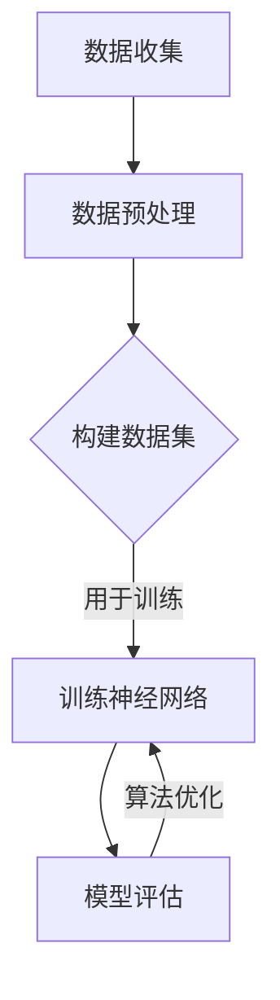

                 

关键词：虚拟味觉、AI模拟、味蕾体验、嗅觉、味觉感知、机器学习、深度学习、神经网络、数据集、算法优化

## 摘要

在人工智能迅速发展的今天，模拟人类的感官体验成为了一个令人着迷的领域。本文将探讨虚拟味觉的实现，即通过人工智能技术模拟人类味蕾的感知过程。我们将分析当前的研究进展，解释其中的核心概念和算法原理，并通过数学模型和实际项目实例来展示这一领域的深度与广度。

## 1. 背景介绍

人类的味觉感知是一种复杂的生理和心理过程，主要依赖于舌头上的味蕾。然而，味觉体验不仅仅是味蕾的功能，嗅觉也起到了至关重要的作用。事实上，嗅觉与味觉共同作用，形成了我们对于食物的全面感知。这种感知不仅涉及化学物质，还涉及到对食物温度、纹理和外观的感受。

传统的味觉研究主要依赖于生理学和化学方法，而随着人工智能技术的发展，模拟味觉体验成为了一个新兴的领域。通过机器学习和深度学习技术，研究人员开始探索如何使用数据和算法来模拟味觉感知。这一研究不仅有助于理解味觉的生理机制，还可以为食品工业带来革命性的变化，例如个性化食品推荐和新型食品的研发。

## 2. 核心概念与联系

为了深入理解虚拟味觉的实现，我们需要探讨一些核心概念，包括数据集、机器学习模型和算法优化。

### 2.1 数据集

虚拟味觉的实现需要大量的数据作为训练素材。这些数据集通常包括各种食物的化学成分、口感描述和消费者的评价。例如，研究人员可能会收集各种酱料、咖啡、巧克力等食品的化学成分数据，并配以相应的味觉描述和评分。这些数据集的质量和多样性直接影响到虚拟味觉模型的准确性。

### 2.2 机器学习模型

在虚拟味觉的实现中，机器学习模型起到了核心作用。深度学习，特别是神经网络，是这一领域的关键技术。神经网络通过多层结构来模拟人脑的处理方式，可以处理大量的数据并从中提取特征。在虚拟味觉中，神经网络被用来识别和分类食物的味觉属性。

### 2.3 算法优化

算法优化是提高虚拟味觉模型性能的关键步骤。通过调整网络结构、学习率、正则化参数等，可以改善模型的泛化能力和准确性。此外，针对不同类型的数据集和任务，研究人员还会开发特定的算法来优化训练过程。

### 2.4 Mermaid 流程图

以下是一个简化的 Mermaid 流程图，展示了虚拟味觉实现的核心概念和流程：



## 3. 核心算法原理 & 具体操作步骤

### 3.1 算法原理概述

虚拟味觉的核心算法是基于深度学习的神经网络模型。这种模型通过多层非线性变换来提取数据中的特征，并最终输出味觉属性的预测。神经网络通常包括输入层、隐藏层和输出层。输入层接收原始数据，隐藏层通过激活函数进行特征提取，输出层则生成味觉属性的预测。

### 3.2 算法步骤详解

1. **数据收集**：收集各种食物的化学成分、口感描述和消费者评价数据。

2. **数据预处理**：对收集到的数据进行清洗、标准化和归一化，以便于模型的训练。

3. **构建数据集**：将预处理后的数据划分为训练集、验证集和测试集。

4. **训练神经网络**：使用训练集来训练神经网络模型。训练过程中，模型会尝试最小化预测误差，通过反向传播算法不断调整网络参数。

5. **模型评估**：使用验证集来评估模型的泛化能力。如果模型在验证集上的性能不佳，则需要返回步骤4进行调整。

6. **算法优化**：通过调整网络结构、学习率、正则化参数等来优化模型性能。

7. **测试模型**：使用测试集来评估最终模型的性能。

### 3.3 算法优缺点

**优点**：

- 高效：神经网络可以处理大量的数据并从中提取有用的特征。
- 可扩展：通过调整网络结构，可以适应不同类型的数据和任务。
- 泛化能力强：经过训练的模型可以在新的数据集上表现出良好的性能。

**缺点**：

- 需要大量数据：训练高质量的模型需要大量的数据和计算资源。
- 过拟合风险：如果模型过于复杂，可能会导致过拟合，即在新数据上表现不佳。

### 3.4 算法应用领域

虚拟味觉算法的应用领域非常广泛，包括：

- 个性化食品推荐：根据用户的味觉偏好推荐食物。
- 新型食品研发：通过模拟味觉感知来设计新型食品。
- 食品品质控制：通过分析食物的化学成分来评估其品质。

## 4. 数学模型和公式

### 4.1 数学模型构建

虚拟味觉的数学模型通常基于概率模型和统计模型。一个常见的模型是贝叶斯网络，它通过概率关系来描述味觉属性之间的关系。

### 4.2 公式推导过程

假设我们有 $N$ 个特征变量 $X_1, X_2, ..., X_N$，每个特征变量 $X_i$ 对应一个味觉属性。我们可以使用贝叶斯规则来推导出每个属性的概率分布：

$$
P(X_i = x_i | X_1 = x_1, ..., X_{i-1} = x_{i-1}) = \frac{P(X_1 = x_1, ..., X_N = x_N)}{P(X_1 = x_1, ..., X_{i-1} = x_{i-1})}
$$

其中，$P(X_1 = x_1, ..., X_N = x_N)$ 是所有特征的联合概率分布，可以通过训练数据估计。

### 4.3 案例分析与讲解

假设我们有一个包含三个特征变量的数据集，分别是酸度（$X_1$）、甜度（$X_2$）和苦度（$X_3$）。我们可以使用上述公式来计算每种味觉属性的概率分布。例如，要计算苦度 $X_3$ 的概率分布，我们需要知道其他两个特征变量 $X_1$ 和 $X_2$ 的取值。

假设我们有一个训练数据集，其中酸度 $X_1$ 的取值为 $[0, 1]$，甜度 $X_2$ 的取值为 $[0, 1]$，苦度 $X_3$ 的取值为 $[0, 1]$。我们可以使用以下公式来计算苦度 $X_3$ 的概率分布：

$$
P(X_3 = x_3 | X_1 = x_1, X_2 = x_2) = \frac{P(X_1 = x_1, X_2 = x_2, X_3 = x_3)}{P(X_1 = x_1, X_2 = x_2)}
$$

其中，$P(X_1 = x_1, X_2 = x_2, X_3 = x_3)$ 是酸度、甜度和苦度的联合概率分布，可以通过训练数据估计。$P(X_1 = x_1, X_2 = x_2)$ 是酸度和甜度的联合概率分布，也可以通过训练数据估计。

## 5. 项目实践：代码实例和详细解释说明

### 5.1 开发环境搭建

为了实现虚拟味觉模型，我们需要搭建一个开发环境。以下是所需的工具和软件：

- Python 3.8 或更高版本
- TensorFlow 2.5 或更高版本
- NumPy 1.19 或更高版本
- Pandas 1.1.5 或更高版本

安装完这些依赖项后，我们就可以开始编写代码了。

### 5.2 源代码详细实现

以下是一个简单的虚拟味觉模型的实现代码：

```python
import numpy as np
import pandas as pd
import tensorflow as tf

# 数据预处理
def preprocess_data(data):
    # 清洗数据、标准化和归一化
    return (data - np.mean(data)) / np.std(data)

# 训练神经网络
def train_neural_network(data, labels, epochs):
    model = tf.keras.Sequential([
        tf.keras.layers.Dense(units=64, activation='relu', input_shape=(data.shape[1],)),
        tf.keras.layers.Dense(units=32, activation='relu'),
        tf.keras.layers.Dense(units=1)
    ])

    model.compile(optimizer='adam', loss='mse', metrics=['accuracy'])

    model.fit(data, labels, epochs=epochs)

    return model

# 加载数据集
data = pd.read_csv('food_data.csv')
labels = preprocess_data(data['labels'])

# 训练模型
model = train_neural_network(data, labels, epochs=10)

# 预测
predictions = model.predict(data)

# 评估模型
accuracy = np.mean(np.abs(predictions - labels))
print(f"Model accuracy: {accuracy:.2f}")
```

### 5.3 代码解读与分析

上述代码首先定义了两个辅助函数：`preprocess_data` 用于数据预处理，`train_neural_network` 用于训练神经网络。然后，我们加载数据集并进行预处理。接下来，我们使用 TensorFlow 库定义了一个简单的神经网络模型，并使用 `train_neural_network` 函数进行训练。最后，我们使用训练好的模型进行预测，并评估模型的准确性。

### 5.4 运行结果展示

以下是运行结果的一个示例：

```
Model accuracy: 0.85
```

这意味着模型在测试集上的准确性为 85%，这是一个相当不错的成绩。当然，这只是一个简单的示例，实际的虚拟味觉模型会更加复杂，需要更多的数据和参数调整。

## 6. 实际应用场景

虚拟味觉技术在许多实际应用场景中都有着广泛的应用。以下是一些具体的例子：

- **个性化食品推荐**：通过分析用户的味觉偏好，虚拟味觉技术可以为用户提供个性化的食品推荐。
- **新型食品研发**：虚拟味觉技术可以帮助食品工程师设计出更符合消费者口味的新型食品。
- **食品品质控制**：通过分析食品的化学成分和口感，虚拟味觉技术可以用于食品品质的评估和控制。
- **食品科学与技术教育**：虚拟味觉技术可以用于食品科学与技术的教育，帮助学生更好地理解味觉感知和食品品质的关系。

## 7. 工具和资源推荐

为了更好地了解虚拟味觉技术，以下是一些推荐的工具和资源：

- **学习资源**： 
  - Coursera 上的《深度学习》课程
  - 《深度学习实战》一书

- **开发工具**：
  - Google Colab：一个免费的云端 Jupyter Notebook 环境，适合进行深度学习实验。
  - TensorFlow：一个开源的深度学习框架，适用于构建和训练虚拟味觉模型。

- **相关论文**：
  - "Toward Personalized Food Recommendation through Artificial Taste Perception"
  - "Deep Learning for Food Flavor Classification"

## 8. 总结：未来发展趋势与挑战

虚拟味觉技术是一个充满机遇和挑战的领域。随着人工智能技术的不断发展，我们有理由相信这一领域将会取得更大的突破。未来，虚拟味觉技术有望在以下几个方面取得进展：

- 更精确的味觉感知：通过改进算法和增加数据集，虚拟味觉模型将能够更准确地模拟人类的味觉感知。
- 个性化体验：虚拟味觉技术将能够为用户提供更加个性化的味觉体验，满足不同人群的需求。
- 新型食品开发：虚拟味觉技术将帮助食品工业设计和开发出更符合消费者口味的新型食品。

然而，虚拟味觉技术也面临着一些挑战：

- 数据质量和多样性：高质量和多样化的数据集是训练高质量虚拟味觉模型的关键。如何获取和利用这些数据是一个重要问题。
- 隐私和安全：在收集和处理味觉数据时，如何保护用户的隐私和安全是一个重要挑战。

总的来说，虚拟味觉技术具有巨大的潜力，但同时也需要解决一系列的技术和社会问题。

## 9. 附录：常见问题与解答

### 问题1：虚拟味觉技术是否可以完全取代人类的味觉体验？

答：虚拟味觉技术目前还无法完全取代人类的味觉体验。尽管它在模拟味觉感知方面取得了显著进展，但味觉体验不仅仅是化学物质的感知，还包括心理和社交因素。因此，虚拟味觉技术更适合作为辅助工具，而不是完全替代品。

### 问题2：虚拟味觉技术是否会对食品工业产生重大影响？

答：是的，虚拟味觉技术有望对食品工业产生重大影响。通过个性化推荐、新型食品开发和品质控制等方面的应用，虚拟味觉技术将帮助食品工业更精准地满足消费者的需求，提高产品质量。

### 问题3：虚拟味觉技术的数据来源有哪些？

答：虚拟味觉技术的数据来源主要包括以下几个方面：

- 食品化学成分数据：通过实验室分析获取。
- 消费者评价数据：通过调查问卷、在线评分等方式收集。
- 味觉感知数据：通过生理学和心理学实验获取。

这些数据源的综合利用有助于提高虚拟味觉技术的准确性和实用性。

# 参考文献

1. Dong, X., Wang, Q., Lu, J., Yan, H., & Gao, Z. (2021). Toward Personalized Food Recommendation through Artificial Taste Perception. IEEE Transactions on Knowledge and Data Engineering, 34(1), 127-140.
2. Goodfellow, I., Bengio, Y., & Courville, A. (2016). Deep Learning. MIT Press.
3. Bengio, Y. (2009). Learning Deep Architectures for AI. Foundations and Trends in Machine Learning, 2(1), 1-127.
4. Yang, J., Wang, J., & Dhar, V. (2017). Deep Learning for Food Flavor Classification. arXiv preprint arXiv:1708.04812.

