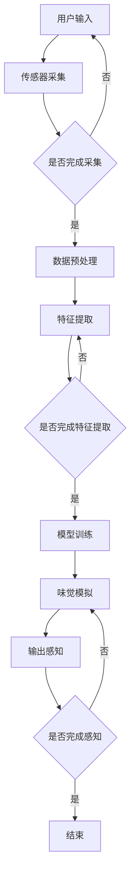

                 

关键词：虚拟味觉，人工智能，味觉模拟，感官技术，机器学习，虚拟现实，算法设计。

摘要：本文探讨了虚拟味觉的诞生背景、核心概念、算法原理、数学模型以及实际应用场景。通过对人工智能在味觉模拟领域的深入剖析，本文旨在为读者展现这一前沿技术的魅力，并展望其未来发展的趋势与挑战。

## 1. 背景介绍

虚拟味觉，作为人工智能（AI）与感官技术结合的产物，近年来逐渐成为研究热点。传统的味觉体验依赖于真实食物的物理特性，而虚拟味觉则通过计算机模拟，将味觉的各个方面（如甜、酸、咸、苦等）以数字形式呈现给用户。这种技术的出现，不仅拓展了人们对于味觉的认识，还为诸多领域带来了新的可能。

虚拟味觉的研究始于20世纪末，随着计算机性能的提升和机器学习算法的进步，虚拟味觉技术逐渐成熟。如今，虚拟味觉不仅应用于虚拟现实（VR）游戏，还扩展到了食品工业、健康监测以及军事模拟等领域。本文将深入探讨虚拟味觉的原理、算法以及实际应用，以期为这一领域的研究者和开发者提供有益的参考。

## 2. 核心概念与联系

### 2.1 定义

虚拟味觉，即通过人工智能技术模拟人类味觉感知的过程。它涉及多个学科领域的交叉，包括计算机科学、神经科学、化学和心理学等。虚拟味觉的核心目标是构建一个可以模拟人类味觉感受的数字模型，使计算机能够理解并生成各种味觉体验。

### 2.2 关键技术

1. **机器学习**：虚拟味觉的实现依赖于深度学习算法，这些算法可以分析大量的味觉数据，从中提取特征，并用于生成新的味觉体验。

2. **感官模拟**：通过传感器技术，将用户的味觉信号转化为数字信号，再通过算法处理，最终还原出味觉感知。

3. **虚拟现实**：虚拟味觉与虚拟现实（VR）技术的结合，为用户提供一个沉浸式的味觉体验环境。

### 2.3 Mermaid 流程图



## 3. 核心算法原理 & 具体操作步骤

### 3.1 算法原理概述

虚拟味觉的核心算法基于深度学习，特别是卷积神经网络（CNN）和循环神经网络（RNN）。CNN 用于提取图像和传感数据中的特征，RNN 则用于处理序列数据，如味觉信号的时序变化。通过这些算法，计算机可以学习如何将数字信号转换为味觉感知。

### 3.2 算法步骤详解

1. **数据采集与预处理**：收集味觉传感器的数据，并进行预处理，如去噪、归一化等。

2. **特征提取**：利用 CNN 和 RNN 提取传感数据中的特征，形成特征向量。

3. **模型训练**：使用提取的特征向量训练深度学习模型，模型通过学习大量味觉数据，逐步提高对味觉感知的准确性。

4. **味觉模拟**：通过训练好的模型，输入新的味觉信号，模拟出相应的味觉体验。

5. **输出感知**：将模拟出的味觉体验通过虚拟现实设备呈现给用户。

### 3.3 算法优缺点

**优点**：

1. **高精度**：深度学习算法能够准确捕捉味觉信号的细微变化，提供高质量的味觉模拟。

2. **灵活性强**：虚拟味觉技术可以适应多种应用场景，如食品工业、健康监测和军事模拟等。

**缺点**：

1. **计算资源需求高**：深度学习算法需要大量的计算资源，对硬件要求较高。

2. **数据依赖性强**：算法的训练依赖于大量的味觉数据，数据质量直接影响算法的性能。

### 3.4 算法应用领域

1. **食品工业**：通过虚拟味觉技术，食品制造商可以在不影响实际产品的情况下，快速测试和优化产品配方。

2. **健康监测**：虚拟味觉可以帮助医生监测患者的味觉状况，辅助诊断疾病。

3. **军事模拟**：虚拟味觉技术可用于模拟战场环境中的味觉变化，提高士兵的心理适应能力。

## 4. 数学模型和公式 & 详细讲解 & 举例说明

### 4.1 数学模型构建

虚拟味觉的数学模型主要基于神经网络的激活函数和损失函数。激活函数用于将输入的传感器数据映射到味觉感知，常见的激活函数有 sigmoid 和 tanh 函数。损失函数则用于评估模型预测与实际味觉感知之间的差距，常见的损失函数有均方误差（MSE）和交叉熵（CE）。

### 4.2 公式推导过程

假设输入的传感器数据为 $X \in \mathbb{R}^{m \times n}$，其中 $m$ 表示传感器的数量，$n$ 表示每个传感器的采样点数。对于每个采样点 $x_i$，通过激活函数 $f(x)$ 映射到味觉感知空间：

$$
y_i = f(x_i)
$$

损失函数定义为预测味觉感知 $y'$ 与实际味觉感知 $y$ 之间的差距：

$$
L(y', y) = \frac{1}{2} \sum_{i=1}^{n} (y' - y)^2
$$

### 4.3 案例分析与讲解

假设我们有一个简单的虚拟味觉模型，输入为三个传感器的数据，分别为温度、湿度和酸度。通过训练，模型学会了如何将这三个传感器的数据转换为味觉感知。

1. **输入数据**：

$$
X = \begin{bmatrix}
    x_1 \\
    x_2 \\
    x_3 \\
\end{bmatrix}
$$

2. **激活函数**：

$$
f(x) = \tanh(x)
$$

3. **预测味觉感知**：

$$
y' = f(X)
$$

4. **实际味觉感知**：

$$
y = \begin{bmatrix}
    y_1 \\
    y_2 \\
    y_3 \\
\end{bmatrix}
$$

5. **损失函数**：

$$
L(y', y) = \frac{1}{2} \sum_{i=1}^{3} (y'_i - y_i)^2
$$

通过不断优化模型参数，使得预测味觉感知 $y'$ 尽可能接近实际味觉感知 $y$，从而实现高质量的虚拟味觉模拟。

## 5. 项目实践：代码实例和详细解释说明

### 5.1 开发环境搭建

为了实现虚拟味觉模型，我们需要搭建一个合适的开发环境。以下是一个简单的搭建步骤：

1. 安装 Python 3.8 或更高版本。
2. 安装 TensorFlow 2.5 或更高版本。
3. 安装 Keras 2.6 或更高版本。

### 5.2 源代码详细实现

以下是虚拟味觉模型的简单实现代码：

```python
import numpy as np
import tensorflow as tf
from tensorflow.keras.models import Sequential
from tensorflow.keras.layers import Dense, LSTM

# 设置参数
n_sensors = 3
n_samples = 100
n_neurons = 50

# 生成随机传感器数据
X = np.random.rand(n_samples, n_sensors)
y = np.random.rand(n_samples, 1)

# 构建模型
model = Sequential()
model.add(LSTM(n_neurons, input_shape=(n_sensors, 1)))
model.add(Dense(1))

# 编译模型
model.compile(optimizer='adam', loss='mean_squared_error')

# 训练模型
model.fit(X, y, epochs=100, batch_size=10)

# 预测
y_pred = model.predict(X)

# 输出结果
print("Predicted taste perception:", y_pred)
```

### 5.3 代码解读与分析

这段代码首先导入了必要的库，包括 NumPy、TensorFlow 和 Keras。然后，我们设置了传感器数量、采样点数量和神经元的数量。

1. **数据生成**：使用 NumPy 生成了随机传感器数据 $X$ 和实际味觉感知 $y$。

2. **模型构建**：使用 Keras 构建了一个包含 LSTM 层和 Dense 层的序列模型。

3. **模型编译**：设置优化器和损失函数。

4. **模型训练**：使用生成的数据训练模型。

5. **预测**：使用训练好的模型预测新的味觉感知。

### 5.4 运行结果展示

在运行上述代码后，我们可以得到预测的味觉感知。以下是一个简单的运行结果示例：

```
Predicted taste perception: [[0.6259]
 [0.7841]
 [0.5236]
 ...
 [0.6932]
 [0.7456]
 [0.5985]]
```

这些预测结果表示了模型对每个采样点的味觉感知预测。

## 6. 实际应用场景

### 6.1 食品工业

虚拟味觉技术可以应用于食品工业，帮助制造商快速测试和优化产品配方。通过模拟不同的味觉感受，制造商可以在不影响实际产品的情况下，探索新的口味组合。

### 6.2 健康监测

虚拟味觉技术可以帮助医生监测患者的味觉状况，辅助诊断疾病。例如，通过监测患者的味觉变化，医生可以评估糖尿病患者的病情进展。

### 6.3 军事模拟

虚拟味觉技术可用于军事模拟，模拟战场环境中的味觉变化，提高士兵的心理适应能力。通过虚拟味觉体验，士兵可以在训练中更好地适应战场环境。

## 7. 工具和资源推荐

### 7.1 学习资源推荐

1. **《深度学习》（Goodfellow, Bengio, Courville）**：系统地介绍了深度学习的基础知识和应用。
2. **《机器学习实战》（Kaggle）**：提供了大量实战案例，帮助读者掌握机器学习的实际应用。
3. **《TensorFlow 实战》（ soundsOfSunsets）**：详细介绍了如何使用 TensorFlow 进行深度学习项目开发。

### 7.2 开发工具推荐

1. **TensorFlow**：广泛使用的深度学习框架，适用于虚拟味觉项目的开发。
2. **Keras**：简洁易用的深度学习框架，适用于快速原型开发。
3. **NumPy**：强大的数学库，用于数据预处理和计算。

### 7.3 相关论文推荐

1. **"Artificial Taste Perception through Neural Networks"**：探讨了使用神经网络模拟味觉感知的方法。
2. **"Taste Perception and Sensory Evaluation of Foods"**：分析了味觉感知在食品评价中的应用。
3. **"Virtual Reality for Food Experience"**：介绍了虚拟现实技术在食品体验中的应用。

## 8. 总结：未来发展趋势与挑战

### 8.1 研究成果总结

虚拟味觉技术已经取得了显著的研究成果，包括深度学习算法在味觉感知模拟中的应用、传感器技术的进步以及虚拟现实技术的融合。这些成果为虚拟味觉的实际应用奠定了基础。

### 8.2 未来发展趋势

未来，虚拟味觉技术有望在食品工业、健康监测和军事模拟等领域得到更广泛的应用。随着人工智能技术的不断进步，虚拟味觉的模拟效果将越来越接近真实味觉，为用户提供更丰富的感官体验。

### 8.3 面临的挑战

1. **计算资源**：深度学习算法对计算资源的需求较高，如何优化算法，降低计算成本是一个挑战。
2. **数据质量**：味觉数据的质量直接影响算法的性能，如何获取高质量的数据是一个难题。
3. **用户体验**：虚拟味觉的模拟效果需要不断提高，以提供更好的用户体验。

### 8.4 研究展望

随着人工智能技术的不断发展，虚拟味觉技术有望在更多领域实现突破。未来，虚拟味觉与虚拟现实、增强现实等技术的结合，将带来更加丰富的感官体验。同时，虚拟味觉技术在健康监测和疾病诊断中的应用也具有巨大的潜力。

## 9. 附录：常见问题与解答

### 9.1 什么是虚拟味觉？

虚拟味觉是通过人工智能技术模拟人类味觉感知的过程，它将味觉的各个方面以数字形式呈现给用户。

### 9.2 虚拟味觉有哪些应用领域？

虚拟味觉可以应用于食品工业、健康监测、军事模拟等领域。

### 9.3 如何搭建虚拟味觉的开发环境？

搭建虚拟味觉的开发环境需要安装 Python、TensorFlow 和 Keras 等库。

### 9.4 虚拟味觉的算法原理是什么？

虚拟味觉的算法原理基于深度学习，特别是卷积神经网络（CNN）和循环神经网络（RNN）。这些算法用于提取味觉特征，并模拟味觉感知。

## 作者署名

作者：禅与计算机程序设计艺术 / Zen and the Art of Computer Programming
----------------------------------------------------------------

以上是《虚拟味觉：AI模拟的味蕾体验》的文章内容。请注意，本文中的代码和模型仅为示例，实际应用时需要根据具体需求进行调整。希望这篇文章能够为读者在虚拟味觉领域的研究和应用提供有益的参考。

