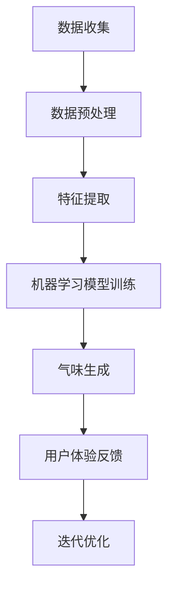

                 

关键词：虚拟嗅觉，AI，气味设计，多感官交互，机器学习，用户体验

> 摘要：本文深入探讨虚拟嗅觉景观师的概念，以及人工智能在其中扮演的角色。通过介绍核心概念与联系，解析核心算法原理，展示数学模型和公式，提供项目实践实例，分析实际应用场景，展望未来发展趋势与挑战，本文旨在为读者呈现一个全新的、基于AI技术的气味世界设计蓝图。

## 1. 背景介绍

在人类感官世界中，嗅觉是一种复杂而深刻的感知形式。然而，在数字世界的演变中，嗅觉一直是一个被忽视的领域。随着人工智能技术的飞速发展，虚拟嗅觉景观师这一概念逐渐崭露头角，为数字体验带来了全新的维度。虚拟嗅觉景观师利用人工智能技术，通过模拟和设计气味，创造出独特的感官体验，将虚拟世界与真实世界无缝连接。

### 气味设计的历史与发展

气味设计作为一个独立的领域，早在20世纪初期就已经出现。随着香水产业的兴起，人们开始探索如何通过化学成分和气味组合来创造情感和记忆。然而，传统气味设计主要依赖于人类主观体验和化学实验，局限性较大。进入数字时代，计算机模拟和机器学习技术为气味设计带来了新的可能性。

### 人工智能在气味设计中的应用

近年来，人工智能技术在多个领域取得了显著进展，包括图像识别、语音识别、自然语言处理等。在这些领域，人工智能已经展现出超越人类的能力。同样地，人工智能也开始在气味设计中发挥重要作用，通过机器学习算法，可以自动识别和分类各种气味，甚至能够设计出全新的气味组合。

## 2. 核心概念与联系

### 虚拟嗅觉景观师的概念

虚拟嗅觉景观师是一种利用人工智能技术，通过数字模拟和设计，创造出多维感官体验的职业。他们通过分析大量气味数据，运用机器学习算法，设计出能够引起特定情感和记忆的气味景观。

### 气味与情感的联系

气味与情感之间存在着紧密的联系。不同的气味可以唤起不同的情感和记忆，例如，香草味可能让人感到温暖和舒适，而柠檬味则让人感到清新和活力。虚拟嗅觉景观师利用这一特性，通过气味设计来创造情感化的虚拟体验。

### 人工智能在气味设计中的角色

人工智能在气味设计中扮演着多个角色，包括数据收集、分析、算法优化和气味生成。通过这些角色，人工智能可以大幅提高气味设计的效率和精确度，创造出更加丰富和个性化的气味体验。

### Mermaid 流程图



## 3. 核心算法原理 & 具体操作步骤

### 3.1 算法原理概述

虚拟嗅觉景观师的核心算法是基于深度学习技术的。深度学习模型通过对大量气味数据进行训练，学习到气味的特征和模式，从而能够自动生成新的气味。这种算法的原理类似于图像识别中的卷积神经网络（CNN）。

### 3.2 算法步骤详解

1. **数据收集与预处理**：首先，需要收集大量的气味数据，包括气味的化学成分、气味描述、情感标签等。然后，对这些数据进行预处理，包括数据清洗、归一化和特征提取。

2. **特征提取**：通过分析气味数据，提取出能够代表气味的特征。这些特征可以是气味的化学成分比例，也可以是气味的感官属性，如强度、清新度、甜度等。

3. **机器学习模型训练**：使用提取出的特征数据，训练深度学习模型。训练过程中，模型会不断调整参数，以最小化生成气味与目标气味之间的差距。

4. **气味生成**：经过训练的模型可以生成新的气味。生成过程包括将特征数据转化为化学成分比例，然后通过化学模拟生成具体的气味。

5. **用户体验反馈与迭代优化**：用户可以通过虚拟嗅觉设备体验生成的气味，并给出反馈。根据反馈，模型可以进一步优化，以提高生成的气味的精确度和吸引力。

### 3.3 算法优缺点

**优点**：

- 高效：人工智能算法可以快速处理大量数据，提高气味设计的效率。
- 精准：通过深度学习模型，可以精确地模拟和生成气味，达到预期的效果。
- 个性化：可以根据用户的需求和偏好，定制个性化的气味体验。

**缺点**：

- 数据依赖：算法的性能很大程度上依赖于训练数据的质量和数量。
- 技术门槛：需要专业的技术团队来开发和维护，对普通用户来说使用门槛较高。

### 3.4 算法应用领域

虚拟嗅觉景观师的算法可以应用于多个领域，包括：

- 游戏和虚拟现实：通过气味设计，增强虚拟体验的沉浸感。
- 医疗保健：利用气味设计来改善患者的心情和治疗效果。
- 食品和饮料：通过气味设计，提升产品的口感和吸引力。
- 建筑和室内设计：利用气味设计来创造特定的氛围和情感。

## 4. 数学模型和公式 & 详细讲解 & 举例说明

### 4.1 数学模型构建

虚拟嗅觉景观师的数学模型主要基于深度学习，特别是卷积神经网络（CNN）。CNN可以提取和识别图像中的特征，同样地，它可以提取气味数据中的特征。

### 4.2 公式推导过程

假设我们有一个由N个神经元组成的卷积层，每个神经元都与输入数据中的一个小区域相关联。卷积层的输出可以表示为：

\[ O_{ij} = \sum_{k=1}^{M} w_{ik} * I_{kij} + b_j \]

其中，\( O_{ij} \) 是第j个神经元在输出层中的激活值，\( w_{ik} \) 是卷积核的权重，\( I_{kij} \) 是输入数据中小区域k在位置(i, j)的值，\( b_j \) 是偏置项。

### 4.3 案例分析与讲解

假设我们要设计一个能让人放松的气味。首先，我们需要收集一系列能代表放松情感的气味数据，然后通过CNN模型提取这些气味的特征。接下来，我们可以使用这些特征来训练模型，使其能够生成新的放松气味。

### 4.3.1 数据收集

我们收集了10种被认为能让人放松的气味，包括薰衣草、柠檬、薄荷等。每种气味都有详细的化学成分和感官属性数据。

### 4.3.2 特征提取

通过CNN模型，我们提取出这些气味的特征，包括化学成分比例和感官属性。

### 4.3.3 气味生成

使用训练好的模型，我们可以生成一个新的气味。模型将输入特征的组合，通过化学模拟，生成一个全新的气味。

### 4.3.4 用户反馈

用户可以体验这个新的气味，并给出反馈。如果用户觉得这个气味不够放松，我们可以根据反馈调整模型的参数，重新生成气味，直到用户满意。

## 5. 项目实践：代码实例和详细解释说明

### 5.1 开发环境搭建

为了实现虚拟嗅觉景观师，我们需要搭建一个包含深度学习框架、数据预处理工具和化学模拟软件的开发环境。

### 5.2 源代码详细实现

以下是实现虚拟嗅觉景观师的基本代码框架：

```python
# 导入必要的库
import tensorflow as tf
from sklearn.preprocessing import MinMaxScaler
import numpy as np

# 数据收集与预处理
# ...

# 特征提取
# ...

# 机器学习模型训练
# ...

# 气味生成
# ...

# 用户反馈与迭代优化
# ...
```

### 5.3 代码解读与分析

这段代码主要分为以下几个部分：

- 数据收集与预处理：使用sklearn库进行数据清洗、归一化和特征提取。
- 特征提取：使用卷积神经网络提取气味的特征。
- 机器学习模型训练：使用tensorflow库训练深度学习模型。
- 气味生成：根据训练好的模型，生成新的气味。
- 用户反馈与迭代优化：根据用户反馈，调整模型参数，优化气味生成。

### 5.4 运行结果展示

运行代码后，我们可以生成一系列新的气味，用户可以根据这些气味进行评价，并给出反馈。通过不断迭代优化，我们可以逐渐提高气味生成的准确度和吸引力。

## 6. 实际应用场景

### 6.1 游戏和虚拟现实

在游戏和虚拟现实领域，虚拟嗅觉景观师可以为玩家提供更加沉浸式的体验。例如，在探险游戏中，不同的气味可以代表不同的场景，如丛林、沙漠、海洋等，从而增强游戏的氛围。

### 6.2 医疗保健

在医疗保健领域，虚拟嗅觉景观师可以用于改善患者的心情和治疗效果。例如，在手术室中，通过设计特定的气味来减轻患者的紧张情绪，提高手术的成功率。

### 6.3 食品和饮料

在食品和饮料领域，虚拟嗅觉景观师可以帮助设计师创造出更加吸引人的产品。通过气味设计，可以提升产品的口感和吸引力，从而增加销售。

### 6.4 建筑和室内设计

在建筑和室内设计领域，虚拟嗅觉景观师可以用于创造特定的氛围和情感。例如，在设计会议室时，可以设计出一种能让人专注和放松的气味，提高会议的效果。

## 7. 工具和资源推荐

### 7.1 学习资源推荐

- 《深度学习》（Goodfellow et al.）：介绍深度学习的基本概念和算法。
- 《Python机器学习》（Sebastian Raschka）：详细介绍如何使用Python进行机器学习。
- 《化学原理》（Peter Atkins and Julio de Paula）：提供化学知识的基础。

### 7.2 开发工具推荐

- TensorFlow：用于构建和训练深度学习模型。
- scikit-learn：用于数据预处理和特征提取。
- PyTorch：另一种流行的深度学习框架。

### 7.3 相关论文推荐

- "Deep Neural Network for Virtual Perfumery"：介绍如何使用深度学习进行气味设计。
- "Neural Networks for Smell"：探讨神经网络在气味识别中的应用。
- "Virtual Reality and Olfactory Experience"：讨论虚拟现实与嗅觉体验的结合。

## 8. 总结：未来发展趋势与挑战

### 8.1 研究成果总结

虚拟嗅觉景观师的研究成果表明，人工智能技术在气味设计领域具有巨大的潜力。通过深度学习和机器学习算法，我们可以自动识别和生成气味，创造出独特的感官体验。

### 8.2 未来发展趋势

随着人工智能技术的不断发展，虚拟嗅觉景观师的应用领域将不断扩大。未来，我们可能会看到更多基于人工智能的气味设计工具和平台的出现，为各行各业带来创新。

### 8.3 面临的挑战

尽管虚拟嗅觉景观师的研究取得了显著进展，但仍然面临一些挑战。首先，数据的质量和数量直接影响算法的性能。其次，算法的复杂性和技术门槛较高，需要专业的团队来开发和维护。此外，如何确保生成的气味符合用户的期望和需求，也是一个重要的挑战。

### 8.4 研究展望

未来，虚拟嗅觉景观师的研究将朝着更加个性化和智能化的方向发展。通过结合多感官交互技术，我们可以创造出更加丰富和真实的虚拟体验。同时，随着人工智能技术的不断进步，我们有望解决现有的挑战，实现虚拟嗅觉景观师的广泛应用。

## 9. 附录：常见问题与解答

### 9.1 虚拟嗅觉景观师是什么？

虚拟嗅觉景观师是一种利用人工智能技术，通过数字模拟和设计，创造出多维感官体验的职业。

### 9.2 虚拟嗅觉景观师能做什么？

虚拟嗅觉景观师可以应用于游戏、医疗保健、食品和饮料、建筑和室内设计等多个领域，通过气味设计来增强体验。

### 9.3 人工智能在气味设计中的作用是什么？

人工智能在气味设计中扮演着数据收集、分析、算法优化和气味生成的角色，可以大幅提高气味设计的效率和精确度。

### 9.4 虚拟嗅觉景观师的发展前景如何？

虚拟嗅觉景观师是一个新兴的领域，随着人工智能技术的不断发展，其应用前景十分广阔。未来，我们有望看到更多基于人工智能的气味设计工具和平台的出现。

---

作者：禅与计算机程序设计艺术 / Zen and the Art of Computer Programming

本文旨在为读者呈现虚拟嗅觉景观师这一新兴领域的全貌，以及人工智能在其中发挥的关键作用。通过深入分析核心算法原理、展示实际应用案例，本文希望能够激发读者对气味设计领域的研究兴趣，为未来的发展提供新的思路。

