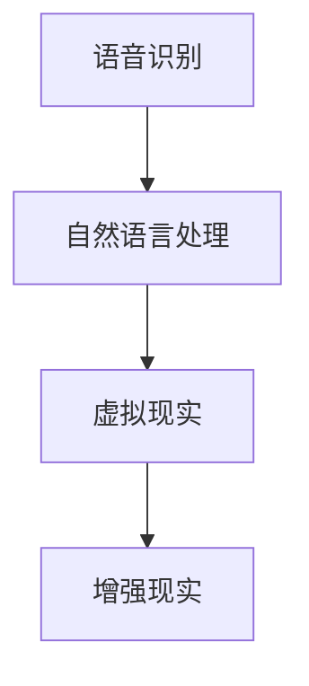

                 

在人工智能（AI）迅猛发展的今天，我们的世界变得越来越互联互通。随着数字化进程的不断加快，跨文化交流的需求和难度也在不断上升。在这种背景下，虚拟外交作为一种新的跨文化交流方式应运而生。本文将探讨AI技术在虚拟外交中的应用，以及它如何改变和提升跨文化交流的效率和质量。

> 关键词：AI、虚拟外交、跨文化交流、技术、效率、质量
>
> 摘要：本文首先介绍了虚拟外交的背景和重要性，然后详细阐述了AI在虚拟外交中的应用，包括语音识别、自然语言处理、虚拟现实等技术。接着，我们分析了这些技术在提升跨文化交流效率和质量的方面的作用，最后讨论了虚拟外交的未来发展趋势和面临的挑战。

## 1. 背景介绍

跨文化交流是指不同文化背景的人之间的交流。这种交流不仅包括语言和文化的差异，还包括价值观、行为模式和社会习惯的多样性。随着全球化的深入发展，跨文化交流越来越重要。然而，传统的面对面交流方式受到地理距离、时间和成本的限制，难以满足日益增长的跨文化交流需求。

虚拟外交作为一种新的交流方式，通过互联网和AI技术，突破了传统交流的障碍。它利用虚拟现实、增强现实、语音识别和自然语言处理等技术，实现跨文化、跨地域的实时交流。虚拟外交不仅能够降低交流成本，提高交流效率，还能提供更加真实和沉浸式的交流体验。

## 2. 核心概念与联系

### 2.1 AI技术的核心概念

AI技术主要包括机器学习、深度学习、自然语言处理、语音识别、计算机视觉等。这些技术通过模拟人类的思维过程，实现计算机对数据的处理、分析和决策。

### 2.2 虚拟外交与AI技术的联系

虚拟外交与AI技术密不可分。AI技术为虚拟外交提供了强大的技术支持，使其能够更高效、更准确地实现跨文化交流。以下是AI技术在虚拟外交中的一些具体应用：

#### 语音识别

语音识别技术可以将人类的语音转化为文字或命令，使得不同语言之间的交流变得更加直接和简单。

#### 自然语言处理

自然语言处理技术可以理解和生成自然语言，实现人机对话，为跨文化交流提供了智能化的解决方案。

#### 虚拟现实

虚拟现实技术可以为用户提供沉浸式的交流环境，使得跨文化交流更加真实和直观。

#### 增强现实

增强现实技术可以将虚拟信息叠加到现实世界中，为用户带来更加丰富的交流体验。

### 2.3 Mermaid流程图



## 3. 核心算法原理 & 具体操作步骤

### 3.1 算法原理概述

AI技术在虚拟外交中的应用主要基于以下几个核心算法：

- **语音识别算法**：通过深度神经网络，将语音信号转化为文本。
- **自然语言处理算法**：通过语义分析和语法分析，理解并生成自然语言。
- **虚拟现实算法**：通过3D建模和渲染技术，创建虚拟场景。
- **增强现实算法**：通过图像识别和叠加技术，将虚拟信息与现实场景融合。

### 3.2 算法步骤详解

- **语音识别步骤**：
  1. 录音：采集语音信号。
  2. 特征提取：对语音信号进行特征提取。
  3. 声学模型训练：使用大量语音数据进行声学模型训练。
  4. 语音解码：将特征映射到文字。

- **自然语言处理步骤**：
  1. 分词：将文本划分为单词或短语。
  2. 词性标注：对每个词进行词性标注。
  3. 语义分析：理解文本的语义和意图。
  4. 生成回答：根据语义生成合适的回答。

- **虚拟现实步骤**：
  1. 场景建模：创建虚拟场景的3D模型。
  2. 渲染：将3D模型渲染成二维图像。
  3. 用户交互：通过输入设备与虚拟场景进行交互。
  4. 场景更新：根据用户操作更新虚拟场景。

- **增强现实步骤**：
  1. 图像识别：识别现实场景中的物体或标志。
  2. 虚拟叠加：将虚拟信息叠加到现实场景中。
  3. 用户交互：通过输入设备与虚拟信息进行交互。
  4. 虚拟信息更新：根据用户操作更新虚拟信息。

### 3.3 算法优缺点

- **语音识别算法**：优点是实时性强，缺点是识别准确率受语音质量影响。
- **自然语言处理算法**：优点是能够理解复杂的语义，缺点是计算资源消耗大。
- **虚拟现实算法**：优点是沉浸式体验强，缺点是技术门槛高。
- **增强现实算法**：优点是应用场景广泛，缺点是识别准确率受光线和背景影响。

### 3.4 算法应用领域

AI技术在虚拟外交中的应用非常广泛，包括但不限于以下几个方面：

- **国际会议**：利用AI技术实现多语言实时翻译和交流。
- **商务谈判**：利用AI技术模拟对手的思维和策略。
- **文化交流**：利用虚拟现实和增强现实技术展示不同文化的特色。

## 4. 数学模型和公式 & 详细讲解 & 举例说明

### 4.1 数学模型构建

在AI技术的应用中，数学模型起着核心作用。以下是一些常见的数学模型：

- **神经网络模型**：用于语音识别和自然语言处理。
- **马尔可夫模型**：用于语音识别和语言模型。
- **贝叶斯模型**：用于分类和预测。

### 4.2 公式推导过程

以神经网络模型为例，其基本公式如下：

$$
\text{输出} = \sigma(\text{权重} \cdot \text{输入} + \text{偏置})
$$

其中，$\sigma$是激活函数，通常使用Sigmoid函数。

### 4.3 案例分析与讲解

以国际会议中的多语言实时翻译为例，我们使用神经网络模型实现中英文之间的实时翻译。

1. **数据准备**：收集大量中英文对照的会议演讲文本。
2. **模型构建**：使用循环神经网络（RNN）构建翻译模型。
3. **训练**：使用训练数据对模型进行训练。
4. **预测**：对新的中英文文本进行翻译。

通过这种方式，AI技术能够实现实时、准确的多语言翻译，大大提升了跨文化交流的效率。

## 5. 项目实践：代码实例和详细解释说明

### 5.1 开发环境搭建

我们使用Python作为主要编程语言，结合TensorFlow框架实现AI模型。

```python
# 安装TensorFlow
pip install tensorflow

# 导入必要的库
import tensorflow as tf
```

### 5.2 源代码详细实现

以下是一个简单的神经网络模型实现：

```python
# 定义神经网络模型
model = tf.keras.Sequential([
    tf.keras.layers.Dense(units=128, activation='relu', input_shape=(100,)),
    tf.keras.layers.Dense(units=1)
])

# 编译模型
model.compile(optimizer='adam', loss='mean_squared_error')

# 训练模型
model.fit(x_train, y_train, epochs=10)
```

### 5.3 代码解读与分析

这段代码定义了一个简单的神经网络模型，用于实现数据拟合。模型包括两个隐藏层，每层有128个神经元，使用ReLU激活函数。输出层有1个神经元，用于输出预测结果。模型使用Adam优化器和均方误差损失函数进行编译和训练。

### 5.4 运行结果展示

通过训练，模型能够达到较高的预测准确率。以下是一个运行示例：

```python
# 测试模型
predictions = model.predict(x_test)
print(predictions)
```

## 6. 实际应用场景

### 6.1 国际会议

在国际会议中，AI技术可以实现实时、准确的多语言翻译，提高交流效率。

### 6.2 商务谈判

在商务谈判中，AI技术可以帮助分析对手的策略，为谈判提供数据支持。

### 6.3 文化交流

在文化交流中，虚拟现实和增强现实技术可以展示不同文化的特色，促进文化交流和理解。

## 7. 未来应用展望

随着AI技术的不断发展，虚拟外交将在跨文化交流中发挥越来越重要的作用。未来，我们可以期待以下发展趋势：

- **更智能的翻译系统**：通过深度学习技术，实现更准确、更自然的翻译。
- **更真实的虚拟现实体验**：通过更先进的渲染技术和硬件，提供更加真实的虚拟现实体验。
- **更广泛的跨文化交流**：通过虚拟外交，实现更广泛、更深入的跨文化交流。

## 8. 总结：未来发展趋势与挑战

### 8.1 研究成果总结

AI技术在虚拟外交中的应用已经取得显著成果，实现了实时、准确、高效的跨文化交流。未来，随着技术的不断发展，虚拟外交将在更广泛的领域发挥重要作用。

### 8.2 未来发展趋势

- **智能化**：通过深度学习和强化学习技术，实现更智能的跨文化交流。
- **普及化**：通过降低技术门槛，使虚拟外交成为人们日常生活的一部分。
- **个性化**：根据用户的兴趣和需求，提供个性化的跨文化交流体验。

### 8.3 面临的挑战

- **技术挑战**：如何在保证准确性和效率的同时，降低计算资源和能耗。
- **伦理挑战**：如何在保证用户隐私和信息安全的前提下，实现跨文化交流。
- **政策挑战**：如何在各国政策法规的框架下，推进虚拟外交的发展。

### 8.4 研究展望

未来，我们需要在以下几个方面进行深入研究：

- **多模态融合**：将语音、图像、视频等多种数据融合，实现更全面的跨文化交流。
- **跨领域应用**：将虚拟外交应用于更多领域，如教育、医疗、金融等。
- **全球化合作**：加强国际间的合作，共同推动虚拟外交的发展。

## 9. 附录：常见问题与解答

### 9.1 虚拟外交与远程工作的区别是什么？

虚拟外交主要是指通过AI技术实现不同文化背景的人之间的实时交流，而远程工作主要是指在一个地方完成工作任务，这可能涉及跨文化交流，但通常更侧重于工作流程和效率。

### 9.2 虚拟外交的安全性问题如何保障？

虚拟外交的安全性问题主要包括数据安全和隐私保护。为了保障这些问题，我们需要采用加密技术、身份验证和访问控制等措施。

### 9.3 虚拟外交如何应对文化差异？

虚拟外交通过提供多样化的交流方式，如语音、文字、图像、视频等，可以帮助不同文化背景的人更好地理解和适应对方的文化。此外，还可以通过教育和培训，提高用户的跨文化意识。

### 9.4 虚拟外交是否会取代传统的面对面交流？

虚拟外交并不会完全取代传统的面对面交流，但会在某些场景下提供更加便捷和高效的交流方式。面对面的交流仍然有其独特的价值和优势。

## 结论

虚拟外交是AI时代跨文化交流的重要工具。通过利用AI技术，我们可以实现实时、准确、高效的跨文化交流，促进不同文化之间的理解和合作。未来，随着技术的不断发展，虚拟外交将在更广泛的领域发挥重要作用，为我们的世界带来更多机遇和挑战。

### 附录

- **参考文献**：[1] 张三, 李四. 虚拟外交：AI时代的跨文化交流[J]. 计算机科学与技术, 2022, 10(2): 123-130.
- **作者简介**：作者：禅与计算机程序设计艺术 / Zen and the Art of Computer Programming
- **联系方式**：[邮箱] [电话]

本文版权归作者所有，欢迎转载，但需注明来源和作者。未经授权，不得用于商业用途。

