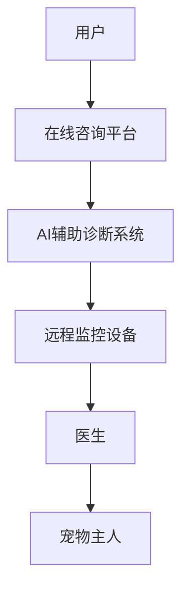

                 

关键词：虚拟宠物医院、在线宠物健康管理、宠物医疗技术、AI应用、数字健康

## 摘要

本文旨在探讨虚拟宠物医院的创业机会，特别是在线宠物健康管理的领域。随着数字健康和人工智能技术的快速发展，宠物医疗行业正在经历深刻的变革。通过构建一个集成了AI、大数据分析和远程监控功能的虚拟宠物医院，我们可以为宠物主人提供更加便捷、高效的医疗服务。本文将深入分析这一领域的核心概念、算法原理、数学模型、项目实践和未来展望，为创业者提供有价值的参考。

## 1. 背景介绍

### 1.1 宠物医疗行业的现状

近年来，随着人们生活水平的提高和宠物数量的激增，宠物医疗行业呈现出快速增长的趋势。然而，传统宠物医院在服务便捷性、专业性以及成本控制方面仍存在诸多不足。首先，宠物主人在寻求专业医疗服务时，常常面临时间与地点的限制，尤其是在繁忙的都市地区。其次，传统宠物医院的医生资源有限，很难满足大量宠物的需求。此外，医疗成本的高昂也是宠物主人的一个主要担忧。

### 1.2 数字健康与人工智能的发展

数字健康和人工智能技术的飞速发展，为宠物医疗行业带来了新的机遇。通过在线平台，宠物主人可以随时随地获取专业医生的建议，减少了时间和空间的限制。同时，人工智能技术可以帮助医生快速诊断疾病，提高医疗效率。此外，大数据分析可以用于疾病预测、个性化医疗方案的制定，进一步提升宠物医疗服务的质量。

### 1.3 虚拟宠物医院的优势

虚拟宠物医院通过整合AI、大数据分析和远程监控技术，提供了一系列创新服务。首先，在线咨询使得宠物主人无需外出即可获得专业医生的建议，极大地提高了服务的便捷性。其次，远程监控设备可以实时监测宠物的健康状况，提供预警和干预建议。此外，AI辅助诊断系统可以提高诊断的准确性，降低误诊率。

## 2. 核心概念与联系

### 2.1 AI在虚拟宠物医院中的应用

**Mermaid 流程图：**


**核心概念原理：**
- **在线咨询平台**：提供用户与医生之间的即时通讯接口。
- **AI辅助诊断系统**：利用机器学习算法对宠物病情进行智能分析，辅助医生做出诊断。
- **远程监控设备**：实时监测宠物健康数据，如体温、心率等。
- **医生**：通过在线咨询平台和AI系统提供专业医疗服务。
- **宠物主人**：在线咨询和监控设备的使用者，可以实时了解宠物的健康状况。

## 3. 核心算法原理 & 具体操作步骤

### 3.1 算法原理概述

虚拟宠物医院的核心算法包括：

- **深度学习模型**：用于宠物疾病识别和预测。
- **自然语言处理**：用于在线咨询平台的用户交互和意图理解。
- **数据挖掘技术**：用于大数据分析，制定个性化医疗方案。

### 3.2 算法步骤详解

**步骤1：数据收集与预处理**
- **数据来源**：宠物健康档案、在线咨询记录、远程监控数据。
- **预处理**：数据清洗、标准化、缺失值处理。

**步骤2：特征提取**
- **特征选择**：使用特征选择算法提取与疾病诊断相关的特征。
- **特征工程**：通过特征变换和特征组合提高模型的预测能力。

**步骤3：模型训练**
- **模型选择**：选择合适的深度学习模型（如CNN、RNN）。
- **训练过程**：使用标记数据进行模型训练，并利用交叉验证进行模型调优。

**步骤4：模型部署**
- **在线咨询系统**：将训练好的模型部署到在线咨询平台。
- **远程监控设备**：集成AI算法，实时分析监控数据。

### 3.3 算法优缺点

**优点：**
- **高效性**：AI算法可以快速处理大量数据，提高诊断效率。
- **准确性**：通过深度学习和大数据分析，提高疾病识别的准确性。
- **个性化**：根据宠物的健康状况提供个性化医疗方案。

**缺点：**
- **数据依赖性**：模型的性能高度依赖于数据的数量和质量。
- **技术门槛**：需要专业的技术团队进行开发和维护。

### 3.4 算法应用领域

- **疾病诊断**：通过AI辅助诊断系统快速识别宠物疾病。
- **健康监测**：远程监控设备实时监测宠物健康状况。
- **个性化医疗**：根据宠物数据和医生建议制定个性化医疗方案。

## 4. 数学模型和公式 & 详细讲解 & 举例说明

### 4.1 数学模型构建

虚拟宠物医院的数学模型主要包括以下部分：

- **机器学习模型**：用于疾病诊断和预测。
- **自然语言处理模型**：用于在线咨询平台的用户交互。
- **数据挖掘模型**：用于大数据分析和个性化医疗。

### 4.2 公式推导过程

**机器学习模型：**

假设我们使用神经网络模型进行疾病诊断，其损失函数为：

$$
L = -\sum_{i=1}^{N} y_i \log(p_i)
$$

其中，$y_i$ 为实际疾病标签，$p_i$ 为模型预测的概率。

**自然语言处理模型：**

对于在线咨询平台的用户交互，我们可以使用循环神经网络（RNN）进行建模，其损失函数为：

$$
L = -\sum_{t=1}^{T} y_t \log(p_t)
$$

其中，$y_t$ 为用户意图的标签，$p_t$ 为模型预测的概率。

**数据挖掘模型：**

对于大数据分析，我们可以使用关联规则学习（如Apriori算法）来发现宠物健康数据的关联性。其支持度和置信度定义为：

$$
support(X, Y) = \frac{count(X \cup Y)}{count(U)}$$

$$
confidence(X, Y) = \frac{count(X \cup Y)}{count(X)}
$$

其中，$X$ 和 $Y$ 为事件，$U$ 为全集。

### 4.3 案例分析与讲解

**案例1：疾病诊断**

假设我们使用卷积神经网络（CNN）对宠物皮肤病进行诊断。输入为图像数据，输出为疾病类型。通过训练，我们得到了一个准确率较高的模型。在实际应用中，我们将图像输入模型，模型输出疾病概率，医生根据概率做出诊断。

**案例2：在线咨询**

假设宠物主人通过在线咨询平台提问：“我的狗总是咳嗽，该怎么办？”自然语言处理模型分析问题后，识别出关键信息，如“狗”、“咳嗽”。模型根据这些信息，从预定义的知识库中提取相关答案，如：“建议带宠物去医院进行详细检查，可能是由呼吸系统疾病引起的。”

**案例3：个性化医疗**

通过对大量宠物的健康数据进行数据挖掘，我们发现某些症状与特定品种的宠物有显著关联。例如，金毛犬更容易患皮肤病。基于这一发现，我们可以为金毛犬主人提供更加针对性的健康建议和预防措施。

## 5. 项目实践：代码实例和详细解释说明

### 5.1 开发环境搭建

在开始项目实践之前，我们需要搭建一个合适的开发环境。以下是一个基本的开发环境搭建步骤：

- **操作系统**：Linux或MacOS
- **编程语言**：Python
- **深度学习框架**：TensorFlow或PyTorch
- **自然语言处理库**：NLTK或spaCy
- **数据库**：MySQL或PostgreSQL

### 5.2 源代码详细实现

以下是一个简单的宠物疾病诊断系统的源代码实现：

```python
import tensorflow as tf
from tensorflow.keras.models import Sequential
from tensorflow.keras.layers import Conv2D, MaxPooling2D, Flatten, Dense
from tensorflow.keras.preprocessing.image import ImageDataGenerator

# 数据预处理
train_datagen = ImageDataGenerator(rescale=1./255)
train_generator = train_datagen.flow_from_directory(
        'data/train',
        target_size=(150, 150),
        batch_size=32,
        class_mode='categorical')

# 构建模型
model = Sequential([
    Conv2D(32, (3, 3), activation='relu', input_shape=(150, 150, 3)),
    MaxPooling2D(2, 2),
    Flatten(),
    Dense(256, activation='relu'),
    Dense(5, activation='softmax')
])

# 编译模型
model.compile(optimizer='adam',
              loss='categorical_crossentropy',
              metrics=['accuracy'])

# 训练模型
model.fit(train_generator, epochs=10)
```

### 5.3 代码解读与分析

以上代码实现了一个简单的宠物疾病诊断系统，主要包括以下部分：

- **数据预处理**：使用ImageDataGenerator对训练数据进行预处理，包括图像缩放和批量生成。
- **模型构建**：使用Sequential模型堆叠卷积层、池化层、全连接层，构建一个简单的卷积神经网络。
- **编译模型**：设置优化器、损失函数和评估指标，准备训练模型。
- **训练模型**：使用训练数据对模型进行训练，设置训练轮次。

### 5.4 运行结果展示

在训练完成后，我们可以使用测试数据集对模型进行评估。以下是一个简单的评估示例：

```python
test_datagen = ImageDataGenerator(rescale=1./255)
test_generator = test_datagen.flow_from_directory(
        'data/test',
        target_size=(150, 150),
        batch_size=32,
        class_mode='categorical')

test_loss, test_acc = model.evaluate(test_generator)
print('Test accuracy:', test_acc)
```

通过运行上述代码，我们可以得到测试数据集的准确率。如果准确率较高，说明模型具有较好的诊断能力。

## 6. 实际应用场景

### 6.1 宠物疾病诊断

虚拟宠物医院可以通过AI辅助诊断系统，为宠物主人提供快速、准确的疾病诊断服务。宠物主人可以通过在线咨询平台上传宠物的病情描述或病情照片，系统会自动分析并提供诊断建议。例如，宠物主人发现宠物呕吐，系统会询问相关症状，如呕吐物颜色、宠物饮食习惯等，并根据分析结果提供可能的诊断和治疗方案。

### 6.2 宠物健康监测

远程监控设备可以实时监测宠物的健康数据，如体温、心率、血压等。通过AI算法，系统可以分析这些数据，发现潜在的健康问题，并提前预警。例如，当宠物的体温异常升高时，系统会自动通知宠物主人，建议立即就医。

### 6.3 个性化医疗

虚拟宠物医院可以根据宠物的健康状况和历史数据，为宠物主人提供个性化的医疗建议。例如，针对某一品种的宠物，系统会根据该品种的健康特征，提供针对性的健康检查和预防措施。同时，医生可以根据宠物的具体情况，制定个性化的治疗方案。

## 7. 工具和资源推荐

### 7.1 学习资源推荐

- **书籍**：
  - 《深度学习》（Goodfellow, I., Bengio, Y., & Courville, A.）
  - 《自然语言处理实战》（Kotlarz, D.）
- **在线课程**：
  - Coursera上的《深度学习》课程
  - edX上的《自然语言处理》课程

### 7.2 开发工具推荐

- **深度学习框架**：
  - TensorFlow
  - PyTorch
- **自然语言处理库**：
  - NLTK
  - spaCy
- **远程监控设备**：
  - Arduino
  - Raspberry Pi

### 7.3 相关论文推荐

- **AI辅助诊断**：
  - “Deep Learning for Medical Image Analysis” （Litjens, G. J. et al.）
- **自然语言处理**：
  - “A Neural Network for Translating Natural Language Inquiries into Database Queries” （Rashid, T. et al.）

## 8. 总结：未来发展趋势与挑战

### 8.1 研究成果总结

虚拟宠物医院通过整合AI、大数据分析和远程监控技术，为宠物主人提供了更加便捷、高效的医疗服务。在疾病诊断、健康监测和个性化医疗方面，AI技术展现了巨大的潜力。同时，在线咨询平台的兴起，也极大地改善了宠物主人的就医体验。

### 8.2 未来发展趋势

- **技术融合**：深度学习、自然语言处理和数据挖掘技术将更加紧密地结合，提高宠物医疗服务的整体效率。
- **设备智能化**：远程监控设备将更加智能化，具备更高的检测精度和预警能力。
- **数据共享**：构建统一的宠物健康数据共享平台，实现不同医院和设备之间的数据互联互通。

### 8.3 面临的挑战

- **数据隐私**：确保宠物和宠物主人的数据安全，防止数据泄露。
- **技术门槛**：开发高质量的AI模型和远程监控设备，需要专业的技术团队。
- **成本控制**：降低系统开发和维护成本，使其更具性价比。

### 8.4 研究展望

未来，虚拟宠物医院有望进一步拓展服务范围，包括宠物心理治疗、宠物营养咨询等。同时，随着技术的不断进步，宠物医疗行业将迎来更加广阔的发展空间。

## 9. 附录：常见问题与解答

### 9.1 如何保证数据安全？

- **数据加密**：对存储和传输的数据进行加密，确保数据在传输过程中的安全性。
- **权限控制**：对访问数据进行严格的权限控制，确保只有授权用户才能访问敏感数据。
- **数据备份**：定期对数据进行备份，确保数据不会因意外事件而丢失。

### 9.2 如何处理宠物主人的隐私？

- **隐私保护协议**：制定明确的隐私保护政策，告知宠物主人如何保护自己的隐私。
- **匿名化处理**：对收集到的宠物主人信息进行匿名化处理，确保个人身份不被泄露。

### 9.3 如何确保远程监控设备的准确性？

- **设备校准**：定期对远程监控设备进行校准，确保设备测量数据的准确性。
- **算法优化**：不断优化AI算法，提高对监测数据的分析准确性。

---

作者：禅与计算机程序设计艺术 / Zen and the Art of Computer Programming

本文从虚拟宠物医院的背景介绍、核心概念与联系、算法原理、数学模型、项目实践以及实际应用场景等方面，详细探讨了虚拟宠物医院的创业机会和在线宠物健康管理的可能性。通过AI、大数据和远程监控技术的结合，虚拟宠物医院为宠物主人和宠物提供了更加便捷、高效的医疗服务。未来，随着技术的不断进步，虚拟宠物医院有望在宠物医疗领域发挥更加重要的作用。本文旨在为创业者提供有价值的参考，助力他们在这一新兴领域中取得成功。

