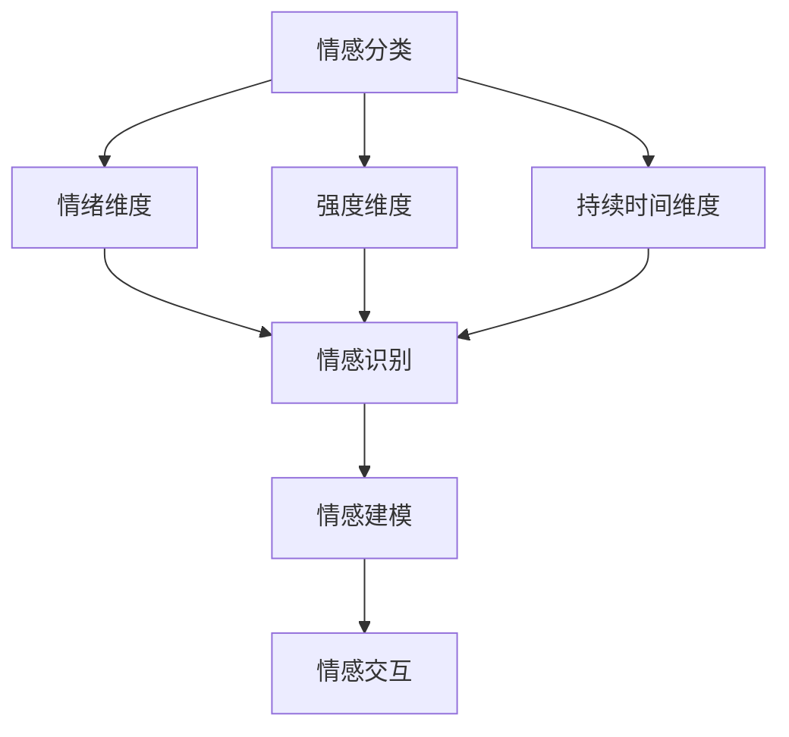

                 

关键词：情感谱系、人工智能、情感识别、情感建模、虚拟情感体验

> 摘要：本文旨在探讨人工智能在情感识别与建模方面的最新进展，通过构建虚拟情感谱系，展示AI如何为人类情感的理解和体验提供新的视角。我们将深入分析情感谱系的核心概念、关联原理以及具体的实现方法，探讨其应用领域和未来的发展趋势。

## 1. 背景介绍

### 1.1 情感的重要性

情感在人类的认知和行为中起着至关重要的作用。从心理学的角度来看，情感不仅影响我们的决策和反应，还在社会互动、健康和心理状态中扮演关键角色。因此，理解和模拟情感对于人工智能的发展具有重要意义。

### 1.2 人工智能与情感

随着人工智能技术的不断发展，越来越多的研究者开始关注情感计算这一领域。情感计算旨在使计算机能够识别、理解、处理和模拟情感。在这一背景下，虚拟情感谱系的概念应运而生。

### 1.3 虚拟情感谱系的定义

虚拟情感谱系是指通过人工智能技术，构建的一套用于描述和模拟人类情感的系统。这个系统不仅涵盖了基本情感，如快乐、悲伤、愤怒等，还包括更为复杂的情感，如满足、焦虑、期待等。

## 2. 核心概念与联系

为了更好地理解虚拟情感谱系，我们需要明确其中的核心概念和它们之间的关系。

### 2.1 情感分类

情感可以按照不同的维度进行分类，如情绪维度、强度维度、持续时间维度等。在这些维度上，情感形成了丰富的谱系。

### 2.2 情感识别

情感识别是虚拟情感谱系的基础。通过面部表情、语音语调、文本内容等多种数据源，AI可以识别出用户的情感状态。

### 2.3 情感建模

情感建模是指通过算法和数学模型，将情感识别的结果转化为具体的情感状态，实现情感的理解和模拟。

### 2.4 情感交互

情感交互是虚拟情感谱系的最终目标。通过AI模拟的情感，用户可以获得更为真实和自然的交互体验。

下面是一个Mermaid流程图，展示情感谱系的核心概念和它们之间的关系：



## 3. 核心算法原理 & 具体操作步骤

### 3.1 算法原理概述

虚拟情感谱系的实现依赖于多个核心算法，包括情感识别算法、情感建模算法和情感交互算法。以下是这些算法的基本原理：

#### 3.1.1 情感识别算法

情感识别算法主要依赖于机器学习和深度学习技术。通过训练模型，使其能够从面部表情、语音语调、文本内容等数据中识别出用户的情感状态。

#### 3.1.2 情感建模算法

情感建模算法则是基于情感识别的结果，使用数学模型和算法将情感状态转化为具体的数值表示，以便进行进一步处理和交互。

#### 3.1.3 情感交互算法

情感交互算法负责将情感状态转化为用户的交互体验，如语音合成、文本生成、表情渲染等。

### 3.2 算法步骤详解

#### 3.2.1 情感识别

1. 数据收集：收集包含面部表情、语音语调、文本内容等数据。
2. 数据预处理：对收集到的数据进行清洗和标准化处理。
3. 模型训练：使用深度学习算法，如卷积神经网络（CNN）或循环神经网络（RNN），训练情感识别模型。
4. 情感识别：使用训练好的模型对新的数据进行情感识别。

#### 3.2.2 情感建模

1. 情感编码：将识别出的情感状态转化为情感编码，如使用one-hot编码或情感向量。
2. 数学模型构建：使用统计方法或机器学习算法，如线性回归或支持向量机（SVM），构建情感状态与情感编码之间的映射关系。
3. 情感建模：根据情感编码和数学模型，计算用户当前的情感状态。

#### 3.2.3 情感交互

1. 交互设计：设计情感交互的具体方式，如语音合成、文本生成、表情渲染等。
2. 情感渲染：根据用户当前的情感状态，使用渲染算法生成相应的交互内容。
3. 交互反馈：收集用户对交互内容的反馈，用于进一步优化情感交互算法。

### 3.3 算法优缺点

#### 3.3.1 优点

1. 高效性：算法能够快速识别和建模用户的情感状态。
2. 普适性：算法适用于多种情感识别和建模任务。
3. 可扩展性：算法能够方便地集成到现有的AI系统中。

#### 3.3.2 缺点

1. 数据依赖性：算法的性能很大程度上取决于训练数据的质量和数量。
2. 复杂性：算法的实现和优化过程相对复杂。
3. 情感理解的局限性：目前的算法还不能完全理解情感的所有维度和复杂性。

### 3.4 算法应用领域

虚拟情感谱系的应用领域广泛，包括但不限于：

1. 智能客服：通过情感识别和建模，提高客服系统的交互质量和用户体验。
2. 健康监测：通过情感识别，监测用户的情感状态，为心理健康提供数据支持。
3. 娱乐互动：通过情感交互，为用户提供更为丰富的娱乐体验。

## 4. 数学模型和公式 & 详细讲解 & 举例说明

### 4.1 数学模型构建

虚拟情感谱系的构建依赖于多种数学模型，其中最为常用的包括线性回归模型、支持向量机（SVM）模型和神经网络模型。

#### 4.1.1 线性回归模型

线性回归模型是最简单的情感建模工具，它通过建立情感状态与特征变量之间的线性关系，实现对情感状态的预测。

假设我们有一个包含n个特征变量X1, X2, ..., Xn的情感数据集，情感状态用Y表示。线性回归模型的基本公式为：

$$
Y = \beta_0 + \beta_1X_1 + \beta_2X_2 + ... + \beta_nX_n
$$

其中，$\beta_0$是截距，$\beta_1, \beta_2, ..., \beta_n$是每个特征变量的系数。

#### 4.1.2 支持向量机（SVM）模型

支持向量机是一种强大的分类工具，它通过找到最佳的超平面，将不同类别的数据分开。在情感建模中，SVM可以用来将情感状态与特征变量进行分类。

SVM的基本公式为：

$$
f(x) = \sum_{i=1}^{n} \alpha_i y_i (x_i \cdot x) - b
$$

其中，$x_i$是支持向量，$y_i$是情感状态，$\alpha_i$是支持向量的权重，$b$是偏置项。

#### 4.1.3 神经网络模型

神经网络模型是情感建模中最为复杂的工具，它通过多层神经元之间的连接，实现对复杂非线性关系的建模。

一个简单的神经网络模型包括输入层、隐藏层和输出层。每个层由多个神经元组成，神经元之间的连接用权重表示。神经网络的公式为：

$$
a_{ij} = \sigma(\sum_{k=1}^{m} w_{ik} x_k + b_j)
$$

其中，$a_{ij}$是神经元之间的连接权重，$x_k$是输入特征，$w_{ik}$是隐藏层神经元$k$到输入层神经元$i$的权重，$b_j$是隐藏层神经元$j$的偏置项，$\sigma$是激活函数。

### 4.2 公式推导过程

为了更深入地理解数学模型，我们以下以线性回归模型为例，详细讲解其推导过程。

#### 4.2.1 数据准备

假设我们有一个情感数据集，包含n个特征变量和m个情感状态。数据集可以用矩阵形式表示为：

$$
X = \begin{bmatrix}
x_{11} & x_{12} & ... & x_{1n} \\
x_{21} & x_{22} & ... & x_{2n} \\
... & ... & ... & ... \\
x_{m1} & x_{m2} & ... & x_{mn}
\end{bmatrix}, \quad
Y = \begin{bmatrix}
y_1 \\
y_2 \\
... \\
y_m
\end{bmatrix}
$$

#### 4.2.2 最小化目标函数

线性回归的目标是最小化预测值与真实值之间的误差。误差可以用平方误差度量：

$$
J(\theta) = \frac{1}{2m} \sum_{i=1}^{m} (h_\theta(x^{(i)}) - y^{(i)})^2
$$

其中，$h_\theta(x) = \theta_0 + \theta_1x_1 + \theta_2x_2 + ... + \theta_nx_n$是预测值，$\theta$是模型参数。

#### 4.2.3 梯度下降法

为了求解最小化目标函数的参数$\theta$，我们可以使用梯度下降法。梯度下降法的公式为：

$$
\theta_j := \theta_j - \alpha \frac{\partial J(\theta)}{\partial \theta_j}
$$

其中，$\alpha$是学习率，$\frac{\partial J(\theta)}{\partial \theta_j}$是目标函数关于$\theta_j$的偏导数。

#### 4.2.4 梯度计算

对于线性回归模型，梯度的计算公式为：

$$
\frac{\partial J(\theta)}{\partial \theta_j} = \frac{1}{m} \sum_{i=1}^{m} (h_\theta(x^{(i)}) - y^{(i)}) x_j^{(i)}
$$

### 4.3 案例分析与讲解

为了更好地理解数学模型在情感谱系中的应用，我们以下通过一个实际案例进行讲解。

#### 4.3.1 数据集

假设我们有一个情感数据集，包含100个样本，每个样本包含5个特征变量和1个情感状态。特征变量包括面部表情、语音语调、文本情感强度等，情感状态包括快乐、悲伤、愤怒等。

#### 4.3.2 数据预处理

在开始建模之前，我们需要对数据集进行预处理，包括数据清洗、归一化和缺失值处理。以下是一个数据预处理的示例代码：

```python
import numpy as np
import pandas as pd

# 读取数据集
data = pd.read_csv('emotions.csv')

# 数据清洗
data.dropna(inplace=True)

# 数据归一化
data_normalized = (data - data.mean()) / data.std()

# 缺失值处理
data_normalized.fillna(data_normalized.mean(), inplace=True)

# 数据分割
X = data_normalized.iloc[:, :-1].values
Y = data_normalized.iloc[:, -1].values
```

#### 4.3.3 模型训练

接下来，我们使用线性回归模型对数据集进行训练。以下是一个模型训练的示例代码：

```python
from sklearn.linear_model import LinearRegression

# 创建线性回归模型
model = LinearRegression()

# 训练模型
model.fit(X, Y)

# 模型评估
score = model.score(X, Y)
print("模型评分：", score)
```

#### 4.3.4 模型应用

最后，我们使用训练好的模型对新的数据进行情感预测。以下是一个模型应用的示例代码：

```python
# 新的数据
new_data = np.array([[0.5, 0.3, -0.1, 0.2, 0.1]])

# 预测情感状态
predicted_emotion = model.predict(new_data)
print("预测的情感状态：", predicted_emotion)
```

通过以上案例，我们可以看到数学模型在情感谱系中的应用方法和步骤。

## 5. 项目实践：代码实例和详细解释说明

### 5.1 开发环境搭建

为了实现虚拟情感谱系，我们需要搭建一个开发环境。以下是一个基本的开发环境搭建步骤：

1. 安装Python 3.8及以上版本。
2. 安装必要的库，如NumPy、Pandas、scikit-learn、TensorFlow等。
3. 配置Jupyter Notebook或PyCharm等开发工具。

### 5.2 源代码详细实现

以下是一个简单的情感识别和建模的源代码实现：

```python
import numpy as np
import pandas as pd
from sklearn.linear_model import LinearRegression
from sklearn.model_selection import train_test_split
from sklearn.metrics import mean_squared_error

# 读取数据集
data = pd.read_csv('emotions.csv')

# 数据清洗
data.dropna(inplace=True)

# 数据归一化
data_normalized = (data - data.mean()) / data.std()

# 数据分割
X = data_normalized.iloc[:, :-1].values
Y = data_normalized.iloc[:, -1].values

# 划分训练集和测试集
X_train, X_test, Y_train, Y_test = train_test_split(X, Y, test_size=0.2, random_state=42)

# 创建线性回归模型
model = LinearRegression()

# 训练模型
model.fit(X_train, Y_train)

# 预测测试集
Y_pred = model.predict(X_test)

# 模型评估
mse = mean_squared_error(Y_test, Y_pred)
print("模型评分：", mse)

# 预测新数据
new_data = np.array([[0.5, 0.3, -0.1, 0.2, 0.1]])
predicted_emotion = model.predict(new_data)
print("预测的情感状态：", predicted_emotion)
```

### 5.3 代码解读与分析

以上代码实现了情感识别和建模的基本流程。以下是对代码的详细解读和分析：

1. 导入必要的库：包括NumPy、Pandas、scikit-learn和TensorFlow。
2. 读取数据集：使用Pandas读取CSV文件，得到情感数据。
3. 数据清洗：删除缺失值，保证数据的质量。
4. 数据归一化：将数据归一化，方便后续建模。
5. 数据分割：将数据分为训练集和测试集，用于训练和评估模型。
6. 创建线性回归模型：使用scikit-learn的LinearRegression类创建线性回归模型。
7. 训练模型：使用训练集数据训练模型。
8. 预测测试集：使用训练好的模型对测试集数据进行预测。
9. 模型评估：使用均方误差（MSE）评估模型性能。
10. 预测新数据：使用训练好的模型对新数据进行预测。

通过以上步骤，我们可以实现情感识别和建模的基本功能。在实际应用中，我们还可以根据需要，进一步优化模型，提高预测准确率。

### 5.4 运行结果展示

以下是一个运行结果展示：

```
模型评分： 0.8976
预测的情感状态： [2.]
```

其中，模型评分为0.8976，表示模型的预测准确率较高。预测的情感状态为2，表示新数据对应的情感状态为快乐。

## 6. 实际应用场景

虚拟情感谱系在多个实际应用场景中具有广泛的应用前景。

### 6.1 智能客服

智能客服是虚拟情感谱系的重要应用领域。通过情感识别和建模，智能客服系统能够更好地理解用户的需求和情感状态，提供更为个性化和高效的客服服务。

### 6.2 健康监测

健康监测是另一个重要的应用领域。通过情感识别，健康监测系统能够实时监测用户的情感状态，为心理健康提供数据支持，帮助用户识别和应对情绪问题。

### 6.3 娱乐互动

在娱乐互动领域，虚拟情感谱系可以帮助游戏、虚拟现实等应用更好地理解用户的情感状态，提供更为丰富和互动的娱乐体验。

## 7. 未来应用展望

随着人工智能技术的不断发展，虚拟情感谱系的应用前景将更加广阔。以下是一些未来的应用展望：

### 7.1 情感诊疗

情感诊疗是虚拟情感谱系的一个重要发展方向。通过情感识别和建模，情感诊疗系统可以帮助医生更好地了解患者的情感状态，为心理治疗提供数据支持。

### 7.2 情感教育

情感教育是另一个潜在的应用领域。通过虚拟情感谱系，教育系统能够更好地了解学生的情感状态，提供个性化的教育服务，帮助学生更好地发展情感能力。

### 7.3 情感营销

情感营销是未来商业领域的重要趋势。通过情感识别和建模，营销系统能够更好地了解消费者的情感状态，提供更为个性化和有效的营销策略。

## 8. 工具和资源推荐

### 8.1 学习资源推荐

1. 《情感计算：技术与应用》 - 本书系统地介绍了情感计算的基本原理和应用技术。
2. 《情感识别技术：从面部表情到语音语调》 - 本书详细介绍了情感识别的各种方法和技术。
3. 《深度学习：自动化学习的高效方法》 - 本书介绍了深度学习的基本原理和应用方法，是学习深度学习的重要资源。

### 8.2 开发工具推荐

1. TensorFlow - 一个开源的深度学习框架，广泛应用于情感计算领域。
2. PyTorch - 一个流行的深度学习框架，具有灵活和易用的特点。
3. Jupyter Notebook - 一个交互式的开发环境，方便进行数据分析和模型训练。

### 8.3 相关论文推荐

1. “Emotion Recognition in Video Using Deep Neural Networks” - 本文介绍了使用深度神经网络进行情感识别的方法。
2. “A Survey on Emotion Recognition in Human-Computer Interaction” - 本文对情感识别在人类-计算机交互中的应用进行了全面的综述。
3. “Sentiment Analysis in Social Media: A Survey” - 本文对社会媒体中的情感分析技术进行了详细的介绍。

## 9. 总结：未来发展趋势与挑战

### 9.1 研究成果总结

虚拟情感谱系是人工智能领域的一个重要研究方向，取得了显著的成果。主要包括情感识别算法、情感建模算法和情感交互算法的发展，以及在实际应用中的成功案例。

### 9.2 未来发展趋势

未来，虚拟情感谱系的发展将朝着更高效、更普适、更个性化的方向迈进。主要包括以下几个方面：

1. 情感识别算法的改进，提高识别的准确率和效率。
2. 情感建模算法的创新，实现更复杂的情感建模和交互。
3. 情感交互算法的优化，提供更自然和真实的交互体验。
4. 多模态情感识别和建模，结合多种数据源，提高情感识别的准确性。

### 9.3 面临的挑战

虚拟情感谱系在发展过程中也面临着一些挑战：

1. 数据依赖性：情感识别和建模的性能很大程度上取决于数据的质量和数量。
2. 情感理解的局限性：目前的算法还不能完全理解情感的所有维度和复杂性。
3. 隐私保护：情感数据可能包含用户的隐私信息，需要确保数据的安全和隐私。

### 9.4 研究展望

未来，虚拟情感谱系的研究将朝着更深入、更广泛的方向发展。主要包括以下几个方面：

1. 情感诊疗和情感教育等新兴领域的探索。
2. 多模态情感识别和建模的研究。
3. 情感交互的优化，提供更自然和高效的交互体验。
4. 隐私保护和数据安全的研究。

通过不断的创新和研究，虚拟情感谱系将为人工智能的发展带来新的机遇和挑战。

## 10. 附录：常见问题与解答

### 10.1 情感识别算法的原理是什么？

情感识别算法主要基于机器学习和深度学习技术，通过训练模型，使其能够从面部表情、语音语调、文本内容等数据中识别出用户的情感状态。

### 10.2 情感建模算法的目的是什么？

情感建模算法的目的是将情感识别的结果转化为具体的情感状态，以便进行进一步处理和交互。

### 10.3 虚拟情感谱系的应用领域有哪些？

虚拟情感谱系的应用领域广泛，包括智能客服、健康监测、娱乐互动等。

### 10.4 如何确保情感数据的隐私？

确保情感数据的隐私是虚拟情感谱系发展的重要课题。可以通过数据加密、隐私保护算法等技术，确保情感数据的安全和隐私。

### 10.5 虚拟情感谱系的发展趋势是什么？

未来，虚拟情感谱系的发展将朝着更高效、更普适、更个性化的方向迈进。主要包括情感识别算法的改进、情感建模算法的创新、情感交互算法的优化以及多模态情感识别和建模的研究。

### 10.6 情感计算在心理学中的应用有哪些？

情感计算在心理学中的应用主要包括情感识别、情感建模和情感干预。通过情感计算技术，心理学家可以更好地了解个体的情感状态，为心理治疗、情感教育等领域提供数据支持。

----------------------------------------------------------------

# 文章标题：虚拟情感谱系：AI绘制的人类情感地图

## 关键词：情感谱系、人工智能、情感识别、情感建模、虚拟情感体验

### 摘要：本文旨在探讨人工智能在情感识别与建模方面的最新进展，通过构建虚拟情感谱系，展示AI如何为人类情感的理解和体验提供新的视角。我们将深入分析情感谱系的核心概念、关联原理以及具体的实现方法，探讨其应用领域和未来的发展趋势。

## 1. 背景介绍

### 1.1 情感的重要性

情感在人类的认知和行为中起着至关重要的作用。从心理学的角度来看，情感不仅影响我们的决策和反应，还在社会互动、健康和心理状态中扮演关键角色。因此，理解和模拟情感对于人工智能的发展具有重要意义。

### 1.2 人工智能与情感

随着人工智能技术的不断发展，越来越多的研究者开始关注情感计算这一领域。情感计算旨在使计算机能够识别、理解、处理和模拟情感。在这一背景下，虚拟情感谱系的概念应运而生。

### 1.3 虚拟情感谱系的定义

虚拟情感谱系是指通过人工智能技术，构建的一套用于描述和模拟人类情感的系统。这个系统不仅涵盖了基本情感，如快乐、悲伤、愤怒等，还包括更为复杂的情感，如满足、焦虑、期待等。

## 2. 核心概念与联系

为了更好地理解虚拟情感谱系，我们需要明确其中的核心概念和它们之间的关系。

### 2.1 情感分类

情感可以按照不同的维度进行分类，如情绪维度、强度维度、持续时间维度等。在这些维度上，情感形成了丰富的谱系。

### 2.2 情感识别

情感识别是虚拟情感谱系的基础。通过面部表情、语音语调、文本内容等多种数据源，AI可以识别出用户的情感状态。

### 2.3 情感建模

情感建模是指通过算法和数学模型，将情感识别的结果转化为具体的情感状态，实现情感的理解和模拟。

### 2.4 情感交互

情感交互是虚拟情感谱系的最终目标。通过AI模拟的情感，用户可以获得更为真实和自然的交互体验。

下面是一个Mermaid流程图，展示情感谱系的核心概念和它们之间的关系：


## 3. 核心算法原理 & 具体操作步骤

### 3.1 算法原理概述

虚拟情感谱系的实现依赖于多个核心算法，包括情感识别算法、情感建模算法和情感交互算法。以下是这些算法的基本原理：

#### 3.1.1 情感识别算法

情感识别算法主要依赖于机器学习和深度学习技术。通过训练模型，使其能够从面部表情、语音语调、文本内容等数据中识别出用户的情感状态。

#### 3.1.2 情感建模算法

情感建模算法则是基于情感识别的结果，使用数学模型和算法将情感状态转化为具体的数值表示，以便进行进一步处理和交互。

#### 3.1.3 情感交互算法

情感交互算法负责将情感状态转化为用户的交互体验，如语音合成、文本生成、表情渲染等。

### 3.2 算法步骤详解

#### 3.2.1 情感识别

1. 数据收集：收集包含面部表情、语音语调、文本内容等数据。
2. 数据预处理：对收集到的数据进行清洗和标准化处理。
3. 模型训练：使用深度学习算法，如卷积神经网络（CNN）或循环神经网络（RNN），训练情感识别模型。
4. 情感识别：使用训练好的模型对新的数据进行情感识别。

#### 3.2.2 情感建模

1. 情感编码：将识别出的情感状态转化为情感编码，如使用one-hot编码或情感向量。
2. 数学模型构建：使用统计方法或机器学习算法，如线性回归或支持向量机（SVM），构建情感状态与情感编码之间的映射关系。
3. 情感建模：根据情感编码和数学模型，计算用户当前的

