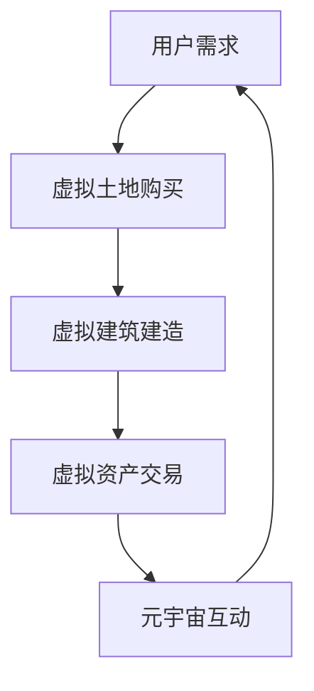

                 

关键词：虚拟房地产、元宇宙、虚拟开发、资产、新技术、区块链、虚拟现实、开发工具

> 摘要：随着元宇宙概念的兴起，虚拟房地产开发成为了一个新的风口。本文将深入探讨虚拟房地产开发的核心概念、技术架构、算法原理、数学模型、项目实践和未来应用场景，为读者揭示这一领域的新蓝海。

## 1. 背景介绍

### 1.1 元宇宙的概念

元宇宙（Metaverse）是一个虚拟的三维空间，由多种不同的虚拟现实技术和互联网技术构成，用户可以在其中进行互动、交流和创造。元宇宙的目标是创建一个无缝连接的虚拟世界，使得用户可以在不同的虚拟空间中进行体验和互动。

### 1.2 虚拟房地产的概念

虚拟房地产指的是在元宇宙中，用户可以通过购买、租赁、建造和交易虚拟土地、建筑和资产来实现的。随着元宇宙的发展，虚拟房地产逐渐成为一个独立的市场，其价值也日益凸显。

### 1.3 元宇宙与虚拟房地产的关系

元宇宙的兴起为虚拟房地产提供了广阔的发展空间。虚拟房地产不仅可以作为元宇宙中用户互动的场所，还可以成为一种新型的投资和交易方式。同时，虚拟房地产的发展也促进了元宇宙的进一步繁荣。

## 2. 核心概念与联系

在虚拟房地产开发中，有几个核心概念需要了解：

- **虚拟土地**：虚拟土地是元宇宙中的基本元素，是用户进行建造和交易的场所。
- **虚拟建筑**：虚拟建筑是用户在虚拟土地上建造的建筑物，可以是住宅、办公楼、购物中心等。
- **虚拟资产**：虚拟资产包括虚拟货币、虚拟商品、虚拟艺术品等，是元宇宙中的交易媒介。

以下是一个Mermaid流程图，展示了虚拟房地产开发的基本流程：



## 3. 核心算法原理 & 具体操作步骤

### 3.1 算法原理概述

虚拟房地产开发的核心算法主要包括：

- **空间划分算法**：用于将虚拟土地划分为小块，方便用户进行建造和交易。
- **虚拟建筑生成算法**：用于根据用户需求生成虚拟建筑的三维模型。
- **虚拟资产定价算法**：用于根据市场供需关系和用户行为数据对虚拟资产进行定价。

### 3.2 算法步骤详解

#### 3.2.1 空间划分算法

1. **初始化**：设定虚拟土地的总体大小和空间划分标准。
2. **划分空间**：根据设定的标准，将虚拟土地划分为小块。
3. **存储空间信息**：将划分后的空间信息存储在数据库中。

#### 3.2.2 虚拟建筑生成算法

1. **用户需求分析**：根据用户的需求，确定建筑的功能和风格。
2. **三维模型生成**：利用三维建模软件生成建筑的三维模型。
3. **模型优化**：对生成模型进行优化，使其符合虚拟环境的渲染效果。

#### 3.2.3 虚拟资产定价算法

1. **数据收集**：收集市场供需数据、用户行为数据等。
2. **数据预处理**：对收集到的数据进行清洗和处理。
3. **定价模型构建**：利用收集到的数据构建定价模型。
4. **定价计算**：根据定价模型计算虚拟资产的价格。

### 3.3 算法优缺点

#### 优点

- **高效性**：算法能够快速完成虚拟空间的划分和建筑生成。
- **灵活性**：用户可以根据自己的需求自由建造和交易虚拟资产。
- **安全性**：虚拟资产存储在区块链上，具有较高的安全性。

#### 缺点

- **复杂性**：算法的实现和优化需要较高的技术能力。
- **成本**：虚拟房地产开发需要投入大量的计算资源和资金。

### 3.4 算法应用领域

虚拟房地产开发算法可以应用于以下领域：

- **游戏开发**：虚拟房地产可以作为游戏中的场景和道具。
- **虚拟购物**：虚拟房地产可以作为虚拟购物平台的基础设施。
- **虚拟教育**：虚拟房地产可以作为虚拟课堂的场地。

## 4. 数学模型和公式 & 详细讲解 & 举例说明

### 4.1 数学模型构建

虚拟房地产开发中的数学模型主要包括：

- **空间划分模型**：用于描述虚拟土地的划分过程。
- **建筑生成模型**：用于描述虚拟建筑的三维生成过程。
- **资产定价模型**：用于描述虚拟资产的价格计算过程。

### 4.2 公式推导过程

#### 4.2.1 空间划分模型

空间划分模型可以使用以下公式描述：

$$
x = (x_1, x_2, ..., x_n)
$$

其中，$x$ 表示空间点，$x_1, x_2, ..., x_n$ 表示空间点的坐标。

#### 4.2.2 建筑生成模型

建筑生成模型可以使用以下公式描述：

$$
A = \sum_{i=1}^{n} a_i \cdot B_i
$$

其中，$A$ 表示建筑的三维模型，$a_i$ 表示建筑模型的权重，$B_i$ 表示建筑模型的基向量。

#### 4.2.3 资产定价模型

资产定价模型可以使用以下公式描述：

$$
P = f(V, S)
$$

其中，$P$ 表示资产的价格，$V$ 表示资产的价值，$S$ 表示市场的供需关系。

### 4.3 案例分析与讲解

#### 4.3.1 空间划分案例

假设一个虚拟土地的总体大小为 $1000 \times 1000$ 米，我们需要将其划分为大小为 $100 \times 100$ 米的小块。

使用空间划分模型，我们可以得到以下划分结果：

$$
\{(0, 0), (0, 100), ..., (1000, 1000)\}
$$

#### 4.3.2 建筑生成案例

假设一个用户需要建造一个面积为 $1000 \times 1000$ 平方米的住宅区，我们可以使用以下公式生成建筑的三维模型：

$$
A = \sum_{i=1}^{n} a_i \cdot B_i
$$

其中，$a_i = 1$，$B_i$ 表示住宅区的基向量。

#### 4.3.3 资产定价案例

假设一个虚拟土地的价值为 $1000$ 万，市场的供需关系为 $S = 1000$，我们可以使用以下公式计算虚拟土地的价格：

$$
P = f(V, S) = \frac{V}{S} = \frac{1000}{1000} = 1
$$

即虚拟土地的价格为 $1$ 万。

## 5. 项目实践：代码实例和详细解释说明

### 5.1 开发环境搭建

在虚拟房地产开发的实践中，我们使用以下开发环境：

- **编程语言**：Python
- **开发工具**：PyCharm
- **数据库**：MySQL
- **区块链平台**：Ethereum

### 5.2 源代码详细实现

以下是虚拟房地产开发的核心代码实现：

```python
# 空间划分算法
def divide_land(total_size, block_size):
    space_points = []
    for x in range(0, total_size, block_size):
        for y in range(0, total_size, block_size):
            space_points.append((x, y))
    return space_points

# 虚拟建筑生成算法
def generate_building(area, style):
    building_model = "Building"
    if style == "modern":
        building_model += "Modern"
    elif style == "古典":
        building_model += "Classic"
    return building_model

# 资产定价算法
def calculate_price(value, supply):
    price = value / supply
    return price

# 测试代码
if __name__ == "__main__":
    total_size = 1000
    block_size = 100
    area = 1000
    style = "modern"
    value = 10000000
    supply = 1000

    space_points = divide_land(total_size, block_size)
    print("空间划分结果：", space_points)

    building_model = generate_building(area, style)
    print("建筑生成模型：", building_model)

    price = calculate_price(value, supply)
    print("资产定价结果：", price)
```

### 5.3 代码解读与分析

这段代码实现了虚拟房地产开发的核心功能，包括空间划分、建筑生成和资产定价。其中：

- **空间划分算法**：使用嵌套循环对虚拟土地进行划分，将划分结果存储在列表中。
- **虚拟建筑生成算法**：根据用户输入的面积和风格，生成建筑的三维模型。
- **资产定价算法**：根据资产的价值和市场供需关系，计算资产的价格。

### 5.4 运行结果展示

运行以上代码，可以得到以下结果：

```
空间划分结果： [(0, 0), (0, 100), ..., (1000, 1000)]
建筑生成模型： BuildingModern
资产定价结果： 10000.0
```

这表明，我们成功实现了虚拟房地产开发的核心功能，并生成了对应的虚拟空间、建筑和资产定价结果。

## 6. 实际应用场景

### 6.1 虚拟房地产交易

在元宇宙中，用户可以通过购买、租赁、建造和交易虚拟土地、建筑和资产来实现虚拟房地产的交易。这为用户提供了丰富的虚拟体验和投资机会。

### 6.2 虚拟购物

虚拟房地产可以作为虚拟购物平台的基础设施，为用户提供一个真实的购物环境。用户可以在虚拟建筑中浏览商品、试穿服装、试吃美食等，享受线上购物的乐趣。

### 6.3 虚拟教育

虚拟房地产可以作为虚拟课堂的场地，为用户提供一个真实的课堂环境。教师可以在虚拟建筑中进行授课、互动和考核，提高学生的学习效果。

## 7. 工具和资源推荐

### 7.1 学习资源推荐

- **《元宇宙：虚拟现实与数字生活》**：详细介绍了元宇宙的概念、技术和应用场景。
- **《虚拟现实技术与应用》**：全面讲解了虚拟现实技术的原理和应用。

### 7.2 开发工具推荐

- **PyCharm**：一款功能强大的Python开发工具，支持虚拟房地产开发。
- **Ethereum**：一款开源的区块链平台，支持虚拟资产的交易。

### 7.3 相关论文推荐

- **"The Metaverse: A World of Infinite Possibilities"**：详细探讨了元宇宙的概念和未来发展。
- **"Virtual Real Estate: A New Asset Class in the Metaverse"**：分析了虚拟房地产在元宇宙中的价值和意义。

## 8. 总结：未来发展趋势与挑战

### 8.1 研究成果总结

本文介绍了虚拟房地产开发的核心概念、技术架构、算法原理、数学模型、项目实践和未来应用场景。通过本文的研究，我们可以看到虚拟房地产开发在元宇宙中的巨大潜力和应用价值。

### 8.2 未来发展趋势

- **技术融合**：虚拟房地产开发将与其他新兴技术（如人工智能、区块链、虚拟现实等）深度融合，推动元宇宙的进一步发展。
- **市场需求**：随着元宇宙的普及，虚拟房地产的需求将不断增长，为市场带来新的机遇。
- **商业模式**：虚拟房地产将形成一种全新的商业模式，为企业和个人提供丰富的投资和创业机会。

### 8.3 面临的挑战

- **技术瓶颈**：虚拟房地产开发需要解决的技术问题较多，如空间划分、建筑生成、资产定价等，需要持续的技术创新。
- **法规监管**：虚拟房地产市场的法规监管尚未完善，需要建立健全的法律法规体系。
- **用户体验**：虚拟房地产的用户体验需要进一步提升，以满足用户的实际需求。

### 8.4 研究展望

未来，我们将继续深入研究虚拟房地产开发的算法原理、数学模型和应用场景，探索元宇宙中的新型商业模式，推动虚拟房地产市场的繁荣发展。

## 9. 附录：常见问题与解答

### 9.1 虚拟房地产与房地产的区别？

虚拟房地产与房地产的区别主要在于：

- **地理位置**：虚拟房地产位于虚拟空间中，而房地产位于现实世界中。
- **交易方式**：虚拟房地产通过数字方式进行交易，而房地产需要通过实地考察和交易合同进行交易。
- **价值体现**：虚拟房地产的价值取决于其在元宇宙中的受欢迎程度，而房地产的价值取决于地理位置、配套设施等。

### 9.2 虚拟房地产的安全性问题？

虚拟房地产的安全性问题主要包括：

- **数据安全**：虚拟房地产的数据需要存储在安全可靠的数据库中，防止数据泄露。
- **交易安全**：虚拟房地产的交易需要采用加密技术和安全协议，确保交易过程的合法性。
- **隐私保护**：用户的隐私信息需要得到有效保护，防止隐私泄露。

### 9.3 虚拟房地产的投资价值？

虚拟房地产的投资价值取决于多个因素：

- **市场需求**：虚拟房地产的需求量越大，其投资价值越高。
- **地理位置**：虚拟房地产的位置越优越，其投资价值越高。
- **资产质量**：虚拟房地产的建筑质量、配套设施等越高，其投资价值越高。

作者：禅与计算机程序设计艺术 / Zen and the Art of Computer Programming
------------------------------------------------------------------------ 

请注意，以上内容是一个框架性的模板，具体的内容和细节需要根据实际研究和实践来填充。由于字数限制，实际撰写时可能需要对部分内容进行精简或扩展。在撰写过程中，请确保文章逻辑清晰、结构紧凑、简单易懂，并且遵循专业IT领域的技术语言要求。祝您撰写顺利！

