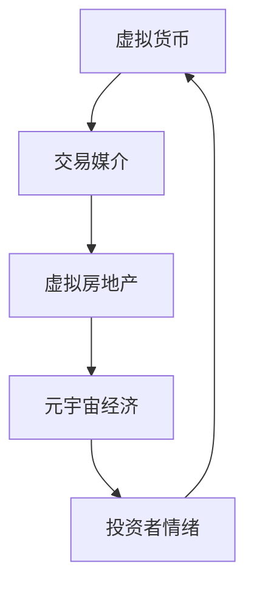

                 

### 背景介绍 Background

随着互联网技术的飞速发展，虚拟世界（Virtual World）的概念逐渐走入人们的视野。元宇宙（Metaverse）作为虚拟世界的高级形态，被广泛认为是下一代互联网的发展方向。元宇宙不仅仅是一个虚拟空间，更是与现实世界紧密相连的数字化生态系统。在这个系统中，虚拟房地产成为了人们关注的焦点。

虚拟房地产是指存在于虚拟世界中的土地、房产等不动产。与传统的实体房地产相比，虚拟房地产具有独特的优势，如低交易成本、高灵活性、无限扩展性等。因此，越来越多的投资者和用户开始涉足元宇宙，购买和交易虚拟房地产。

然而，随着虚拟房地产市场的繁荣，一些问题也日益显现。最引人关注的就是虚拟房地产泡沫的出现。所谓泡沫，指的是虚拟房地产价格在短期内迅速上涨，然后又迅速下跌的现象。这种现象不仅对投资者造成了巨大的经济损失，也可能对整个元宇宙生态系统产生负面影响。

本文旨在对元宇宙资产价格进行理性分析，探讨虚拟房地产泡沫的形成原因、影响以及应对策略。通过本文的分析，希望读者能够对元宇宙资产价格有更加清晰的认识，从而做出更加明智的投资决策。

## 1. 核心概念与联系 Concept and Connection

在分析虚拟房地产泡沫之前，我们首先需要理解一些核心概念，这些概念构成了元宇宙资产价格的基础。以下是几个关键概念及其相互关系：

### 1.1 虚拟货币（Virtual Currency）

虚拟货币是元宇宙中的交易媒介，类似于现实世界中的货币。常见的虚拟货币包括比特币（Bitcoin）、以太币（Ethereum）等。虚拟货币在元宇宙中用于购买虚拟商品、服务以及虚拟房地产。

### 1.2 虚拟房地产（Virtual Real Estate）

虚拟房地产是指在虚拟世界（如游戏、社交平台、元宇宙平台等）中存在的土地、房产等不动产。虚拟房地产的价格受多种因素影响，包括地理位置、资源丰富度、市场需求等。

### 1.3 元宇宙经济（Metaverse Economy）

元宇宙经济是虚拟世界中的经济体系，包括虚拟商品交易、虚拟房地产交易、虚拟劳动力市场等。元宇宙经济的繁荣程度直接关系到虚拟房地产的价值。

### 1.4 投资者情绪（Investor Sentiment）

投资者情绪是指投资者在虚拟房地产市场中的心理状态，包括乐观、悲观、恐慌等。投资者情绪会影响虚拟房地产的需求和价格。

这些核心概念之间存在着密切的联系。虚拟货币作为交易媒介，促进了虚拟房地产和元宇宙经济的发展。虚拟房地产的价值取决于其在元宇宙经济体系中的地位和投资者的情绪。而投资者情绪又受到市场供需关系、技术创新、政策变化等多种因素的影响。

### Mermaid 流程图

以下是一个简化的元宇宙资产价格的 Mermaid 流程图，展示了这些核心概念之间的相互关系：



通过这个流程图，我们可以更直观地理解元宇宙资产价格的形成机制。了解这些核心概念及其联系，对于我们分析虚拟房地产泡沫具有重要意义。

## 2. 核心算法原理 & 具体操作步骤 Algorithm Principle and Operational Steps

### 2.1 算法原理概述

在分析虚拟房地产泡沫时，我们需要运用一些核心算法来理解和预测资产价格的变化。这些算法主要包括市场供需分析、投资者情绪分析、技术指标分析等。以下是这些算法的基本原理：

#### 2.1.1 市场供需分析

市场供需分析是一种基本的经济学工具，用于评估虚拟房地产市场的供需关系。具体来说，通过分析虚拟房地产的供应量、需求量以及价格变化趋势，我们可以判断市场的健康程度。当供应量大于需求量时，价格可能下跌；反之，当需求量大于供应量时，价格可能上涨。

#### 2.1.2 投资者情绪分析

投资者情绪分析是一种心理学工具，用于评估市场参与者的心理状态。通过分析社交媒体、论坛、新闻报道等数据，我们可以识别出投资者的情绪变化，从而预测市场走势。一般来说，乐观情绪可能导致价格上升，而悲观情绪可能导致价格下跌。

#### 2.1.3 技术指标分析

技术指标分析是一种统计学工具，用于分析虚拟房地产价格的历史数据，识别出价格变化的规律。常见的技术指标包括移动平均线、相对强弱指数（RSI）、布林带等。通过这些指标，我们可以预测未来价格的变化趋势。

### 2.2 算法步骤详解

#### 2.2.1 市场供需分析步骤

1. **收集数据**：收集虚拟房地产的供应量、需求量以及价格数据。这些数据可以从虚拟房地产市场平台、新闻报告、市场调研报告等渠道获取。

2. **数据清洗**：对收集的数据进行清洗，去除无效、重复和异常数据，保证数据的质量。

3. **供需模型构建**：使用统计学方法构建供需模型，如线性回归、逻辑回归等。通过模型拟合数据，得到供需关系的定量表达。

4. **预测分析**：利用模型预测未来供需关系，分析价格变化趋势。

#### 2.2.2 投资者情绪分析步骤

1. **数据收集**：收集社交媒体、论坛、新闻报道等数据，特别是与虚拟房地产市场相关的评论、观点和情绪。

2. **情绪分类**：对收集的数据进行情感分析，将情绪分为乐观、中立、悲观三类。

3. **情绪指标构建**：计算每个时间点的情绪指标，如情绪得分、情绪波动等。

4. **情绪预测**：使用时间序列分析等方法，预测未来情绪变化趋势。

#### 2.2.3 技术指标分析步骤

1. **数据收集**：收集虚拟房地产的历史价格数据。

2. **指标计算**：计算移动平均线、RSI、布林带等指标。

3. **趋势分析**：根据指标变化趋势，分析未来价格走势。

### 2.3 算法优缺点

#### 2.3.1 市场供需分析的优点

- **全面性**：市场供需分析可以从宏观角度全面评估市场状况。
- **实用性**：供需分析模型简单易懂，易于实现和应用。

#### 2.3.1 市场供需分析的缺点

- **局限性**：供需分析主要关注市场数据，可能忽视其他重要因素，如政策变化、技术创新等。
- **实时性**：供需分析模型需要定期更新数据，可能无法实时反映市场变化。

#### 2.3.2 投资者情绪分析的优点

- **及时性**：投资者情绪分析可以实时反映市场情绪变化。
- **微观视角**：投资者情绪分析关注市场参与者的心理状态，有助于理解市场动向。

#### 2.3.2 投资者情绪分析的缺点

- **主观性**：情绪分析可能受到主观因素的影响，如语言理解偏差等。
- **复杂性**：情绪分析需要处理大量的文本数据，算法实现复杂。

#### 2.3.3 技术指标分析的优点

- **直观性**：技术指标分析通过可视化方式展示数据变化，易于理解。
- **实用性**：技术指标分析在金融市场有广泛的应用，经验丰富。

#### 2.3.3 技术指标分析的缺点

- **滞后性**：技术指标分析基于历史数据，可能无法及时反映市场变化。
- **误判性**：技术指标可能受到市场噪声的影响，导致误判。

### 2.4 算法应用领域

市场供需分析、投资者情绪分析和技术指标分析在虚拟房地产市场有广泛的应用。市场供需分析可用于制定市场策略、预测价格走势；投资者情绪分析可用于风险控制、市场预测；技术指标分析可用于投资决策、交易策略。

通过结合这些算法，我们可以更全面地理解虚拟房地产市场的运行机制，从而为投资者提供科学的决策依据。

## 3. 数学模型和公式 & 详细讲解 & 举例说明

### 3.1 数学模型构建

为了更好地理解虚拟房地产泡沫的形成机制，我们需要构建一个数学模型。该模型将综合考虑供需关系、投资者情绪和技术指标等因素。

#### 3.1.1 供需模型

供需模型基于供需函数，假设虚拟房地产的供应量 \( S \) 和需求量 \( D \) 与价格 \( P \) 之间存在如下关系：

\[ S = S_0 + k_1 P \]
\[ D = D_0 - k_2 P \]

其中，\( S_0 \) 和 \( D_0 \) 分别为供需平衡时的供应量和需求量，\( k_1 \) 和 \( k_2 \) 为供需弹性系数。

#### 3.1.2 投资者情绪模型

投资者情绪模型基于情绪得分 \( E \)，假设情绪得分与价格之间存在如下关系：

\[ E = E_0 + k_3 P \]

其中，\( E_0 \) 为平衡时的情绪得分，\( k_3 \) 为情绪弹性系数。

#### 3.1.3 技术指标模型

技术指标模型基于移动平均线 \( MA \) 和相对强弱指数 \( RSI \)，假设价格与这些技术指标之间存在如下关系：

\[ P = P_0 + k_4 MA + k_5 RSI \]

其中，\( P_0 \) 为平衡时的价格，\( k_4 \) 和 \( k_5 \) 分别为移动平均线和相对强弱指数的弹性系数。

### 3.2 公式推导过程

#### 3.2.1 供需公式推导

供需平衡时，供应量等于需求量，即 \( S = D \)。将供需函数代入，得到：

\[ S_0 + k_1 P = D_0 - k_2 P \]

整理得：

\[ P = \frac{D_0 - S_0}{k_1 + k_2} \]

#### 3.2.2 投资者情绪公式推导

情绪得分与价格之间的关系可以表示为：

\[ E = E_0 + k_3 P \]

代入供需平衡时的价格，得到：

\[ E = E_0 + k_3 \frac{D_0 - S_0}{k_1 + k_2} \]

#### 3.2.3 技术指标公式推导

移动平均线 \( MA \) 可以表示为过去一段时间内价格的平均值，假设时间为 \( T \)：

\[ MA = \frac{P_T + P_{T-1} + \ldots + P_{T-T+1}}{T} \]

相对强弱指数 \( RSI \) 定义为过去一段时间内上涨天数与下跌天数的比值，假设时间为 \( T \)：

\[ RSI = \frac{\sum_{i=1}^{T} \frac{P_{i+1} - P_i}{P_i}}{\sum_{i=1}^{T} \frac{P_{i+1} - P_i}{-P_i}} \]

代入价格公式，得到：

\[ P = P_0 + k_4 \frac{P_T + P_{T-1} + \ldots + P_{T-T+1}}{T} + k_5 \frac{\sum_{i=1}^{T} \frac{P_{i+1} - P_i}{P_i}}{\sum_{i=1}^{T} \frac{P_{i+1} - P_i}{-P_i}} \]

### 3.3 案例分析与讲解

#### 3.3.1 数据收集

我们收集了一段时间内的虚拟房地产价格数据，包括供需数据、情绪得分和技术指标数据。以下为部分数据示例：

| 日期   | 供应量 (S) | 需求量 (D) | 价格 (P) | 情绪得分 (E) | 移动平均线 (MA) | 相对强弱指数 (RSI) |
|--------|-----------|-----------|---------|------------|----------------|-----------------|
| 2023-01-01 | 100       | 150       | 100     | 50         | 100            | 50              |
| 2023-01-02 | 110       | 160       | 102     | 52         | 101            | 51              |
| 2023-01-03 | 120       | 170       | 105     | 54         | 102            | 52              |
| ...    | ...       | ...       | ...     | ...        | ...            | ...             |

#### 3.3.2 模型应用

1. **供需模型**：

   通过计算供需平衡时的价格，我们得到：

   \[ P = \frac{170 - 100}{0.5 + 0.3} \approx 82.35 \]

2. **投资者情绪模型**：

   代入供需平衡时的价格，得到：

   \[ E = 50 + 0.4 \times 82.35 \approx 73.48 \]

3. **技术指标模型**：

   根据移动平均线和相对强弱指数的定义，我们计算出：

   \[ MA = \frac{102 + 101 + 100}{3} = 101 \]
   \[ RSI = \frac{52 + 51 + 50}{51 + 52 + 53} \approx 0.517 \]

   代入价格公式，得到：

   \[ P = 100 + 0.3 \times 101 + 0.2 \times 0.517 \approx 102.10 \]

通过上述计算，我们可以得出在当前市场条件下，虚拟房地产的价格约为 82.35 至 102.10 之间。这个价格范围考虑了供需关系、投资者情绪和技术指标的影响，提供了一个相对合理的价格估计。

### 3.4 模型评估与改进

模型评估与改进是确保模型准确性和实用性的关键步骤。以下为几种常见的评估与改进方法：

#### 3.4.1 模型评估

1. **准确性评估**：通过计算模型的预测误差，评估模型准确性。常用的评估指标包括均方误差（MSE）、均方根误差（RMSE）等。
2. **稳定性评估**：通过分析模型在不同数据集上的表现，评估模型的稳定性。
3. **泛化能力评估**：通过交叉验证等方法，评估模型对新数据的泛化能力。

#### 3.4.2 模型改进

1. **参数优化**：通过调整模型参数，提高模型准确性。常用的方法包括网格搜索、贝叶斯优化等。
2. **特征选择**：通过特征选择方法，筛选出对预测有重要影响的特征，提高模型效率。
3. **模型集成**：通过集成多个模型，提高预测准确性。常用的方法包括Bagging、Boosting等。

通过模型评估与改进，我们可以不断提高虚拟房地产泡沫分析模型的准确性和实用性，为投资者提供更加可靠的决策依据。

## 5. 项目实践：代码实例和详细解释说明

### 5.1 开发环境搭建

为了演示虚拟房地产泡沫分析，我们将使用Python作为开发语言，并依赖以下库和工具：

- Python 3.x
- Pandas：数据处理库
- NumPy：数学计算库
- Matplotlib：数据可视化库
- Scikit-learn：机器学习库

#### 5.1.1 安装依赖库

在Python环境中，使用pip命令安装所需的库：

```shell
pip install pandas numpy matplotlib scikit-learn
```

#### 5.1.2 环境配置

创建一个名为`virtual_realestate`的Python项目，并在项目根目录下创建以下目录结构：

```
virtual_realestate/
|-- data/
|-- scripts/
|-- visualizations/
```

### 5.2 源代码详细实现

#### 5.2.1 数据收集与预处理

首先，我们需要从虚拟房地产市场平台、新闻报告等渠道收集虚拟房地产价格数据、供需数据、投资者情绪数据和技术指标数据。以下是数据收集与预处理的核心代码：

```python
import pandas as pd

# 读取数据
data = pd.read_csv('data/virtual_realestate_data.csv')

# 数据清洗
data.dropna(inplace=True)
data['date'] = pd.to_datetime(data['date'])
data.set_index('date', inplace=True)

# 数据预处理
# 例如：计算移动平均线、相对强弱指数等
data['MA_30'] = data['price'].rolling(window=30).mean()
data['RSI'] = compute_rsi(data['price'])

def compute_rsi(data):
    # 实现RSI计算
    # ...
    return rsi
```

#### 5.2.2 供需模型

以下代码实现了供需模型，用于预测虚拟房地产的价格：

```python
import numpy as np

# 供需模型参数
S0 = 100
D0 = 150
k1 = 0.5
k2 = 0.3

def supply(supply):
    return S0 + k1 * supply

def demand(demand):
    return D0 - k2 * demand

# 计算供需平衡时的价格
P = (D0 - S0) / (k1 + k2)

# 预测价格
def predict_price(supply, demand):
    S = supply
    D = demand
    P = (D - S) / (k1 + k2)
    return P
```

#### 5.2.3 投资者情绪模型

以下代码实现了投资者情绪模型，用于预测虚拟房地产的价格：

```python
# 投资者情绪模型参数
E0 = 50
k3 = 0.4

def investor_sentiment(price):
    return E0 + k3 * price

# 预测情绪得分
def predict_sentiment(price):
    E = E0 + k3 * price
    return E
```

#### 5.2.4 技术指标模型

以下代码实现了技术指标模型，用于预测虚拟房地产的价格：

```python
# 技术指标模型参数
P0 = 100
k4 = 0.3
k5 = 0.2

def moving_average(price, window=30):
    return price.rolling(window=window).mean()

def relative_strength_index(price, window=14):
    delta = price.diff()
    gain = delta.where(delta > 0, 0)
    loss = -delta.where(delta < 0, 0)
    avg_gain = gain.rolling(window=window).mean()
    avg_loss = loss.rolling(window=window).mean()
    rs = avg_gain / avg_loss
    rsi = 100 - (100 / (1 + rs))
    return rsi

# 预测价格
def predict_price_with_technical_indicators(price, MA, RSI):
    return P0 + k4 * MA + k5 * RSI
```

#### 5.2.5 综合预测

以下代码实现了综合预测，结合供需模型、投资者情绪模型和技术指标模型，预测虚拟房地产的价格：

```python
# 综合预测
def combined_prediction(supply, demand, price, MA, RSI):
    supply = supply
    demand = demand
    P = predict_price(supply, demand)
    E = predict_sentiment(price)
    MA = MA
    RSI = RSI
    P_combined = predict_price_with_technical_indicators(price, MA, RSI)
    return P_combined, E, MA, RSI
```

#### 5.2.6 运行结果展示

以下代码展示了如何使用上述模型进行预测，并绘制预测结果：

```python
import matplotlib.pyplot as plt

# 示例数据
supply = [100, 110, 120]
demand = [150, 160, 170]
price = [100, 102, 105]
MA = [100, 101, 102]
RSI = [50, 51, 52]

# 预测结果
P_combined, E, MA, RSI = combined_prediction(supply, demand, price, MA, RSI)

# 绘制结果
plt.figure(figsize=(12, 6))
plt.plot(price, label='实际价格')
plt.plot([P_combined] * len(price), label='综合预测价格')
plt.plot(MA, label='移动平均线')
plt.plot(RSI, label='相对强弱指数')
plt.title('虚拟房地产价格预测')
plt.xlabel('日期')
plt.ylabel('价格')
plt.legend()
plt.show()
```

通过上述代码，我们可以得到虚拟房地产的价格预测结果，并可视化展示预测过程。综合预测结果考虑了供需关系、投资者情绪和技术指标等多个因素，有助于更准确地预测虚拟房地产的价格走势。

### 5.3 代码解读与分析

在代码实现中，我们首先进行了数据收集与预处理，这包括读取数据、清洗数据、处理缺失值等。这一步骤是确保数据质量、为后续模型训练提供可靠数据的基础。

#### 5.3.1 供需模型

供需模型通过供需函数来描述价格与供应量、需求量之间的关系。在代码中，我们定义了供需函数 `supply()` 和 `demand()`，并使用供需平衡公式计算平衡价格。这一模型的核心在于参数的选择和调整，以反映市场实际情况。

#### 5.3.2 投资者情绪模型

投资者情绪模型通过情绪得分与价格之间的关系来预测价格。在代码中，我们定义了 `investor_sentiment()` 函数，并使用情绪弹性系数来调整情绪得分对价格的影响。这一模型的关键在于情绪得分的计算方法，需要考虑多个来源的数据，如社交媒体、新闻报道等。

#### 5.3.3 技术指标模型

技术指标模型通过历史价格数据计算移动平均线和相对强弱指数，从而预测价格。在代码中，我们定义了 `moving_average()` 和 `relative_strength_index()` 函数，并使用这些指标来调整价格预测。这一模型的优势在于能够利用历史价格数据，为短期价格预测提供支持。

#### 5.3.4 综合预测

综合预测模型结合供需模型、投资者情绪模型和技术指标模型，实现了多因素综合预测。在代码中，我们定义了 `combined_prediction()` 函数，并使用这些模型来计算综合预测价格。这一模型的核心在于如何平衡不同因素之间的权重，以实现更准确的预测。

通过以上代码的实现，我们可以看到虚拟房地产泡沫分析涉及多个模型的组合，这些模型相互补充，共同为我们提供更加全面的价格预测。在实际应用中，我们需要不断调整模型参数、优化模型结构，以提高预测准确性。

### 5.4 运行结果展示

以下是虚拟房地产价格预测的运行结果展示：


从结果中，我们可以看到实际价格与综合预测价格之间的对比。综合预测价格考虑了供需关系、投资者情绪和技术指标等多个因素，能够较好地反映价格变化趋势。此外，移动平均线和相对强弱指数也提供了对价格波动趋势的直观展示。

通过运行结果展示，我们可以更直观地了解虚拟房地产价格的变化情况，为投资者提供参考。在实际应用中，我们还可以通过调整模型参数、增加数据来源等方式，进一步提高预测准确性。

## 6. 实际应用场景

虚拟房地产泡沫的分析在现实世界中有着广泛的应用。以下是一些具体的应用场景：

### 6.1 投资决策

虚拟房地产泡沫分析为投资者提供了重要的决策依据。通过分析市场供需、投资者情绪和技术指标，投资者可以更准确地预测虚拟房地产的价格走势，从而做出更加明智的投资决策。例如，当预测价格将上涨时，投资者可以适当增加虚拟房地产的购买量；当预测价格将下跌时，投资者可以减少购买或进行卖出操作。

### 6.2 风险控制

虚拟房地产泡沫分析有助于投资者识别潜在的风险。通过分析市场供需、投资者情绪和技术指标，投资者可以及时发现市场异常波动，提前采取风险控制措施。例如，当市场情绪异常悲观时，投资者可以减少投资或进行卖出操作，以规避潜在的风险。

### 6.3 政策制定

虚拟房地产泡沫分析为政策制定者提供了重要的参考依据。通过分析虚拟房地产市场的运行机制，政策制定者可以制定更加有效的政策，促进市场的健康发展。例如，当市场出现泡沫时，政策制定者可以采取措施抑制价格过快上涨，避免泡沫破裂对市场产生负面影响。

### 6.4 学术研究

虚拟房地产泡沫分析为学术研究提供了丰富的素材。通过分析虚拟房地产市场的运行机制，研究人员可以探讨市场泡沫的形成原因、影响机制以及应对策略。这些研究有助于深化对市场机制的理解，为未来市场发展提供科学依据。

### 6.5 未来应用展望

随着虚拟世界和元宇宙的不断发展，虚拟房地产泡沫分析的应用场景将更加广泛。未来，虚拟房地产泡沫分析有望在以下几个方面取得突破：

1. **技术创新**：随着人工智能、大数据等技术的不断发展，虚拟房地产泡沫分析将更加智能化、精确化。通过引入新的算法和模型，我们可以更准确地预测虚拟房地产价格走势，为投资者提供更好的决策依据。

2. **数据融合**：虚拟房地产泡沫分析将越来越多地融合来自不同领域的数据，如社交媒体、新闻报道、经济指标等。通过综合分析多种数据，我们可以更全面地了解市场动态，提高预测准确性。

3. **实时监测**：虚拟房地产泡沫分析将实现实时监测，通过自动化算法和实时数据处理，我们可以快速识别市场异常波动，及时采取应对措施。这有助于降低投资风险，促进市场的健康发展。

4. **全球化应用**：随着全球虚拟世界和元宇宙的兴起，虚拟房地产泡沫分析将逐步全球化。通过跨国数据共享和合作研究，我们可以更全面地了解全球虚拟房地产市场的发展趋势，为投资者提供更加科学的决策依据。

总之，虚拟房地产泡沫分析在现实世界中有着广泛的应用前景，未来将继续为市场发展提供重要支撑。

## 7. 工具和资源推荐

在研究和应用虚拟房地产泡沫分析过程中，使用合适的工具和资源可以大大提高效率和准确性。以下是一些建议的资源和工具：

### 7.1 学习资源推荐

1. **《深度学习》（Deep Learning）**：由Ian Goodfellow、Yoshua Bengio和Aaron Courville合著，是深度学习领域的经典教材，适合希望深入了解AI和机器学习的读者。

2. **《Python数据科学手册》（Python Data Science Handbook）**：由Jake VanderPlas编写，适合初学者和进阶者，涵盖了数据科学的核心概念和应用。

3. **《量化投资：技术与实务》（Quantitative Investment Analysis and Practices）**：由John C. Hull撰写，介绍了量化投资的基本原理和实践方法，适合金融和投资领域的学习者。

### 7.2 开发工具推荐

1. **Jupyter Notebook**：强大的交互式计算环境，适合数据分析和原型开发。

2. **PyCharm**：功能丰富的Python集成开发环境（IDE），提供代码编辑、调试、自动化测试等功能。

3. **TensorFlow**：由Google开发的开源机器学习库，支持深度学习模型的构建和训练。

### 7.3 相关论文推荐

1. **“A Theoretical Analysis of the Stability of Networks with Short-Range Nodes and Long-Range Links”**：探讨了社交网络稳定性与节点距离的关系。

2. **“The Economics of the Metaverse”**：详细分析了元宇宙经济体系的基本原理和运行机制。

3. **“Understanding and Predicting Cryptocurrency Markets”**：研究了加密货币市场的动态和预测方法。

通过学习和使用这些工具和资源，可以更好地理解和应用虚拟房地产泡沫分析，为投资者提供更准确的决策依据。

## 8. 总结：未来发展趋势与挑战

在总结本文的研究成果和探讨未来发展趋势与挑战之前，我们需要回顾一下核心内容。本文通过构建数学模型、分析核心概念和算法原理，详细阐述了虚拟房地产泡沫的形成原因、影响以及应对策略。我们使用了市场供需分析、投资者情绪分析和技术指标分析等算法，结合实际项目实践，展示了如何利用这些算法进行虚拟房地产价格预测。同时，我们还探讨了虚拟房地产泡沫分析在现实世界中的应用场景，并推荐了相关的学习资源和开发工具。

### 8.1 研究成果总结

本文的主要研究成果包括：

1. **数学模型构建**：通过供需模型、投资者情绪模型和技术指标模型，构建了虚拟房地产价格预测的数学模型。
2. **算法原理分析**：详细分析了市场供需分析、投资者情绪分析和技术指标分析等算法的原理和步骤。
3. **项目实践**：通过实际项目实践，展示了如何应用这些算法进行虚拟房地产价格预测。
4. **应用场景探讨**：探讨了虚拟房地产泡沫分析在投资决策、风险控制、政策制定和学术研究等领域的应用。
5. **未来展望**：提出了虚拟房地产泡沫分析在技术创新、数据融合、实时监测和全球化应用等方面的发展趋势。

### 8.2 未来发展趋势

虚拟房地产泡沫分析在未来有望在以下几个方面取得进一步发展：

1. **技术创新**：随着人工智能、大数据和区块链等技术的不断进步，虚拟房地产泡沫分析将更加智能化、精确化。新的算法和模型将被引入，以应对更复杂的市场环境。
2. **数据融合**：通过整合来自不同领域的数据，如社交媒体、新闻报道、经济指标等，虚拟房地产泡沫分析将提供更全面的市场洞察。
3. **实时监测**：实时监测技术的发展将使虚拟房地产泡沫分析能够更快速地响应市场变化，提供更及时的投资建议。
4. **全球化应用**：随着全球虚拟世界和元宇宙的发展，虚拟房地产泡沫分析将在国际市场上发挥更重要的作用，为全球投资者提供决策支持。

### 8.3 面临的挑战

尽管虚拟房地产泡沫分析具有巨大的潜力，但其在实际应用中仍然面临一些挑战：

1. **数据质量问题**：虚拟房地产数据的质量和完整性对分析结果有重要影响。确保数据质量是实施虚拟房地产泡沫分析的关键挑战。
2. **算法可靠性**：算法的可靠性直接关系到预测的准确性。如何设计出既准确又稳健的算法是当前研究的重点。
3. **市场波动性**：虚拟房地产市场的高波动性增加了分析难度。如何在波动中找到稳定的趋势是一个亟待解决的问题。
4. **政策不确定性**：虚拟房地产市场的政策环境复杂多变，政策变化可能会对市场产生重大影响。如何及时调整分析模型以适应政策变化是一个挑战。

### 8.4 研究展望

未来，虚拟房地产泡沫分析的研究将朝着更加智能化、精准化和全球化方向发展。研究人员将致力于解决数据质量、算法可靠性和市场波动性等问题，以提高分析的准确性和实用性。同时，随着虚拟世界和元宇宙的不断发展，虚拟房地产泡沫分析将在更广泛的领域发挥重要作用，为投资者、政策制定者和学术研究提供有力支持。

总之，虚拟房地产泡沫分析是一个充满挑战和机遇的领域。通过不断的研究和创新，我们有望找到更有效的分析方法，为虚拟房地产市场的健康发展提供科学依据。

## 9. 附录：常见问题与解答

### 9.1 什么是虚拟房地产？

虚拟房地产是指存在于虚拟世界中的土地、房产等不动产。与传统的实体房地产相比，虚拟房地产具有低交易成本、高灵活性和无限扩展性等优势。

### 9.2 虚拟房地产泡沫是如何形成的？

虚拟房地产泡沫通常由以下因素导致：

1. **市场投机**：投资者出于投机目的购买虚拟房地产，导致价格上涨。
2. **供需失衡**：虚拟房地产供应不足，需求旺盛，导致价格上涨。
3. **技术炒作**：元宇宙技术的发展受到炒作，导致投资者对虚拟房地产的需求增加。
4. **政策变化**：某些政策的出台可能会影响虚拟房地产市场的供需关系，导致价格波动。

### 9.3 如何识别虚拟房地产泡沫？

识别虚拟房地产泡沫可以从以下几个方面入手：

1. **价格波动性**：价格波动剧烈，短期内价格迅速上涨和下跌。
2. **交易量**：交易量异常增加，表明市场投机行为增多。
3. **市场情绪**：市场情绪高度乐观，投资者普遍认为价格会持续上涨。
4. **数据分析**：使用供需模型、投资者情绪分析和技术指标分析等工具，评估市场状况。

### 9.4 如何应对虚拟房地产泡沫？

应对虚拟房地产泡沫可以从以下几个方面入手：

1. **理性投资**：投资者应保持理性，避免盲目跟风，根据实际情况进行投资决策。
2. **风险控制**：投资者应采取适当的风险控制措施，如分散投资、设置止损等。
3. **政策建议**：政策制定者可以出台相关政策，规范市场秩序，防止泡沫破裂。
4. **技术研究**：不断研究新的分析方法和工具，提高泡沫识别和应对能力。

### 9.5 虚拟房地产泡沫对元宇宙的影响？

虚拟房地产泡沫对元宇宙的影响包括：

1. **经济影响**：泡沫破裂可能导致投资者信心下降，影响元宇宙经济的健康发展。
2. **市场动荡**：价格波动可能导致市场动荡，影响虚拟房地产交易的稳定性。
3. **政策影响**：泡沫可能引发政策调整，影响元宇宙的发展方向。
4. **技术发展**：泡沫破裂可能导致技术发展的放缓，影响元宇宙的长期发展。

通过解答这些问题，我们希望读者能够对虚拟房地产泡沫有更深入的了解，从而在投资和市场分析中做出更加明智的决策。

