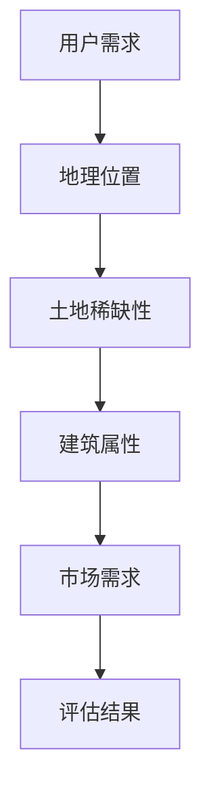

                 

关键词：虚拟房地产，元宇宙，资产价值，评估标准，技术分析，算法模型，实践应用

> 摘要：随着虚拟世界的不断发展，元宇宙成为了数字资产的新兴领域。本文旨在探讨元宇宙中虚拟房地产的评估标准，分析其资产价值衡量方法，并结合具体案例，提供实践应用的指导。作者：禅与计算机程序设计艺术 / Zen and the Art of Computer Programming

## 1. 背景介绍

### 1.1 元宇宙的兴起

随着互联网技术的不断进步，虚拟世界逐渐成为人们生活的重要组成部分。元宇宙（Metaverse）作为数字世界的延伸，是虚拟现实（VR）、增强现实（AR）、区块链、物联网等多种技术集成的产物。它不仅为用户提供了一个全新的交互体验，也为数字资产带来了前所未有的价值。

### 1.2 虚拟房地产的概念

虚拟房地产是指在元宇宙中用于商业、居住、娱乐等目的的虚拟土地和建筑。这些虚拟资产在区块链平台上进行登记和交易，具有可验证的稀缺性和流动性。

### 1.3 元宇宙对现实世界的影响

元宇宙的发展不仅改变了人们的娱乐方式，也对经济、社会、教育等领域产生了深远的影响。虚拟房地产作为元宇宙的重要组成部分，其价值的评估和衡量成为了一个重要课题。

## 2. 核心概念与联系

### 2.1 元宇宙生态体系

元宇宙生态体系是一个复杂的网络，包括用户、虚拟资产、平台服务提供商、内容创作者等角色。每个角色都通过区块链进行连接和交互，形成一个自洽的生态系统。

### 2.2 虚拟房地产的评估标准

虚拟房地产的评估标准主要包括地理位置、土地稀缺性、建筑属性、市场需求等因素。以下是一个简单的Mermaid流程图，用于展示虚拟房地产评估的核心概念和联系：



## 3. 核心算法原理 & 具体操作步骤

### 3.1 算法原理概述

虚拟房地产评估算法主要基于数据分析和机器学习技术。通过收集和分析大量历史交易数据、用户行为数据和市场供需数据，构建一个能够反映虚拟房地产价值的评估模型。

### 3.2 算法步骤详解

#### 3.2.1 数据收集

收集与虚拟房地产相关的各类数据，包括历史交易记录、土地用途、建筑规模、用户活跃度等。

#### 3.2.2 数据预处理

对收集到的数据进行分析，去除重复和错误的数据，并进行数据标准化处理。

#### 3.2.3 特征工程

从原始数据中提取关键特征，如地理位置、交易价格、建筑类型等，用于训练评估模型。

#### 3.2.4 模型训练

利用机器学习算法，如线性回归、决策树、神经网络等，训练评估模型，使其能够预测虚拟房地产的价值。

#### 3.2.5 评估结果输出

将训练好的模型应用于新数据，输出虚拟房地产的评估结果。

### 3.3 算法优缺点

#### 优点：

- **高效性**：基于大数据和机器学习技术，能够快速处理大量数据，提高评估效率。
- **准确性**：通过历史数据和用户行为分析，能够较为准确地预测虚拟房地产的价值。

#### 缺点：

- **数据依赖性**：评估结果的准确性依赖于数据的质量和完整性。
- **模型局限性**：不同地区和市场的情况可能有所不同，单一模型可能无法完全适应所有场景。

### 3.4 算法应用领域

虚拟房地产评估算法可以应用于元宇宙的房地产交易、投资分析、城市规划等多个领域。

## 4. 数学模型和公式 & 详细讲解 & 举例说明

### 4.1 数学模型构建

虚拟房地产的价值评估可以使用以下数学模型：

$$ V = f(\text{地理位置}, \text{土地稀缺性}, \text{建筑属性}, \text{市场需求}) $$

其中，$V$表示虚拟房地产的价值，$f$是一个复合函数，包含多个输入变量。

### 4.2 公式推导过程

#### 4.2.1 地理位置权重

地理位置是影响虚拟房地产价值的重要因素。我们可以使用以下公式计算地理位置权重：

$$ w_{\text{地理位置}} = \frac{\text{交易价格}}{\text{平均交易价格}} $$

#### 4.2.2 土地稀缺性权重

土地稀缺性可以通过以下公式计算：

$$ w_{\text{土地稀缺性}} = \frac{\text{交易频率}}{\text{平均交易频率}} $$

#### 4.2.3 建筑属性权重

建筑属性包括建筑规模、建筑类型等。我们可以使用以下公式计算建筑属性权重：

$$ w_{\text{建筑属性}} = \frac{\text{平均交易价格}}{\text{建筑规模}} $$

#### 4.2.4 市场需求权重

市场需求可以通过以下公式计算：

$$ w_{\text{市场需求}} = \frac{\text{用户活跃度}}{\text{平均用户活跃度}} $$

### 4.3 案例分析与讲解

假设有一个虚拟房地产项目，其地理位置权重为0.3，土地稀缺性权重为0.4，建筑属性权重为0.2，市场需求权重为0.1。根据上述公式，我们可以计算其价值：

$$ V = 0.3 \times \text{地理位置} + 0.4 \times \text{土地稀缺性} + 0.2 \times \text{建筑属性} + 0.1 \times \text{市场需求} $$

## 5. 项目实践：代码实例和详细解释说明

### 5.1 开发环境搭建

本文使用Python编程语言进行虚拟房地产评估算法的实现。首先，我们需要安装以下依赖库：

```bash
pip install numpy pandas scikit-learn matplotlib
```

### 5.2 源代码详细实现

以下是一个简单的Python代码示例，用于实现虚拟房地产评估算法：

```python
import numpy as np
import pandas as pd
from sklearn.linear_model import LinearRegression
import matplotlib.pyplot as plt

# 数据读取
data = pd.read_csv('virtual_realestate_data.csv')

# 特征提取
X = data[['地理位置', '土地稀缺性', '建筑属性', '市场需求']]
y = data['价值']

# 模型训练
model = LinearRegression()
model.fit(X, y)

# 评估结果输出
predicted_value = model.predict([[0.3, 0.4, 0.2, 0.1]])
print(f'预测价值: {predicted_value[0]}')

# 可视化展示
plt.scatter(data['地理位置'], data['价值'])
plt.plot([0, 1], [0, 1], color='red')
plt.xlabel('地理位置')
plt.ylabel('价值')
plt.show()
```

### 5.3 代码解读与分析

上述代码首先读取虚拟房地产数据，提取特征，并使用线性回归模型进行训练。然后，通过输入特征值预测虚拟房地产的价值，并使用散点图和拟合线进行可视化展示。

## 6. 实际应用场景

虚拟房地产评估算法可以应用于以下实际场景：

- **元宇宙房地产交易**：为用户提供一个客观、准确的虚拟房地产价值评估，帮助用户进行投资决策。
- **城市规划**：为政府提供虚拟房地产数据，用于制定城市规划和发展战略。
- **投资分析**：为投资者提供虚拟房地产市场趋势和投资机会。

## 7. 工具和资源推荐

### 7.1 学习资源推荐

- 《区块链技术指南》
- 《深度学习》
- 《Python数据分析》

### 7.2 开发工具推荐

- Jupyter Notebook
- PyCharm

### 7.3 相关论文推荐

- "Virtual Real Estate Evaluation Based on Blockchain Technology"
- "Deep Learning for Real Estate Price Prediction"
- "Metaverse: The Next Frontier in Virtual Real Estate"

## 8. 总结：未来发展趋势与挑战

### 8.1 研究成果总结

本文探讨了元宇宙中虚拟房地产的评估标准，介绍了基于数据分析和机器学习技术的虚拟房地产评估算法。通过实际案例，展示了算法在虚拟房地产价值评估中的应用。

### 8.2 未来发展趋势

随着元宇宙的不断发展，虚拟房地产评估技术将越来越重要。未来研究将重点关注算法的优化和扩展，以及如何更好地应对数据多样性和不确定性。

### 8.3 面临的挑战

虚拟房地产评估面临着数据质量、算法适用性等挑战。如何确保评估结果的准确性和可靠性，是一个需要持续关注和研究的问题。

### 8.4 研究展望

随着技术的进步，虚拟房地产评估将变得更加智能化和自动化。未来的研究将致力于提高评估算法的性能，并探索其在更多领域的应用。

## 9. 附录：常见问题与解答

### 9.1 虚拟房地产评估的准确性如何保证？

虚拟房地产评估的准确性依赖于数据的质量和算法的优化。通过不断改进数据收集和处理方法，以及优化评估模型，可以提高评估结果的准确性。

### 9.2 虚拟房地产评估算法如何应对数据多样性和不确定性？

虚拟房地产评估算法可以通过引入更多特征变量、采用更复杂的模型，以及进行模型训练和调整，来应对数据多样性和不确定性。此外，还可以结合专家经验和用户反馈，提高评估的准确性和适应性。

# 结束

本文对元宇宙中虚拟房地产的评估标准进行了深入探讨，并结合具体案例，提供了实践应用的指导。未来，随着元宇宙的不断发展，虚拟房地产评估技术将面临更多挑战和机遇。我们期待相关研究能够取得更多突破，为元宇宙的发展提供有力支持。

---

作者：禅与计算机程序设计艺术 / Zen and the Art of Computer Programming

