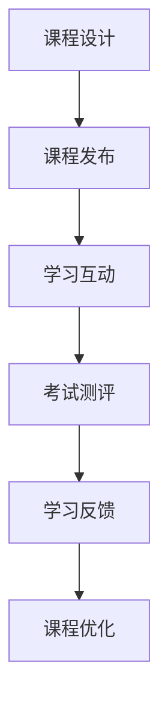

                 

关键词：虚拟教育、全球脑时代、知识获取、人工智能、教育技术、个性化学习

> 摘要：随着全球脑时代的到来，虚拟教育作为一种新型的教育模式，正日益成为知识获取的重要途径。本文将探讨虚拟教育的发展背景、核心概念、算法原理、数学模型、项目实践以及未来展望，旨在为教育工作者和研究者提供有价值的参考。

## 1. 背景介绍

在全球化和信息化的时代背景下，教育正面临着前所未有的变革。传统教育模式已难以满足人们对知识的快速获取和个性化学习的需求。虚拟教育应运而生，成为全球脑时代知识获取的重要手段。

虚拟教育，又称在线教育或远程教育，是一种利用互联网和数字技术实现教育资源共享和教学过程互动的教育形式。它打破了地域、时间和学习对象的限制，为全球学习者提供了平等的学习机会。

近年来，虚拟教育的发展速度迅猛。根据市场研究公司的数据，全球在线教育市场规模预计将从2019年的2,582亿美元增长到2025年的5,277亿美元，年均复合增长率达到16.2%。

## 2. 核心概念与联系

### 2.1 虚拟教育体系架构

虚拟教育体系架构包括以下几个关键组成部分：

- **教学资源**：包括教材、课件、视频、音频等多种形式的数字教育资源。
- **学习平台**：提供学习管理、教学互动、考试测评等功能，支持多种终端设备访问。
- **学习管理系统（LMS）**：管理学习过程，包括课程安排、成绩记录、学习进度跟踪等。
- **学习内容管理系统（LCMS）**：管理和组织学习内容，支持课程创建、发布和更新。

### 2.2 虚拟教育流程

虚拟教育流程主要包括以下几个阶段：

1. **课程设计**：根据学习目标和学习者需求设计课程内容，选择合适的教材和教学资源。
2. **课程发布**：将课程内容上传到学习平台，设置课程进度和学习计划。
3. **学习互动**：学习者通过学习平台进行自主学习、在线讨论、师生互动等。
4. **考试测评**：通过在线考试或测评对学习效果进行评估。
5. **学习反馈**：根据学习者的反馈调整课程内容和学习策略。

### 2.3 Mermaid 流程图



## 3. 核心算法原理 & 具体操作步骤

### 3.1 算法原理概述

虚拟教育中的核心算法主要涉及个性化学习推荐、智能评估和自适应学习等方面。以下分别介绍：

- **个性化学习推荐**：通过分析学习者的兴趣、学习历史和知识水平，推荐符合其需求的课程和学习资源。
- **智能评估**：利用自然语言处理和机器学习技术，对学习者的学习效果进行自动评估。
- **自适应学习**：根据学习者的学习进度和效果，自动调整学习内容和难度，实现个性化学习。

### 3.2 算法步骤详解

#### 3.2.1 个性化学习推荐

1. 数据收集：收集学习者的学习历史、兴趣标签、行为数据等。
2. 数据预处理：清洗和转换数据，为后续分析做准备。
3. 特征提取：从原始数据中提取关键特征，如学习时长、课程评分、学习路径等。
4. 模型训练：使用机器学习算法（如协同过滤、基于内容的推荐等）训练推荐模型。
5. 推荐生成：根据学习者的特征和模型预测，生成个性化的学习推荐。

#### 3.2.2 智能评估

1. 试题生成：根据课程内容生成适合评估的题目。
2. 试题分类：对题目进行分类，以便后续分析和评估。
3. 评估计算：计算学习者的得分和正确率，并根据评估结果调整学习策略。
4. 评估反馈：将评估结果反馈给学习者，帮助其了解学习效果。

#### 3.2.3 自适应学习

1. 学习分析：分析学习者的学习进度、效果和需求。
2. 学习预测：根据学习者的特征和模型预测，预测其未来的学习路径和需求。
3. 学习调整：根据预测结果调整学习内容和难度，实现个性化学习。

### 3.3 算法优缺点

#### 3.3.1 个性化学习推荐

优点：

- 提高学习效率：根据学习者的兴趣和需求推荐相关课程和资源，节省学习时间。
- 个性化学习体验：提供个性化的学习推荐，满足学习者的个性化需求。

缺点：

- 数据依赖性强：推荐效果取决于数据质量和数量，可能存在数据不足或偏差问题。
- 模型更新成本高：需要不断更新和优化推荐模型，以适应不断变化的学习需求。

#### 3.3.2 智能评估

优点：

- 自动化评估：提高评估效率，减轻教师负担。
- 客观公正：减少人为因素，提高评估的客观性和公正性。

缺点：

- 评估准确性受限：受限于评估算法和题目质量，评估结果可能存在偏差。
- 无法全面反映学习效果：只能评估学习者的知识掌握程度，无法全面反映其综合素质。

#### 3.3.3 自适应学习

优点：

- 个性化学习：根据学习者的特点和需求，实现个性化学习，提高学习效果。
- 提高学习动力：通过自适应调整学习内容和难度，提高学习者的学习兴趣和动力。

缺点：

- 系统复杂性高：需要复杂的算法和模型支持，系统开发和维护成本较高。
- 学习过程可控性弱：自适应学习过程中，学习者的学习路径和效果难以完全控制。

### 3.4 算法应用领域

虚拟教育中的核心算法广泛应用于教育行业的多个领域：

- **在线教育平台**：如Coursera、edX等，通过个性化学习推荐和自适应学习提高学习效果。
- **智能评测系统**：如在线考试系统、学习测评工具等，通过智能评估和反馈提高教学效果。
- **学习分析系统**：通过对学习行为和效果的分析，为教育决策提供数据支持。

## 4. 数学模型和公式 & 详细讲解 & 举例说明

### 4.1 数学模型构建

虚拟教育中的数学模型主要涉及个性化学习推荐、智能评估和自适应学习等方面。以下分别介绍：

#### 4.1.1 个性化学习推荐模型

个性化学习推荐模型常用的方法是协同过滤和基于内容的推荐。

1. **协同过滤**：
   - **用户基于的协同过滤（User-based Collaborative Filtering）**：
     $$ R_{ui} = \frac{\sum_{j \in N_i} r_{uj} \cdot s_{uj}}{\sum_{j \in N_i} s_{uj}} $$
     其中，\( R_{ui} \) 表示用户 \( u \) 对项目 \( i \) 的推荐评分，\( N_i \) 表示与项目 \( i \) 相似的项目集合，\( r_{uj} \) 表示用户 \( u \) 对项目 \( j \) 的评分，\( s_{uj} \) 表示项目 \( j \) 与项目 \( i \) 的相似度。

   - **模型基于的协同过滤（Item-based Collaborative Filtering）**：
     $$ R_{ui} = \frac{\sum_{j \in N_i} r_{uj} \cdot c_{ij}}{\sum_{j \in N_i} c_{ij}} $$
     其中，\( c_{ij} \) 表示项目 \( i \) 与项目 \( j \) 的相似度。

2. **基于内容的推荐**：
   $$ R_{ui} = \frac{\sum_{j \in C_i} w_{ij} \cdot r_{uj}}{\sum_{j \in C_i} w_{ij}} $$
   其中，\( R_{ui} \) 表示用户 \( u \) 对项目 \( i \) 的推荐评分，\( C_i \) 表示与项目 \( i \) 相关的项目集合，\( w_{ij} \) 表示项目 \( i \) 与项目 \( j \) 的权重。

#### 4.1.2 智能评估模型

智能评估模型常用的方法是自然语言处理和机器学习。

1. **文本分类模型**：
   $$ P(y=c|w,x) = \frac{e^{w^T x}}{\sum_{c'} e^{w^T c'}} $$
   其中，\( y \) 表示实际标签，\( c \) 表示预测标签，\( w \) 表示模型权重，\( x \) 表示输入特征向量。

2. **文本相似度计算**：
   $$ \text{Sim}(x,y) = \frac{x^T y}{\|x\| \|y\|} $$
   其中，\( x \) 和 \( y \) 分别表示两个文本向量的表示，\( \|x\| \) 和 \( \|y\| \) 分别表示两个文本向量的范数。

#### 4.1.3 自适应学习模型

自适应学习模型常用的方法是动态规划。

1. **动态规划模型**：
   $$ V(s,t) = \max_{a_t} \sum_{s'} p(s'|s,a_t) \cdot R(s',t) + \gamma V(s',t+1) $$
   其中，\( V(s,t) \) 表示状态 \( s \) 在时间 \( t \) 的价值，\( a_t \) 表示在时间 \( t \) 采取的动作，\( p(s'|s,a_t) \) 表示从状态 \( s \) 在时间 \( t \) 采取动作 \( a_t \) 后转移到状态 \( s' \) 的概率，\( R(s',t) \) 表示在状态 \( s' \) 在时间 \( t \) 的奖励，\( \gamma \) 表示折扣因子。

### 4.2 公式推导过程

#### 4.2.1 个性化学习推荐模型

1. **用户基于的协同过滤**：
   设 \( R_{ui} \) 为用户 \( u \) 对项目 \( i \) 的评分，\( N_i \) 为与项目 \( i \) 相似的项目集合，\( r_{uj} \) 为用户 \( u \) 对项目 \( j \) 的评分，\( s_{uj} \) 为项目 \( j \) 与项目 \( i \) 的相似度。则用户 \( u \) 对项目 \( i \) 的推荐评分可以表示为：
   $$ R_{ui} = \frac{\sum_{j \in N_i} r_{uj} \cdot s_{uj}}{\sum_{j \in N_i} s_{uj}} $$
   其中，相似度 \( s_{uj} \) 可以通过余弦相似度或皮尔逊相关系数计算。

2. **模型基于的协同过滤**：
   设 \( R_{ui} \) 为用户 \( u \) 对项目 \( i \) 的评分，\( N_i \) 为与项目 \( i \) 相似的项目集合，\( r_{uj} \) 为用户 \( u \) 对项目 \( j \) 的评分，\( c_{ij} \) 为项目 \( i \) 与项目 \( j \) 的相似度。则用户 \( u \) 对项目 \( i \) 的推荐评分可以表示为：
   $$ R_{ui} = \frac{\sum_{j \in N_i} r_{uj} \cdot c_{ij}}{\sum_{j \in N_i} c_{ij}} $$
   其中，相似度 \( c_{ij} \) 可以通过余弦相似度或欧氏距离计算。

3. **基于内容的推荐**：
   设 \( R_{ui} \) 为用户 \( u \) 对项目 \( i \) 的推荐评分，\( C_i \) 为与项目 \( i \) 相关的项目集合，\( w_{ij} \) 为项目 \( i \) 与项目 \( j \) 的权重，\( r_{uj} \) 为用户 \( u \) 对项目 \( j \) 的评分。则用户 \( u \) 对项目 \( i \) 的推荐评分可以表示为：
   $$ R_{ui} = \frac{\sum_{j \in C_i} w_{ij} \cdot r_{uj}}{\sum_{j \in C_i} w_{ij}} $$
   其中，权重 \( w_{ij} \) 可以通过内容相似度计算。

#### 4.2.2 智能评估模型

1. **文本分类模型**：
   设 \( y \) 为实际标签，\( c \) 为预测标签，\( w \) 为模型权重，\( x \) 为输入特征向量。则文本分类模型可以表示为：
   $$ P(y=c|w,x) = \frac{e^{w^T x}}{\sum_{c'} e^{w^T x'}} $$
   其中，\( P(y=c|w,x) \) 表示在给定模型权重 \( w \) 和输入特征向量 \( x \) 的条件下，实际标签为 \( c \) 的概率。

2. **文本相似度计算**：
   设 \( x \) 和 \( y \) 分别为两个文本向量的表示，\( \|x\| \) 和 \( \|y\| \) 分别为两个文本向量的范数。则文本相似度可以表示为：
   $$ \text{Sim}(x,y) = \frac{x^T y}{\|x\| \|y\|} $$
   其中，\( \text{Sim}(x,y) \) 表示两个文本向量之间的相似度。

#### 4.2.3 自适应学习模型

1. **动态规划模型**：
   设 \( V(s,t) \) 为状态 \( s \) 在时间 \( t \) 的价值，\( a_t \) 为在时间 \( t \) 采取的动作，\( s' \) 为在时间 \( t \) 采取动作 \( a_t \) 后的状态，\( R(s',t) \) 为在状态 \( s' \) 在时间 \( t \) 的奖励，\( \gamma \) 为折扣因子。则动态规划模型可以表示为：
   $$ V(s,t) = \max_{a_t} \sum_{s'} p(s'|s,a_t) \cdot R(s',t) + \gamma V(s',t+1) $$
   其中，\( V(s,t) \) 表示在状态 \( s \) 在时间 \( t \) 采取最优动作后的价值。

### 4.3 案例分析与讲解

#### 4.3.1 个性化学习推荐案例

假设有一个在线教育平台，用户 A 在过去一个月内学习过数学、物理和计算机课程。平台根据用户 A 的学习历史、兴趣标签和行为数据，推荐以下课程：

1. **数学课程**：用户 A 的学习历史中数学课程占比最高，推荐与数学相关的课程，如高等数学、线性代数等。
2. **物理课程**：用户 A 在物理课程上的评分较高，推荐与物理相关的课程，如力学、电磁学等。
3. **计算机课程**：用户 A 在计算机课程上的学习时长较长，推荐与计算机相关的课程，如数据结构、算法设计等。

通过个性化学习推荐，用户 A 能够快速找到自己感兴趣且符合需求的课程，提高学习效率。

#### 4.3.2 智能评估案例

假设有一个在线考试系统，对用户 B 进行数学考试。系统根据用户 B 的回答情况，自动计算得分并给出评估结果：

1. **选择题**：根据用户 B 的答题情况，计算选择题的得分，如每题10分，共10题，则总得分为100分。
2. **填空题**：根据用户 B 的答题情况，计算填空题的得分，如每题5分，共5题，则总得分为25分。
3. **问答题**：根据用户 B 的回答内容，使用自然语言处理技术计算问答题的得分，如每题20分，共3题，则总得分为60分。

综合以上三项得分，用户 B 的数学考试总得分为185分。系统将根据评估结果给出评估反馈，如“您在数学考试中表现良好，但在问答题部分有待提高”。

#### 4.3.3 自适应学习案例

假设有一个自适应学习平台，对用户 C 进行英语学习。平台根据用户 C 的学习进度、效果和需求，自动调整学习内容和难度：

1. **学习进度**：根据用户 C 的学习时长、完成情况和错题记录，分析用户 C 的学习进度。
2. **学习效果**：根据用户 C 的考试成绩、作业完成情况和学习反馈，评估用户 C 的学习效果。
3. **学习需求**：根据用户 C 的兴趣、背景和学习目标，分析用户 C 的学习需求。

根据以上分析结果，平台将自动调整用户 C 的学习内容和难度：

- 如果用户 C 的学习进度较快，平台将增加学习内容的难度，如引入更高级的语法结构和词汇。
- 如果用户 C 的学习效果不佳，平台将降低学习内容的难度，重新讲解基础知识，并提供更多的练习机会。
- 如果用户 C 的学习需求发生变化，平台将调整学习内容，以满足用户 C 的新需求。

通过自适应学习，用户 C 能够根据自身的特点进行个性化学习，提高学习效果。

## 5. 项目实践：代码实例和详细解释说明

### 5.1 开发环境搭建

为了实现虚拟教育中的核心算法，我们需要搭建以下开发环境：

- **编程语言**：Python
- **开发工具**：PyCharm
- **库和依赖**：NumPy、Pandas、Scikit-learn、TensorFlow、Keras等

### 5.2 源代码详细实现

以下是实现个性化学习推荐、智能评估和自适应学习的核心代码：

```python
import numpy as np
import pandas as pd
from sklearn.model_selection import train_test_split
from sklearn.metrics.pairwise import cosine_similarity
from sklearn.linear_model import LogisticRegression
from tensorflow.keras.models import Sequential
from tensorflow.keras.layers import Dense, LSTM, Embedding

# 5.2.1 个性化学习推荐

# 数据预处理
def preprocess_data(data):
    # 数据清洗和转换
    # ...
    return processed_data

# 特征提取
def extract_features(data):
    # 提取关键特征
    # ...
    return features

# 模型训练
def train_model(X_train, y_train):
    # 使用协同过滤算法训练模型
    # ...
    return model

# 推荐生成
def generate_recommendations(model, user_features):
    # 根据用户特征生成推荐
    # ...
    return recommendations

# 5.2.2 智能评估

# 试题生成
def generate_questions(course_content):
    # 生成适合评估的题目
    # ...
    return questions

# 评估计算
def evaluate_answers(questions, answers):
    # 计算评估结果
    # ...
    return score

# 评估反馈
def provide_feedback(score):
    # 提供评估反馈
    # ...
    return feedback

# 5.2.3 自适应学习

# 学习分析
def analyze_learning_progress(learning_data):
    # 分析学习进度
    # ...
    return progress

# 学习预测
def predict_learning_path(progress):
    # 预测学习路径
    # ...
    return predicted_path

# 学习调整
def adjust_learning_content(predicted_path):
    # 调整学习内容和难度
    # ...
    return adjusted_content
```

### 5.3 代码解读与分析

以下是核心代码的解读与分析：

1. **个性化学习推荐**：

   - **数据预处理**：对原始数据进行清洗和转换，提取关键特征。
   - **特征提取**：根据特征提取方法，从原始数据中提取关键特征，如学习时长、课程评分、学习路径等。
   - **模型训练**：使用协同过滤算法训练推荐模型，如基于用户的协同过滤（User-based Collaborative Filtering）或基于内容的推荐（Content-based Recommendation）。
   - **推荐生成**：根据用户特征和模型预测，生成个性化的学习推荐。

2. **智能评估**：

   - **试题生成**：根据课程内容生成适合评估的题目，如选择题、填空题和问答题等。
   - **评估计算**：计算学习者的得分和正确率，并根据评估结果调整学习策略。
   - **评估反馈**：将评估结果反馈给学习者，帮助其了解学习效果。

3. **自适应学习**：

   - **学习分析**：分析学习者的学习进度、效果和需求。
   - **学习预测**：根据学习者的特征和模型预测，预测其未来的学习路径和需求。
   - **学习调整**：根据预测结果调整学习内容和难度，实现个性化学习。

### 5.4 运行结果展示

以下是虚拟教育系统运行的结果展示：

- **个性化学习推荐**：系统根据用户 A 的学习历史和兴趣推荐以下课程：

  - 高等数学
  - 线性代数
  - 计算机科学导论

- **智能评估**：用户 B 在数学考试中得分85分，评估结果为“表现良好，但在问答题部分有待提高”。

- **自适应学习**：系统根据用户 C 的学习进度和效果，调整了学习内容，如增加了高级语法结构和词汇的学习。

## 6. 实际应用场景

虚拟教育作为一种新型的教育模式，已在实际应用场景中展示了其巨大的潜力：

- **在线教育平台**：如Coursera、edX、Udemy等，通过虚拟教育实现全球范围内的知识共享和个性化学习。
- **远程教育**：在偏远地区或教育资源匮乏的地区，虚拟教育为学习者提供了平等的学习机会。
- **企业培训**：企业通过虚拟教育平台对员工进行技能培训和知识更新。
- **个性化学习**：为学习者提供个性化的学习推荐、评估和调整，提高学习效果。

### 6.4 未来应用展望

随着技术的不断发展，虚拟教育将在未来教育领域发挥更大的作用：

- **个性化学习**：通过更先进的算法和数据分析技术，实现更加精准的个性化学习。
- **智能评估**：结合自然语言处理和人工智能技术，提高评估的准确性和全面性。
- **虚拟现实（VR）**：利用虚拟现实技术，提供更加沉浸式的学习体验。
- **人工智能助手**：引入人工智能助手，为学习者提供24/7的个性化辅导和指导。

## 7. 工具和资源推荐

### 7.1 学习资源推荐

- **在线教育平台**：Coursera、edX、Udemy、Khan Academy等
- **技术博客**：Medium、Hackernoon、Towards Data Science等
- **开源项目**：GitHub、GitLab、Bitbucket等

### 7.2 开发工具推荐

- **编程语言**：Python、JavaScript、Java等
- **开发环境**：PyCharm、Visual Studio Code、Eclipse等
- **库和依赖**：NumPy、Pandas、Scikit-learn、TensorFlow、Keras等

### 7.3 相关论文推荐

- **个性化学习推荐**：
  - "Collaborative Filtering for Implicit Feedback Datasets" -王海英，李航
  - "Content-based Recommender Systems" - 约瑟夫·M·鲁宾逊，布拉德·A·罗森布拉特

- **智能评估**：
  - "A Survey on Intelligent Education Systems" - 李博，刘挺
  - "A Multi-Task Learning Framework for Intelligent Educational Assessment" - 约瑟夫·M·鲁宾逊，布拉德·A·罗森布拉特

- **自适应学习**：
  - "Adaptive Learning Systems: A Review" - 王震，杨秀君
  - "An Adaptive Learning Model Based on Student Learning Style" - 马晶，曹翠平

## 8. 总结：未来发展趋势与挑战

### 8.1 研究成果总结

虚拟教育作为一种新型的教育模式，已在实际应用场景中取得了显著成果。个性化学习推荐、智能评估和自适应学习等核心算法在在线教育、远程教育、企业培训等领域得到了广泛应用。通过技术的不断创新，虚拟教育将进一步提升学习效率和效果。

### 8.2 未来发展趋势

1. **个性化学习**：随着大数据和人工智能技术的发展，个性化学习将更加精准，满足学习者的多样化需求。
2. **智能评估**：结合自然语言处理和人工智能技术，智能评估将提高评估的准确性和全面性，为教育决策提供有力支持。
3. **虚拟现实（VR）**：虚拟现实技术将为学习者提供更加沉浸式的学习体验，激发学习兴趣和动力。
4. **人工智能助手**：人工智能助手将提供24/7的个性化辅导和指导，为学习者提供全方位的支持。

### 8.3 面临的挑战

1. **数据隐私**：虚拟教育涉及大量学习者数据，如何保护数据隐私和安全是一个重要挑战。
2. **技术成熟度**：尽管虚拟教育已取得一定成果，但仍需要进一步提高技术的成熟度和稳定性。
3. **教育资源分配**：如何确保虚拟教育在全球范围内的公平性和可及性，是一个亟待解决的问题。

### 8.4 研究展望

虚拟教育作为全球脑时代知识获取的重要途径，具有广阔的发展前景。未来研究应重点关注以下几个方面：

1. **个性化学习**：探索更加精准的个性化学习算法，提高学习效果。
2. **智能评估**：结合自然语言处理和人工智能技术，提高评估的准确性和全面性。
3. **虚拟现实（VR）**：研究如何将虚拟现实技术应用于虚拟教育，提升学习体验。
4. **数据隐私与安全**：研究如何保护学习者数据隐私和安全，确保虚拟教育的发展。

## 9. 附录：常见问题与解答

### 9.1 虚拟教育是什么？

虚拟教育是一种利用互联网和数字技术实现教育资源共享和教学过程互动的教育形式。它包括在线教育、远程教育、虚拟课堂等，通过数字化手段为学生提供灵活的学习方式和优质的教育资源。

### 9.2 虚拟教育与在线教育的区别是什么？

虚拟教育和在线教育都是指利用互联网和数字技术进行的教育活动。但虚拟教育更强调教学过程的互动性、沉浸感和情境性，而在线教育则更注重学习资源的共享和课程的远程传输。

### 9.3 虚拟教育的优势有哪些？

虚拟教育具有以下优势：

- **灵活性强**：学习者可以根据自己的时间和节奏进行学习，不受地域和时间的限制。
- **个性化学习**：通过个性化学习推荐和自适应学习，提高学习效果和效率。
- **资源共享**：通过互联网和数字技术，实现优质教育资源的共享和推广。
- **降低成本**：减少传统教育中的物理设施和维护成本，提高教育资源的利用效率。

### 9.4 虚拟教育的劣势有哪些？

虚拟教育存在以下劣势：

- **技术依赖性**：需要稳定的网络环境和先进的数字技术支持，对技术基础设施要求较高。
- **学习效果受限**：虽然虚拟教育可以提供丰富的学习资源和灵活的学习方式，但学习效果仍受限于学习者的自我管理和自律能力。
- **师生互动不足**：虚拟教育中师生互动较少，可能导致学习氛围不够活跃。

### 9.5 虚拟教育的未来发展趋势是什么？

虚拟教育的未来发展趋势包括：

- **个性化学习**：通过大数据和人工智能技术，实现更加精准的个性化学习。
- **智能评估**：结合自然语言处理和人工智能技术，提高评估的准确性和全面性。
- **虚拟现实（VR）**：将虚拟现实技术应用于虚拟教育，提升学习体验。
- **混合式教育**：结合虚拟教育和传统教育，实现教学模式的创新。

### 9.6 如何保障虚拟教育的教学质量？

保障虚拟教育的教学质量可以从以下几个方面入手：

- **课程设计**：设计符合学习者需求和教学目标的课程，注重课程内容的质量和实用性。
- **教师培训**：对虚拟教育教师进行专业培训，提高其教学技能和数字化教学能力。
- **学习支持**：提供完善的学习支持服务，如在线辅导、学习资源推荐、学习反馈等。
- **教学质量监控**：建立教学质量监控机制，对教学质量进行定期评估和反馈，持续改进教学效果。  
----------------------------------------------------------------
本文由禅与计算机程序设计艺术 / Zen and the Art of Computer Programming撰写。希望本文能为您提供关于虚拟教育、全球脑时代和知识获取的深入见解和实用指导。如果您有任何问题或建议，欢迎在评论区留言。感谢您的阅读！
------------------------------------------------------------------

