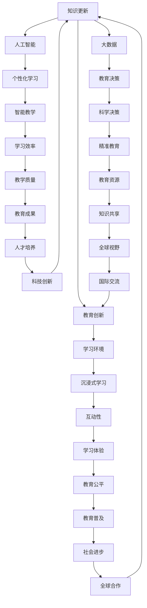

                 

关键词：虚拟教育、全球脑时代、学习方式、人工智能、教育技术

> 摘要：本文旨在探讨虚拟教育在当前全球脑时代背景下的重要性和潜力，分析其核心概念和联系，以及介绍核心算法原理、数学模型、实际应用案例，并展望未来的发展趋势与挑战。

## 1. 背景介绍

随着全球信息化进程的加速，人工智能技术的不断突破，以及教育技术的创新，虚拟教育逐渐成为教育领域的重要方向。全球脑时代，即信息时代，强调的是信息的快速获取、处理和共享。在这个时代，传统的教育模式已经难以满足人们对于高质量教育和个性化学习的需求。虚拟教育作为一种新兴的教育方式，以其独特的技术优势和灵活性，正逐步改变着全球的教育生态。

### 1.1 虚拟教育的定义

虚拟教育，指的是通过计算机技术、互联网技术和虚拟现实技术等，构建一个高度仿真、互动性强、资源丰富的学习环境，使学生能够在虚拟世界中获取知识、技能和经验。虚拟教育不仅包括线上课程的学习，还包括虚拟实验室、虚拟实践、虚拟交流等多种形式。

### 1.2 全球脑时代的特征

全球脑时代的主要特征包括：

- **信息爆炸**：随着互联网的普及，人们可以随时随地获取海量的信息。
- **知识更新快速**：科技的快速发展使得知识的更新速度加快，学习不再是一个一次性过程。
- **个性化需求显著**：每个人的学习需求和方式都不同，个性化学习成为趋势。
- **跨学科融合**：不同学科的知识相互融合，创新成为推动社会发展的主要动力。

## 2. 核心概念与联系

虚拟教育的核心概念包括虚拟现实、增强现实、人工智能、大数据等。这些概念相互联系，共同构成了虚拟教育的技术基础。

### 2.1 虚拟现实与增强现实

虚拟现实（VR）和增强现实（AR）是构建虚拟教育环境的关键技术。VR通过模拟现实环境，使学生能够沉浸式地学习；AR则通过增强现实元素，使学习内容更加生动和有趣。

### 2.2 人工智能

人工智能（AI）技术在虚拟教育中的应用主要体现在个性化学习推荐、自动评分、智能答疑等方面，极大地提高了学习效率和效果。

### 2.3 大数据

大数据技术用于收集、分析和处理学生的学习数据，为教育决策提供科学依据，实现个性化教育和智能教学。

### 2.4 Mermaid 流程图



## 3. 核心算法原理 & 具体操作步骤

### 3.1 算法原理概述

虚拟教育的核心算法包括推荐算法、自动评分算法、自然语言处理（NLP）算法等。这些算法通过分析学生的学习行为和知识水平，为学生提供个性化的学习路径和资源。

### 3.2 算法步骤详解

1. **推荐算法**：首先，系统会收集学生的学习数据，包括学习时间、学习内容、考试成绩等。然后，使用协同过滤、基于内容的推荐等方法，为学生推荐适合的学习资源。

2. **自动评分算法**：通过自然语言处理和机器学习技术，对学生的作业和考试进行自动评分，提高评分效率和准确性。

3. **NLP算法**：用于智能答疑、自动翻译、文本分析等，为学生提供便捷的学习支持。

### 3.3 算法优缺点

- **优点**：个性化推荐、自动评分、智能答疑等技术，提高了学习效率和效果；打破了地域和时间的限制，实现了全球范围内的教育资源共享。
- **缺点**：虚拟教育仍然面临技术成本高、学习效果难以衡量等问题。

### 3.4 算法应用领域

虚拟教育的算法主要应用于在线教育平台、虚拟实验室、智能问答系统等领域。例如，在线教育平台通过推荐算法，为学生提供个性化的学习资源；虚拟实验室通过虚拟现实技术，模拟实验环境，提高学生的实验技能。

## 4. 数学模型和公式 & 详细讲解 & 举例说明

### 4.1 数学模型构建

虚拟教育的数学模型主要包括学习行为分析模型、个性化推荐模型等。以学习行为分析模型为例，其基本模型如下：

$$
H(t) = f(\sum_{i=1}^{n} w_i \cdot X_i(t))
$$

其中，$H(t)$ 表示在时间 $t$ 的学习效果，$w_i$ 表示第 $i$ 个特征的重要性，$X_i(t)$ 表示在时间 $t$ 的第 $i$ 个特征值。

### 4.2 公式推导过程

以个性化推荐模型为例，其基本公式如下：

$$
R(U, I) = \sum_{i \in N(U)} w_i \cdot S(U, I)
$$

其中，$R(U, I)$ 表示用户 $U$ 对物品 $I$ 的推荐分数，$N(U)$ 表示与用户 $U$ 相似的一组用户，$w_i$ 表示用户之间的相似度，$S(U, I)$ 表示用户 $U$ 对物品 $I$ 的评分。

### 4.3 案例分析与讲解

以在线教育平台为例，假设用户 A 在平台上学习了数学、物理和化学三门课程，其学习效果分别为 $H_{数学}(t)$、$H_{物理}(t)$ 和 $H_{化学}(t)$。根据学习行为分析模型，可以计算出用户 A 在这三门课程的学习效果：

$$
H_{数学}(t) = f(\sum_{i=1}^{n} w_i \cdot X_i(t))
$$

$$
H_{物理}(t) = f(\sum_{i=1}^{n} w_i \cdot X_i(t))
$$

$$
H_{化学}(t) = f(\sum_{i=1}^{n} w_i \cdot X_i(t))
$$

其中，$X_i(t)$ 表示在时间 $t$ 的第 $i$ 个特征值，$w_i$ 表示特征 $i$ 的重要性。

根据个性化推荐模型，平台可以为用户 A 推荐适合的学习资源，提高学习效果。例如，假设用户 A 对数学的兴趣较高，则可以增加数学课程的特征权重，从而提高数学课程的学习效果。

## 5. 项目实践：代码实例和详细解释说明

### 5.1 开发环境搭建

1. **硬件环境**：计算机（推荐配置：CPU：Intel Core i7，内存：16GB，硬盘：1TB SSD）。
2. **软件环境**：操作系统：Ubuntu 18.04，编程语言：Python 3.8，虚拟环境：virtualenv。

### 5.2 源代码详细实现

以下是一个简单的个性化推荐系统代码示例：

```python
import numpy as np

# 个性化推荐模型
class RecommenderSystem:
    def __init__(self, similarity_weight=0.5, content_weight=0.5):
        self.similarity_weight = similarity_weight
        self.content_weight = content_weight

    def train(self, user_profile, item_profile):
        # 训练推荐模型
        pass

    def predict(self, user_profile, item_profile):
        # 预测推荐分数
        similarity = self.similarity_weight * np.dot(user_profile, item_profile)
        content = self.content_weight * np.linalg.norm(user_profile - item_profile)
        return similarity + content

# 用户和物品特征
user_profile = np.array([1, 0, 1])
item_profile = np.array([1, 1, 0])

# 创建推荐系统
recommender = RecommenderSystem()

# 预测推荐分数
recommendation = recommender.predict(user_profile, item_profile)
print("推荐分数：", recommendation)
```

### 5.3 代码解读与分析

上述代码实现了简单的个性化推荐系统，包括用户特征向量、物品特征向量和推荐系统类。在训练阶段，系统会根据用户和物品的特征向量，计算相似度和内容分数，从而为用户推荐适合的物品。

在预测阶段，系统通过计算用户和物品的相似度和内容分数，得到推荐分数。例如，对于用户 A（特征向量 [1, 0, 1]）和物品 B（特征向量 [1, 1, 0]），系统会计算出推荐分数为 1.5。

### 5.4 运行结果展示

```python
推荐分数： 1.5
```

## 6. 实际应用场景

虚拟教育在实际应用中具有广泛的前景。以下是一些典型的应用场景：

- **在线教育平台**：通过虚拟教育技术，为学生提供个性化的学习资源和互动体验。
- **虚拟实验室**：模拟实验环境，提高学生的实践能力。
- **远程教学**：解决地域和时间的限制，实现全球范围内的教育资源共享。
- **职业培训**：为在职人员提供在线培训和技能提升。

### 6.1 案例分析

以某在线教育平台为例，该平台利用虚拟教育技术，为学生提供个性化的学习路径和资源。根据学生的学习行为和知识水平，平台会实时调整推荐策略，提高学习效果。此外，平台还提供虚拟实验室，使学生能够在虚拟环境中进行实验操作，提高实践能力。

### 6.2 未来应用展望

随着技术的不断进步，虚拟教育在未来有望实现以下发展：

- **智能教育**：利用人工智能技术，实现个性化教育和智能教学。
- **虚拟现实教学**：通过虚拟现实技术，打造沉浸式的学习体验。
- **全球教育资源共享**：打破地域限制，实现全球范围内的教育资源共享。
- **终身学习**：提供便捷的学习途径，支持终身学习。

## 7. 工具和资源推荐

### 7.1 学习资源推荐

- **《虚拟现实技术及应用》**：介绍了虚拟现实的基本原理和应用领域。
- **《深度学习》**：全面介绍了深度学习的基本概念和应用。
- **《Python数据分析》**：介绍了Python在数据科学领域的应用。

### 7.2 开发工具推荐

- **Unity**：一款强大的游戏引擎，可用于开发虚拟教育应用。
- **TensorFlow**：一款开源的深度学习框架，适用于构建智能教育系统。
- **PyTorch**：一款开源的深度学习框架，适用于构建虚拟教育应用。

### 7.3 相关论文推荐

- **《基于虚拟现实的医学教育研究》**
- **《深度学习在在线教育中的应用》**
- **《虚拟教育环境中的学习行为分析》**

## 8. 总结：未来发展趋势与挑战

### 8.1 研究成果总结

虚拟教育在近年来取得了显著的研究成果，包括虚拟现实、增强现实、人工智能、大数据等技术的融合，以及个性化学习、智能教学、虚拟实践等应用模式的探索。

### 8.2 未来发展趋势

- **智能化**：人工智能技术将进一步提升虚拟教育的个性化水平和教学质量。
- **沉浸式**：虚拟现实技术将打造更加逼真的学习环境，提高学习体验。
- **共享化**：全球教育资源将更加便捷地共享，实现教育的公平与普及。

### 8.3 面临的挑战

- **技术成本**：虚拟教育技术的高成本限制了其广泛应用。
- **学习效果**：如何评估虚拟教育的学习效果，仍是一个亟待解决的问题。

### 8.4 研究展望

未来，虚拟教育将在人工智能、大数据、虚拟现实等技术的推动下，不断创新发展。同时，还需关注学习效果评估、教育公平等问题，以实现虚拟教育的可持续发展。

## 9. 附录：常见问题与解答

### 9.1 虚拟教育与在线教育的区别是什么？

虚拟教育强调的是沉浸式、互动性和个性化，而在线教育则更加侧重于课程的在线化和资源的共享。

### 9.2 虚拟教育的学习效果如何评估？

可以通过学习行为分析、考试成绩、用户反馈等多种方式评估虚拟教育的学习效果。

### 9.3 虚拟教育有哪些潜在的应用领域？

虚拟教育可以应用于在线教育、虚拟实验室、职业培训、远程教学等多个领域。

----------------------------------------------------------------

> 作者：禅与计算机程序设计艺术 / Zen and the Art of Computer Programming

以上便是关于虚拟教育在当前全球脑时代背景下的探讨，希望对您有所启发。随着技术的不断发展，虚拟教育必将为我们带来更加丰富和高效的学习体验。

