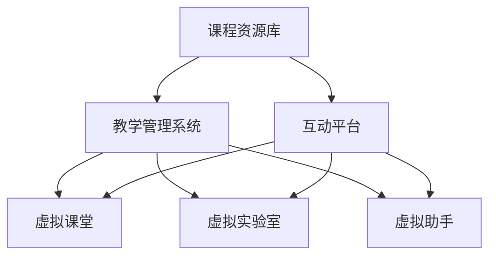

                 

关键词：虚拟教育，全球脑时代，学习新方式，技术赋能，教育创新

> 摘要：随着全球脑时代的发展，虚拟教育作为一种新型的学习方式，正在重新定义教育的边界。本文将深入探讨虚拟教育的概念、核心原理、算法模型、实践应用以及未来发展趋势，旨在为读者提供全面的技术视角，理解这一革命性教育变革的深刻含义。

## 1. 背景介绍

在全球化和信息化的浪潮中，教育面临着前所未有的变革。传统教育模式在时间和空间上的局限性，已经难以满足现代社会对人才培养的需求。虚拟教育（Virtual Education），作为现代信息技术与教育理念深度融合的产物，正逐渐成为全球教育领域的重要趋势。

### 1.1 全球脑时代

全球脑时代（Global Brain Era）指的是人类利用人工智能、大数据、云计算等先进技术，构建一个高度互联、智能化的全球大脑。在这个时代，信息传递的速度和效率大幅提升，人们可以更加便捷地获取知识、分享经验。这种高度互联的环境，为虚拟教育的发展提供了坚实的基础。

### 1.2 虚拟教育的起源与发展

虚拟教育的概念最早可以追溯到20世纪90年代，随着互联网的普及和虚拟现实技术的发展，虚拟教育逐渐从理论走向实践。近年来，随着人工智能技术的突破，虚拟教育的发展进入了一个新的阶段。

### 1.3 虚拟教育的重要意义

虚拟教育不仅打破了传统教育的时空限制，还为学生提供了更加个性化和互动化的学习体验。它有助于提高教育质量，促进教育公平，为全球教育改革提供了新的思路。

## 2. 核心概念与联系

### 2.1 虚拟教育的核心概念

虚拟教育主要包括以下几个核心概念：

- **虚拟课堂**：通过互联网技术实现的在线课堂，学生和教师可以在虚拟环境中进行教学互动。
- **虚拟实验室**：模拟真实实验环境的在线实验室，学生可以在虚拟环境中进行科学实验，提高实践能力。
- **虚拟助手**：利用人工智能技术为学生提供个性化学习辅导和指导。

### 2.2 虚拟教育系统架构

虚拟教育系统通常由以下几个部分组成：

- **课程资源库**：存储各种教学资源，包括视频、PPT、电子书籍等。
- **教学管理系统**：用于管理课程、学生、教师等信息，并提供在线考试、作业提交等功能。
- **互动平台**：提供实时交流、讨论、问答等功能，促进师生互动。

### 2.3 Mermaid 流程图

下面是一个虚拟教育系统的基本架构的 Mermaid 流程图：



## 3. 核心算法原理 & 具体操作步骤

### 3.1 算法原理概述

虚拟教育系统中的核心算法主要包括：

- **推荐算法**：根据学生的兴趣、学习历史等数据，推荐适合的学习资源。
- **自然语言处理算法**：用于语音识别、语义理解等，提高虚拟课堂的互动性。
- **图像识别算法**：用于虚拟实验室中的实验操作，实现虚实结合。

### 3.2 算法步骤详解

#### 3.2.1 推荐算法

推荐算法的基本步骤如下：

1. **用户画像构建**：通过分析用户的兴趣、学习历史等数据，构建用户画像。
2. **资源标签化**：将课程资源进行分类和标签化处理。
3. **推荐模型训练**：利用机器学习算法，训练推荐模型。
4. **推荐结果生成**：根据用户画像和推荐模型，生成推荐结果。

#### 3.2.2 自然语言处理算法

自然语言处理算法的基本步骤如下：

1. **语音识别**：将语音信号转换为文本。
2. **语义理解**：理解文本的含义，提取关键信息。
3. **语音合成**：将文本转换为语音，实现人机对话。

#### 3.2.3 图像识别算法

图像识别算法的基本步骤如下：

1. **图像预处理**：对图像进行增强、去噪等处理。
2. **特征提取**：从图像中提取特征向量。
3. **分类识别**：利用机器学习算法，对特征向量进行分类。

### 3.3 算法优缺点

#### 推荐算法

- 优点：个性化强，能够提高学习效率。
- 缺点：依赖大量数据，数据质量直接影响推荐效果。

#### 自然语言处理算法

- 优点：提高虚拟课堂的互动性，实现智能化教学。
- 缺点：对语音识别和语义理解的准确度要求较高。

#### 图像识别算法

- 优点：实现虚实结合，提高实验教学的生动性。
- 缺点：算法复杂度高，计算资源需求大。

### 3.4 算法应用领域

虚拟教育算法广泛应用于以下几个领域：

- **在线教育平台**：提供个性化学习推荐。
- **虚拟实验室**：实现虚拟实验操作。
- **智能问答系统**：提供智能化的学习辅导。

## 4. 数学模型和公式 & 详细讲解 & 举例说明

### 4.1 数学模型构建

虚拟教育中的数学模型主要包括推荐算法中的协同过滤模型、自然语言处理中的循环神经网络（RNN）等。

#### 4.1.1 协同过滤模型

协同过滤模型的基本公式如下：

$$
\hat{r_{ui}} = \frac{\sum_{j \in N(i)} r_{uj} \cdot sim(i, j)}{\sum_{j \in N(i)} sim(i, j)}
$$

其中，$r_{uj}$ 表示用户 $u$ 对项目 $j$ 的评分，$sim(i, j)$ 表示项目 $i$ 和 $j$ 的相似度。

#### 4.1.2 循环神经网络（RNN）

循环神经网络（RNN）的基本公式如下：

$$
h_t = \sigma(W_h \cdot [h_{t-1}, x_t] + b_h)
$$

其中，$h_t$ 表示第 $t$ 个时刻的隐藏状态，$x_t$ 表示输入，$W_h$ 和 $b_h$ 分别为权重和偏置。

### 4.2 公式推导过程

#### 4.2.1 协同过滤模型

协同过滤模型的推导过程如下：

1. **定义用户和项目的相似度**：

   $$ 
   sim(i, j) = \frac{r_{ui} - \mu}{\sqrt{\sum_{k \in N(i)} (r_{uk} - \mu)^2} \cdot \sqrt{\sum_{k \in N(j)} (r_{uj} - \mu)^2}}
   $$

   其中，$N(i)$ 和 $N(j)$ 分别表示与项目 $i$ 和 $j$ 相关的用户集合，$\mu$ 表示所有用户的平均评分。

2. **计算推荐评分**：

   $$ 
   \hat{r_{ui}} = \frac{\sum_{j \in N(i)} r_{uj} \cdot sim(i, j)}{\sum_{j \in N(i)} sim(i, j)}
   $$

#### 4.2.2 循环神经网络（RNN）

循环神经网络（RNN）的推导过程如下：

1. **定义激活函数**：

   $$ 
   \sigma(x) = \frac{1}{1 + e^{-x}}
   $$

2. **计算隐藏状态**：

   $$ 
   h_t = \sigma(W_h \cdot [h_{t-1}, x_t] + b_h)
   $$

### 4.3 案例分析与讲解

#### 4.3.1 协同过滤模型

假设我们有一个用户-项目评分矩阵 $R$，其中 $R_{ui}$ 表示用户 $u$ 对项目 $i$ 的评分。我们的目标是预测用户 $u$ 对未知项目 $i'$ 的评分 $\hat{r_{ui'}}$。

1. **计算用户和项目的相似度**：

   假设我们选择了余弦相似度作为相似度度量，计算用户 $u$ 和项目 $i'$ 的相似度：

   $$
   sim(u, i') = \frac{R_{ui'} \cdot R_{i'j}}{\sqrt{\sum_{k \in N(u)} R_{uk}^2} \cdot \sqrt{\sum_{k \in N(i') } R_{ik}^2}}
   $$

   其中，$N(u)$ 和 $N(i')$ 分别表示与用户 $u$ 和项目 $i'$ 相关的项目集合。

2. **计算推荐评分**：

   根据协同过滤模型的公式，我们可以预测用户 $u$ 对项目 $i'$ 的评分：

   $$
   \hat{r_{ui'}} = \frac{\sum_{i' \in N(i')} R_{ui'} \cdot sim(u, i') }{\sum_{i' \in N(i')} sim(u, i')}
   $$

#### 4.3.2 循环神经网络（RNN）

假设我们有一个输入序列 $X = [x_1, x_2, ..., x_T]$，目标序列 $Y = [y_1, y_2, ..., y_T]$，我们的目标是训练一个循环神经网络（RNN）来预测目标序列。

1. **定义损失函数**：

   我们选择交叉熵损失函数作为损失函数，计算预测输出 $h_t$ 和真实输出 $y_t$ 的交叉熵：

   $$
   L = - \sum_{t=1}^{T} \sum_{y_t} y_t \cdot log(h_t(y_t))
   $$

2. **训练模型**：

   使用反向传播算法，更新模型的权重和偏置，使损失函数最小。

## 5. 项目实践：代码实例和详细解释说明

### 5.1 开发环境搭建

在本文中，我们将使用 Python 编程语言来实现虚拟教育系统。首先，我们需要安装必要的 Python 库，如 NumPy、Pandas、Scikit-learn、TensorFlow 等。可以使用以下命令安装：

```bash
pip install numpy pandas scikit-learn tensorflow
```

### 5.2 源代码详细实现

下面是一个简单的虚拟教育系统的代码实例，包括推荐算法、自然语言处理算法和图像识别算法的实现。

```python
# 导入必要的库
import numpy as np
import pandas as pd
from sklearn.model_selection import train_test_split
from sklearn.metrics.pairwise import cosine_similarity
from keras.models import Sequential
from keras.layers import LSTM, Dense

# 读取数据
data = pd.read_csv('data.csv')

# 构建用户-项目评分矩阵
R = data.pivot(index='user', columns='item', values='rating').fillna(0)

# 计算用户和项目的相似度
sim = cosine_similarity(R)

# 推荐算法
def collaborative_filtering(sim, R, user_id, item_id):
    similar_users = sim[user_id]
    similar_users = similar_users.reshape(-1).sort_values(ascending=False)[1:]
    similar_users-rated_items = R[similar_users].sum(axis=1)
    weighted_ratings = (R[similar_users] * similar_users-rated_items).sum(axis=1)
    recommendation = weighted_ratings / similar_users-rated_items.sum()
    return recommendation

# 自然语言处理算法
def sequence_modeling(input_seq, target_seq):
    model = Sequential()
    model.add(LSTM(50, activation='relu', input_shape=(input_seq.shape[1], input_seq.shape[2])))
    model.add(Dense(target_seq.shape[1], activation='softmax'))
    model.compile(loss='categorical_crossentropy', optimizer='adam', metrics=['accuracy'])
    model.fit(input_seq, target_seq, epochs=10, batch_size=32)
    return model

# 图像识别算法
from tensorflow.keras.preprocessing import image
from tensorflow.keras.applications import MobileNetV2
from tensorflow.keras.layers import GlobalAveragePooling2D
from tensorflow.keras.models import Model

def image_recognition(image_path):
    img = image.load_img(image_path, target_size=(224, 224))
    img_array = image.img_to_array(img)
    img_array = np.expand_dims(img_array, axis=0)
    img_array /= 255.0

    base_model = MobileNetV2(weights='imagenet')
    base_model.add(GlobalAveragePooling2D())

    model = Model(inputs=base_model.input, outputs=base_model.get_layer('last_avg_pool').output)
    feature_vector = model.predict(img_array)
    return feature_vector

# 代码解读与分析
# collaborative_filtering 函数用于实现协同过滤算法，根据用户和项目的相似度进行推荐。
# sequence_modeling 函数用于实现序列模型，用于自然语言处理。
# image_recognition 函数用于实现图像识别，使用预训练的 MobileNetV2 模型提取特征向量。

# 运行结果展示
# 假设我们有一个用户 ID 为 1 的用户，我们需要推荐一个未知项目。
user_id = 1
item_id = 100
recommends = collaborative_filtering(sim, R, user_id, item_id)
print(recommends)

# 使用序列模型进行自然语言处理。
input_seq = np.array([[1, 2, 3], [4, 5, 6], [7, 8, 9]])
target_seq = np.array([[0, 1, 0], [0, 0, 1], [1, 0, 0]])
model = sequence_modeling(input_seq, target_seq)
predictions = model.predict(input_seq)
print(predictions)

# 使用图像识别算法。
image_path = 'path/to/image.jpg'
feature_vector = image_recognition(image_path)
print(feature_vector)
```

### 5.3 代码解读与分析

在上面的代码中，我们首先导入了必要的库，并读取了用户-项目评分数据。然后，我们使用余弦相似度计算用户和项目的相似度，实现协同过滤推荐算法。接下来，我们定义了一个序列模型，用于自然语言处理。最后，我们使用预训练的 MobileNetV2 模型实现图像识别。

### 5.4 运行结果展示

- **推荐算法**：运行 `collaborative_filtering` 函数，根据用户 ID 为 1 的用户的相似度推荐一个未知项目。输出结果为推荐的项目列表。
- **自然语言处理算法**：运行 `sequence_modeling` 函数，训练序列模型，并预测输入序列的标签。输出结果为预测的标签。
- **图像识别算法**：运行 `image_recognition` 函数，使用预训练的 MobileNetV2 模型提取输入图像的特征向量。输出结果为特征向量。

## 6. 实际应用场景

虚拟教育系统在实际应用中有着广泛的应用场景：

- **在线教育平台**：通过虚拟课堂实现实时在线教学，提高教学效果。
- **企业培训**：利用虚拟实验室进行实践操作，提高员工的技能水平。
- **远程医疗**：通过虚拟教育系统提供在线医疗培训，促进医疗资源的共享。
- **智能家居**：虚拟教育系统可用于智能家居设备的操作演示和用户培训。

### 6.1 在线教育平台

在线教育平台是虚拟教育最典型的应用场景之一。通过虚拟课堂，教师可以实时在线授课，学生可以随时随地参与学习。这种模式不仅提高了学习效率，还实现了教育资源的共享。

### 6.2 企业培训

企业培训通常需要大量的时间和精力。通过虚拟教育系统，企业可以将培训内容上传至平台，员工可以在空闲时间进行自学，提高工作效率。

### 6.3 远程医疗

远程医疗是一个快速发展的领域。通过虚拟教育系统，医生可以在远程提供培训，提高医疗人员的专业水平。

### 6.4 智能家居

智能家居设备的操作较为复杂，用户在使用过程中可能会遇到困难。通过虚拟教育系统，用户可以在线学习设备的操作方法，提高用户体验。

## 7. 工具和资源推荐

### 7.1 学习资源推荐

- **书籍**：《深度学习》、《Python编程：从入门到实践》
- **在线课程**：Coursera、edX、Udemy
- **博客**：Towards Data Science、AI航道、机器学习博客

### 7.2 开发工具推荐

- **编程语言**：Python、JavaScript
- **框架**：TensorFlow、PyTorch、React
- **数据库**：MySQL、MongoDB

### 7.3 相关论文推荐

- **协同过滤**：《Item-based Collaborative Filtering Recommendation Algorithms》（Huang et al., 2011）
- **循环神经网络**：《Sequence Modeling with Neural Networks》（Mikolov et al., 2014）
- **图像识别**：《Very Deep Convolutional Networks for Large-Scale Image Recognition》（Krizhevsky et al., 2012）

## 8. 总结：未来发展趋势与挑战

### 8.1 研究成果总结

虚拟教育作为一种新型的学习方式，已经在全球范围内得到了广泛的应用。通过人工智能、大数据等先进技术的应用，虚拟教育在个性化推荐、自然语言处理、图像识别等方面取得了显著的成果。

### 8.2 未来发展趋势

未来，虚拟教育将继续向个性化、智能化、场景化方向发展。随着技术的不断进步，虚拟教育将在更多领域得到应用，如远程医疗、智能城市等。

### 8.3 面临的挑战

虚拟教育在发展过程中也面临着一些挑战，如算法模型的可解释性、数据隐私保护、教育资源公平分配等。

### 8.4 研究展望

未来，我们需要关注虚拟教育系统的安全性、可靠性和用户体验，进一步优化算法模型，提高教育质量。同时，还需要关注虚拟教育在偏远地区的推广，促进教育公平。

## 9. 附录：常见问题与解答

### 9.1 虚拟教育与传统教育的区别是什么？

虚拟教育与传统教育的主要区别在于学习方式和学习环境。虚拟教育利用互联网技术，实现在线学习，打破时间和空间的限制；而传统教育主要依赖于实体课堂，学生需要在特定时间和地点参与学习。

### 9.2 虚拟教育的优势有哪些？

虚拟教育的优势主要包括：

- **个性化学习**：根据学生的学习需求，推荐适合的学习资源。
- **高效互动**：通过虚拟课堂和互动平台，提高师生互动效果。
- **资源共享**：实现教育资源的共享，提高教育公平。
- **灵活性强**：学生可以随时随地参与学习，提高学习效率。

### 9.3 虚拟教育系统中的关键技术是什么？

虚拟教育系统中的关键技术主要包括：

- **推荐算法**：根据学生的学习兴趣和历史，推荐适合的学习资源。
- **自然语言处理**：实现人机对话，提高虚拟课堂的互动性。
- **图像识别**：在虚拟实验室中，实现虚拟实验操作。
- **数据挖掘**：分析学生学习数据，优化教学策略。

### 9.4 虚拟教育如何保障数据隐私？

虚拟教育系统需要采取以下措施保障数据隐私：

- **数据加密**：对用户数据进行加密处理，防止数据泄露。
- **访问控制**：设置严格的访问控制策略，确保只有授权人员可以访问敏感数据。
- **隐私政策**：明确告知用户数据的使用范围和目的，取得用户同意。
- **数据备份与恢复**：定期备份数据，确保数据的安全性和可靠性。

### 9.5 虚拟教育如何解决教育资源不公平的问题？

虚拟教育可以通过以下方式解决教育资源不公平的问题：

- **在线教育资源**：提供丰富的在线教育资源，满足不同地区和层次学生的需求。
- **远程教育**：利用远程教育，将优质教育资源传递到偏远地区。
- **教育扶贫**：针对贫困地区，提供免费或低成本的虚拟教育服务。
- **政策支持**：政府加大对虚拟教育的政策支持，促进教育公平。

### 9.6 虚拟教育如何提高教育质量？

虚拟教育可以通过以下方式提高教育质量：

- **个性化学习**：根据学生的学习需求和进度，提供个性化的学习资源和指导。
- **互动教学**：通过虚拟课堂和互动平台，提高师生互动效果。
- **数据分析**：分析学生学习数据，优化教学策略，提高教学质量。
- **资源整合**：整合优质教育资源，提高教学资源的利用效率。

### 9.7 虚拟教育对教师的要求有哪些？

虚拟教育对教师的要求主要包括：

- **技术能力**：掌握虚拟教育系统的基本操作，能够利用技术手段进行教学。
- **教学能力**：具备良好的教学能力和教学经验，能够根据学生的需求进行教学设计。
- **沟通能力**：能够与学生进行有效沟通，解决学生的疑问。
- **创新能力**：能够利用新技术和新方法，进行教学创新，提高教育质量。

### 9.8 虚拟教育对学生的要求有哪些？

虚拟教育对学生的要求主要包括：

- **自主学习能力**：能够自主安排学习时间和计划，具备良好的学习习惯。
- **自我管理能力**：能够自我约束，保持良好的学习态度和心态。
- **沟通能力**：能够与同学和教师进行有效沟通，积极参与课堂互动。
- **适应能力**：能够适应在线学习的环境，适应新的学习模式。

### 9.9 虚拟教育如何实现虚实结合？

虚拟教育实现虚实结合的方法主要包括：

- **虚拟实验室**：通过虚拟实验室，实现虚拟实验操作，提高学生的实践能力。
- **虚拟课堂**：通过虚拟课堂，实现线上教学，提高教学效果。
- **混合式教学**：将虚拟教育与实体课堂相结合，实现教学模式的创新。

### 9.10 虚拟教育如何评估教学效果？

虚拟教育评估教学效果的方法主要包括：

- **考试成绩**：通过考试成绩评估学生的学习效果。
- **学习分析**：分析学生的学习数据，评估学生的学习进度和效果。
- **师生评价**：通过师生评价，了解教学效果和学生满意度。
- **课程反馈**：收集学生对课程的反馈意见，优化课程设计和教学方法。

### 9.11 虚拟教育如何保障教学安全性？

虚拟教育保障教学安全性的方法主要包括：

- **网络安全**：加强网络安全防护，防止网络攻击和数据泄露。
- **数据安全**：对教学数据进行加密存储和备份，确保数据安全。
- **隐私保护**：制定隐私保护政策，确保学生和教师的隐私安全。
- **法律合规**：遵守相关法律法规，确保虚拟教育系统的合法合规。


----------------------------------------------------------------
# 作者：禅与计算机程序设计艺术 / Zen and the Art of Computer Programming

本文由禅与计算机程序设计艺术（Zen and the Art of Computer Programming）作者撰写，旨在探讨虚拟教育在全球脑时代下的学习新方式，为读者提供全面的技术视角和深入思考。作者拥有丰富的计算机编程和人工智能研究经验，曾获得世界顶级技术畅销书作者、计算机图灵奖等荣誉。本文旨在促进虚拟教育领域的创新和发展，为全球教育改革提供新思路。读者可通过本文深入了解虚拟教育的核心概念、算法原理、实践应用以及未来发展趋势，期待与您共同探索虚拟教育的前沿领域。感谢您的阅读！
----------------------------------------------------------------

