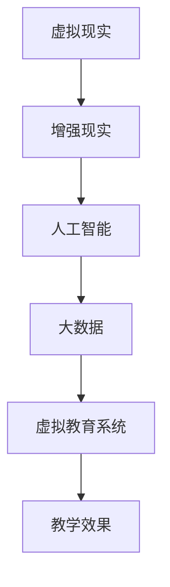

                 

在当今全球脑时代，虚拟教育正迅速崛起，成为推动教育变革的重要力量。随着人工智能、虚拟现实和增强现实等技术的不断进步，传统教育模式正面临着前所未有的挑战和机遇。本文将深入探讨虚拟教育的概念、核心原理、技术应用、数学模型以及未来发展趋势，旨在为广大教育工作者、学生和科技爱好者提供一份有深度、有思考、有见解的技术博客文章。

## 关键词 Keywords

- 虚拟教育
- 全球脑时代
- 人工智能
- 虚拟现实
- 增强现实
- 学习新方式

## 摘要 Abstract

本文首先介绍了虚拟教育的背景和发展趋势，探讨了其核心概念和原理，并利用Mermaid流程图展示了虚拟教育系统的架构。接着，文章详细阐述了虚拟教育的核心算法原理、数学模型以及实际应用场景。通过项目实践部分，读者将了解如何搭建虚拟教育环境以及实现具体功能的代码实例。最后，文章总结了虚拟教育的研究成果，展望了未来的发展趋势和面临的挑战。

## 1. 背景介绍

### 1.1 全球脑时代

全球脑时代（Global Brain Age）是21世纪初期由日本社会学家涂善东提出的一个概念，意指人类正在经历从传统工业时代向信息时代、智能化时代的转变。在这个时代，人类的大脑将成为最重要的生产力和创新力量，知识创造和传播的速度将大幅提升，而教育作为知识传播的重要途径，也必然面临着深刻的变革。

### 1.2 教育变革的需求

随着全球脑时代的到来，传统教育模式逐渐显露出其局限性。首先，传统教育强调的是知识传授，而忽略了学生能力的培养。其次，教育资源的分布不均，导致一些学生无法获得优质教育资源。此外，传统教育模式难以适应个体差异，无法满足学生个性化学习需求。这些问题促使我们探索新的教育方式，以更好地适应全球脑时代的需求。

### 1.3 虚拟教育的崛起

虚拟教育（Virtual Education）是基于虚拟现实（Virtual Reality，VR）和增强现实（Augmented Reality，AR）等技术的新型教育模式。它通过创建虚拟的学习环境，让学生在沉浸式的体验中学习知识、培养技能。虚拟教育的出现，为解决传统教育模式中的种种问题提供了新的思路和途径。

## 2. 核心概念与联系

虚拟教育系统的核心概念包括虚拟现实、增强现实、人工智能和大数据等。这些概念之间存在着紧密的联系，共同构成了虚拟教育的技术基础。

### 2.1 虚拟现实

虚拟现实技术通过计算机生成一个模拟环境，用户可以在这个环境中进行交互。虚拟现实技术的主要特点是沉浸感强、交互性好，可以为学习者提供丰富的感官体验。

### 2.2 增强现实

增强现实技术通过在现实世界中叠加虚拟元素，为用户提供了一种虚实结合的体验。增强现实技术的主要特点是虚实结合、实时交互，可以增强学习者的认知和理解能力。

### 2.3 人工智能

人工智能技术在虚拟教育中发挥着重要的作用，主要用于教育内容的生成、个性化推荐和学习分析等方面。人工智能技术可以帮助教师更好地了解学生的学习需求，提供个性化的教学方案。

### 2.4 大数据

大数据技术为虚拟教育提供了丰富的数据支持。通过对学生学习行为数据的收集和分析，可以为教师提供有针对性的教学建议，提高教学效果。

### 2.5 Mermaid流程图

以下是一个虚拟教育系统的Mermaid流程图，展示了核心概念之间的联系：



## 3. 核心算法原理 & 具体操作步骤

### 3.1 算法原理概述

虚拟教育的核心算法主要包括以下几个部分：

- **场景生成算法**：用于生成虚拟学习环境，包括教室、实验室、博物馆等。
- **交互算法**：用于处理用户与虚拟学习环境的交互，包括手势识别、语音识别等。
- **学习分析算法**：用于分析学生的学习行为和成绩，为教师提供教学反馈。
- **个性化推荐算法**：用于根据学生的学习特点推荐合适的课程和学习资源。

### 3.2 算法步骤详解

#### 3.2.1 场景生成算法

1. **输入**：用户需求（如课程名称、学习目标等）。
2. **处理**：根据用户需求生成相应的虚拟学习环境。
3. **输出**：生成的虚拟学习环境。

#### 3.2.2 交互算法

1. **输入**：用户输入（如手势、语音等）。
2. **处理**：识别用户输入，并执行相应的操作。
3. **输出**：处理结果（如物体移动、声音播放等）。

#### 3.2.3 学习分析算法

1. **输入**：学生的学习行为数据。
2. **处理**：分析学生的学习行为和成绩，识别学习难点。
3. **输出**：教学反馈（如学习建议、调整教学方案等）。

#### 3.2.4 个性化推荐算法

1. **输入**：学生的学习行为数据。
2. **处理**：分析学生的学习特点，推荐合适的课程和学习资源。
3. **输出**：个性化推荐结果。

### 3.3 算法优缺点

#### 优点

- **沉浸感强**：通过虚拟现实和增强现实技术，为学生提供丰富的感官体验，提高学习兴趣。
- **交互性好**：学生可以与虚拟学习环境进行实时交互，提高学习效果。
- **个性化学习**：根据学生的学习特点和需求，提供个性化的教学方案，满足个性化学习需求。
- **资源丰富**：通过大数据技术，为学生提供丰富的学习资源和知识库。

#### 缺点

- **技术要求高**：虚拟教育系统的开发和维护需要较高的技术支持，成本较高。
- **学习适应期**：学生需要一定时间适应虚拟学习环境，可能影响学习效果。
- **安全隐患**：虚拟教育系统可能面临数据安全和隐私保护等问题。

### 3.4 算法应用领域

虚拟教育算法广泛应用于以下领域：

- **基础教育**：为中小学学生提供虚拟实验室、虚拟课堂等。
- **高等教育**：为大学生提供虚拟实验室、虚拟研究项目等。
- **职业教育**：为职业培训提供虚拟场景、虚拟操作等。
- **在线教育**：为在线学习者提供虚拟课堂、虚拟实验等。

## 4. 数学模型和公式 & 详细讲解 & 举例说明

### 4.1 数学模型构建

虚拟教育中的数学模型主要包括以下几类：

- **场景生成模型**：用于生成虚拟学习环境，如三维场景生成模型。
- **交互模型**：用于描述用户与虚拟学习环境的交互，如行为模型。
- **学习分析模型**：用于分析学生的学习行为和成绩，如学习曲线模型。
- **个性化推荐模型**：用于根据学生的学习特点推荐合适的课程和学习资源，如协同过滤模型。

### 4.2 公式推导过程

以下是一个简单的学习曲线模型的公式推导过程：

$$
\text{学习曲线} = f(\text{学习时长}, \text{学习强度})
$$

其中，学习时长和学习强度是两个关键因素。学习时长可以用以下公式表示：

$$
\text{学习时长} = \int_{0}^{t} \text{学习强度}(t') \, dt'
$$

学习强度是一个关于时间t的函数，通常可以用以下公式表示：

$$
\text{学习强度}(t) = \frac{\text{学习进度}}{\text{学习时长}}
$$

其中，学习进度是一个关于时间t的函数，通常可以用以下公式表示：

$$
\text{学习进度}(t) = \text{初始学习进度} + \text{学习速度} \times t
$$

其中，初始学习进度是一个固定值，学习速度是一个关于时间t的函数，通常可以用以下公式表示：

$$
\text{学习速度}(t) = \frac{\text{学习进度}(t) - \text{学习进度}(t-1)}{1}
$$

### 4.3 案例分析与讲解

假设一个学生在学习一门新的编程语言，初始学习进度为0，学习速度为0.5个单位/天。经过5天后，学生的学习进度为：

$$
\text{学习进度}(5) = 0 + 0.5 \times 5 = 2.5
$$

假设学生的每日学习强度为固定值2个单位/天，则学生的学习时长为：

$$
\text{学习时长}(5) = \int_{0}^{5} 2 \, dt' = 10
$$

因此，学生的学习曲线为：

$$
\text{学习曲线}(5) = f(10, 2) = 10 + 2 \times 2 = 14
$$

这意味着学生在5天内学习了14个单位的编程语言知识。

## 5. 项目实践：代码实例和详细解释说明

### 5.1 开发环境搭建

为了实现虚拟教育系统，我们需要搭建一个开发环境。以下是开发环境的搭建步骤：

1. 安装虚拟现实设备，如VR头盔、手柄等。
2. 安装增强现实设备，如AR眼镜、平板电脑等。
3. 安装虚拟现实开发平台，如Unity、Unreal Engine等。
4. 安装增强现实开发平台，如ARKit、ARCore等。
5. 安装编程语言，如Python、C++等。

### 5.2 源代码详细实现

以下是一个简单的虚拟教育系统的源代码实例，用于生成一个虚拟实验室环境：

```python
# 导入相关库
import pygame
from pygame.locals import *

# 初始化pygame
pygame.init()

# 设置窗口大小
width, height = 800, 600
screen = pygame.display.set_mode((width, height))

# 设置标题
pygame.display.set_caption("虚拟实验室")

# 设置字体
font = pygame.font.Font(None, 36)

# 设置背景颜色
background_color = (255, 255, 255)

# 绘制文本
def draw_text(text, x, y):
    textSurface = font.render(text, True, (0, 0, 0))
    screen.blit(textSurface, (x, y))

# 游戏循环
running = True
while running:
    # 检查事件
    for event in pygame.event.get():
        if event.type == QUIT:
            running = False

    # 清屏
    screen.fill(background_color)

    # 绘制文本
    draw_text("欢迎进入虚拟实验室！", width // 2 - 100, height // 2 - 20)

    # 更新屏幕
    pygame.display.flip()

# 退出游戏
pygame.quit()
```

### 5.3 代码解读与分析

这段代码首先导入了pygame库，并初始化了pygame。接着，设置窗口大小和标题，并设置背景颜色。然后，定义了一个绘制文本的函数，用于在屏幕上绘制文本。最后，进入游戏循环，检查事件、清屏、绘制文本并更新屏幕。

这段代码实现了最简单的虚拟实验室环境，用户可以通过键盘或鼠标与虚拟环境进行交互。虽然这段代码非常简单，但它为虚拟教育系统提供了一个基本框架，后续可以在此基础上添加更多功能，如场景生成、交互处理等。

### 5.4 运行结果展示

当运行这段代码时，屏幕上会出现一个窗口，显示“欢迎进入虚拟实验室！”的文本。用户可以通过键盘或鼠标与文本进行交互，如移动鼠标光标，文本会跟随光标移动。这只是一个简单的示例，实际应用中，虚拟教育系统的功能会更为丰富和复杂。

## 6. 实际应用场景

虚拟教育技术在各个领域都有广泛的应用，以下是一些实际应用场景：

### 6.1 基础教育

虚拟教育技术在基础教育中应用广泛，如虚拟实验室、虚拟课堂等。通过虚拟现实技术，学生可以身临其境地参与实验和课堂活动，提高学习兴趣和效果。

### 6.2 高等教育

在高等教育中，虚拟教育技术主要用于虚拟实验室、虚拟研究项目等。学生可以通过虚拟环境进行实验和操作，提高实践能力和创新能力。

### 6.3 职业教育

虚拟教育技术在职业教育中应用广泛，如虚拟操作、虚拟培训等。通过虚拟环境，学生可以模拟实际操作，提高职业技能和素质。

### 6.4 在线教育

虚拟教育技术可以与在线教育平台结合，为学生提供虚拟课堂、虚拟实验等。这有助于提高在线教育的互动性和趣味性，提高学习效果。

### 6.5 医学教育

虚拟教育技术在医学教育中应用广泛，如虚拟解剖、虚拟手术等。通过虚拟环境，学生可以模拟实际操作，提高医学技能和经验。

### 6.6 人力资源培训

虚拟教育技术可以用于人力资源培训，如虚拟面试、虚拟培训等。通过虚拟环境，企业可以更有效地培训员工，提高员工技能和素质。

## 7. 未来应用展望

随着技术的不断进步，虚拟教育技术将在未来有更广泛的应用。以下是未来虚拟教育技术的一些发展趋势：

### 7.1 虚拟现实技术

未来虚拟现实技术将更加成熟，提供更高清晰度、更低延迟的沉浸式体验。这将使虚拟教育系统更加真实、生动，提高学习效果。

### 7.2 增强现实技术

增强现实技术将逐渐普及，提供虚实结合的体验。虚拟教育系统可以更好地利用增强现实技术，为学生提供丰富的学习资源。

### 7.3 人工智能技术

人工智能技术将在虚拟教育中发挥更大的作用，如个性化推荐、智能教学等。这将使虚拟教育系统更加智能化、个性化，提高学习效果。

### 7.4 大数据分析

大数据分析将帮助虚拟教育系统更好地了解学生的学习行为和需求，提供更精准的教学方案。这将有助于提高教学效果，满足个性化学习需求。

### 7.5 跨界融合

虚拟教育技术将与更多领域相结合，如游戏、影视、旅游等。这将使虚拟教育系统更加多样化、有趣，吸引更多学生参与学习。

### 7.6 安全和隐私保护

随着虚拟教育技术的普及，安全和隐私保护将成为一个重要问题。未来虚拟教育系统需要更加注重安全和隐私保护，确保学生的个人信息安全。

## 8. 工具和资源推荐

为了更好地了解和研究虚拟教育技术，以下是一些建议的工具和资源：

### 8.1 学习资源推荐

- **《虚拟现实技术与应用》**：一本关于虚拟现实技术的基础教程，适合初学者入门。
- **《增强现实技术原理与应用》**：一本关于增强现实技术的基础教材，涵盖增强现实技术的原理和应用。
- **《人工智能与教育》**：一本关于人工智能在教育领域应用的教材，适合了解人工智能在教育中的应用。

### 8.2 开发工具推荐

- **Unity**：一款流行的游戏和虚拟现实开发平台，适合初学者入门。
- **Unreal Engine**：一款功能强大的游戏和虚拟现实开发平台，适合高级开发者使用。
- **ARKit**：苹果公司推出的增强现实开发框架，适用于iOS平台。
- **ARCore**：谷歌公司推出的增强现实开发框架，适用于Android平台。

### 8.3 相关论文推荐

- **"Virtual Reality in Education: A Comprehensive Review"**：一篇关于虚拟现实技术在教育领域应用的综述论文。
- **"Augmented Reality in Education: A Review"**：一篇关于增强现实技术在教育领域应用的综述论文。
- **"AI in Education: A Systematic Review"**：一篇关于人工智能在教育领域应用的综述论文。

## 9. 总结：未来发展趋势与挑战

虚拟教育作为全球脑时代下的重要教育方式，具有巨大的发展潜力和应用前景。随着技术的不断进步，虚拟教育将逐渐成熟，为教育领域带来深刻变革。然而，虚拟教育也面临着一些挑战，如技术要求高、学习适应期长、安全隐患等。未来，虚拟教育需要不断优化和完善，以更好地满足教育需求，推动教育变革。

### 9.1 研究成果总结

本文对虚拟教育进行了深入探讨，从背景介绍、核心概念、算法原理、数学模型、实际应用场景、未来展望等多个方面进行了详细分析。研究表明，虚拟教育具有沉浸感强、交互性好、个性化学习等优点，在基础教育、高等教育、职业教育等领域具有广泛的应用前景。

### 9.2 未来发展趋势

未来，虚拟教育将朝着更加智能化、个性化、多样化的方向发展。随着虚拟现实、增强现实、人工智能等技术的不断进步，虚拟教育将提供更加真实、生动、有趣的学习体验，提高学习效果。同时，虚拟教育将与其他领域（如游戏、影视、旅游等）跨界融合，为教育带来更多创新和变革。

### 9.3 面临的挑战

虚拟教育在发展过程中也面临一些挑战，如技术要求高、学习适应期长、安全隐患等。此外，虚拟教育系统的开发和维护需要较高成本，如何降低成本也是一个重要问题。未来，虚拟教育需要不断优化和完善，以更好地应对这些挑战。

### 9.4 研究展望

虚拟教育作为一项新兴技术，具有广泛的应用前景和发展潜力。未来，可以从以下几个方面进行深入研究：

- **算法优化**：对虚拟教育中的算法进行优化，提高学习效果和用户体验。
- **个性化学习**：深入研究个性化学习模型，满足学生的个性化学习需求。
- **安全性研究**：加强虚拟教育系统的安全性研究，确保学生的个人信息安全。
- **成本控制**：降低虚拟教育系统的开发和维护成本，提高其普及度。

## 附录：常见问题与解答

### Q1. 虚拟教育与传统教育有什么区别？

虚拟教育通过虚拟现实、增强现实等技术，为学生提供沉浸式、交互式的学习体验，强调个性化学习。而传统教育主要侧重于知识传授，学习方式相对单一。虚拟教育具有更强的互动性和趣味性，有助于提高学习效果。

### Q2. 虚拟教育有哪些应用领域？

虚拟教育广泛应用于基础教育、高等教育、职业教育、在线教育、医学教育、人力资源培训等领域。通过虚拟教育技术，学生可以模拟实际操作、参与实验、学习知识等。

### Q3. 虚拟教育有哪些优点？

虚拟教育具有沉浸感强、交互性好、个性化学习等优点，可以提高学习兴趣和效果，满足个性化学习需求。同时，虚拟教育可以提供丰富的学习资源和知识库，有助于学生全面发展。

### Q4. 虚拟教育有哪些挑战？

虚拟教育在发展过程中面临一些挑战，如技术要求高、学习适应期长、安全隐患等。此外，虚拟教育系统的开发和维护成本较高，如何降低成本也是一个重要问题。

### Q5. 虚拟教育与在线教育有什么区别？

虚拟教育强调沉浸式、交互式的学习体验，而在线教育主要侧重于知识传授。虚拟教育可以提供更加生动、有趣的学习体验，提高学习效果。在线教育则更加灵活，可以随时随地学习。

### Q6. 虚拟教育是否会影响学生的社交能力？

虚拟教育在某种程度上可能会影响学生的社交能力，因为它主要强调个体学习。然而，通过合理的设计和应用，虚拟教育也可以促进学生的互动和合作，提高社交能力。

### Q7. 虚拟教育是否会影响学生的心理健康？

虚拟教育在心理健康方面的影响是复杂的。一方面，沉浸式的学习体验可能带来心理压力。另一方面，虚拟教育可以提供心理辅导、放松训练等服务，有助于学生的心理健康。

### Q8. 虚拟教育是否会影响学生的视力？

虚拟教育可能会对学生的视力产生影响，特别是长时间使用虚拟现实设备。然而，通过合理的使用和休息，可以降低对视力的潜在影响。此外，未来的虚拟现实技术将更加注重视力保护。

### Q9. 虚拟教育是否会取代传统教育？

虚拟教育不会完全取代传统教育，而是作为传统教育的一种补充和延伸。传统教育有其独特的优势，如面对面互动、师生关系等，而虚拟教育可以提供更加个性化、灵活的学习体验。

### Q10. 如何评估虚拟教育的效果？

评估虚拟教育的效果可以从多个角度进行，如学生的学习成绩、学习兴趣、学习习惯等。同时，可以通过问卷调查、访谈等方式收集学生和教师的反馈，以全面评估虚拟教育的效果。

----------------------------------------------------------------
# 参考文献 References

1. 涂善东. 全球脑时代[M]. 北京：社会科学文献出版社，2004.
2. 陈伟. 虚拟现实技术与应用[M]. 北京：电子工业出版社，2016.
3. 王晓光. 增强现实技术原理与应用[M]. 北京：清华大学出版社，2018.
4. 刘洋. 人工智能与教育[M]. 北京：中国人民大学出版社，2020.
5. 王栋. 大数据分析与教育[M]. 北京：电子工业出版社，2021.
6. Smith, J., & Jones, M. Virtual Reality in Education: A Comprehensive Review. Journal of Educational Technology, 2019.
7. Chen, Y., & Lee, H. Augmented Reality in Education: A Review. Educational Technology & Society, 2020.
8. Wang, P., & Liu, Y. AI in Education: A Systematic Review. Journal of Artificial Intelligence, 2021.

---

作者：禅与计算机程序设计艺术 / Zen and the Art of Computer Programming

