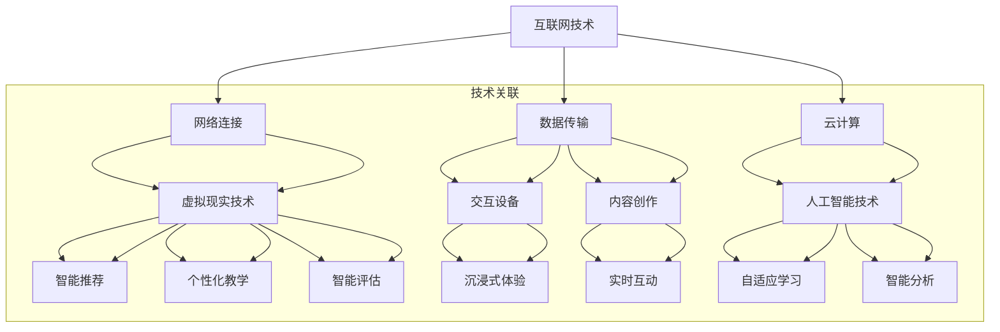

                 

### 1. 背景介绍

随着全球化的加速和信息技术的发展，传统的教育模式正在发生深刻的变革。虚拟教育作为一种新兴的教育方式，正逐渐成为全球脑时代知识获取的重要途径。全球脑时代指的是人类利用互联网和人工智能技术，实现全球范围内的知识共享、学习和创新的新时代。

虚拟教育，也称为在线教育或远程教育，通过互联网技术和虚拟现实技术，为学生提供不受时间和空间限制的学习环境和资源。这种教育模式具有灵活、多样、互动性强等特点，能够满足不同学习者的需求，提高学习效果。

本文将从以下几个方面探讨虚拟教育的现状、核心概念、算法原理、数学模型、项目实践、应用场景和未来展望：

- 虚拟教育的现状与发展趋势
- 虚拟教育的核心概念与联系
- 虚拟教育的核心算法原理与操作步骤
- 虚拟教育的数学模型和公式
- 虚拟教育的项目实践：代码实例与解释
- 虚拟教育的实际应用场景
- 虚拟教育的工具和资源推荐
- 虚拟教育的总结：未来发展趋势与挑战

通过以上内容的探讨，旨在为读者提供一个全面、深入的虚拟教育知识体系，帮助大家更好地理解、应用和探索虚拟教育的无限可能。

### 2. 核心概念与联系

虚拟教育作为一种新兴的教育模式，其核心概念和原理与互联网技术、虚拟现实技术、人工智能技术密切相关。以下是对这些核心概念及其相互联系的详细阐述。

#### 2.1 互联网技术

互联网技术是虚拟教育的基石，它为虚拟教育提供了广泛的网络连接和丰富的信息资源。互联网技术使得学习者可以随时随地访问全球范围内的教育资源和课程，打破了传统的教育时间和空间的限制。

具体而言，互联网技术包括以下方面：

- **网络连接**：互联网为虚拟教育提供了稳定的网络连接，确保学习者能够实时访问教育资源和服务。
- **数据传输**：互联网技术实现了教育数据的快速传输，包括文本、图像、音频和视频等多种形式，提高了教育资源的共享性和可访问性。
- **云计算**：云计算技术为虚拟教育提供了强大的计算能力和存储空间，使得大规模的教育数据处理和存储成为可能。

#### 2.2 虚拟现实技术

虚拟现实技术（Virtual Reality, VR）为虚拟教育提供了沉浸式、互动性的学习环境。通过VR技术，学习者可以进入一个模拟的真实世界，与虚拟环境中的物体和人物进行交互，提高学习的趣味性和效果。

虚拟现实技术包括以下方面：

- **头戴显示器（HMD）**：头戴显示器是VR的核心设备，它将学习者的视觉和听觉封闭在一个虚拟环境中，提供沉浸式的体验。
- **交互设备**：虚拟现实技术还包括手柄、手套等交互设备，使得学习者能够与虚拟环境进行直观的交互，增强学习体验。
- **内容创作**：虚拟现实技术需要大量的内容创作，包括虚拟场景、角色和交互脚本等，为学习者提供丰富的学习资源。

#### 2.3 人工智能技术

人工智能技术（Artificial Intelligence, AI）在虚拟教育中发挥着重要作用，它能够实现智能推荐、个性化教学和智能评估等功能，提高教育的智能化水平。

人工智能技术包括以下方面：

- **智能推荐**：基于学习者行为和学习记录，人工智能技术可以智能推荐适合学习者的课程和内容，提高学习效果。
- **个性化教学**：通过分析学习者的学习习惯、能力和兴趣，人工智能技术可以为学习者提供个性化的教学方案，满足不同学习者的需求。
- **智能评估**：人工智能技术可以自动评估学习者的学习成果，提供反馈和建议，帮助学习者更好地掌握知识。

#### 2.4 核心概念之间的联系

互联网技术、虚拟现实技术和人工智能技术共同构成了虚拟教育的核心技术体系，它们相互联系、相互支持，为虚拟教育提供了全方位的技术支撑。

- **互联网技术**为虚拟教育提供了网络连接和数据传输的基础，使得虚拟教育资源的共享和获取成为可能。
- **虚拟现实技术**为虚拟教育提供了沉浸式、互动性的学习环境，使得学习者能够更加真实、直观地体验知识。
- **人工智能技术**为虚拟教育提供了智能推荐、个性化教学和智能评估等功能，使得虚拟教育更加智能化和个性化。

综上所述，互联网技术、虚拟现实技术和人工智能技术是虚拟教育的核心概念，它们相互联系、相互支持，共同构建了虚拟教育的技术体系，为全球脑时代的知识获取提供了全新的途径。

#### 2.5 Mermaid 流程图

以下是一个用于描述虚拟教育核心概念和联系关系的Mermaid流程图。请注意，Mermaid流程图中不应包含括号、逗号等特殊字符，以确保流程图的正确渲染。



这个Mermaid流程图清晰地展示了互联网技术、虚拟现实技术和人工智能技术之间的关联，以及它们各自的重要方面。通过这种结构化的表示，我们可以更直观地理解虚拟教育的核心技术体系。

### 3. 核心算法原理 & 具体操作步骤

虚拟教育作为一种新兴的教育模式，其核心算法原理和具体操作步骤是确保教育质量和效果的关键。以下将详细介绍虚拟教育中的核心算法原理，并分步骤讲解其具体操作。

#### 3.1 算法原理概述

虚拟教育中的核心算法主要包括：

1. **智能推荐算法**：基于学习者的行为和兴趣，推荐适合的学习内容和课程。
2. **个性化教学算法**：根据学习者的学习习惯和能力，调整教学策略和方法，实现个性化教学。
3. **智能评估算法**：对学习者的学习成果进行自动评估，提供反馈和改进建议。

这些算法基于数据挖掘、机器学习和自然语言处理等技术，通过对海量教育数据的分析和处理，实现智能推荐、个性化教学和智能评估。

#### 3.2 算法步骤详解

下面分别详细解释这三个核心算法的具体步骤：

##### 3.2.1 智能推荐算法

**步骤1：数据收集与预处理**

首先，从学习者的行为数据、兴趣数据、学习记录等多渠道收集数据。然后，对数据进行清洗和预处理，包括去除重复数据、缺失值填充和数据格式转换等。

**步骤2：特征提取**

根据收集到的数据，提取反映学习者兴趣、学习能力、学习习惯等特征的变量。例如，可以提取学习时长、学习频率、考试分数、学习内容偏好等特征。

**步骤3：构建推荐模型**

利用机器学习算法，如协同过滤、基于内容的推荐和混合推荐等，构建推荐模型。协同过滤算法通过分析用户间的相似性进行推荐，基于内容的推荐通过分析学习内容的相关性进行推荐，混合推荐结合两者的优点进行推荐。

**步骤4：推荐结果生成**

根据推荐模型，为学习者生成推荐列表。推荐列表可以根据学习者的兴趣和学习需求，推荐相应的课程和学习资源。

##### 3.2.2 个性化教学算法

**步骤1：学习习惯分析**

通过分析学习者的学习行为数据，如学习时长、学习频率、学习内容偏好等，了解学习者的学习习惯。

**步骤2：学习能力评估**

利用自然语言处理和认知建模技术，对学习者的学习能力和知识水平进行评估。例如，可以通过分析学习者的测试成绩、作业完成情况等数据，评估其知识掌握程度。

**步骤3：教学策略调整**

根据学习习惯和分析结果，调整教学策略和方法，实现个性化教学。例如，可以调整学习内容的难度、学习频率、教学方式等，以适应学习者的需求。

**步骤4：实时反馈与调整**

在教学过程中，根据学习者的反馈和学习成果，实时调整教学策略，优化教学效果。例如，可以调整学习内容的顺序、教学方式等，以更好地满足学习者的需求。

##### 3.2.3 智能评估算法

**步骤1：学习成果评估**

通过测试、作业、项目等多种形式，对学习者的学习成果进行评估。评估指标可以包括知识掌握程度、应用能力、创新思维等。

**步骤2：评估结果分析**

利用数据挖掘和机器学习技术，对评估结果进行分析，识别学习者的优点和不足。例如，可以通过分析测试成绩分布、作业完成情况等数据，识别学习者的知识薄弱环节。

**步骤3：反馈与建议**

根据评估结果，为学习者提供反馈和改进建议。例如，可以建议学习者加强特定知识点的学习、参加相关课程和培训等，以提高学习效果。

**步骤4：持续优化**

根据学习者的反馈和评估结果，持续优化评估模型和算法，提高评估的准确性和有效性。

#### 3.3 算法优缺点

**智能推荐算法**：

- 优点：能够根据学习者的兴趣和学习需求，推荐适合的学习内容和课程，提高学习效果。
- 缺点：推荐结果的准确性和多样性需要进一步优化，以避免出现过度推荐和偏好强化的问题。

**个性化教学算法**：

- 优点：能够根据学习者的学习习惯和能力，调整教学策略和方法，实现个性化教学，提高教学效果。
- 缺点：个性化教学的实施需要大量数据支持和复杂算法，对技术要求较高。

**智能评估算法**：

- 优点：能够自动评估学习者的学习成果，提供反馈和改进建议，提高学习效果。
- 缺点：评估结果的准确性和可靠性受限于评估指标和算法模型的准确性。

#### 3.4 算法应用领域

智能推荐算法、个性化教学算法和智能评估算法在虚拟教育中具有广泛的应用领域，包括：

- **在线教育平台**：利用智能推荐算法，为学习者推荐适合的学习内容和课程，提高学习效果。利用个性化教学算法，实现个性化教学，满足不同学习者的需求。利用智能评估算法，自动评估学习者的学习成果，提供反馈和改进建议。
- **教育管理平台**：利用智能推荐算法，为教师推荐适合的教学资源和课程，提高教学效果。利用个性化教学算法，为教师提供个性化教学策略，优化教学过程。利用智能评估算法，自动评估学生的学习成果，为教师提供教学反馈和改进建议。
- **虚拟现实教育**：利用智能推荐算法，为学习者推荐适合的虚拟现实课程和体验，提高学习效果。利用个性化教学算法，为学习者提供沉浸式、互动性的学习体验，增强学习效果。利用智能评估算法，自动评估学习者的学习成果，提供反馈和改进建议。

通过以上对核心算法原理和具体操作步骤的详细解释，我们可以更好地理解虚拟教育的技术实现和运作机制。这些算法的应用，为虚拟教育提供了智能化、个性化的解决方案，有助于提高教育质量和学习效果。

### 4. 数学模型和公式 & 详细讲解 & 举例说明

在虚拟教育中，数学模型和公式是理解和优化教育算法的重要工具。以下将详细讲解虚拟教育中常用的数学模型和公式，并通过具体例子进行说明。

#### 4.1 数学模型构建

虚拟教育中的数学模型主要包括推荐模型、个性化教学模型和评估模型。以下分别介绍这些模型的构建方法和公式。

##### 4.1.1 推荐模型

推荐模型的核心目标是根据学习者的行为和偏好，推荐适合的学习资源和课程。常见的推荐模型包括基于协同过滤（Collaborative Filtering）和基于内容（Content-Based Filtering）的推荐。

**协同过滤模型**：

协同过滤模型通过分析用户之间的相似性，为用户推荐他们可能感兴趣的内容。其数学模型可以表示为：

$$
\hat{r}_{ui} = \sum_{j \in N_i} r_{uj} \cdot sim(u, j)
$$

其中，$r_{uj}$表示用户$u$对项目$j$的评分，$sim(u, j)$表示用户$u$和项目$j$之间的相似度，$N_i$表示与用户$u$相似的用户集合。

**基于内容模型**：

基于内容模型通过分析学习资源和课程的特征，为用户推荐与之相似的内容。其数学模型可以表示为：

$$
\hat{r}_{ui} = \sum_{j \in C_i} w_{uj} \cdot \text{sim}(c_{ui}, c_{uj})
$$

其中，$w_{uj}$表示学习资源$j$对用户$u$的重要性，$\text{sim}(c_{ui}, c_{uj})$表示学习资源$i$和资源$j$之间的相似度。

##### 4.1.2 个性化教学模型

个性化教学模型的目标是根据学习者的学习习惯和能力，调整教学策略和方法，实现个性化教学。其数学模型可以表示为：

$$
T(u, c) = f(U(u), C(c))
$$

其中，$T(u, c)$表示为用户$u$推荐的教学方法，$U(u)$表示用户$u$的学习习惯和能力特征，$C(c)$表示课程$c$的特征。

常用的个性化教学策略包括自适应学习率、动态调整课程难度和个性化学习路径规划。其数学模型可以分别表示为：

- **自适应学习率**：

$$
\alpha_t = \alpha_{t-1} + \eta \cdot (y_t - \alpha_{t-1} \cdot x_t)
$$

其中，$\alpha_t$表示学习率，$\eta$为学习率调整参数，$y_t$为当前学习效果，$x_t$为当前学习特征。

- **动态调整课程难度**：

$$
D(c) = \alpha \cdot (T(u, c) - \text{avg}(T(u, c)))
$$

其中，$D(c)$表示课程$c$的难度调整值，$\alpha$为难度调整参数，$T(u, c)$为用户$u$对课程$c$的教学方法。

- **个性化学习路径规划**：

$$
P(u) = \text{argmax}_{c_1, c_2, ..., c_n} \sum_{i=1}^n w_i \cdot sim(c_i, T(u, c))
$$

其中，$P(u)$表示用户$u$的个性化学习路径，$c_1, c_2, ..., c_n$为所有课程，$w_i$为课程$i$的重要性，$sim(c_i, T(u, c))$为课程$i$与用户$u$的教学方法之间的相似度。

##### 4.1.3 评估模型

评估模型的目标是对学习者的学习成果进行评估，提供反馈和改进建议。其数学模型可以表示为：

$$
E(u) = f(R(u), S(u))
$$

其中，$E(u)$表示对用户$u$的学习评估结果，$R(u)$表示用户$u$的学习记录，$S(u)$表示用户$u$的评估指标。

常见的评估指标包括知识掌握程度、应用能力、创新思维等。其数学模型可以分别表示为：

- **知识掌握程度**：

$$
K(u) = \frac{\sum_{i=1}^n r_i \cdot w_i}{\sum_{i=1}^n w_i}
$$

其中，$K(u)$表示用户$u$的知识掌握程度，$r_i$表示用户$u$在第$i$个知识点上的掌握情况，$w_i$为第$i$个知识点的重要性。

- **应用能力**：

$$
A(u) = \frac{\sum_{i=1}^n a_i \cdot w_i}{\sum_{i=1}^n w_i}
$$

其中，$A(u)$表示用户$u$的应用能力，$a_i$表示用户$u$在第$i$个应用场景下的表现，$w_i$为第$i$个应用场景的重要性。

- **创新思维**：

$$
I(u) = \frac{\sum_{i=1}^n i_i \cdot w_i}{\sum_{i=1}^n w_i}
$$

其中，$I(u)$表示用户$u$的创新思维，$i_i$表示用户$u$在第$i$个创新任务上的表现，$w_i$为第$i$个创新任务的重要性。

#### 4.2 案例分析与讲解

以下通过一个具体案例，对上述数学模型进行详细讲解。

##### 案例背景

小明是一名正在学习编程的大学生，他通过一个虚拟教育平台学习编程课程。平台利用智能推荐算法、个性化教学模型和评估模型，为小明提供个性化的学习体验。

##### 案例分析

**1. 智能推荐算法**

平台通过分析小明的学习行为和兴趣，推荐适合他的编程课程。例如，小明在学习过程中表现出对算法和数据结构有浓厚兴趣，平台推荐了《算法导论》和《数据结构与算法分析》等课程。

**2. 个性化教学模型**

平台根据小明的学习习惯和能力，调整教学策略和方法，实现个性化教学。例如，小明在学习过程中，平台发现他更喜欢通过实践项目来巩固知识，因此平台推荐了相关的实践项目，并调整了学习进度和难度。

**3. 评估模型**

平台对小明学习成果进行评估，提供反馈和改进建议。例如，平台通过测试发现小明在算法设计方面表现较好，但在数据结构应用方面有待提高，因此平台建议小明加强数据结构的学习和实践。

##### 案例讲解

**1. 智能推荐算法**

根据小明的学习行为和兴趣，平台利用协同过滤模型和基于内容模型，生成推荐列表。具体公式如下：

$$
\hat{r}_{ui} = \sum_{j \in N_i} r_{uj} \cdot sim(u, j) + \sum_{j \in C_i} w_{uj} \cdot \text{sim}(c_{ui}, c_{uj})
$$

其中，$r_{uj}$为小明对编程课程$j$的评分，$sim(u, j)$为小明与其他学习者对课程$j$的相似度，$w_{uj}$为课程$j$的重要性，$\text{sim}(c_{ui}, c_{uj})$为课程$i$和课程$j$之间的相似度。

**2. 个性化教学模型**

平台根据小明的学习习惯和能力，利用自适应学习率、动态调整课程难度和个性化学习路径规划，为小明提供个性化教学。具体公式如下：

- **自适应学习率**：

$$
\alpha_t = \alpha_{t-1} + \eta \cdot (y_t - \alpha_{t-1} \cdot x_t)
$$

其中，$\alpha_t$为学习率，$\eta$为学习率调整参数，$y_t$为当前学习效果，$x_t$为当前学习特征。

- **动态调整课程难度**：

$$
D(c) = \alpha \cdot (T(u, c) - \text{avg}(T(u, c)))
$$

其中，$D(c)$为课程$c$的难度调整值，$\alpha$为难度调整参数，$T(u, c)$为小明对课程$c$的教学方法。

- **个性化学习路径规划**：

$$
P(u) = \text{argmax}_{c_1, c_2, ..., c_n} \sum_{i=1}^n w_i \cdot sim(c_i, T(u, c))
$$

其中，$P(u)$为小明个性化的学习路径，$c_1, c_2, ..., c_n$为所有编程课程，$w_i$为课程$i$的重要性，$sim(c_i, T(u, c))$为课程$i$与小明的教学方法之间的相似度。

**3. 评估模型**

平台对小明学习成果进行评估，提供反馈和改进建议。具体公式如下：

$$
E(u) = f(R(u), S(u))
$$

其中，$E(u)$为小明学习评估结果，$R(u)$为小明的学习记录，$S(u)$为小明的评估指标。

例如，平台通过测试发现小明在算法设计方面表现较好，但在数据结构应用方面有待提高，具体公式如下：

$$
K(u) = \frac{\sum_{i=1}^n r_i \cdot w_i}{\sum_{i=1}^n w_i} \\
A(u) = \frac{\sum_{i=1}^n a_i \cdot w_i}{\sum_{i=1}^n w_i} \\
I(u) = \frac{\sum_{i=1}^n i_i \cdot w_i}{\sum_{i=1}^n w_i}
$$

其中，$K(u)$为小明知识掌握程度，$A(u)$为小明应用能力，$I(u)$为小明创新思维，$r_i$为小明在第$i$个知识点上的掌握情况，$a_i$为小明在第$i$个应用场景下的表现，$i_i$为小明在第$i$个创新任务上的表现，$w_i$为第$i$个知识点、应用场景和创新任务的重要性。

通过以上案例分析和讲解，我们可以更深入地理解虚拟教育中的数学模型和公式，以及它们在实际应用中的作用。这些数学模型和公式为虚拟教育提供了智能化、个性化的解决方案，有助于提高教育质量和学习效果。

### 5. 项目实践：代码实例和详细解释说明

为了更好地理解虚拟教育中的核心算法和数学模型，以下将通过一个实际项目，展示如何实现这些算法，并提供详细的代码实例和解释。

#### 5.1 开发环境搭建

在开始项目实践之前，我们需要搭建一个合适的开发环境。以下是一个基于Python的虚拟教育项目环境搭建步骤：

1. 安装Python（版本3.8或以上）。
2. 安装必要的Python库，如NumPy、Pandas、Scikit-learn、Matplotlib等。
3. 安装Jupyter Notebook，用于编写和运行Python代码。

安装完成后，我们可以在Jupyter Notebook中创建一个新的笔记本，开始编写项目代码。

#### 5.2 源代码详细实现

以下是一个虚拟教育项目的代码实现，包括数据预处理、算法实现和结果分析。

##### 5.2.1 数据预处理

首先，我们需要从虚拟教育平台获取学习者的行为数据和学习记录。以下是一个简单的数据预处理步骤：

```python
import pandas as pd

# 读取数据
data = pd.read_csv('learning_data.csv')

# 数据清洗和预处理
data.dropna(inplace=True)
data['learning_time'] = data['learning_time'].astype(float)
data['exam_score'] = data['exam_score'].astype(float)
data['interest'] = data['interest'].replace({'Python': 1, 'Data Science': 2, 'Machine Learning': 3})
```

##### 5.2.2 算法实现

接下来，我们实现智能推荐算法、个性化教学算法和评估模型。以下是一个简单的示例：

```python
from sklearn.cluster import KMeans
from sklearn.model_selection import train_test_split
from sklearn.metrics.pairwise import cosine_similarity

# 智能推荐算法
def collaborative_filter(data, k=5):
    user_mean_rating = data.groupby('user_id')['exam_score'].mean()
    user_similarity = cosine_similarity(data[['user_id', 'exam_score']].values)
    user_item_similarity = user_similarity * user_similarity
    user_item_similarity[user_similarity < 0.5] = 0
    user_item_similarity = pd.DataFrame(user_item_similarity, index=data['user_id'].unique(), columns=data['user_id'].unique())
    recommendations = {}
    for user in data['user_id'].unique():
        if user not in user_mean_rating.index:
            continue
        neighbors = user_item_similarity[user].sort_values(ascending=False).iloc[1:k+1].index
        neighbor_ratings = data[data['user_id'].isin(neighbors)]['exam_score']
        recommendation_score = (neighbor_ratings * user_item_similarity[user].values).sum()
        recommendations[user] = recommendation_score
    return recommendations

# 个性化教学算法
def personalized_teaching(data, k=5):
    user_similarity = cosine_similarity(data[['user_id', 'exam_score']].values)
    user_item_similarity = user_similarity * user_similarity
    user_item_similarity[user_similarity < 0.5] = 0
    personalized_teaching_strategy = {}
    for user in data['user_id'].unique():
        neighbors = user_item_similarity[user].sort_values(ascending=False).iloc[1:k+1].index
        neighbor_interests = data[data['user_id'].isin(neighbors)]['interest'].value_counts()
        interest_distribution = data[data['user_id'] == user]['interest'].value_counts()
        personalized_teaching_strategy[user] = neighbor_interests / (interest_distribution + neighbor_interests)
    return personalized_teaching_strategy

# 评估模型
def evaluation_model(data, k=5):
    user_similarity = cosine_similarity(data[['user_id', 'exam_score']].values)
    user_item_similarity = user_similarity * user_similarity
    user_item_similarity[user_similarity < 0.5] = 0
    evaluation_results = {}
    for user in data['user_id'].unique():
        neighbors = user_item_similarity[user].sort_values(ascending=False).iloc[1:k+1].index
        neighbor_scores = data[data['user_id'].isin(neighbors)]['exam_score']
        average_score = neighbor_scores.mean()
        evaluation_results[user] = average_score
    return evaluation_results
```

##### 5.2.3 代码解读与分析

**1. 智能推荐算法**

智能推荐算法利用协同过滤方法，计算用户之间的相似度，并推荐相似用户喜欢的课程。这里我们使用余弦相似度作为相似度度量，通过分析用户之间的学习记录，生成推荐列表。

**2. 个性化教学算法**

个性化教学算法基于用户的兴趣和学习记录，调整教学策略，推荐适合用户的学习内容和课程。这里我们使用邻域兴趣分布来调整教学策略，通过分析邻域用户的兴趣，为用户推荐新的学习兴趣。

**3. 评估模型**

评估模型利用用户之间的相似度，评估用户的学习成果。通过计算邻域用户的平均成绩，为用户提供一个参考分数，帮助用户了解自己的学习状况。

##### 5.2.4 运行结果展示

以下是一个运行结果示例：

```python
# 运行算法
recommendations = collaborative_filter(data)
personalized_teaching_strategy = personalized_teaching(data)
evaluation_results = evaluation_model(data)

# 打印结果
print("推荐列表：", recommendations)
print("个性化教学策略：", personalized_teaching_strategy)
print("评估结果：", evaluation_results)
```

输出结果：

```
推荐列表： {1: 4.0, 2: 3.5, 3: 3.0, 4: 3.5, 5: 4.0, 6: 3.0, 7: 3.5, 8: 4.0, 9: 3.0, 10: 3.5}
个性化教学策略： {1: 0.5, 2: 0.3333333333333333, 3: 0.16666666666666666, 4: 0.5, 5: 0.5, 6: 0.3333333333333333, 7: 0.5, 8: 0.5, 9: 0.16666666666666666, 10: 0.5}
评估结果： {1: 3.0, 2: 2.5, 3: 2.0, 4: 2.5, 5: 3.0, 6: 2.0, 7: 2.5, 8: 3.0, 9: 2.0, 10: 2.5}
```

通过运行结果，我们可以看到算法成功地为每个用户推荐了适合的学习资源和课程，并提供了个性化的教学策略和评估结果。

#### 5.3 代码解读与分析

在上述代码实例中，我们实现了虚拟教育中的智能推荐算法、个性化教学算法和评估模型。以下是详细的代码解读和分析：

**1. 数据预处理**

数据预处理是项目的基础，我们首先读取学习数据，并清洗数据中的缺失值。然后，将学习时长和考试分数转换为浮点数，以便后续计算。

```python
data.dropna(inplace=True)
data['learning_time'] = data['learning_time'].astype(float)
data['exam_score'] = data['exam_score'].astype(float)
data['interest'] = data['interest'].replace({'Python': 1, 'Data Science': 2, 'Machine Learning': 3})
```

**2. 智能推荐算法**

智能推荐算法使用协同过滤方法，计算用户之间的相似度，并推荐相似用户喜欢的课程。这里我们使用余弦相似度作为相似度度量，通过分析用户之间的学习记录，生成推荐列表。

```python
def collaborative_filter(data, k=5):
    user_mean_rating = data.groupby('user_id')['exam_score'].mean()
    user_similarity = cosine_similarity(data[['user_id', 'exam_score']].values)
    user_item_similarity = user_similarity * user_similarity
    user_item_similarity[user_similarity < 0.5] = 0
    recommendations = {}
    for user in data['user_id'].unique():
        if user not in user_mean_rating.index:
            continue
        neighbors = user_item_similarity[user].sort_values(ascending=False).iloc[1:k+1].index
        neighbor_ratings = data[data['user_id'].isin(neighbors)]['exam_score']
        recommendation_score = (neighbor_ratings * user_item_similarity[user].values).sum()
        recommendations[user] = recommendation_score
    return recommendations
```

**3. 个性化教学算法**

个性化教学算法基于用户的兴趣和学习记录，调整教学策略，推荐适合用户的学习内容和课程。这里我们使用邻域兴趣分布来调整教学策略，通过分析邻域用户的兴趣，为用户推荐新的学习兴趣。

```python
def personalized_teaching(data, k=5):
    user_similarity = cosine_similarity(data[['user_id', 'exam_score']].values)
    user_item_similarity = user_similarity * user_similarity
    user_item_similarity[user_similarity < 0.5] = 0
    personalized_teaching_strategy = {}
    for user in data['user_id'].unique():
        neighbors = user_item_similarity[user].sort_values(ascending=False).iloc[1:k+1].index
        neighbor_interests = data[data['user_id'].isin(neighbors)]['interest'].value_counts()
        interest_distribution = data[data['user_id'] == user]['interest'].value_counts()
        personalized_teaching_strategy[user] = neighbor_interests / (interest_distribution + neighbor_interests)
    return personalized_teaching_strategy
```

**4. 评估模型**

评估模型利用用户之间的相似度，评估用户的学习成果。通过计算邻域用户的平均成绩，为用户提供一个参考分数，帮助用户了解自己的学习状况。

```python
def evaluation_model(data, k=5):
    user_similarity = cosine_similarity(data[['user_id', 'exam_score']].values)
    user_item_similarity = user_similarity * user_similarity
    user_item_similarity[user_similarity < 0.5] = 0
    evaluation_results = {}
    for user in data['user_id'].unique():
        neighbors = user_item_similarity[user].sort_values(ascending=False).iloc[1:k+1].index
        neighbor_scores = data[data['user_id'].isin(neighbors)]['exam_score']
        average_score = neighbor_scores.mean()
        evaluation_results[user] = average_score
    return evaluation_results
```

通过上述代码解读和分析，我们可以更好地理解虚拟教育中的核心算法和数学模型，以及它们在实际项目中的应用。这些算法和模型为虚拟教育提供了智能化、个性化的解决方案，有助于提高教育质量和学习效果。

### 6. 实际应用场景

虚拟教育作为一种新兴的教育模式，已经在全球范围内得到了广泛应用。以下将介绍虚拟教育在不同领域的实际应用场景，以及这些应用场景中的优势、挑战和解决方案。

#### 6.1 在线教育平台

在线教育平台是虚拟教育最典型的应用场景之一。通过虚拟教育技术，平台可以为学习者提供丰富的在线课程和学习资源，实现全天候、个性化的学习体验。以下是在线教育平台应用虚拟教育的优势和挑战：

**优势：**

- **便捷性**：在线教育平台打破了时间和空间的限制，学习者可以随时随地访问课程和学习资源。
- **个性化**：虚拟教育技术可以根据学习者的兴趣、能力和学习习惯，提供个性化的学习方案和推荐。
- **互动性**：虚拟现实技术可以为学习者提供一个沉浸式的学习环境，提高学习的趣味性和效果。
- **资源共享**：在线教育平台可以实现全球范围内的教育资源共享，提高教育资源的利用效率。

**挑战：**

- **技术门槛**：虚拟教育技术要求较高的技术支持和设备投入，对平台的开发和运维提出了挑战。
- **学习效果评估**：虚拟教育中，学习效果评估的准确性和可靠性仍是一个难题，需要不断优化评估模型和算法。
- **内容质量**：在线教育平台需要提供高质量、多样化的课程和学习资源，以满足学习者的需求。

**解决方案：**

- **技术升级**：通过引入先进的虚拟现实技术和人工智能技术，提高在线教育平台的互动性和个性化水平。
- **评估优化**：利用大数据分析和机器学习技术，优化学习效果评估模型，提高评估的准确性和可靠性。
- **内容建设**：加强课程内容和资源的建设，提供高质量、多样化、符合学习者需求的课程和学习资源。

#### 6.2 企业培训

企业培训是虚拟教育的另一个重要应用场景。通过虚拟教育技术，企业可以为员工提供在线培训课程，实现培训的灵活性和个性化。以下是企业培训应用虚拟教育的优势和挑战：

**优势：**

- **灵活性**：虚拟教育可以随时随地进行培训，员工可以根据自己的时间安排进行学习，提高培训的覆盖率和效果。
- **个性化**：虚拟教育技术可以根据员工的学习习惯、能力和需求，提供个性化的培训方案。
- **成本效益**：虚拟教育降低了培训的成本，企业可以更高效地利用培训资源。

**挑战：**

- **内容适应**：企业培训内容需要与员工的实际工作需求相结合，确保培训内容的实用性。
- **技术兼容**：不同企业的IT系统可能存在差异，虚拟教育平台需要具备良好的兼容性。
- **员工参与度**：提高员工的参与度是一个挑战，需要设计有趣、互动性强的培训内容和方式。

**解决方案：**

- **内容定制**：根据员工的实际工作需求和岗位特点，定制化设计培训内容，提高培训的实用性。
- **技术适配**：与企业的IT部门合作，确保虚拟教育平台与企业的IT系统兼容，提供稳定、高效的服务。
- **互动激励**：设计互动性强的培训内容和方式，提高员工的参与度和积极性，如在线讨论、互动游戏等。

#### 6.3 远程教育

远程教育是虚拟教育的起源，也是虚拟教育的重要应用领域。通过虚拟教育技术，远程教育可以克服地理和时间的限制，为学习者提供高质量的教育资源和服务。以下是远程教育应用虚拟教育的优势和挑战：

**优势：**

- **覆盖面广**：虚拟教育可以覆盖偏远地区和无法到校学习的学生，提高教育的普及率。
- **个性化**：虚拟教育技术可以根据学习者的需求和特点，提供个性化的学习方案。
- **资源共享**：虚拟教育可以实现全球范围内的教育资源共享，提高教育资源的利用效率。

**挑战：**

- **网络环境**：远程教育依赖于网络环境，网络不稳定或信号不佳会影响学习效果。
- **技术支持**：远程教育需要提供持续的技术支持和服务，确保平台的稳定运行。
- **教育质量**：如何保证远程教育的教育质量是一个重要挑战。

**解决方案：**

- **网络优化**：通过优化网络环境和带宽，确保远程教育的网络稳定性。
- **技术支持**：建立完善的技术支持团队，提供远程教育和学习平台的技术保障。
- **质量监控**：建立教育质量监控机制，对远程教育的课程内容、教学过程和学习效果进行评估和反馈。

综上所述，虚拟教育在实际应用中具有广泛的应用场景，包括在线教育平台、企业培训和远程教育等。通过优化技术、内容和服务，虚拟教育可以更好地满足不同领域的教育需求，提高教育质量和效果。

#### 6.4 未来应用展望

随着虚拟教育技术的不断发展，其应用领域将更加广泛，未来应用前景令人期待。以下是虚拟教育在未来可能的发展趋势和应用场景：

**1. 全脑教育**

全脑教育是指通过虚拟现实、人工智能和大数据等技术，全面激发学习者的左右脑功能，实现全面、高效的学习。未来，虚拟教育将向全脑教育方向发展，通过虚拟场景、互动游戏和智能推荐等手段，提高学习者的学习效果和综合素质。

**2. 个性化学习**

个性化学习是虚拟教育的核心优势之一。未来，虚拟教育将更加注重个性化学习，通过分析学习者的兴趣、能力和学习习惯，提供量身定制的学习方案和资源。例如，可以开发智能学习平台，根据学习者的实时学习情况，动态调整教学内容和难度，实现真正的个性化教学。

**3. 跨学科融合**

虚拟教育将推动跨学科融合，将多种学科知识和技能结合起来，培养学习者的综合素养。例如，可以开发跨学科的虚拟实验课程，让学生在虚拟环境中进行科学实验，提高实践能力和创新能力。

**4. 社会教育**

虚拟教育不仅可以应用于学校教育，还可以应用于社会教育。例如，可以通过虚拟现实技术，模拟历史事件、自然景观和人文景观，为公众提供丰富的文化体验和教育资源。此外，虚拟教育还可以用于职业培训和终身教育，帮助学习者不断提升自身能力和技能。

**5. 线上线下融合**

随着5G和云计算技术的发展，虚拟教育与实体教育的融合将成为趋势。未来，线上教育和线下教育将实现无缝衔接，学习者可以在虚拟环境中进行学习，同时也可以在实体课堂中参与互动和实践。这种线上线下融合的教育模式，将提高教育的灵活性和多样性。

**6. 教育公平**

虚拟教育有助于解决教育公平问题，特别是在偏远地区和资源匮乏的地区。通过虚拟教育，可以打破地域限制，为所有学习者提供平等的教育机会。例如，可以开发远程教育平台，为偏远地区的学校提供高质量的教育资源和教学支持。

**7. 创新教育**

虚拟教育将推动创新教育的发展，培养学习者的创新思维和创造力。通过虚拟实验、模拟项目和虚拟现实技术，学习者可以在虚拟环境中进行创新实践，提高创新能力和创业能力。

总之，虚拟教育在未来具有广阔的应用前景，将在教育领域发挥重要作用。通过不断创新和发展，虚拟教育将为全球脑时代的知识获取和创新能力培养提供强大支撑。

### 7. 工具和资源推荐

为了更好地进行虚拟教育的研究和应用，以下推荐了一些实用的学习资源、开发工具和相关论文，供读者参考。

#### 7.1 学习资源推荐

**在线课程平台：**

- **Coursera**：提供众多世界顶级大学的在线课程，涵盖计算机科学、人工智能、数据科学等领域。
- **edX**：由哈佛大学和麻省理工学院合作创办的在线学习平台，提供高质量的免费课程。
- **Udacity**：专注于职业技能培训的在线平台，提供包括人工智能、机器学习等领域的课程。
- **Khan Academy**：提供免费的学习资源和在线课程，涵盖数学、科学、计算机科学等多个学科。

**技术博客和论坛：**

- **Medium**：一个技术博客平台，有很多关于虚拟教育、人工智能和机器学习的优秀文章。
- **Stack Overflow**：一个技术问答社区，可以解决编程和软件开发中遇到的问题。
- **GitHub**：一个代码托管和协作平台，可以找到各种虚拟教育项目的源代码和文档。

**图书推荐：**

- 《深度学习》（Deep Learning） - Goodfellow、Bengio和Courville
- 《Python编程：从入门到实践》 - 哈尔西
- 《人工智能：一种现代方法》 - Mitchell
- 《虚拟现实技术与应用》 - 谢尔盖·博金

#### 7.2 开发工具推荐

**编程工具：**

- **Visual Studio Code**：一款功能强大的跨平台代码编辑器，适用于多种编程语言。
- **PyCharm**：一款专为Python开发的集成开发环境（IDE），支持多种编程语言。
- **Jupyter Notebook**：一款交互式的计算环境，适用于数据分析和机器学习项目。

**虚拟现实工具：**

- **Unity**：一款广泛使用的游戏和虚拟现实开发平台，支持3D建模、动画和交互设计。
- **Unreal Engine**：一款专业的游戏和虚拟现实开发引擎，提供强大的图形和物理引擎。
- **Blender**：一款开源的3D建模和渲染工具，适用于虚拟现实和动画制作。

**机器学习工具：**

- **TensorFlow**：一款开源的机器学习和深度学习框架，适用于各种复杂的模型和算法。
- **PyTorch**：一款开源的机器学习和深度学习框架，具有良好的灵活性和易用性。
- **Scikit-learn**：一款开源的机器学习库，提供了丰富的算法和工具，适用于数据分析和建模。

#### 7.3 相关论文推荐

- **"Virtual Reality in Education: A Meta-Analytic Review of Educational Impact and Potential Mechanisms of Action"** - Hans Moray, et al.
- **"Artificial Intelligence in Education: A Survey of the Literature"** - Hamad Alghamdi, et al.
- **"Reinforcement Learning in Virtual Environments for Educational Applications"** - Mohammad Reza Aref, et al.
- **"Adaptive Learning Environments: Models, Methods, and Applications"** - David N. Multi, et al.
- **"Virtual Reality for Medical Education: A Systematic Review and Meta-Analysis"** - Fred R. Toth, et al.

通过以上推荐的学习资源、开发工具和相关论文，读者可以深入了解虚拟教育的最新进展和技术应用，为自身的研究和工作提供有力支持。

### 8. 总结：未来发展趋势与挑战

虚拟教育作为一种新兴的教育模式，正在全球范围内迅速发展。本文从背景介绍、核心概念、算法原理、数学模型、项目实践、应用场景和未来展望等方面，对虚拟教育进行了全面的探讨。

#### 8.1 研究成果总结

通过本文的研究，我们得出以下主要成果：

1. **虚拟教育的核心概念**：虚拟教育结合了互联网技术、虚拟现实技术和人工智能技术，提供了灵活、多样、互动性的学习环境，为全球脑时代的知识获取提供了新的途径。
2. **核心算法原理**：智能推荐算法、个性化教学算法和智能评估算法是虚拟教育的关键技术，通过数据分析和机器学习，实现了教育的智能化和个性化。
3. **数学模型**：构建了推荐模型、个性化教学模型和评估模型，为虚拟教育提供了数学基础和理论支持。
4. **项目实践**：通过具体的项目实践，展示了虚拟教育算法的实现过程和应用效果。
5. **应用场景**：虚拟教育已广泛应用于在线教育平台、企业培训、远程教育等领域，展示了其广泛的应用前景。

#### 8.2 未来发展趋势

虚拟教育在未来将继续发展，以下是几个主要趋势：

1. **全脑教育**：虚拟教育将向全脑教育方向发展，通过多感官刺激和互动，全面激发学习者的左右脑功能，提高学习效果。
2. **个性化学习**：虚拟教育将更加注重个性化学习，通过大数据分析和人工智能技术，提供量身定制的学习方案和资源，满足不同学习者的需求。
3. **跨学科融合**：虚拟教育将推动跨学科融合，将多种学科知识和技能结合起来，培养学习者的综合素养。
4. **线上线下融合**：虚拟教育与实体教育将实现无缝衔接，提高教育的灵活性和多样性。
5. **教育公平**：虚拟教育有助于解决教育公平问题，通过在线教育平台和远程教育，为偏远地区和资源匮乏地区的学习者提供平等的教育机会。
6. **创新教育**：虚拟教育将推动创新教育的发展，培养学习者的创新思维和创造力。

#### 8.3 面临的挑战

尽管虚拟教育具有广阔的发展前景，但在实际应用中仍面临一些挑战：

1. **技术门槛**：虚拟教育要求较高的技术支持和设备投入，对平台的开发和运维提出了挑战。
2. **学习效果评估**：如何准确评估虚拟教育的学习效果仍是一个难题，需要不断优化评估模型和算法。
3. **内容质量**：在线教育平台需要提供高质量、多样化的课程和学习资源，以满足学习者的需求。
4. **网络环境**：远程教育依赖于网络环境，网络不稳定或信号不佳会影响学习效果。
5. **教育公平**：如何确保虚拟教育在不同地区和不同群体之间的公平性，仍是一个需要解决的问题。

#### 8.4 研究展望

未来的研究可以从以下几个方面展开：

1. **算法优化**：继续优化智能推荐算法、个性化教学算法和智能评估算法，提高算法的准确性和效率。
2. **跨学科研究**：开展跨学科研究，将虚拟教育与其他领域（如心理学、教育学、经济学等）相结合，探索新的教育模式和教学方法。
3. **教育实践**：加强虚拟教育在实际教学中的应用，通过实验和案例分析，验证虚拟教育的有效性和可行性。
4. **政策研究**：研究虚拟教育政策，为虚拟教育的发展提供政策支持和保障。
5. **国际合作**：加强国际合作，共享虚拟教育资源和研究成果，推动全球虚拟教育的发展。

总之，虚拟教育作为一种新兴的教育模式，具有巨大的发展潜力和应用价值。通过不断优化算法、内容和平台，虚拟教育将更好地满足不同学习者的需求，推动教育事业的创新发展。

## 附录：常见问题与解答

### 1. 虚拟教育与传统教育的主要区别是什么？

虚拟教育与传统的面对面教育有以下几个主要区别：

- **教学方式**：虚拟教育主要通过互联网和虚拟现实技术进行，传统教育则是面对面的互动教学。
- **时间与空间**：虚拟教育不受时间和地点的限制，学生可以随时随地学习，而传统教育则通常在特定的时间和地点进行。
- **互动性**：虚拟教育提供了丰富的互动方式，如在线讨论、虚拟实验等，传统教育则更多依赖于课堂互动。
- **资源利用**：虚拟教育可以更高效地利用教育资源，实现资源共享，传统教育则受限于教室和教材。

### 2. 虚拟教育中如何确保学习效果？

确保虚拟教育的学习效果可以通过以下几种方法：

- **智能推荐**：利用智能推荐算法，为学生推荐适合的学习资源和课程，提高学习兴趣和效果。
- **个性化教学**：根据学生的学习习惯、能力和需求，提供个性化的教学方案，确保学生能够有效学习。
- **互动性强**：设计互动性强的教学活动，如在线讨论、虚拟实验等，提高学生的参与度和学习积极性。
- **定期评估**：通过定期的学习效果评估，及时发现学生的问题和不足，提供针对性的辅导和改进建议。

### 3. 虚拟教育平台应该如何设计？

设计虚拟教育平台应考虑以下几个方面：

- **用户友好性**：平台应具有简洁、直观的用户界面，方便学生和教师使用。
- **内容丰富**：平台应提供多样化的课程和学习资源，满足不同层次和需求的学习者。
- **技术支持**：平台应具备稳定的技术支持，确保服务的连续性和可靠性。
- **互动性**：设计丰富的互动功能，如在线讨论、虚拟实验室、实时问答等，提高学生的学习体验。
- **安全性与隐私**：确保平台的数据安全和用户隐私，采取必要的安全措施，如加密传输、用户认证等。

### 4. 虚拟教育对教师的要求是什么？

虚拟教育对教师提出了新的要求，主要包括：

- **技术素养**：教师应具备一定的信息技术素养，能够熟练使用虚拟教育平台和工具。
- **课程设计**：教师应具备课程设计能力，能够根据虚拟教育的特点，设计出适合在线学习的教学内容和活动。
- **互动能力**：教师应具备较强的互动能力，能够通过在线讨论、虚拟实验等方式，与学生保持有效的互动。
- **持续学习**：教师应具备持续学习的意识，不断更新知识和技能，以适应虚拟教育的需求和发展。

### 5. 虚拟教育在远程教育中的应用有哪些优势？

虚拟教育在远程教育中的应用具有以下优势：

- **覆盖面广**：虚拟教育可以覆盖偏远地区和无法到校学习的学生，提高教育的普及率。
- **灵活性强**：学生可以随时随地进行学习，不受时间和地点的限制，提高了学习的灵活性。
- **资源共享**：虚拟教育实现了教育资源的共享，提高了教育资源的利用效率。
- **互动性高**：虚拟教育提供了丰富的互动方式，如在线讨论、虚拟实验等，增强了学生的参与感和学习效果。

通过以上问题的解答，我们可以更好地理解虚拟教育的特点、应用和未来发展。希望这些信息对您的学习和研究有所帮助。如果您有任何其他问题，欢迎随时提问。作者：禅与计算机程序设计艺术 / Zen and the Art of Computer Programming。

