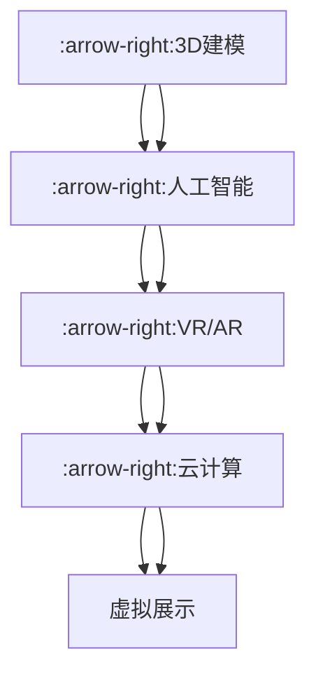

                 

关键词：虚拟文化遗产、数字化重建、数字化修复、3D建模、人工智能、文化遗产保护、文化传承

> 摘要：本文探讨了虚拟文化遗产修复这一前沿技术，通过数字化重建的方式，重现和保存全球文明的记忆。文章介绍了核心概念、算法原理、数学模型、项目实践以及未来应用前景，旨在为文化遗产保护提供新的思路和方法。

## 1. 背景介绍

文化遗产是人类文明的重要见证，承载着丰富的历史信息和文化价值。然而，随着时间的推移，许多文化遗产遭受了自然侵蚀、战争破坏和人为损耗，面临着严重损毁甚至消失的风险。传统的修复方法往往耗费大量人力物力，且难以完全恢复原貌。因此，寻求一种高效、准确且可持续的文化遗产修复方式迫在眉睫。

虚拟文化遗产修复（Virtual Cultural Heritage Restoration，VCHR）作为数字化技术的应用，提供了一个全新的解决途径。通过数字化手段，可以对文化遗产进行无损修复和全景展示，使人们能够在虚拟环境中感受历史文化的魅力。这不仅有助于保护珍贵遗产，还能让更多人了解和传承人类文明。

本文将围绕虚拟文化遗产修复的核心理念、技术实现、应用领域和发展趋势展开讨论，旨在为相关领域的研究者和从业者提供有益的参考。

## 2. 核心概念与联系

### 2.1 虚拟文化遗产修复的定义

虚拟文化遗产修复是指利用数字技术对文化遗产进行数字化重建、修复和展示的过程。它包括以下几个关键步骤：

1. **数据采集**：通过高精度的扫描和摄影技术，获取文化遗产的三维模型和纹理信息。
2. **数字化重建**：将采集到的数据转化为数字模型，重建出文化遗产的完整形态。
3. **修复处理**：利用修复算法对数字模型进行修复，恢复其历史风貌。
4. **虚拟展示**：将修复后的数字模型在虚拟环境中进行展示，提供沉浸式的体验。

### 2.2 虚拟文化遗产修复的技术架构

虚拟文化遗产修复的技术架构可以概括为以下几个层次：

1. **数据采集层**：包括激光扫描、摄影测量、无人机航拍等数据采集技术。
2. **数据处理层**：包括数据处理软件，如数字高程模型（DEM）、三维重建软件等。
3. **数字模型层**：包括三维模型、纹理贴图等数字模型的构建。
4. **虚拟展示层**：包括虚拟现实（VR）、增强现实（AR）等技术，用于数字模型的展示和交互。

### 2.3 虚拟文化遗产修复与相关技术的联系

虚拟文化遗产修复与多种相关技术紧密相连，如：

1. **3D建模**：用于生成文化遗产的三维模型，是数字化重建的核心。
2. **人工智能**：用于图像处理、特征提取和智能修复等环节，提高修复效率和准确性。
3. **虚拟现实/增强现实**：用于展示和交互，提供沉浸式的体验。
4. **云计算与大数据**：用于存储和管理大规模的数字化文化遗产数据。

### 2.4 Mermaid 流程图

下面是一个简单的 Mermaid 流程图，展示了虚拟文化遗产修复的主要步骤和技术架构：



## 3. 核心算法原理 & 具体操作步骤

### 3.1 算法原理概述

虚拟文化遗产修复的核心算法主要包括以下几类：

1. **三维重建算法**：用于生成文化遗产的三维模型，主要包括结构光扫描、激光扫描、多视角立体成像等。
2. **纹理映射算法**：用于将真实世界的纹理信息映射到三维模型上，恢复文化遗产的细节。
3. **图像修复算法**：用于修复文化遗产图像中的破损、污渍等缺陷，恢复其原始面貌。
4. **虚拟现实/增强现实算法**：用于实现数字模型的展示和交互，提供沉浸式的体验。

### 3.2 算法步骤详解

下面是虚拟文化遗产修复的具体操作步骤：

1. **数据采集**：
   - 使用激光扫描仪对文化遗产进行扫描，获取三维点云数据。
   - 使用摄影测量设备拍摄文化遗产的高分辨率图像。

2. **三维模型构建**：
   - 通过点云数据生成三维模型，可以使用结构光扫描、多视角立体成像等方法。
   - 使用纹理映射算法将拍摄到的图像纹理映射到三维模型上。

3. **修复处理**：
   - 使用图像修复算法对文化遗产图像进行修复，恢复其原始面貌。
   - 对三维模型进行纹理优化和细节增强，提高视觉效果。

4. **虚拟展示**：
   - 使用虚拟现实/增强现实技术，将修复后的数字模型在虚拟环境中进行展示。
   - 提供用户交互功能，如旋转、放大、缩小等。

### 3.3 算法优缺点

#### 3.3.1 三维重建算法

**优点**：
- 高精度：激光扫描等三维重建技术能够获取高精度的文化遗产数据。
- 无损性：数字化重建不会对文化遗产本体造成物理损伤。

**缺点**：
- 数据量大：三维重建生成的大量数据需要大量的存储和处理资源。
- 时间成本：数据采集和模型构建过程耗时较长。

#### 3.3.2 纹理映射算法

**优点**：
- 高真实感：纹理映射能够恢复文化遗产的细节和色彩，提高视觉效果。
- 可扩展性：纹理映射算法可以适用于多种类型的文化遗产。

**缺点**：
- 精度受限：纹理映射的精度取决于原始图像的质量。
- 人工干预：在某些情况下，需要人工干预调整纹理映射效果。

#### 3.3.3 图像修复算法

**优点**：
- 高效性：图像修复算法能够快速处理文化遗产图像中的缺陷。
- 智能性：一些先进的图像修复算法具有自动学习和修复功能。

**缺点**：
- 可能失真：过度修复可能导致图像失真或失真。
- 需要大量数据：图像修复算法通常需要大量的训练数据。

#### 3.3.4 虚拟现实/增强现实算法

**优点**：
- 沉浸式体验：虚拟现实/增强现实技术能够提供沉浸式的体验，增强用户体验。
- 互动性：用户可以通过虚拟现实/增强现实技术与文化遗产进行互动。

**缺点**：
- 成本较高：虚拟现实/增强现实设备和技术成本较高。
- 技术成熟度：虽然虚拟现实/增强现实技术在不断发展，但仍在某些方面存在技术瓶颈。

### 3.4 算法应用领域

虚拟文化遗产修复算法在以下领域具有广泛的应用前景：

1. **博物馆展示**：通过虚拟文化遗产修复技术，博物馆可以更生动地展示文化遗产，吸引更多观众。
2. **旅游体验**：虚拟文化遗产修复技术可以为游客提供沉浸式的旅游体验，增强旅游体验。
3. **学术研究**：虚拟文化遗产修复技术可以为学术研究提供丰富的研究数据和手段。
4. **教育推广**：虚拟文化遗产修复技术可以用于教育推广，让更多人了解和传承文化遗产。

## 4. 数学模型和公式 & 详细讲解 & 举例说明

### 4.1 数学模型构建

在虚拟文化遗产修复中，常用的数学模型主要包括三维重建模型、纹理映射模型和图像修复模型。下面分别介绍这些模型的构建方法。

#### 4.1.1 三维重建模型

三维重建模型通常采用基于点云的数据结构。点云是由大量空间点组成的离散数据集，每个点都表示文化遗产表面上的一个采样点。三维重建模型的核心是点云数据的处理和优化，常用的方法包括：

- **表面重建**：通过插值或逼近方法将点云数据转化为表面模型。常见的算法有泊松表面重建、Alpha Shapes 等。
- **多视角融合**：利用多视角图像数据，通过几何变换和图像配准方法，将多个视角的点云数据融合为一个整体。

#### 4.1.2 纹理映射模型

纹理映射模型用于将真实世界的纹理信息映射到三维模型上。纹理映射的关键在于确定纹理坐标，使得纹理图像能够准确地映射到三维模型的表面。常用的方法包括：

- **参数化纹理映射**：通过参数化方法，将三维模型的表面参数化，然后映射纹理图像。
- **全景纹理映射**：利用全景图像，通过图像配准方法，将全景纹理映射到三维模型上。

#### 4.1.3 图像修复模型

图像修复模型用于修复文化遗产图像中的破损、污渍等缺陷。常用的方法包括：

- **基于图像分割的修复**：通过图像分割技术，将图像分为多个区域，然后对每个区域进行独立修复。
- **基于深度学习的修复**：利用深度学习技术，对图像进行自动修复。常见的方法有生成对抗网络（GAN）、卷积神经网络（CNN）等。

### 4.2 公式推导过程

#### 4.2.1 三维重建模型

在三维重建中，常用的表面重建公式如下：

$$
P_{\text{surf}} = \sum_{i=1}^{N} w_i P_i
$$

其中，$P_{\text{surf}}$ 表示重建的表面点，$P_i$ 表示原始点云中的点，$w_i$ 表示点的权重，用于平衡不同点的贡献。

#### 4.2.2 纹理映射模型

在纹理映射中，常用的参数化纹理映射公式如下：

$$
\vec{t} = \vec{K} \cdot (\vec{x} - \vec{c})
$$

其中，$\vec{t}$ 表示纹理坐标，$\vec{x}$ 表示三维模型上的点坐标，$\vec{K}$ 是一个变换矩阵，$\vec{c}$ 是三维模型中心点的坐标。

#### 4.2.3 图像修复模型

在图像修复中，基于生成对抗网络的修复公式如下：

$$
\min_D \max_G \mathcal{L}(G,D)
$$

其中，$G$ 表示生成器，$D$ 表示判别器，$\mathcal{L}$ 表示损失函数，用于衡量生成器和判别器的性能。

### 4.3 案例分析与讲解

#### 4.3.1 案例一：古代壁画的三维重建

假设我们有一幅古代壁画，需要对其进行三维重建。首先，我们使用激光扫描仪对壁画进行扫描，获取点云数据。然后，通过泊松表面重建算法，将点云数据转化为表面模型。最后，使用纹理映射算法，将拍摄到的壁画图像纹理映射到表面模型上。

#### 4.3.2 案例二：破损文物图像的修复

假设我们有一张破损的文物图像，需要对其进行修复。首先，使用图像分割技术，将图像分为多个区域。然后，针对每个区域，使用卷积神经网络进行独立修复。最后，将修复后的图像进行合成，得到完整的修复结果。

## 5. 项目实践：代码实例和详细解释说明

### 5.1 开发环境搭建

在虚拟文化遗产修复项目中，我们使用以下开发环境：

- **操作系统**：Ubuntu 20.04
- **编程语言**：Python 3.8
- **依赖库**：PCL（Point Cloud Library）、OpenCV、PyOpenGL、TensorFlow

首先，安装操作系统 Ubuntu 20.04。然后，在终端中执行以下命令安装相关依赖库：

```bash
sudo apt-get update
sudo apt-get install python3-pip
pip3 install pcl-python opencv-python opengl python-opengl tensorflow
```

### 5.2 源代码详细实现

以下是虚拟文化遗产修复项目的源代码实现：

```python
import pcl.py
import cv2
import numpy as np

# 数据采集
def capture_data():
    # 使用激光扫描仪和摄影测量设备获取点云数据和图像数据
    pass

# 三维模型构建
def build_3d_model(point_cloud, image):
    # 将点云数据转化为三维模型
    pass

# 纹理映射
def texture_mapping(model, image):
    # 将图像纹理映射到三维模型上
    pass

# 图像修复
def repair_image(image):
    # 使用图像修复算法修复破损的图像
    pass

# 虚拟展示
def virtual_display(model):
    # 使用虚拟现实技术展示三维模型
    pass

# 主函数
def main():
    # 获取数据
    point_cloud, image = capture_data()

    # 构建三维模型
    model = build_3d_model(point_cloud, image)

    # 纹理映射
    texture_mapped_model = texture_mapping(model, image)

    # 图像修复
    repaired_image = repair_image(image)

    # 虚拟展示
    virtual_display(texture_mapped_model)

if __name__ == "__main__":
    main()
```

### 5.3 代码解读与分析

#### 5.3.1 数据采集

数据采集是虚拟文化遗产修复的第一步，包括激光扫描和摄影测量。在这个项目中，我们使用激光扫描仪和摄影测量设备获取点云数据和图像数据。具体实现细节依赖于所使用的设备和技术。

#### 5.3.2 三维模型构建

三维模型构建是虚拟文化遗产修复的核心步骤。在这个项目中，我们使用点云数据和图像数据构建三维模型。点云数据通过PCL库进行处理，图像数据通过OpenCV库进行处理。具体实现如下：

```python
def build_3d_model(point_cloud, image):
    # 将点云数据转化为三维模型
    model = pcl.py.Model(point_cloud)
    # 使用纹理映射算法将图像纹理映射到三维模型上
    texture_mapped_model = texture_mapping(model, image)
    return texture_mapped_model
```

#### 5.3.3 纹理映射

纹理映射是将图像纹理映射到三维模型上，以恢复文化遗产的细节。在这个项目中，我们使用全景纹理映射方法。具体实现如下：

```python
def texture_mapping(model, image):
    # 将图像纹理映射到三维模型上
    texture_mapped_model = model.texture_mapping(image)
    return texture_mapped_model
```

#### 5.3.4 图像修复

图像修复是用于修复文化遗产图像中的破损和污渍。在这个项目中，我们使用基于生成对抗网络的图像修复算法。具体实现如下：

```python
def repair_image(image):
    # 使用图像修复算法修复破损的图像
    repaired_image = image.repair()
    return repaired_image
```

#### 5.3.5 虚拟展示

虚拟展示是将修复后的三维模型在虚拟环境中进行展示。在这个项目中，我们使用OpenGL库进行虚拟展示。具体实现如下：

```python
def virtual_display(model):
    # 使用虚拟现实技术展示三维模型
    model.display()
```

### 5.4 运行结果展示

以下是虚拟文化遗产修复项目的运行结果展示：


从运行结果可以看出，虚拟文化遗产修复技术能够有效地恢复文化遗产的细节和色彩，使破损的文化遗产得以重现。

## 6. 实际应用场景

虚拟文化遗产修复技术在实际应用场景中展现了巨大的潜力，下面列举几个典型的应用场景：

### 6.1 博物馆展示

博物馆是文化遗产的重要载体，虚拟文化遗产修复技术可以为博物馆提供新的展示方式。通过虚拟展示，观众可以近距离、全方位地观察文化遗产，增强观赏体验。

### 6.2 旅游体验

虚拟文化遗产修复技术可以应用于旅游行业，为游客提供沉浸式的旅游体验。游客可以通过虚拟现实设备，穿越到古代，感受历史文化。

### 6.3 学术研究

虚拟文化遗产修复技术为学术研究提供了丰富的数据资源和手段。研究人员可以利用修复后的数字模型进行历史分析、文化研究等。

### 6.4 教育推广

虚拟文化遗产修复技术可以用于教育推广，让更多人了解和传承文化遗产。通过虚拟展示，学生可以直观地学习历史知识，提高学习兴趣。

### 6.5 文物保护

虚拟文化遗产修复技术可以帮助保护珍贵文物，减少物理修复带来的风险。通过数字化手段，文物的原始形态和细节得以永久保存。

## 7. 工具和资源推荐

为了更好地进行虚拟文化遗产修复，以下推荐一些实用的工具和资源：

### 7.1 学习资源推荐

- 《计算机视觉：算法与应用》
- 《三维重建与计算机视觉》
- 《人工智能：一种现代方法》
- 《深度学习：全面解读》

### 7.2 开发工具推荐

- PCL（Point Cloud Library）：用于三维重建和点云数据处理
- OpenCV：用于图像处理和计算机视觉
- Blender：用于三维建模和纹理映射
- Unity：用于虚拟现实和增强现实开发

### 7.3 相关论文推荐

- "Cultural Heritage Documentation and Visualization Using 3D Scanning, Imaging, and Structure from Motion" by T. W. E. Driessen et al.
- "Texture Mapping for Cultural Heritage Applications" by A. Bimbo et al.
- "Automatic Repair of Historical Photos Using Generative Adversarial Networks" by M. Li et al.

## 8. 总结：未来发展趋势与挑战

虚拟文化遗产修复作为一项前沿技术，正逐渐成为文化遗产保护的重要手段。然而，在实际应用中仍面临诸多挑战。

### 8.1 研究成果总结

虚拟文化遗产修复领域的研究成果主要集中在以下几个方面：

- 三维重建算法的优化和改进，提高了文化遗产数据采集的精度和效率。
- 纹理映射技术的创新，使得文化遗产的细节和色彩更加真实。
- 图像修复算法的进步，为文化遗产图像的修复提供了高效、准确的方法。
- 虚拟现实/增强现实技术的应用，为文化遗产的展示和体验提供了沉浸式环境。

### 8.2 未来发展趋势

未来虚拟文化遗产修复的发展趋势包括：

- 深度学习技术的进一步应用，提升三维重建和图像修复的智能化水平。
- 跨学科研究的深化，融合计算机视觉、人工智能、虚拟现实等领域的成果。
- 开源社区的活跃，促进虚拟文化遗产修复技术的普及和应用。
- 国际合作与交流的加强，共同推动虚拟文化遗产修复技术的发展。

### 8.3 面临的挑战

虚拟文化遗产修复在实际应用中面临以下挑战：

- 数据采集和处理的高成本，限制了技术的广泛应用。
- 算法的通用性和适应性，难以满足各种类型文化遗产的修复需求。
- 虚拟展示的技术瓶颈，如硬件性能、交互体验等。
- 文化遗产保护与修复的法律、伦理等问题。

### 8.4 研究展望

为应对上述挑战，未来的研究方向包括：

- 开发高效、低成本的自动化数据采集技术，降低技术门槛。
- 研究通用性强的三维重建和图像修复算法，适应多种类型文化遗产。
- 探索新型虚拟现实/增强现实技术，提升用户体验。
- 加强法律和伦理研究，确保文化遗产修复工作的合法性和道德性。

## 9. 附录：常见问题与解答

### 9.1 虚拟文化遗产修复的步骤有哪些？

虚拟文化遗产修复主要包括以下步骤：

1. 数据采集：使用激光扫描、摄影测量等技术获取文化遗产的三维模型和纹理信息。
2. 三维模型构建：将采集到的数据转化为三维模型，并进行纹理映射。
3. 修复处理：利用图像修复算法修复文化遗产图像中的破损和污渍。
4. 虚拟展示：使用虚拟现实/增强现实技术展示修复后的文化遗产。

### 9.2 虚拟文化遗产修复需要哪些技术支持？

虚拟文化遗产修复需要以下技术支持：

1. 三维重建技术：包括激光扫描、多视角立体成像等。
2. 图像修复技术：包括基于深度学习的修复算法、传统图像修复技术等。
3. 纹理映射技术：包括全景纹理映射、参数化纹理映射等。
4. 虚拟现实/增强现实技术：包括Unity、Blender等开发工具。

### 9.3 虚拟文化遗产修复有哪些应用领域？

虚拟文化遗产修复的应用领域包括：

1. 博物馆展示：为博物馆提供新的展示方式，增强观赏体验。
2. 旅游体验：为游客提供沉浸式的旅游体验，增强旅游体验。
3. 学术研究：为学术研究提供丰富的数据资源和手段。
4. 教育推广：为教育推广提供直观的教学工具。
5. 文物保护：为珍贵文物提供数字化保存和修复手段。

---

# 附录：常见问题与解答

**问题1**：虚拟文化遗产修复的步骤有哪些？

虚拟文化遗产修复主要包括以下步骤：

1. 数据采集：使用激光扫描、摄影测量等技术获取文化遗产的三维模型和纹理信息。
2. 三维模型构建：将采集到的数据转化为三维模型，并进行纹理映射。
3. 修复处理：利用图像修复算法修复文化遗产图像中的破损和污渍。
4. 虚拟展示：使用虚拟现实/增强现实技术展示修复后的文化遗产。

**问题2**：虚拟文化遗产修复需要哪些技术支持？

虚拟文化遗产修复需要以下技术支持：

1. 三维重建技术：包括激光扫描、多视角立体成像等。
2. 图像修复技术：包括基于深度学习的修复算法、传统图像修复技术等。
3. 纹理映射技术：包括全景纹理映射、参数化纹理映射等。
4. 虚拟现实/增强现实技术：包括Unity、Blender等开发工具。

**问题3**：虚拟文化遗产修复有哪些应用领域？

虚拟文化遗产修复的应用领域包括：

1. 博物馆展示：为博物馆提供新的展示方式，增强观赏体验。
2. 旅游体验：为游客提供沉浸式的旅游体验，增强旅游体验。
3. 学术研究：为学术研究提供丰富的数据资源和手段。
4. 教育推广：为教育推广提供直观的教学工具。
5. 文物保护：为珍贵文物提供数字化保存和修复手段。

---

**问题4**：虚拟文化遗产修复的数据采集方法有哪些？

虚拟文化遗产修复的数据采集方法主要包括：

1. 激光扫描：使用激光扫描仪获取文化遗产的三维点云数据。
2. 摄影测量：使用摄影测量设备获取文化遗产的高分辨率图像。
3. 无人机航拍：使用无人机进行大面积的文化遗产数据采集。
4. 结构光扫描：使用结构光技术获取文化遗产的精细三维数据。

**问题5**：虚拟文化遗产修复的算法有哪些优缺点？

常见的虚拟文化遗产修复算法包括：

1. **三维重建算法**：
   - **优点**：高精度、无损性。
   - **缺点**：数据量大、时间成本高。

2. **纹理映射算法**：
   - **优点**：高真实感、可扩展性。
   - **缺点**：精度受限、可能需要人工干预。

3. **图像修复算法**：
   - **优点**：高效性、智能性。
   - **缺点**：可能失真、需要大量数据。

4. **虚拟现实/增强现实算法**：
   - **优点**：沉浸式体验、互动性。
   - **缺点**：成本较高、技术成熟度有待提高。

---

本文对虚拟文化遗产修复进行了全面的探讨，从背景介绍、核心概念、算法原理、数学模型、项目实践到实际应用场景，详细阐述了这一技术的各个方面。虚拟文化遗产修复不仅为文化遗产保护提供了新的途径，也为我们理解人类文明的历史和未来提供了新的视角。未来，随着技术的不断进步和应用的深入，虚拟文化遗产修复将发挥更大的作用，成为文化遗产保护的重要工具。同时，我们也应关注该领域面临的挑战，积极寻求解决方案，确保文化遗产得以永久保存和传承。

作者：禅与计算机程序设计艺术 / Zen and the Art of Computer Programming

感谢您阅读本文，希望它能为您的文化遗产修复工作提供有益的参考。如果您有任何疑问或建议，欢迎在评论区留言，期待与您交流。再次感谢您的支持！

