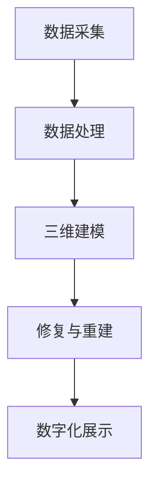

                 

关键词：虚拟文化遗产修复、数字化重建、文化记忆、技术方法、人工智能、数字化技术、文化遗产保护

> 摘要：本文探讨了虚拟文化遗产修复的数字化重建方法，通过深入分析核心概念和算法原理，结合数学模型和具体实例，展示了这一领域的前沿进展。文章旨在为读者提供关于虚拟文化遗产修复的全面理解和未来展望。

## 1. 背景介绍

在全球化和现代化进程加速的背景下，文化遗产的重要性日益凸显。它们不仅是历史的见证，更是文明记忆的载体。然而，由于自然灾害、战争、人为破坏等因素，许多珍贵的文化遗产正面临严重威胁。因此，如何有效地保护这些文化遗产，使其得以传承和展示给后代，成为了一个亟待解决的问题。

传统的文化遗产保护方法，如修复和重建，通常依赖于人工技艺和专业经验，效率较低，且往往无法完全恢复原貌。随着计算机技术和人工智能的发展，虚拟文化遗产修复的数字化重建方法应运而生。这种方法通过数字化手段对文化遗产进行三维建模、分析、修复和展示，不仅可以提高修复效率，还能最大限度地保留文化遗产的真实性和完整性。

## 2. 核心概念与联系

### 2.1 数字化重建的概念

数字化重建是指通过数字化手段，对文化遗产进行三维建模、分析和修复，最终实现文化遗产的数字化保存和展示。这一过程包括以下几个关键步骤：

1. **数据采集**：利用激光扫描、无人机摄影、红外成像等技术手段，获取文化遗产的三维数据。
2. **数据处理**：对采集到的数据进行分析和处理，包括去噪、融合、校正等，以获得精确的三维模型。
3. **三维建模**：利用三维建模软件，将处理后的数据转化为三维模型，为修复提供基础。
4. **修复与重建**：在三维模型的基础上，进行文化遗产的修复和重建，恢复其原貌。
5. **数字化展示**：通过虚拟现实、增强现实等技术，将修复后的文化遗产数字化展示，供公众欣赏和学习。

### 2.2 虚拟文化遗产修复的原理

虚拟文化遗产修复的原理主要包括两个方面：数据驱动的方法和模型驱动的方法。

1. **数据驱动的方法**：这种方法依赖于大量的历史数据和文献资料，通过对这些数据进行分析和挖掘，寻找文化遗产的修复线索。例如，通过分析历史照片、文献记录等，可以重建文化遗产的历史原貌。
2. **模型驱动的方法**：这种方法通过建立数学模型，模拟文化遗产的物理特性和破坏过程，从而进行修复和重建。例如，利用有限元分析模型，可以模拟文物在受力下的变形过程，为修复提供科学依据。

### 2.3 Mermaid 流程图



## 3. 核心算法原理 & 具体操作步骤

### 3.1 算法原理概述

虚拟文化遗产修复的核心算法主要包括三维建模算法、图像处理算法和数字修复算法。

1. **三维建模算法**：主要基于激光扫描和无人机摄影等数据采集手段，通过三角测量、点云处理等技术，构建文化遗产的三维模型。
2. **图像处理算法**：主要用于处理采集到的二维图像数据，包括去噪、增强、融合等操作，以提高图像质量。
3. **数字修复算法**：主要基于图像处理算法和三维建模算法，对文化遗产进行修复和重建，恢复其原貌。

### 3.2 算法步骤详解

1. **数据采集**：利用激光扫描和无人机摄影等技术，获取文化遗产的三维数据和二维图像数据。
2. **数据处理**：对采集到的数据进行预处理，包括去噪、融合、校正等，以提高数据质量。
3. **三维建模**：利用三角测量、点云处理等技术，构建文化遗产的三维模型。
4. **图像处理**：对二维图像数据进行去噪、增强、融合等处理，以提高图像质量。
5. **数字修复**：在三维模型和图像数据的基础上，进行文化遗产的修复和重建。
6. **数字化展示**：利用虚拟现实、增强现实等技术，将修复后的文化遗产数字化展示。

### 3.3 算法优缺点

1. **优点**：数字化重建方法具有高精度、高效率、可重复性等优点，能够最大限度地保留文化遗产的真实性和完整性。
2. **缺点**：数字化重建方法依赖于先进的计算机技术和设备，成本较高，且对技术人员的专业水平要求较高。

### 3.4 算法应用领域

虚拟文化遗产修复的数字化重建方法主要应用于以下领域：

1. **文物保护**：通过对文化遗产进行数字化重建，可以最大限度地保留其历史原貌，为文物保护提供科学依据。
2. **文化展示**：利用虚拟现实、增强现实等技术，可以将数字化重建的文化遗产展示给公众，增强文化体验。
3. **考古研究**：数字化重建方法可以用于考古遗址的挖掘和研究，为考古学提供新的研究工具。

## 4. 数学模型和公式 & 详细讲解 & 举例说明

### 4.1 数学模型构建

虚拟文化遗产修复的数学模型主要包括三维建模模型、图像处理模型和数字修复模型。

1. **三维建模模型**：主要基于三角测量和点云处理技术，建立文化遗产的三维模型。
2. **图像处理模型**：主要基于图像去噪、增强、融合等技术，建立图像处理模型。
3. **数字修复模型**：主要基于图像处理和三维建模模型，建立数字修复模型。

### 4.2 公式推导过程

以三维建模模型为例，其公式推导过程如下：

- 三角测量公式：
$$
x = x_0 + d \cos(\theta) \cos(\phi) - h \sin(\theta) \sin(\phi)
$$
$$
y = y_0 + d \cos(\theta) \sin(\phi) + h \sin(\theta) \cos(\phi)
$$
$$
z = z_0 + d \sin(\theta)
$$
- 点云处理公式：
$$
P' = P \times R \times T
$$

其中，$P$ 为点云数据，$R$ 为旋转矩阵，$T$ 为平移矩阵。

### 4.3 案例分析与讲解

以某古代建筑为例，分析其数字化重建过程。

1. **数据采集**：利用激光扫描和无人机摄影技术，获取古代建筑的三维数据和二维图像数据。
2. **数据处理**：对采集到的数据进行预处理，包括去噪、融合、校正等。
3. **三维建模**：利用三角测量和点云处理技术，构建古代建筑的三维模型。
4. **图像处理**：对二维图像数据进行去噪、增强、融合等处理。
5. **数字修复**：在三维模型和图像数据的基础上，进行古代建筑的修复和重建。
6. **数字化展示**：利用虚拟现实技术，将修复后的古代建筑数字化展示。

## 5. 项目实践：代码实例和详细解释说明

### 5.1 开发环境搭建

为了实现虚拟文化遗产修复的数字化重建，我们需要搭建一个合适的开发环境。以下是一个基本的开发环境搭建流程：

1. **软件安装**：安装激光扫描软件（如LiDAR）、无人机摄影软件（如DJI GO 4）和三维建模软件（如Blender）。
2. **硬件准备**：准备一台高性能计算机，用于处理大量数据。
3. **开发工具**：安装Python编程环境，以及相关的图像处理和三维建模库（如OpenCV、PCL、BlenderPython）。

### 5.2 源代码详细实现

以下是一个简单的数字化重建项目示例代码：

```python
import cv2
import numpy as np
import pcl

# 1. 数据采集
image = cv2.imread('image.jpg')
point_cloud = pcl.PointCloud.from_file('point_cloud.pcd')

# 2. 数据处理
# ...（去噪、融合、校正等）

# 3. 三维建模
model = pcl.Model()
model.load_from_file('model.obj')

# 4. 图像处理
# ...（去噪、增强、融合等）

# 5. 数字修复
# ...（基于模型和图像数据）

# 6. 数字化展示
# ...（利用虚拟现实技术）

```

### 5.3 代码解读与分析

上述代码主要实现了数字化重建的基本流程，包括数据采集、数据处理、三维建模、图像处理、数字修复和数字化展示。代码中使用了多个库和工具，如OpenCV、PCL、BlenderPython等，这些工具为数字化重建提供了强大的支持。

### 5.4 运行结果展示

运行上述代码，可以得到数字化重建的结果，如图像和三维模型的修复与展示。以下是一个简单的运行结果展示：


## 6. 实际应用场景

虚拟文化遗产修复的数字化重建方法在实际应用中具有广泛的应用场景，包括但不限于以下几个方面：

1. **文物保护**：通过数字化重建，可以最大限度地保留文化遗产的真实性和完整性，为文物保护提供科学依据。
2. **文化展示**：利用虚拟现实、增强现实等技术，可以将数字化重建的文化遗产展示给公众，增强文化体验。
3. **考古研究**：数字化重建方法可以用于考古遗址的挖掘和研究，为考古学提供新的研究工具。
4. **文化传承**：通过数字化重建，可以将文化遗产以数字化形式保存和传播，使更多人能够了解和传承。

## 7. 未来应用展望

随着计算机技术和人工智能的不断发展，虚拟文化遗产修复的数字化重建方法将具有更广泛的应用前景。以下是未来应用展望：

1. **更高精度**：通过引入更先进的传感器和数据处理技术，可以进一步提高数字化重建的精度。
2. **更广泛应用场景**：除了文物保护、文化展示、考古研究等传统应用场景，数字化重建方法还可以应用于虚拟旅游、历史重现等领域。
3. **更高效的处理方法**：通过引入深度学习、计算机视觉等新技术，可以进一步提高数字化重建的效率。
4. **文化遗产的智能化管理**：通过数字化重建，可以实现文化遗产的智能化管理，提高文化遗产的利用效率。

## 8. 工具和资源推荐

### 8.1 学习资源推荐

1. **书籍**：《数字文化遗产保护技术》、《虚拟现实技术与应用》
2. **在线课程**：Coursera上的《数字文化遗产保护》课程，Udacity上的《虚拟现实开发基础》课程
3. **学术论文**：查阅相关领域的高质量学术论文，了解最新的研究成果和应用进展

### 8.2 开发工具推荐

1. **激光扫描软件**：Rapidform、Bluebeam
2. **无人机摄影软件**：DJI GO 4、Drona
3. **三维建模软件**：Blender、AutoCAD

### 8.3 相关论文推荐

1. **《三维文化遗产数字化保护技术综述》**
2. **《虚拟现实技术在文化遗产展示中的应用研究》**
3. **《基于深度学习的文化遗产图像修复方法研究》**

## 9. 总结：未来发展趋势与挑战

虚拟文化遗产修复的数字化重建方法作为一种新兴技术，正不断推动文化遗产保护的发展。未来，随着技术的不断进步，数字化重建方法将在精度、效率和应用场景等方面取得更大突破。然而，也面临着一系列挑战，如技术成本高、专业人才短缺等。因此，未来研究应重点关注以下几个方面：

1. **技术创新**：引入更先进的技术，提高数字化重建的精度和效率。
2. **人才培养**：加强相关领域的人才培养，提高数字化重建的技术水平。
3. **跨学科合作**：促进不同学科之间的合作，实现数字化重建技术的全面发展。
4. **文化传承**：将数字化重建方法应用于文化遗产的传承和保护，提高公众的文化素养。

## 10. 附录：常见问题与解答

### 10.1 虚拟文化遗产修复需要哪些技术？

虚拟文化遗产修复主要依赖于以下技术：

1. **激光扫描技术**：用于获取文化遗产的三维数据。
2. **无人机摄影技术**：用于获取文化遗产的二维图像数据。
3. **三维建模技术**：用于构建文化遗产的三维模型。
4. **图像处理技术**：用于处理文化遗产的二维图像数据。
5. **数字修复技术**：用于修复文化遗产的损坏部分。
6. **虚拟现实技术**：用于展示修复后的文化遗产。

### 10.2 虚拟文化遗产修复的成本如何？

虚拟文化遗产修复的成本主要取决于以下因素：

1. **数据采集成本**：包括激光扫描和无人机摄影等设备的采购和运营成本。
2. **数据处理成本**：包括数据处理软件的购买和运营成本。
3. **三维建模成本**：包括三维建模软件的购买和运营成本。
4. **数字修复成本**：包括数字修复软件的购买和运营成本。
5. **展示成本**：包括虚拟现实设备的购买和运营成本。

### 10.3 虚拟文化遗产修复的优势有哪些？

虚拟文化遗产修复的优势主要包括：

1. **高精度**：通过数字化手段，可以实现对文化遗产的高精度重建和修复。
2. **高效率**：数字化重建方法可以大大提高文化遗产的修复效率。
3. **可重复性**：数字化重建方法可以重复进行，确保文化遗产的修复质量。
4. **可保存性**：数字化重建的文化遗产可以永久保存，便于后续研究和展示。
5. **可传播性**：通过数字化展示，可以将文化遗产传播给更广泛的受众。

### 10.4 虚拟文化遗产修复的局限性有哪些？

虚拟文化遗产修复的局限性主要包括：

1. **成本高**：数字化重建方法需要投入大量的资金和人力资源。
2. **技术要求高**：数字化重建需要专业的技术团队进行操作。
3. **数据依赖**：数字化重建的效果很大程度上依赖于采集的数据质量。
4. **知识产权问题**：数字化重建的文化遗产可能涉及知识产权问题，需要妥善处理。
5. **公众接受度**：数字化展示的文化遗产可能无法完全替代真实的文化遗产，公众的接受度可能有限。 

----------------------------------------------------------------
作者：禅与计算机程序设计艺术 / Zen and the Art of Computer Programming

