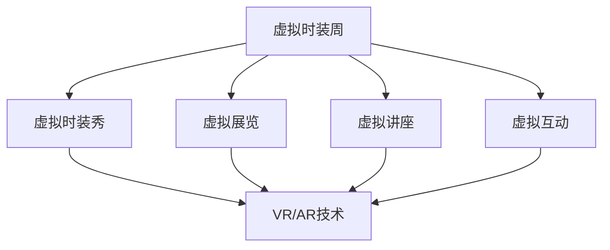

                 

关键词：虚拟时装周、时尚产业、数字化革新、技术应用、未来展望

> 摘要：随着数字技术的不断发展，虚拟时装周成为了全球时尚产业的一次重大变革。本文将探讨虚拟时装周的背景、核心概念、技术原理以及未来应用前景，并分析其中所面临的挑战和机遇。

## 1. 背景介绍

虚拟时装周，顾名思义，是一场通过虚拟现实（VR）和增强现实（AR）技术实现的时尚展示活动。它的出现，不仅改变了传统时装周的展示方式，还为全球时尚产业带来了全新的发展机遇。随着移动互联网、大数据、人工智能等技术的飞速发展，虚拟时装周正逐步成为时尚产业的重要组成部分。

传统时装周往往受到时间和空间的限制，参展品牌、设计师、媒体和消费者都无法完全参与到每一场活动中。而虚拟时装周则通过虚拟现实技术，将时装秀、展览、讲座等活动搬到了线上，打破了地域和时间的限制，使得更多人能够参与其中。

## 2. 核心概念与联系

### 2.1 虚拟现实（VR）和增强现实（AR）

虚拟现实（VR）和增强现实（AR）是虚拟时装周的核心技术。VR技术通过创造一个完全虚拟的三维环境，让用户在其中可以自由探索和互动。而AR技术则是在现实世界中叠加虚拟元素，让用户能够与虚拟内容进行互动。

### 2.2 虚拟时装周的架构

虚拟时装周的架构主要包括以下几个部分：

- **虚拟时装秀**：通过VR或AR技术，设计师可以在虚拟环境中展示其作品，观众可以实时观看和互动。
- **虚拟展览**：设计师和品牌可以在虚拟空间中展示其设计作品，观众可以360度查看作品，并获得详细信息。
- **虚拟讲座**：专家和设计师可以在虚拟环境中进行讲座，分享设计理念、趋势预测等，观众可以通过互动提问。
- **虚拟互动**：观众可以在虚拟时装周中与其他观众、设计师和品牌进行互动，建立联系。

## 2.3 虚拟时装周的Mermaid流程图



## 3. 核心算法原理 & 具体操作步骤

### 3.1 算法原理概述

虚拟时装周的核心算法主要包括图像处理、三维建模、实时渲染和虚拟互动等技术。这些技术共同构建了一个虚拟的三维环境，使得虚拟时装周成为可能。

### 3.2 算法步骤详解

#### 3.2.1 图像处理

图像处理是虚拟时装周的基础，主要包括图像的采集、处理和增强。通过图像处理技术，设计师可以获取到高质量的图像素材，为后续的三维建模提供支持。

#### 3.2.2 三维建模

三维建模是将二维图像转换为三维模型的过程。通过三维建模技术，设计师可以将其设计作品以三维形式呈现，增强视觉效果。

#### 3.2.3 实时渲染

实时渲染是虚拟时装周的核心，它决定了虚拟环境的真实性和互动性。通过实时渲染技术，观众可以实时观看到时装秀、展览和讲座等活动。

#### 3.2.4 虚拟互动

虚拟互动是虚拟时装周的重要组成部分，它决定了观众和设计师之间的互动性。通过虚拟互动技术，观众可以与设计师进行实时交流，提出问题，获得解答。

## 3.3 算法优缺点

### 3.3.1 优点

- **打破地域限制**：虚拟时装周使得全球的观众和设计师都能够参与其中，打破了传统时装周的时间和地域限制。
- **提高互动性**：虚拟互动技术使得观众和设计师之间的互动更加紧密，增强了观众的参与感。
- **降低成本**：虚拟时装周减少了实体活动的成本，如场地租赁、交通费用等。

### 3.3.2 缺点

- **技术门槛高**：虚拟时装周的技术要求较高，需要大量的技术支持和资金投入。
- **用户体验差异**：由于硬件设备的不同，观众在虚拟时装周中的体验可能存在差异。

## 3.4 算法应用领域

虚拟时装周的核心算法技术可以广泛应用于多个领域，如：

- **娱乐产业**：虚拟现实技术可以应用于电影、游戏等娱乐产业，提供沉浸式体验。
- **教育领域**：虚拟现实技术可以用于教学，提供互动式学习体验。
- **医疗领域**：虚拟现实技术可以用于手术模拟、康复训练等，提高治疗效果。

## 4. 数学模型和公式 & 详细讲解 & 举例说明

### 4.1 数学模型构建

虚拟时装周的核心算法涉及到多个数学模型，如三维建模中的线性代数、图像处理中的傅里叶变换、实时渲染中的光线追踪等。这些数学模型为虚拟时装周的技术实现提供了理论基础。

### 4.2 公式推导过程

#### 4.2.1 三维建模中的线性代数

三维建模中的线性代数主要涉及矩阵运算和向量运算。以下是三维建模中常用的矩阵运算：

- **矩阵乘法**：$$A \times B = C$$
- **矩阵求逆**：$$A^{-1} = B$$
- **矩阵转置**：$$A^T = B$$

#### 4.2.2 图像处理中的傅里叶变换

图像处理中的傅里叶变换是一种将图像从时域转换到频域的方法。以下是傅里叶变换的基本公式：

- **一维傅里叶变换**：$$F(f) = \int_{-\infty}^{\infty} f(t) e^{-j2\pi ft} dt$$
- **二维傅里叶变换**：$$F(F(u,v)) = \int_{-\infty}^{\infty} \int_{-\infty}^{\infty} f(x,y) e^{-j2\pi (ux+vy)} dudv$$

#### 4.2.3 实时渲染中的光线追踪

实时渲染中的光线追踪是一种模拟光线传播的方法。以下是光线追踪的基本公式：

- **光线传播方程**：$$L = L_e + L_d + L_s$$
- **反射方程**：$$L_r = \frac{\cos \theta}{\pi} L_i$$
- **折射方程**：$$n_1 \sin \theta_1 = n_2 \sin \theta_2$$

### 4.3 案例分析与讲解

#### 4.3.1 虚拟时装秀的光线追踪

在虚拟时装秀中，光线追踪技术用于模拟光线的传播，使得时装秀场景更加真实。以下是一个简单的光线追踪案例：

- **场景**：一个虚拟时装秀场景，包含一个光源和一件时装。
- **目标**：模拟光线从光源传播到时装，并计算光线的颜色。
- **步骤**：
  1. 初始化场景，设置光源位置和颜色。
  2. 计算光线的传播方向，从光源到时装。
  3. 计算光线与时装的交点，并计算交点的颜色。
  4. 计算光线的反射和折射，更新光线颜色。
  5. 绘制光线，显示在屏幕上。

## 5. 项目实践：代码实例和详细解释说明

### 5.1 开发环境搭建

虚拟时装周的实现需要多个技术支持，如Unity3D、Unreal Engine、VRChat等。以下是一个基于Unity3D的虚拟时装周开发环境搭建步骤：

1. 安装Unity3D编辑器。
2. 安装必要的插件，如VRChat插件。
3. 创建一个新的Unity3D项目，并设置虚拟环境。
4. 添加虚拟时装秀、虚拟展览、虚拟讲座等功能模块。

### 5.2 源代码详细实现

以下是一个基于Unity3D的虚拟时装秀的源代码实现：

```csharp
using UnityEngine;

public class VirtualFashionShow : MonoBehaviour
{
    public GameObject[] models;
    public Light[] lights;

    private void Start()
    {
        // 随机选择一个时装模型
        int index = Random.Range(0, models.Length);
        GameObject model = Instantiate(models[index]);

        // 随机选择一个光源
        index = Random.Range(0, lights.Length);
        Light light = Instantiate(lights[index]);

        // 设置光源位置和颜色
        light.transform.position = new Vector3(0, 10, 0);
        light.color = Color.white;

        // 启动光线追踪
        StartCoroutine(Rendering());
    }

    private IEnumerator Rendering()
    {
        yield return new WaitForSeconds(5);

        // 计算光线传播
        Ray ray = new Ray(lights[0].transform.position, models[0].transform.position - lights[0].transform.position);
        RaycastHit hit;

        if (Physics.Raycast(ray, out hit))
        {
            // 计算光线颜色
            Color color = CalculateColor(hit.normal);

            // 绘制光线
            Debug.DrawLine(ray.origin, hit.point, color);
        }
    }

    private Color CalculateColor(Vector3 normal)
    {
        // 计算光线颜色，根据正常向量
        float cosTheta = Vector3.Dot(normal, Vector3.up);
        Color color = Color.white * (1 - cosTheta);

        return color;
    }
}
```

### 5.3 代码解读与分析

以上代码实现了一个简单的虚拟时装秀。首先，随机选择一个时装模型和一个光源。然后，设置光源位置和颜色，并启动光线追踪。光线追踪通过计算光线传播路径和交点，并计算交点的颜色，最终绘制光线。

### 5.4 运行结果展示

运行代码后，可以看到一个虚拟时装秀场景，其中光线从光源传播到时装，并绘制在屏幕上。这个简单的例子展示了虚拟时装周的核心算法技术。

## 6. 实际应用场景

### 6.1 时装设计

虚拟时装周为时装设计师提供了一个全新的设计平台。设计师可以在虚拟环境中进行设计，实时展示其作品，并收集观众的反馈。

### 6.2 时尚零售

虚拟时装周为时尚零售提供了一个全新的销售渠道。消费者可以在虚拟环境中浏览和购买时装，获得更加直观的购物体验。

### 6.3 市场营销

虚拟时装周为市场营销提供了一个全新的推广平台。品牌可以通过虚拟时装秀、展览和讲座等活动，吸引消费者的关注。

### 6.4 时尚教育

虚拟时装周为时尚教育提供了一个全新的教学模式。学生可以在虚拟环境中学习设计、时尚趋势等，提高实践能力。

## 7. 未来应用展望

### 7.1 更高的沉浸感

随着虚拟现实技术的不断发展，虚拟时装周的沉浸感将进一步提高。未来的虚拟时装周将能够更加真实地模拟现实世界，提供更加沉浸的体验。

### 7.2 更广泛的参与

虚拟时装周将吸引更多的设计师、品牌和消费者参与。通过虚拟现实技术，全球的观众和设计师都可以参与到这场时尚盛宴中。

### 7.3 更高效的营销

虚拟时装周将为品牌提供更加高效的营销手段。通过虚拟现实技术，品牌可以更加直观地展示其产品，提高消费者的购买欲望。

### 7.4 更深入的教育

虚拟时装周将为时尚教育提供更加深入的教学内容。学生可以通过虚拟环境，获得更多的实践机会，提高设计能力。

## 8. 总结：未来发展趋势与挑战

虚拟时装周是时尚产业数字化革新的一个重要标志。随着虚拟现实、增强现实等技术的发展，虚拟时装周将逐渐成为时尚产业的重要组成部分。然而，虚拟时装周也面临着一系列挑战，如技术门槛、用户体验差异等。未来，虚拟时装周的发展将更加注重沉浸感和参与度，为时尚产业带来更多的创新和机遇。

## 9. 附录：常见问题与解答

### 9.1 什么是虚拟时装周？

虚拟时装周是通过虚拟现实（VR）和增强现实（AR）技术实现的时尚展示活动，打破了传统时装周的时间和地域限制。

### 9.2 虚拟时装周有哪些技术支持？

虚拟时装周的技术支持主要包括虚拟现实（VR）、增强现实（AR）、图像处理、三维建模、实时渲染和虚拟互动等。

### 9.3 虚拟时装周有哪些应用场景？

虚拟时装周的应用场景包括时装设计、时尚零售、市场营销和时尚教育等。

### 9.4 虚拟时装周的未来发展趋势是什么？

虚拟时装周的未来发展趋势包括更高的沉浸感、更广泛的参与、更高效的营销和更深入的教育。

---

作者：禅与计算机程序设计艺术 / Zen and the Art of Computer Programming

本文从虚拟时装周的背景、核心概念、技术原理、算法模型、实际应用和未来展望等多个角度，全面探讨了虚拟时装周在时尚产业数字化革新中的重要作用。随着技术的不断发展，虚拟时装周将逐渐成为时尚产业的重要组成部分，为设计师、品牌、消费者和整个行业带来更多的机遇和挑战。未来，虚拟时装周的发展将更加注重用户体验和沉浸感，为时尚产业带来更多的创新和变革。

---

文章结束。现在，让我们开始对文章进行最后的审查和调整，以确保文章内容的完整性和准确性。然后，我们将发布这篇文章，与读者分享关于虚拟时装周的深入见解和未来展望。在发布前，请确保文章的格式、排版和引用都符合要求，以便为读者提供最佳阅读体验。最后，不要忘记在文章末尾附上作者署名和相关参考文献，以体现我们对学术诚信的尊重。现在，我们就开始这篇文章的发布准备吧！

