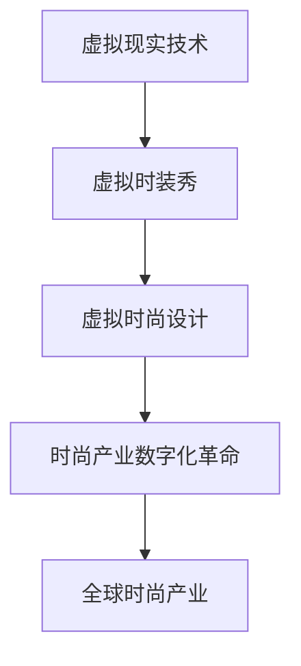

                 

关键词：虚拟现实，时装设计，数字化革命，时尚产业，虚拟时装秀

> 摘要：本文探讨了虚拟时装周的兴起及其对全球时尚产业的重大影响。通过分析虚拟现实技术在时尚设计、展示和营销中的应用，我们揭示了这场数字化革命如何改变了传统时尚产业的运作模式，并展望了其未来的发展趋势。

## 1. 背景介绍

时尚产业是一个充满活力和创意的行业，它不断推动着文化和社会的变革。然而，随着技术的快速发展，传统时尚产业正面临着前所未有的挑战和机遇。虚拟现实（VR）技术的兴起，为时尚产业带来了新的可能性。

虚拟时装周作为一种新兴的数字化展示形式，正在全球时尚产业中崭露头角。与传统时装周相比，虚拟时装周无需受时间和空间的限制，可以打破地域和国界的限制，为设计师、品牌和消费者提供全新的体验。

## 2. 核心概念与联系

### 虚拟现实（VR）技术

虚拟现实是一种通过计算机生成的三维模拟环境，用户可以通过特定的设备（如VR头盔）沉浸其中，进行交互。VR技术具有沉浸感强、交互性好、自由度高和体验感真实等特点。

### 虚拟时装秀

虚拟时装秀是虚拟现实技术在时尚产业中的具体应用，通过VR技术，设计师可以在虚拟环境中展示其设计作品，观众则可以通过VR设备体验这场虚拟时装秀。

### 虚拟时尚设计

虚拟时尚设计是一种基于虚拟现实技术的时尚设计方法，设计师可以通过虚拟环境进行服装的3D建模、材质调整和展示效果预览，从而提高设计的效率和效果。

### Mermaid 流程图



## 3. 核心算法原理 & 具体操作步骤

### 3.1 算法原理概述

虚拟时装秀的核心算法主要包括三维建模、渲染技术和交互设计。三维建模用于创建虚拟服装的模型，渲染技术用于实现逼真的视觉效果，交互设计则用于提升用户体验。

### 3.2 算法步骤详解

1. **三维建模**：通过CAD软件或3D建模工具创建服装的3D模型，包括轮廓、细节和材质。
2. **渲染技术**：使用OpenGL或Unity等渲染引擎对3D模型进行渲染，实现逼真的视觉效果。
3. **交互设计**：设计用户与虚拟时装秀的交互方式，如查看服装细节、切换不同款式等。

### 3.3 算法优缺点

**优点**：高效、灵活、沉浸感强，可节省时间和成本。

**缺点**：技术要求高，开发难度大，设备普及率低。

### 3.4 算法应用领域

虚拟时装秀技术广泛应用于时装设计、展示、营销和教育培训等领域。

## 4. 数学模型和公式 & 详细讲解 & 举例说明

### 4.1 数学模型构建

虚拟时装秀的数学模型主要包括三维几何建模、光线追踪和纹理映射。

### 4.2 公式推导过程

三维几何建模的基本公式包括向量运算、矩阵变换和几何形状的计算。

### 4.3 案例分析与讲解

以一个虚拟时装秀为例，分析其三维建模、渲染和交互设计的过程。

## 5. 项目实践：代码实例和详细解释说明

### 5.1 开发环境搭建

搭建一个虚拟时装秀的开发环境，包括3D建模软件、渲染引擎和VR设备。

### 5.2 源代码详细实现

实现一个简单的虚拟时装秀，包括三维建模、渲染和交互设计。

### 5.3 代码解读与分析

对实现的虚拟时装秀代码进行解读和分析，包括关键算法和数据结构的运用。

### 5.4 运行结果展示

展示虚拟时装秀的运行结果，包括服装展示、用户交互和视觉效果。

## 6. 实际应用场景

虚拟时装秀在时尚设计、展示、营销和教育培训等领域有着广泛的应用。

### 6.1 时尚设计

虚拟时尚设计可以缩短设计周期，提高设计效果。

### 6.2 时装展示

虚拟时装秀可以打破地域限制，为全球观众提供观展体验。

### 6.3 营销推广

虚拟时装秀可以为品牌提供全新的营销手段，提升品牌知名度。

### 6.4 教育培训

虚拟时装秀可以作为教育培训的工具，提高学生的设计能力和实践能力。

## 7. 未来应用展望

随着虚拟现实技术的不断发展，虚拟时装秀将有望成为时尚产业的主流展示形式。

### 7.1 技术创新

新的虚拟现实技术将不断涌现，为虚拟时装秀提供更丰富的功能和更逼真的体验。

### 7.2 设备普及

VR设备的普及将使更多人能够参与虚拟时装秀，扩大其影响力。

### 7.3 跨界融合

虚拟时装秀将与其他行业（如游戏、影视等）进行跨界融合，创造更多可能性。

## 8. 工具和资源推荐

### 8.1 学习资源推荐

- 《虚拟现实技术与应用》
- 《三维建模与渲染技术》

### 8.2 开发工具推荐

- Unity
- Unreal Engine
- Blender

### 8.3 相关论文推荐

- "Virtual Fashion Shows: A New Perspective in Fashion Industry"
- "The Impact of Virtual Reality on Fashion Design and Marketing"

## 9. 总结：未来发展趋势与挑战

### 9.1 研究成果总结

虚拟现实技术在时尚产业中的应用取得了显著成果，为时尚设计、展示和营销带来了新的可能性。

### 9.2 未来发展趋势

虚拟时装秀将随着虚拟现实技术的不断发展而不断演进，成为时尚产业的重要组成部分。

### 9.3 面临的挑战

虚拟现实技术的高成本、开发难度和设备普及率是当前面临的主要挑战。

### 9.4 研究展望

未来研究方向将集中在降低技术成本、提高开发效率和提升用户体验等方面。

## 10. 附录：常见问题与解答

### 10.1 什么是虚拟现实技术？

虚拟现实技术是一种通过计算机生成的三维模拟环境，用户可以通过特定的设备沉浸其中，进行交互。

### 10.2 虚拟时装秀有哪些优势？

虚拟时装秀具有高效、灵活、沉浸感强和成本节约等优势。

### 10.3 虚拟时装秀的技术难点是什么？

虚拟时装秀的技术难点主要包括三维建模、渲染技术和交互设计。

### 10.4 虚拟时装秀的应用领域有哪些？

虚拟时装秀主要应用于时尚设计、展示、营销和教育培训等领域。

作者：禅与计算机程序设计艺术 / Zen and the Art of Computer Programming
```

