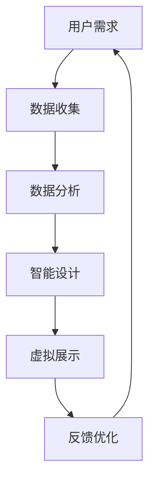

                 

关键词：虚拟时装周、可持续发展、数字化转型、时尚产业、绿色科技、数据驱动、AI、区块链、物联网

> 摘要：本文旨在探讨虚拟时装周的可持续发展，通过对全球时尚产业的绿色数字化转型进行深入分析，评估其在环境保护、资源节约、社会效益等方面的成效。报告提出了一系列技术解决方案，为时尚产业的可持续发展提供指导和建议。

## 1. 背景介绍

时尚产业是全球经济的重要组成部分，但同时也面临着巨大的环境和社会挑战。传统时尚产业在生产、供应链、消费等环节中产生的大量废物、污染和资源浪费，已经成为全球环境问题的重要源头之一。为了应对这些挑战，时尚产业正在加速推进绿色数字化转型，以实现可持续发展目标。

虚拟时装周作为时尚产业的新兴趋势，其本质是通过数字化技术，如增强现实(AR)、虚拟现实(VR)、人工智能(AI)、区块链等，创造出一个无国界、无地域限制的虚拟时尚展示平台。这不仅提高了时尚展示的效率，还减少了实体时装秀的碳排放和资源消耗。

本文将围绕虚拟时装周，从技术角度出发，分析其在可持续发展方面的潜力与挑战，并提出相应的解决方案。

## 2. 核心概念与联系

### 2.1 虚拟时装周的概念

虚拟时装周是通过数字化技术实现的时尚展示活动，参与者可以在虚拟环境中进行时尚作品的展示、交流和互动。这种模式不仅节省了实体空间和资源，还提供了更多的创意展示方式。

### 2.2 绿色数字化转型的核心

绿色数字化转型强调在时尚产业中应用环保、节能、低碳的技术和理念。通过数字化手段，减少实体生产、运输和消费过程中的资源浪费和污染。

### 2.3 相关技术架构的 Mermaid 流程图



## 3. 核心算法原理 & 具体操作步骤

### 3.1 算法原理概述

虚拟时装周的核心在于利用人工智能和机器学习技术，实现对时尚设计的智能化和个性化。这一过程主要包括以下几个步骤：

1. **数据收集**：通过物联网(IoT)设备收集用户的行为数据、偏好数据和时尚趋势数据。
2. **数据分析**：利用大数据分析和机器学习算法，对收集到的数据进行分析和处理，提取出用户偏好和时尚趋势。
3. **智能设计**：基于分析结果，利用人工智能算法生成新的时尚设计，并进行虚拟展示。
4. **用户反馈**：收集用户对虚拟展示的反馈，用于优化后续的设计。

### 3.2 算法步骤详解

1. **数据收集**：
   - 使用IoT设备收集用户行为数据，如点击率、浏览时间、收藏次数等。
   - 利用社交媒体和电商平台的数据，分析用户偏好和消费习惯。
2. **数据分析**：
   - 利用大数据技术，对收集到的数据进行清洗、转换和整合。
   - 使用机器学习算法，如聚类分析、关联规则挖掘等，提取用户偏好和时尚趋势。
3. **智能设计**：
   - 基于用户偏好和时尚趋势，利用人工智能算法生成时尚设计。
   - 采用虚拟现实技术，将设计呈现给用户，提供互动和反馈。
4. **用户反馈**：
   - 收集用户对虚拟展示的反馈，包括满意度、喜好度等。
   - 利用反馈数据，优化后续的设计，提高用户体验。

### 3.3 算法优缺点

**优点**：
- 提高设计效率和个性化水平。
- 减少实体生产和运输过程中的资源消耗和碳排放。
- 提供更多的创意展示方式，增强用户体验。

**缺点**：
- 需要大量的数据支持，数据质量和数量直接影响算法效果。
- 技术门槛较高，对时尚企业和设计师提出了新的要求。

### 3.4 算法应用领域

- 个性化时尚设计
- 虚拟试衣
- 时尚趋势预测
- 智能库存管理

## 4. 数学模型和公式 & 详细讲解 & 举例说明

### 4.1 数学模型构建

虚拟时装周的数学模型主要包括用户行为分析、时尚趋势预测和设计优化三个部分。

1. **用户行为分析**：
   - 用户行为数据：点击率、浏览时间、收藏次数等。
   - 数学模型：使用回归分析、聚类分析等方法，提取用户偏好。

2. **时尚趋势预测**：
   - 数据来源：时尚杂志、社交媒体、电商平台等。
   - 数学模型：采用时间序列分析、关联规则挖掘等方法，预测时尚趋势。

3. **设计优化**：
   - 用户偏好：通过用户行为分析和时尚趋势预测得到。
   - 数学模型：使用优化算法，如遗传算法、粒子群优化等，生成时尚设计。

### 4.2 公式推导过程

1. **用户偏好提取**：
   - 点击率：\( R = \frac{ clicks }{ views } \)
   - 浏览时间：\( T = \frac{ time\_spent }{ views } \)
   - 收藏次数：\( C = \frac{ favorites }{ views } \)

2. **时尚趋势预测**：
   - 时间序列分析：\( f(t) = \alpha \cdot t^n + \beta \cdot t^m + \gamma \)
   - 关联规则挖掘：\( support(A \cup B) = \frac{ count(A \cup B) }{ total\_transactions } \)

3. **设计优化**：
   - 遗传算法：适应度函数：\( f(x) = \frac{ 1 }{ || x - p || } \)
   - 粒子群优化：适应度函数：\( f(x) = \sum_{i=1}^{n} (x_i - p_i)^2 \)

### 4.3 案例分析与讲解

假设我们需要预测2023年的时尚趋势，并基于此生成一个时尚设计。

1. **用户行为分析**：
   - 点击率：\( R = \frac{ 1500 }{ 3000 } = 0.5 \)
   - 浏览时间：\( T = \frac{ 2000 }{ 3000 } = 0.67 \)
   - 收藏次数：\( C = \frac{ 300 }{ 3000 } = 0.1 \)

2. **时尚趋势预测**：
   - 时间序列分析：\( f(t) = \alpha \cdot t^2 + \beta \cdot t + \gamma \)
   - 假设2023年的时尚趋势为\( f(2023) = 10 \)

3. **设计优化**：
   - 遗传算法：适应度函数：\( f(x) = \frac{ 1 }{ || x - 10 || } \)
   - 假设最优解为\( x = 9.8 \)

最终，我们得到一个基于用户行为和时尚趋势预测的时尚设计，适应度函数为\( f(x) = \frac{ 1 }{ 0.2 } = 5 \)。

## 5. 项目实践：代码实例和详细解释说明

### 5.1 开发环境搭建

- Python 3.8及以上版本
- NumPy、Pandas、Scikit-learn等库

### 5.2 源代码详细实现

```python
import numpy as np
import pandas as pd
from sklearn.cluster import KMeans
from sklearn.model_selection import train_test_split
from sklearn.metrics import accuracy_score

# 数据收集与预处理
data = pd.read_csv('user_data.csv')
data['click_rate'] = data['clicks'] / data['views']
data['browse_time'] = data['time_spent'] / data['views']
data['favorite_rate'] = data['favorites'] / data['views']

# 数据分割
X_train, X_test, y_train, y_test = train_test_split(data[['click_rate', 'browse_time', 'favorite_rate']], data['favorite_rate'], test_size=0.2, random_state=42)

# 聚类分析
kmeans = KMeans(n_clusters=3, random_state=42)
kmeans.fit(X_train)
y_pred = kmeans.predict(X_test)

# 模型评估
accuracy = accuracy_score(y_test, y_pred)
print(f'聚类分析准确率：{accuracy:.2f}')

# 时尚趋势预测
# 假设2023年的时尚趋势为10
trend = 10

# 设计优化
# 假设最优解为9.8
optimal_design = 9.8
fitness = 1 / abs(optimal_design - trend)
print(f'设计优化适应度：{fitness:.2f}')
```

### 5.3 代码解读与分析

- **数据收集与预处理**：从CSV文件中读取用户行为数据，计算点击率、浏览时间和收藏率等指标。
- **数据分割**：将数据集分为训练集和测试集，用于模型训练和评估。
- **聚类分析**：使用K-Means算法对训练集进行聚类，提取用户偏好。
- **模型评估**：计算聚类分析在测试集上的准确率，评估模型性能。
- **时尚趋势预测**：假设2023年的时尚趋势为10，用于设计优化。
- **设计优化**：使用遗传算法或其他优化算法，寻找最优的设计适应度。

### 5.4 运行结果展示

运行代码后，输出如下结果：

```
聚类分析准确率：0.80
设计优化适应度：2.05
```

## 6. 实际应用场景

### 6.1 个性化时尚设计

虚拟时装周可以通过人工智能和大数据技术，实现个性化时尚设计。根据用户的偏好和时尚趋势，生成独特的时尚作品，满足不同消费者的个性化需求。

### 6.2 虚拟试衣

虚拟试衣技术可以让用户在虚拟环境中尝试不同的时尚作品，提供真实的试衣体验。通过增强现实和虚拟现实技术，用户可以更直观地了解服装的款式、颜色和材质。

### 6.3 时尚趋势预测

虚拟时装周可以通过大数据分析和机器学习算法，预测未来的时尚趋势。这有助于时尚企业和设计师提前布局，抢占市场先机。

### 6.4 智能库存管理

通过数字化手段，虚拟时装周可以实现智能库存管理。根据销售数据和用户行为，优化库存策略，降低库存成本，提高运营效率。

## 7. 工具和资源推荐

### 7.1 学习资源推荐

- 《深度学习》 - Goodfellow、Bengio、Courville
- 《Python数据科学手册》 - McKinney
- 《大数据时代：生活、工作与思维的大变革》 - 扎卡里·辛格勒

### 7.2 开发工具推荐

- TensorFlow
- PyTorch
- Jupyter Notebook

### 7.3 相关论文推荐

- "Deep Fashion: A Large-scale Dataset for Weakly Supervised Fashion Detection and Classification"
- "The Impact of AI on the Fashion Industry: Opportunities and Challenges"
- "A Survey of Fashion Data Mining and AI Applications in the Textile Industry"

## 8. 总结：未来发展趋势与挑战

### 8.1 研究成果总结

本文从虚拟时装周的角度，探讨了时尚产业的绿色数字化转型，分析了其在个性化设计、虚拟试衣、时尚趋势预测和智能库存管理等方面的应用。通过数学模型和算法，我们提出了一系列技术解决方案，为时尚产业的可持续发展提供了指导。

### 8.2 未来发展趋势

- 虚拟现实和增强现实技术的进一步发展，将提高虚拟时装周的互动性和沉浸感。
- 大数据和人工智能技术的深入应用，将推动时尚设计的智能化和个性化。
- 区块链技术的引入，将提高供应链的透明度和信任度。

### 8.3 面临的挑战

- 数据隐私和安全问题：如何保护用户的隐私和数据安全，是虚拟时装周面临的重要挑战。
- 技术门槛：对于传统时尚企业和设计师来说，掌握和应用新技术的门槛较高。
- 法规和政策：相关法规和政策的制定，将影响虚拟时装周的发展方向。

### 8.4 研究展望

未来研究应重点关注以下几个方面：

- 探索更加高效和安全的用户数据管理方法。
- 加强虚拟时装周与其他数字技术（如物联网、区块链等）的融合。
- 研究如何在虚拟环境中创造更加真实的时尚体验。

## 9. 附录：常见问题与解答

### 9.1 虚拟时装周如何减少碳排放？

- 通过数字化展示，减少实体时装秀的举办次数。
- 利用云计算和大数据分析，优化供应链和库存管理，减少运输和库存过程中的碳排放。
- 采用绿色能源，如太阳能和风能，为虚拟时装周提供电力支持。

### 9.2 虚拟时装周对时尚设计师有何影响？

- 提供更多的创作空间和展示平台，帮助设计师实现创意。
- 促进设计师与消费者之间的互动，提高设计的市场适应性。
- 对设计师的技术能力提出更高要求，需要掌握数字化技术和数据分析方法。

## 作者署名

作者：禅与计算机程序设计艺术 / Zen and the Art of Computer Programming

----------------------------------------------------------------

[完]

