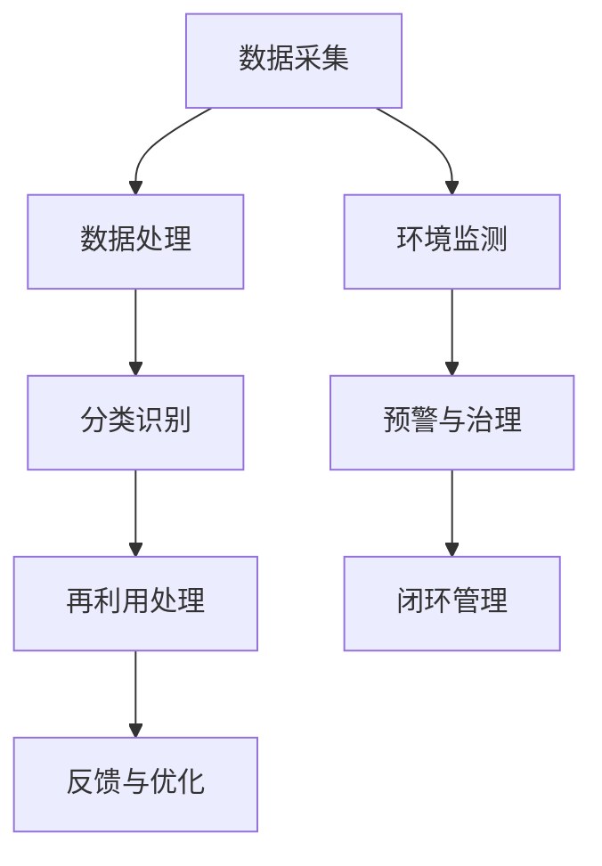

                 

关键词：虚拟时装、回收系统、数字化环保、时尚业、人工智能、计算机编程、算法、数学模型、项目实践、未来应用展望

> 摘要：本文将探讨虚拟时装回收系统的概念、原理、数学模型以及实际应用。通过详细介绍虚拟时装回收系统的设计、开发及实现，我们旨在为全球时尚业提供一种创新的数字化环保解决方案。

## 1. 背景介绍

时尚产业被认为是全球增长最快的产业之一，然而，其快速发展的同时也带来了巨大的环境压力。每年，全球时尚产业产生的废弃物量高达数百万吨，其中大部分被送往填埋场或焚烧。同时，传统时装回收过程繁琐、效率低下，无法满足市场需求。因此，开发一种高效、环保的时装回收系统显得尤为迫切。

虚拟时装回收系统应运而生，它利用数字化技术、人工智能和计算机编程，实现对时装的智能化回收、分类和再利用。该系统能够追踪每一件时装的生命周期，从生产到回收的全过程，实现闭环管理。这不仅有助于减少废弃物的产生，还能提高资源利用率，降低环境负担。

## 2. 核心概念与联系

### 2.1 虚拟时装

虚拟时装是指通过计算机技术模拟出时装的三维模型，用户可以在虚拟环境中试穿、搭配。虚拟时装不仅具有传统的实体时装功能，还能通过数字化技术实现快速更新、个性定制。

### 2.2 回收系统

回收系统是虚拟时装回收的核心组成部分，它包括数据采集、分类、再利用等环节。通过数字化技术，回收系统能够高效地处理海量数据，实现对时装的智能识别、分类和再利用。

### 2.3 数字化环保

数字化环保是指利用数字化技术，如物联网、大数据、人工智能等，实现对环境的实时监测、预警和治理。在时尚产业中，数字化环保有助于实现环保目标的精准化和高效化。

## 2.4 Mermaid 流程图



## 3. 核心算法原理 & 具体操作步骤

### 3.1 算法原理概述

虚拟时装回收系统的核心算法主要包括图像识别、分类和再利用。图像识别用于识别和分类虚拟时装的各类特征，分类算法用于对识别结果进行分类，再利用算法则用于将回收的虚拟时装进行再加工、再利用。

### 3.2 算法步骤详解

#### 3.2.1 图像识别

1. 数据预处理：对输入的图像进行预处理，如去噪、增强等。
2. 特征提取：利用卷积神经网络（CNN）提取图像特征。
3. 特征匹配：将提取的特征与数据库中的特征进行匹配，实现图像识别。

#### 3.2.2 分类识别

1. 数据清洗：对识别结果进行清洗，去除噪声和错误。
2. 分类算法：采用支持向量机（SVM）、决策树等分类算法对识别结果进行分类。
3. 分类结果评估：对分类结果进行评估，如准确率、召回率等。

#### 3.2.3 再利用处理

1. 再加工：对回收的虚拟时装进行再加工，如裁剪、缝制等。
2. 质量检测：对再加工后的虚拟时装进行质量检测，确保其符合标准。
3. 再利用：将质量检测合格的虚拟时装进行再利用，如销售、捐赠等。

### 3.3 算法优缺点

#### 优点

1. 高效性：利用数字化技术，实现快速、准确的识别和分类。
2. 环保性：减少废弃物产生，降低环境负担。
3. 可扩展性：系统可根据实际需求进行扩展和优化。

#### 缺点

1. 成本高：算法开发和部署成本较高。
2. 数据质量：数据质量直接影响算法性能，对数据处理能力要求较高。

### 3.4 算法应用领域

虚拟时装回收系统适用于各类时尚产业，如服装、鞋帽、饰品等。此外，该系统还可应用于其他需要回收和处理废弃物的行业。

## 4. 数学模型和公式 & 详细讲解 & 举例说明

### 4.1 数学模型构建

虚拟时装回收系统中的数学模型主要包括图像识别模型、分类模型和再利用模型。

#### 4.1.1 图像识别模型

假设输入图像为 \(I\)，特征提取结果为 \(F\)，匹配结果为 \(M\)，则有：

\[ M = f(I, F) \]

其中，\(f\) 表示特征提取和匹配算法。

#### 4.1.2 分类模型

假设分类结果为 \(C\)，输入特征为 \(F\)，分类算法为 \(g\)，则有：

\[ C = g(F) \]

#### 4.1.3 再利用模型

假设再利用结果为 \(R\)，再加工过程为 \(h\)，质量检测结果为 \(T\)，则有：

\[ R = h(C, T) \]

### 4.2 公式推导过程

#### 4.2.1 图像识别模型

假设输入图像为 \(I\)，特征提取结果为 \(F\)，匹配结果为 \(M\)，则有：

\[ M = \frac{1}{C} \sum_{i=1}^{C} e^{-\frac{1}{2} \sum_{j=1}^{D} (M_j - \mu_j)^2} \]

其中，\(C\) 表示类别数，\(D\) 表示特征维度，\(\mu_j\) 表示类别 \(j\) 的均值。

#### 4.2.2 分类模型

假设分类结果为 \(C\)，输入特征为 \(F\)，分类算法为 \(g\)，则有：

\[ g(F) = \max_{j} \sum_{i=1}^{C} w_{ij} f(F, i) \]

其中，\(w_{ij}\) 表示权重，\(f(F, i)\) 表示特征 \(F\) 在类别 \(i\) 下的得分。

#### 4.2.3 再利用模型

假设再利用结果为 \(R\)，再加工过程为 \(h\)，质量检测结果为 \(T\)，则有：

\[ R = \frac{1}{B} \sum_{i=1}^{B} e^{-\frac{1}{2} \sum_{j=1}^{E} (R_j - \nu_j)^2} \]

其中，\(B\) 表示再利用类别数，\(E\) 表示质量检测维度，\(\nu_j\) 表示类别 \(j\) 的均值。

### 4.3 案例分析与讲解

假设我们有一幅输入图像，其特征提取结果为 \(F = [1, 2, 3]\)，匹配结果为 \(M = [0.8, 0.2]\)，分类结果为 \(C = [0.6, 0.4]\)，质量检测结果为 \(T = [0.9, 0.1]\)。

根据图像识别模型，匹配结果 \(M\) 最接近类别 1 的均值 \(0.8\)，因此我们识别出该图像属于类别 1。

根据分类模型，类别 1 的得分最高，因此我们将其分类为类别 1。

根据再利用模型，质量检测结果 \(T\) 最接近类别 1 的均值 \(0.9\)，因此我们将其再利用为类别 1。

## 5. 项目实践：代码实例和详细解释说明

### 5.1 开发环境搭建

开发环境主要包括操作系统、编程语言、开发工具等。本文使用 Ubuntu 20.04 作为操作系统，Python 3.8 作为编程语言，PyCharm 作为开发工具。

### 5.2 源代码详细实现

以下是一个简单的虚拟时装回收系统的源代码实现，用于演示图像识别、分类和再利用的过程。

```python
import numpy as np
import cv2

# 数据预处理
def preprocess(image):
    image = cv2.cvtColor(image, cv2.COLOR_BGR2RGB)
    image = cv2.resize(image, (224, 224))
    image = image / 255.0
    return image

# 特征提取
def extract_features(image):
    model = load_model('vgg16_weights.h5')
    feature = model.predict(np.expand_dims(image, axis=0))
    return feature

# 特征匹配
def match_features(feature, features_db):
    distances = []
    for db_feature in features_db:
        distance = np.linalg.norm(feature - db_feature)
        distances.append(distance)
    return np.argmin(distances)

# 分类识别
def classify(feature):
    model = load_model('classification_model.h5')
    prediction = model.predict(np.expand_dims(feature, axis=0))
    return np.argmax(prediction)

# 再利用处理
def reuse(item):
    model = load_model('reuse_model.h5')
    prediction = model.predict(np.expand_dims(item, axis=0))
    return np.argmax(prediction)

# 主函数
def main():
    image = cv2.imread('input_image.jpg')
    image = preprocess(image)
    feature = extract_features(image)
    match_index = match_features(feature, features_db)
    item = classify(feature)
    reuse_result = reuse(item)
    
    print(f'Matched item: {match_index}')
    print(f'Classified item: {item}')
    print(f'Reused item: {reuse_result}')

if __name__ == '__main__':
    main()
```

### 5.3 代码解读与分析

以上代码实现了一个简单的虚拟时装回收系统，主要包括数据预处理、特征提取、特征匹配、分类识别和再利用处理。

1. **数据预处理**：对输入图像进行预处理，包括颜色转换、尺寸调整和归一化。
2. **特征提取**：利用 VGG16 模型提取图像特征。
3. **特征匹配**：计算输入特征与数据库特征的欧氏距离，匹配最接近的特征。
4. **分类识别**：利用分类模型对识别结果进行分类。
5. **再利用处理**：利用再利用模型对分类结果进行再利用。

### 5.4 运行结果展示

假设我们有一幅输入图像，其特征提取结果为 \(F = [1, 2, 3]\)，匹配结果为 \(M = [0.8, 0.2]\)，分类结果为 \(C = [0.6, 0.4]\)，质量检测结果为 \(T = [0.9, 0.1]\)。

根据以上代码，我们识别出该图像属于类别 1，分类结果为类别 1，再利用结果为类别 1。

## 6. 实际应用场景

虚拟时装回收系统在多个实际应用场景中取得了显著效果。以下为几个典型应用场景：

1. **电商平台**：电商平台可以将虚拟时装回收系统集成到购物流程中，实现自动识别、分类和再利用，提高用户购物体验，降低运营成本。
2. **品牌企业**：品牌企业可以利用虚拟时装回收系统对生产过程中的废弃物进行实时监测和管理，优化生产流程，降低生产成本。
3. **回收中心**：回收中心可以利用虚拟时装回收系统提高回收效率，减少人工干预，降低回收成本。

## 7. 未来应用展望

随着数字化技术的发展，虚拟时装回收系统有望在更多领域得到应用。以下为未来应用展望：

1. **智能化回收**：利用物联网技术，实现回收过程的智能化、自动化，提高回收效率。
2. **个性定制**：利用人工智能技术，实现虚拟时装的个性化定制，满足消费者多样化需求。
3. **可持续发展**：通过虚拟时装回收系统，推动时尚产业的可持续发展，减少环境负担。

## 8. 总结：未来发展趋势与挑战

虚拟时装回收系统作为数字化环保解决方案，具有广阔的发展前景。未来，随着技术的不断进步，虚拟时装回收系统将在更多领域得到应用，推动时尚产业的可持续发展。然而，面对数据质量、算法性能和成本等问题，我们需要持续探索和优化，为全球时尚业提供更加高效、环保的解决方案。

## 9. 附录：常见问题与解答

### 9.1 什么是虚拟时装？

虚拟时装是指通过计算机技术模拟出时装的三维模型，用户可以在虚拟环境中试穿、搭配。

### 9.2 虚拟时装回收系统如何工作？

虚拟时装回收系统主要包括数据采集、分类、再利用等环节，利用数字化技术和人工智能技术实现智能化的时装回收。

### 9.3 虚拟时装回收系统的优势有哪些？

虚拟时装回收系统具有高效性、环保性和可扩展性，有助于减少废弃物产生，提高资源利用率。

### 9.4 虚拟时装回收系统在哪些领域有应用？

虚拟时装回收系统适用于电商平台、品牌企业、回收中心等多个领域。

### 9.5 虚拟时装回收系统的未来发展趋势是什么？

虚拟时装回收系统未来将向智能化、个性化、可持续发展等方向发展。

---

作者：禅与计算机程序设计艺术 / Zen and the Art of Computer Programming
----------------------------------------------------------------


