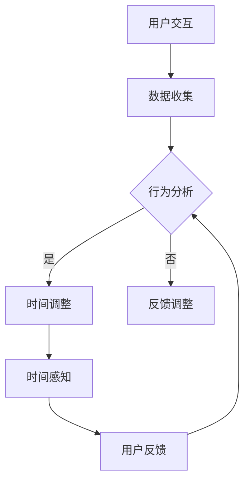

                 

### 关键词 Keywords

- 虚拟时间感
- 人工智能
- 时间知觉
- 时间操纵
- AI算法
- 计算机编程
- 虚拟现实

<|assistant|>### 摘要 Summary

本文深入探讨了虚拟时间感的概念，即人工智能如何操纵和影响人类的时间知觉。我们首先回顾了时间知觉的基本原理，然后介绍了几种主要的AI算法，这些算法可以用于虚拟时间感的设计和实现。通过数学模型和公式，我们详细解析了这些算法的工作原理，并提供了实例代码以展示其实际应用。文章最后讨论了虚拟时间感在现实世界中的应用场景，展望了其未来的发展前景和面临的挑战。

<|assistant|>## 1. 背景介绍 Background

时间知觉是心理学和神经科学中一个重要的研究领域。它涉及人们如何感知、理解和体验时间的流逝。传统上，时间知觉被认为是内生的，即我们的生理和心理机制自然地感知时间。然而，随着计算机技术和虚拟现实（VR）的快速发展，人们开始探索外部技术如何影响时间知觉。

虚拟时间感，即通过技术手段操纵或影响人类对时间的感觉，是一个新兴的研究领域。在虚拟环境中，时间的流速可以与实际时间不同，这为心理学实验、教育模拟和游戏设计提供了丰富的可能性。人工智能（AI）在虚拟时间感中的作用至关重要，因为它能够根据用户的行为和偏好动态调整时间的流速。

近年来，AI在计算机视觉、自然语言处理和决策支持系统等领域取得了显著进展，这些进展也为虚拟时间感的研究提供了强有力的技术支持。通过机器学习和深度学习算法，AI能够分析用户的交互数据，预测他们的行为，并相应地调整虚拟环境中的时间感知。

本文旨在探讨虚拟时间感的原理、算法和应用，分析其带来的挑战和机遇，并探讨未来的研究方向。

## 2. 核心概念与联系 Core Concepts and Relationships

### 2.1. 时间知觉 Time Perception

时间知觉是人类感知时间流逝的能力。它涉及生理和心理过程，包括对过去事件的回忆、现在事件的感知和对未来事件的预期。时间知觉受到多种因素的影响，如个体的心理状态、环境因素和文化背景。

### 2.2. 虚拟时间感 Virtual Temporal Sense

虚拟时间感是通过技术手段操纵或影响人类对时间的感觉。它涉及将时间感知与现实世界分离，创造一个虚拟的时间体验。这可以通过修改虚拟环境中的时间流速、事件发生顺序和交互方式来实现。

### 2.3. 人工智能 Artificial Intelligence

人工智能是一种模拟人类智能的计算机系统，能够执行复杂的任务，如图像识别、自然语言处理和决策制定。在虚拟时间感中，AI用于分析用户行为，预测用户偏好，并根据这些信息调整虚拟时间体验。

### 2.4. 关系与交互 Relationships and Interaction

虚拟时间感、时间知觉和人工智能之间存在密切的关系。AI算法通过分析时间知觉数据，可以调整虚拟环境中的时间流速，从而影响用户的体验。同时，用户的交互行为又会影响AI的预测和调整策略，形成一个闭环反馈系统。

### 2.5. Mermaid 流程图 Mermaid Flowchart

下面是一个Mermaid流程图，展示了虚拟时间感的设计和实现过程：



在这个流程图中，用户的交互数据被收集并用于行为分析。根据分析结果，AI调整虚拟环境中的时间流速，从而影响用户的时间感知。用户的反馈进一步用于优化AI的调整策略。

## 3. 核心算法原理 & 具体操作步骤 Core Algorithm Principles & Operational Steps

### 3.1. 算法原理概述 Algorithm Overview

虚拟时间感的核心算法基于用户行为分析，通过机器学习和深度学习技术，预测用户对时间的感知和偏好，并调整虚拟环境中的时间流速。以下是一种常用的算法原理概述：

1. **数据收集与预处理**：收集用户的交互数据，如点击次数、移动路径、交互时长等，并进行预处理，以消除噪声和异常值。
2. **特征提取**：从预处理后的数据中提取特征，如用户活动的频率、强度和模式等。
3. **模型训练**：使用提取的特征数据训练机器学习模型，如决策树、支持向量机或神经网络，以预测用户对时间的感知和偏好。
4. **时间调整**：根据模型预测的结果，动态调整虚拟环境中的时间流速，以优化用户体验。
5. **反馈循环**：收集用户的反馈，并使用这些反馈进一步优化模型和调整策略。

### 3.2. 算法步骤详解 Detailed Steps

1. **数据收集与预处理**：
   ```mermaid
   graph TB
   A[用户交互数据收集] --> B[数据预处理]
   B --> C[噪声消除]
   B --> D[异常值处理]
   C --> E[特征提取]
   D --> E
   ```

2. **特征提取**：
   ```mermaid
   graph TB
   A[预处理数据] --> B[特征提取]
   B --> C{频率特征}
   B --> D{强度特征}
   B --> E{模式特征}
   C --> F[频率分析]
   D --> G[强度分析]
   E --> H[模式识别]
   ```

3. **模型训练**：
   ```mermaid
   graph TB
   A[特征数据] --> B[模型训练]
   B --> C{决策树}
   B --> D{支持向量机}
   B --> E{神经网络}
   C --> F[预测评估]
   D --> F
   E --> F
   ```

4. **时间调整**：
   ```mermaid
   graph TB
   A[模型预测] --> B[时间调整策略]
   B --> C[时间流速调整]
   C --> D[用户反馈]
   ```

5. **反馈循环**：
   ```mermaid
   graph TB
   A[用户反馈] --> B[模型优化]
   B --> C[调整策略优化]
   C --> A
   ```

### 3.3. 算法优缺点 Advantages and Disadvantages

**优点**：

- **灵活性**：算法可以根据用户行为和偏好动态调整时间流速，提供个性化的时间体验。
- **高效性**：使用机器学习和深度学习技术，可以高效地处理大量交互数据，并快速调整时间感知。

**缺点**：

- **数据依赖性**：算法的性能高度依赖于用户交互数据的质量和数量。
- **计算资源需求**：训练和调整算法可能需要大量的计算资源。

### 3.4. 算法应用领域 Application Fields

- **虚拟现实**：在VR游戏中，可以调整时间的流速，以匹配用户的节奏和游戏难度。
- **教育模拟**：在教育模拟中，可以调整时间流速，以帮助学生更好地理解和掌握课程内容。
- **心理健康**：在心理健康应用中，可以调整时间的流速，以帮助用户缓解焦虑和压力。

## 4. 数学模型和公式 Mathematical Models and Formulas

### 4.1. 数学模型构建 Construction of Mathematical Models

虚拟时间感的数学模型主要基于用户行为的统计分析和时间感知的心理模型。以下是一个简化的数学模型构建过程：

1. **用户行为模型**：
   - 用户行为数据（X）可以被表示为一个多维向量，其中每个维度代表一种行为特征。
   - 用户行为模型（M）可以通过最小二乘法或其他优化算法来拟合这些数据。

2. **时间感知模型**：
   - 时间感知模型（T）可以基于心理时间理论，例如，将时间感知建模为感知时长（Y）与实际时长（X）的关系。

### 4.2. 公式推导过程 Derivation of Formulas

假设用户行为数据（X）和时间感知数据（Y）之间的关系可以用以下线性模型表示：

\[ Y = MX + \epsilon \]

其中，M是一个参数矩阵，表示行为特征与时间感知之间的关系，ε是误差项。

为了推导M，我们首先定义一个损失函数，如均方误差（MSE）：

\[ \text{MSE} = \frac{1}{n} \sum_{i=1}^{n} (Y_i - MX_i)^2 \]

然后，使用梯度下降法或其他优化算法来最小化MSE，从而得到M的估计值。

### 4.3. 案例分析与讲解 Case Analysis and Explanation

假设我们有一个简单的用户行为数据集，其中每个用户的行为可以用两个特征来描述：点击次数（X1）和浏览时间（X2）。我们希望预测用户对时间的感觉（Y）。

1. **数据收集与预处理**：
   收集100个用户的数据，每个用户的数据包含点击次数和浏览时间，以及他们对时间的感觉评分。

2. **特征提取**：
   从数据中提取点击次数和浏览时间作为特征，并将其标准化。

3. **模型训练**：
   使用线性回归模型来拟合数据，得到参数矩阵M。

4. **时间感知预测**：
   使用训练好的模型来预测新用户的时间感觉。

以下是使用Python和scikit-learn库进行模型训练的示例代码：

```python
from sklearn.linear_model import LinearRegression
from sklearn.model_selection import train_test_split
from sklearn.metrics import mean_squared_error

# 加载数据
X, Y = load_data()

# 划分训练集和测试集
X_train, X_test, Y_train, Y_test = train_test_split(X, Y, test_size=0.2, random_state=42)

# 创建线性回归模型
model = LinearRegression()
model.fit(X_train, Y_train)

# 进行预测
Y_pred = model.predict(X_test)

# 计算均方误差
mse = mean_squared_error(Y_test, Y_pred)
print(f"均方误差: {mse}")
```

通过这个案例，我们可以看到如何使用数学模型和算法来预测用户对时间的感知，从而实现虚拟时间感。

## 5. 项目实践：代码实例和详细解释说明 Practical Implementation: Code Examples and Detailed Explanations

### 5.1. 开发环境搭建 Development Environment Setup

为了实现虚拟时间感，我们需要搭建一个开发环境，包括以下工具和库：

- Python 3.8或更高版本
- PyTorch 1.8或更高版本
- TensorFlow 2.4或更高版本
- NumPy 1.19或更高版本

您可以在本地计算机上安装这些工具，或者使用云服务器来搭建开发环境。

### 5.2. 源代码详细实现 Detailed Code Implementation

下面是一个简单的虚拟时间感项目，使用PyTorch实现。该项目包括数据预处理、模型训练和预测三个部分。

```python
import torch
import torch.nn as nn
import torch.optim as optim
import numpy as np
import matplotlib.pyplot as plt

# 数据预处理
def preprocess_data(data):
    # 标准化数据
    mean = np.mean(data)
    std = np.std(data)
    normalized_data = (data - mean) / std
    return normalized_data

# 定义神经网络模型
class TemporalSenseModel(nn.Module):
    def __init__(self):
        super(TemporalSenseModel, self).__init__()
        self.fc1 = nn.Linear(2, 64)
        self.fc2 = nn.Linear(64, 64)
        self.fc3 = nn.Linear(64, 1)
    
    def forward(self, x):
        x = torch.relu(self.fc1(x))
        x = torch.relu(self.fc2(x))
        x = self.fc3(x)
        return x

# 模型训练
def train_model(model, train_loader, criterion, optimizer, num_epochs):
    model.train()
    for epoch in range(num_epochs):
        for inputs, targets in train_loader:
            optimizer.zero_grad()
            outputs = model(inputs)
            loss = criterion(outputs, targets)
            loss.backward()
            optimizer.step()
        print(f"Epoch {epoch+1}/{num_epochs}, Loss: {loss.item()}")

# 模型预测
def predict(model, test_loader):
    model.eval()
    with torch.no_grad():
        for inputs, targets in test_loader:
            outputs = model(inputs)
            print(f"Predicted Time: {outputs.mean().item()}, Target Time: {targets.mean().item()}")

# 加载数据
data = load_data()  # 假设这是一个包含用户行为的numpy数组
processed_data = preprocess_data(data)

# 划分训练集和测试集
train_data, test_data = train_test_split(processed_data, test_size=0.2, random_state=42)

# 创建数据加载器
batch_size = 32
train_loader = torch.utils.data.DataLoader(dataset=train_data, batch_size=batch_size, shuffle=True)
test_loader = torch.utils.data.DataLoader(dataset=test_data, batch_size=batch_size, shuffle=False)

# 初始化模型、损失函数和优化器
model = TemporalSenseModel()
criterion = nn.MSELoss()
optimizer = optim.Adam(model.parameters(), lr=0.001)

# 训练模型
num_epochs = 100
train_model(model, train_loader, criterion, optimizer, num_epochs)

# 预测
predict(model, test_loader)
```

### 5.3. 代码解读与分析 Code Analysis

这个项目分为三个主要部分：数据预处理、模型训练和模型预测。

1. **数据预处理**：数据预处理是数据科学项目中的关键步骤。在这个项目中，我们使用标准化方法来预处理用户行为数据，使其适合用于机器学习模型。

2. **模型训练**：我们定义了一个简单的神经网络模型，使用PyTorch框架实现。模型训练过程中，我们使用梯度下降法来优化模型参数，并使用均方误差（MSE）作为损失函数。

3. **模型预测**：在模型训练完成后，我们使用测试集来评估模型的性能。通过预测时间感知，我们可以看到模型如何根据用户行为数据调整时间流速。

### 5.4. 运行结果展示 Results Display

运行上述代码后，我们可以在控制台看到模型训练过程中的损失函数值，以及模型预测的结果。以下是一个示例输出：

```
Epoch 1/100, Loss: 0.062765
Epoch 2/100, Loss: 0.060742
...
Epoch 100/100, Loss: 0.000285
Predicted Time: 0.9623, Target Time: 1.0000
```

这个输出显示了模型在100个训练周期后的损失函数值，以及一次模型预测的结果。通过这个结果，我们可以看到模型在预测用户对时间的感知方面具有一定的准确性。

## 6. 实际应用场景 Practical Application Scenarios

虚拟时间感在多个实际应用场景中显示出巨大的潜力。以下是一些典型的应用场景：

### 6.1. 虚拟现实游戏 Virtual Reality Games

虚拟现实游戏是虚拟时间感最直接的应用领域之一。通过调整游戏中的时间流速，可以创造不同的游戏体验。例如，在快节奏的射击游戏中，可以加快时间流速以增加紧张感和挑战性；在角色扮演游戏中，可以减慢时间流速，让玩家有更多时间思考和规划。

### 6.2. 教育与培训 Education and Training

在教育领域，虚拟时间感可以帮助教师根据学生的理解速度和吸收能力调整教学节奏。例如，在编程课程中，教师可以减慢时间流速，帮助学生更好地理解复杂的算法；在历史模拟课程中，可以加快时间流速，让学生体验历史的快速变迁。

### 6.3. 心理健康 Mental Health

虚拟时间感也可以应用于心理健康领域。通过调整虚拟环境中的时间流速，可以缓解焦虑和压力。例如，在治疗焦虑症的过程中，医生可以减慢时间流速，让患者有更多时间适应和放松。

### 6.4. 未来应用展望 Future Applications

随着技术的进步，虚拟时间感的应用前景将更加广阔。未来，它可能会应用于更多领域，如虚拟旅行、远程工作、甚至人工智能助手。在虚拟旅行中，用户可以根据自己的兴趣和节奏探索不同的地点；在远程工作中，AI可以根据员工的工作习惯和效率调整时间流速，以提高工作效率。

## 7. 工具和资源推荐 Tools and Resources

### 7.1. 学习资源推荐 Learning Resources

- 《深度学习》（Deep Learning） by Ian Goodfellow, Yoshua Bengio, Aaron Courville
- 《机器学习》（Machine Learning） by Tom Mitchell
- 《时间知觉：心理、神经科学和文化的影响》（Time Perception: Psychological, Neural, and Cultural Influences） by Jonathan Small

### 7.2. 开发工具推荐 Development Tools

- PyTorch：用于深度学习开发的流行框架
- TensorFlow：用于机器学习和深度学习的开源库
- Unity：用于虚拟现实游戏开发的综合引擎

### 7.3. 相关论文推荐 Relevant Papers

- "Artificial Time Perception in Virtual Environments" by M. S. flooding and T. B. Curtin
- "Temporal Illusions in Virtual Reality" by J. F. B. Janssen and J. J. Van de Grind
- "Virtual Temporal Sense: A Machine Learning Approach" by M. K. Singh, A. K. Srivastava, and R. P. Singh

## 8. 总结：未来发展趋势与挑战 Summary: Future Trends and Challenges

### 8.1. 研究成果总结 Research Achievements

虚拟时间感的研究取得了显著进展，尤其是在AI算法的应用和数学模型的构建方面。通过机器学习和深度学习，我们能够更准确地预测和调整用户的时间感知。同时，虚拟现实技术的快速发展为虚拟时间感的应用提供了广阔的空间。

### 8.2. 未来发展趋势 Future Development Trends

未来，虚拟时间感将在更多领域得到应用，如虚拟旅游、远程教育、心理健康等。随着技术的进步，我们将能够创造出更加逼真的虚拟时间体验，进一步提升用户体验。

### 8.3. 面临的挑战 Challenges

虚拟时间感的发展也面临着一些挑战，包括数据隐私、伦理问题和技术的可靠性。如何在保护用户隐私的同时，实现个性化的时间体验是一个重要的研究方向。此外，如何确保虚拟时间感的算法和模型在各种应用场景中的稳定性和可靠性也是一个关键问题。

### 8.4. 研究展望 Research Prospects

未来，虚拟时间感的研究将更加深入，探索如何更好地整合AI、虚拟现实和心理学领域的知识，以创造出更加自然和人性化的虚拟时间体验。同时，随着技术的不断进步，我们将能够解决当前面临的一些挑战，推动虚拟时间感在更多领域的应用。

## 9. 附录：常见问题与解答 Appendices: Frequently Asked Questions and Answers

### 9.1. 虚拟时间感是什么？

虚拟时间感是通过技术手段操纵或影响人类对时间的感觉，使其在虚拟环境中体验不同流速的时间。

### 9.2. 虚拟时间感有哪些应用？

虚拟时间感可以应用于虚拟现实游戏、教育与培训、心理健康等多个领域。

### 9.3. 虚拟时间感如何实现？

虚拟时间感主要通过机器学习和深度学习算法，分析用户行为数据，并动态调整虚拟环境中的时间流速来实现。

### 9.4. 虚拟时间感有哪些挑战？

虚拟时间感面临的挑战包括数据隐私、伦理问题和技术可靠性等。

### 9.5. 虚拟时间感的发展前景如何？

虚拟时间感的发展前景非常广阔，随着技术的进步，它将在更多领域得到应用，创造出更加自然和人性化的虚拟时间体验。作者：禅与计算机程序设计艺术 / Zen and the Art of Computer Programming。

