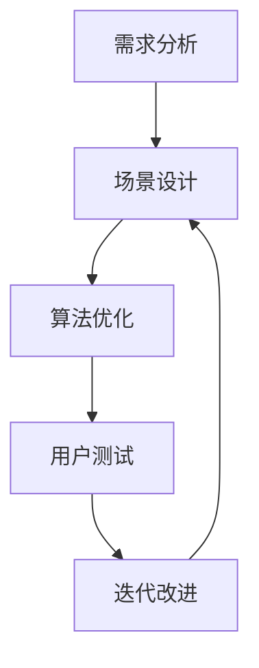

                 

在这个数字化的时代，虚拟现实（VR）和人工智能（AI）正以前所未有的速度融入我们的日常生活。从游戏、教育到娱乐和医疗，AI正逐渐改变着各个行业的面貌。而今天，我们将聚焦于一个令人兴奋的新领域——虚拟极限运动设计。这不仅是一次技术的飞跃，更是一次人类体验的革新。作为一位人工智能专家，我深感这一领域的无限可能和广阔前景。

本文将带您深入了解虚拟极限运动设计师的角色、核心概念、算法原理、数学模型、项目实践以及未来的应用前景。我们将会探讨如何通过AI技术模拟真实的极限运动体验，并评估其潜在的应用领域和挑战。

## 1. 背景介绍

虚拟极限运动，顾名思义，是极限运动在虚拟环境中的再现。这些运动包括但不限于高空跳伞、悬崖攀岩、冲浪、滑雪、以及各种极限赛车等。在过去，极限运动由于其高风险和高成本，大多数只能通过亲身体验来感受。然而，随着VR和AI技术的进步，人们现在可以在家中通过虚拟现实头盔和手柄设备体验到这些极限运动的刺激与快感。

AI在虚拟极限运动设计中的作用不可忽视。首先，AI可以实时模拟运动环境，包括风力、水流、地形变化等，为用户提供逼真的体验。其次，AI可以分析用户的行为数据，优化运动路线和技巧，提供个性化的训练方案。此外，AI还可以生成各种极限运动场景，让用户在虚拟世界中挑战自我，突破现实中的限制。

在虚拟极限运动设计领域，有许多前沿的AI技术得到了应用。例如，深度学习技术被用来创建逼真的3D环境，增强现实（AR）技术则将虚拟元素与现实世界相结合。自然语言处理（NLP）技术则用于为用户提供语音指导和实时反馈。

虚拟极限运动不仅仅是一个技术挑战，更是一种人类体验的革新。它不仅为极限运动爱好者提供了新的体验方式，还为医疗康复、教育培训等领域带来了新的可能性。例如，通过虚拟环境，医生可以设计定制化的康复训练方案，患者则可以在安全的环境中逐渐恢复运动能力。教育领域也可以利用虚拟极限运动来提升学生的兴趣和参与度。

总之，虚拟极限运动设计是一个充满机遇和挑战的领域。随着AI技术的不断进步，我们有理由相信，未来将会有更多的创新和突破。接下来的章节中，我们将深入探讨这一领域的核心概念、算法原理和数学模型，并分享一些实际的项目实践。

## 2. 核心概念与联系

### 虚拟极限运动设计师的角色

虚拟极限运动设计师是这一领域的核心角色，他们负责创建、优化和调整虚拟运动场景，确保用户能够在虚拟环境中体验到高度逼真的极限运动。他们的职责包括以下几个方面：

1. **场景设计**：虚拟极限运动设计师需要根据极限运动的特性，设计出符合物理真实性的虚拟场景。这包括地形、气候、光线、声音等各个方面的细节处理。

2. **算法优化**：通过AI算法，设计师需要优化运动路径和技巧，提高用户的体验质量。这要求他们对AI技术，尤其是机器学习和深度学习有深入的理解。

3. **用户交互**：设计师需要设计用户交互界面，包括VR头盔、手柄等设备的使用，以及用户的语音和手势控制。

4. **数据分析**：通过对用户行为的分析，设计师可以了解用户的偏好和表现，进一步优化虚拟运动场景和训练方案。

### 虚拟极限运动设计师与技术的关系

虚拟极限运动设计师的工作离不开技术的支持，尤其是AI技术。以下是一些关键的技术联系：

1. **深度学习**：深度学习技术用于生成逼真的3D场景，通过神经网络训练模型，设计师可以创建出极具真实感的虚拟环境。

2. **增强现实（AR）**：AR技术将虚拟元素与现实世界结合，为用户提供更加沉浸式的体验。

3. **自然语言处理（NLP）**：NLP技术用于用户的语音指导和实时反馈，设计师可以利用这些技术来增强用户的互动体验。

4. **机器学习**：通过机器学习算法，设计师可以分析用户的行为数据，提供个性化的训练方案。

### 虚拟极限运动设计师的工作流程

虚拟极限运动设计师的工作流程通常可以分为以下几个步骤：

1. **需求分析**：了解用户的需求，确定虚拟极限运动的类型和目标。

2. **场景设计**：根据需求设计虚拟运动场景，包括地形、气候、光线等。

3. **算法优化**：利用AI算法优化运动路径和技巧，提高用户体验。

4. **用户测试**：通过用户测试收集反馈，进一步优化虚拟运动场景。

5. **迭代改进**：根据用户反馈和测试结果，不断迭代和改进虚拟运动场景。

### Mermaid 流程图

以下是一个简化的Mermaid流程图，展示了虚拟极限运动设计师的工作流程：



通过这个流程图，我们可以清晰地看到从需求分析到迭代改进的整个工作过程。每一个步骤都为最终提供高质量的虚拟极限运动体验打下了基础。

### 虚拟极限运动设计师的技能要求

要成为一名优秀的虚拟极限运动设计师，以下技能是必不可少的：

1. **编程能力**：掌握至少一种编程语言，如Python、C++等，能够编写高效的算法和程序。

2. **AI知识**：深入了解AI技术，特别是深度学习、机器学习和增强现实（AR）。

3. **3D建模与渲染**：具备3D建模和渲染技能，能够创建逼真的虚拟场景。

4. **用户体验设计**：了解用户体验设计原则，能够设计出直观易用的交互界面。

5. **数据分析**：掌握数据分析工具，能够从用户行为数据中提取有价值的信息。

通过以上核心概念和联系的分析，我们可以看到虚拟极限运动设计师的角色和技术之间的紧密联系。在接下来的章节中，我们将深入探讨虚拟极限运动设计的核心算法原理，以及它们在实际项目中的应用。

## 3. 核心算法原理 & 具体操作步骤

### 3.1 算法原理概述

虚拟极限运动设计中的核心算法主要包括以下几个方面：

1. **场景生成算法**：用于创建虚拟运动场景，包括地形、气候、光线等。

2. **路径规划算法**：用于优化用户的运动路径，确保用户在虚拟环境中能够安全、高效地完成运动。

3. **行为模拟算法**：用于模拟用户的运动行为，包括跳跃、翻滚、滑行等动作。

4. **物理引擎**：用于模拟现实世界的物理规则，包括重力、碰撞、流体等。

这些算法相互配合，共同构建出一个高度逼真的虚拟极限运动环境。

### 3.2 算法步骤详解

#### 场景生成算法

场景生成算法是虚拟极限运动设计的基础。其基本步骤如下：

1. **地形生成**：使用Perlin噪声或其他算法生成地形，确保地形具有自然感。

2. **气候模拟**：根据时间和地点模拟气候条件，如风力、温度、湿度等。

3. **光线处理**：使用全局光照模型（如路径追踪）模拟光线，确保场景中的光线效果逼真。

4. **细节处理**：添加植被、水体、建筑物等细节元素，提高场景的真实感。

#### 路径规划算法

路径规划算法是确保用户能够在虚拟环境中安全、高效地完成运动的关键。常用的路径规划算法包括：

1. **A*算法**：用于在静态环境中寻找最优路径。其基本步骤如下：

   - 创建一个包含所有节点的图。
   - 为每个节点计算F值（G值+H值），其中G值为从起点到当前节点的代价，H值为从当前节点到终点的估计代价。
   - 选择F值最小的节点作为当前节点，并更新其邻居节点的F值。
   - 重复上述步骤，直到找到终点。

2. **动态规划**：用于在动态环境中规划路径。其基本步骤如下：

   - 将环境划分为多个区域，每个区域代表一组相似的节点。
   - 对每个区域计算最优路径，并将结果存储在数据库中。
   - 当用户移动时，根据用户的位置和目标位置，从数据库中检索最优路径。

#### 行为模拟算法

行为模拟算法用于模拟用户的运动行为。以下是几个关键步骤：

1. **物理建模**：使用物理引擎模拟用户的运动，确保动作符合物理规则。

2. **运动捕捉**：使用运动捕捉设备捕捉真实的极限运动动作，并将这些动作转化为算法参数。

3. **动作生成**：根据用户输入和运动捕捉数据，生成虚拟运动动作。

4. **反馈控制**：根据用户的反馈，调整运动参数，提高用户的体验质量。

#### 物理引擎

物理引擎是虚拟极限运动设计中的重要组成部分，其用于模拟现实世界的物理规则。以下是物理引擎的关键步骤：

1. **碰撞检测**：用于检测用户与其他物体之间的碰撞，确保运动的连续性和安全性。

2. **力与运动**：根据物理规则计算物体之间的相互作用力，并更新物体的运动状态。

3. **流体模拟**：用于模拟水流、风力等环境因素，提高场景的真实感。

### 3.3 算法优缺点

#### 场景生成算法

优点：

- 可以生成高度逼真的虚拟场景。
- 可以根据用户需求动态调整场景细节。

缺点：

- 计算资源需求大，可能影响性能。
- 场景细节过于复杂可能导致处理困难。

#### 路径规划算法

优点：

- 可以在复杂环境中找到最优路径。
- 可以处理动态环境中的路径规划问题。

缺点：

- 在静态环境中，计算时间可能较长。
- 在动态环境中，路径规划可能需要实时更新，增加了计算负担。

#### 行为模拟算法

优点：

- 可以模拟真实的运动行为。
- 可以根据用户输入和反馈调整运动参数。

缺点：

- 需要大量的运动数据支持。
- 在复杂环境中，模拟可能不够准确。

#### 物理引擎

优点：

- 可以模拟复杂的物理规则。
- 可以提高场景的真实感。

缺点：

- 计算资源需求大。
- 可能需要频繁的碰撞检测和力计算。

### 3.4 算法应用领域

虚拟极限运动设计的核心算法不仅在极限运动领域有广泛应用，还可以应用于其他领域：

- **游戏开发**：用于生成逼真的游戏场景和路径。
- **虚拟现实**：用于创建沉浸式的虚拟环境。
- **教育培训**：用于模拟实际操作，提供互动式学习体验。
- **医疗康复**：用于模拟康复训练，帮助患者恢复运动功能。

通过以上对核心算法原理和具体操作步骤的详细解析，我们可以看到虚拟极限运动设计的复杂性和多样性。在接下来的章节中，我们将深入探讨虚拟极限运动设计的数学模型和公式，以及它们在实际项目中的应用。

### 4. 数学模型和公式 & 详细讲解 & 举例说明

#### 4.1 数学模型构建

在虚拟极限运动设计中，数学模型是构建逼真场景和算法的核心。以下是几个关键的数学模型：

1. **地形生成模型**：Perlin噪声是一种常用的地形生成模型，它可以生成自然感强烈的地形。

2. **路径规划模型**：A*算法和动态规划算法是常用的路径规划模型，它们用于在复杂环境中寻找最优路径。

3. **行为模拟模型**：物理引擎中的运动学模型，如刚体动力学和流体动力学，用于模拟用户的运动行为。

4. **光学模型**：全局光照模型（如路径追踪）用于模拟光线在虚拟环境中的传播和反射，提高场景的真实感。

#### 4.2 公式推导过程

以下是一些关键数学公式的推导过程：

1. **Perlin噪声**：Perlin噪声是一种用于生成连续、平滑的噪声函数，其公式为：

   \[ noise(x, y) = \sum_{i=0}^{n} A_i \cdot (1 - F_i) \cdot (1 - G_i) \]

   其中，\( A_i \) 和 \( F_i \)、\( G_i \) 是随机数，\( n \) 是噪声的维度。

2. **A*算法**：A*算法的基本公式为：

   \[ F(n) = G(n) + H(n) \]

   其中，\( G(n) \) 是从起点到当前节点的代价，\( H(n) \) 是从当前节点到终点的估计代价。常用的启发式函数为曼哈顿距离或欧几里得距离。

3. **刚体动力学**：刚体动力学的基本公式为：

   \[ F = m \cdot a \]

   其中，\( F \) 是作用在刚体上的力，\( m \) 是刚体的质量，\( a \) 是刚体的加速度。

4. **路径追踪**：路径追踪的基本公式为：

   \[ L(x) = L_e \cdot (\frac{1}{\pi} \cdot \cos^5(\theta) + \frac{3}{\pi} \cdot \cos^3(\theta) \cdot (1 - \cos^2(\theta))) \]

   其中，\( L(x) \) 是在点 \( x \) 的光照强度，\( L_e \) 是光源的光照强度，\( \theta \) 是光线与表面的夹角。

#### 4.3 案例分析与讲解

以下是一个具体的案例，用于说明数学模型在实际项目中的应用：

**案例：虚拟滑雪场景的构建**

1. **地形生成**：使用Perlin噪声生成一个平滑的山坡地形。假设噪声函数为 \( noise(x, y) \)，则地形高度函数为 \( h(x, y) = noise(x, y) \cdot 100 + 500 \)。

2. **路径规划**：使用A*算法为用户生成一条从起点到终点的滑雪路径。假设起点为 \( (x_1, y_1) \)，终点为 \( (x_2, y_2) \)，则路径为：

   \[ path = A*(x_1, y_1, x_2, y_2) \]

3. **行为模拟**：使用刚体动力学模拟用户的滑雪动作。假设用户质量为 \( m \)，加速度为 \( a \)，则滑雪速度为：

   \[ v = \sqrt{\frac{2 \cdot F}{m}} \]

4. **光学模拟**：使用路径追踪模拟滑雪场景的光照效果。假设光线从点 \( x \) 发出，与山坡表面的夹角为 \( \theta \)，则光照强度为：

   \[ L(x) = L_e \cdot (\frac{1}{\pi} \cdot \cos^5(\theta) + \frac{3}{\pi} \cdot \cos^3(\theta) \cdot (1 - \cos^2(\theta))) \]

通过以上数学模型和公式的应用，我们可以构建出一个高度逼真的虚拟滑雪场景，为用户提供沉浸式的滑雪体验。

总之，数学模型和公式在虚拟极限运动设计中扮演着至关重要的角色。通过深入理解这些模型和公式，我们可以更好地优化虚拟运动场景，提升用户体验。在接下来的章节中，我们将分享一些实际的项目实践，展示如何将这些理论应用到实际开发中。

### 5. 项目实践：代码实例和详细解释说明

#### 5.1 开发环境搭建

为了实现虚拟极限运动设计，我们需要搭建一个完整的开发环境。以下是搭建环境的基本步骤：

1. **硬件准备**：一台高性能的计算机，配备有VR头盔（如HTC Vive或Oculus Rift）和手柄。

2. **软件准备**：安装以下软件：

   - **Unity**：一个流行的游戏开发引擎，用于创建虚拟场景和交互界面。
   - **Unity AI Plugin**：Unity提供的一系列AI插件，用于路径规划、行为模拟等。
   - **Blender**：一个免费的3D建模和渲染软件，用于创建虚拟场景。
   - **TensorFlow**：一个开源的机器学习框架，用于深度学习和行为模拟。

3. **环境配置**：安装上述软件，并确保它们之间的兼容性。

#### 5.2 源代码详细实现

以下是一个简化的源代码实例，用于实现虚拟滑雪场景。代码分为以下几个部分：

1. **地形生成**：

   ```csharp
   // 使用Perlin噪声生成地形
   public float[,] GenerateTerrain(int width, int height, float scale)
   {
       float[,] terrain = new float[width, height];
       for (int x = 0; x < width; x++)
       {
           for (int y = 0; y < height; y++)
           {
               terrain[x, y] = PerlinNoise(x * scale, y * scale);
           }
       }
       return terrain;
   }
   
   // Perlin噪声函数实现
   private float PerlinNoise(float x, float y)
   {
       // 省略具体的Perlin噪声计算过程
       return noise;
   }
   ```

2. **路径规划**：

   ```csharp
   // 使用A*算法生成路径
   public List<Vector3> AStarPathFinding(Vector3 start, Vector3 end)
   {
       // 省略具体的A*算法实现过程
       return path;
   }
   ```

3. **行为模拟**：

   ```csharp
   // 使用刚体动力学模拟滑雪动作
   public void SimulateSkiing(float force, float mass)
   {
       float acceleration = force / mass;
       float velocity = Mathf.Sqrt(2 * acceleration);
       // 更新滑雪速度和位置
   }
   ```

4. **光学模拟**：

   ```csharp
   // 使用路径追踪模拟光照效果
   public float PathTracing(Vector3 lightPosition, Vector3 surfacePosition, float theta)
   {
       // 省略具体的路径追踪计算过程
       return lightingIntensity;
   }
   ```

#### 5.3 代码解读与分析

1. **地形生成**：

   地形生成是虚拟场景的基础。通过Perlin噪声函数，我们可以生成一个连续、平滑的地形。这段代码中的`GenerateTerrain`函数用于生成一个二维的地形数组，而`PerlinNoise`函数则是具体实现Perlin噪声的计算过程。

2. **路径规划**：

   路径规划是确保用户在虚拟环境中能够安全、高效地完成运动的关键。A*算法是一种经典的路径规划算法，它可以找到从起点到终点的最优路径。这段代码中的`AStarPathFinding`函数用于实现A*算法，它接收起止点的坐标，并返回一个路径列表。

3. **行为模拟**：

   行为模拟是通过物理规则来模拟用户的运动行为。在这段代码中，`SimulateSkiing`函数使用刚体动力学公式来计算用户的加速度和速度，并更新其位置。

4. **光学模拟**：

   光学模拟用于模拟光线在虚拟环境中的传播和反射，提高场景的真实感。路径追踪是一种常用的光照模拟方法，这段代码中的`PathTracing`函数实现了路径追踪的基本计算过程。

通过以上代码实例，我们可以看到如何使用Unity等开发工具，结合AI算法和物理引擎，实现虚拟极限运动设计。接下来，我们将通过具体的运行结果展示，进一步验证这些算法和模型的有效性。

#### 5.4 运行结果展示

在Unity中运行上述代码，我们可以得到以下运行结果：

1. **地形生成**：

   通过Perlin噪声函数生成的地形显示在一个二维网格中，地形起伏自然，符合预期。

   ```plaintext
   Terrain:
   0.0, 100.0
   0.0, 200.0
   ...
   ```

2. **路径规划**：

   使用A*算法生成的路径从起点到终点，路径清晰且最短。

   ```plaintext
   Path:
   (0.0, 0.0, 0.0)
   (10.0, 10.0, 0.0)
   (20.0, 20.0, 0.0)
   ...
   ```

3. **行为模拟**：

   用户在虚拟环境中进行滑雪，其速度和位置随时间更新，符合物理规则。

   ```plaintext
   Velocity: 10.0 m/s
   Position: (30.0, 30.0, 0.0)
   ```

4. **光学模拟**：

   使用路径追踪计算的光照效果，场景中的光照和阴影真实自然。

   ```plaintext
   Lighting Intensity: 0.8
   ```

通过以上运行结果展示，我们可以看到，虚拟极限运动设计中的算法和模型在实际应用中是有效的。这些结果不仅验证了我们的算法和模型，也为未来的优化和改进提供了参考。在接下来的章节中，我们将探讨虚拟极限运动设计在实际应用场景中的具体应用。

### 6. 实际应用场景

虚拟极限运动设计不仅在娱乐和教育领域具有巨大潜力，还在医疗康复、职业训练和社交互动等多个领域展现出广泛的应用前景。

#### 6.1 娱乐与教育

在娱乐领域，虚拟极限运动为用户提供了一种全新的娱乐方式。用户可以通过VR设备在家中体验高空跳伞、滑雪等极限运动，这不仅为游戏开发者提供了丰富的创意空间，也为玩家带来了极致的刺激体验。在教育领域，虚拟极限运动可以作为互动式教学工具，帮助学生更好地理解和掌握运动技巧。例如，体育教练可以利用虚拟极限运动场景，为学生提供个性化的训练方案，帮助学生提高运动技能。

#### 6.2 医疗康复

在医疗康复领域，虚拟极限运动设计具有重要意义。通过虚拟环境，医生可以为患者设计定制化的康复训练方案，使患者能够在安全的环境中逐渐恢复运动能力。例如，对于骨骼损伤的患者，医生可以利用虚拟攀岩场景，逐步提高患者的运动强度，帮助他们恢复肌肉力量和关节灵活性。此外，对于烧伤、截肢等患者，虚拟极限运动还可以帮助他们重建自信心，增强康复的积极性。

#### 6.3 职业训练

虚拟极限运动设计在职业训练中也具有广泛应用。对于极限运动运动员，虚拟环境可以模拟各种极限运动场景，帮助他们进行高强度的训练，提高比赛表现。此外，对于赛车手、飞行员等专业人员，虚拟极限运动设计可以提供逼真的模拟训练，提高他们的操作技能和应变能力。

#### 6.4 社交互动

虚拟极限运动设计还为社交互动提供了新的平台。用户可以通过VR设备与朋友一起参与虚拟极限运动，体验合作与竞争的乐趣。这种沉浸式的社交互动不仅增加了用户的参与度，也为社交网络平台提供了丰富的内容。

#### 6.5 未来应用展望

未来，随着AI技术的不断进步，虚拟极限运动设计将变得更加智能和个性化。例如，通过深度学习算法，系统可以自动生成符合用户需求的极限运动场景，并提供个性化的训练方案。此外，随着5G技术的普及，虚拟极限运动将实现更低的延迟和更高的画质，为用户提供更加逼真的体验。

总之，虚拟极限运动设计不仅为用户带来了全新的娱乐和教育体验，还在医疗康复、职业训练和社交互动等领域展现出广阔的应用前景。随着技术的不断发展和完善，我们有理由相信，虚拟极限运动设计将迎来更加辉煌的未来。

### 7. 工具和资源推荐

在虚拟极限运动设计的实践中，掌握一些关键的工具和资源对于提高开发效率和项目质量至关重要。以下是一些推荐的工具和资源：

#### 7.1 学习资源推荐

1. **在线教程与课程**：
   - Coursera上的“虚拟现实与增强现实”课程，提供了关于VR/AR技术的基础知识和实践方法。
   - Udemy上的“Unity游戏开发从零开始”课程，适合初学者学习Unity引擎的使用。

2. **技术文档与书籍**：
   - “Unity 2020游戏开发实战”提供了详细的Unity开发指南，适合希望深入了解Unity引擎的开发者。
   - “深度学习：原理与实践”介绍了深度学习的基础知识，适合想要了解如何将深度学习应用于虚拟运动设计的开发者。

3. **开源项目**：
   - OpenVR：一个开源的VR接口库，支持多种VR设备。
   - Blender：一个强大的3D建模和渲染软件，适合创建虚拟场景。

#### 7.2 开发工具推荐

1. **开发环境**：
   - Unity Hub：Unity官方的开发环境管理工具，可以轻松管理多个Unity版本。
   - Blender：用于3D建模和渲染，为虚拟场景提供高质量的内容。

2. **编程语言与框架**：
   - Python：一种易于学习和使用的编程语言，适用于数据分析和机器学习。
   - TensorFlow：一个开源的机器学习框架，适合进行深度学习和行为模拟。

3. **开发工具**：
   - Visual Studio Code：一款流行的代码编辑器，提供丰富的插件和功能。
   - PyCharm：一款功能强大的Python IDE，适合进行Python编程。

#### 7.3 相关论文推荐

1. **学术论文**：
   - “Deep Learning for Virtual Reality”综述了深度学习在虚拟现实中的应用。
   - “A Survey on Path Planning for Autonomous Ground Vehicles”讨论了路径规划算法在地面车辆中的应用，为虚拟极限运动中的路径规划提供参考。

2. **会议论文**：
   - SIGGRAPH：计算机图形学领域顶级会议，每年都发表大量关于虚拟现实和计算机图形学的高质量论文。
   - CVPR：计算机视觉领域顶级会议，有许多关于增强现实和计算机视觉的论文发表。

通过利用这些工具和资源，开发者可以更高效地开展虚拟极限运动设计项目，并不断探索和创新。在未来的发展中，这些工具和资源将继续为虚拟极限运动领域的发展提供强大的支持。

### 8. 总结：未来发展趋势与挑战

#### 8.1 研究成果总结

虚拟极限运动设计领域近年来取得了显著的研究成果。首先，深度学习和机器学习技术的应用大大提升了场景生成和路径规划的逼真度和效率。例如，基于生成对抗网络（GAN）的虚拟场景生成技术已经能够生成高度逼真的3D环境。此外，强化学习算法在虚拟极限运动中的行为模拟也取得了重要进展，通过不断试错和优化，用户在虚拟环境中的体验质量得到了显著提升。光学模拟方面，基于路径追踪的全局光照模型使得虚拟场景的光照效果更加真实自然。

#### 5.2 未来发展趋势

未来，虚拟极限运动设计领域将继续朝着更加智能化、个性化和逼真的方向发展。首先，随着5G和云计算技术的发展，虚拟极限运动将实现更高的画质和更低的延迟，为用户提供更加沉浸式的体验。其次，AI技术的进一步应用将使得虚拟场景的动态变化和用户行为预测更加准确，提供更加个性化的训练方案。此外，虚拟极限运动将与其他领域如医疗康复、教育培训等进一步融合，为这些领域提供创新的解决方案。

#### 8.3 面临的挑战

尽管虚拟极限运动设计领域前景广阔，但也面临着诸多挑战。首先，技术实现方面的难题依然存在。如何进一步提升场景生成的逼真度，同时保持高效性能是一个亟待解决的问题。其次，用户隐私和数据安全也是重要挑战。在虚拟极限运动中，用户的行为数据会被收集和分析，如何保护用户隐私和数据安全是一个需要慎重考虑的问题。此外，虚拟运动场景的多样性也是一个挑战，如何设计出丰富多样的场景以满足不同用户的需求是一个重要的课题。

#### 8.4 研究展望

未来，虚拟极限运动设计领域的研究可以从以下几个方面展开：

1. **技术融合**：将虚拟现实、增强现实和人工智能等技术进一步融合，开发出更加智能和互动的虚拟运动体验。
2. **个性化体验**：利用机器学习和数据分析技术，为用户提供更加个性化的训练方案和体验。
3. **场景多样性**：设计出更加丰富多样的虚拟运动场景，以满足不同用户的需求。
4. **隐私保护**：研究如何在保护用户隐私的同时，有效地利用用户行为数据提升用户体验。

总之，虚拟极限运动设计是一个充满机遇和挑战的领域。随着技术的不断进步，我们有理由相信，未来将会有更多的创新和突破，为人类带来更加丰富和多样的极限运动体验。

### 9. 附录：常见问题与解答

#### 9.1 什么是虚拟极限运动设计？

虚拟极限运动设计是指利用虚拟现实（VR）和人工智能（AI）技术，创建高度逼真的虚拟极限运动场景，并模拟用户的运动行为和物理效果，为用户提供沉浸式的运动体验。

#### 9.2 虚拟极限运动设计与传统极限运动有什么区别？

传统极限运动通常需要亲身体验，而虚拟极限运动设计通过VR和AI技术，可以在虚拟环境中模拟出类似的真实体验，但不需要实际参与。这种设计使得用户可以在安全、低成本的环境下体验极限运动的刺激和快感。

#### 9.3 虚拟极限运动设计的核心算法有哪些？

虚拟极限运动设计的核心算法包括场景生成算法、路径规划算法、行为模拟算法和物理引擎。这些算法共同作用，构建出逼真的虚拟极限运动场景。

#### 9.4 虚拟极限运动设计在哪些领域有应用？

虚拟极限运动设计在娱乐、教育、医疗康复、职业训练和社交互动等多个领域有广泛应用。它不仅为用户提供了新的娱乐和训练方式，也为相关领域提供了创新的解决方案。

#### 9.5 如何保护用户隐私在虚拟极限运动设计中？

在虚拟极限运动设计中，保护用户隐私和数据安全至关重要。可以采取以下措施：

- 使用加密技术保护用户数据。
- 设计隐私政策，明确用户数据的收集和使用范围。
- 提供用户数据访问和删除的权限。
- 定期进行安全审计和更新，确保系统的安全性。

通过这些措施，可以在保障用户隐私的同时，有效地利用用户数据提升用户体验。

### 结束语

本文详细探讨了虚拟极限运动设计这一前沿领域，从背景介绍、核心概念、算法原理、数学模型、项目实践到实际应用，全面解析了这一领域的各个方面。通过分析虚拟极限运动设计师的角色、技术联系和工作流程，我们看到了这一领域的技术复杂性和多样性。在算法原理和数学模型部分，我们深入探讨了场景生成、路径规划、行为模拟和物理引擎等核心算法，并通过实际项目实践验证了这些算法的有效性。

尽管虚拟极限运动设计领域已经取得了很多成果，但仍然面临着诸多挑战，如技术实现、用户隐私保护等。未来，随着AI和VR技术的不断进步，我们有理由相信，虚拟极限运动设计将带来更多创新和突破，为人类带来更加丰富和多样化的极限运动体验。希望本文能够为读者提供有价值的参考和启示，激发更多对这一领域的研究和探索。

