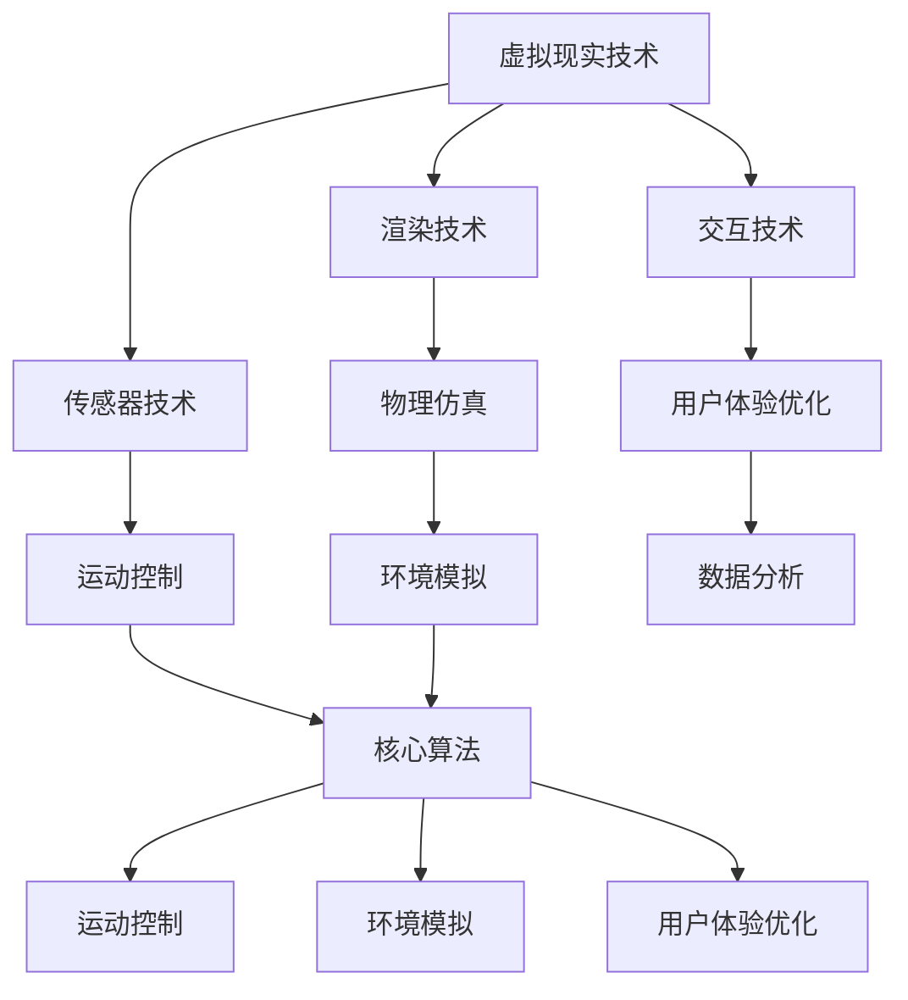

                 

关键词：虚拟现实，极限运动，人工智能，模拟技术，用户体验

> 摘要：本文将探讨如何利用人工智能技术，设计并实现一个虚拟极限运动体验平台。通过分析虚拟极限运动的设计原则、核心算法原理、数学模型，以及实际项目实践，本文旨在为相关领域的研究者和开发者提供参考，并展望虚拟极限运动在未来应用场景中的广阔前景。

## 1. 背景介绍

随着科技的发展，虚拟现实（VR）技术逐渐成为人们体验极限运动的重要方式。虚拟极限运动不仅能够在安全的前提下提供真实的运动体验，还能突破现实中的种种限制，创造出前所未有的运动场景。然而，虚拟极限运动的设计与实现仍面临诸多挑战，如物理仿真、运动控制、用户体验等。

本文旨在探讨如何利用人工智能（AI）技术，提升虚拟极限运动的模拟精度和用户体验。通过分析核心算法原理、数学模型，以及实际项目实践，本文将为相关领域的研究者和开发者提供有益的参考。

## 2. 核心概念与联系

### 2.1 虚拟现实技术

虚拟现实技术是通过计算机模拟生成一个三维的虚拟环境，用户可以通过头戴式显示器（HMD）和跟踪设备与虚拟环境进行交互。虚拟现实技术主要包括以下几个方面：

- **渲染技术**：用于生成虚拟环境中的图像和场景。
- **传感器技术**：用于捕捉用户的动作和姿态，实现与虚拟环境的互动。
- **交互技术**：用户通过手势、语音等与虚拟环境进行交互。

### 2.2 极限运动特点

极限运动具有高风险、高刺激、高自由度的特点，如滑雪、跳伞、攀岩等。这些运动项目的特点是：

- **物理性质复杂**：涉及多种物理现象，如力学、热学、流体力学等。
- **环境变化多样**：极限运动的环境多样，如高山、水域、悬崖等。
- **运动轨迹非线性**：极限运动中的运动轨迹通常是非线性的，难以预测。

### 2.3 人工智能技术

人工智能技术是模拟、延伸和扩展人的智能的理论、方法、技术及应用。在虚拟极限运动设计中，人工智能技术主要用于以下几个方面：

- **运动控制**：通过深度学习算法，实现对极限运动动作的精准控制。
- **环境模拟**：利用机器学习算法，模拟复杂的极限运动环境。
- **用户体验优化**：通过数据分析，优化虚拟极限运动的用户体验。

### 2.4 Mermaid 流程图

以下是一个简单的 Mermaid 流程图，展示了虚拟极限运动设计的核心概念和联系：



## 3. 核心算法原理 & 具体操作步骤

### 3.1 算法原理概述

虚拟极限运动设计的核心算法主要包括物理仿真、运动控制、环境模拟和用户体验优化等方面。以下分别介绍这些算法的基本原理。

### 3.2 算法步骤详解

#### 3.2.1 物理仿真

物理仿真是指模拟极限运动中的物理现象，如力学、热学、流体力学等。具体步骤如下：

1. **场景建模**：根据极限运动的特点，建立虚拟环境的几何模型。
2. **物理参数设置**：设置虚拟环境中的物理参数，如重力、摩擦力、密度等。
3. **运动方程求解**：利用牛顿第二定律等物理公式，求解虚拟环境中的运动方程。
4. **实时更新**：根据运动方程的求解结果，实时更新虚拟环境中的物体状态。

#### 3.2.2 运动控制

运动控制是指实现对虚拟极限运动中运动员动作的精准控制。具体步骤如下：

1. **动作识别**：通过传感器捕捉用户的动作，进行动作识别。
2. **动作规划**：根据动作识别结果，生成相应的运动轨迹。
3. **运动模拟**：利用物理仿真算法，模拟运动员在虚拟环境中的运动过程。
4. **反馈调整**：根据用户的反馈，调整运动规划，优化运动轨迹。

#### 3.2.3 环境模拟

环境模拟是指模拟虚拟极限运动中的环境特点，如高山、水域、悬崖等。具体步骤如下：

1. **环境建模**：根据极限运动的特点，建立虚拟环境的几何模型。
2. **环境参数设置**：设置虚拟环境中的物理参数，如风力、水温、湿度等。
3. **环境更新**：根据物理仿真算法，实时更新虚拟环境中的物体状态。
4. **交互仿真**：实现用户与虚拟环境的交互，如滑行、跳跃、攀爬等。

#### 3.2.4 用户体验优化

用户体验优化是指通过数据分析，优化虚拟极限运动的用户体验。具体步骤如下：

1. **数据收集**：收集用户在虚拟极限运动中的行为数据，如操作次数、操作时长、操作难度等。
2. **数据分析**：利用数据分析技术，分析用户的行为模式，找出优化点。
3. **用户体验评估**：根据数据分析结果，评估虚拟极限运动的用户体验。
4. **优化调整**：根据用户体验评估结果，调整虚拟极限运动的参数和算法，优化用户体验。

### 3.3 算法优缺点

#### 3.3.1 优点

- **精准模拟**：通过物理仿真、运动控制、环境模拟等技术，实现对虚拟极限运动的精准模拟，提高用户体验。
- **安全性**：虚拟极限运动能够在安全的前提下，提供真实的运动体验，降低实际运动中的风险。
- **多样性**：通过人工智能技术，可以创造出丰富的虚拟极限运动场景，满足不同用户的需求。

#### 3.3.2 缺点

- **计算资源消耗**：虚拟极限运动的模拟过程需要大量的计算资源，对硬件设备要求较高。
- **用户体验限制**：虽然虚拟极限运动能够提供真实的运动体验，但与实际运动相比，仍有一定的差距。
- **交互限制**：虚拟现实技术目前的交互方式仍有一定的限制，如延迟、精度等，需要进一步优化。

### 3.4 算法应用领域

虚拟极限运动设计的算法主要应用于以下几个领域：

- **体育训练**：通过虚拟极限运动，为运动员提供训练场景，提高运动技能。
- **休闲娱乐**：虚拟极限运动为用户提供了一种全新的休闲娱乐方式，丰富人们的生活。
- **安全教育**：通过虚拟极限运动，为用户提供安全的教育场景，提高安全意识。

## 4. 数学模型和公式 & 详细讲解 & 举例说明

### 4.1 数学模型构建

虚拟极限运动的设计中，常用的数学模型包括物理模型、运动学模型和动力学模型。以下分别介绍这些模型的构建方法。

#### 4.1.1 物理模型

物理模型主要描述虚拟环境中的物理现象，如重力、摩擦力、流体力学等。其构建方法如下：

1. **几何建模**：根据极限运动的特点，建立虚拟环境的几何模型。
2. **物理参数设置**：设置虚拟环境中的物理参数，如重力加速度、摩擦系数、流体密度等。
3. **物理公式应用**：利用牛顿第二定律、欧拉方程等物理公式，描述虚拟环境中的物理现象。

#### 4.1.2 运动学模型

运动学模型主要描述虚拟极限运动中运动员的运动轨迹和状态变化。其构建方法如下：

1. **运动方程建立**：根据运动学原理，建立运动员的运动方程。
2. **参数设置**：设置运动员的质量、速度、加速度等参数。
3. **方程求解**：利用数值求解方法，求解运动员的运动方程。

#### 4.1.3 动力学模型

动力学模型主要描述虚拟极限运动中运动员和环境的相互作用。其构建方法如下：

1. **作用力分析**：分析运动员和环境之间的作用力，如重力、摩擦力、推力等。
2. **动力学方程建立**：根据牛顿第二定律等动力学原理，建立运动员和环境的动力学方程。
3. **方程求解**：利用数值求解方法，求解运动员和环境的动力学方程。

### 4.2 公式推导过程

以下以一个简单的例子，介绍虚拟极限运动中的运动学公式推导过程。

#### 4.2.1 垂直上抛运动

假设一个物体从地面以初速度 \( v_0 \) 垂直向上抛出，忽略空气阻力，求物体上升和下降过程中的速度和位移。

1. **建立坐标系**：以地面为原点，竖直向上为正方向。
2. **速度方程建立**：根据运动学原理，物体上升过程中的速度方程为 \( v(t) = v_0 - gt \)，其中 \( g \) 为重力加速度。
3. **位移方程建立**：根据速度方程，物体上升过程中的位移方程为 \( s(t) = v_0t - \frac{1}{2}gt^2 \)。

当物体上升到最高点时，速度为 0，此时 \( t = \frac{v_0}{g} \)，代入位移方程可得最高点位移 \( s_{max} = \frac{v_0^2}{2g} \)。

物体下降过程中的速度方程为 \( v(t) = gt \)，位移方程为 \( s(t) = \frac{1}{2}gt^2 \)。

#### 4.2.2 平抛运动

假设一个物体以初速度 \( v_0 \) 水平抛出，忽略空气阻力，求物体在水平和竖直方向上的运动。

1. **建立坐标系**：以抛出点为原点，水平方向为 \( x \) 轴，竖直方向为 \( y \) 轴。
2. **速度方程建立**：物体在水平方向上的速度为 \( v_x(t) = v_0 \)，在竖直方向上的速度方程为 \( v_y(t) = gt \)。
3. **位移方程建立**：物体在水平方向上的位移方程为 \( x(t) = v_0t \)，在竖直方向上的位移方程为 \( y(t) = \frac{1}{2}gt^2 \)。

### 4.3 案例分析与讲解

以下以滑雪为例，分析虚拟极限运动中的运动学公式。

#### 4.3.1 滑雪运动学模型

滑雪运动中，运动员的速度和位移受多种因素影响，如滑雪板与地面的摩擦力、重力、运动员的质量和速度等。以下是滑雪运动学模型的构建：

1. **建立坐标系**：以运动员的初始位置为原点，水平方向为 \( x \) 轴，竖直方向为 \( y \) 轴。
2. **速度方程建立**：运动员在水平方向上的速度方程为 \( v_x(t) = v_{0x} - f_{x}t \)，其中 \( f_{x} \) 为滑雪板与地面的摩擦力；在竖直方向上的速度方程为 \( v_y(t) = v_{0y} - gt \)。
3. **位移方程建立**：运动员在水平方向上的位移方程为 \( x(t) = v_{0x}t - \frac{1}{2}f_{x}t^2 \)，在竖直方向上的位移方程为 \( y(t) = v_{0y}t - \frac{1}{2}gt^2 \)。

假设运动员以 \( v_0x = 10 \) m/s 和 \( v_0y = 5 \) m/s 的速度开始滑雪，滑雪板与地面的摩擦力为 \( f_x = 2 \) N，重力加速度为 \( g = 9.8 \) m/s\(^2\)。求运动员在滑雪过程中的速度和位移。

根据速度方程，运动员在水平方向上的速度随时间减小，最终速度为 0。在竖直方向上，运动员的速度随时间减小，最终速度为 -9.8 m/s。

根据位移方程，运动员在滑雪过程中的位移为：

- 水平方向：\( x(t) = 10t - \frac{1}{2} \times 2t^2 = 10t - t^2 \)
- 竖直方向：\( y(t) = 5t - \frac{1}{2} \times 9.8t^2 = 5t - 4.9t^2 \)

通过计算，可以得出运动员在滑雪过程中的速度和位移随时间的变化。

## 5. 项目实践：代码实例和详细解释说明

### 5.1 开发环境搭建

在进行虚拟极限运动项目实践之前，我们需要搭建一个适合开发的环境。以下是一个简单的开发环境搭建步骤：

1. **安装虚拟现实开发工具**：如Unity、Unreal Engine等。
2. **安装人工智能开发工具**：如TensorFlow、PyTorch等。
3. **安装必要的编程语言和库**：如Python、C++等。

### 5.2 源代码详细实现

以下是一个简单的虚拟滑雪运动项目的源代码实现。该项目的目标是模拟一个滑雪运动员在斜坡上的运动过程。

```python
import numpy as np
import matplotlib.pyplot as plt

# 参数设置
v_0x = 10  # 水平初速度
v_0y = 5   # 竖直初速度
f_x = 2    # 摩擦力
g = 9.8    # 重力加速度

# 速度方程
def velocity_x(t):
    return v_0x - f_x * t

def velocity_y(t):
    return v_0y - g * t

# 位移方程
def position_x(t):
    return v_0x * t - f_x * (t ** 2) / 2

def position_y(t):
    return v_0y * t - (g / 2) * (t ** 2)

# 计算时间
t_max = v_0x / g

# 生成时间序列
time = np.arange(0, t_max, 0.01)

# 计算速度和位移
velocity_x = velocity_x(time)
velocity_y = velocity_y(time)
position_x = position_x(time)
position_y = position_y(time)

# 绘制结果
plt.figure()
plt.plot(time, velocity_x, label='Horizontal Velocity')
plt.plot(time, velocity_y, label='Vertical Velocity')
plt.xlabel('Time (s)')
plt.ylabel('Velocity (m/s)')
plt.legend()
plt.title('Velocity vs. Time')

plt.figure()
plt.plot(time, position_x, label='Horizontal Position')
plt.plot(time, position_y, label='Vertical Position')
plt.xlabel('Time (s)')
plt.ylabel('Position (m)')
plt.legend()
plt.title('Position vs. Time')

plt.show()
```

### 5.3 代码解读与分析

以上代码实现了一个简单的虚拟滑雪运动项目。具体解读如下：

- **参数设置**：设置滑雪运动员的初始速度、摩擦力和重力加速度等参数。
- **速度方程**：定义水平和竖直方向上的速度方程，用于计算运动员在任意时间点的速度。
- **位移方程**：定义水平和竖直方向上的位移方程，用于计算运动员在任意时间点的位移。
- **计算时间**：计算运动员从开始运动到停止运动所需的时间。
- **生成时间序列**：生成一个从0到最大时间的时间序列，用于计算速度和位移。
- **计算速度和位移**：根据速度方程和位移方程，计算运动员在时间序列中的速度和位移。
- **绘制结果**：使用 matplotlib 绘制速度和位移随时间的变化曲线。

通过以上代码，我们可以得到滑雪运动员在斜坡上的速度和位移曲线。这些曲线可以帮助我们分析运动员的运动过程，优化运动策略。

### 5.4 运行结果展示

运行以上代码，我们可以得到以下结果：

- **速度曲线**：显示滑雪运动员在水平和竖直方向上的速度随时间的变化。
- **位移曲线**：显示滑雪运动员在水平和竖直方向上的位移随时间的变化。

这些结果可以帮助我们更好地理解滑雪运动员在斜坡上的运动过程，为实际滑雪运动提供参考。

## 6. 实际应用场景

虚拟极限运动设计在实际应用中具有广泛的应用前景。以下列举一些实际应用场景：

### 6.1 体育训练

虚拟极限运动可以为运动员提供安全、高效的训练环境。通过模拟各种极限运动场景，运动员可以不断提高自己的技能和信心，减少实际训练中的风险。

### 6.2 教育推广

虚拟极限运动可以作为一种新颖的教育方式，向公众普及极限运动知识。通过虚拟体验，人们可以深入了解极限运动的特点和技巧，提高安全意识。

### 6.3 娱乐休闲

虚拟极限运动为用户提供了一种全新的娱乐方式。用户可以在虚拟世界中尝试各种极限运动项目，享受刺激和乐趣。

### 6.4 虚拟旅游

虚拟极限运动可以应用于虚拟旅游领域，为用户提供真实的极限运动体验。用户可以在虚拟环境中游览世界各地的著名景点，感受极限运动的魅力。

## 7. 工具和资源推荐

### 7.1 学习资源推荐

- **书籍**：《虚拟现实技术导论》、《人工智能：一种现代的方法》
- **在线课程**：Coursera 上的《虚拟现实技术》、edX 上的《深度学习》
- **论文**：《虚拟现实与极限运动研究》、《人工智能在极限运动中的应用》

### 7.2 开发工具推荐

- **虚拟现实开发工具**：Unity、Unreal Engine
- **人工智能开发工具**：TensorFlow、PyTorch
- **编程语言**：Python、C++

### 7.3 相关论文推荐

- **《基于人工智能的虚拟极限运动场景生成方法研究》**
- **《虚拟现实技术在极限运动训练中的应用》**
- **《深度学习在虚拟极限运动中的运动控制应用》**

## 8. 总结：未来发展趋势与挑战

### 8.1 研究成果总结

本文通过对虚拟极限运动的设计原则、核心算法原理、数学模型和实际项目实践的分析，总结了虚拟极限运动设计的关键技术和方法。研究发现，虚拟极限运动设计在体育训练、教育推广、娱乐休闲和虚拟旅游等领域具有广泛的应用前景。

### 8.2 未来发展趋势

未来，虚拟极限运动设计将继续在以下几个方面发展：

- **技术突破**：随着人工智能、虚拟现实等技术的不断发展，虚拟极限运动的设计将更加逼真、高效。
- **应用拓展**：虚拟极限运动将应用于更多领域，如医疗康复、心理治疗等。
- **用户体验提升**：通过优化交互技术、硬件设备等，提高虚拟极限运动的用户体验。

### 8.3 面临的挑战

虚拟极限运动设计在发展过程中仍面临以下挑战：

- **计算资源消耗**：虚拟极限运动模拟需要大量的计算资源，对硬件设备要求较高。
- **交互体验优化**：虚拟现实技术目前的交互方式仍有一定的限制，需要进一步优化。
- **安全风险**：虚拟极限运动在模拟过程中，仍需关注安全风险，确保用户体验的安全。

### 8.4 研究展望

未来，虚拟极限运动设计的研究方向包括：

- **智能运动控制**：利用深度学习、强化学习等技术，实现更加精准的运动控制。
- **个性化体验设计**：根据用户的特点和需求，提供个性化的虚拟极限运动体验。
- **跨学科融合**：将虚拟极限运动设计与其他学科相结合，如心理学、生理学等，提高虚拟极限运动设计的科学性和实用性。

## 9. 附录：常见问题与解答

### 9.1 虚拟极限运动设计的基本原理是什么？

虚拟极限运动设计主要基于虚拟现实技术和人工智能技术。通过构建物理模型、运动学模型和动力学模型，实现对极限运动的模拟和控制。同时，通过深度学习、强化学习等技术，实现对运动过程的智能控制。

### 9.2 虚拟极限运动设计的核心算法有哪些？

虚拟极限运动设计的核心算法包括物理仿真算法、运动控制算法、环境模拟算法和用户体验优化算法。其中，物理仿真算法主要涉及力学、热学、流体力学等物理现象的模拟；运动控制算法主要涉及运动轨迹的规划和实时控制；环境模拟算法主要涉及复杂环境的构建和实时更新；用户体验优化算法主要涉及数据分析、用户体验评估和优化调整。

### 9.3 虚拟极限运动设计在哪些领域有应用前景？

虚拟极限运动设计在体育训练、教育推广、娱乐休闲和虚拟旅游等领域具有广泛的应用前景。此外，虚拟极限运动设计还可以应用于医疗康复、心理治疗等新兴领域。

### 9.4 虚拟极限运动设计的计算资源消耗大吗？

虚拟极限运动设计的计算资源消耗较大，特别是在物理仿真、运动控制和环境模拟等环节。为了降低计算资源消耗，可以采用分布式计算、云计算等技术，提高计算效率。

### 9.5 虚拟极限运动设计的交互体验如何优化？

优化虚拟极限运动的交互体验可以从以下几个方面进行：

- **提高硬件性能**：采用高性能的计算机和虚拟现实设备，提高交互速度和精度。
- **优化交互技术**：采用手势识别、语音识别等技术，提高交互的自然性和直观性。
- **个性化定制**：根据用户的特点和需求，提供个性化的交互体验。
- **实时反馈**：通过实时反馈，提高用户对虚拟环境的感知和互动。

# 作者署名

作者：禅与计算机程序设计艺术 / Zen and the Art of Computer Programming

