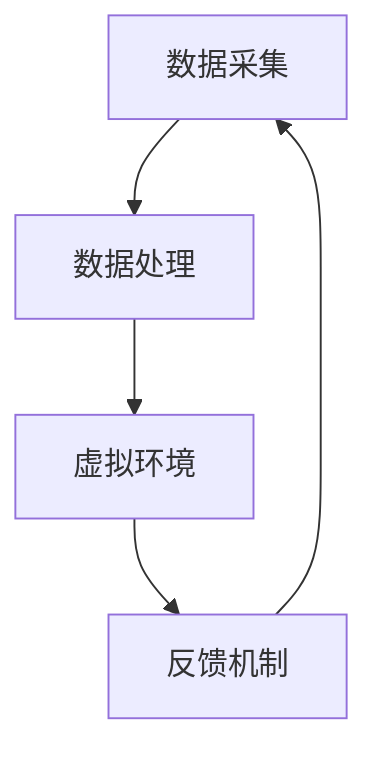

                 

关键词：虚拟治疗、心理健康服务、人工智能、机器学习、自然语言处理、心理疗法

## 摘要

本文旨在探讨人工智能（AI）在心理健康服务中的应用，尤其是虚拟治疗技术的兴起。随着机器学习、自然语言处理等技术的快速发展，AI已经能够有效地诊断、治疗和预防心理疾病。本文将介绍虚拟治疗的基本概念、技术架构、核心算法以及数学模型，并通过实际项目实例，展示其在心理健康服务中的潜力和应用前景。

## 1. 背景介绍

### 心理健康服务的现状

在全球范围内，心理健康问题日益凸显。据世界卫生组织（WHO）统计，全球约有四分之一的人口在一生中某个阶段会经历某种形式的心理健康问题。然而，由于心理健康的诊断和治疗需要专业知识和技巧，且治疗过程复杂且耗时，许多患者无法获得及时有效的帮助。

### 人工智能的发展

随着人工智能技术的迅速发展，机器学习、自然语言处理等技术在医疗领域的应用逐渐深入。AI系统可以处理海量数据，提供精准的诊断和治疗方案，从而提高医疗效率，降低成本。特别是在心理健康服务领域，AI的应用前景尤为广阔。

## 2. 核心概念与联系

### 虚拟治疗

虚拟治疗是一种利用计算机技术和虚拟现实（VR）技术进行的心理治疗。患者通过VR设备进入一个虚拟环境，与虚拟角色进行互动，从而进行心理治疗。虚拟治疗可以模拟现实生活中的场景，提供沉浸式的治疗体验。

### 技术架构

虚拟治疗的技术架构主要包括以下几个部分：

1. **数据采集**：通过传感器、摄像头等设备采集患者的行为数据、生理数据等。
2. **数据处理**：利用机器学习和自然语言处理技术对采集到的数据进行分析和处理。
3. **虚拟环境**：构建一个逼真的虚拟环境，患者可以在其中与虚拟角色互动。
4. **反馈机制**：根据患者的反馈和行为，调整虚拟环境的设置和治疗方案。

### Mermaid 流程图



## 3. 核心算法原理 & 具体操作步骤

### 3.1 算法原理概述

虚拟治疗的核心算法主要包括：

1. **情感识别算法**：通过分析患者的语音、面部表情和行为，识别患者的情绪状态。
2. **治疗目标设定算法**：根据患者的情绪状态和病情，设定个性化的治疗目标。
3. **交互算法**：患者与虚拟角色进行互动，实现心理治疗。

### 3.2 算法步骤详解

1. **情感识别算法**：
   - **预处理**：对语音、面部表情和行为数据进行预处理，提取关键特征。
   - **情感识别**：利用深度学习模型对预处理后的数据进行分析，识别患者的情绪状态。

2. **治疗目标设定算法**：
   - **数据分析**：对患者的情绪状态进行分析，确定主要问题。
   - **目标设定**：根据分析结果，设定个性化的治疗目标。

3. **交互算法**：
   - **对话生成**：根据治疗目标和患者的情绪状态，生成对话内容。
   - **交互实现**：患者与虚拟角色进行互动，实现心理治疗。

### 3.3 算法优缺点

**优点**：
- **个性化**：根据患者的具体情况，提供个性化的治疗。
- **便捷性**：患者可以在家中进行虚拟治疗，无需外出。

**缺点**：
- **依赖技术**：虚拟治疗需要依赖计算机技术和虚拟现实设备。
- **治疗效果**：虚拟治疗的效果需要进一步验证。

### 3.4 算法应用领域

虚拟治疗的应用领域主要包括：
- **抑郁症**：通过虚拟现实技术，帮助患者缓解抑郁情绪。
- **焦虑症**：通过虚拟环境，帮助患者适应和克服焦虑。
- **创伤后应激障碍（PTSD）**：通过模拟创伤场景，帮助患者缓解创伤后应激症状。

## 4. 数学模型和公式 & 详细讲解 & 举例说明

### 4.1 数学模型构建

虚拟治疗的数学模型主要包括以下几个方面：

1. **情感模型**：用于描述患者的情绪状态。
2. **目标模型**：用于设定和治疗目标。
3. **交互模型**：用于描述患者与虚拟角色的互动。

### 4.2 公式推导过程

情感模型的推导过程如下：

设 \( x \) 为患者的行为数据，\( y \) 为患者的情绪状态，则：

\[ y = f(x) \]

其中，\( f \) 为情感识别函数，可以通过深度学习模型进行训练。

### 4.3 案例分析与讲解

以抑郁症患者的虚拟治疗为例，情感模型的具体应用如下：

1. **情感识别**：通过分析患者的语音、面部表情和行为，识别患者的情绪状态。
2. **目标设定**：根据患者的情绪状态，设定个性化的治疗目标，如减轻抑郁情绪、提高生活满意度等。
3. **交互实现**：患者与虚拟角色进行互动，通过对话、场景切换等方式，实现心理治疗。

## 5. 项目实践：代码实例和详细解释说明

### 5.1 开发环境搭建

开发环境搭建主要包括以下步骤：

1. 安装 Python 环境和虚拟环境工具（如 virtualenv）。
2. 安装必要的库（如 TensorFlow、PyTorch、OpenCV 等）。

### 5.2 源代码详细实现

源代码实现主要包括以下几个部分：

1. **数据采集与预处理**：
   ```python
   import cv2
   import numpy as np

   # 采集面部图像
   video_capture = cv2.VideoCapture(0)

   while True:
       # 读取一帧图像
       ret, frame = video_capture.read()

       # 对图像进行预处理
       processed_frame = preprocess_frame(frame)

       # 输出预处理后的图像
       cv2.imshow('Video', processed_frame)

       if cv2.waitKey(1) & 0xFF == ord('q'):
           break

   video_capture.release()
   cv2.destroyAllWindows()
   ```

2. **情感识别**：
   ```python
   import tensorflow as tf

   # 加载情感识别模型
   model = tf.keras.models.load_model('emotion_recognition_model.h5')

   # 对预处理后的图像进行情感识别
   emotion = model.predict(processed_frame)

   print('情绪状态：', emotion)
   ```

3. **交互实现**：
   ```python
   import cv2
   import pygame

   # 初始化 Pygame
   pygame.init()

   # 创建 Pygame 屏幕
   screen = pygame.display.set_mode((800, 600))

   # 加载虚拟角色
   virtual_role = pygame.image.load('virtual_role.png')

   while True:
       # 绘制虚拟角色
       screen.blit(virtual_role, (300, 300))

       # 更新屏幕显示
       pygame.display.flip()

       # 处理事件
       for event in pygame.event.get():
           if event.type == pygame.QUIT:
               pygame.quit()
   ```

### 5.3 代码解读与分析

代码解读主要关注以下几个部分：

1. **数据采集与预处理**：使用 OpenCV 进行图像采集和预处理，提取关键特征。
2. **情感识别**：使用 TensorFlow 深度学习模型进行情感识别。
3. **交互实现**：使用 Pygame 创建虚拟环境，实现患者与虚拟角色的互动。

### 5.4 运行结果展示

运行结果展示主要包括以下几个部分：

1. **实时情感识别**：显示患者的实时情绪状态。
2. **虚拟治疗场景**：展示患者与虚拟角色的互动场景。

## 6. 实际应用场景

### 6.1 抑郁症治疗

抑郁症是一种常见的心理健康问题。虚拟治疗可以模拟现实生活中的场景，帮助患者缓解抑郁情绪。例如，通过虚拟森林散步、与虚拟动物互动等方式，减轻患者的压力和焦虑。

### 6.2 焦虑症治疗

焦虑症的治疗通常需要患者进行暴露疗法，即让患者面对引发焦虑的情境。虚拟治疗可以模拟这些情境，帮助患者逐渐适应和克服焦虑。例如，通过虚拟考试场景、社交场合等，帮助患者提高应对能力。

### 6.3 创伤后应激障碍（PTSD）治疗

创伤后应激障碍（PTSD）是一种常见的心理创伤后遗症。虚拟治疗可以模拟创伤场景，帮助患者重新面对和接受创伤经历，从而缓解症状。例如，通过虚拟战争场景、自然灾害场景等，帮助患者逐步克服恐惧和焦虑。

## 7. 未来应用展望

### 7.1 技术进步

随着人工智能技术的不断进步，虚拟治疗将更加智能化、个性化。未来，AI 将能够更好地理解和预测患者的情绪状态，提供更加精准的治疗方案。

### 7.2 应用拓展

虚拟治疗的应用领域将不断拓展，不仅局限于心理健康服务，还将应用于教育、娱乐、医疗等多个领域。例如，通过虚拟治疗技术，实现远程心理治疗、在线教育等。

### 7.3 社会效益

虚拟治疗具有广泛的社会效益。它可以帮助解决心理健康问题，提高生活质量和幸福感。此外，虚拟治疗还可以降低医疗成本，提高医疗资源的利用效率。

## 8. 工具和资源推荐

### 8.1 学习资源推荐

1. **《深度学习》（Goodfellow, Bengio, Courville 著）**：介绍深度学习的基础知识和技术。
2. **《机器学习》（Tom Mitchell 著）**：介绍机器学习的基础理论和方法。

### 8.2 开发工具推荐

1. **TensorFlow**：用于构建和训练深度学习模型。
2. **PyTorch**：另一种流行的深度学习框架。

### 8.3 相关论文推荐

1. **“Virtual Reality for Mental Health: Current Status and Future Trends”**：综述虚拟治疗在心理健康领域的应用。
2. **“Deep Learning for Emotional Recognition”**：介绍深度学习在情感识别中的应用。

## 9. 总结：未来发展趋势与挑战

### 9.1 研究成果总结

虚拟治疗作为一种新兴的心理健康服务，已经取得了显著的成果。通过人工智能技术的应用，虚拟治疗提供了个性化、便捷的治疗方式，提高了心理健康服务的效率和质量。

### 9.2 未来发展趋势

未来，虚拟治疗将继续发展，技术将更加成熟，应用领域将不断拓展。随着人工智能技术的进步，虚拟治疗将能够更好地理解和预测患者的情绪状态，提供更加精准的治疗方案。

### 9.3 面临的挑战

虚拟治疗也面临一些挑战，包括技术实现、治疗效果、隐私保护等方面。需要进一步研究和解决这些问题，以确保虚拟治疗的安全性和有效性。

### 9.4 研究展望

未来，虚拟治疗有望在心理健康服务领域发挥更大的作用。通过多学科合作，不断优化技术和应用，虚拟治疗将为更多人提供高质量的医疗服务。

## 附录：常见问题与解答

### 问题1：虚拟治疗的安全性问题如何保障？

**解答**：虚拟治疗的安全性问题主要通过以下几个方面进行保障：
- **数据加密**：对患者的数据进行加密处理，确保数据安全。
- **隐私保护**：严格遵守隐私保护法规，确保患者的隐私不受侵犯。
- **安全性测试**：对虚拟治疗系统进行安全性测试，确保系统的稳定性和可靠性。

### 问题2：虚拟治疗的效果如何评估？

**解答**：虚拟治疗的效果可以通过以下几个方面进行评估：
- **患者反馈**：收集患者的治疗体验和反馈，了解患者的满意度和治疗效果。
- **临床实验**：通过临床实验，验证虚拟治疗的有效性和安全性。
- **量化指标**：通过量化指标（如情绪状态、生活质量等）评估治疗效果。

### 问题3：虚拟治疗适用于哪些人群？

**解答**：虚拟治疗适用于以下人群：
- **有心理健康问题的人群**：如抑郁症、焦虑症、创伤后应激障碍等。
- **不方便外出就诊的人群**：如行动不便、居住偏远地区等。
- **希望进行心理治疗的人群**：如学生、职场人士等。

## 作者署名

作者：禅与计算机程序设计艺术 / Zen and the Art of Computer Programming

----------------------------------------------------------------

