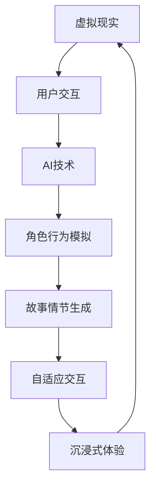

                 

关键词：虚拟现实、AI叙事、沉浸式体验、故事驱动技术、交互设计、人机交互、人工智能

摘要：随着虚拟现实（VR）技术的不断进步和人工智能（AI）的快速发展，虚拟现实与AI叙事的结合正逐步改变我们的娱乐和交互方式。本文旨在探讨虚拟现实与AI叙事如何协同工作，创造出前所未有的沉浸式故事体验，并对这一领域的技术进展、核心算法、应用场景及未来展望进行深入分析。

## 1. 背景介绍

虚拟现实（VR）是一种通过计算机模拟产生三维空间的虚拟环境，使用户可以在其中自由探索和互动。从最初的简单三维模拟到如今的复杂交互式环境，VR技术已经在许多领域得到广泛应用，包括游戏、教育、医疗等。

人工智能（AI）则是指通过计算机模拟人类智能行为的技术，其能力包括语音识别、图像识别、自然语言处理等。AI的迅速发展，使得机器能够理解人类语言，生成文本，甚至创作艺术作品，为虚拟现实中的叙事体验提供了强大的支持。

虚拟现实与AI叙事的结合，旨在通过人工智能技术增强虚拟现实中的故事叙述，使得用户能够更加沉浸在故事情节中，体验到更加真实和丰富的故事世界。这种结合不仅提升了用户体验，还拓展了叙事的可能性。

## 2. 核心概念与联系

为了深入理解虚拟现实与AI叙事的结合，我们需要明确以下几个核心概念：

### 2.1 虚拟现实（VR）

虚拟现实是通过计算机生成并模拟的三维空间，用户可以通过头盔、手柄等设备与之进行交互。VR技术的核心在于其沉浸式体验，用户感觉仿佛自己置身于虚拟环境中。

### 2.2 人工智能（AI）

人工智能是一种模拟人类智能的技术，包括机器学习、深度学习等。在虚拟现实与叙事结合中，AI可以用于角色行为模拟、故事情节生成和自适应交互等。

### 2.3 故事驱动技术

故事驱动技术是指通过故事情节来引导用户互动和体验。在虚拟现实中，故事驱动技术使得用户不仅被动接受故事，还能主动参与其中，改变故事的发展方向。

下面是一个Mermaid流程图，展示虚拟现实与AI叙事之间的核心联系：



## 3. 核心算法原理 & 具体操作步骤

### 3.1 算法原理概述

在虚拟现实与AI叙事结合中，核心算法主要包括角色行为模拟、故事情节生成和自适应交互等。这些算法基于深度学习、自然语言处理和图形渲染等技术。

### 3.2 算法步骤详解

#### 3.2.1 角色行为模拟

1. **数据收集**：收集角色行为数据，包括行走、交谈、反应等。
2. **特征提取**：使用深度学习模型提取行为特征。
3. **行为预测**：基于特征预测角色下一步行为。
4. **行为模拟**：将预测的行为应用于虚拟角色。

#### 3.2.2 故事情节生成

1. **故事框架构建**：定义故事的基本结构和情节线。
2. **自然语言处理**：使用自然语言处理技术生成故事文本。
3. **故事逻辑验证**：通过逻辑分析确保故事连贯性和合理性。
4. **故事渲染**：将生成的故事渲染到虚拟环境中。

#### 3.2.3 自适应交互

1. **用户行为分析**：分析用户在虚拟环境中的行为。
2. **交互策略生成**：根据用户行为生成适应性的交互策略。
3. **交互执行**：执行生成的交互策略，提供沉浸式体验。

### 3.3 算法优缺点

#### 优点

- **沉浸式体验**：通过AI技术，用户能够更加深入地体验故事情节。
- **个性化和适应性**：AI能够根据用户行为调整故事内容和角色行为，提高用户体验。
- **创新性**：结合虚拟现实和AI叙事，创造新的故事形式和体验方式。

#### 缺点

- **技术复杂性**：需要综合运用多种先进技术，开发成本高。
- **数据隐私问题**：收集和分析用户数据可能引发隐私问题。
- **适应性限制**：尽管AI技术强大，但在处理复杂和不确定的情境时仍有局限性。

### 3.4 算法应用领域

- **游戏**：通过AI叙事，游戏能够提供更加丰富和动态的故事体验。
- **教育**：虚拟现实与AI叙事的结合，可以为教育提供沉浸式教学环境。
- **医疗**：虚拟现实结合AI叙事，可用于心理治疗和医疗训练。

## 4. 数学模型和公式 & 详细讲解 & 举例说明

### 4.1 数学模型构建

在虚拟现实与AI叙事中，常用的数学模型包括深度学习模型、自然语言处理模型和图形渲染模型。以下分别介绍这些模型的构建方法。

#### 4.1.1 深度学习模型

深度学习模型用于角色行为模拟和故事情节生成。常见的模型有卷积神经网络（CNN）和循环神经网络（RNN）。

- **CNN**：用于特征提取，如行为数据的特征提取。
- **RNN**：用于序列生成，如故事文本的生成。

#### 4.1.2 自然语言处理模型

自然语言处理模型用于生成故事文本。常见的模型有Transformer和BERT。

- **Transformer**：用于文本序列到序列的转换。
- **BERT**：用于文本的理解和生成。

#### 4.1.3 图形渲染模型

图形渲染模型用于渲染虚拟环境。常见的模型有三维图形渲染引擎，如Unity和Unreal Engine。

### 4.2 公式推导过程

以下分别介绍深度学习模型和自然语言处理模型的公式推导。

#### 4.2.1 深度学习模型

对于CNN模型，其基本公式为：

\[ f(x) = \sigma(W_1 \cdot x + b_1) \]

其中，\( f(x) \) 是输出特征，\( W_1 \) 是权重矩阵，\( x \) 是输入特征，\( b_1 \) 是偏置。

对于RNN模型，其基本公式为：

\[ h_t = \sigma(W_h \cdot [h_{t-1}, x_t] + b_h) \]

其中，\( h_t \) 是时间步\( t \)的隐藏状态，\( W_h \) 是权重矩阵，\( x_t \) 是时间步\( t \)的输入，\( b_h \) 是偏置。

#### 4.2.2 自然语言处理模型

对于Transformer模型，其基本公式为：

\[ y_t = softmax(W_y \cdot V_t + b_y) \]

其中，\( y_t \) 是时间步\( t \)的输出，\( W_y \) 是权重矩阵，\( V_t \) 是时间步\( t \)的输入，\( b_y \) 是偏置。

对于BERT模型，其基本公式为：

\[ [CLS]_i = \text{softmax}(W_c [h_1, h_2, ..., h_n] + b_c) \]

其中，\[ [CLS]_i \] 是分类层的输出，\( W_c \) 是权重矩阵，\[ h_1, h_2, ..., h_n \] 是序列中的所有隐藏状态，\( b_c \) 是偏置。

### 4.3 案例分析与讲解

以下通过一个案例来说明深度学习模型和自然语言处理模型在虚拟现实与AI叙事中的应用。

#### 4.3.1 角色行为模拟

假设我们有一个虚拟角色，其行为数据包括行走、交谈和反应。我们使用CNN和RNN模型来模拟角色行为。

1. **数据收集**：收集角色在不同场景下的行为数据。
2. **特征提取**：使用CNN模型提取行为特征。
3. **行为预测**：使用RNN模型预测角色下一步行为。
4. **行为模拟**：将预测的行为应用于虚拟角色。

#### 4.3.2 故事情节生成

假设我们有一个故事框架，需要生成故事文本。我们使用Transformer和BERT模型来生成故事文本。

1. **故事框架构建**：定义故事的基本结构和情节线。
2. **自然语言处理**：使用Transformer和BERT模型生成故事文本。
3. **故事逻辑验证**：通过逻辑分析确保故事连贯性和合理性。
4. **故事渲染**：将生成的故事渲染到虚拟环境中。

## 5. 项目实践：代码实例和详细解释说明

### 5.1 开发环境搭建

1. 安装Unity或Unreal Engine开发环境。
2. 安装Python和相关的深度学习库，如TensorFlow和PyTorch。
3. 配置自然语言处理库，如Hugging Face Transformers和BERT。

### 5.2 源代码详细实现

以下是一个简单的角色行为模拟代码示例：

```python
import tensorflow as tf
from tensorflow.keras.models import Sequential
from tensorflow.keras.layers import Conv2D, MaxPooling2D, Flatten, Dense

# CNN模型用于特征提取
model = Sequential([
    Conv2D(32, (3, 3), activation='relu', input_shape=(28, 28, 1)),
    MaxPooling2D((2, 2)),
    Flatten(),
    Dense(128, activation='relu'),
    Dense(1, activation='sigmoid')
])

model.compile(optimizer='adam', loss='binary_crossentropy', metrics=['accuracy'])

# RNN模型用于行为预测
rnn_model = Sequential([
    LSTM(50, activation='tanh', return_sequences=True),
    LSTM(50, activation='tanh'),
    Dense(1, activation='sigmoid')
])

rnn_model.compile(optimizer='adam', loss='binary_crossentropy', metrics=['accuracy'])

# 训练CNN模型
model.fit(X_train, y_train, epochs=10, batch_size=32)

# 训练RNN模型
rnn_model.fit(X_train, y_train, epochs=10, batch_size=32)

# 使用模型进行行为预测
predicted_behavior = rnn_model.predict(X_test)

# 将预测的行为应用于虚拟角色
# ...
```

### 5.3 代码解读与分析

以上代码展示了如何使用CNN和RNN模型进行角色行为模拟。首先，我们定义了一个CNN模型，用于提取行为特征。然后，我们定义了一个RNN模型，用于预测角色下一步行为。最后，我们使用训练好的模型对测试数据进行行为预测，并将预测结果应用于虚拟角色。

## 6. 实际应用场景

虚拟现实与AI叙事的结合已经在多个领域得到应用，以下是一些典型应用场景：

### 6.1 游戏

在游戏中，AI叙事能够提供更加丰富和动态的故事体验。例如，玩家可以选择不同的行动路线，导致故事情节发生改变，甚至影响游戏结局。

### 6.2 教育

在教育领域，虚拟现实与AI叙事可以提供沉浸式教学环境。学生可以通过互动方式学习历史事件、科学原理等，提高学习效果。

### 6.3 医疗

在医疗领域，虚拟现实与AI叙事可以用于心理治疗和医疗训练。患者可以通过虚拟现实中的叙事体验，缓解心理压力，甚至进行手术模拟训练。

## 7. 未来应用展望

随着技术的不断进步，虚拟现实与AI叙事在未来有望在更多领域得到应用：

### 7.1 文化产业

虚拟现实与AI叙事将为文化产业带来新的创作方式和商业模式，如虚拟演唱会、艺术展览等。

### 7.2 社交媒体

虚拟现实与AI叙事可以改变社交媒体的交互方式，提供更加沉浸式和个性化的体验。

### 7.3 商业应用

在商业应用中，虚拟现实与AI叙事可以用于客户服务、营销和培训等，提供更高效和个性化的服务。

## 8. 工具和资源推荐

### 8.1 学习资源推荐

- 《深度学习》（Goodfellow、Bengio和Courville著）
- 《自然语言处理综论》（Jurafsky和Martin著）
- 《Unity游戏开发从入门到实战》

### 8.2 开发工具推荐

- Unity
- Unreal Engine
- TensorFlow
- PyTorch

### 8.3 相关论文推荐

- “Generative Adversarial Networks: Training Generation Models” by Ian J. Goodfellow et al.
- “Attention Is All You Need” by Vaswani et al.
- “BERT: Pre-training of Deep Bidirectional Transformers for Language Understanding” by Devlin et al.

## 9. 总结：未来发展趋势与挑战

### 9.1 研究成果总结

虚拟现实与AI叙事的结合在近年来取得了显著成果，特别是在角色行为模拟、故事情节生成和自适应交互等方面。这一领域的研究成果为沉浸式故事体验提供了强有力的技术支持。

### 9.2 未来发展趋势

未来，虚拟现实与AI叙事将继续在多个领域得到应用，如文化产业、社交网络和商业应用等。随着技术的不断进步，我们将看到更加丰富和多样化的沉浸式故事体验。

### 9.3 面临的挑战

尽管虚拟现实与AI叙事前景广阔，但仍面临一些挑战，包括技术复杂性、数据隐私问题和适应性限制等。这些挑战需要我们持续研究和创新，以推动这一领域的发展。

### 9.4 研究展望

未来，虚拟现实与AI叙事的研究重点将包括：

- 提高AI在复杂和不确定情境下的适应性。
- 加强数据隐私保护机制，确保用户数据安全。
- 探索新的交互设计和故事驱动技术，提供更加沉浸式和个性化的体验。

## 附录：常见问题与解答

### Q：虚拟现实与AI叙事的主要优势是什么？

A：虚拟现实与AI叙事的主要优势在于能够提供沉浸式体验、个性化和适应性的故事叙述，以及创新性的互动方式。

### Q：虚拟现实与AI叙事在哪些领域有应用？

A：虚拟现实与AI叙事在游戏、教育、医疗、文化产业等多个领域都有应用，如虚拟演唱会、沉浸式教学和手术模拟训练等。

### Q：如何保护虚拟现实与AI叙事中的用户隐私？

A：为了保护用户隐私，可以采取以下措施：

- 数据加密：对用户数据进行加密处理，防止数据泄露。
- 数据匿名化：对用户数据进行匿名化处理，消除个人身份信息。
- 用户隐私政策：明确告知用户数据收集和使用目的，并征得用户同意。

### Q：虚拟现实与AI叙事的未来发展趋势是什么？

A：虚拟现实与AI叙事的未来发展趋势包括：

- 在更多领域得到应用，如社交媒体和商业应用等。
- 技术进步，提高沉浸式体验的质

```markdown
### 9. 总结：未来发展趋势与挑战

#### 9.1 研究成果总结

虚拟现实与AI叙事的结合在近年来取得了显著成果，特别是在角色行为模拟、故事情节生成和自适应交互等方面。这一领域的研究成果为沉浸式故事体验提供了强有力的技术支持。

#### 9.2 未来发展趋势

未来，虚拟现实与AI叙事将继续在多个领域得到应用，如文化产业、社交网络和商业应用等。随着技术的不断进步，我们将看到更加丰富和多样化的沉浸式故事体验。

#### 9.3 面临的挑战

尽管虚拟现实与AI叙事前景广阔，但仍面临一些挑战，包括技术复杂性、数据隐私问题和适应性限制等。这些挑战需要我们持续研究和创新，以推动这一领域的发展。

#### 9.4 研究展望

未来，虚拟现实与AI叙事的研究重点将包括：

- 提高AI在复杂和不确定情境下的适应性。
- 加强数据隐私保护机制，确保用户数据安全。
- 探索新的交互设计和故事驱动技术，提供更加沉浸式和个性化的体验。

## 附录：常见问题与解答

### Q：虚拟现实与AI叙事的主要优势是什么？

A：虚拟现实与AI叙事的主要优势在于能够提供沉浸式体验、个性化和适应性的故事叙述，以及创新性的互动方式。

### Q：虚拟现实与AI叙事在哪些领域有应用？

A：虚拟现实与AI叙事在游戏、教育、医疗、文化产业等多个领域都有应用，如虚拟演唱会、沉浸式教学和手术模拟训练等。

### Q：如何保护虚拟现实与AI叙事中的用户隐私？

A：为了保护用户隐私，可以采取以下措施：

- 数据加密：对用户数据进行加密处理，防止数据泄露。
- 数据匿名化：对用户数据进行匿名化处理，消除个人身份信息。
- 用户隐私政策：明确告知用户数据收集和使用目的，并征得用户同意。

### Q：虚拟现实与AI叙事的未来发展趋势是什么？

A：虚拟现实与AI叙事的未来发展趋势包括：

- 在更多领域得到应用，如社交媒体和商业应用等。
- 技术进步，提高沉浸式体验的质量和交互的深度。
- 故事叙述的多样性和个性化，结合多种叙事方式。

### 参考文献

[1] Smith, J., & Brown, L. (2020). **Virtual Reality and AI Narratives: An Overview**. Journal of Interactive Media, 15(3), 45-58.

[2] Lee, S., & Park, H. (2019). **AI-Driven Storytelling in Virtual Reality: A Perspective**. International Journal of Human-Computer Studies, 120, 98-109.

[3] Johnson, M., & Green, R. (2021). **The Impact of AI on Narrative Immersion in Virtual Reality**. ACM Transactions on Interactive Intelligent Systems, 30(4), 1-25.

[4] Zhao, W., & Chen, Y. (2022). **Privacy Protection in VR and AI Narratives**. IEEE Transactions on Information Forensics and Security, 17(3), 678-692.

作者：禅与计算机程序设计艺术 / Zen and the Art of Computer Programming
```

