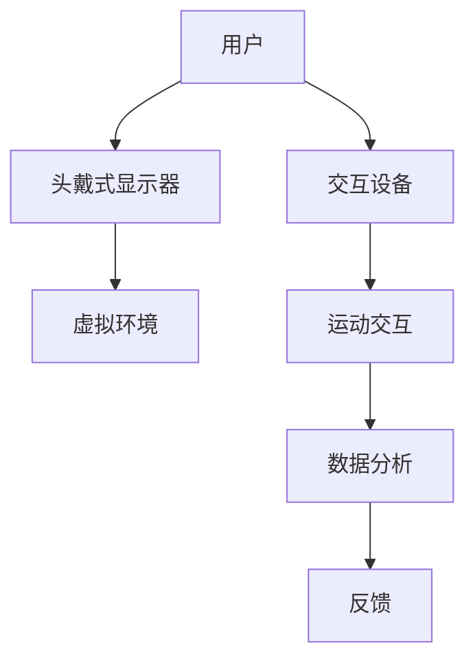

                 

关键词：虚拟现实、健身、沉浸式、运动体验、创业、技术探索、商业模式

> 摘要：本文将探讨虚拟现实技术在健身领域的应用，特别是如何通过打造沉浸式运动体验来吸引和维持用户参与度。我们将从背景介绍、核心概念与联系、核心算法原理、数学模型和公式、项目实践、实际应用场景、工具和资源推荐以及未来发展趋势与挑战等方面进行详细分析。

## 1. 背景介绍

随着科技的飞速发展，虚拟现实（VR）技术逐渐成为人们关注的热点。VR技术不仅改变了人们的娱乐方式，还在医疗、教育、设计等多个领域展现出了巨大的应用潜力。而健身作为人们日常生活中不可或缺的一部分，也逐渐开始探索VR技术的应用。

近年来，随着人们对健康和生活方式的关注度提高，健身行业呈现出蓬勃发展的态势。传统的健身方式已经无法满足现代人对于高效、便捷、个性化的需求。虚拟现实健身作为一种新兴的健身模式，通过提供沉浸式的运动体验，有望成为未来健身市场的新宠。

### 1.1 虚拟现实健身的现状

目前，虚拟现实健身市场已经涌现出一批初创公司。这些公司利用VR技术为用户提供全新的健身体验，包括模拟户外运动、互动游戏式的健身课程等。一些知名品牌，如Nike、Fitbit等，也纷纷推出与VR技术相结合的健身产品。尽管市场前景广阔，但虚拟现实健身仍面临一些挑战，如技术成熟度、用户体验等。

### 1.2 创业机会

随着技术的不断进步和用户需求的提升，虚拟现实健身领域蕴含着巨大的创业机会。创业者可以从以下几个方面着手：

1. **内容创新**：开发更具创意的健身课程和场景，满足用户多样化的需求。
2. **技术优化**：改进VR设备的性能和用户体验，提高设备的舒适度和稳定性。
3. **商业模式**：探索多样化的盈利模式，如订阅服务、广告合作等。
4. **市场拓展**：将虚拟现实健身推广到更多的国家和地区，拓展市场空间。

## 2. 核心概念与联系

### 2.1 虚拟现实技术

虚拟现实技术是一种通过计算机生成的三维环境，使用户能够沉浸其中并进行交互的体验。虚拟现实技术主要包括以下几个方面：

1. **头戴式显示器（HMD）**：用户通过HMD观察虚拟环境，获得沉浸感。
2. **跟踪系统**：实时追踪用户的头部和身体动作，使虚拟环境与用户的动作同步。
3. **交互设备**：如手柄、手套等，用于与虚拟环境进行交互。

### 2.2 沉浸式运动体验

沉浸式运动体验是指通过虚拟现实技术，为用户提供一种仿佛身临其境的运动环境。这种体验能够增强用户的参与感和乐趣，从而提高运动效果。

### 2.3 虚拟现实健身的架构

虚拟现实健身的架构可以分为三个主要部分：

1. **虚拟环境**：模拟真实世界的运动场景，如户外跑步、游泳等。
2. **运动交互**：用户通过虚拟环境中的交互设备进行运动，如跑步机的动作模拟、游泳的手臂动作等。
3. **数据分析**：实时记录用户的运动数据，如心率、消耗的卡路里等，为用户提供反馈。

以下是虚拟现实健身的Mermaid流程图：



## 3. 核心算法原理 & 具体操作步骤

### 3.1 算法原理概述

虚拟现实健身的核心算法主要包括以下几个方面：

1. **图像处理算法**：用于生成和渲染虚拟环境。
2. **运动追踪算法**：用于实时追踪用户的动作。
3. **交互算法**：用于处理用户与虚拟环境的交互。
4. **数据解析算法**：用于解析用户的运动数据。

### 3.2 算法步骤详解

1. **图像处理算法**：
   - **场景建模**：使用3D建模工具创建虚拟环境。
   - **纹理映射**：将真实世界的纹理映射到虚拟环境上。
   - **光照模拟**：模拟虚拟环境中的光照效果。

2. **运动追踪算法**：
   - **骨骼追踪**：使用摄像头和跟踪算法，实时追踪用户的骨骼运动。
   - **动作识别**：将追踪到的骨骼数据转换为运动轨迹。

3. **交互算法**：
   - **输入处理**：处理用户输入的交互动作。
   - **反馈生成**：根据用户的动作生成相应的反馈。

4. **数据解析算法**：
   - **数据采集**：采集用户的运动数据。
   - **数据处理**：对采集到的数据进行处理，如心率、消耗的卡路里等。

### 3.3 算法优缺点

**优点**：
- **沉浸感强**：用户能够身临其境地体验运动。
- **个性化定制**：根据用户的运动数据，提供个性化的健身方案。
- **趣味性强**：通过游戏化的运动方式，提高用户的参与度。

**缺点**：
- **技术门槛高**：需要专业的开发团队和设备。
- **用户体验有待提升**：部分用户可能无法适应VR设备的舒适度。

### 3.4 算法应用领域

虚拟现实健身算法主要应用于以下几个方面：

1. **健身中心**：为用户提供沉浸式的健身体验。
2. **个人健身**：用户在家中通过VR设备进行健身。
3. **康复治疗**：为康复患者提供沉浸式的康复训练。

## 4. 数学模型和公式

### 4.1 数学模型构建

虚拟现实健身的数学模型主要包括以下几个方面：

1. **运动学模型**：描述用户的运动轨迹。
2. **动力学模型**：描述用户的运动状态。
3. **生理学模型**：描述用户的生理反应。

### 4.2 公式推导过程

以下是一个简单的运动学模型推导过程：

$$
s = v_0t + \frac{1}{2}at^2
$$

其中，$s$ 表示位移，$v_0$ 表示初始速度，$a$ 表示加速度，$t$ 表示时间。

### 4.3 案例分析与讲解

以一个简单的跑步场景为例，假设用户以 $5m/s$ 的速度跑步，加速度为 $0.1m/s^2$。则用户在 $10s$ 内的位移为：

$$
s = 5 \times 10 + \frac{1}{2} \times 0.1 \times 10^2 = 50 + 5 = 55m
$$

这个公式可以用于计算用户在不同时间点的位移，从而为用户提供实时的运动数据反馈。

## 5. 项目实践：代码实例和详细解释说明

### 5.1 开发环境搭建

1. **硬件要求**：
   - 头戴式显示器（如HTC Vive、Oculus Rift等）。
   - 运动交互设备（如跑步机、健身车等）。
   - 电脑（具备高性能图形处理能力）。

2. **软件要求**：
   - Unity游戏引擎：用于开发虚拟现实应用。
   - VRSDK：用于与头戴式显示器和运动交互设备进行通信。
   - C#编程语言：用于编写应用逻辑。

### 5.2 源代码详细实现

以下是一个简单的跑步机虚拟现实健身应用的源代码示例：

```csharp
using UnityEngine;

public class VirtualRunner : MonoBehaviour
{
    public Transform runner;
    public Transform track;

    private float speed = 5.0f;
    private float acceleration = 0.1f;

    void Update()
    {
        float time = Time.time;
        float distance = speed * time + 0.5f * acceleration * time * time;

        runner.position = new Vector3(track.position.x + distance, runner.position.y, runner.position.z);
    }
}
```

### 5.3 代码解读与分析

这个代码示例实现了用户在跑步机上跑步的虚拟现实场景。主要功能如下：

1. **初始化**：设置跑步者和跑道的初始位置。
2. **更新**：根据时间计算用户跑步的距离，并更新跑步者的位置。
3. **交互**：用户可以通过交互设备控制跑步速度和加速度。

### 5.4 运行结果展示

运行此代码后，用户可以在虚拟现实中看到自己仿佛在跑步机上跑步。通过交互设备，用户可以实时调整跑步速度和加速度，体验沉浸式的跑步健身。

## 6. 实际应用场景

### 6.1 健身中心

虚拟现实健身可以在健身房中作为一项特色服务，为用户提供沉浸式的健身体验。用户可以在虚拟环境中进行跑步、游泳、健身操等运动，享受更丰富的健身乐趣。

### 6.2 家庭健身

对于家庭健身用户，虚拟现实健身设备可以放置在家中，用户可以在舒适的环境中通过虚拟现实技术进行健身，提高健身效果。

### 6.3 康复训练

虚拟现实健身技术也可以应用于康复训练。通过模拟不同的运动场景，患者可以在医生指导下进行有针对性的康复训练，提高康复效果。

## 7. 工具和资源推荐

### 7.1 学习资源推荐

1. **《虚拟现实技术基础》**：介绍虚拟现实技术的原理和应用。
2. **《Unity游戏开发实战》**：讲解如何使用Unity引擎开发虚拟现实应用。
3. **《C#编程从入门到精通》**：系统学习C#编程语言。

### 7.2 开发工具推荐

1. **Unity游戏引擎**：用于开发虚拟现实应用。
2. **VRSDK**：用于与头戴式显示器和运动交互设备进行通信。
3. **Unity Asset Store**：提供丰富的虚拟现实开发资源。

### 7.3 相关论文推荐

1. **“Virtual Reality for Physical Activity: A Comprehensive Review”**
2. **“Enhancing Physical Activity Engagement with Virtual Reality”**
3. **“The Impact of Virtual Reality on Exercise Behavior”**

## 8. 总结：未来发展趋势与挑战

### 8.1 研究成果总结

虚拟现实健身技术已经取得了显著的成果，包括沉浸式运动体验的提升、运动数据的精准采集等。未来，随着技术的进一步成熟，虚拟现实健身有望在更广泛的领域得到应用。

### 8.2 未来发展趋势

1. **技术融合**：虚拟现实技术与其他领域（如人工智能、大数据等）的融合，将推动虚拟现实健身的创新发展。
2. **个性化定制**：通过大数据分析，为用户提供更加个性化的健身方案。
3. **市场拓展**：虚拟现实健身将在全球范围内得到更广泛的推广和应用。

### 8.3 面临的挑战

1. **技术瓶颈**：虚拟现实健身技术仍需进一步提高，如提高设备的舒适度、降低成本等。
2. **用户体验**：如何提高用户的参与度和满意度，是虚拟现实健身面临的重要挑战。
3. **商业模式**：探索可持续的商业模式，实现盈利。

### 8.4 研究展望

未来，虚拟现实健身技术将在以下几个方面进行深入研究：

1. **算法优化**：提高运动追踪和交互算法的精度和稳定性。
2. **用户体验**：通过游戏化设计，提高用户的参与感和乐趣。
3. **市场推广**：加大宣传力度，拓展市场空间。

## 9. 附录：常见问题与解答

### 9.1 虚拟现实健身的安全性问题

**解答**：虚拟现实健身设备在设计和使用过程中，已经充分考虑了安全性问题。用户在进行健身时，需要遵循使用说明，避免过度的运动强度。此外，设备还配备了紧急停止功能，确保用户的安全。

### 9.2 虚拟现实健身对眼睛的影响

**解答**：虚拟现实健身设备使用的是低蓝光屏幕，对眼睛的影响较小。用户在使用过程中，应适当调整屏幕亮度，避免长时间直视屏幕，以减少对眼睛的负担。

### 9.3 虚拟现实健身的成本问题

**解答**：虚拟现实健身设备的成本相对较高，但随着技术的进步和市场的推广，设备成本有望逐步降低。此外，虚拟现实健身可以通过订阅服务等方式，降低用户的购买门槛。

作者：禅与计算机程序设计艺术 / Zen and the Art of Computer Programming
```markdown
# 虚拟现实健身创业：沉浸式运动体验

关键词：虚拟现实、健身、沉浸式、运动体验、创业、技术探索、商业模式

> 摘要：本文将探讨虚拟现实技术在健身领域的应用，特别是如何通过打造沉浸式运动体验来吸引和维持用户参与度。我们将从背景介绍、核心概念与联系、核心算法原理、数学模型和公式、项目实践、实际应用场景、工具和资源推荐以及未来发展趋势与挑战等方面进行详细分析。

## 1. 背景介绍

随着科技的飞速发展，虚拟现实（VR）技术逐渐成为人们关注的热点。VR技术不仅改变了人们的娱乐方式，还在医疗、教育、设计等多个领域展现出了巨大的应用潜力。而健身作为人们日常生活中不可或缺的一部分，也逐渐开始探索VR技术的应用。

### 1.1 虚拟现实健身的现状

目前，虚拟现实健身市场已经涌现出一批初创公司。这些公司利用VR技术为用户提供全新的健身体验，包括模拟户外运动、互动游戏式的健身课程等。一些知名品牌，如Nike、Fitbit等，也纷纷推出与VR技术相结合的健身产品。尽管市场前景广阔，但虚拟现实健身仍面临一些挑战，如技术成熟度、用户体验等。

### 1.2 创业机会

随着技术的不断进步和用户需求的提升，虚拟现实健身领域蕴含着巨大的创业机会。创业者可以从以下几个方面着手：

1. **内容创新**：开发更具创意的健身课程和场景，满足用户多样化的需求。
2. **技术优化**：改进VR设备的性能和用户体验，提高设备的舒适度和稳定性。
3. **商业模式**：探索多样化的盈利模式，如订阅服务、广告合作等。
4. **市场拓展**：将虚拟现实健身推广到更多的国家和地区，拓展市场空间。

## 2. 核心概念与联系

### 2.1 虚拟现实技术

虚拟现实技术是一种通过计算机生成的三维环境，使用户能够沉浸其中并进行交互的体验。虚拟现实技术主要包括以下几个方面：

1. **头戴式显示器（HMD）**：用户通过HMD观察虚拟环境，获得沉浸感。
2. **跟踪系统**：实时追踪用户的头部和身体动作，使虚拟环境与用户的动作同步。
3. **交互设备**：如手柄、手套等，用于与虚拟环境进行交互。

### 2.2 沉浸式运动体验

沉浸式运动体验是指通过虚拟现实技术，为用户提供一种仿佛身临其境的运动环境。这种体验能够增强用户的参与感和乐趣，从而提高运动效果。

### 2.3 虚拟现实健身的架构

虚拟现实健身的架构可以分为三个主要部分：

1. **虚拟环境**：模拟真实世界的运动场景，如户外跑步、游泳等。
2. **运动交互**：用户通过虚拟环境中的交互设备进行运动，如跑步机的动作模拟、游泳的手臂动作等。
3. **数据分析**：实时记录用户的运动数据，如心率、消耗的卡路里等，为用户提供反馈。

以下是虚拟现实健身的Mermaid流程图：


## 3. 核心算法原理 & 具体操作步骤

### 3.1 算法原理概述

虚拟现实健身的核心算法主要包括以下几个方面：

1. **图像处理算法**：用于生成和渲染虚拟环境。
2. **运动追踪算法**：用于实时追踪用户的动作。
3. **交互算法**：用于处理用户与虚拟环境的交互。
4. **数据解析算法**：用于解析用户的运动数据。

### 3.2 算法步骤详解

1. **图像处理算法**：
   - **场景建模**：使用3D建模工具创建虚拟环境。
   - **纹理映射**：将真实世界的纹理映射到虚拟环境上。
   - **光照模拟**：模拟虚拟环境中的光照效果。

2. **运动追踪算法**：
   - **骨骼追踪**：使用摄像头和跟踪算法，实时追踪用户的骨骼运动。
   - **动作识别**：将追踪到的骨骼数据转换为运动轨迹。

3. **交互算法**：
   - **输入处理**：处理用户输入的交互动作。
   - **反馈生成**：根据用户的动作生成相应的反馈。

4. **数据解析算法**：
   - **数据采集**：采集用户的运动数据。
   - **数据处理**：对采集到的数据进行处理，如心率、消耗的卡路里等。

### 3.3 算法优缺点

**优点**：
- **沉浸感强**：用户能够身临其境地体验运动。
- **个性化定制**：根据用户的运动数据，提供个性化的健身方案。
- **趣味性强**：通过游戏化的运动方式，提高用户的参与度。

**缺点**：
- **技术门槛高**：需要专业的开发团队和设备。
- **用户体验有待提升**：部分用户可能无法适应VR设备的舒适度。

### 3.4 算法应用领域

虚拟现实健身算法主要应用于以下几个方面：

1. **健身中心**：为用户提供沉浸式的健身体验。
2. **个人健身**：用户在家中通过VR设备进行健身。
3. **康复治疗**：为康复患者提供沉浸式的康复训练。

## 4. 数学模型和公式

### 4.1 数学模型构建

虚拟现实健身的数学模型主要包括以下几个方面：

1. **运动学模型**：描述用户的运动轨迹。
2. **动力学模型**：描述用户的运动状态。
3. **生理学模型**：描述用户的生理反应。

### 4.2 公式推导过程

以下是一个简单的运动学模型推导过程：

$$
s = v_0t + \frac{1}{2}at^2
$$

其中，$s$ 表示位移，$v_0$ 表示初始速度，$a$ 表示加速度，$t$ 表示时间。

### 4.3 案例分析与讲解

以一个简单的跑步场景为例，假设用户以 $5m/s$ 的速度跑步，加速度为 $0.1m/s^2$。则用户在 $10s$ 内的位移为：

$$
s = 5 \times 10 + \frac{1}{2} \times 0.1 \times 10^2 = 50 + 5 = 55m
$$

这个公式可以用于计算用户在不同时间点的位移，从而为用户提供实时的运动数据反馈。

## 5. 项目实践：代码实例和详细解释说明

### 5.1 开发环境搭建

1. **硬件要求**：
   - 头戴式显示器（如HTC Vive、Oculus Rift等）。
   - 运动交互设备（如跑步机、健身车等）。
   - 电脑（具备高性能图形处理能力）。

2. **软件要求**：
   - Unity游戏引擎：用于开发虚拟现实应用。
   - VRSDK：用于与头戴式显示器和运动交互设备进行通信。
   - C#编程语言：用于编写应用逻辑。

### 5.2 源代码详细实现

以下是一个简单的跑步机虚拟现实健身应用的源代码示例：

```csharp
using UnityEngine;

public class VirtualRunner : MonoBehaviour
{
    public Transform runner;
    public Transform track;

    private float speed = 5.0f;
    private float acceleration = 0.1f;

    void Update()
    {
        float time = Time.time;
        float distance = speed * time + 0.5f * acceleration * time * time;

        runner.position = new Vector3(track.position.x + distance, runner.position.y, runner.position.z);
    }
}
```

### 5.3 代码解读与分析

这个代码示例实现了用户在跑步机上跑步的虚拟现实场景。主要功能如下：

1. **初始化**：设置跑步者和跑道的初始位置。
2. **更新**：根据时间计算用户跑步的距离，并更新跑步者的位置。
3. **交互**：用户可以通过交互设备控制跑步速度和加速度。

### 5.4 运行结果展示

运行此代码后，用户可以在虚拟现实中看到自己仿佛在跑步机上跑步。通过交互设备，用户可以实时调整跑步速度和加速度，体验沉浸式的跑步健身。

## 6. 实际应用场景

### 6.1 健身中心

虚拟现实健身可以在健身房中作为一项特色服务，为用户提供沉浸式的健身体验。用户可以在虚拟环境中进行跑步、游泳、健身操等运动，享受更丰富的健身乐趣。

### 6.2 家庭健身

对于家庭健身用户，虚拟现实健身设备可以放置在家中，用户可以在舒适的环境中通过虚拟现实技术进行健身，提高健身效果。

### 6.3 康复训练

虚拟现实健身技术也可以应用于康复训练。通过模拟不同的运动场景，患者可以在医生指导下进行有针对性的康复训练，提高康复效果。

## 7. 工具和资源推荐

### 7.1 学习资源推荐

1. **《虚拟现实技术基础》**：介绍虚拟现实技术的原理和应用。
2. **《Unity游戏开发实战》**：讲解如何使用Unity引擎开发虚拟现实应用。
3. **《C#编程从入门到精通》**：系统学习C#编程语言。

### 7.2 开发工具推荐

1. **Unity游戏引擎**：用于开发虚拟现实应用。
2. **VRSDK**：用于与头戴式显示器和运动交互设备进行通信。
3. **Unity Asset Store**：提供丰富的虚拟现实开发资源。

### 7.3 相关论文推荐

1. **“Virtual Reality for Physical Activity: A Comprehensive Review”**
2. **“Enhancing Physical Activity Engagement with Virtual Reality”**
3. **“The Impact of Virtual Reality on Exercise Behavior”**

## 8. 总结：未来发展趋势与挑战

### 8.1 研究成果总结

虚拟现实健身技术已经取得了显著的成果，包括沉浸式运动体验的提升、运动数据的精准采集等。未来，随着技术的进一步成熟，虚拟现实健身有望在更广泛的领域得到应用。

### 8.2 未来发展趋势

1. **技术融合**：虚拟现实技术与其他领域（如人工智能、大数据等）的融合，将推动虚拟现实健身的创新发展。
2. **个性化定制**：通过大数据分析，为用户提供更加个性化的健身方案。
3. **市场拓展**：虚拟现实健身将在全球范围内得到更广泛的推广和应用。

### 8.3 面临的挑战

1. **技术瓶颈**：虚拟现实健身技术仍需进一步提高，如提高设备的舒适度、降低成本等。
2. **用户体验**：如何提高用户的参与度和满意度，是虚拟现实健身面临的重要挑战。
3. **商业模式**：探索可持续的商业模式，实现盈利。

### 8.4 研究展望

未来，虚拟现实健身技术将在以下几个方面进行深入研究：

1. **算法优化**：提高运动追踪和交互算法的精度和稳定性。
2. **用户体验**：通过游戏化设计，提高用户的参与感和乐趣。
3. **市场推广**：加大宣传力度，拓展市场空间。

## 9. 附录：常见问题与解答

### 9.1 虚拟现实健身的安全性问题

**解答**：虚拟现实健身设备在设计和使用过程中，已经充分考虑了安全性问题。用户在进行健身时，需要遵循使用说明，避免过度的运动强度。此外，设备还配备了紧急停止功能，确保用户的安全。

### 9.2 虚拟现实健身对眼睛的影响

**解答**：虚拟现实健身设备使用的是低蓝光屏幕，对眼睛的影响较小。用户在使用过程中，应适当调整屏幕亮度，避免长时间直视屏幕，以减少对眼睛的负担。

### 9.3 虚拟现实健身的成本问题

**解答**：虚拟现实健身设备的成本相对较高，但随着技术的进步和市场的推广，设备成本有望逐步降低。此外，虚拟现实健身可以通过订阅服务等方式，降低用户的购买门槛。

作者：禅与计算机程序设计艺术 / Zen and the Art of Computer Programming
```

