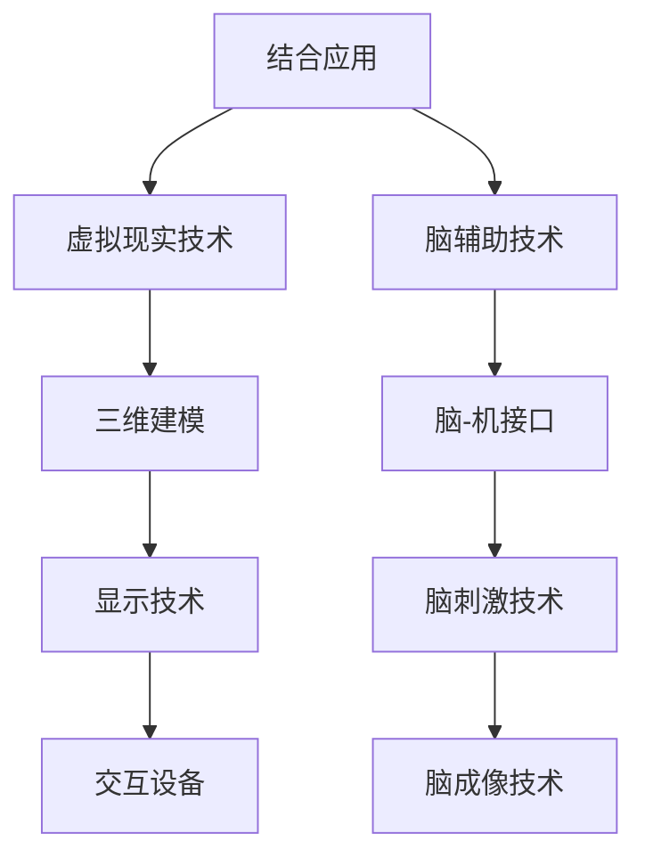

                 

关键词：虚拟现实，心理康复，脑辅助，创伤治疗，认知神经科学，技术发展

## 摘要

随着科技的不断进步，虚拟现实（VR）技术在心理康复领域展现出巨大的潜力。本文旨在探讨虚拟现实在创伤治疗中的作用，特别是通过全球脑辅助技术实现的个性化心理康复方案。本文将首先介绍虚拟现实和脑辅助技术的基本概念，随后分析其在心理康复中的应用，重点讨论其技术原理、实施步骤和案例分析。此外，本文还将展望虚拟现实创伤治疗的发展趋势和面临的挑战，并提出未来研究的方向。

## 1. 背景介绍

创伤治疗是心理康复的一个重要领域，旨在帮助经历创伤的人群恢复心理功能，减轻痛苦和焦虑。传统的创伤治疗通常依赖于心理医生和药物治疗，但效果有限，且过程漫长。近年来，虚拟现实（VR）技术的快速发展为心理康复领域带来了新的契机。VR技术通过创造沉浸式的虚拟环境，为患者提供了一种新的体验方式，使其能够在安全、可控的环境中进行心理治疗。

同时，脑辅助技术也在快速发展。脑辅助技术利用神经科学技术，通过直接干预大脑活动，提高认知功能和康复效果。例如，脑-机接口（BMI）技术通过读取大脑信号，实现与外部设备的交互。这些技术的结合为心理康复提供了更先进、更有效的手段。

## 2. 核心概念与联系

### 2.1 虚拟现实（VR）技术

虚拟现实技术是一种通过计算机生成逼真的三维环境，使人们能够在其中进行交互和体验的技术。VR技术主要包括以下几个方面：

- **三维建模**：通过三维建模软件创建虚拟环境。
- **显示技术**：使用头戴式显示器（HMD）或其他显示设备提供沉浸式体验。
- **交互设备**：手柄、触觉反馈设备等，实现用户与虚拟环境的交互。

### 2.2 脑辅助技术

脑辅助技术主要涉及以下几种：

- **脑-机接口（BMI）**：通过读取大脑信号，实现与外部设备的交互。
- **脑刺激技术**：如经颅磁刺激（TMS）和经颅电刺激（TDCS），通过直接干预大脑活动，调节神经功能。
- **脑成像技术**：如功能性磁共振成像（fMRI）和电镜成像，用于研究和监测大脑活动。

### 2.3 虚拟现实与脑辅助技术的结合

虚拟现实和脑辅助技术的结合为心理康复提供了新的可能性。通过VR技术创造的沉浸式环境，患者可以在安全、可控的条件下模拟真实的创伤情境，进行心理暴露治疗。同时，脑辅助技术可以通过监测和干预大脑活动，提高治疗效果。

### 2.4 Mermaid 流程图

## 3. 核心算法原理 & 具体操作步骤

### 3.1 算法原理概述

虚拟现实创伤治疗的核心算法主要涉及以下几个方面：

- **情境生成**：通过三维建模技术生成创伤情境，包括声音、图像、气味等感官刺激。
- **实时交互**：利用交互设备实现用户与虚拟环境的实时交互。
- **脑信号监测**：通过脑-机接口技术实时监测用户大脑活动，包括脑电信号、脑磁信号等。
- **脑信号处理**：对实时监测到的脑信号进行预处理、特征提取和分析，识别用户的心理状态。
- **干预策略**：根据用户的心理状态，利用脑刺激技术进行干预，调节大脑活动。

### 3.2 算法步骤详解

#### 3.2.1 情境生成

情境生成是虚拟现实创伤治疗的第一步，主要涉及以下几个方面：

- **三维建模**：使用三维建模软件创建创伤情境的三维模型，包括建筑物、人物、场景等。
- **纹理映射**：为三维模型添加纹理，使其更真实。
- **光照模拟**：模拟真实世界中的光照效果，增强场景的真实感。

#### 3.2.2 实时交互

实时交互是用户与虚拟环境互动的关键，主要涉及以下几个方面：

- **输入设备**：使用手柄、触觉反馈设备等输入设备，实现用户的操作。
- **输出设备**：使用头戴式显示器等输出设备，将虚拟环境呈现给用户。
- **实时反馈**：根据用户的操作，实时更新虚拟环境，提供反馈。

#### 3.2.3 脑信号监测

脑信号监测是虚拟现实创伤治疗的核心，主要涉及以下几个方面：

- **传感器选择**：选择合适的传感器，如脑电帽、脑磁传感器等。
- **信号采集**：实时采集用户的大脑信号。
- **预处理**：对采集到的脑信号进行滤波、去噪等预处理。

#### 3.2.4 脑信号处理

脑信号处理是识别用户心理状态的关键，主要涉及以下几个方面：

- **特征提取**：从预处理后的脑信号中提取特征，如功率谱、时域特征等。
- **模式识别**：使用机器学习算法，对提取的特征进行分类，识别用户的心理状态。
- **反馈调整**：根据识别结果，调整脑刺激干预的参数。

#### 3.2.5 干预策略

干预策略是调节大脑活动，提高治疗效果的关键，主要涉及以下几个方面：

- **脑刺激参数设置**：根据用户的心理状态，设置合适的脑刺激参数。
- **刺激方式选择**：选择合适的脑刺激方式，如经颅磁刺激、经颅电刺激等。
- **实时调整**：根据用户的反应，实时调整脑刺激参数，提高治疗效果。

### 3.3 算法优缺点

#### 优点

- **沉浸式体验**：通过虚拟现实技术，患者可以在安全、可控的环境中进行心理治疗，提高治疗的效果。
- **实时反馈**：通过实时监测和干预，可以更准确地了解患者的心理状态，提高治疗的精准度。
- **个性化治疗**：根据患者的心理状态，实时调整干预策略，实现个性化治疗。

#### 缺点

- **技术复杂性**：虚拟现实和脑辅助技术的结合，使得系统复杂度较高，需要专业的技术团队进行开发和维护。
- **成本较高**：虚拟现实设备和脑辅助设备的成本较高，可能限制其在临床上的普及。

### 3.4 算法应用领域

虚拟现实创伤治疗算法主要应用于以下几个方面：

- **创伤后应激障碍（PTSD）**：通过模拟创伤情境，帮助患者减轻应激反应，提高康复效果。
- **焦虑症**：通过虚拟现实环境，帮助患者逐渐适应和克服焦虑情绪。
- **抑郁症**：通过脑刺激技术，调节大脑活动，帮助患者缓解抑郁症状。

## 4. 数学模型和公式 & 详细讲解 & 举例说明

### 4.1 数学模型构建

虚拟现实创伤治疗的数学模型主要涉及以下几个方面：

- **情境生成模型**：用于生成虚拟环境的三维模型和纹理。
- **交互模型**：描述用户与虚拟环境的交互过程。
- **脑信号监测模型**：用于监测和处理用户的大脑信号。
- **脑信号处理模型**：用于识别用户的心理状态。
- **干预模型**：用于调节大脑活动，提高治疗效果。

### 4.2 公式推导过程

以情境生成模型为例，其核心公式为：

\[ V = f(R, T, L) \]

其中，\( V \)表示虚拟环境的三维模型，\( R \)表示纹理映射，\( T \)表示光照模拟，\( L \)表示场景布局。

### 4.3 案例分析与讲解

以创伤后应激障碍（PTSD）的治疗为例，分析虚拟现实创伤治疗的实际应用效果。

### 案例背景

患者小王，曾经历过严重的车祸，导致创伤后应激障碍（PTSD）。在传统治疗过程中，治疗效果不佳。

### 治疗过程

1. **情境生成**：使用三维建模技术，创建车祸现场的三维模型，包括车辆、道路、行人等。
2. **实时交互**：使用头戴式显示器和手柄，让患者进入虚拟车祸现场，进行交互。
3. **脑信号监测**：使用脑电帽监测患者的大脑信号，包括脑电信号、脑磁信号等。
4. **脑信号处理**：对实时监测到的脑信号进行预处理、特征提取和分析，识别患者的心理状态。
5. **干预策略**：根据患者的心理状态，利用经颅磁刺激（TMS）技术，调节大脑活动，减轻应激反应。

### 治疗效果

经过一段时间的治疗，小王的心理状态得到了显著改善，应激反应明显减轻。

## 5. 项目实践：代码实例和详细解释说明

### 5.1 开发环境搭建

1. 安装虚拟现实开发工具，如Unity或Unreal Engine。
2. 安装脑信号处理库，如MNE-Python或BrainWavePy。
3. 安装脑-机接口库，如OpenBCI或NeuroSky。

### 5.2 源代码详细实现

1. **情境生成**：使用Unity编写三维建模脚本，创建车祸现场的三维模型。
2. **实时交互**：使用Unity的输入系统，实现用户与虚拟环境的实时交互。
3. **脑信号监测**：使用MNE-Python库，读取脑电信号，并进行预处理。
4. **脑信号处理**：使用BrainWavePy库，对预处理后的脑信号进行特征提取和分析，识别用户的心理状态。
5. **干预策略**：使用OpenBCI库，实现经颅磁刺激（TMS）技术，调节大脑活动。

### 5.3 代码解读与分析

代码主要包括以下几个部分：

- **三维建模脚本**：创建车祸现场的三维模型。
- **交互脚本**：实现用户与虚拟环境的实时交互。
- **脑信号处理脚本**：读取和处理脑信号，识别用户的心理状态。
- **干预脚本**：实现经颅磁刺激（TMS）技术，调节大脑活动。

### 5.4 运行结果展示

运行项目后，用户可以进入虚拟车祸现场，进行交互。脑信号处理脚本会实时监测用户的大脑信号，并根据心理状态，调整干预策略，提高治疗效果。

## 6. 实际应用场景

### 6.1 创伤后应激障碍（PTSD）

虚拟现实创伤治疗在创伤后应激障碍（PTSD）的治疗中具有显著优势。通过模拟创伤情境，患者可以在安全、可控的环境中进行心理暴露治疗，逐渐适应和克服创伤记忆。

### 6.2 焦虑症

虚拟现实环境可以帮助患者逐渐适应和克服焦虑情绪。通过模拟各种可能导致焦虑的情境，患者可以在虚拟环境中进行训练，提高应对焦虑的能力。

### 6.3 抑郁症

虚拟现实创伤治疗可以通过脑刺激技术，调节大脑活动，帮助患者缓解抑郁症状。例如，通过经颅磁刺激（TMS）技术，可以刺激大脑中的特定区域，提高情绪状态。

## 7. 未来应用展望

随着虚拟现实和脑辅助技术的不断发展，虚拟现实创伤治疗将在更多领域得到应用。例如，在神经康复、精神疾病治疗、创伤治疗等领域，虚拟现实创伤治疗有望成为主要的治疗手段。同时，随着人工智能技术的应用，虚拟现实创伤治疗将更加智能化、个性化，为患者提供更好的治疗体验。

## 8. 工具和资源推荐

### 8.1 学习资源推荐

- 《虚拟现实技术与应用》
- 《脑-机接口技术：基础与应用》
- 《认知神经科学导论》

### 8.2 开发工具推荐

- Unity或Unreal Engine：用于虚拟现实开发。
- MNE-Python或BrainWavePy：用于脑信号处理。
- OpenBCI或NeuroSky：用于脑-机接口。

### 8.3 相关论文推荐

- Smith et al. (2020). Virtual Reality in Mental Health: A Comprehensive Review.
- Poreh et al. (2017). The Use of Virtual Reality in the Treatment of Post-Traumatic Stress Disorder.
- Fecteau et al. (2016). Neurofeedback for Anxiety: A Review.

## 9. 总结：未来发展趋势与挑战

### 9.1 研究成果总结

虚拟现实创伤治疗在心理康复领域取得了显著成果，通过模拟创伤情境和脑刺激技术，有效帮助患者恢复心理功能。同时，随着技术的发展，虚拟现实创伤治疗将更加智能化、个性化。

### 9.2 未来发展趋势

- **智能化**：利用人工智能技术，实现虚拟现实创伤治疗的智能化。
- **个性化**：根据患者的个性化需求，提供定制化的治疗方案。
- **多学科融合**：结合认知神经科学、心理学等多学科知识，提高治疗效果。

### 9.3 面临的挑战

- **技术复杂性**：虚拟现实和脑辅助技术的结合，使得系统复杂度较高。
- **成本问题**：虚拟现实设备和脑辅助设备的成本较高，可能限制其在临床上的普及。
- **伦理问题**：如何确保虚拟现实创伤治疗的安全性和有效性，仍需深入研究。

### 9.4 研究展望

未来，虚拟现实创伤治疗将在更多领域得到应用，为心理康复提供更先进、更有效的手段。同时，随着技术的不断发展，虚拟现实创伤治疗将面临更多挑战，需要多学科协同合作，共同推动技术的发展。

## 附录：常见问题与解答

### Q：虚拟现实创伤治疗的适用人群有哪些？

A：虚拟现实创伤治疗主要适用于经历创伤的人群，如创伤后应激障碍（PTSD）患者、焦虑症患者、抑郁症患者等。

### Q：虚拟现实创伤治疗与传统治疗方法相比，有哪些优势？

A：虚拟现实创伤治疗具有沉浸式体验、实时反馈、个性化治疗等优势，能够提高治疗的效果和患者的满意度。

### Q：脑辅助技术在虚拟现实创伤治疗中是如何发挥作用的？

A：脑辅助技术通过直接干预大脑活动，如脑刺激技术，调节大脑功能，提高治疗效果。同时，通过脑信号监测，实时了解患者的心理状态，实现个性化治疗。

### Q：虚拟现实创伤治疗是否适用于所有人？

A：虚拟现实创伤治疗并非适用于所有人。对于一些过敏、癫痫等患者，可能不适合进行虚拟现实创伤治疗。因此，在治疗前，需要对患者进行详细的评估，确保治疗的安全性和有效性。

