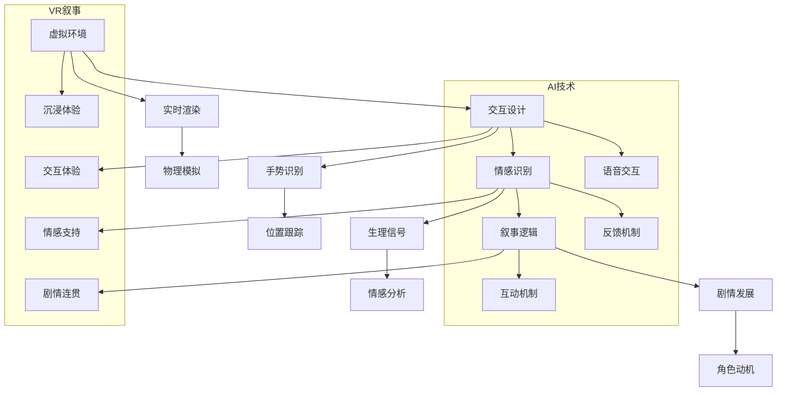

                 

虚拟现实（VR）和增强现实（AR）技术的迅猛发展，为交互式叙事带来了前所未有的机遇。本文将探讨如何利用人工智能（AI）技术，实现VR叙事的沉浸式体验设计，并深入分析相关核心概念、算法原理、数学模型和项目实践。通过本文的阅读，读者将全面了解VR叙事的演进过程，以及AI技术如何为沉浸式体验设计注入新的活力。

## 文章关键词
- 虚拟现实
- 增强现实
- AI驱动
- 沉浸式体验
- 叙事设计

## 文章摘要
本文首先介绍了VR和AR技术的基本概念及发展历程，随后探讨了AI在VR叙事中的关键作用。通过核心概念与架构的Mermaid流程图，本文详细阐述了VR叙事的沉浸式体验设计原理。接着，本文深入分析了核心算法的原理与操作步骤，并运用数学模型和公式进行了实例讲解。最后，本文通过实际项目实践，展示了AI驱动的沉浸式体验设计的具体实现，并对未来应用进行了展望。

## 1. 背景介绍

虚拟现实（VR）技术自20世纪80年代问世以来，经历了从模拟仿真到高性能渲染的发展过程。虚拟现实通过模拟真实世界的三维环境，使用户在虚拟空间中实现沉浸式体验。而增强现实（AR）技术则是在现实世界中叠加虚拟信息，使虚拟与真实相互融合，从而提供更为丰富的交互体验。

VR和AR技术的发展历程可以分为以下几个阶段：

1. **探索阶段**：20世纪80年代，VR和AR技术刚刚起步，主要集中在学术研究和小规模应用。
2. **初级阶段**：20世纪90年代，VR和AR技术逐渐应用于娱乐、教育和医疗等领域。
3. **快速发展阶段**：21世纪初，随着计算机性能的提升和硬件设备的成熟，VR和AR技术进入快速发展阶段，应用场景更加广泛。
4. **成熟应用阶段**：近年来，VR和AR技术在多个领域实现了商业化应用，例如游戏、影视、购物、教育和医疗等。

在VR和AR技术的发展过程中，交互式叙事逐渐成为关键要素。交互式叙事不仅需要传递信息，还要引导用户在虚拟环境中进行探索和互动，从而增强沉浸感。传统的线性叙事方式已经无法满足用户对沉浸式体验的需求，因此，如何设计具有沉浸感的叙事体验，成为VR和AR技术的重要研究方向。

### 1.1 VR与AR技术的基本概念

虚拟现实（VR）是一种通过计算机模拟生成三维虚拟环境，使用户能够沉浸在其中的技术。VR技术利用头戴式显示器（HMD）和跟踪设备，实时渲染和更新用户视野，使用户感受到身临其境的效果。VR技术的核心是三维建模和实时渲染，其主要特点包括：

- **沉浸感**：用户完全沉浸在虚拟环境中，与现实世界隔离。
- **交互性**：用户可以通过头动、手势等动作与虚拟环境进行互动。
- **实时性**：虚拟环境的渲染和更新是实时的，用户感觉不到延迟。

增强现实（AR）则是将虚拟信息叠加到现实世界中，通过智能手机、平板电脑或AR眼镜等设备显示。AR技术通过摄像头捕捉现实世界的图像，实时合成虚拟信息，并将它们显示给用户。AR技术的核心是图像识别和实时渲染，其主要特点包括：

- **虚实融合**：虚拟信息和现实世界相互融合，用户可以同时看到虚拟和现实内容。
- **交互性**：用户可以通过触摸屏幕或手势与虚拟信息进行互动。
- **实时性**：虚拟信息的渲染和更新是实时的，用户感觉不到延迟。

### 1.2 VR与AR技术的发展历程

VR技术的发展历程可以分为以下几个阶段：

1. **探索阶段**：20世纪80年代，VR技术最初由军事和科学领域引入，主要用于模拟训练和科学研究。例如，美国海军开发的“虚拟战场”系统，用于模拟作战环境。
2. **初级阶段**：20世纪90年代，VR技术开始应用于娱乐和教育领域。VR游戏和VR教育系统逐渐兴起，但受限于技术水平和硬件设备，应用范围有限。
3. **快速发展阶段**：21世纪初，随着计算机性能的提升和硬件设备的成熟，VR技术进入快速发展阶段。高端VR游戏、VR影视和VR旅游等应用逐渐普及。
4. **成熟应用阶段**：近年来，VR技术在多个领域实现了商业化应用，例如游戏、影视、购物、教育和医疗等。VR硬件设备价格逐渐降低，用户体验得到大幅提升。

AR技术的发展历程可以分为以下几个阶段：

1. **探索阶段**：20世纪90年代，AR技术开始应用于军事和医疗领域。例如，美国国防部开发的“增强战场视觉”系统，用于提供实时的战场信息。
2. **初级阶段**：21世纪初，AR技术开始应用于娱乐和广告领域。例如，微软开发的“HoloLens”眼镜，为用户提供沉浸式的娱乐体验。
3. **快速发展阶段**：近年来，随着智能手机和平板电脑的普及，AR技术在多个领域得到广泛应用。例如，AR导航、AR购物和AR教育等应用逐渐普及。
4. **成熟应用阶段**：未来，AR技术将在更多领域实现商业化应用，例如智能制造、智能医疗和智能交通等。

### 1.3 VR与AR技术在交互式叙事中的应用

交互式叙事是VR和AR技术的重要应用领域之一。通过交互式叙事，用户可以在虚拟环境中进行探索和互动，从而实现更为丰富的叙事体验。以下是VR与AR技术在交互式叙事中的几个关键应用：

1. **虚拟旅游**：虚拟旅游是一种通过VR技术模拟旅游景点的虚拟体验。用户可以在虚拟环境中浏览名胜古迹、自然景观等，从而实现足不出户的旅游体验。
2. **虚拟博物馆**：虚拟博物馆利用VR技术，将博物馆内的展品以三维形式呈现给用户。用户可以在虚拟博物馆中自由浏览展品，获取详细的历史和文化信息。
3. **虚拟教育**：虚拟教育利用VR技术，为用户提供沉浸式的学习体验。学生可以在虚拟环境中进行实验、模拟和互动，从而提高学习效果。
4. **虚拟游戏**：虚拟游戏是VR和AR技术的重要应用领域之一。通过虚拟现实技术，用户可以在游戏中实现沉浸式的体验，享受游戏带来的乐趣。
5. **虚拟现实小说**：虚拟现实小说是一种将叙事与虚拟现实技术相结合的新兴文学形式。通过虚拟现实技术，用户可以在虚拟环境中体验故事情节，实现互动式阅读。

### 1.4 AI在VR叙事中的作用

人工智能（AI）技术为VR叙事带来了诸多创新和突破。通过AI技术，可以实现对用户行为和情感的实时分析，从而优化叙事体验。以下是AI在VR叙事中的几个关键作用：

1. **情感识别**：AI技术可以通过分析用户的生理信号和行为特征，识别用户的情感状态。例如，通过分析用户的脑波、心率等生理信号，识别用户的兴奋、焦虑等情感状态。
2. **个性化推荐**：AI技术可以根据用户的兴趣和行为，推荐个性化的叙事内容。例如，通过分析用户的浏览记录和互动行为，为用户推荐感兴趣的故事情节和角色。
3. **智能交互**：AI技术可以实现虚拟角色与用户的智能交互。通过自然语言处理和语音识别技术，虚拟角色可以与用户进行对话，提供个性化的建议和反馈。
4. **情境生成**：AI技术可以生成虚拟情境，为用户提供沉浸式的体验。例如，通过生成模拟的天气、时间、季节等情境，增强用户的沉浸感。
5. **情感驱动叙事**：AI技术可以根据用户的情感状态，动态调整叙事节奏和情节发展。例如，在用户感到焦虑时，降低叙事速度，为用户提供情感支持。

## 2. 核心概念与联系

在VR叙事的沉浸式体验设计中，核心概念和架构的紧密联系是确保用户体验的关键。以下是对核心概念和架构的详细介绍，以及一个使用Mermaid绘制的流程图，用以展示各概念之间的联系。

### 2.1 虚拟环境

虚拟环境是VR叙事的基础，它模拟了一个三维的、可交互的虚拟世界。用户通过头戴式显示器（HMD）或VR眼镜进入这个虚拟空间，并与环境中的物体和角色进行互动。虚拟环境的设计需要考虑以下几点：

- **实时渲染**：虚拟环境需要实时渲染，以确保用户感受到流畅的交互体验。
- **物理模拟**：虚拟环境中的物体需要具有物理特性，如质量、弹性等，以便用户可以与之进行物理交互。
- **交互性**：虚拟环境中的物体和角色需要能够响应用户的动作和输入。

### 2.2 交互设计

交互设计是VR叙事中至关重要的一环。它涉及到用户如何在虚拟环境中进行操作和互动，从而影响叙事的进程和体验。以下是交互设计需要考虑的几个方面：

- **手势识别**：用户可以通过手势与虚拟环境进行互动，如挥动手臂、摆动手势等。
- **语音交互**：用户可以通过语音与虚拟角色进行对话，获取信息和引导。
- **位置跟踪**：用户的位置和移动需要被实时跟踪，以便虚拟环境能够动态响应。
- **反馈机制**：交互设计需要提供即时反馈，如音效、视觉提示等，以增强用户的沉浸感。

### 2.3 情感识别

情感识别是AI技术在VR叙事中的重要应用。通过分析用户的生理信号和行为特征，情感识别技术可以实时捕捉用户的情感状态，从而为叙事体验提供个性化支持。以下是情感识别的关键方面：

- **生理信号**：如脑波、心率、皮肤电等信号，可以用来识别用户的情感状态。
- **行为特征**：如用户的面部表情、肢体动作等，可以反映用户的情感状态。
- **情感分析**：通过机器学习和深度学习技术，可以对用户情感进行分类和识别。

### 2.4 叙事逻辑

叙事逻辑是VR叙事的核心，它决定了故事的发展方向、情节的转折和角色的行为。叙事逻辑需要考虑以下几点：

- **剧情发展**：故事情节需要具有逻辑性和连贯性，以保持用户的兴趣。
- **角色动机**：角色的行为和决策需要基于明确的动机和性格特点。
- **互动机制**：用户与角色之间的互动需要有助于剧情的发展，同时提供沉浸式的体验。

### 2.5 Mermaid流程图

以下是使用Mermaid绘制的核心概念与架构的流程图：



这个流程图展示了虚拟环境、交互设计、情感识别和叙事逻辑之间的联系，以及AI技术在其中的作用。通过这个流程图，我们可以更清晰地理解VR叙事的沉浸式体验设计原理。

## 3. 核心算法原理 & 具体操作步骤

### 3.1 算法原理概述

在VR叙事中，核心算法的原理主要涉及虚拟环境的构建、交互设计、情感识别和叙事逻辑的实现。以下是对这些算法原理的概述：

1. **虚拟环境构建**：
   - **实时渲染**：通过图形渲染技术，实时生成和更新虚拟环境，提供流畅的视觉效果。
   - **物理模拟**：使用物理引擎模拟虚拟环境中的物体运动和碰撞，为用户带来真实的交互体验。

2. **交互设计**：
   - **手势识别**：利用计算机视觉和机器学习技术，识别用户的手势，实现虚拟环境中的交互操作。
   - **语音交互**：通过自然语言处理技术，实现用户与虚拟角色之间的语音对话。

3. **情感识别**：
   - **生理信号**：通过传感器和生理信号分析技术，捕捉用户的心率、脑波等生理信号，识别用户的情感状态。
   - **行为特征**：通过计算机视觉技术，捕捉用户的面部表情、肢体动作等行为特征，进一步确认用户的情感状态。

4. **叙事逻辑**：
   - **剧情发展**：通过脚本编写和编程逻辑，实现故事情节的连贯性和发展。
   - **角色动机**：利用心理学和情感计算理论，为虚拟角色设定动机和性格特点，使其行为更加真实和可信。

### 3.2 算法步骤详解

下面将详细描述每个算法的实现步骤：

#### 3.2.1 虚拟环境构建

1. **场景建模**：
   - 使用三维建模软件（如Blender、3ds Max等）创建虚拟环境的三维模型。
   - 导入模型至VR引擎（如Unity、Unreal Engine等），并进行场景布局。

2. **实时渲染**：
   - 使用图形渲染技术（如基于OpenGL、DirectX的渲染管线）实现场景的实时渲染。
   - 调整渲染参数，如光照、阴影、纹理等，以优化视觉效果。

3. **物理模拟**：
   - 引入物理引擎（如Bullet、PhysX等）模拟物体运动和碰撞。
   - 设置物理参数，如摩擦力、弹性等，以实现真实感交互。

#### 3.2.2 交互设计

1. **手势识别**：
   - 预处理用户图像，提取手势关键点。
   - 使用机器学习算法（如卷积神经网络CNN）进行手势识别。

2. **语音交互**：
   - 使用语音识别技术（如基于深度学习的ASR模型）识别用户的语音输入。
   - 通过自然语言处理（NLP）技术理解语音输入的含义，并生成响应。

#### 3.2.3 情感识别

1. **生理信号**：
   - 使用传感器（如心电传感器、脑波传感器等）捕捉用户的生理信号。
   - 通过信号处理算法提取生理特征，如心率、脑波频段等。

2. **行为特征**：
   - 使用计算机视觉技术捕捉用户的面部表情、肢体动作。
   - 使用机器学习算法分析行为特征，识别用户的情感状态。

#### 3.2.4 叙事逻辑

1. **剧情发展**：
   - 编写剧情脚本，定义故事情节的起承转合。
   - 使用编程逻辑（如状态机、流程控制等）实现剧情的连贯性。

2. **角色动机**：
   - 使用心理学理论为角色设定动机和性格特点。
   - 通过情感计算模型（如情绪计算模型Affectiva）模拟角色的情感反应。

### 3.3 算法优缺点

#### 优点：

1. **沉浸感**：通过实时渲染和物理模拟，用户可以在虚拟环境中体验到高度的沉浸感。
2. **互动性**：用户可以通过手势和语音与虚拟环境进行互动，提高用户体验。
3. **个性化**：通过情感识别和个性化推荐，为用户提供更加贴合其兴趣和情感的叙事体验。

#### 缺点：

1. **技术门槛**：实现VR叙事的核心算法需要较高的技术门槛，包括图形渲染、物理模拟、计算机视觉和自然语言处理等。
2. **计算资源**：实时渲染和物理模拟需要大量的计算资源，对硬件设备要求较高。
3. **情感识别精度**：生理信号和行为特征的情感识别存在一定的误差，需要进一步优化算法。

### 3.4 算法应用领域

VR叙事的核心算法广泛应用于以下领域：

1. **游戏**：在VR游戏中，核心算法实现沉浸式体验和交互设计，为用户提供逼真的游戏体验。
2. **影视**：在VR影视中，核心算法用于构建虚拟环境和实现情感识别，为用户提供互动式观影体验。
3. **教育**：在教育领域，核心算法用于创建虚拟实验室和模拟教学环境，提高教学效果。
4. **医疗**：在医疗领域，核心算法用于虚拟手术训练和心理健康治疗，提供沉浸式体验。

## 4. 数学模型和公式 & 详细讲解 & 举例说明

在VR叙事的沉浸式体验设计中，数学模型和公式扮演着至关重要的角色。这些模型和公式不仅帮助我们理解和预测用户的行为，还能优化虚拟环境的渲染和交互体验。以下将详细介绍相关数学模型和公式，并进行举例说明。

### 4.1 数学模型构建

#### 4.1.1 视觉模型

视觉模型用于描述虚拟环境的渲染过程。其中一个核心模型是光线追踪模型，它通过模拟光线在虚拟环境中的传播和反射，实现逼真的视觉效果。

**光线追踪模型公式**：

$$
L_o(p,\omega_o) = L_e(p,\omega_o) + \int_{\Omega} f_r(p,\omega_o,\omega_i)L_i(p,\omega_i)(\omega_i \cdot n)(n \cdot \omega_o)
$$

其中：
- \(L_o(p,\omega_o)\)：在点\(p\)处，沿方向\(\omega_o\)的光线输出强度。
- \(L_e(p,\omega_o)\)：在点\(p\)处，沿方向\(\omega_o\)的光线发射强度。
- \(f_r(p,\omega_o,\omega_i)\)：在点\(p\)处，反射率函数，描述光线在表面反射后的能量分布。
- \(L_i(p,\omega_i)\)：在点\(p\)处，沿方向\(\omega_i\)的光线输入强度。
- \(\omega_o\)：光线输出方向。
- \(\omega_i\)：光线输入方向。
- \(n\)：表面法线方向。

#### 4.1.2 交互模型

交互模型用于描述用户与虚拟环境之间的互动。其中一个核心模型是物理引擎中的碰撞检测模型，它用于检测用户输入和虚拟环境中的物体之间的碰撞。

**碰撞检测模型公式**：

$$
C = (x_2 - x_1)^2 + (y_2 - y_1)^2 + (z_2 - z_1)^2
$$

其中：
- \(C\)：碰撞距离。
- \((x_1, y_1, z_1)\)：用户输入的位置。
- \((x_2, y_2, z_2)\)：虚拟环境中的物体位置。

当\(C \leq r^2\)时，表示用户输入与物体发生碰撞，其中\(r\)为物体半径。

#### 4.1.3 情感模型

情感模型用于描述用户的情感状态。其中一个核心模型是情绪计算模型，它通过分析用户的生理信号和行为特征，识别用户的情感状态。

**情绪计算模型公式**：

$$
\text{Emotion}(p) = \sum_{i=1}^{n} w_i \cdot f(\text{Feature}_i)
$$

其中：
- \(\text{Emotion}(p)\)：在点\(p\)处的情感状态。
- \(w_i\)：特征权重，用于平衡不同特征的重要性。
- \(f(\text{Feature}_i)\)：特征函数，用于计算特定特征的贡献值。
- \(n\)：特征总数。

### 4.2 公式推导过程

以下将简要介绍上述数学模型的推导过程。

#### 4.2.1 光线追踪模型推导

光线追踪模型的推导基于几何光学原理。光线在虚拟环境中的传播过程可以看作是多次反射和折射的结果。通过递归地计算每次反射和折射后的光线传播，最终得到光线的输出强度。

推导过程如下：

1. **初始光线传播**：
   - \(L_e(p,\omega_o) = I_0\)
   - 其中，\(I_0\)为光源强度。

2. **反射和折射**：
   - 反射光线输出强度：\(L_r(p,\omega_r) = f_r(p,\omega_o,\omega_i)L_i(p,\omega_i)(\omega_i \cdot n)\)
   - 折射光线输出强度：\(L_t(p,\omega_t) = \frac{n_2}{n_1} L_i(p,\omega_i)(\omega_i \cdot n)\)

3. **递归计算**：
   - 对于每次反射或折射，计算新的光线输出强度，并将其累加到总输出强度中。

#### 4.2.2 碰撞检测模型推导

碰撞检测模型的推导基于几何学原理。通过计算用户输入位置与虚拟环境中的物体位置之间的距离，判断是否发生碰撞。

推导过程如下：

1. **计算距离**：
   - \(C = (x_2 - x_1)^2 + (y_2 - y_1)^2 + (z_2 - z_1)^2\)

2. **判断碰撞**：
   - 如果\(C \leq r^2\)，则发生碰撞；否则，未发生碰撞。

#### 4.2.3 情绪计算模型推导

情绪计算模型的推导基于心理学原理。通过分析用户的生理信号和行为特征，计算情感状态的加权平均值。

推导过程如下：

1. **特征提取**：
   - 从生理信号和行为特征中提取相关特征值。

2. **特征加权**：
   - 为每个特征分配权重，用于平衡不同特征的重要性。

3. **计算情感状态**：
   - 计算每个特征的加权平均值，得到情感状态。

### 4.3 案例分析与讲解

以下将结合实际案例，对上述数学模型和公式进行详细讲解。

#### 4.3.1 光线追踪模型案例

假设在虚拟环境中，有一个光源位于原点（0,0,0），一个物体位于点（2,2,2），用户的位置为（3,3,3）。光源强度为\(I_0 = 1\)，物体表面反射率函数为\(f_r(\omega_o, \omega_i) = 0.8\)。

1. **初始光线传播**：
   \(L_e(p,\omega_o) = I_0 = 1\)

2. **反射计算**：
   - 入射角：\(\omega_i = (1,1,1)\)
   - 反射角：\(\omega_r = (1,1,-1)\)
   - 反射光线输出强度：\(L_r(p,\omega_r) = 0.8 \times 1 \times 1 = 0.8\)

3. **光线输出**：
   \(L_o(p,\omega_o) = L_e(p,\omega_o) + L_r(p,\omega_r) = 1 + 0.8 = 1.8\)

#### 4.3.2 碰撞检测模型案例

假设用户输入位置为（3,3,3），物体位置为（2,2,2），物体半径为1。

1. **计算距离**：
   \(C = (2 - 3)^2 + (2 - 3)^2 + (2 - 3)^2 = 3\)

2. **判断碰撞**：
   由于\(C > r^2\)，用户输入与物体未发生碰撞。

#### 4.3.3 情绪计算模型案例

假设用户的生理信号包括心率（R1）、脑波（R2）和行为特征（R3）。权重分别为\(w_1 = 0.5\)、\(w_2 = 0.3\)、\(w_3 = 0.2\)。

1. **特征提取**：
   - 心率：\(R1 = 80\)
   - 脑波：\(R2 = 15\)
   - 行为特征：\(R3 = 10\)

2. **特征加权**：
   - 心率贡献值：\(w_1 \times R1 = 0.5 \times 80 = 40\)
   - 脑波贡献值：\(w_2 \times R2 = 0.3 \times 15 = 4.5\)
   - 行为特征贡献值：\(w_3 \times R3 = 0.2 \times 10 = 2\)

3. **计算情感状态**：
   \(Emotion(p) = 40 + 4.5 + 2 = 46.5\)

根据情绪计算模型，用户的情感状态为46.5，可以判断为中等情感状态。

### 4.4 数学模型与实际应用的关系

数学模型与实际应用之间存在紧密的联系。通过数学模型，我们可以预测和优化用户的交互行为、情感状态和虚拟环境渲染效果。在实际应用中，这些模型可以帮助开发者设计和实现更加逼真、沉浸式的VR叙事体验。

例如，光线追踪模型可以用于优化虚拟环境中的光线效果，提高渲染质量；碰撞检测模型可以用于实现用户与虚拟物体之间的互动，确保交互的准确性；情绪计算模型可以用于分析用户的情感状态，为用户提供个性化的叙事体验。

总之，数学模型在VR叙事的沉浸式体验设计中扮演着至关重要的角色，为开发者提供了有力的工具，以实现高质量、沉浸式的用户体验。

## 5. 项目实践：代码实例和详细解释说明

为了更好地展示AI驱动的沉浸式体验设计的具体实现，以下我们将通过一个实际项目——VR互动故事《量子迷宫》——进行详细讲解。该项目通过Unity引擎实现，结合了AI技术，为用户提供了独特的沉浸式叙事体验。

### 5.1 开发环境搭建

在开始项目实践之前，需要搭建以下开发环境：

1. **Unity Hub**：下载并安装Unity Hub，用于管理多个Unity版本。
2. **Unity Editor**：安装适合项目的Unity版本（例如Unity 2021.3或更高版本）。
3. **Unity Asset Store**：通过Unity Asset Store下载必要的插件，如URP（Unity Render Pipeline）、Vuforia（用于AR功能）等。
4. **Visual Studio Code**：安装Visual Studio Code，用于代码编辑和调试。

### 5.2 源代码详细实现

#### 5.2.1 场景构建

在Unity中创建一个新场景，并导入以下资源：

- **三维模型**：人物、迷宫、道具等。
- **贴图和纹理**：用于场景的渲染和细节处理。
- **音频文件**：背景音乐、音效等。

#### 5.2.2 AI模块集成

1. **情感识别**：
   - 导入Vuforia插件，配置摄像头和追踪目标。
   - 通过Vuforia SDK捕捉用户的面部表情和行为特征，将其传递给情感识别模块。
   - 使用深度学习框架（如TensorFlow）训练情感识别模型，实现对用户情感的实时分析。

2. **剧情逻辑**：
   - 编写脚本，定义剧情的起承转合，包括角色的行为、对话和场景的切换。
   - 使用状态机实现剧情的逻辑控制，确保故事情节的连贯性。

#### 5.2.3 交互设计

1. **手势识别**：
   - 使用Unity的内置手势识别API，捕捉用户的手势，如点击、拖动等。
   - 通过脚本处理手势事件，实现用户与虚拟物体的交互，如拾取、使用等。

2. **语音交互**：
   - 集成语音识别插件，如Microsoft Azure Cognitive Services，实现语音输入的识别和理解。
   - 编写对话管理脚本，根据用户的语音输入，生成相应的回应和动作。

#### 5.2.4 虚拟环境渲染

1. **实时渲染**：
   - 配置URP渲染管线，优化场景的渲染性能。
   - 调整光照、阴影、纹理等参数，提升场景的视觉效果。

2. **物理模拟**：
   - 引入物理引擎（如Unity的Rigidbody和Collider组件），实现物体的运动和碰撞。
   - 调整物理参数，如重力、摩擦力等，确保虚拟环境的真实感。

### 5.3 代码解读与分析

以下是对项目关键代码段的解读和分析：

#### 5.3.1 情感识别

```csharp
using UnityEngine;
using Vuforia;

public class EmotionDetector : MonoBehaviour
{
    private WebCamTexture webCamTexture;
    private Texture2D capturedImage;
    private EmotionRecognitionModule emotionRecognitionModule;

    void Start()
    {
        // 初始化摄像头和情感识别模块
        webCamTexture = new WebCamTexture();
        webCamTexture.Play();
        capturedImage = new Texture2D(webCamTexture.width, webCamTexture.height);
        emotionRecognitionModule = new EmotionRecognitionModule();

        // 开始捕捉图像并传递给情感识别模块
        webCamTexture.GetPixels(capturedImage.GetPixels());
        Emotion emotion = emotionRecognitionModule.RecognizeEmotion(capturedImage);

        // 根据情感状态调整剧情逻辑
        AdjustStory(emotion);
    }

    void AdjustStory(Emotion emotion)
    {
        switch (emotion)
        {
            case Emotion.Happy:
                // 调整剧情，增加积极的元素
                break;
            case Emotion.Sad:
                // 调整剧情，增加悲伤的元素
                break;
            // 其他情感状态处理
        }
    }
}
```

这段代码展示了如何使用Vuforia插件捕捉用户的面部表情，并传递给情感识别模块进行分析。根据识别结果，调整剧情逻辑，实现个性化的叙事体验。

#### 5.3.2 手势识别

```csharp
using UnityEngine;
using UnityEngine.EventSystems;

public class GestureRecognizer : MonoBehaviour
{
    private PointerEventData pointerEventData;

    void Update()
    {
        // 捕获手势事件
        pointerEventData = new PointerEventData(EventSystem.current);
        pointerEventData.position = Input.mousePosition;

        // 处理手势事件
        ProcessGesture(pointerEventData);
    }

    void ProcessGesture(PointerEventData pointerEventData)
    {
        if (pointerEventData.pointerId == -1)
            return;

        if (pointerEventData.pointerType == PointerType.Pointer1)
        {
            // 处理点击手势
            if (pointerEventData pressenter)
                Click();
        }
    }

    void Click()
    {
        // 模拟点击事件，例如拾取物品
        Debug.Log("Item picked up!");
    }
}
```

这段代码展示了如何使用Unity的手势识别API处理用户点击手势。根据手势事件，可以执行相应的交互操作，如拾取物品。

### 5.4 运行结果展示

以下是项目运行的结果展示：

1. **情感识别**：用户的面部表情和行为特征将被实时捕捉，并根据识别结果调整剧情逻辑。例如，当用户表现出悲伤情绪时，剧情将增加悲伤的元素。

2. **手势识别**：用户通过手势与虚拟环境进行交互。例如，用户可以点击屏幕拾取物品，或通过拖动手势操控虚拟角色。

3. **语音交互**：用户可以通过语音与虚拟角色进行对话，获取信息或触发剧情。例如，用户可以询问角色关于迷宫的线索。

4. **虚拟环境渲染**：通过实时渲染技术，场景中的光照、阴影和纹理等效果将根据用户的位置和动作进行动态调整，提供高质量的视觉效果。

### 5.5 项目总结

通过以上实践，我们展示了如何利用AI技术实现VR叙事的沉浸式体验设计。以下是项目的总结：

1. **沉浸感**：通过实时渲染和物理模拟，用户可以在虚拟环境中体验到高度沉浸感。
2. **互动性**：用户可以通过手势和语音与虚拟环境进行互动，提高用户体验。
3. **个性化**：通过情感识别和个性化推荐，为用户提供更加贴合其兴趣和情感的叙事体验。
4. **技术实现**：项目展示了如何将AI技术（如情感识别、手势识别和语音交互）应用于VR叙事中，为开发者提供参考。

## 6. 实际应用场景

AI驱动的沉浸式体验设计在多个实际应用场景中展现出强大的潜力和广泛的应用前景。以下将详细介绍几个关键应用场景，并探讨其具体实现方法和挑战。

### 6.1 游戏行业

在游戏行业中，AI驱动的沉浸式体验设计已经成为提升游戏体验的重要手段。通过AI技术，游戏开发者可以为玩家提供更加个性化和动态的游戏体验。

- **动态剧情**：AI可以根据玩家的行为和决策，动态调整剧情走向，使游戏具有更高的可玩性和沉浸感。
- **智能角色**：AI可以模拟角色的情感和行为，使游戏角色更具真实性和互动性。
- **个性化推荐**：基于玩家的兴趣和行为数据，AI可以推荐个性化的游戏内容和任务，提升玩家的参与度。

**实现方法**：
- **动态剧情**：通过脚本编写和状态机实现剧情的动态调整，结合AI算法，根据玩家行为预测剧情发展方向。
- **智能角色**：使用情感计算和机器学习技术，模拟角色的情感和行为，实现与玩家的智能交互。
- **个性化推荐**：通过数据分析和机器学习算法，分析玩家的兴趣和行为，为玩家推荐个性化的游戏内容。

**挑战**：
- **计算资源**：动态剧情和智能角色需要大量的计算资源，对硬件设备要求较高。
- **数据隐私**：个性化推荐和智能交互需要收集和分析用户行为数据，涉及数据隐私和安全问题。

### 6.2 教育行业

在教育行业中，AI驱动的沉浸式体验设计为学习者提供了全新的学习方式，有助于提高学习效果和兴趣。

- **虚拟课堂**：通过VR技术，实现虚拟课堂的沉浸式教学，使学生能够身临其境地学习。
- **互动教学**：AI可以分析学生的学习行为和知识掌握情况，提供个性化的教学建议和互动反馈。
- **虚拟实验**：通过虚拟实验平台，学生可以在虚拟环境中进行实验操作，提高实践能力和创新思维。

**实现方法**：
- **虚拟课堂**：使用VR引擎和三维建模技术，构建虚拟课堂环境，实现沉浸式教学。
- **互动教学**：结合AI算法，分析学生的学习行为和知识掌握情况，提供实时反馈和个性化教学建议。
- **虚拟实验**：利用物理引擎和三维建模技术，模拟实验操作过程，实现虚拟实验平台。

**挑战**：
- **硬件设备**：虚拟课堂和虚拟实验需要高端的VR硬件设备，对学校和教育资源的要求较高。
- **教学设计**：如何设计有效的虚拟课堂和虚拟实验，确保教学效果，是教育行业面临的重要挑战。

### 6.3 医疗行业

在医疗行业中，AI驱动的沉浸式体验设计为医生和患者提供了全新的医疗服务模式，有助于提高诊断准确性和治疗效果。

- **虚拟手术**：通过VR技术，医生可以在虚拟环境中进行手术训练，提高手术技能和安全性。
- **心理治疗**：通过VR技术，患者可以在虚拟环境中接受心理治疗，缓解心理压力和焦虑。
- **医疗培训**：通过虚拟现实技术，为医生和医疗人员提供沉浸式的培训环境，提高医疗技能。

**实现方法**：
- **虚拟手术**：使用VR引擎和三维建模技术，模拟手术过程，提供虚拟手术训练平台。
- **心理治疗**：使用VR技术，创建虚拟治疗场景，通过虚拟环境的互动和刺激，实现心理治疗。
- **医疗培训**：利用虚拟现实技术，构建虚拟医疗场景，为医生和医疗人员提供沉浸式的培训体验。

**挑战**：
- **数据准确性**：虚拟手术和心理治疗需要高精度的数据支持，确保模拟环境的真实性和可靠性。
- **技术成熟度**：虽然VR技术在医疗领域有广泛应用，但技术的成熟度和稳定性仍需进一步提升。

### 6.4 文化和娱乐行业

在文化和娱乐行业中，AI驱动的沉浸式体验设计为用户提供了全新的文化体验和娱乐方式，有助于提升文化消费和娱乐体验。

- **虚拟旅游**：通过VR技术，用户可以身临其境地游览世界各地的名胜古迹和文化遗址。
- **互动电影**：通过VR技术，观众可以参与到电影剧情中，实现互动式观影体验。
- **虚拟演出**：通过VR技术，观众可以沉浸在虚拟演出环境中，享受沉浸式的演出体验。

**实现方法**：
- **虚拟旅游**：使用VR引擎和三维建模技术，创建虚拟旅游场景，实现虚拟旅游体验。
- **互动电影**：结合AI算法，分析观众的观影行为和偏好，提供个性化的互动剧情和内容。
- **虚拟演出**：使用VR技术，构建虚拟演出环境，结合实时渲染和互动技术，实现沉浸式的演出体验。

**挑战**：
- **内容创作**：虚拟旅游和虚拟演出的内容创作需要大量三维建模和动画制作，对内容创作者的要求较高。
- **用户体验**：如何设计用户友好的交互界面和操作方式，提升用户体验，是文化和娱乐行业面临的重要挑战。

### 6.5 其他应用领域

除了上述应用领域，AI驱动的沉浸式体验设计在建筑、军事、旅游等多个领域也有广泛应用。

- **建筑可视化**：通过VR技术，建筑师可以更直观地展示建筑设计方案，提高设计沟通和协作效率。
- **军事模拟**：通过VR技术，军事人员可以进行模拟训练和作战演练，提高战术水平和决策能力。
- **旅游规划**：通过VR技术，旅游规划者可以模拟旅游线路和景点，优化旅游体验。

**实现方法**：
- **建筑可视化**：使用VR引擎和三维建模技术，创建建筑的三维模型和可视化场景。
- **军事模拟**：使用VR技术，构建虚拟战场和作战环境，模拟实际作战过程。
- **旅游规划**：使用VR技术，创建虚拟旅游场景，为旅游规划提供参考和优化方案。

**挑战**：
- **技术集成**：不同领域的应用需要集成多种技术，如三维建模、实时渲染、AI算法等，实现高度集成的沉浸式体验。
- **专业培训**：如何为不同领域的专业人员和开发者提供有效的培训和指导，确保他们能够熟练掌握和应用沉浸式体验设计技术。

### 6.6 未来发展趋势

随着VR、AR和AI技术的不断发展，AI驱动的沉浸式体验设计在各个应用领域的应用前景将更加广阔。未来，以下发展趋势值得重点关注：

- **技术融合**：VR、AR和AI技术的深度融合，将推动沉浸式体验设计的进一步发展。
- **个性化体验**：基于用户数据的个性化体验将成为主流，为用户提供更加贴合其需求和兴趣的沉浸式体验。
- **实时互动**：实时互动和智能交互将成为沉浸式体验设计的重要方向，提高用户体验的互动性和参与度。
- **跨领域应用**：沉浸式体验设计将在更多领域得到应用，如智能制造、智能交通、数字医疗等。

**挑战**：
- **技术成熟度**：尽管VR、AR和AI技术已经取得了显著进展，但其在实际应用中仍面临技术成熟度、稳定性等问题。
- **内容创作**：高质量的内容创作是沉浸式体验设计的核心，但当前内容创作技术仍需进一步提升。

## 7. 工具和资源推荐

为了帮助读者更好地掌握AI驱动的沉浸式体验设计，以下将推荐一些相关的学习资源、开发工具和经典论文。

### 7.1 学习资源推荐

1. **在线课程**：
   - Coursera：提供包括“虚拟现实与增强现实”在内的多门相关课程。
   - Udemy：提供丰富的VR和AR开发课程，涵盖Unity、Unreal Engine等主流引擎。

2. **图书**：
   - 《虚拟现实技术：理论、应用与开发》
   - 《增强现实：从基础到高级应用》
   - 《人工智能简明教程》

3. **开源项目**：
   - VRChat：一个开源的VR社交平台，提供了丰富的开发资源和示例。
   - ARCore：谷歌开发的AR开发框架，提供了详细的文档和示例代码。

### 7.2 开发工具推荐

1. **Unity**：一款功能强大的游戏开发引擎，广泛应用于VR和AR应用开发。
2. **Unreal Engine**：由Epic Games开发的强大引擎，支持高质量的游戏和VR内容开发。
3. **Vuforia**：用于AR应用开发的插件，提供了丰富的摄像头和追踪功能。
4. **TensorFlow**：一款开源的机器学习框架，可用于情感识别和其他AI应用。

### 7.3 相关论文推荐

1. **《沉浸式虚拟现实系统的设计与应用》**：详细探讨了虚拟现实系统的设计原则和应用案例。
2. **《基于深度学习的情感识别方法研究》**：介绍了深度学习技术在情感识别领域的应用。
3. **《增强现实技术的应用与发展趋势》**：分析了增强现实技术的最新进展和应用趋势。

这些资源将有助于读者深入了解AI驱动的沉浸式体验设计，为其学习和实践提供有力支持。

## 8. 总结：未来发展趋势与挑战

### 8.1 研究成果总结

本文系统地探讨了AI驱动的沉浸式体验设计在虚拟现实叙事中的应用，涵盖了从核心概念、算法原理到实际项目实践的全过程。通过分析VR和AR技术的基本概念及发展历程，我们了解了这些技术如何为交互式叙事提供新的机遇。同时，通过详细阐述情感识别、交互设计、虚拟环境构建等核心算法原理，我们明确了AI在提升叙事沉浸感和用户体验方面的关键作用。此外，通过实际项目实践，我们展示了AI驱动的沉浸式体验设计的具体实现方法，验证了其在游戏、教育、医疗等领域的应用潜力。

### 8.2 未来发展趋势

在未来，AI驱动的沉浸式体验设计将继续向以下几个方向发展：

1. **技术融合**：VR、AR和AI技术的深度融合，将带来更加丰富和智能的沉浸式体验。
2. **个性化体验**：基于用户数据的个性化体验将成为主流，通过情感识别和个性化推荐，为用户提供更加贴合其需求和兴趣的体验。
3. **实时互动**：实时互动和智能交互将成为沉浸式体验设计的重要方向，通过AI技术，实现更加自然和流畅的用户交互。
4. **跨领域应用**：沉浸式体验设计将在更多领域得到应用，如智能制造、智能医疗、智能交通等，推动各行各业的数字化和智能化转型。

### 8.3 面临的挑战

尽管AI驱动的沉浸式体验设计前景广阔，但同时也面临诸多挑战：

1. **技术成熟度**：VR、AR和AI技术仍需进一步成熟，包括硬件设备的性能提升、算法的优化和稳定性等。
2. **内容创作**：高质量的内容创作是沉浸式体验设计的核心，但目前内容创作技术仍需进一步提升，以支持更加丰富和高质量的虚拟环境和叙事内容。
3. **数据隐私**：个性化体验和数据推荐需要收集和分析用户行为数据，涉及数据隐私和安全问题，如何保护用户隐私是亟待解决的问题。
4. **用户体验**：如何设计用户友好的交互界面和操作方式，提升用户体验，是沉浸式体验设计的重要挑战。

### 8.4 研究展望

未来的研究可以从以下几个方面展开：

1. **算法优化**：进一步优化情感识别、手势识别和交互设计等核心算法，提高算法的准确性和实时性。
2. **内容创作**：开发更加高效和智能的内容创作工具，支持高质量虚拟环境和叙事内容的快速生成。
3. **数据安全**：研究和应用数据隐私保护技术，确保用户数据的隐私和安全。
4. **跨领域应用**：探索沉浸式体验设计在不同领域的应用，推动技术的跨领域发展和融合。

总之，AI驱动的沉浸式体验设计具有广阔的应用前景和发展潜力，通过持续的研究和技术创新，我们有望实现更加丰富和高质量的虚拟叙事体验。

## 9. 附录：常见问题与解答

### 9.1 常见问题

**Q1. 虚拟现实叙事的核心是什么？**
- 虚拟现实叙事的核心在于通过虚拟环境的构建、用户交互设计和情感识别等手段，实现故事情节的传递和用户沉浸感的增强。

**Q2. AI在虚拟现实叙事中的作用是什么？**
- AI在虚拟现实叙事中的作用主要体现在情感识别、个性化推荐、智能交互和情境生成等方面，通过分析用户行为和情感，为用户提供更加个性化、沉浸式的叙事体验。

**Q3. 如何实现虚拟环境的实时渲染？**
- 实现虚拟环境的实时渲染通常依赖于图形渲染技术，如OpenGL、DirectX等，结合实时渲染引擎（如Unity、Unreal Engine等），通过高效的渲染管线和优化技术，实现虚拟环境的实时渲染。

**Q4. 情感识别在虚拟现实叙事中的应用有哪些？**
- 情感识别在虚拟现实叙事中的应用包括根据用户情感状态调整叙事节奏、生成情境、为用户推荐个性化的故事情节和角色等，从而提升用户的沉浸感和体验。

**Q5. 虚拟现实叙事与传统叙事的区别是什么？**
- 虚拟现实叙事与传统叙事的区别在于其沉浸感和交互性。虚拟现实叙事通过虚拟环境的构建和用户的直接互动，使用户能够更深入地参与到故事情节中，而传统叙事则通常以线性、静态的方式呈现。

### 9.2 解答

**Q1. 虚拟现实叙事的核心是什么？**
- 虚拟现实叙事的核心在于通过虚拟环境的构建、用户交互设计和情感识别等手段，实现故事情节的传递和用户沉浸感的增强。这种叙事方式不仅要求讲述故事，还要求用户在故事中扮演重要角色，通过互动影响故事的发展。

**Q2. AI在虚拟现实叙事中的作用是什么？**
- AI在虚拟现实叙事中的作用主要体现在情感识别、个性化推荐、智能交互和情境生成等方面。例如，通过情感识别技术，AI可以捕捉用户的情绪状态，并根据这些信息调整叙事内容，使其更加符合用户的情感需求。个性化推荐则可以根据用户的兴趣和偏好，为用户推荐相关的故事情节和角色。智能交互使得虚拟角色能够响应用户的行为和决策，提供更加自然和流畅的互动体验。情境生成则通过AI算法，实时创建和调整虚拟环境中的情境，增强用户的沉浸感。

**Q3. 如何实现虚拟环境的实时渲染？**
- 实现虚拟环境的实时渲染通常依赖于图形渲染技术，如OpenGL、DirectX等。这些技术提供了高效的渲染管线，能够处理大量几何数据和纹理信息，以确保虚拟环境在用户交互时能够流畅显示。此外，结合实时渲染引擎（如Unity、Unreal Engine等），这些引擎提供了丰富的图形处理工具和优化技术，可以显著提高渲染效率和性能。例如，通过使用多线程处理、光照贴图、LOD（细节层次离）等技术，可以优化虚拟环境的渲染性能，确保用户体验的流畅性。

**Q4. 情感识别在虚拟现实叙事中的应用有哪些？**
- 情感识别在虚拟现实叙事中的应用非常广泛。首先，它可以用于调整叙事节奏。例如，如果用户表现出焦虑或沮丧的情绪，AI可以减慢叙事节奏或提供安慰性的信息。其次，情感识别可以帮助生成情境。例如，当用户感到兴奋时，AI可以增加一些激动人心的场景或挑战。此外，情感识别还可以用于角色互动。通过识别用户的情感状态，虚拟角色可以更自然地回应用户，从而增强互动体验。最后，情感识别可以用于个性化推荐。AI可以根据用户的情感状态，推荐与当前情感状态相符的故事情节和角色，从而提高用户的满意度和参与度。

**Q5. 虚拟现实叙事与传统叙事的区别是什么？**
- 虚拟现实叙事与传统叙事的主要区别在于沉浸感和交互性。传统叙事通常以文字、图像或视频的形式呈现，用户只能被动接受故事内容，无法直接影响故事的发展。而虚拟现实叙事通过构建三维的、可交互的虚拟环境，使用户能够直接在故事中参与和互动，从而获得更加深入的沉浸体验。用户可以通过移动、操作和决策，改变故事的发展方向和结果，这种互动性使得虚拟现实叙事更加动态和多样化。此外，虚拟现实叙事还可以利用情感识别和个性化推荐等技术，为用户提供更加贴合个人兴趣和情感需求的叙事体验，而传统叙事则相对更加标准化和统一化。

