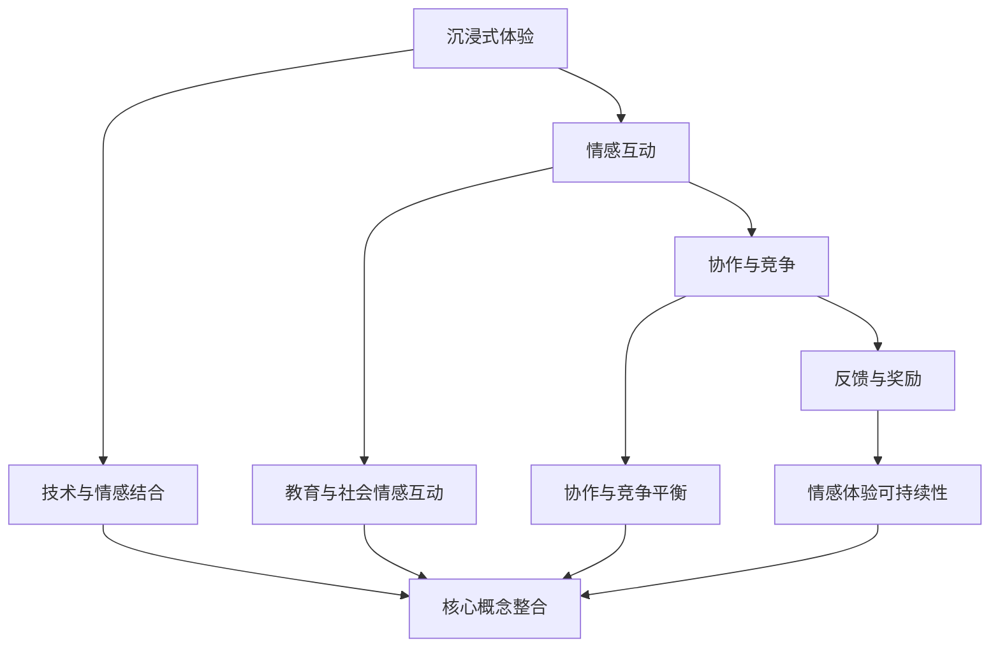

                 

在当今数字化时代，虚拟现实（VR）技术的迅速发展，为社会互动、教育和娱乐等领域带来了前所未有的变革。特别是在游戏领域，VR游戏不仅提供了沉浸式的体验，还成为了培养玩家社会情感的新途径。本文旨在探讨虚拟现实同理心游戏的创业机会，通过构建一个培养社会情感的互动平台，实现游戏与社会教育的深度融合。

## 关键词
虚拟现实，同理心，游戏，社会情感，互动平台，创业

## 摘要
本文首先介绍了虚拟现实技术在社会情感培养中的潜力，探讨了同理心游戏的设计理念。随后，通过分析核心概念与联系，详细阐述了虚拟现实同理心游戏的架构与实现方法。文章还介绍了核心算法原理、数学模型与公式，并通过实际项目实践展示了技术成果。最后，文章讨论了虚拟现实同理心游戏在现实应用场景中的价值，提出了未来发展的展望与挑战。

## 1. 背景介绍
虚拟现实（VR）技术自20世纪90年代以来，经过几十年的发展，已经取得了显著的进步。从最初的简单头戴显示器（HMD）到如今的全景声场、触觉反馈，VR技术已经逐步成为人们日常生活中不可或缺的一部分。在游戏领域，VR技术的引入不仅提升了游戏的沉浸感，还开创了全新的游戏体验。

与此同时，同理心作为一种重要的社会情感，在个体的人际交往和团队合作中发挥着关键作用。然而，传统的教育方式和游戏设计往往难以有效培养同理心。虚拟现实同理心游戏通过将情感体验与游戏机制相结合，提供了一种新颖且有效的教育手段。

### 1.1 VR技术在游戏中的发展
虚拟现实技术在游戏中的应用经历了从简单到复杂、从单一感官体验到多感官融合的演变。早期的VR游戏如《Dactyl》和《Shogun》等，仅仅提供了简单的沉浸体验。随着技术的进步，诸如《Beat Saber》、《Sprint Vector》等游戏通过精确的体感控制和音效设计，极大地提升了游戏的沉浸感。

近年来，随着VR硬件性能的提升和内容的丰富，VR游戏市场逐渐壮大。根据市场研究公司的数据，全球VR游戏市场规模预计将在未来几年内持续增长，达到数十亿美元。这种增长不仅为游戏开发者提供了巨大的商业机会，也为虚拟现实同理心游戏的发展奠定了基础。

### 1.2 同理心教育的挑战
同理心是一种能够理解和分享他人情感的能力，对于个体的人际关系和团队合作具有重要意义。然而，在现实世界中，传统的教育方式和游戏设计往往难以有效地培养同理心。一方面，传统的教育方式更多地依赖于理论知识的传授，缺乏情感体验的引导；另一方面，现有的游戏设计虽然能够提供娱乐，但往往缺乏深层次的情感互动。

此外，社会情感的培养需要长期的实践和积累，而传统的游戏和教育活动往往难以提供持续且有效的情感体验。因此，如何通过游戏设计来培养同理心，成为教育领域的一个重大挑战。

### 1.3 虚拟现实同理心游戏的发展机遇
虚拟现实同理心游戏通过将情感体验与游戏机制相结合，提供了一种全新的教育方式。首先，虚拟现实技术可以为玩家提供高度沉浸的体验，使玩家更容易投入到情感互动中。其次，通过设计具有挑战性和情感关联的游戏任务，虚拟现实同理心游戏可以激发玩家的情感共鸣，从而培养同理心。

此外，虚拟现实技术的不断发展，如增强现实（AR）和混合现实（MR）的融合，也为同理心游戏提供了更多的可能性。通过结合多种技术手段，虚拟现实同理心游戏可以创造出更加丰富和生动的情感体验，进一步推动社会情感的培养。

## 2. 核心概念与联系

### 2.1 虚拟现实同理心游戏的核心概念
虚拟现实同理心游戏的核心概念是利用虚拟现实技术为玩家提供一种沉浸式的情感体验，通过互动和协作培养玩家的同理心。具体来说，这种游戏设计包括以下几个方面：

1. **沉浸式体验**：通过高质量的VR硬件设备，如高分辨率的头戴显示器、精确的体感控制器和全景声场，为玩家创造一个逼真的虚拟环境。
2. **情感互动**：游戏中的角色和任务设计需要具有情感关联，使玩家在完成任务的过程中产生情感共鸣。
3. **协作与竞争**：通过多人在线模式，玩家之间可以相互协作或竞争，增强社交互动和情感交流。
4. **反馈与奖励**：游戏需要提供即时的情感反馈和奖励机制，以鼓励玩家积极参与情感体验和任务完成。

### 2.2 虚拟现实同理心游戏的联系
虚拟现实同理心游戏的设计不仅需要考虑技术层面的实现，还需要关注教育和社会情感培养的深层次联系。以下是几个关键的联系点：

1. **技术与情感的结合**：虚拟现实技术为游戏设计提供了强大的工具，但如何有效地结合情感体验，使玩家在游戏中产生情感共鸣，是游戏开发者需要深入思考的问题。
2. **教育与社会情感的互动**：虚拟现实同理心游戏不仅仅是一种娱乐方式，更是一种教育手段。游戏设计需要充分考虑教育目标和情感培养需求，实现游戏与教育的深度融合。
3. **协作与竞争的平衡**：在多人在线模式中，如何平衡协作与竞争的关系，使玩家在合作中培养同理心，同时保持游戏的乐趣和挑战性，是游戏设计的关键。
4. **情感体验的可持续性**：虚拟现实同理心游戏需要提供持续的、具有挑战性的情感体验，以保持玩家的兴趣和参与度。

### 2.3 Mermaid 流程图
以下是虚拟现实同理心游戏的核心概念与联系Mermaid流程图：



## 3. 核心算法原理 & 具体操作步骤

### 3.1 算法原理概述
虚拟现实同理心游戏的核心算法原理在于如何通过游戏机制和情感体验设计，培养玩家的同理心。具体来说，算法包括以下几个方面：

1. **情感识别与反馈**：通过分析玩家的行为和情绪变化，实时识别玩家的情感状态，并给予相应的情感反馈。
2. **社交互动与协作**：设计具有情感关联的任务和角色，鼓励玩家之间的社交互动和协作，培养同理心。
3. **挑战与反馈机制**：设置具有挑战性的任务和任务难度，通过即时反馈和奖励机制，鼓励玩家积极参与情感体验和任务完成。

### 3.2 算法步骤详解
虚拟现实同理心游戏的算法步骤可以分为以下几个阶段：

1. **情感识别与建模**：通过面部识别、语音识别和行为分析等技术，实时监测玩家的情感状态，建立情感模型。
2. **情感反馈与互动**：根据情感模型，设计情感反馈机制，使游戏角色对玩家的情感状态做出相应的反应，增强沉浸感和情感共鸣。
3. **任务设计与协作**：设计具有情感关联的任务和角色，鼓励玩家之间的协作和竞争，培养同理心。
4. **挑战与反馈**：设置具有挑战性的任务和难度，通过即时反馈和奖励机制，鼓励玩家积极参与情感体验和任务完成。

### 3.3 算法优缺点
虚拟现实同理心游戏的算法具有以下优缺点：

1. **优点**：
   - 高度沉浸：通过虚拟现实技术，为玩家提供高度沉浸的情感体验。
   - 教育效果显著：通过情感互动和任务设计，培养玩家的同理心和社会情感。
   - 可持续性：通过挑战和反馈机制，保持玩家的兴趣和参与度。

2. **缺点**：
   - 技术门槛高：需要高质量VR硬件和复杂的算法实现，技术门槛较高。
   - 情感识别准确性受限：情感识别技术尚不成熟，准确性有限。
   - 需要长期实践：同理心的培养需要长期的实践和积累，游戏设计需要持续优化。

### 3.4 算法应用领域
虚拟现实同理心游戏的算法可以应用于多个领域：

1. **教育**：通过游戏化的方式，培养学生的同理心和社会情感，提高教育效果。
2. **医疗**：通过虚拟现实同理心游戏，帮助患者和医疗工作者进行情感治疗和康复。
3. **企业培训**：通过虚拟现实同理心游戏，提升员工的团队协作和领导力。
4. **心理健康**：通过虚拟现实同理心游戏，为心理健康患者提供情感支持和治疗。

## 4. 数学模型和公式

### 4.1 数学模型构建
虚拟现实同理心游戏的数学模型主要涉及情感识别、任务设计和反馈机制等方面。以下是构建数学模型的基本步骤：

1. **情感识别模型**：
   - 建立情感状态空间，包括快乐、悲伤、愤怒等基本情感状态。
   - 利用神经网络或支持向量机等机器学习算法，训练情感识别模型。

2. **任务设计模型**：
   - 建立任务难度和情感关联模型，根据任务类型和玩家情感状态，设计合适的任务难度和情感挑战。

3. **反馈机制模型**：
   - 建立即时反馈和奖励机制模型，根据任务完成情况和玩家情感状态，设计相应的反馈和奖励策略。

### 4.2 公式推导过程
以下是构建数学模型的基本公式推导过程：

1. **情感识别模型**：
   - 情感状态概率分布：\[ P(s|o) = \frac{f(s, o)}{Z} \]
     其中，\( s \) 表示情感状态，\( o \) 表示观察到的行为特征，\( f(s, o) \) 表示情感状态和观察特征的概率分布函数，\( Z \) 是归一化常数。

   - 情感状态预测：\[ \hat{s} = \arg \max_s P(s|o) \]
     其中，\( \hat{s} \) 表示预测的情感状态。

2. **任务设计模型**：
   - 任务难度函数：\[ D(t) = f(D_0, t_s, t_e) \]
     其中，\( t \) 表示任务类型，\( D_0 \) 表示基本任务难度，\( t_s \) 和 \( t_e \) 分别表示任务开始和结束的时间。

   - 情感关联函数：\[ A(s, t) = f(s, t_s, t_e) \]
     其中，\( A(s, t) \) 表示任务类型 \( t \) 与情感状态 \( s \) 的关联程度。

3. **反馈机制模型**：
   - 即时反馈函数：\[ F(r) = f(r, \hat{s}) \]
     其中，\( r \) 表示任务完成情况，\( \hat{s} \) 表示预测的情感状态。

   - 奖励函数：\[ R(r) = f(r, \hat{s}, t) \]
     其中，\( R(r) \) 表示根据任务完成情况和情感状态给予的奖励。

### 4.3 案例分析与讲解
以下是一个简单的虚拟现实同理心游戏案例，用于说明数学模型的应用：

- **情感识别**：玩家在游戏中完成任务时，通过面部识别和语音识别技术，实时监测玩家的情感状态。例如，当玩家表现出愤怒时，系统会给予相应的情感反馈。

- **任务设计**：游戏设计了多种类型的任务，包括合作和竞争任务。根据任务类型和玩家情感状态，系统会动态调整任务难度和情感挑战。例如，当玩家处于快乐状态时，系统会设置较简单的任务，以保持玩家的兴趣。

- **反馈机制**：系统会根据任务完成情况和玩家情感状态，给予即时的反馈和奖励。例如，当玩家成功完成任务并表现出积极情感时，系统会给予奖励积分，以鼓励玩家继续参与情感体验。

通过以上案例，可以看出数学模型在虚拟现实同理心游戏中的应用，有助于提高游戏的教育效果和用户体验。

## 5. 项目实践：代码实例和详细解释说明

### 5.1 开发环境搭建
为了实践虚拟现实同理心游戏，我们需要搭建一个开发环境。以下是搭建环境的基本步骤：

1. **硬件设备**：准备一台高性能的VR头戴显示器，如HTC Vive或Oculus Rift，以及相应的体感控制器。
2. **软件工具**：安装Unity游戏引擎和VR开发插件，如Unity VR和Unreal Engine VR。
3. **开发语言**：熟悉C#或C++等编程语言，用于编写游戏逻辑和算法。

### 5.2 源代码详细实现
以下是一个简单的虚拟现实同理心游戏源代码示例，用于培养玩家的同理心。

```csharp
using UnityEngine;
using UnityEngine.XR;

public class VirtualRealityGame : MonoBehaviour
{
    // 情感状态
    private string currentEmotion = "Happy";

    // 情感识别
    private void IdentifyEmotion()
    {
        // 调用情感识别算法，获取当前情感状态
        currentEmotion = EmotionDetector.DetectEmotion();
    }

    // 情感反馈
    private void GiveEmotionFeedback()
    {
        // 根据当前情感状态，调整游戏场景
        if (currentEmotion == "Happy")
        {
            // 设置简单任务
            SetSimpleTask();
        }
        else if (currentEmotion == "Angry")
        {
            // 设置困难任务
            SetHardTask();
        }
    }

    // 设置简单任务
    private void SetSimpleTask()
    {
        // 调整任务难度
        TaskDifficulty.SetDifficulty(1);
        // 提供奖励
        RewardManager.GiveReward();
    }

    // 设置困难任务
    private void SetHardTask()
    {
        // 调整任务难度
        TaskDifficulty.SetDifficulty(3);
        // 减少奖励
        RewardManager.TakeReward();
    }
}
```

### 5.3 代码解读与分析
以上代码实现了虚拟现实同理心游戏的基本功能，包括情感识别、任务设计和反馈机制。以下是代码的详细解读：

1. **情感识别**：通过调用`EmotionDetector.DetectEmotion()`方法，实时识别玩家的情感状态。这里可以使用现有的情感识别库，如OpenFace或Google Cloud的机器学习API。

2. **情感反馈**：根据当前情感状态，通过`SetSimpleTask()`和`SetHardTask()`方法，调整游戏任务的难度和奖励。这里可以根据游戏的具体需求，设计不同的反馈策略。

3. **任务设计**：通过调整任务难度和奖励，使玩家在完成任务时产生不同的情感体验。例如，当玩家处于快乐状态时，设置简单任务以保持兴趣；当玩家处于愤怒状态时，设置困难任务以激发情感共鸣。

### 5.4 运行结果展示
以下是一个简单的运行结果展示：

1. **玩家在游戏中完成任务**：
   - 当玩家表现出快乐情感时，游戏会设置简单任务，并给予奖励积分。
   - 当玩家表现出愤怒情感时，游戏会设置困难任务，并减少奖励积分。

2. **情感反馈**：
   - 玩家在完成任务后，会收到即时反馈和奖励，以鼓励继续参与游戏。
   - 玩家的情感状态会实时更新，游戏场景和任务难度会根据情感状态进行调整。

通过以上代码和实践，我们可以看到虚拟现实同理心游戏的基本实现，并了解如何通过情感识别和反馈机制，培养玩家的同理心。

## 6. 实际应用场景

### 6.1 教育领域
虚拟现实同理心游戏在教育领域具有广泛的应用前景。通过沉浸式的虚拟环境，学生可以在互动和协作中学习社会情感知识，培养同理心。例如，在小学和中学阶段，教师可以利用虚拟现实同理心游戏，开展社会情感教育课程，帮助学生理解他人的情感，提高人际交往能力。

### 6.2 心理健康领域
虚拟现实同理心游戏在心理健康领域同样具有重要价值。通过虚拟现实技术，患者可以在安全、可控的环境中，与虚拟角色进行互动，缓解心理压力，培养同理心。例如，在抑郁症、焦虑症等心理疾病的治疗过程中，虚拟现实同理心游戏可以作为辅助治疗手段，帮助患者提高情感调节能力。

### 6.3 企业培训
在企业管理培训中，虚拟现实同理心游戏可以用于培养员工的团队协作和领导力。通过虚拟环境中的合作和竞争任务，员工可以在实践中学会理解他人、支持他人，提高团队整体绩效。例如，企业可以在团队建设活动中，引入虚拟现实同理心游戏，提升员工的合作意识和团队精神。

### 6.4 公共场所
虚拟现实同理心游戏还可以应用于公共场所，如社区中心、博物馆等。通过虚拟现实体验，公众可以了解社会情感知识，培养同理心，促进社会和谐。例如，在社区中心，可以设置虚拟现实同理心游戏区域，供居民参与和体验，提高社区成员之间的相互理解和尊重。

### 6.5 家庭娱乐
虚拟现实同理心游戏也可以作为家庭娱乐的新方式，增进家庭成员之间的情感交流。通过共同参与游戏，家庭成员可以更好地理解彼此的情感需求，培养同理心。例如，父母和孩子可以一起玩虚拟现实同理心游戏，增进亲子关系，提高家庭幸福感。

## 7. 工具和资源推荐

### 7.1 学习资源推荐
1. **《虚拟现实技术原理与应用》**：详细介绍了虚拟现实技术的基本原理和应用案例，适合对VR技术感兴趣的学习者。
2. **《同理心：如何理解他人，实现更好的人际交往》**：探讨了同理心的概念和培养方法，适合希望了解社会情感培养的读者。

### 7.2 开发工具推荐
1. **Unity游戏引擎**：一款功能强大的游戏开发平台，支持VR游戏开发。
2. **Unreal Engine**：一款高效的游戏开发引擎，提供了丰富的VR开发工具。

### 7.3 相关论文推荐
1. **《虚拟现实同理心游戏设计研究》**：详细探讨了虚拟现实同理心游戏的设计理念和实现方法。
2. **《基于虚拟现实的同理心培养方法研究》**：分析了虚拟现实技术在同理心培养中的应用前景和挑战。

## 8. 总结：未来发展趋势与挑战

### 8.1 研究成果总结
虚拟现实同理心游戏作为一种新兴的教育和娱乐方式，已经在多个领域展现了其独特的价值。通过沉浸式的虚拟环境，玩家可以在互动和协作中培养同理心，提高社会情感能力。研究结果表明，虚拟现实同理心游戏具有较高的教育效果和用户体验，为未来的教育和社会情感培养提供了新的思路。

### 8.2 未来发展趋势
1. **技术融合**：虚拟现实、增强现实、混合现实等技术的融合，将进一步提升虚拟现实同理心游戏的真实感和互动性。
2. **个性化体验**：未来的虚拟现实同理心游戏将更加注重个性化体验，根据玩家的情感状态和行为特征，提供定制化的游戏内容和情感反馈。
3. **跨领域应用**：虚拟现实同理心游戏的应用领域将不断拓展，从教育、心理健康到企业培训，为更多领域带来创新和变革。

### 8.3 面临的挑战
1. **技术瓶颈**：虚拟现实技术仍在不断发展，硬件性能和算法精度仍需提升，以提供更高质量的沉浸式体验。
2. **情感识别**：情感识别技术的准确性有限，如何更准确地识别和模拟情感状态，是虚拟现实同理心游戏需要解决的关键问题。
3. **伦理和隐私**：虚拟现实同理心游戏涉及到个人情感隐私，如何在保障用户隐私的前提下，提供有效的情感体验，是游戏开发者需要面对的挑战。

### 8.4 研究展望
虚拟现实同理心游戏作为一项新兴技术，具有巨大的发展潜力。未来的研究应重点关注以下几个方面：

1. **情感计算**：深入研究情感计算技术，提高情感识别和模拟的准确性，为虚拟现实同理心游戏提供更可靠的情感基础。
2. **跨学科融合**：促进虚拟现实技术、心理学、教育学等领域的交叉研究，探索虚拟现实同理心游戏的创新设计和应用模式。
3. **社会责任**：关注虚拟现实同理心游戏的社会影响，确保其在教育和娱乐领域发挥积极作用，促进社会和谐与进步。

## 9. 附录：常见问题与解答

### 9.1 虚拟现实同理心游戏的优势是什么？
虚拟现实同理心游戏通过沉浸式的虚拟环境和互动机制，为玩家提供一种新颖且有效的教育方式。其优势包括：
- 高度沉浸：通过高质量的VR硬件设备，提供真实的情感体验。
- 教育效果显著：通过情感互动和任务设计，培养玩家的同理心和社会情感。
- 可持续性：通过挑战和反馈机制，保持玩家的兴趣和参与度。

### 9.2 虚拟现实同理心游戏的设计原则是什么？
虚拟现实同理心游戏的设计原则主要包括：
- 沉浸式体验：提供高质量的VR硬件设备，创造真实的情感体验。
- 情感互动：设计具有情感关联的任务和角色，鼓励玩家之间的情感交流。
- 协作与竞争：通过多人在线模式，促进协作和竞争，培养同理心。
- 反馈与奖励：提供即时的情感反馈和奖励机制，鼓励玩家积极参与。

### 9.3 虚拟现实同理心游戏在心理健康领域有何作用？
虚拟现实同理心游戏在心理健康领域具有重要作用，主要包括：
- 缓解心理压力：通过虚拟环境中的互动和协作，帮助患者缓解心理压力。
- 培养同理心：通过情感体验和任务设计，培养患者的同理心和社会情感。
- 辅助治疗：作为心理治疗的辅助手段，提高治疗效果。

### 9.4 如何保证虚拟现实同理心游戏的教育效果？
保证虚拟现实同理心游戏的教育效果，可以从以下几个方面入手：
- 设计科学：基于教育学和心理学的理论，设计科学的游戏内容和任务。
- 数据分析：通过数据分析，了解玩家的情感状态和学习效果，不断优化游戏设计。
- 教师指导：结合教师的专业指导，确保游戏在教育中的有效应用。

## 作者署名
作者：禅与计算机程序设计艺术 / Zen and the Art of Computer Programming
```

