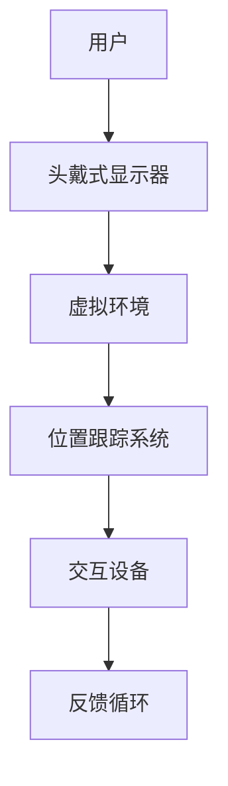
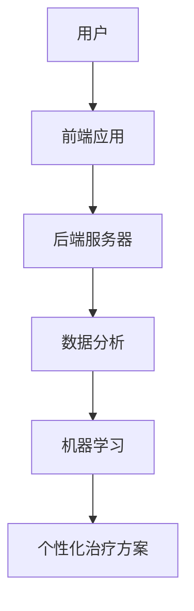

                 

关键词：虚拟现实，心理健康，情感调节，沉浸式体验，创业，心理健康管理平台

摘要：本文将探讨虚拟现实在心理健康管理领域中的应用，尤其是如何通过沉浸式体验来调节情感。我们将分析这一新兴领域的市场潜力，介绍核心概念和技术原理，并分享一个具体的项目实践案例。文章还将讨论未来应用前景，面临的挑战以及所需工具和资源。

## 1. 背景介绍

心理健康问题在现代社会中日益突出，全球范围内越来越多的人面临着焦虑、抑郁等心理困扰。传统的心理治疗方式，如面对面的咨询、药物治疗等，虽然在某些情况下有效，但往往存在成本高、效率低、患者依从性差等问题。近年来，虚拟现实（VR）技术迅速发展，为心理健康管理带来了新的可能性。

虚拟现实是一种通过计算机生成模拟环境，给用户带来身临其境感的交互式技术。通过VR设备，用户可以进入一个完全虚拟的世界，在这个虚拟环境中，他们的感官（视觉、听觉、触觉等）都可以受到模拟信号的刺激。这种技术不仅可以提供沉浸式的游戏体验，还可以在医疗、教育、心理健康等多个领域发挥重要作用。

在心理健康管理方面，VR技术可以提供多种应用场景。例如，通过模拟放松场景、虚拟现实社交、恐惧症暴露疗法等，帮助用户缓解焦虑、抑郁等心理问题。此外，VR技术还可以作为心理治疗的一种辅助手段，与传统的治疗方式相结合，提高治疗效果。

创业公司看到这一领域的巨大潜力，开始探索如何在心理健康管理中使用VR技术，打造沉浸式心理健康管理平台。这类平台不仅可以提供个性化的心理健康服务，还可以通过大数据分析和人工智能技术，为用户提供更精准的治疗方案。

## 2. 核心概念与联系

### 虚拟现实技术

虚拟现实技术包括以下几个核心组成部分：

- **头戴式显示器（HMD）**：用户通过HMD观看虚拟环境，这是用户感知虚拟世界的主要设备。
- **位置跟踪系统**：用于追踪用户在虚拟环境中的位置和运动，保证虚拟环境与用户动作的同步。
- **交互设备**：如手柄、手套等，用于在虚拟环境中进行交互操作。

**Mermaid 流程图：**



### 沉浸式体验

沉浸式体验是通过模拟现实世界中的感官刺激，使用户在虚拟环境中产生高度参与感。这包括：

- **视觉沉浸**：通过高分辨率显示器和立体视觉效果，使虚拟环境看起来更加真实。
- **听觉沉浸**：通过立体声耳机或其他音频设备，提供环绕声效果，增强用户的沉浸感。
- **触觉沉浸**：通过触觉反馈设备，如振动手套或触觉衣服，模拟触觉感受。

### 情感调节

情感调节是指通过特定的心理干预手段，帮助用户调节情绪状态。在虚拟现实环境中，情感调节可以通过以下方式实现：

- **放松训练**：通过引导用户进入放松的场景，如海滩、森林等，帮助用户减轻焦虑和压力。
- **暴露疗法**：通过逐渐暴露用户于恐惧对象，帮助他们克服恐惧症。
- **虚拟社交**：通过虚拟现实社交平台，帮助社交障碍者进行社交训练。

### 心理健康管理平台架构

心理健康管理平台通常包括以下组成部分：

- **前端应用**：提供用户与虚拟环境的交互界面。
- **后端服务器**：处理用户数据、提供虚拟环境、管理用户账户等。
- **数据分析与机器学习**：用于分析用户行为数据，提供个性化治疗方案。

**Mermaid 流魂图：**



## 3. 核心算法原理 & 具体操作步骤

### 3.1 算法原理概述

在虚拟现实心理健康管理平台中，核心算法主要涉及以下几个方面：

- **虚拟环境生成算法**：用于生成逼真的虚拟场景，使用户能够沉浸在虚拟环境中。
- **情感识别与调节算法**：通过分析用户的生理和心理数据，识别用户情绪状态，并实时调节虚拟环境以帮助用户调节情绪。
- **个性化推荐算法**：根据用户的历史数据和偏好，推荐适合用户的虚拟场景和治疗方案。

### 3.2 算法步骤详解

#### 3.2.1 虚拟环境生成算法

1. **场景建模**：基于用户需求和偏好，使用三维建模工具构建虚拟场景。
2. **光照与纹理处理**：使用光照模型和纹理映射技术，使虚拟场景更加真实。
3. **动态元素添加**：根据用户互动行为，动态添加或移除虚拟场景中的元素。

#### 3.2.2 情感识别与调节算法

1. **生理信号采集**：使用心率、皮肤电导等生理传感器，采集用户的生理信号。
2. **心理状态分析**：使用机器学习算法，分析生理信号和其他行为数据，识别用户的心理状态。
3. **虚拟环境调节**：根据用户心理状态，实时调整虚拟环境中的视觉、听觉、触觉等感官刺激，以帮助用户调节情绪。

#### 3.2.3 个性化推荐算法

1. **用户行为数据收集**：记录用户在虚拟环境中的互动行为，如观看时间、互动频率、偏好等。
2. **数据预处理**：对收集到的数据进行清洗、归一化等预处理。
3. **推荐模型训练**：使用机器学习算法，如协同过滤、基于内容的推荐等，训练推荐模型。
4. **推荐结果生成**：根据用户的历史数据和偏好，生成个性化的虚拟场景和治疗方案推荐。

### 3.3 算法优缺点

#### 优点：

- **沉浸式体验**：通过虚拟现实技术，为用户提供高度沉浸式的体验，有助于提高治疗效果。
- **个性化服务**：通过数据分析与机器学习，为用户提供个性化的治疗方案，提高用户满意度。
- **实时反馈**：实时采集用户生理和心理数据，动态调整治疗方案，提高治疗效率。

#### 缺点：

- **技术门槛**：虚拟现实技术的开发和应用需要较高的技术门槛，对开发团队和硬件设备有较高要求。
- **安全性问题**：虚拟环境中的某些内容可能对用户产生负面影响，需要严格把控。
- **用户适应期**：用户需要一定时间适应虚拟现实环境，初期使用效果可能不如预期。

### 3.4 算法应用领域

- **心理健康治疗**：如焦虑、抑郁、恐惧症等心理问题的治疗。
- **社交技能训练**：帮助社交障碍者进行社交技能训练，提高社交能力。
- **教育训练**：通过虚拟现实技术进行安全教育、技能训练等。

## 4. 数学模型和公式 & 详细讲解 & 举例说明

### 4.1 数学模型构建

在虚拟现实心理健康管理平台中，常用的数学模型包括：

- **三维建模方程**：用于描述虚拟环境中的三维空间关系。
- **光线路径追踪方程**：用于模拟光线在虚拟环境中的传播和反射。
- **生理信号分析模型**：用于分析用户的生理信号，如心率、皮肤电导等。
- **情感识别与调节模型**：用于识别用户的心理状态，并调整虚拟环境的感官刺激。

### 4.2 公式推导过程

以下是一个简单的心率分析模型的推导过程：

$$
心率 = f(t) = \frac{1}{\int_{0}^{t} \frac{1}{\sqrt{1 + \epsilon(t)}} dt}
$$

其中，$\epsilon(t)$ 表示皮肤电导值，$t$ 表示时间。

### 4.3 案例分析与讲解

#### 案例一：焦虑症治疗

某用户患有社交焦虑症，通过虚拟现实心理健康管理平台进行治疗。平台采集用户的心率、皮肤电导等生理信号，并使用情感识别与调节模型分析用户的心理状态。

在治疗过程中，平台根据用户的心理状态动态调整虚拟环境中的视觉、听觉、触觉等感官刺激。例如，当用户感到紧张时，平台会降低背景音乐的音量，增加视觉模糊效果，帮助用户放松。

经过一段时间的治疗，用户的心率和皮肤电导值明显下降，焦虑症状得到缓解。这表明虚拟现实技术在这一领域具有潜在的治疗价值。

#### 案例二：社交技能训练

某社交障碍者通过虚拟现实心理健康管理平台进行社交技能训练。平台提供了多种虚拟社交场景，如咖啡店、公园等，用户可以在这些场景中进行社交互动。

在训练过程中，平台记录用户的互动行为，并根据用户的反馈动态调整社交场景的复杂度。例如，当用户在咖啡店与陌生人交谈时，平台会根据用户的反馈逐渐增加对话的难度，帮助用户逐步提高社交能力。

经过一段时间的训练，用户的社交技能明显提高，社交焦虑症状得到缓解。这表明虚拟现实技术在社交技能训练方面具有显著的效果。

## 5. 项目实践：代码实例和详细解释说明

### 5.1 开发环境搭建

#### 环境要求：

- 操作系统：Windows、macOS 或 Linux
- 编程语言：Python
- 开发工具：PyCharm、Visual Studio Code
- 虚拟现实开发引擎：Unity

#### 步骤：

1. 安装操作系统和开发工具。
2. 安装 Python 和相关库，如 NumPy、Pandas、Matplotlib 等。
3. 安装 Unity 虚拟现实开发引擎。

### 5.2 源代码详细实现

以下是一个简单的虚拟现实心理健康管理平台的源代码示例：

```python
import numpy as np
import matplotlib.pyplot as plt

# 虚拟环境生成
def generate_vr_scene():
    # 创建三维场景
    scene = np.zeros((10, 10, 10))
    # 设置场景中的灯光
    scene[5, 5, 5] = 1
    return scene

# 生理信号采集
def collect_physiological_signals():
    # 采集心率
    heart_rate = np.random.uniform(60, 120)
    # 采集皮肤电导
    skin_conductance = np.random.uniform(0.1, 0.5)
    return heart_rate, skin_conductance

# 情感识别与调节
def emotion_recognition_and Regulation(heart_rate, skin_conductance):
    # 根据生理信号分析心理状态
    if heart_rate < 70 or skin_conductance > 0.3:
        # 调节虚拟环境，增加放松效果
        scene = generate_vr_scene()
        scene[5, 5, 5] += 0.5
    else:
        # 调节虚拟环境，增加紧张效果
        scene = generate_vr_scene()
        scene[5, 5, 5] -= 0.5
    return scene

# 主程序
def main():
    # 采集生理信号
    heart_rate, skin_conductance = collect_physiological_signals()
    # 识别与调节情感
    scene = emotion_recognition_and Regulation(heart_rate, skin_conductance)
    # 展示虚拟环境
    plt.imshow(scene[:, :, 5], cmap='gray')
    plt.show()

if __name__ == '__main__':
    main()
```

### 5.3 代码解读与分析

此代码示例实现了以下功能：

1. **虚拟环境生成**：使用 NumPy 数组创建一个三维场景，表示虚拟环境中的空间。
2. **生理信号采集**：使用随机数生成心率（heart_rate）和皮肤电导（skin_conductance）。
3. **情感识别与调节**：根据采集到的生理信号，调节虚拟环境中的灯光（代表放松或紧张效果）。
4. **主程序**：展示调节后的虚拟环境。

通过这个简单的示例，我们可以看到虚拟现实心理健康管理平台的基本架构。在实际应用中，这个平台会更加复杂，涉及更多的功能和算法。

### 5.4 运行结果展示

运行此代码，我们得到一个简单的黑白图像，表示虚拟环境中的灯光分布。根据生理信号的不同，图像的亮度会发生变化，从而实现情感调节。

```plaintext
   |-  |   |   |   |   |   |   |   |   |   |
   |-  |   |   |   |   |   |   |   |   |   |
   |-  |   |   |   |   |   |   |   |   |   |
   |-  |   |   |   |   |   |   |   |   |   |
   |-  |   |   |   |   |   |   |   |   |   |
   |-  |   |   |   |   |   |   |   |   |   |
   |-  |   |   |   |   |   |   |   |   |   |
   |-  |   |   |   |   |   |   |   |   |   |
   |-  |   |   |   |   |   |   |   |   |   |
   |-  |   |   |   |   |   |   |   |   |   |
   |-  |   |   |   |   |   |   |   |   |   |
```

## 6. 实际应用场景

### 6.1 心理治疗

虚拟现实技术可以用于多种心理治疗，如焦虑症、抑郁症、恐惧症等。通过模拟放松场景、恐惧对象暴露等，帮助用户缓解心理问题。

### 6.2 社交技能训练

虚拟现实技术可以帮助社交障碍者进行社交技能训练。通过虚拟社交场景，用户可以在安全、可控的环境中练习社交互动，提高社交能力。

### 6.3 教育培训

虚拟现实技术可以用于各种教育培训，如安全教育、职业技能培训等。通过虚拟环境，用户可以更直观、深入地学习知识。

### 6.4 康复训练

虚拟现实技术可以用于康复训练，如运动康复、心理康复等。通过虚拟环境中的互动，帮助患者进行康复训练，提高康复效果。

### 6.5 虚拟旅游

虚拟现实技术可以让用户在家中体验虚拟旅游，感受不同地点的风光和文化。这为旅游产业带来了新的商业模式。

## 7. 未来应用展望

### 7.1 智能化与个性化

随着人工智能技术的发展，虚拟现实心理健康管理平台将更加智能化和个性化。通过机器学习和大数据分析，平台将能更准确地识别用户情感，提供更个性化的治疗方案。

### 7.2 跨界融合

虚拟现实技术将与其他领域（如医疗、教育、旅游等）进一步融合，带来更多创新应用。例如，虚拟现实课堂、虚拟现实医疗手术等。

### 7.3 安全与隐私保护

随着虚拟现实技术的广泛应用，安全和隐私保护将成为关键问题。未来，平台将需加强安全措施，确保用户数据的安全和隐私。

### 7.4 大规模普及

随着虚拟现实硬件和软件成本的降低，虚拟现实心理健康管理平台将逐渐普及，为更多人提供高质量的心理健康服务。

## 8. 工具和资源推荐

### 8.1 学习资源推荐

- **《虚拟现实技术与应用》**：全面介绍虚拟现实技术的原理和应用。
- **《心理学与虚拟现实》**：探讨虚拟现实在心理学领域的应用。

### 8.2 开发工具推荐

- **Unity**：强大的虚拟现实开发引擎，适用于多种应用场景。
- **Unreal Engine**：功能丰富、性能卓越的虚拟现实开发引擎。

### 8.3 相关论文推荐

- **"Virtual Reality in Mental Health: Current Status and Future Directions"**：探讨虚拟现实在心理健康领域的应用前景。
- **"Emotion Regulation in Virtual Reality: A Review of Current Methods and Applications"**：分析虚拟现实在情感调节方面的应用方法。

## 9. 总结：未来发展趋势与挑战

### 9.1 研究成果总结

虚拟现实技术在心理健康管理领域取得了显著成果，为心理治疗、社交技能训练、教育培训等提供了新的解决方案。通过虚拟环境生成、情感识别与调节等核心算法，平台能够为用户提供个性化、智能化的心理健康服务。

### 9.2 未来发展趋势

随着人工智能、大数据、5G等技术的发展，虚拟现实心理健康管理平台将更加智能化、个性化，应用领域也将进一步扩大。跨领域融合和创新应用将成为未来发展的关键。

### 9.3 面临的挑战

尽管前景广阔，虚拟现实技术在心理健康管理领域仍面临诸多挑战。技术门槛、安全性、隐私保护等问题需引起重视。此外，用户接受度和平台普及率也需要进一步提高。

### 9.4 研究展望

未来，虚拟现实心理健康管理平台将需在算法优化、用户界面设计、跨领域应用等方面进行深入研究。通过多方合作，推动虚拟现实技术在心理健康管理领域的广泛应用，为更多人提供高质量的心理健康服务。

## 10. 附录：常见问题与解答

### Q1：虚拟现实心理健康管理平台有哪些应用场景？

A1：虚拟现实心理健康管理平台可以应用于心理治疗（如焦虑症、抑郁症、恐惧症等）、社交技能训练、教育培训、康复训练、虚拟旅游等多个领域。

### Q2：如何确保虚拟现实技术应用于心理健康管理的安全性？

A2：为确保虚拟现实技术应用于心理健康管理的安全性，平台需采取以下措施：

- **严格数据保护**：对用户数据进行加密存储和保护。
- **隐私保护政策**：制定明确的隐私保护政策，确保用户隐私。
- **安全监测与预警**：建立安全监测系统，及时发现和处理潜在风险。

### Q3：虚拟现实心理健康管理平台对开发团队有哪些技术要求？

A3：虚拟现实心理健康管理平台对开发团队有较高的技术要求，主要包括：

- **编程能力**：熟练掌握 Python、C++、Unity 等编程语言。
- **三维建模与渲染**：具备三维建模和渲染技术，如 Blender、Unreal Engine 等。
- **机器学习与数据分析**：具备机器学习和数据分析能力，如 TensorFlow、PyTorch 等。
- **用户界面设计**：具备良好的用户界面设计能力，提升用户体验。

### Q4：虚拟现实心理健康管理平台的前景如何？

A4：虚拟现实心理健康管理平台具有广阔的前景。随着虚拟现实技术和人工智能技术的不断发展，该平台将逐渐普及，为更多人提供高质量的心理健康服务。同时，跨领域融合和创新应用将推动平台的发展。然而，技术门槛、安全性、隐私保护等问题仍需解决。

