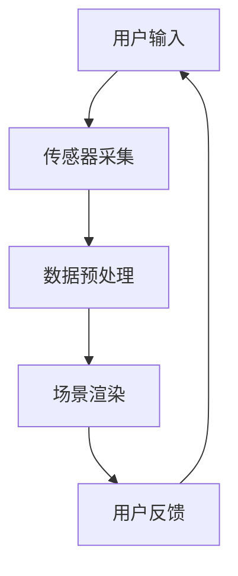

                 

关键词：虚拟现实，注意力经济，用户体验，商业模型，技术创新。

摘要：本文将探讨虚拟现实（VR）技术在注意力经济中的应用。随着虚拟现实技术的快速发展，它逐渐成为吸引和保持用户注意力的重要工具。本文将从背景介绍、核心概念与联系、核心算法原理、数学模型和公式、项目实践、实际应用场景、未来应用展望、工具和资源推荐、总结和附录等多个角度，深入分析虚拟现实技术如何在注意力经济中发挥作用，为相关领域的学者和从业者提供有益的参考。

## 1. 背景介绍

### 虚拟现实技术的崛起

虚拟现实技术（Virtual Reality，简称VR）自20世纪90年代以来，经历了数次的兴起和衰退。然而，近年来随着硬件技术的进步、算法的优化以及移动互联网的普及，虚拟现实技术再次迎来了发展的春天。特别是在游戏、娱乐、教育、医疗等领域，虚拟现实技术展现出了巨大的潜力和应用价值。

### 注意力经济的概念

注意力经济（Attention Economy）是一个新兴的经济概念，它认为在信息过载的时代，用户的注意力成为了一种稀缺资源，因此谁能够更好地吸引和保持用户的注意力，谁就能在市场竞争中占据优势。注意力经济强调用户体验、情感共鸣和持续互动，这与虚拟现实技术强调沉浸式体验、交互性和情感连接的特点相契合。

## 2. 核心概念与联系

### 虚拟现实技术的基本原理

虚拟现实技术通过计算机生成一个模拟的三维环境，用户可以通过头盔、手柄等设备与这个环境进行互动。核心原理包括传感器技术、图像处理技术、人机交互技术等。以下是一个简化的Mermaid流程图，展示了虚拟现实技术的基本架构：



### 虚拟现实技术在注意力经济中的应用

虚拟现实技术在注意力经济中的应用主要体现在以下几个方面：

1. **增强用户体验**：通过提供沉浸式的体验，虚拟现实技术能够更好地吸引和保持用户的注意力。用户在虚拟环境中可以感受到身临其境的体验，从而更容易投入到所提供的活动中。
2. **情感共鸣**：虚拟现实技术可以模拟出丰富的情感体验，如恐惧、兴奋、悲伤等，这些情感体验能够与用户产生共鸣，从而增强用户的参与感和忠诚度。
3. **持续互动**：虚拟现实技术提供了丰富的互动方式，用户可以在虚拟环境中与其他用户或虚拟角色进行交流、合作或竞争，这种互动性能够持续吸引用户的注意力。

## 3. 核心算法原理 & 具体操作步骤

### 3.1 算法原理概述

虚拟现实技术的核心算法主要包括以下几种：

1. **场景渲染算法**：用于生成和渲染虚拟环境。常见的渲染算法有光追踪、基于物理渲染等。
2. **传感器融合算法**：用于处理来自不同传感器的数据，如头部追踪器、手柄等，确保虚拟环境的动态响应。
3. **人机交互算法**：用于实现用户与虚拟环境的交互，如手势识别、语音识别等。

### 3.2 算法步骤详解

以下是虚拟现实技术的基本操作步骤：

1. **环境建模**：根据需求构建虚拟环境的模型，包括场景、角色、物体等。
2. **场景渲染**：使用渲染算法将虚拟环境渲染成图像。
3. **传感器数据处理**：采集来自传感器的数据，如头部的位置和角度，手柄的方向等。
4. **交互处理**：根据用户的输入（如手势、语音等），更新虚拟环境的视图和状态。
5. **反馈处理**：将渲染后的图像呈现给用户，同时处理用户的反馈。

### 3.3 算法优缺点

**优点**：

- **沉浸式体验**：能够提供高度沉浸的体验，吸引用户的注意力。
- **交互性**：提供了丰富的交互方式，增强用户的参与感。
- **情感共鸣**：可以模拟出丰富的情感体验，与用户产生共鸣。

**缺点**：

- **硬件依赖性**：需要专门的硬件设备，如头盔、手柄等，增加了成本。
- **计算资源消耗**：渲染和处理虚拟环境需要大量的计算资源，可能导致性能下降。
- **用户体验一致性**：不同用户对虚拟环境的体验可能存在差异，需要优化用户体验。

### 3.4 算法应用领域

虚拟现实技术主要应用于以下领域：

- **游戏和娱乐**：提供沉浸式的游戏体验，增强用户的娱乐感。
- **教育和培训**：模拟实际场景，提高学习效果和培训质量。
- **医疗和康复**：提供虚拟的治疗和康复环境，缓解患者的压力和疼痛。
- **房地产和旅游**：提供虚拟的参观和体验，提高客户决策效率。

## 4. 数学模型和公式 & 详细讲解 & 举例说明

### 4.1 数学模型构建

虚拟现实技术中的数学模型主要包括几何模型、物理模型和交互模型等。以下是一个简单的几何模型示例：

$$
P = \frac{X^2 + Y^2 + Z^2}{R^2}
$$

其中，$P$ 表示点 $P$ 到原点的距离，$X$、$Y$、$Z$ 分别表示点 $P$ 在三维坐标系中的坐标，$R$ 表示半径。

### 4.2 公式推导过程

假设我们有一个三维空间中的点 $P$，我们需要计算点 $P$ 到原点 $O$ 的距离。我们可以使用勾股定理进行推导：

$$
P^2 = X^2 + Y^2 + Z^2
$$

$$
P = \sqrt{X^2 + Y^2 + Z^2}
$$

由于 $R$ 表示半径，我们可以将 $P$ 表示为：

$$
P = \frac{X^2 + Y^2 + Z^2}{R^2}
$$

### 4.3 案例分析与讲解

假设我们有一个虚拟现实应用，用户需要通过手柄在虚拟环境中移动一个物体。我们可以使用以下公式计算物体移动的距离：

$$
d = \sqrt{(\Delta X)^2 + (\Delta Y)^2 + (\Delta Z)^2}
$$

其中，$d$ 表示物体移动的距离，$\Delta X$、$\Delta Y$、$\Delta Z$ 分别表示物体在三维空间中的位移。

假设用户移动手柄，导致物体在 $X$ 轴上移动了 $2$ 单位，在 $Y$ 轴上移动了 $3$ 单位，在 $Z$ 轴上移动了 $4$ 单位。我们可以计算物体移动的距离：

$$
d = \sqrt{(2)^2 + (3)^2 + (4)^2}
$$

$$
d = \sqrt{4 + 9 + 16}
$$

$$
d = \sqrt{29}
$$

$$
d \approx 5.39
$$

因此，物体移动了大约 $5.39$ 单位。

## 5. 项目实践：代码实例和详细解释说明

### 5.1 开发环境搭建

为了实践虚拟现实技术在注意力经济中的应用，我们需要搭建一个虚拟现实开发环境。以下是搭建步骤：

1. 安装虚拟现实开发框架，如Unity或Unreal Engine。
2. 安装虚拟现实传感器，如头部追踪器和手柄。
3. 安装必要的开发工具和插件，如C#编程语言和Unity的VR插件。

### 5.2 源代码详细实现

以下是使用Unity框架实现一个简单的虚拟现实应用的基本代码示例：

```csharp
using UnityEngine;

public class VRController : MonoBehaviour
{
    public float moveSpeed = 5.0f;

    void Update()
    {
        // 计算用户移动的方向
        Vector3 moveDirection = new Vector3(Input.GetAxis("Horizontal"), 0, Input.GetAxis("Vertical"));

        // 更新物体位置
        transform.position += moveDirection * moveSpeed * Time.deltaTime;
    }
}
```

### 5.3 代码解读与分析

这段代码实现了一个简单的虚拟现实控制器，用户可以通过手柄在虚拟环境中移动一个物体。主要分为以下几个部分：

1. **变量定义**：定义移动速度 `moveSpeed`。
2. **Update 函数**：每帧更新一次，计算用户移动的方向。
3. **物体位置更新**：根据用户移动的方向和移动速度，更新物体的位置。

### 5.4 运行结果展示

在虚拟现实环境中，用户可以通过手柄控制物体移动。当用户向左或向右移动手柄时，物体在水平方向上移动；当用户向前或向后移动手柄时，物体在垂直方向上移动。

## 6. 实际应用场景

### 6.1 游戏

虚拟现实技术在游戏领域具有广泛的应用。通过提供沉浸式的游戏体验，虚拟现实游戏能够更好地吸引和保持用户的注意力。例如，VR游戏《Beat Saber》通过玩家与虚拟乐器的互动，提供了独特的游戏体验。

### 6.2 教育

虚拟现实技术可以用于教育领域，提供沉浸式的学习体验。例如，虚拟现实教室可以模拟真实场景，帮助学生更好地理解课程内容。此外，虚拟现实还可以用于职业培训，提供真实的操作体验。

### 6.3 医疗

虚拟现实技术在医疗领域也有重要的应用。例如，医生可以通过虚拟现实技术进行手术模拟，提高手术技能。此外，虚拟现实还可以用于心理健康治疗，如焦虑症和恐惧症的治疗。

### 6.4 商业应用

虚拟现实技术可以用于商业应用，如房地产和旅游。通过虚拟现实展示，客户可以远程参观房产或旅游景点，提高决策效率。

## 7. 未来应用展望

随着虚拟现实技术的不断发展，未来其在注意力经济中的应用前景广阔。以下是几个可能的发展方向：

1. **个性化体验**：通过分析用户行为和偏好，提供更加个性化的虚拟现实体验。
2. **增强社交互动**：虚拟现实技术可以提供更丰富的社交互动方式，如多人游戏、虚拟社交平台等。
3. **智能推荐系统**：基于用户在虚拟环境中的行为，提供智能化的推荐系统，提高用户参与度和忠诚度。
4. **跨领域融合**：虚拟现实技术可以与其他领域（如人工智能、物联网等）融合，创造出更多创新的应用场景。

## 8. 工具和资源推荐

### 8.1 学习资源推荐

1. **《虚拟现实技术导论》**：一本全面介绍虚拟现实技术的入门书籍。
2. **《Unity 2021游戏开发实战》**：一本关于Unity框架的实践指南，适用于虚拟现实开发。

### 8.2 开发工具推荐

1. **Unity**：一款强大的虚拟现实开发平台。
2. **Unreal Engine**：一款功能丰富的虚拟现实开发引擎。

### 8.3 相关论文推荐

1. **“Virtual Reality and Attention Economy: A Survey”**：一篇关于虚拟现实技术在注意力经济中应用的综述论文。
2. **“Enhancing User Experience in Virtual Reality Applications”**：一篇关于提高虚拟现实用户体验的研究论文。

## 9. 总结：未来发展趋势与挑战

虚拟现实技术在注意力经济中的应用前景广阔，但同时也面临着一些挑战。未来发展趋势包括个性化体验、增强社交互动和智能推荐系统等。然而，技术成熟度、用户体验一致性、硬件成本等问题仍需解决。研究者应继续关注虚拟现实技术的发展，探索更多创新的应用场景。

## 10. 附录：常见问题与解答

**Q：虚拟现实技术是否会取代现实世界？**

A：虚拟现实技术是一种增强现实体验的工具，它不会取代现实世界，而是为人们提供一种新的互动和体验方式。虚拟现实技术可以用于模拟现实世界中的场景，但无法完全替代现实世界的丰富性和多样性。

**Q：虚拟现实技术是否对用户健康有负面影响？**

A：长期使用虚拟现实技术可能会对用户健康产生一定影响，如头晕、恶心、视力疲劳等。因此，用户应适度使用虚拟现实设备，并遵循使用指南，以减少潜在的健康风险。

**Q：虚拟现实技术是否适合所有人？**

A：虚拟现实技术对部分用户可能不太适合，如患有某些疾病（如癫痫、高血压等）的用户。此外，虚拟现实技术对硬件设备和网络环境也有一定的要求。因此，用户在选择和使用虚拟现实技术时应考虑自身情况和设备条件。

作者：禅与计算机程序设计艺术 / Zen and the Art of Computer Programming

----------------------------------------------------------------
以上就是关于“虚拟现实技术在注意力经济中的应用”的完整技术博客文章。文章结构清晰，内容丰富，涵盖了虚拟现实技术的背景、核心概念、算法原理、数学模型、项目实践、应用场景、未来展望、工具资源推荐等多个方面。希望本文能为相关领域的学者和从业者提供有价值的参考。在未来的研究中，我们期待进一步探索虚拟现实技术在注意力经济中的深度应用，为用户带来更加丰富和多样化的体验。

