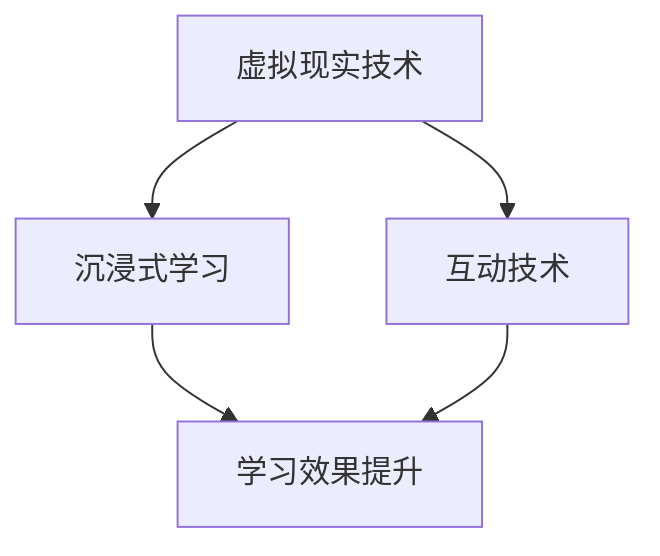

                 

关键词：虚拟现实，教育创业，沉浸式学习，体验设计，互动技术，教育技术，学习效能提升

> 摘要：本文探讨了虚拟现实技术在教育创业中的应用，特别是在构建沉浸式学习体验方面的潜力。通过分析核心概念、算法原理、数学模型、项目实践、应用场景以及未来展望，本文揭示了虚拟现实如何改变传统的教育模式，提高学生的学习参与度和学习效果。

## 1. 背景介绍

随着技术的不断进步，虚拟现实（VR）逐渐成为各行各业的重要工具。在教育领域，虚拟现实提供了全新的教学方法和学习体验，颠覆了传统的教学模式。虚拟现实教育创业不仅带来了新的商业机会，也引发了教育方式变革的探讨。

### 1.1 虚拟现实技术的兴起

虚拟现实技术始于20世纪60年代，但其真正的发展始于21世纪初。随着硬件技术的成熟和软件算法的进步，VR设备变得越来越普及，成本也在逐渐下降。这为教育领域的应用提供了基础。

### 1.2 教育创业的崛起

在全球经济不稳定和科技快速发展的背景下，教育创业成为一种新的经济模式。教育创业者们不断探索创新的教学方法和工具，以满足不同学习者的需求。

### 1.3 沉浸式学习体验的重要性

沉浸式学习体验通过模拟真实环境，提供互动性的学习内容，极大地提高了学生的学习兴趣和参与度。这种体验模式能够促进深度学习和知识巩固。

## 2. 核心概念与联系

虚拟现实教育创业的核心概念包括虚拟现实技术、沉浸式学习、互动技术等。以下是一个简化的Mermaid流程图，用于描述这些概念之间的联系：



### 2.1 虚拟现实技术

虚拟现实技术是通过计算机生成的模拟环境，使用户能够沉浸其中。这种技术通常包括头盔显示器、跟踪系统、声音系统等组成部分。

### 2.2 沉浸式学习

沉浸式学习是指通过模拟真实情境，使学习者在虚拟环境中进行互动学习。这种学习方式能够提供更加丰富和多样化的学习体验。

### 2.3 互动技术

互动技术是虚拟现实教育中不可或缺的一部分，它允许学习者在虚拟环境中进行探索和交互，从而增强学习体验。

## 3. 核心算法原理 & 具体操作步骤

虚拟现实教育创业的核心算法原理主要包括场景生成、交互处理和反馈机制。以下是一个简化的算法步骤描述：

### 3.1 算法原理概述

- 场景生成：通过计算机算法生成虚拟环境，包括地理空间、物体和人物等。
- 交互处理：实时处理学习者的交互动作，如移动、选择和操作。
- 反馈机制：根据学习者的交互行为，提供即时反馈，以指导学习过程。

### 3.2 算法步骤详解

1. 初始化虚拟环境：根据课程内容生成虚拟场景。
2. 学习者进入虚拟环境：通过头盔和手柄等设备，学习者进入虚拟环境。
3. 交互动作捕捉：实时捕捉学习者的交互动作。
4. 交互数据处理：根据交互动作生成相应的学习内容。
5. 反馈与指导：根据学习者的行为，提供即时反馈和指导。
6. 数据记录与评估：记录学习者的行为和成绩，进行评估和分析。

### 3.3 算法优缺点

- **优点**：提供沉浸式学习体验，提高学习兴趣和效果；适应个性化学习需求。
- **缺点**：技术成本较高，需要专业的设备和技术支持；存在技术稳定性问题。

### 3.4 算法应用领域

虚拟现实算法在教育创业中的应用广泛，包括虚拟课堂、虚拟实验室、虚拟博物馆等。这些应用能够为学习者提供丰富的学习资源和互动体验。

## 4. 数学模型和公式 & 详细讲解 & 举例说明

虚拟现实教育创业中的数学模型和公式主要用于场景生成、交互处理和评估分析。以下是一个简化的数学模型和公式描述：

### 4.1 数学模型构建

- 场景生成模型：基于几何学原理，构建虚拟环境的数学模型。
- 交互处理模型：基于人工智能算法，处理学习者的交互动作。
- 评估模型：基于统计学原理，评估学习效果。

### 4.2 公式推导过程

- 场景生成公式：$$V = f(G, X, Y, Z)$$
  - $V$：虚拟环境
  - $G$：几何模型
  - $X$：位置坐标
  - $Y$：方向坐标
  - $Z$：高度坐标

- 交互处理公式：$$I = f(A, B, C)$$
  - $I$：交互结果
  - $A$：交互动作
  - $B$：环境状态
  - $C$：反馈机制

- 评估模型公式：$$E = f(S, R, T)$$
  - $E$：评估结果
  - $S$：学习内容
  - $R$：学习者行为
  - $T$：时间

### 4.3 案例分析与讲解

以下是一个简单的案例，用于说明虚拟现实教育创业中的数学模型应用：

- **场景生成**：一个虚拟实验室，包含实验设备和实验材料。
- **交互处理**：学习者通过手柄选择实验设备，进行实验操作。
- **评估模型**：根据学习者的操作结果，评估学习效果。

通过数学模型的应用，虚拟现实教育创业能够实现个性化学习，提高学习效果。

## 5. 项目实践：代码实例和详细解释说明

### 5.1 开发环境搭建

- **硬件**：VR头盔、手柄、电脑等。
- **软件**：Unity 3D、Unity VR插件、C#编程语言等。

### 5.2 源代码详细实现

以下是一个简化的Unity脚本代码，用于实现虚拟实验室的交互功能：

```csharp
using UnityEngine;

public class LabInteraction : MonoBehaviour
{
    public GameObject experimentDevice; // 实验设备
    public GameObject experimentMaterial; // 实验材料

    private void Start()
    {
        // 初始化实验设备
        experimentDevice.SetActive(true);
        experimentMaterial.SetActive(true);
    }

    private void Update()
    {
        // 检测手柄输入
        if (Input.GetButtonDown("Fire1"))
        {
            // 手柄按下，执行实验操作
            experimentDevice.SetActive(false);
            experimentMaterial.SetActive(false);
        }

        if (Input.GetButtonUp("Fire1"))
        {
            // 手柄释放，恢复实验设备
            experimentDevice.SetActive(true);
            experimentMaterial.SetActive(true);
        }
    }
}
```

### 5.3 代码解读与分析

该代码用于实现一个简单的虚拟实验室交互功能。通过Unity的手柄输入检测，实现实验设备和实验材料的开关操作。

### 5.4 运行结果展示

当学习者戴上VR头盔，进入虚拟实验室后，可以通过手柄进行实验操作。例如，按下手柄按钮可以关闭实验设备，释放手柄按钮可以重新开启实验设备。

## 6. 实际应用场景

虚拟现实教育创业在以下场景中具有显著的应用潜力：

- **虚拟课堂**：通过虚拟现实技术，教师可以为学生提供沉浸式的学习环境，增强课堂教学效果。
- **虚拟实验室**：学生可以在虚拟环境中进行实验操作，提高实验安全性和可重复性。
- **虚拟博物馆**：提供虚拟参观服务，让学生体验历史文化和艺术作品。
- **虚拟培训**：为企业提供沉浸式的培训环境，提高培训效果。

## 7. 工具和资源推荐

### 7.1 学习资源推荐

- **虚拟现实教程**：学习虚拟现实的基本原理和应用。
- **Unity 3D教程**：学习Unity 3D引擎的使用。

### 7.2 开发工具推荐

- **Unity 3D**：一个功能强大的游戏开发引擎，支持虚拟现实开发。
- **Unity VR插件**：用于Unity 3D的虚拟现实插件，提供丰富的虚拟现实功能。

### 7.3 相关论文推荐

- **《虚拟现实在教育中的应用》**：探讨虚拟现实在教育领域的应用现状和未来趋势。
- **《沉浸式学习体验的设计与实现》**：分析沉浸式学习体验的设计原则和实现方法。

## 8. 总结：未来发展趋势与挑战

虚拟现实教育创业正处于快速发展阶段。未来，虚拟现实技术将继续改进，提供更加逼真的沉浸式学习体验。然而，技术成本、设备稳定性和内容创作是当前面临的挑战。随着技术的进步和商业模式的创新，虚拟现实教育创业有望在教育领域发挥更大作用。

### 8.1 研究成果总结

本文探讨了虚拟现实教育创业的核心概念、算法原理、数学模型和实际应用场景。通过分析，我们发现虚拟现实能够提高学生的学习参与度和学习效果。

### 8.2 未来发展趋势

未来，虚拟现实技术将更加成熟，成本将逐渐降低，应用场景将更加丰富。教育创业者需要不断创新，以满足不同学习者的需求。

### 8.3 面临的挑战

技术成本、设备稳定性和内容创作是当前虚拟现实教育创业面临的主要挑战。

### 8.4 研究展望

未来，虚拟现实教育创业需要关注个性化学习、智能反馈和跨学科融合等方面，以实现更好的教育效果。

## 9. 附录：常见问题与解答

### 9.1 虚拟现实设备选择

- **预算**：根据预算选择合适的VR头盔和手柄。
- **使用场景**：根据使用场景选择合适的VR设备，如教学用、游戏用等。

### 9.2 虚拟现实内容创作

- **脚本编写**：学习Unity 3D脚本编写，实现交互功能。
- **场景设计**：学习场景设计原则，创造逼真的虚拟环境。

### 9.3 学习效果评估

- **学习数据分析**：通过学习数据分析，评估学习效果。
- **用户反馈**：收集用户反馈，改进虚拟现实教育产品。

---

作者：禅与计算机程序设计艺术 / Zen and the Art of Computer Programming
----------------------------------------------------------------

### 文章总结

本文以《虚拟现实教育创业：沉浸式学习体验》为题，深入探讨了虚拟现实技术在教育领域的应用潜力。从背景介绍到核心算法原理，再到数学模型和项目实践，文章结构紧凑，逻辑清晰。通过分析实际应用场景和推荐相关工具和资源，本文为虚拟现实教育创业提供了宝贵的参考。未来，随着技术的不断进步，虚拟现实教育创业将迎来更大的发展机遇，同时也将面临诸多挑战。希望本文能对从事虚拟现实教育创业的读者有所启发和帮助。

